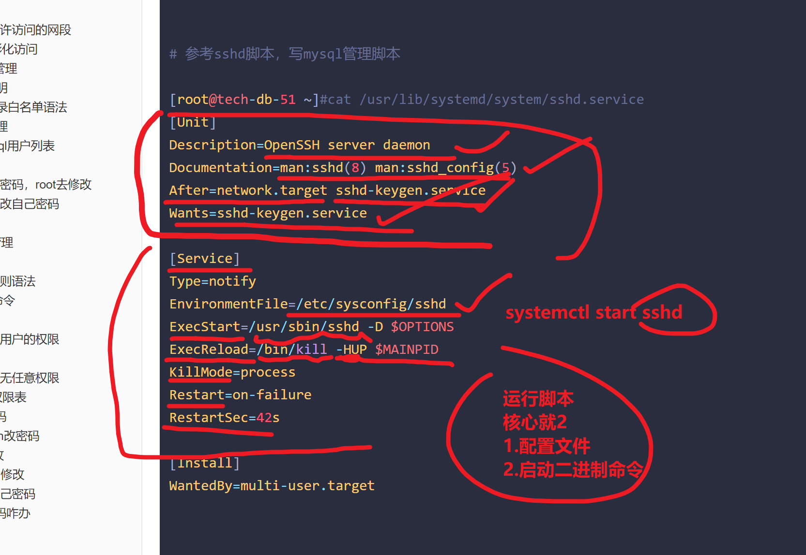

```### 此资源由 58学课资源站 收集整理 ###
	想要获取完整课件资料 请访问：58xueke.com
	百万资源 畅享学习

```
# 02-3-mysql运维核心基础


```bash
mysql多实例登录

mysql c/s模式  ，client  server 两端


mysql客户端
	机器本地的，/opt/mysql/bin/mysql 命令
	windows机器上安装的一个 mysql命令  

mysql服务端
	10.0.0.51:3306   
	mysql -uroot -p密码   -h该账户允许登录的网段    -P实例端口
		2种链接方式
		基于ip：port的 网络链接形式，入口一 ，链接参数 ，-hlocahost    -P3306
            端口，窗口提供服务的入口
                windows机器，去链接 mysql服务端
                本质上是tcp的建立
                netstat 查看网络链接情况
                	# 期望是你windows也装了个mysql，然后去登录
                	windows命令行： mysql -uroot -p密码 -hlocalhost
                	# 远程链接
                	# 前提（默认mysql只提供了localhost登录，）
                	
                	# 授权操作，允许root@10.0.0.% 这个网段登录
                	

                	windows命令行：发请求
                		10.0.0.1 这个windows的ip发出登录请求
                		↓
                    	mysql -uroot -plinux3306 -h10.0.0.51 -P3306
                # 完全理解刷11111
                	

            
            # 完整的登录命令
            mysql -uroot -plinux3306 -hlocahost    -P3306
             
                
                
                
                
        入口二，只能再10.0.0.51这个机器上，机器本地，基于进程套接字文件的链接形式
        	还能用window去用这个方式吗？不能！！！！！
        	
        	#这个命令只能是在10.0.0.51这个机器去执行
        	
        	mysql -uroot -plinux3306 -S /linux3306/mysql_3306/mysql.sock 
			
	
	10.0.0.51:3307
	10.0.0.51:3308
	

mysql登录的俩方式会玩刷2222

# 作为运维，如何给公司的其他人员配置mysql的权限，权限控制，限制
#  给开发装了一个linux的mysql服务端，开发只能再自己的机器上，去写代码，读数据库，增删改查测试
# 运维设置账号，先定权限，去远程链接，允许再什么样的网段中去链接，内网，允许再任意地址，只允许某一个ip去登录。

# 维护的阿里云，测试工程师需要测一份代码，需要有数据库的支撑
# 运维去创建一个测试库，测试账号，给这个测试工程师去用
# ceshi01   ceshi666   123.206.16.61  23306端口

# 看懂，听懂业务场景刷1111

mysql -uceshi01  -pceshi666 -h123.206.16.61 -P23306

# 把报错，截个图，李经理，帮忙看看吧，连不上了。


```


# 1.启动、关闭mysql原理

```
systemctl start mysqld
systemctl stop  mysqld


如果这俩命令，报错了，如何排查
以及你得搞懂mysql启动的进程命令，背后的脚本加载逻辑，执行顺序

管理3306实例的脚本逻辑顺序

1. 脚本放在了 /etc/init.d/mysqld

2. 可以用多种方式使用该脚本

1.给脚本添加执行权限
/etc/init.d/mysqld  start

2. 该方式等于
service mysqld start 

3.centos7上建议写法

systemctl  start mysqld


4. service和systemctl命令都是去读取  /etc/init.d/目录下的脚本mysqld脚本文件

5.再centos7下的加载顺序

/etc/init.d/mysqld
↓
systemctl 去调用
↓
service  转化为systemctl  


# 看懂 /etc/init.d/mysqld 和 service  和 systemctl的 玩法刷111


```

## mysqld_safe和mysqld区别


mysqld_safe作用

```
先看看mysql的安装主程序目录


先用systemctl启动mysql试试，通过 ps命令 ，可以看到进程运行的完整命令和参数


[root@tech-db-51 ~]#yum install -y psmisc


```


```bash
mysqld_safe作用


1. mysql官方启动脚本，是以执行mysqld_safe为入口，其实mysqld_safe也是个shell脚本，调用了myqsld命令启动服务

2.mysqld_safe脚本设置运行环境，如以守护进程运行
3.mysqld_safe检测mysqld运行状态
4.mysqld_safe检测mysqld进程运行信息，写入 mysql实例目录下的hostname.err文件
5.以及mysqld_safe会读取my.cnf配置文件的[mysqld],[mysqld_safe]等配置


mysqld作用

mysqld是mysql的核心程序，用于管理mysql的数据库文件，以及用户执行的SQL请求
mysqld读取my.cnf中 [mysqld]配置


```


## 启动命令区别


```

有3个实例

3306
复制mysql的官方脚本  

入口 >>>>>>   /etc/init.d/mysqld

↓

/opt/mysql/bin/mysqld_safe

↓

mysql主程序命令
/opt/mysql/bin/mysqld


3307

3308


[root@tech-db-51 ~]#bash /linux0224/3307.sh start
Starting MySQL...
[root@tech-db-51 ~]#
[root@tech-db-51 ~]#
[root@tech-db-51 ~]#
[root@tech-db-51 ~]#bash /linux0224/3308.sh start
Starting MySQL...
[root@tech-db-51 ~]#


# 查看3个mysql实例的进程命令


```


# 2.关闭mysql

### 脚本关闭

```

该实例，用什么脚本起的，就用什么脚本关

停止3307


```


### 命令关闭


```
更推荐用这个吧

# 先登录具体实例，然后再关闭
# 3308

# 待会grant就知道了

mysql> shutdown;
Query OK, 0 rows affected (0.00 sec)


#

```


### 特殊情况下，不建议用这个操作

```
直接用kill  pkill  killall

kill pid   # 除非进程卡死，无任何解决办法，再去 kill -9 pid 数据丢失，数据写入，事务提交，确认数据写入到磁盘，写入到日志


pkill   进程名

killall     进程名


直接杀死mysqld的玩法，可能导致下次mysql无法启动，日志会有报错信息


```


### mysql丢失了服务端链接

```
mysql> shutdown;
Query OK, 0 rows affected (0.00 sec)

mysql> 
mysql> select user();
ERROR 2013 (HY000): Lost connection to MySQL server during query
mysql> 
mysql> show databases();
ERROR 2006 (HY000): MySQL server has gone away
No connection. Trying to reconnect...
ERROR 2003 (HY000): Can't connect to MySQL server on '127.0.0.1' (111)
ERROR: 
Can't connect to the server

mysql> select user();
No connection. Trying to reconnect...
ERROR 2003 (HY000): Can't connect to MySQL server on '127.0.0.1' (111)
ERROR: 
Can't connect to the server


```


```
全部实例都挂了

[root@tech-db-51 ~]#systemctl stop mysqld
[root@tech-db-51 ~]#
[root@tech-db-51 ~]#
[root@tech-db-51 ~]#
[root@tech-db-51 ~]#!net
netstat -tunlp
Active Internet connections (only servers)
Proto Recv-Q Send-Q Local Address           Foreign Address         State       PID/Program name    
tcp        0      0 0.0.0.0:22              0.0.0.0:*               LISTEN      1009/sshd           
tcp6       0      0 :::22                   :::*                    LISTEN      1009/sshd           
[root@tech-db-51 ~]#
[root@tech-db-51 ~]#


```


 


# 3.自定义mysqld服务管理脚本




```perl
1.写mysql的运行脚本

1.  如 /linxu0224/3307.sh     
/linxu0224/3307.sh  start
/linxu0224/3307.sh  stop
/linxu0224/3307.sh  restart


2. 写入 /etc/init.d/mysqld
/etc/init.d/mysqld
service 
systemctl 
管理


会玩2222


3. centos7下，写服务管理脚本，参考 ，network脚本等写就行

找到centos7的 system服务脚本在哪，参考语法
#rpm -ql systemd|grep service

[root@tech-db-51 ~]#systemctl status sshd
● sshd.service - OpenSSH server daemon
   Loaded: loaded (/usr/lib/systemd/system/sshd.service; enabled; vendor preset: enabled)


# 参考sshd脚本，写mysql管理脚本

[root@tech-db-51 ~]#cat /usr/lib/systemd/system/sshd.service
[Unit]
Description=OpenSSH server daemon
Documentation=man:sshd(8) man:sshd_config(5)
After=network.target sshd-keygen.service
Wants=sshd-keygen.service

[Service]
Type=notify
EnvironmentFile=/etc/sysconfig/sshd
ExecStart=/usr/sbin/sshd -D $OPTIONS
ExecReload=/bin/kill -HUP $MAINPID
KillMode=process
Restart=on-failure
RestartSec=42s

[Install]
WantedBy=multi-user.target


4. 参考写法，写一个systemctl 管理mysql的脚本

先关闭 /etc/init.d/mysqld脚本的功能
[root@tech-db-51 ~]#mv /etc/init.d/mysqld  /linux0224/mysql_3306/

# 5.写入3306的服务管理脚本

cat > /etc/systemd/system/mysqld.service <<'EOF'
[Unit]
Description=mysql server by www.yuchaoit.cn
Documentation=man:mysqld(8)
Documentation=https://dev.mysql.com/doc/refman/en/using-systemd.html
After=network.target
After=syslog.target
[Install]
WantedBy=multi-user.target
[Service]
User=mysql
Group=mysql
ExecStart=/opt/mysql/bin/mysqld --defaults-file=/etc/my.cnf
LimitNOFILE=5000
EOF


6. 修改3306的配置文件，加入日志参数
[root@tech-db-51 ~]#mkdir -p /linux0224/mysql_3306/logs
[root@tech-db-51 ~]#
[root@tech-db-51 ~]#chown -R mysql.mysql /linux0224/


[root@tech-db-51 ~]#cat /etc/my.cnf 

[mysqld]
log-error=/linux0224/mysql_3306/logs/3306-err.log
port=3306
user=mysql
basedir=/opt/mysql
datadir=/linux0224/mysql_3306/
socket=/tmp/mysql.sock

[mysql]
socket=/tmp/mysql.sock
[root@tech-db-51 ~]#
[root@tech-db-51 ~]##到这看懂1111


7.启动3306，检测日志
# 重载systemctl 的脚本
systemctl daemon-reload

systemctl restart mysqld

systemctl stop mysqld

# 看懂 配置过程111

# 管理mysql的脚本，方式，4种，具体再生产下遇见哪种，都会玩了


```


# 4.配置文件模板

```perl
[root@db-51 ~]#cat /etc/my.cnf 
[mysqld] # 服务端标签
port=3306    # 端口
server_id # 主机编号，用于主从复制
user=mysql    # 内置运行用户
basedir=/opt/mysql    # 软件目录
datadir=/www.yuchaoit.cn/mysql_3306    # 数据目录
socket=/tmp/mysql.sock    # 套接字文件路径

[mysql]
socket=/tmp/mysql.sock    # mysql客户端连接数据库，默认读取的socket文件路径


配置语法
[server]                服务端读取的配置
[mysqld]                mysqld进程读取的配置
[mysqld_safe]        mysqld_safe脚本会加载的配置


客户端配置参数
[mysql]        客户端命令读取的设置
[client]    所有本地客户端读取的设置
[mysqldump]    备份命令读取的设置
```


# 5.远程连接管理学习grant语句


## 本地连接

```
# 授权语句，创建一个用户，只允许本地连接

# 也能实现创建一个用户的作用

grant 权限  on 库.表 to 用户名@'允许登录的网段' identified by '远程登录的用户密码';

# 注意，写localhost 和127.0.0.1是不一样的


/linux0224/mysql_3306/mysql/该实例的用户数据都在这...
/linux0224/mysql_3307/mysql/该实例的用户数据都在这...
/linux0224/mysql_3308/mysql/该实例的用户数据都在这...


# 创建wenjie用户，只允许再机器本地登录mysql 3307实例，给与最大权限，可以增删改查所有库表


# 先登录
[root@tech-db-51 ~]#mysql -uroot -plinux3307 -S /linux0224/mysql_3307/mysql.sock 
mysql: [Warning] Using a password on the command line interface can be insecure.
Welcome to the MySQL monitor.  Commands end with ; or \g.
Your MySQL connection id is 2
Server version: 5.7.28 MySQL Community Server (GPL)

Copyright (c) 2000, 2019, Oracle and/or its affiliates. All rights reserved.

Oracle is a registered trademark of Oracle Corporation and/or its
affiliates. Other names may be trademarks of their respective
owners.

Type 'help;' or '\h' for help. Type '\c' to clear the current input statement.

mysql> 
mysql> grant all privileges   on *.* to wenjie@'127.0.0.1'  identified by 'wenjie666';


```


查看mysql的用户表

```
查看3307实例,
# 你就会玩 3306  3308 实例的，刷6666

1. 登录
[root@tech-db-51 ~]#mysql -uroot -plinux3307 -S /linux0224/mysql_3307/mysql.sock 


2. 先进入mysql库，查看库下的所有表


mysql> show databases;
+--------------------+
| Database           |
+--------------------+
| information_schema |
| mysql              |
| performance_schema |
| sys                |
+--------------------+
4 rows in set (0.00 sec)

mysql> use mysql;

# 查看当前再哪个库

mysql> select database();
+------------+
| database() |
+------------+
| mysql      |
+------------+
1 row in set (0.00 sec)


# 查看当前库下有哪些表，2个语法

# 完整的
mysql> show tables from mysql;

# 简写
mysql> show tables;

# 看懂进入库，查看库下标，完整写法，以及简写，刷111


# 进入mysql库，查看用户表，mysql本身存储的用户，账户密码表


# select 语句，查看表中的数据


```


### 大小写提示

数据库基础知识，不难，就是多，要细心做笔记，帮你大脑记忆


```
# 目前数据库是不区分大小写的。。。。。。。。。。。。。。
# 内置的关键字建议大写，自定义的数据，建议小写


```


```
当前数据库有2个用户可以登录，只能本地登录


select user,host,authentication_string from mysql.user;

root   localhost

wenjie  127.0.0.1

```


本地账号登录

```
# 文杰

[root@tech-db-51 ~]#mysql -uwenjie -pwenjie666 -h127.0.0.1 -P3307
mysql: [Warning] Using a password on the command line interface can be insecure.
Welcome to the MySQL monitor.  Commands end with ; or \g.
Your MySQL connection id is 4
Server version: 5.7.28 MySQL Community Server (GPL)

Copyright (c) 2000, 2019, Oracle and/or its affiliates. All rights reserved.

Oracle is a registered trademark of Oracle Corporation and/or its
affiliates. Other names may be trademarks of their respective
owners.

Type 'help;' or '\h' for help. Type '\c' to clear the current input statement.

mysql> show databases;
+--------------------+
| Database           |
+--------------------+
| information_schema |
| mysql              |
| performance_schema |
| sys                |
+--------------------+
4 rows in set (0.00 sec)

mysql> 


# wenjie账户有最大的权限

```


使用mysql套接字登录


```
# 再加一个用户记录，注意用root添加


grant all privileges   on *.* to wenjie@'localhost'  identified by 'wenjie666';


[root@tech-db-51 ~]#mysql -uwenjie -pwenjie666 -S /linux0224/mysql_3307/mysql.sock
mysql: [Warning] Using a password on the command line interface can be insecure.
Welcome to the MySQL monitor.  Commands end with ; or \g.
Your MySQL connection id is 8
Server version: 5.7.28 MySQL Community Server (GPL)

Copyright (c) 2000, 2019, Oracle and/or its affiliates. All rights reserved.

Oracle is a registered trademark of Oracle Corporation and/or its
affiliates. Other names may be trademarks of their respective
owners.

Type 'help;' or '\h' for help. Type '\c' to clear the current input statement.

mysql> # 看懂666
mysql> 

mysql> # 看懂666
mysql> # 看懂666 ，基于自建的账号，走socket文件登录数据库，本地登录
mysql> 


```


下午2点继续。、。


## ---------------远程连接-----------------


### 关于登录的方式选择

```
1. 本地登录，建议用socket去链接，或者ip:port也行
2. 远程登录，只能走IP:port了

```


### 授权，允许访问的网段

其他机器，登录10.0.0.51的3307的数据库实例


```
# 只允许wenjie用户在 10.0.0.0~255 网段登录，有最大的权限

# 授权语句只能用root去操作

# % 百分号表示一个任意匹配的意思
grant all privileges on *.* to wenjie@'10.0.0.%' identified by 'wenjie666';

#查询mysql的用户表的信息，当前mysql实例，有哪些用户信息

select * from mysql.user; # 默认查询所有的字段

select user,host from mysql.user;


# 再创建一个用户 songlin01 只允许再内网172网段登录mysql

grant all privileges on *.* to songlin01@'172.16.1.%' identified by 'songlin666';


mysql> 
mysql> select user,host  from mysql.user;
+---------------+------------+
| user          | host       |
+---------------+------------+
| wenjie        | 10.0.0.%   |
| wenjie        | 127.0.0.1  |
| songlin01     | 172.16.1.% |
| mysql.session | localhost  |
| mysql.sys     | localhost  |
| root          | localhost  |
| wenjie        | localhost  |
+---------------+------------+
7 rows in set (0.00 sec)

mysql> #grant创建，  select 查看，看懂2222


```


### 试试远程去登录


```perl
# wenjie用户，再10网段的机器登录

# 10.0.0.xxx的机器，能和这个 10.0.0.51:3307确保通信就行

# 留作用windows去登录，查看

--------------------------------------------------


# songlin01用户，只允许再172的内网环境登录 

#172.16.1.xx 的机器，和  172.16.1.51:3307

# 找一个装有mysql的机器，作为客户端测试即可


----------------------------------------------------------------------
# 查看mysql 3307 服务端绑定的ip：port
[root@tech-db-51 ~]#netstat -tunlp|grep 3307
tcp6       0      0 :::3307                 :::*                    LISTEN      4312/mysqld 


# 如果你限制mysql只能再内网访问


```


## navicat图形化访问

```
玩mysql 2方式

1. mysql -uroot -p登录，纯命令行操作，所有的增删改查，都要输入SQL语句。


2. 所有的操作，全是图形化点点点。navicat工具，

wenjie用户，允许再10.0.0.xx网段登录


```


```
至此完成了

1。 再内网环境下的 从 71  >  51  使用songlin01用户

2. 再模拟外网的环境  从windows  > 51  ，用的是 wenjie用户


```


### 查看mysql的tcp链接


# 6.mysql用户管理

## 6.1 用户说明

```
linux 用户
- 登录系统
- 管理文件


mysql用户
- 登录mysql
- 管理mysql的库、表，能管理哪些库，表，以及能做什么梦事
都看grant语句，给的权限了


```


## 6.2 远程登录白名单语法

```
mysql 用户授权语法

远程登录，不在服务端的机器上去登


服务端 10.0.0.51:3307


10.0.0.7机器，去登 51


用户名@'网段白名单'


语法

yuchao@'localhost'  yuchao可以在本地登录（ip:3306），以及socket

yuchao@'10.0.0.10'  yuchao只能在10.0.0.10这个客户端登录
yuchao@'10.0.0.%'   yuchao只能在10.0.0.xx/24网段登录
yuchao@'10.0.0.5%'  yuchao只能在10.0.0.50~59 登录

yuchao@'%'  yuchao可以在任意地址登录该mysql服务端
yuchao@'db-51'   基于主机名的登录限制


```


## 6.3 用户管理

### 查看mysql用户列表

```
# 查看mysql库下的user表的数据
# user 用户名
# host 允许登录的网段白名单
# authentication_string 验证字符串，密码的意思（加密显示的）


select user,host,authentication_string from mysql.user; # 查询


```


### 创建用户

```


# 创建用户切设置密码

create user chaoge02@'localhost' identified by '123';

# 明确区分，关键字和用户数据

CREATE  USER  xinlin01@'10.0.0.71' IDENTIFIED BY  'xinlin666';


# 看懂，创建用户的语法，以及 关键字大写的切换，刷1111


Last login: Fri Jul 29 22:15:15 2022 from 10.0.0.1
[root@zabbix-server-71 ~]#mysql -uxinlin01 -pxinlin666 -h10.0.0.51 -P3307
.Welcome to the MariaDB monitor.  Commands end with ; or \g.
Your MySQL connection id is 22
Server version: 5.7.28 MySQL Community Server (GPL)

Copyright (c) 2000, 2018, Oracle, MariaDB Corporation Ab and others.

Type 'help;' or '\h' for help. Type '\c' to clear the current input statement.

MySQL [(none)]> 
MySQL [(none)]> 
MySQL [(none)]> select user();
+--------------------+
| user()             |
+--------------------+
| xinlin01@10.0.0.71 |
+--------------------+
1 row in set (0.00 sec)

MySQL [(none)]> 
MySQL [(none)]> #看懂6666
MySQL [(none)]> 


```


### 修改用户密码，root去修改

```
# root权限最大的，修改表数据了，修改语法是基于

# 区分关键字用大写给大家表示
# 修改用户xinlin01的密码 为 ，juanwang666


select user,host,authentication_string from mysql.user;

ALTER USER  xinlin01@'10.0.0.71'   IDENTIFIED BY 'juanwang666';


```


### 普通用户改自己密码

```
# 注意修改自己的密码，要进行加密处理

# 需求，让wenjie修改自己的密码为 laoliu666

set password=password('chaoge666');
等于

# 先看这个写法
SET PASSWORD=PASSWORD('新的密码')  # 语法看懂1111

select password('laoliu666');

# wenjie修改自己的密码

SET PASSWORD=PASSWORD('laoliu666')


```


### 删除用户

```
# 用root用户去删除普通用户
# 运维一般创建普通账户，不可能给最大权限
mysql> DROP USER xinlin01@'10.0.0.71';
Query OK, 0 rows affected (0.00 sec)

mysql> 
mysql> select user,host,authentication_string from mysql.user;
+---------------+-----------+-------------------------------------------+
| user          | host      | authentication_string                     |
+---------------+-----------+-------------------------------------------+
| root          | localhost | *19A77E0F06928E313B68F2AAB7756D508846258B |
| mysql.session | localhost | *THISISNOTAVALIDPASSWORDTHATCANBEUSEDHERE |
| mysql.sys     | localhost | *THISISNOTAVALIDPASSWORDTHATCANBEUSEDHERE |
+---------------+-----------+-------------------------------------------+
3 rows in set (0.00 sec)

mysql> 
mysql> # 看懂root，清空了所有的无用账号，刷6666


```


### 配置root远程链接

```
mysql> select user,host,authentication_string from mysql.user;
+---------------+-----------+-------------------------------------------+
| user          | host      | authentication_string                     |
+---------------+-----------+-------------------------------------------+
| root          | localhost | *19A77E0F06928E313B68F2AAB7756D508846258B |
| mysql.session | localhost | *THISISNOTAVALIDPASSWORDTHATCANBEUSEDHERE |
| mysql.sys     | localhost | *THISISNOTAVALIDPASSWORDTHATCANBEUSEDHERE |
| root          | %         | *83F7A15725AF362EF5EAFC16E1F3F97FDAB9B411 |
+---------------+-----------+-------------------------------------------+
4 rows in set (0.00 sec)

mysql> #本地链接root密码是 linux3307  远程链接是chaoge666 ，看懂刷666
mysql> 

```


# 7.grant授权管理

## 权限的作用


```
限制mysql的用户，可以执行哪些SQL语句。

使用grant语句可以创建用户且进行权限控制
限制用户，可以用如下哪些语句

show privileges # 查看权限规则语法


create user
create database

drop 删除语句

alter user 更新数据

更多SQL关键字。。。


[root@tech-db-51 ~]#
[root@tech-db-51 ~]#mysql -uroot -pchaoge666  -h10.0.0.51  -P3307
mysql: [Warning] Using a password on the command line interface can be insecure.
Welcome to the MySQL monitor.  Commands end with ; or \g.
Your MySQL connection id is 35
Server version: 5.7.28 MySQL Community Server (GPL)

Copyright (c) 2000, 2019, Oracle and/or its affiliates. All rights reserved.

Oracle is a registered trademark of Oracle Corporation and/or its
affiliates. Other names may be trademarks of their respective
owners.

Type 'help;' or '\h' for help. Type '\c' to clear the current input statement.

mysql> 
mysql> show privileges


# 用于

grant  给与的权限1,权限2,权限3  on 库.表  to 用户名@允许登录的网段规则  indentified by '密码'；


```


## 查看授权规则语法


```

grant不会用怎么办？


help grant;

语法如下
grant  给与的权限1,权限2,权限3  on 库.表  to 用户名@允许登录的网段规则  indentified by '密码'；


```


## grant授权命令

```
查看所有文档
mysql> help grant;
```


## 授权实践

root默认不允许远程登录，给与权限，允许远程登录

```
GRANT ALL PRIVILEGES on *.* to root@'%'  IDENTIFIED BY 'chaoge666';
```

给一个普通开发者jiaqiang01的账户权限，只能增删改查基本操作，且限定某个数据库，且只允许在内网环境连接。


```
select,update,delete,insert

dev01 库

172.16.1.%

# 创建数据库
# 运维，使用最大的权限账户，
# root@'localhost'
# 查看如下权限表的，是最高权限的root用户


mysql> show grants;
+---------------------------------------------------------------------+
| Grants for root@localhost                                           |
+---------------------------------------------------------------------+
| GRANT ALL PRIVILEGES ON *.* TO 'root'@'localhost' WITH GRANT OPTION |
| GRANT PROXY ON ''@'' TO 'root'@'localhost' WITH GRANT OPTION        |
+---------------------------------------------------------------------+
2 rows in set (0.00 sec)


CREATE DATABASE dev01;

# 创建了jiaqiang01用户，以及授权
# 
GRANT SELECT,UPDATE,DELETE,INSERT ON dev01.*  TO   jiaqiang01@'172.16.1.%'  IDENTIFIED BY 'jiaqiang666';

# 这道题看懂刷666

mysql> select user,host from mysql.user;
+---------------+------------+
| user          | host       |
+---------------+------------+
| root          | %          |
| jiaqiang01    | 172.16.1.% |
| mysql.session | localhost  |
| mysql.sys     | localhost  |
| root          | localhost  |
+---------------+------------+
5 rows in set (0.00 sec)

mysql> # 到这看懂111


```

### 查看具体用户的权限

```
show grants # 查看当前用户的权限信息
mysql> show grants;
+---------------------------------------------------------------------+
| Grants for root@localhost                                           |
+---------------------------------------------------------------------+
| GRANT ALL PRIVILEGES ON *.* TO 'root'@'localhost' WITH GRANT OPTION |
| GRANT PROXY ON ''@'' TO 'root'@'localhost' WITH GRANT OPTION        |
+---------------------------------------------------------------------+
2 rows in set (0.00 sec)


select user,host from mysql.user;

show grants for  用户@'网段';             查询具体用户的权限

# 如何查看jiaqiang01的权限

show grants for jiaqiang01@'172.16.1.%';
mysql> # 到这看懂111
mysql> show grants for jiaqiang01@'172.16.1.%';
+--------------------------------------------------------------------------------+
| Grants for jiaqiang01@172.16.1.%                                               |
+--------------------------------------------------------------------------------+
| GRANT USAGE ON *.* TO 'jiaqiang01'@'172.16.1.%'                                |
| GRANT SELECT, INSERT, UPDATE, DELETE ON `dev01`.* TO 'jiaqiang01'@'172.16.1.%' |
+--------------------------------------------------------------------------------+
2 rows in set (0.00 sec)


```

## 回收权限

```
# grant授权的语句

# 移除jiaqiang01  对dev01库下的所有表的 delete 权限

# 大写语法
REVOKE DELETE ON dev01.* from jiaqiang01@'172.16.1.%'  ;


# 移除所有权限，针对dev01这个库

REVOKE ALL  ON dev01.* from jiaqiang01@'172.16.1.%'  ;


show grants for jiaqiang01@'172.16.1.%';

# 此时jiaqiang01用户只剩下登录权限了
mysql> 
mysql> show grants for jiaqiang01@'172.16.1.%';
+-------------------------------------------------+
| Grants for jiaqiang01@172.16.1.%                |
+-------------------------------------------------+
| GRANT USAGE ON *.* TO 'jiaqiang01'@'172.16.1.%' |
+-------------------------------------------------+
1 row in set (0.00 sec)


# 使用jiaqiang01用户登录
[root@tech-db-51 ~]#mysql -ujiaqiang01 -pjiaqiang666 -h172.16.1.51 -P3307


```


## 只有账户、无任意权限

该账户只能登录

```
mysql> show grants for jiaqiang01@'172.16.1.%';
+-------------------------------------------------+
| Grants for jiaqiang01@172.16.1.%                |
+-------------------------------------------------+
| GRANT USAGE ON *.* TO 'jiaqiang01'@'172.16.1.%' |
+-------------------------------------------------+
1 row in set (0.00 sec)


```


## privileges权限表

```

```


# 8.修改root密码

下次补充。。。


## Mysqladmin改密码


## set语句修改


## update语句修改


## 用户修改自己密码


# 9.忘记root密码咋办

```

```


# 作业练习

> mysql知识量大，需要记忆的多
>
> 做好笔记，思维脑图
>
> 就能学好了。


```
0. 周末，看博客，自己完成剩余的 修改密码的 SQL练习。
http://ebook-p5.apecome.com/DBA%E4%B9%8B%E8%B7%AF/02-3-mysql%E8%BF%90%E7%BB%B4%E6%A0%B8%E5%BF%83%E5%9F%BA%E7%A1%80.html#%E6%9F%A5%E7%9C%8Bmysql%E7%94%A8%E6%88%B7%E5%88%97%E8%A1%A8

1.完成mysql远程连接的命令整理，grant语句整理


2. 实际案例练习

3306实例
创建三个普通账号，授权练习
1. 运维账号给与最大权限，允许远程连接
2.开发账号，只能对开发库有增删改查权限，只允许在10，172两个网段连接
3.测试账号，只能对测试库增，改，查的权限，且只允许在172内网连接。


3307实例，安装jpress博客，且可以navicat远程访问

在阿里云部署mysql5.7.28 ，修改默认端口为23306，防止数据库被恶意扫描，以及jpress，确保可以navicat，和cmd远程访问


```


