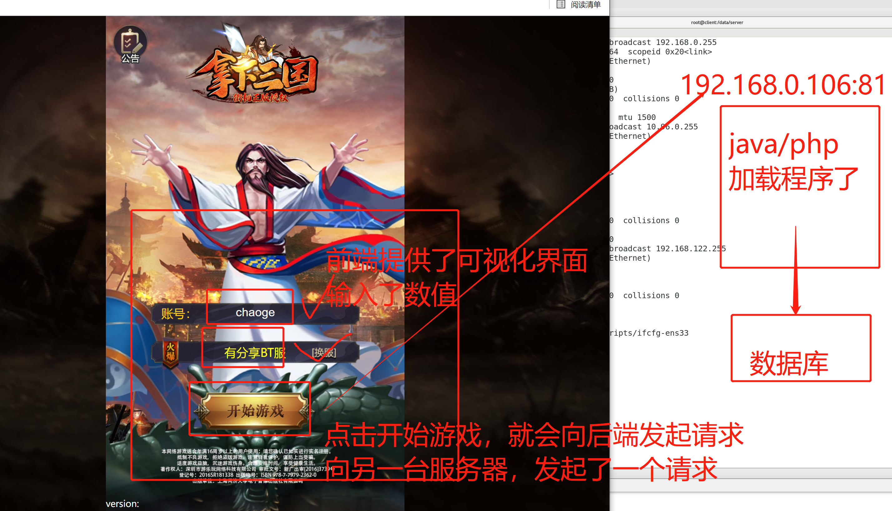
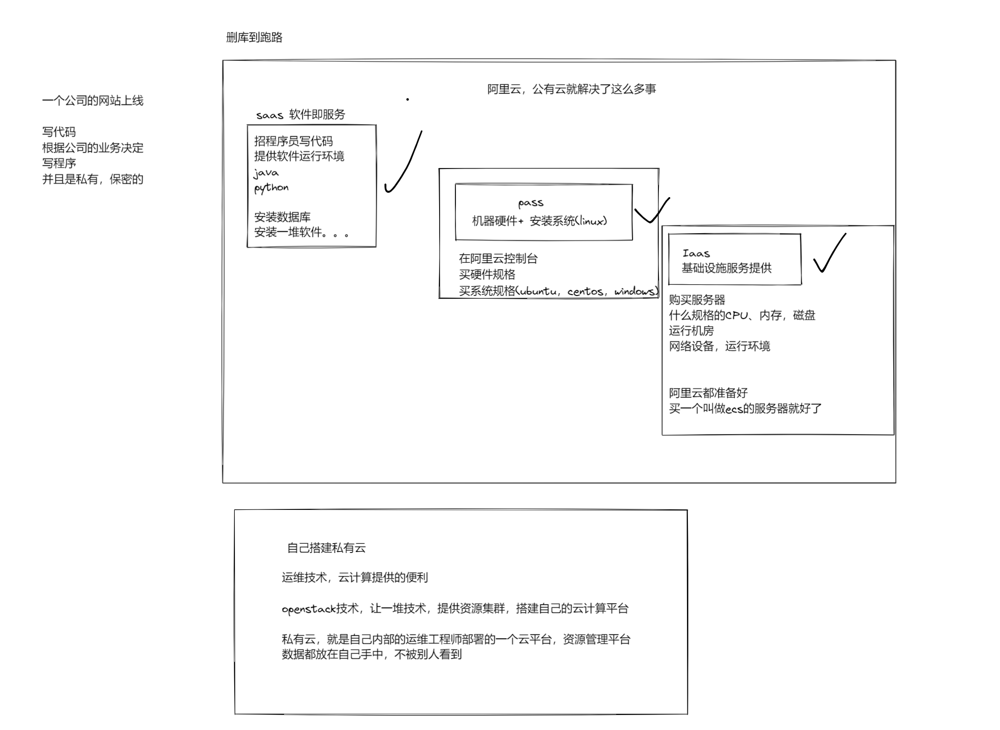

```### 此资源由 58学课资源站 收集整理 ###
	想要获取完整课件资料 请访问：58xueke.com
	百万资源 畅享学习

```
# 上课须知

> 1.上课的软件

- 笔记软件
  - typora 记录markdown语法的文本编辑器
  - 


通讯录

于超  1110-110101  

# 教你如何搭建游戏私服

看看运维的操作。。


> 网页游戏 
>
> browser/ server
>
> 浏览器 / 服务器 
>
> www.4399.com
>
> www.taobao.com ，服务端更新了，
>
> www.jd.com
>
>  

1.服务端，有一个企业，部署了一个游戏网址，  4399.com，企业只需要开发一个服务端，其他事很简单了

2.客户端，打开浏览器，输入www.4399.com (129.211.129.109)

3.客户端的浏览器就看到了游戏画面，游戏体验，氪金，充钱。。。


> 客户端游戏，app
>
> client(app，客户端应用程序的)  /  server  
>
> 王者荣耀 
>
> 1.装一个腾讯提供的王者客户端（客户端要更新，载入新的代码）
>
> 2.腾讯的王者服务端，要运行中（代码更新了，增加一个英雄）
>
> 微信app
>
> 智能遥控机器人 app


## 游戏部署步骤

1.先准备好（淘宝源码）游戏源码（自己开发，还是去找，还是去买）

2.自己本地测测代码，是否有bug（游戏缺陷）

3.买服务器（买一个dell实体服务器  18w，买云服务器  500/月 ）

4.买域名（www.yuanlai0224.com）（ip地址：192.168.0.240）

5.上传游戏源码到服务器中

6.通过一顿猛如虎的操作，将代码运行起来

7.用户可以通过浏览器访问，www.yuanlai0224.com


> 部署

1.源码准备好了（从互联网找的）

2.准备服务器（vmware 软件(虚拟的机器，只是帮你虚拟出了内存，cpu，磁盘)+centos(linux系统)


3.上传游戏到这个vmware中


cpu未开启虚拟化功能，无法开机

docker虚拟化工具 （删掉，关掉它的虚拟化功能）

 vmware 对冲 (无法开机)

> vmware使用，鼠标的切换

- 点进去虚拟机之后，鼠标没法用了，执行ctrl + alt键 即可调出鼠标

1.vmware开机了，系统跑起来了

2.代码上传到linux中（涉及大量的linux命令操作）

3. 代码解压缩，代码配置文件修改，启动服务
4. 检查应用程序是否运行
5. 利用虚拟机的快照功能（保存了一个可以访问的服务器）


6. 告诉老百姓，客户端，游戏可以访问了

7.访问这个机器的ip地址即可，找到这个机器就行

> 通过机器的ip+端口，即可访问到，网站的某一个功能
>
> 192.168.0.106:81


---





## 在线课件是如何部署的

把一堆文本资料，放到linux上，放到一个机器上，通过文件展示的功能，让客户端可以访问。

>通过nginx这个工具，部署的网站
>
>linux/windows

### Linux运维人员的核心职责

- 网站数据不能丢
- 网站7*24小时运转(通过监控手段+人工运维+微信通知+短信通知)
- 提升用户体验，访问速度要快


# 公有云，私有云



# 运维在网站里的作用


javascript  前端编程语言

java 


周杰，  周杰伦的关系


https://m.huya.com/

https://huya.com/

网页会根据用户请求的http信息，判断你是电脑的用户，还是手机端，ipad移动端的用户

浏览器打开f12，打开开发者界面，可以调试浏览器的 信息

## 关于网站适配pc和移动的过程（听懂即可）


# 今日作业


- 解释我们正在使用哪些互联网行业的软件，移动端？PC端？
- 解释你学习的linux运维与互联网行业有什么联系？
- 解释你对Linux运维的理解？
- 解释你对前端、后端、运维的理解？
- 解释你理解的网站和运维的关系？
- 安装好vmware + linux(centos)，周末预习下一章的知识点。


