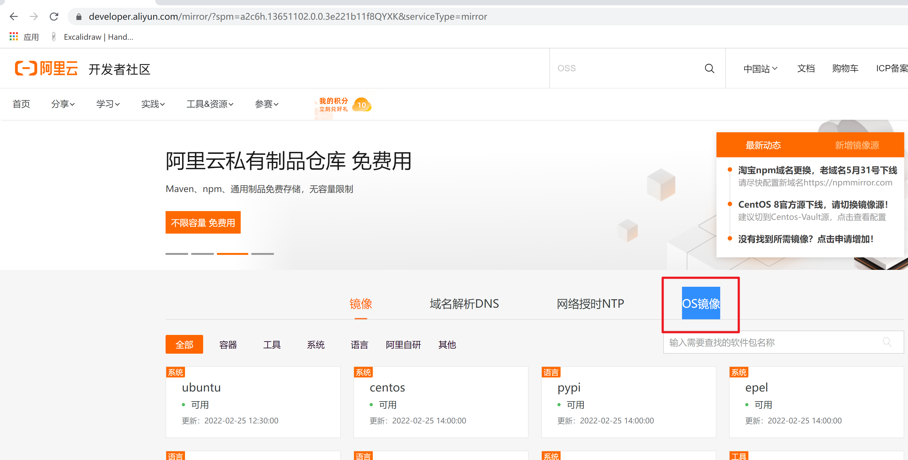

```### 此资源由 58学课资源站 收集整理 ###
	想要获取完整课件资料 请访问：58xueke.com
	百万资源 畅享学习

```
# vmware的安装


## 安装vmware(虚拟机软件)

1.没装过的，跟我一起装即可

2.已经装好了，电脑上有其他版本的vmware，跳过此步骤

> vmware激活码
>
> ZF3R0-FHED2-M80TY-8QYGC-NPKYF
> YF390-0HF8P-M81RQ-2DXQE-M2UT6
> ZF71R-DMX85-08DQY-8YMNC-PPHV8

3.建议！！

安装完毕vmware后，重启机器！！否则可能导致虚拟机无法开机！！


## 安装centos 

1.准备好系统镜像文件，

xx.iso 以iso后缀结尾的 镜像文件

阿里云提供的各种镜像下载的地址

https://developer.aliyun.com/mirror/




>选择dvd的centos镜像 ，下载链接是
>
>https://mirrors.aliyun.com/centos/7.9.2009/isos/x86_64/CentOS-7-x86_64-DVD-2009.iso

## 安装全流程


---


---


---


给虚拟机分配硬件资源，根据你的笔记本情况来定，这个机器要运行什么程序


---


---


---


---


---


---


---

最后配置也可以修改，也可以直接开机


## 开始装centos

前提是 vmware装好了，设置好了

开始安装

选择语言


---


---


---


---


---


> 你的ip肯定和我不一样，以你的机器，显示的为准。


---


---


等待安装完毕， 重启即可。。。


---


---


时区


创建个用户


```
普通用户
yuanlai
yuanlai666
```

使用linux中的火狐浏览器


