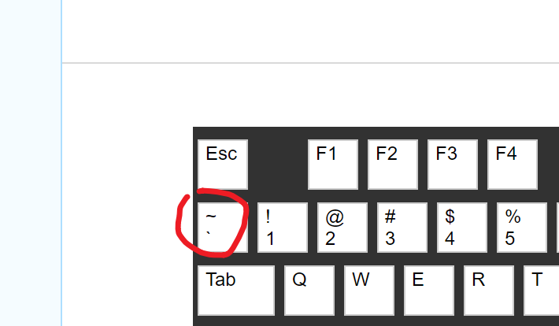

```### 此资源由 58学课资源站 收集整理 ###
	想要获取完整课件资料 请访问：58xueke.com
	百万资源 畅享学习

```


需要你学习markdown语法

待会我给大伙找一个笔记语法文档，参考，慢慢用即可。。。

固定的用法，特殊符号


如下是填入代码格式，不会识别特殊语法的框，用法是输入 ，三个 点啊，如下图




```
​```   会打开一个代码框

标题用法
# 我是一号标题
## 我是二号标题
### 我是三号标题


如果什么符号也不加，是普通文本

一般用于把代码，字符引用起来，。    `hello world`


**基尼太美**  字体加粗

斜体，  *爱的魔力转圈圈*


>你想写的内容     作用一般是写一个提示信息

   


```


# 我是吴彦祖


## 你啥也不是


### 我看你像蔡旭困


`基尼太美`...真美，  hello world


基尼太美

**基尼太美**

*爱的魔力转圈圈*


> 对面的男孩看过来


