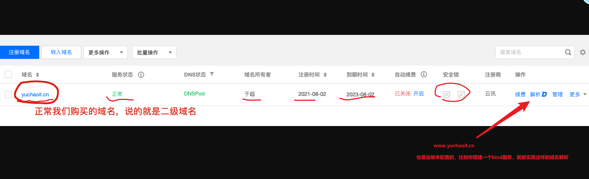

```### 此资源由 58学课资源站 收集整理 ###
	想要获取完整课件资料 请访问：58xueke.com
	百万资源 畅享学习

```
# 上节内容回顾

> 配套笔记
>
> 在线博客地址：
>
> http://apecome.com:9494/

每天都有作业，优秀作业分享，

运维是什么

> 云计算运维是什么
>
> 思考，传统运维，被云计算改变了什么？角度思考。

（他现在是网络工程师，但是他要来学云计算运维，为什么？）

> 赵阳阳：
>
> 传统运维，这个网工，要在机房呆的久，很累
>
> 王仁刚：
>
> 有了云计算，就不需要网工了？

运维和网站的关系


# 今日内容

# 服务器基础知识

# ip地址查看

windows的查看ip的命令是

图形化版本


---


> 问题，我是一个运维，我需要知道手里管辖的400台机器，的所有的硬件信息(半天内)，`比如ip地址`，获取到，放入一个excel，领导要做报表。
>
> 解决思路？
>
> 1. ping 命令，挨个ping，通了就是活着，没毛病 （跑题了） ×
> 2. 阳阳，写脚本，比如咱ip是有规律的， 192.168.xx.xx  ，写脚本，循环的去ping，存活表示是可用的，就给记录下来，写入文本内。
> 3. 让你们大家所有人，看一下自己的IP，然后主动上报给我。
> 4. 
>
> 


问题是，你们的ip是否会变化，以及我让你们每个人，耗费那么多人力来操作，费劲不？

自动化可以全部解决这些问题


## 自动化技术的应用


# ip的学习


# 关于局域网，NAT的概念

> 公网，局域网的概念，以及路由器帮你做了`网络地址转换`

运维，不像写代码，纯靠动脑，靠逻辑，不断的写，写，写

运维，网站能部署起来，就行。


# 特殊IP

普通ip地址

分为两段

```
网络地址 + 主机地址
192.168.0.     14
```

> 俩特殊ip
>
> 每一个机器，会有三种ip形式

- 127.0.0.1
- 0.0.0.0
- 具体的网卡地址，192.168.0.140 
  - *网卡可能有多块，就表示，这个机器会有多个IP*
  - 那你的程序，发布在哪一个ip呢？
  - 用户应该访问你哪一个ip:port 呢？


# 一个博客服务的运行


# 关于特殊ip的总结


# 域名的作用

192.168.0.114

123.206.16.61

14.58.88.150  


www.taobao.com  购物网

www.jd.com ，   京东官网

cdn.api.jd.cn      非权威，只知道，是中国的域名 .cn .china

yuanlai.edu  ，教育网

www.yuchao.top ，个人网址性质


www.4399.game    游戏相关的网址

域名的好处


```
C:\Users\yu>ping baidu.com

正在 Ping baidu.com [220.181.38.251] 具有 32 字节的数据:
请求超时。
来自 220.181.38.251 的回复: 字节=32 时间=7ms TTL=49

在讲师机上，访问的百度，拿到的域名解析ip是  220.181.38.251

```


```
换一个机器，再访问百度，查看拿到的ip是什么

```


域名的作用是

> 好记忆，自动解析到服务器的ip（服务器的ip可能是动态变化的）

# 域名的规则

www.yuchaoit.cn和yuchaoit.cn的关系是？

- 是一样的，只不过添加了一个域名的免费解析记录
- 花钱买的域名是 yuchaoit.cn

直接访问taobao.com和www.taobao.com区别是？

```
浏览器访问 taobao.com之后，拿到的完整域名是什么？
https://www.taobao.com/

这个就是运维配置的，域名重写机制，淘宝服务器自动判断，用户只要访问的是 taobao.com
自动url重写机制  nginx部署的功能

taobao.com
www.taobao.com

https:// 让你的网站数据通信更安全，是加密处理的


http开头的就是普通的网络通信协议，数据是非加密的
http://192.168.0.100:4000


```


# 域名的解析配置




域名的结构，分级


dot 点   

taobao.com  


表示非盈利组织，表示开源组织的 org域名


比如python程序员，组织的官网  python.org

比如linux程序员，维护的官网


维护dns系统

域名，可以是在公网中，解析到的

也可以是企业内部自己用的


超哥的游戏公司


yuchao.game

api1.yuchao.game

crm.yuchao.game

关于域名的结构


https的作用，是让公网，信任你的服务器，是安全可靠的，只要你买的证书是合法的

https://www.yuchaoit.cn/

你分享这个连接，到了微信群聊，用户直接点开，有https是可访问的，无，则打不开


关于超哥的个人站点，域名和ip的解析关系如下

```
[C:\~]$ ping yuchaoit.cn

正在 Ping yuchaoit.cn [123.206.16.61] 具有 32 字节的数据:
来自 123.206.16.61 的回复: 字节=32 时间=6ms TTL=54
来自 123.206.16.61 的回复: 字节=32 时间=7ms TTL=54


[C:\~]$ ping  www.yuchaoit.cn

正在 Ping www.yuchaoit.cn [123.206.16.61] 具有 32 字节的数据:
来自 123.206.16.61 的回复: 字节=32 时间=7ms TTL=54


[C:\~]$ ping  sub.yuchaoit.cn

正在 Ping sub.yuchaoit.cn [123.206.16.61] 具有 32 字节的数据:
来自 123.206.16.61 的回复: 字节=32 时间=6ms TTL=54


```

yuchaoit.cn

www.yuchaoit.cn

 sub.yuchaoit.cn

# 关于腾讯云做的域名解析


我们也可以自己搭建，linux的域名解析服务（bind）


# 端口是什么

端口号，怎么用，就是 `ip:port`

就是ip先定位到机器，端口号，定位到软件服务


192.168.0.150:80


192.168.0.150:22


123.206.16.61:22

123.206.16.61:56717


## 图解端口


看看端口怎么用

```bash
1.先看，80端口怎么用，80 和443 绑定在一块的，   80  http端口  443 https端口

https://www.yuchaoit.cn:443

停止443端口，即表示，停止端口服务

```


```
判断网站是否存活

1. 看它的ip是否存活，    ping  yuchaoit.cn (解析为ip地址)

2.判断出是它的端口挂了（）

```

辛苦兄弟们了，下课干饭。

2.40回教室。

下午完成作业（好好消化吸收）


