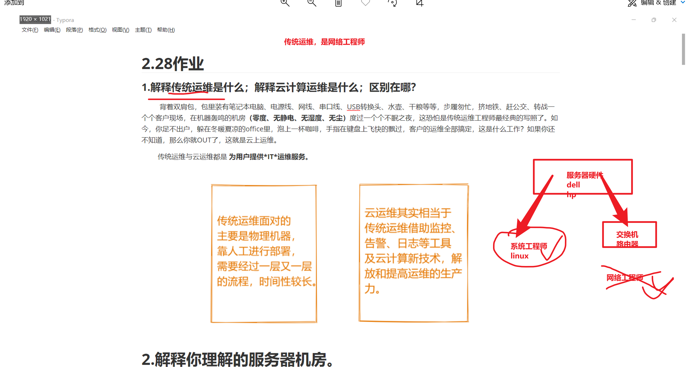
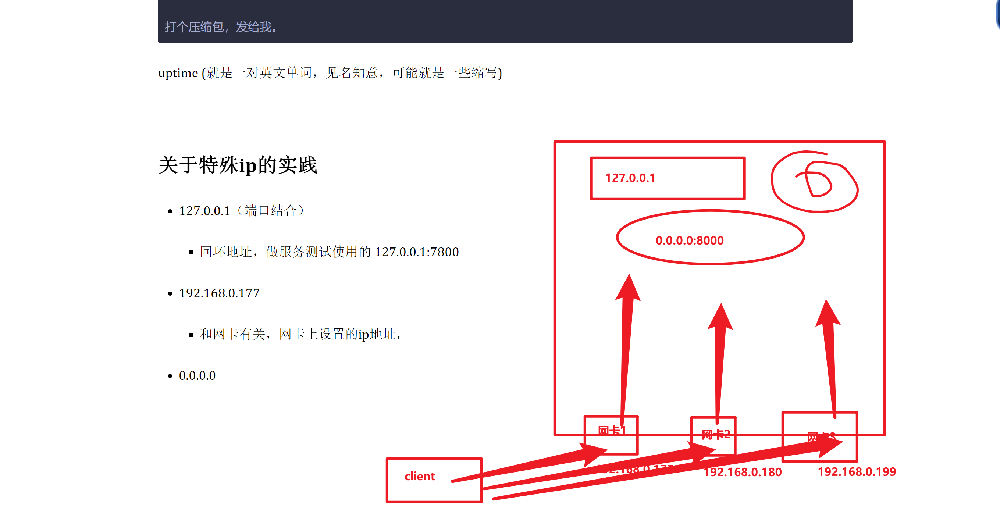
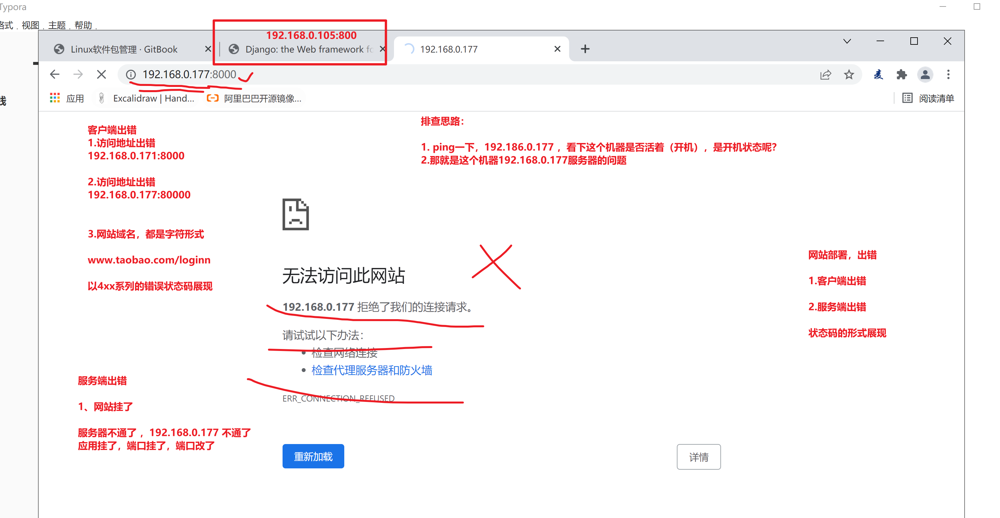
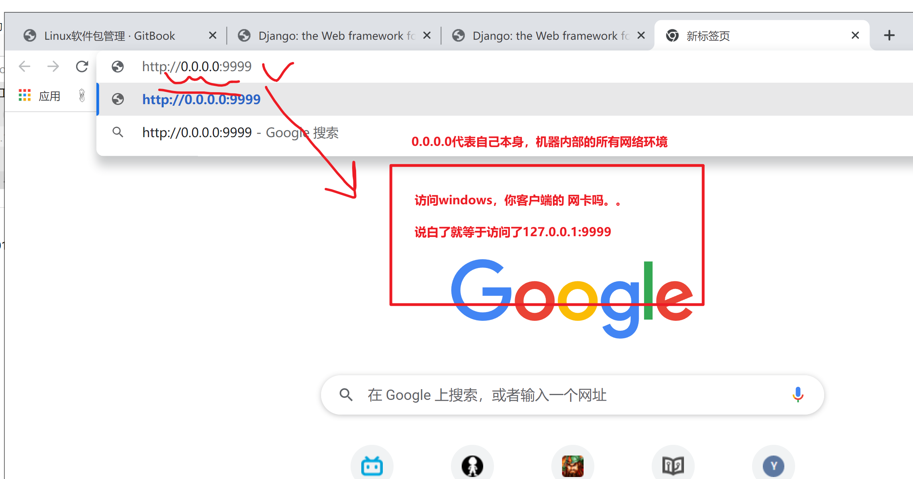
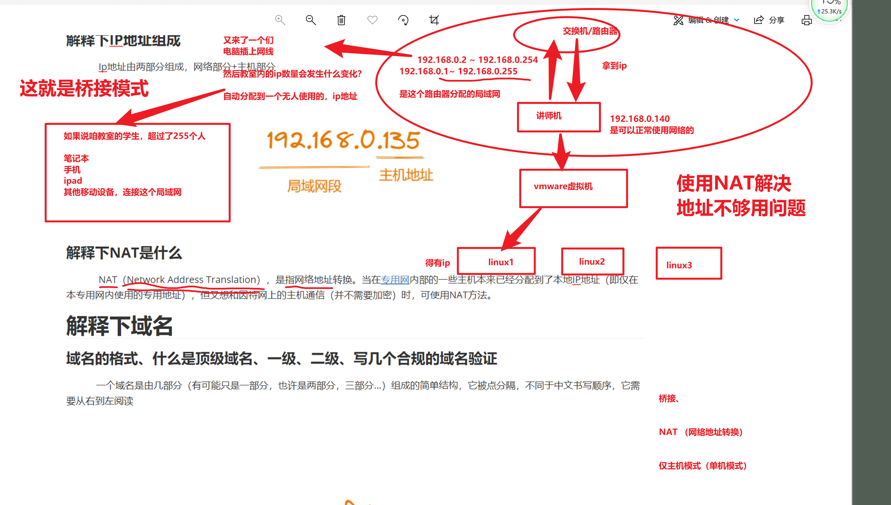
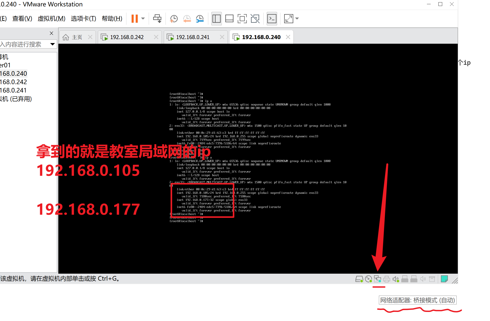
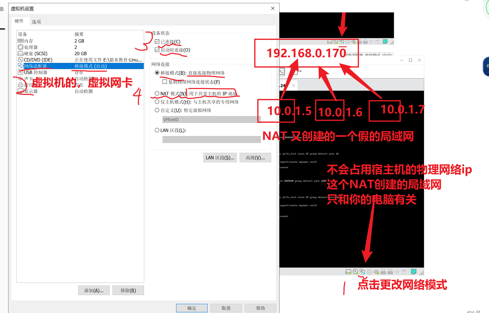
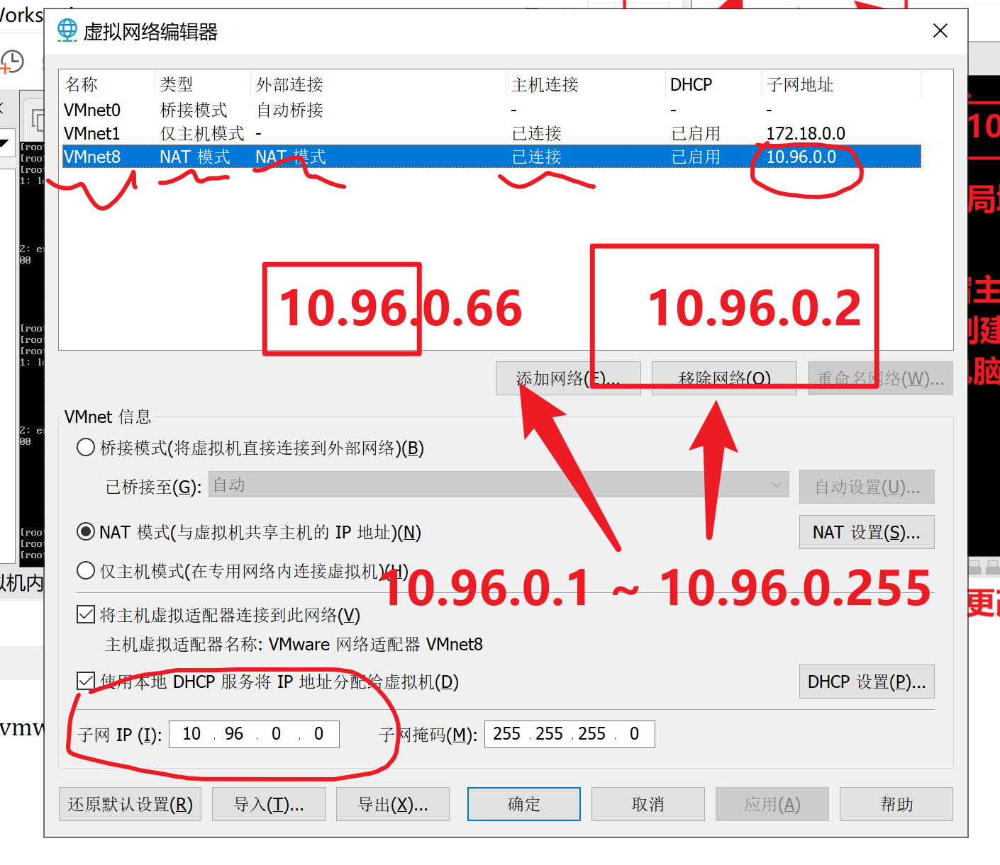
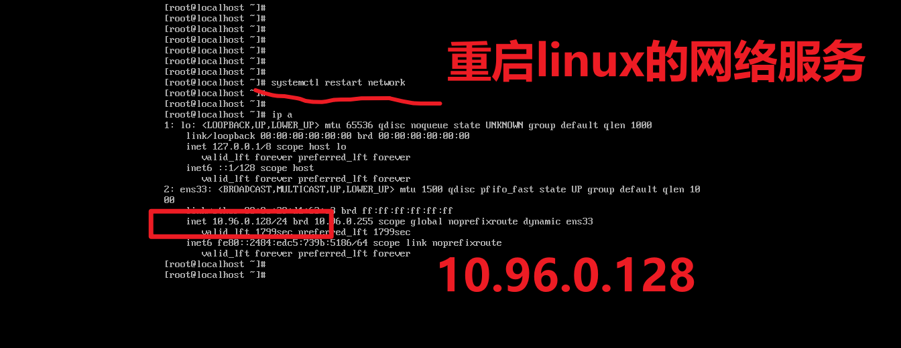
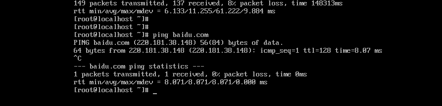

```### 此资源由 58学课资源站 收集整理 ###
	想要获取完整课件资料 请访问：58xueke.com
	百万资源 畅享学习

```
# 昨日作业




- 传统运维
  - 没有接触到云计算，没有接触云服务器的，运维工程师
    - 得维护企业内部的硬件设备，服务器，以及机房的维护
  - 主要维护是企业内部的，不经常变化，且没有超大流量的内部应用（crm，企业内部的邮件系统，办公应用系统）HR。老板，同事，人事，财务，维护的软件，面向企业内部人员
- 云计算运维


以后作业，不要给我截图了兄弟们，给我typora的笔记打包

```
day03笔记.md
pic/

打个压缩包，发给我。
```

uptime (就是一对英文单词，见名知意，可能就是一些缩写)


# 关于特殊ip的实践

- 127.0.0.1（端口结合）
  - 回环地址，做服务测试使用的 127.0.0.1:7800
- 192.168.0.177
  - 和网卡有关，网卡上设置的ip地址，
- 0.0.0.0
  - 绑定这个机器，所有的网卡ip（同时发布到局域ip，和公网ip，云服务器有关了）




```
有一个开发机器
192.168.0.105
192.168.0.177

开发需要部署应用了，部署在什么地址上，可提供正确的访问？
0.0.0.0:8000
```






--




## 关于桥接的ip



1.添加网卡

2.给网卡分配一个ip即可

>添加ip的方法

1.添加新网卡，绑定ip

2.直接给当前网卡，绑定多个ip（用的是这个）


## NAT网络

1.修改虚拟机的网络连接方式，改为NAT



2.查看vmware提供的虚拟网卡，设置，看一看，NAT创建的局域网段，是多少



3.重启linux的网络服务，拿到NAT的ip




4.最后验证你的拿到的NAT分配的ip地址，是否能访问百度



# 域名和ip的对应关系

关于百度的域名解析

```
用超哥的电脑，ping baidu.com  >   12.54.65.88
用超哥的腾讯云 ping baidu.com  >   144.55.44.77

先忘记这个操作。。百度的动态DNS技术
```

> 你现在需要学的是

域名 和 ip对应关系是 

一对一


```
一 对 一，一个域名，对应一个IP
10.96.0.128   yuchao-python.cc    虚拟机1 

一个 ip，对应多个域名
10.96.0.128    test1-yuchao-python.cc
10.96.0.128    test2-yuchao-python.cc


```


马上学习nginx网站部署

在一个机器上，部署多个网站

```
你作为一个小说爱好者，你买了一个云服务器

www.yongfeixs.cc
www.yongfeirh.cc 


```


## 域名解析的配置hosts文件

是每个人电脑上的， 域名解析文件，用于本地测试使用，是假的，给自己测试玩的，

> 能实现，访问 yuchao-python.cc 就可以定位到这个 10.96.0.128的

```
1.找到hosts文件
C:\Windows\System32\drivers\etc

2.推荐用Notepat++文本编辑器打开，或者记事本也行
写入如下的解析关系
# example 
10.96.0.128   yuchao-python.cc 
10.96.0.128    test1-yuchao-python.cc
10.96.0.128    test2-yuchao-python.cc

3.测试客户端可以测试了

http://yuchao-python.cc:9999/
http://test1-yuchao-python.cc:9999/

4.本地域名解析，就是这个作用


```

互联网中存在的域名，需要购买dns解析记录，腾讯云提供的域名注册服务（收费）


## 课间练习

1.修改vmware上网方式为NAT，修改你的linux的ip为NAT网段的

2.练习下hosts域名解析

```
制作你的三个域名，都能解析到你的ip地址，ping通即可。
```


