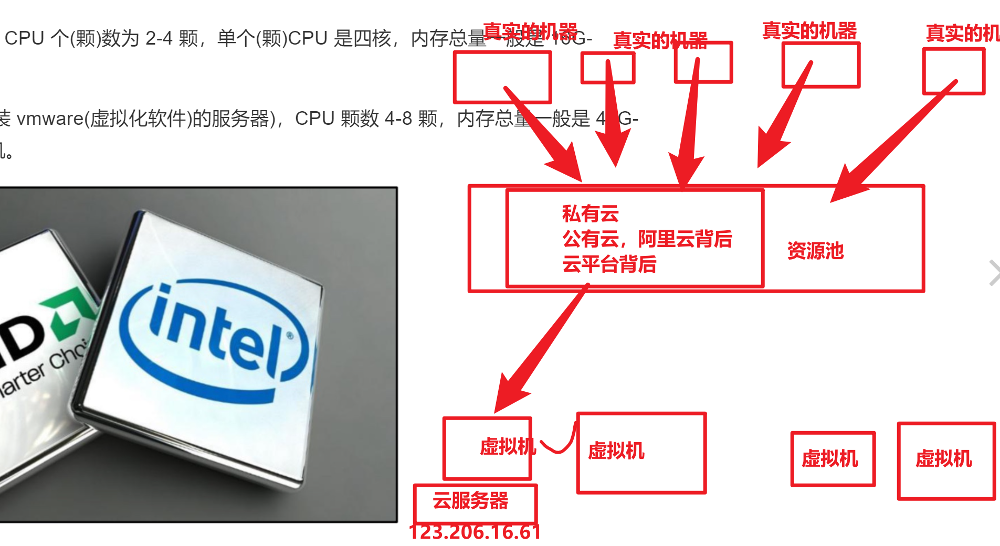

```### 此资源由 58学课资源站 收集整理 ###
	想要获取完整课件资料 请访问：58xueke.com
	百万资源 畅享学习

```
# 学习路线

1.运维，维护机器，肯定是在机房（云服务器）

2.机房里面都有什么，ip，域名，port

3.懂点硬件的东西

台式机，

内部硬件

网卡

4.操作系统是什么，linux安装，指令


5. 任重而道远

# 计算机的硬件知识（科普类）

程序跑在服务器上（购买什么样的配置）

cpu型号

内存的版本，频率，内存容量

磁盘


# 硬件和人体的关系


# 计算机单位换算


二进制， 只有 0 和1 的数据，逢2进1  

十进制，1 ~10  ，逢10进一 

对于计算机而言，只认识一个叫做`二进制`的容量单位，我们称之为`bit`，但是由于`bit`单位太小，计算机又用`Byte`单位来统计

小时候用，分，角，2分，因为单位实在太小了

元，为主流的流通货币单位

一个文件有多大 ，15MB

一个视频有多大，2GB


1TB硬盘 = 多少GB，1024GB


1GB =  1024 MB

# 关于cpu的32位，和64位

```
需要记忆的就是，32位CPU和64位CPU，对内存的支持。

32位和64位意味着处理器可在一段时间内处理的最大位数，最大内存寻址空间。

# 2的32次方，32位CPU最大支持4G内存
# 32位系统的最大寻址空间约为4294967296（比特）＝4（GB）；
>>> 2**32/1024/1024
4096.0

# 64位CPU，支持相当大的内存扩展
# 总之，它相当大就是，所以64位CPU没问题
>>> 2**64/1024/1024/1024/1024/1024
16384.0  EB
```





# 关于内存和磁盘的关系

内存由于它的高速IO性能，因此很多数据会放在内存里面，提供用户读写，因为速度快

内存====缓存

前端的文件，三要素，让你的网页可以显示出效果

js

html

css


>内存就会大量的用在，网站架构优化里
>
>思路，只要公司有钱，服务器够牛，内存够大，
>
>数据尽量放内存里面，因为读写速度很快
>
>磁盘的数据，预热，先写入到内存，计算机程序，直接去内存里去读数据，读不到了，再去磁盘里找
>
>磁盘IO速度慢
>
>内存IO速度快

# 多通道设计，内存

你的主板，支持插入4个内存条

两两配对是最高性能的

单条的16G内存条，不如买2个8G(完全一样型号的，品牌，频率，容量)，组成双通道


# 硬盘

个人硬盘，台式机的硬盘，都是SATA接口，而企业级的高性能硬盘是SAS接口

# BIOS系统

比如，你以后给企业部署服务器，上架，装了一个新的CPU

这个机器还是需要运行vmware虚拟化的(windows+vmware workstation(linux))

vmware vsphere （高性能，收费，企业级虚拟化软件）


然后发现，安装这个工具，报错，提示你不支持intel v-t(虚拟化技术)

1.先重启该服务器，然后找到该服务器，进入BIOS系统的快捷键，然后进入主板系统

2.调整CPU的功能设置，打开虚拟化功能

3.重启服务器

4.开始安装vmware

...


# 显卡

早期之前，没有独立显卡的时候

图像的处理，需要去内存中，借一点容量来做图像处理。

cad ，3d max。

都是独立显卡，有很大的显卡存储（显存）

显卡也提供了芯片，GPU芯片用于计算任务


机器里面

CPU是来运算的，计算的

内存是用来临时存储数据的，数据放在内存里计算


独立显卡（分担CPU的压力，以及内存的压力）

1.一个计算能力 2.显卡的内存存储能力


