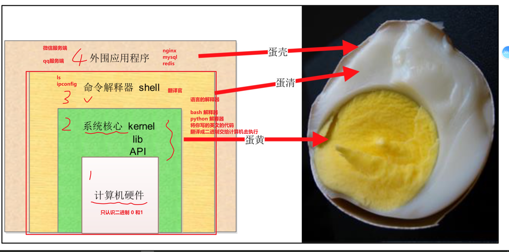
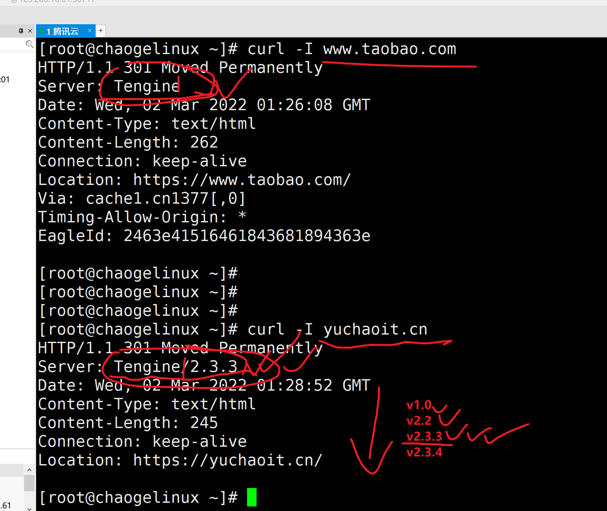
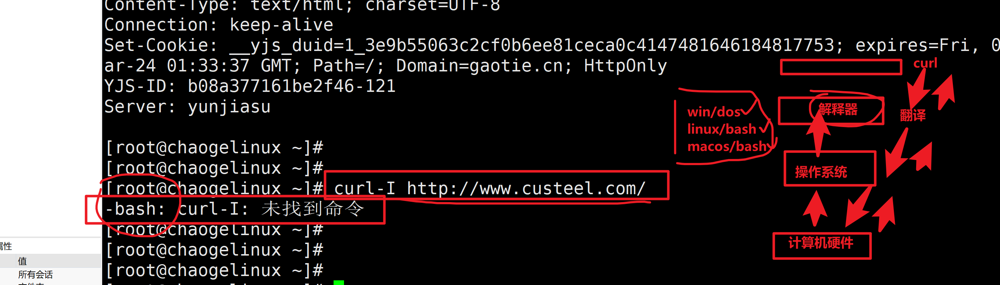
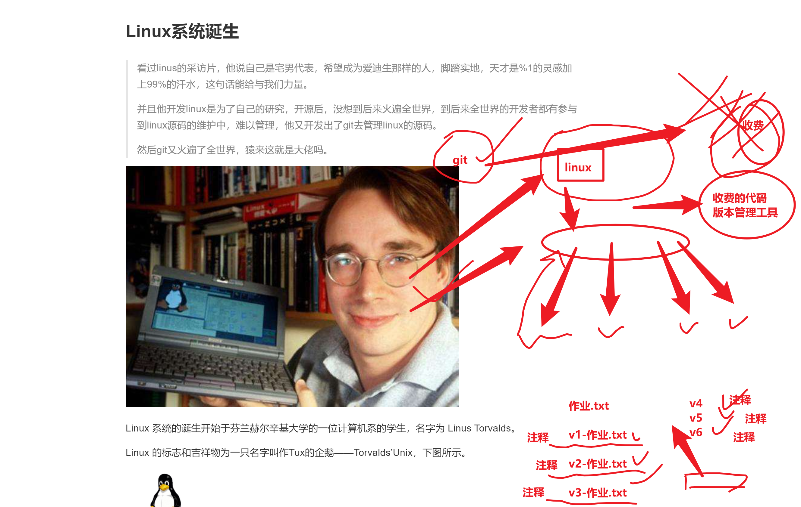
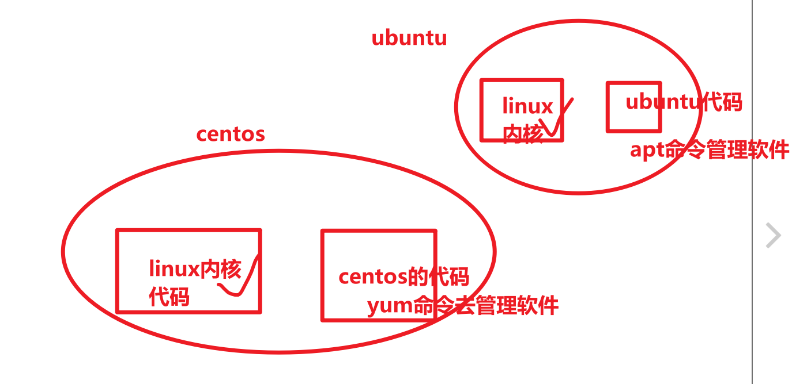
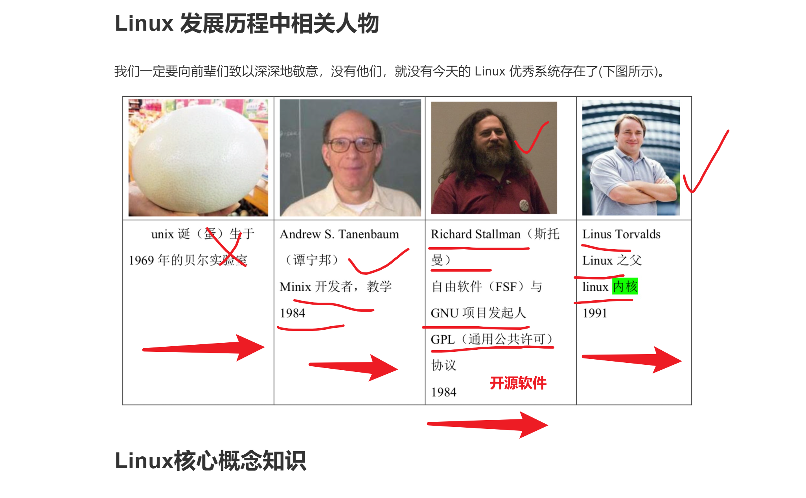
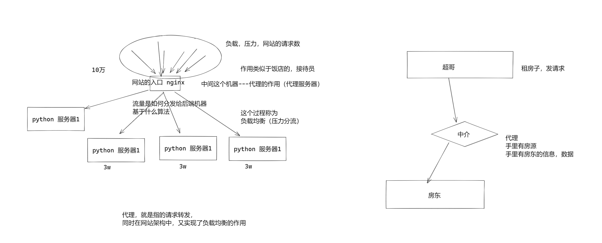
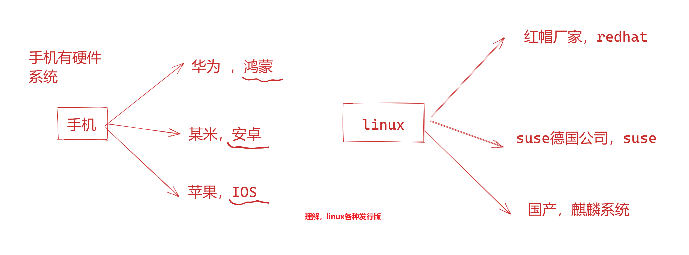
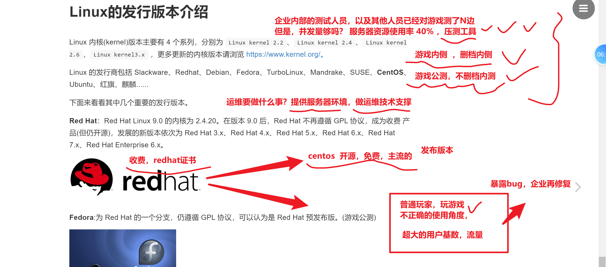
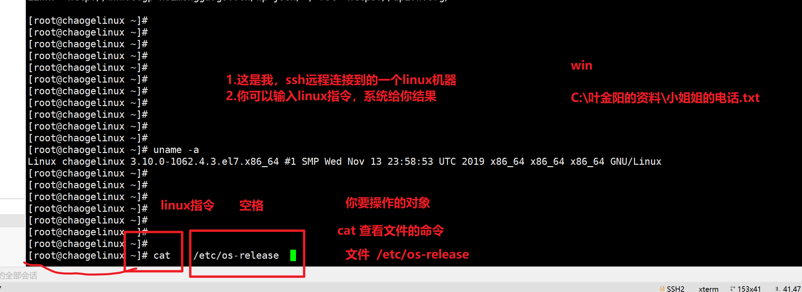

```### 此资源由 58学课资源站 收集整理 ###
	想要获取完整课件资料 请访问：58xueke.com
	百万资源 畅享学习

```
# 今日笔记

- 学操作系统基础概念
- linux系统
- linux系统(centos)+vmware安装起来（网络配置，磁盘分区）
- ubuntu安装
- xshell服务器的远程连接

>服务器
>
>网站的前后端，数据库
>
>app的前后端，数据库   jin

微信、腾讯微信的服务器

移动端设备上，安装的微信客户端


# 在线笔记

笔记对运维来说，就是一个宝藏，markdown

语雀，笔记

各种在线笔记网址

https://www.yuque.com/

# 


# linux操作系统



# 关于服务器软件版本的安全性考虑



# 服务器搭建网站

基本就是

linux系列的，nginx，apache （软件的名字）

windows， IIS 服务器（微软官网）

# 关于解释器的流程





## 名词解释

dos https://zh.wikipedia.org/wiki/DOS windows下的命令行终端

bash/terminal  ，（终端），是linux下的一个软件，作用是执行用户输入的命令，进行翻译执行，返回结果

nginx/apache (linux平台下的)

（web server ，名字web 服务器，在linux系统下的一个软件，用于部署web网站的，该软件运行在服务器上[操作系统中]），这和硬件服务器是一个东西吗

软件、硬件的概念。

iis （windows平台下），https://www.baike.com/wiki/iis%E6%9C%8D%E5%8A%A1%E5%99%A8?view_id=3y4xqazm0ag000


GUI (图形化管理接口，比如windows可视化页面)


unix系统+小型机上（很贵，收费），perl语言 

BAT

百度，淘宝，腾讯，早期的时候，用的也都是国外的技术，oracle,  AIX小型机系统

阿里达摩院

互联网开源技术，还没那么流行，还没那么多


语言发展的越来越高级

越来越简单，越来越人性化

开发一个网站，显示一个hello world

汇编语言去写，放弃吧兄弟

C，C++，保护你的头发吧兄弟 （30行）

python ，2行代码 （越接近人类的语言逻辑，代码量很少）


理查德斯托曼，基于unix，发起了自由软件运动，开发了一个BSD系统（但是后来没有发展起来，开发了一些grep,awk这样的）

林纳斯托瓦兹，开发出了第一版linux系统+BSD系统的一些软件，诞生出了如今的 BSD/linux

git,代码版本管理工具





# linux系统包括了两部分

linux系统的名字，只是系统内核的名字 







# 什么是开源

开源软件===自由软件===（不是说免费的）

完全免费的，送给你一样。

https://www.gnu.org/philosophy/free-sw.zh-cn.html
“自由软件”尊重用户的自由，并且尊重整个社区（linux运维社区）（python开发者社区）

。

粗略来讲，一个软件如果是自由软件，这意味着用户可以自由地运行，拷贝，分发，学习，修改并改进该软件。

> 一个程序员大佬，写一个非常牛的软件（根据用户心情变化，手机壳自动修改颜色）
>
> 进行了开源
>
> 微信软件 > C语言写的一套程序，打包成了一个整体 > 用户可用的软件
>
> 源代码，指的就是某一个语言，写的一堆程序而已。
>
> 

开源自由软件，这个行为有好有坏，好处是你的产品够牛，你放开源代码给全世界的人用(github.com)，越来越多的人使用你的源码，以及给你提交建议，做软件的bug修复，更新，使得软件越来越强大。
但也不排除，有人会把你的源代码，改吧改吧，成为他自己的东西，再去贩卖。

举个例子，开玩笑的讲，国内一些所谓的大厂，富有最先进想法的一些创业公司，比如人工智能的落地应用，他们的软件产品，需要国外最先进的论文提供开发思路，比如有人说，国外的波士顿狗，一旦源代码公布，国内就会出现一万种阿尔法狗。

## 关于网站代理架构图解


#


# ubuntu如何安装

centos的安装流程

1.找到镜像，阿里云镜像站https://developer.aliyun.com/mirror/?spm=a2c6h.13651102.0.0.79b81b111WgoCk&serviceType=mirror

2.虚拟机vmware去安装（windows干掉，直接ubuntu、装双系统，可以选择win，ubuntu）

3.vmware的一系列安装操作

4.配置网络环境

5.使用

# linux发行版



# 主流centos7系统是3版本的内核

```
[root@chaogelinux ~]# uname -a
Linux chaogelinux 3.10.0-1062.4.3.el7.x86_64 #1 SMP Wed Nov 13 23:58:53 UTC 2019 x86_64 x86_64 x86_64 GNU/Linux

如果接触到云原生的一些业务，需要升级k8s的环境，是需要升级内核版本的
3.x >  4.x 


```

centos系统（linux内核代码+centos定制的代码）

archlinux （另一个linux发行版）黑科技（网安，黑客喜欢用这个，各种奇怪的工具）

# 从软件发布，理解运维工作流程




# centos7系列是最主流的



```
[root@chaogelinux ~]# cat    /etc/os-release  
NAME="CentOS Linux"
VERSION="7 (Core)"
ID="centos"
ID_LIKE="rhel fedora"
VERSION_ID="7"
PRETTY_NAME="CentOS Linux 7 (Core)"
ANSI_COLOR="0;31"
CPE_NAME="cpe:/o:centos:centos:7"
HOME_URL="https://www.centos.org/"
BUG_REPORT_URL="https://bugs.centos.org/"

CENTOS_MANTISBT_PROJECT="CentOS-7"
CENTOS_MANTISBT_PROJECT_VERSION="7"
REDHAT_SUPPORT_PRODUCT="centos"
REDHAT_SUPPORT_PRODUCT_VERSION="7"


```


