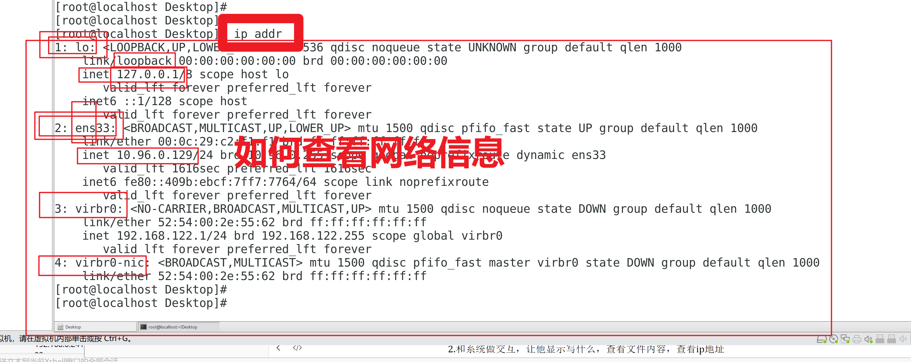
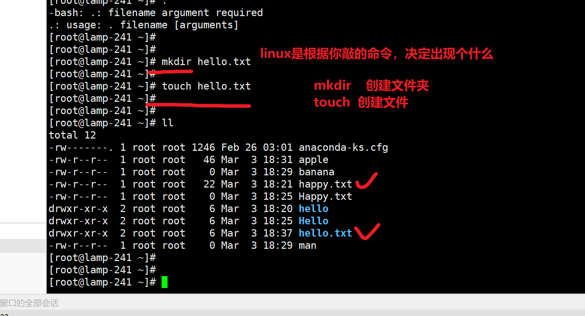

```### 此资源由 58学课资源站 收集整理 ###
	想要获取完整课件资料 请访问：58xueke.com
	百万资源 畅享学习

```
# 关于学习工具补充

## typora编辑器

### 了解关于绝对，相对路径

可以解决typora写笔记的问题


菜鸟教程，markdown语法笔记


## everything

windows下，强大的文件搜索工具


## xmind 思维导图工具或者

从你开始学linux命令，会遇见每天都认识好多命令，

但是每个命令的作用，语法，参数，都有不同的意义

因此你需要做好思维脑图，给自己强化记忆。


思维脑图，就可以整理你的 ，碎片化的知识点。


## 在线思维脑图

https://processon.com/diagrams


## notepad++

这是一个用于快速写脚本的编辑器，也可以当做记事本来用，非常好用

可以让你打开，绝大多数编程语言的脚本，且美化显示。


# linux快速入门

## 图形化和命令行终端的

图形化操作


命令行终端呢？

```

pwd命令，print word dir  打印当前工作路径
[root@localhost ~]# pwd
/root


mkdir    make dir 创建目录的
[root@localhost Desktop]# mkdir  haowanma

删除空文件夹的作用
rmdir 文件夹


```

## 关于企业级服务器的终端概念

服务器是不会安装图形化软件的，只有纯黑屏


## 引入远程连接的概念

公司里，基本是远程连接服务器，首先你要获取，服务器的信息

ip

账户  root

密码 123456


## 如何远程连接

使用客户端工具，xshell,securtCRT，以及其他各种工具

他们的本质，都是使用ssh命令去操作的。

### xshell


你的运维同事，给你一个文档

123.206.16.61

账户，wangrengang

密码，werwer(*&(*&*&^))


### 使用ssh（客户端）命令去连接

如何理解协议的概念？

计算机，程序A和程序B之间，互相遵循，认可的一套计算机通信协议。

就好比，中国人，都说方言（各种软件之间，独有的通信协议）

- 协议，可以理解为是人与人之间交流的一个语言
  - 计算机程序之间的通信协议


比如，在整个互联网中，所有的网站之间的通信，有一个公共的协议标准----http协议

（理解为，中国人，都说的普通话）


```
1.退出linux会话，退出登录
[root@lamp-241 ~]# exit

2.使用logout命令，退出linux会话
[root@lamp-241 ~]# logout
Connection closing...Socket close.

Connection closed by foreign host.

Disconnected from remote host(day05) at 09:38:19.

Type `help' to learn how to use Xshell prompt.
[C:\~]$ 
[C:\~]$ 
[C:\~]$ 
[C:\~]$ 
[C:\~]$ 


3.重新登录，使用命令去登录，和xshell是一样的事
也就是说，提醒你，linux下，ssh远程连接的命令，和这个有点区别！！
window下，提供的ssh指令，以及它的帮助文档
[C:\~]$ ssh
NAME
	ssh - connects to a host using the SSH protocol.

SYNOPSYS ， 写在中括号里的，参数，一般指的是可选的，可用可不用
ssh [user@]host[ port][;host[ port]]

简写的语法就是 @ 就是一个占位符
user  登录系统的账号
@host  登录服务器的ip地址
port  端口

ssh  user@host   port  


OPTIONS
	user   Indicates the user's login name.
	host   Indicates the name, alias, or Internet address of the
	       remote host.
	port   Indicates a port number (address of an application).
	       If the port is not specified, the default ssh port
	       (22) is used. （远程ssh服务提供的端口）
[C:\~]$ 

4，远程用ssh命令连接linux
是否可以不添加端口？ ，回答，可以，系统默认给你添加22端口
[C:\~]$ ssh root@192.168.0.241   

什么情况下，需要你指定端口号再去连接？ ssh端口，被改为了7890
回答，当你的服务器，为了保证机器安全，不要被人恶意的登录

修改了端口号，的连接方式，[C:\~]$ ssh root@192.168.0.241   7890


0 ~ 65535  


root
123
11111
123456789
qwe123
1234aaa
woaini888

服务器就会成为肉鸡，矿机


从ssh登录角度
以及线上跑的各种程序，默认端口，都容易被攻击


4. 来看看，linux平台，提供的ssh命令，如何看帮助信息，以及语法
两台机器的连接，远程登录，大前提是？你的保障两台机器，能互相访问，ping的通。
任务，远程登录，192.168.0.131

查看linux下的ssh帮助信息
[root@lamp-241 ~]# ssh
usage: ssh [-1246AaCfGgKkMNnqsTtVvXxYy] [-b bind_address] [-c cipher_spec]
           [-D [bind_address:]port] [-E log_file] [-e escape_char]
           [-F configfile] [-I pkcs11] [-i identity_file]
           [-J [user@]host[:port]] [-L address] [-l login_name] [-m mac_spec]
           [-O ctl_cmd] [-o option] [-p port] [-Q query_option] [-R address]
           [-S ctl_path] [-W host:port] [-w local_tun[:remote_tun]]
           [user@]hostname [command]
[root@lamp-241 ~]# 


简单整理就是

linux的命令是，

指令 空格  可选的参数   操作的对象


ssh   -p 22 root@192.168.0.132


```

错误演示，以及分析


linux下如何用ssh登录，以及错误分析


截图工具


10.15 休息


# linux区别

## 1.严格区分大小写

windows：不区分大小写，比如你创建文件夹，输入大写，小写，windows都认为是同一个

linux，严格区分大小写

```
[root@lamp-241 ~]# ls
anaconda-ks.cfg  happy.txt  hello
[root@lamp-241 ~]# 
[root@lamp-241 ~]# touch Happy.txt
[root@lamp-241 ~]# ls
anaconda-ks.cfg  happy.txt  Happy.txt  hello

[root@lamp-241 ~]# mkdir  Hello
[root@lamp-241 ~]# 
[root@lamp-241 ~]# ls
anaconda-ks.cfg  happy.txt  Happy.txt  hello  Hello

```

意义在，

全系统搜索某个文件，关注大小写

Hello.txt


hello.txt


## 2.linux的命令返回结果理解

1.你要创建些什么，执行些脚本，创建文件，创建文件夹

*一般是没有提示的，就是最好的提示，默认直接出结果*

```
[root@lamp-241 ~]# mkdir hello
[root@lamp-241 ~]# 
[root@lamp-241 ~]# 
[root@lamp-241 ~]# mkdirhello
-bash: mkdirhello: command not found

```

2.和系统做交互，让他显示写什么，查看文件内容，查看ip地址

```
[root@lamp-241 ~]# cat happy.txt 
今天是个好日子


```


##  3.如何查看网络信息




## 4.关于后缀名（linux不关心文件后缀）

windows的文件后缀，是决定了该文件的`属性`的！


更改windows的文件属性


linux是不关心后缀的，linux的文件属性，依靠`权限位`决定，和文件名无关

linux的文件名，就是个普通的字符串而已。`一堆英文字母`

比如文件夹也可以加上这些后缀

.

### 4.1 需要记忆的后缀

为了区分出文件类型，我们还是会给linux文件，添加上阅读性更好的文件扩展名字。

常见的有

- 压缩文件（打包，压缩）
  - Linux 下常见的压缩文件名有 *.gz、*.bz2、*.zip、*.tar.gz、*.tar.bz2、*.tgz 等。
  - 为什么压缩包一定要写扩展名呢？很简单，如果不写清楚扩展名，那么管理员不容易判断压缩包的格式，虽然有命令可以帮助判断，但是直观一点更加方便。
  - 就算没写扩展名，在 Linux 中一样可以解压缩，不影响使用。
- 软件安装包
  - 如windows下的exe文件一样作用，linux也需要安装软件，也有软件包的格式。后面学习软件管理时重点讲解。
  - 如redhat系列的RPM包，所有的RPM包都是.rpm后缀格式。
- 脚本文件
  - 如shell脚本，.sh
  - 如python脚本，.py
  - 如java的 .java
- 网页相关的文件
  - .html
  - .jpg
  - .js
  - .css
  - 


## 5.echo命令

显示一段话

```
注意，一定是，引号，引起来的，才是正确的，普通字符信息

[root@lamp-241 ~]# echo "打印一段话，到屏幕上，让你看到"
打印一段话，到屏幕上，让你看到


输出一段字符串，输出到哪，可以是屏幕终端，可以是写入文件

```


简单了解文件的权限位，决定了文件的属性


## 6.linux一切皆文件

你在linux系统上，所有的 操作，都会以文件形式可以找到

网络的配置

软件的配置

程序的脚本

进程的信息

都可以用命令，找到和它有关的文件


```
虚拟机想上网
1.插网线
2.修改网卡配置文件   [root@lamp-241 ~]#  cat  /etc/sysconfig/network-scripts/ifcfg-ens33  
3.启动network程序   systemctl start/stop/restart  network  ，三选一的选项
4.才会有ip

```


### 6.1 比如磁盘的文件


```
linux一切皆文件
你可以系统中，找到该磁盘，操作系统通过一个文件，让你去操作这个硬盘

```


11.15 休息


## 7.命令小结

```
touch命令，语法是

touch  文件名 
	1.该文件名不存在，则创建该，普通文件
	2.该文件名存在，则是修改他的文件时间属性（被访问的时间是什么时候）

touch  hello.txt


	
mkdir命令，语法是

mkdir 文件夹名
	1.创建文件夹
	

mkdir students


坑在于
mkdir 只有创建文件夹的作用
touch 俩作用，1.创建文件  2.修改时间戳

linux同一个目录，文件名不能重复


```

## 8.linux的硬盘，必须要挂载后才能使用（挂载的概念）

windows


linux

1.有磁盘，分区

2. 在linux中有一个目录，和这个分区绑定
3. 访问这个目录，即访问了这个磁盘的数据

### 挂载图解


## 9.学习linux的文件目录格式


linux啥样

### 什么是绝对路径


### 关于linux的目录分隔符


图解


## 10.关于linux的路径和命令结合

```
ls命令
	list语义，语法用法是
	
	ls   文件路径

我们目前用的都是绝对路径写法
1. 查看/etc下的内容
ls  /etc

2.查看系统日志目录，有多少个日志文件  /var/log/，还要显示它的详细信息

ls -l  /var/log


pwd命令
	直接打印你当前在哪个绝对路径下
	
[root@lamp-241 ~]# pwd
/root


	
	

cd命令
	cd 切换工作目录
	cd  文件路径

touch命令
	1.作用
		touch  文件名   ，创建普通文件，touch 我是叙利亚的运维.txt
	2.作用2
		如果当前目录，存在该文件，则表示修改该文件的访问时间属性
		
	

mkdir命令
	mkdir  文件夹名字
	


```


## 11.绝对路径，相对路径学习

- linux命令+ 以根开始的路径，叫做绝对路径
- linux 命令 +  非根目录开始的路径，叫做相对路径

```
关于相对路径，需要添加 

.   当前路径
..  上一级路径
```


什么是，绝对，什么事相对


### 相对路径了

```
1.此时我呆在/home目录下
cd /home

2.我要创建文件 好饿.txt ，放入 /opt/


3.命令是
	绝对路径写法
		touch  /opt/好饿.txt
		
    
	相对路径
	
		
4. 查看该文件 cat 
	绝对路径写法
	
	相对路径写法

	
```


### 图解相对路径用法


## 12.环境变量PATH


## 13.常见目录理解


# 学习技术的方式

1.先了解该知识点是什么

2.学习该知识点的语法

3.应用，实践该知识点


