```### 此资源由 58学课资源站 收集整理 ###
	想要获取完整课件资料 请访问：58xueke.com
	百万资源 畅享学习

```
# 作业解析

## 关于ssh

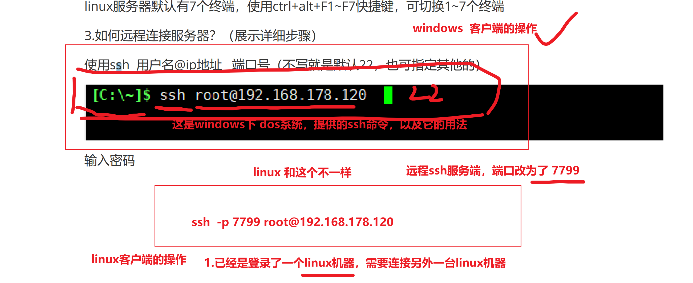

```
ssh -p 27717  bigdata01@123.206.16.61

```

## 关于登录，退出登录

1.登录的概念的第一种形式

```
1.比如你登录系统
ssh -p 27717  bigdata01@123.206.16.61
logout # 退出该会话登录
exit   # 退出登录


2.第二种登录，如用于切换，root  > yuchao01

验证该用户是否存在系统中

id  yuchao01


3. 用户切换
su 命令
语法是 

su  -   系统中存在的用户名
# 短横线 -   表示切换用户且加载该用户的环境变量PATH，且进入该用户家目录
linux中，每个用户，都会有自己的单独的一套环境变量
比如，root用户安装了java程序，PATH中且添加了java相关的命令，直接使用java命令（相对路径）
yuchao01这个用户未安装，切换到该用户中，无法使用该java命令

su  -  yuchao01


# 演示用户切换，分两种，添加 - 和不添加-

su  yuchao01

su - yuchao01

# 可见，用户切换时，记住，用 su - 用户名，是完全切换

# 这就涉及到关于用户的配置文件的加载  ~/.bash_profile


[root@linux333 opt]# su - yuchao01
Last login: Fri Mar  4 17:28:44 CST 2022 on pts/0
[yuchao01@linux333 ~]$ 


```

## 关于echo命令

在linux中，打印，输出一段信息，以及可以用shell语法，打印变量的值

```
echo和 引号的关系很密切

1. linux下的单引号，表示，不做特殊符号转义，仅仅是 一个纯字符串

2. linux下的双引号，也表示定义字符串，但是，它能识别特殊符号！！


echo命令输出变量，有两种写法

1.完整的写法，强烈建议用这个
myname='海贼王的男人'

echo ${myname}

2.支持简写

echo $myname 

```


## 关于linux命令的语法格式

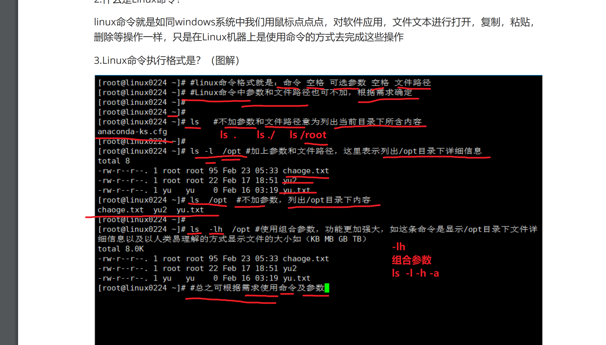

## 修改命令提示符

5.详细解释下命令提示符，以及如何修改命令提示符每一段的内容？（用linux实际操作演示，复制过程 粘贴到笔记里） 修改用户名的显示 修改主机名

```
[root@linux333 ~]# 

# 1. 修改用户名
换一个用户登录来实现[yuchao01@linux333 ~]$ pwd   # /home/yuchao01
/home/yuchao01


可以用su 切换用户实现


#2. 修改主机名
[root@aoligei224 ~]# hostnamectl set-hostname  kunlema


[root@kunlema sysconfig]# 


[root@kunlema sysconfig]# pwd
/etc/sysconfig


```

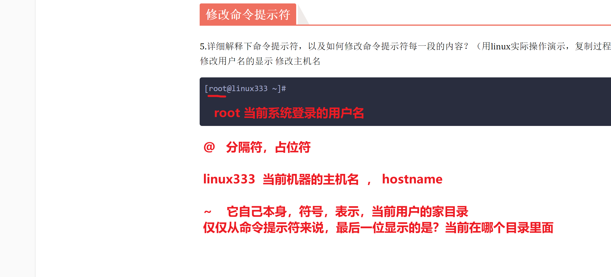


## linux文件目录结构

再一次理解，绝对路径

相对路径

```
/data/apple

/data/huawei


此时 我再这个目录 cd /data/apple

我要再进入到huawei这个目录，如何敲打命令？


#  比较麻烦的办法，不推荐使用
# 第一种，麻烦的方法，去老家，根目录，绕一圈

[root@yuanlai0224 apple]# cd  ../../root/huawei
[root@yuanlai0224 huawei]# 
[root@yuanlai0224 huawei]# 
[root@yuanlai0224 huawei]# pwd
/root/huawei


# 第二种，正确玩法，判断你和该文件夹的相对路径，最短路径
[root@yuanlai0224 huawei]# cd  ../apple
[root@yuanlai0224 apple]# 
[root@yuanlai0224 apple]# pwd
/root/apple


```

根目录，就是一个  正斜线 `/`

是linux文件目录的起点，所有的文件资料，都从这开始


## 图解相对路径，绝对路径的思路

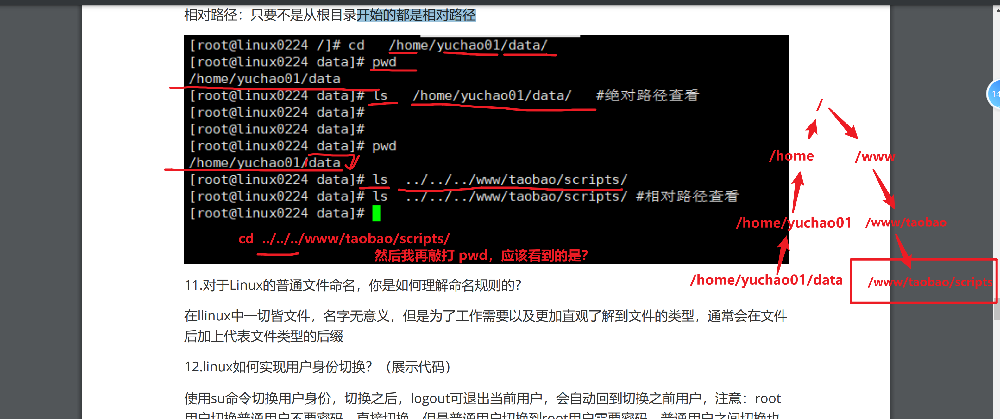

## 关于文件后缀的理解

11.对于Linux的普通文件命名，你是如何理解命名规则的？ 在llinux中一切皆文件，名字无意义，但是为了工作需要以及更加直观了解到文件的类型，

通常会在文件后加上代表文件类型的后缀


## 关于linux文件命令的规则

touch命令，可以创建文件


## 关于反斜线，对特殊符号，进行转义

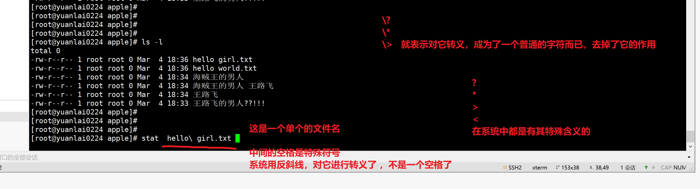


## 关于stat命令可以查看文件的详细信息

用于证明，touch命令，可以修改时间戳

```
[root@yuanlai0224 apple]# stat  hello\ girl.txt 
  File: ‘hello girl.txt’
  Size: 0         	Blocks: 0          IO Block: 4096   regular empty file
Device: fd00h/64768d	Inode: 50778451    Links: 1
Access: (0644/-rw-r--r--)  Uid: (    0/    root)   Gid: (    0/    root)
Access: 2022-03-04 18:36:52.856917974 +0800
Modify: 2022-03-04 18:36:52.856917974 +0800
Change: 2022-03-04 18:36:52.856917974 +0800
 Birth: -

```

stat命令可以看到文件的详细时间

比如文件的

- 访问时间，cat，读一下文件
- 修改，更改时间， echo 写入内容，vi编辑器，修改文件内容

演示文件已存在的情况，是修改时间戳

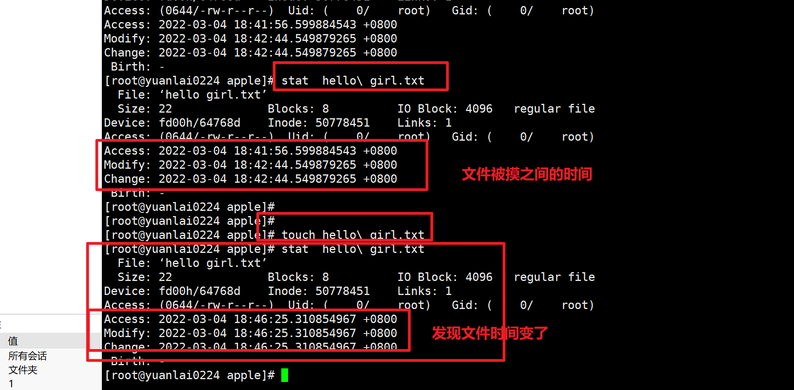


## 关于mkdir的补充

-p 递归创建文件夹

```
[root@yuanlai0224 ~]# mkdir  -p ./0024/男生组/超哥
[root@yuanlai0224 ~]# 
[root@yuanlai0224 ~]# 
[root@yuanlai0224 ~]# ls
0024  apple  dir3  huawei
[root@yuanlai0224 ~]# 
[root@yuanlai0224 ~]# ls 0024
男生组
[root@yuanlai0224 ~]# 
[root@yuanlai0224 ~]# ls 0024/男生组/
超哥


[root@yuanlai0224 ~]# mkdir -p  ./0024/女生组/超哥2
[root@yuanlai0224 ~]# 
[root@yuanlai0224 ~]# 
[root@yuanlai0224 ~]# ls 
0024  apple  dir3  huawei
[root@yuanlai0224 ~]# 
[root@yuanlai0224 ~]# 
[root@yuanlai0224 ~]# ls 0024
女生组  男生组
[root@yuanlai0224 ~]# 
[root@yuanlai0224 ~]# ls 0024/女生组
超哥2

```

> 关于文件创建，结合绝对，相对路径的练习

```
1.创建一个文件夹 /抖音神曲

2. 创建子文件夹，抖音神曲/80年代歌曲/小丑鱼.mp4  抖音神曲/80年代歌曲/男人哭吧不是罪.mp4

3. 创建子文件夹 抖音神曲/00年代歌曲/基尼太美.mp4  抖音神曲/00年代歌曲/蔡旭困/基尼太美super.mp4


# 答案
1.先把目录创建好
mkdir -p /抖音神曲/80年代歌曲/

2.创建两首歌曲
touch /抖音神曲/80年代歌曲/小丑鱼.mp4  /抖音神曲/80年代歌曲/男人哭吧不是罪.mp4

3.创建文件夹
cd /抖音神曲

相对路径
mkdir  -p 00年代歌曲/蔡旭困

创建歌曲
touch ./00年代歌曲/基尼太美.mp4  ./00年代歌曲/蔡旭困/基尼太美super.mp4 


```

## 关于su的回忆

```
1. 我仅仅是ssh登录了 root，然后 su - yuchao
2. 执行exit，回到root
3.再exit，linux会话断开了

su 连接用户要注意什么来着
这是最准确的
su -  用户名  


2. 用户之间的切换，关系到用户角色的权限

root是linux的超级用户，想干嘛就干嘛，甚至删掉自己，想切换到任意的用户，不用密码

yuchao01普通用户，权限很低，想切换到其他人，都得输入密码


```

## 关于主机名的读取

```
[root@yuanlai0224 ~]# cat  /etc/hostname 
yuanlai0224
[root@yuanlai0224 ~]# 
[root@yuanlai0224 ~]# hostname
yuanlai0224

```

## 关于linux命令的帮助信息理解

问题：不同的命令，参数的作用都不一样，如何查看

```
1.用命令本身的 帮助参数

ls --help

2. man手册

man ls 


3.中文文档查询
http://linux.51yip.com/

4.自己的笔记


```

## 理解uname怎么用

```
1.作用：
    显示系统信息
2.语法：
    uname -参数

# 
[root@localhost opt]# uname -a
Linux localhost.localdomain 3.10.0-862.el7.x86_64 #1 SMP Fri Apr 20 16:44:24 UTC 2018 x86_64 x86_64 x86_64 GNU/Linux

# 解释
Linux  系统名称

localhost.localdomain 主机名
 3.10.0-862.el7.x86_64 内核版本号
     3 是主版本号，重大变化，才会变动
     10 是次版本号，新加功能后版本数字变化
     0 表示修改次数
     862表示编译次数
     el7 表示是7代版本
     x86_64 表示系统是64位的

发布时间

GNU/Linux是操作系统名称，开源计划
```

## 关于目录切换

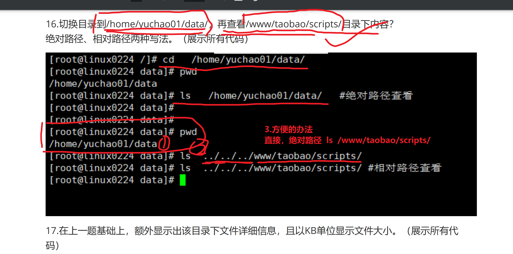

```
17题

ls -lh  目录名


```

## 关于路径操作

19.进入目录/data/mysql/database/，再用相对路径写法，进入/data/nginx/www/conf，最后在用相对 路径写法，查看/data/nginx/logs/access.log日志文件内容。（展示所有代码）

```
# 1.进入该目录
cd /data/mysql/database/

# 2。需求2, 再用相对路径写法，进入/data/nginx/www/conf
cd 

3.查看/data/nginx/logs/access.log日志文件内容 
创建该日志文件 /data/nginx/logs/access.log

[root@yuanlai0224 conf]# mkdir -p /data/nginx/logs/
[root@yuanlai0224 conf]# 
[root@yuanlai0224 conf]# 
[root@yuanlai0224 conf]# touch /data/nginx/logs/access.log
[root@yuanlai0224 conf]# 
[root@yuanlai0224 conf]# 
[root@yuanlai0224 conf]# echo "开心不" > /data/nginx/logs/access.log
[root@yuanlai0224 conf]# 
[root@yuanlai0224 conf]# 
[root@yuanlai0224 conf]# 
[root@yuanlai0224 conf]# pwd
/data/nginx/www/conf
[root@yuanlai0224 conf]# 
[root@yuanlai0224 conf]# 
[root@yuanlai0224 conf]# cat ../../logs/access.log 
开心不


```

## 关于PATH变量的复习

```
1.查看当前PATH变量的值，就是一些，文件夹的路径
[root@yuanlai0224 conf]# echo ${PATH}
/usr/local/mysql/bin/:/usr/local/sbin:/usr/local/bin:/usr/sbin:/usr/bin:/root/bin


2.
```

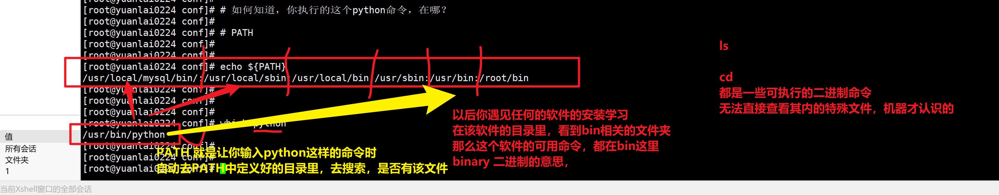


# 还需补充知识的命令

- uname

- history
- linux重要目录
- linux重要文件

## linux重要文件


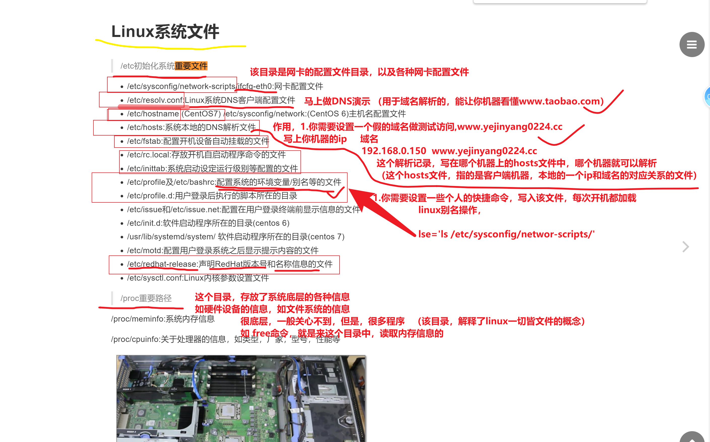

```
1.关于 系统，设置公网dns配置文件的演示
/etc/resolv.conf  

[root@yuanlai0224 ~]# cat /etc/resolv.conf  
# Generated by NetworkManager
nameserver 114.114.114.114


```

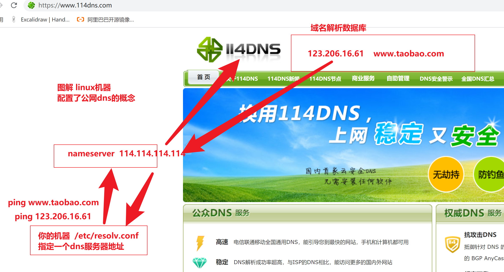


尽量配置国内的dns服务器地址，网速快，离你近

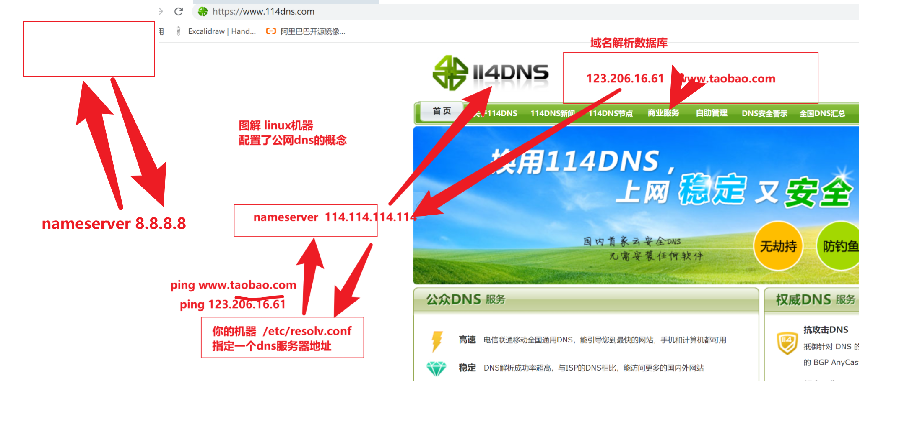

## 补充，dns劫持的原理

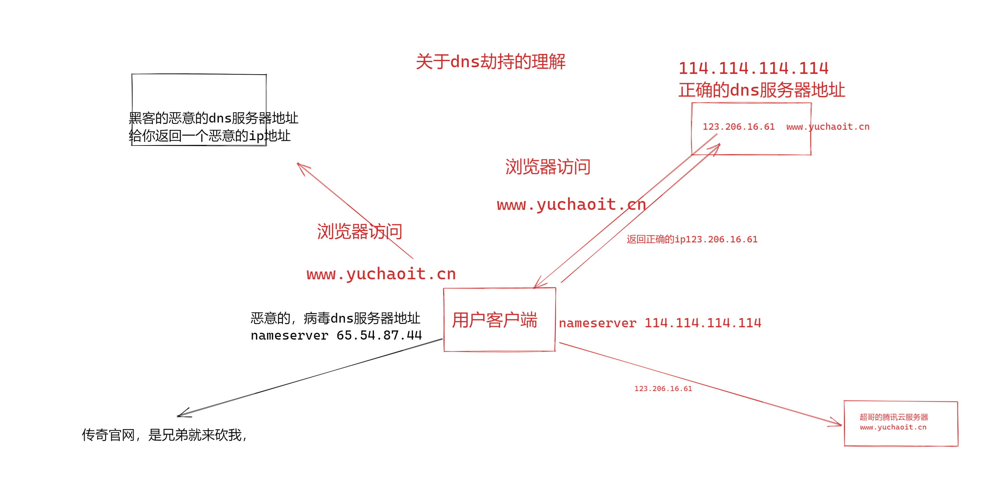

1.关闭你本地的公网dns服务器设置

2.修改hosts文件

```
1.去掉hosts里的恶意解析
2.配置正确的dns地址
3.涉及你本地机器，会有dns解析缓存，使用命令强制刷新

```


## 最后补充，重要的文件夹

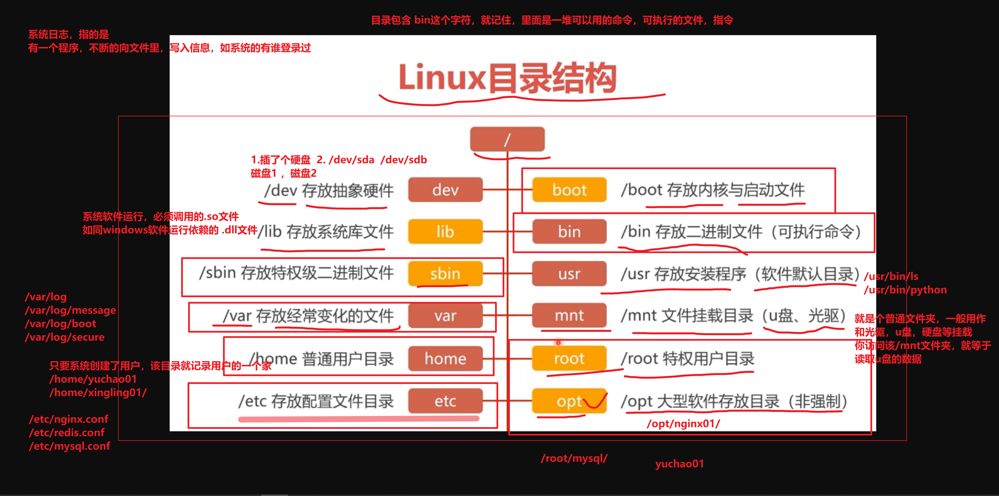


/usr/local/ 该目录，你以后，安装各种软件，往这里装就行了！

编译安装一个骇客帝国软件（代码下雨）

```
/usr/local/haikediguo/sbin/
```


## 下午安排

1.继续讲解文件操作，删除，拷贝，移动，复制，压缩，传输

2.针对两天的练习题，继续出题目，动手练


