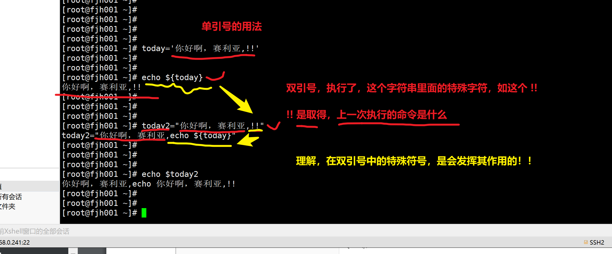

```### 此资源由 58学课资源站 收集整理 ###
	想要获取完整课件资料 请访问：58xueke.com
	百万资源 畅享学习

```
# 昨日回顾


# 什么是环境变量


1.环境  2.变量

环境，你的系统的运行环境，如windows，linux


> 来看看linux中的，环境变量有哪些
>
> 以及它的作用是什么？变量是有作用的
>
> 1.自定义变量

```
1. 变量的作用
[root@fjh001 ~]# cat hello.sh 
name="隔壁的老张"

echo "你好 $name"

echo "吃了吗 $name"

echo "你今天开心吗 $name"
echo "你今天开心吗 $name"

2.变量的取值
echo ${变量名}


```


> 2.系统内置变量
>
> PATH，让你输入linux命令，系统优先去PATH中定义的目录，寻找，是否有该命令，有则执行，无则报错。
>
> LANG ，系统中的变量，是有它的作用的，如这个LANG，可以修改系统的中英文字符集

```
1.PATH 可以让你快捷的使用linux命令

2. LANG变量，可以修改linux的中英文切换

echo ${LANG}

[root@fjh001 ~]# echo ${LANG}
en_US.UTF-8
[root@fjh001 ~]# 
[root@fjh001 ~]# 
[root@fjh001 ~]# LANG="zh_CN.UTF-8"   
[root@fjh001 ~]# 
[root@fjh001 ~]# 
[root@fjh001 ~]# echo ${LANG}
zh_CN.UTF-8


3.关于PATH变量的作用
[root@fjh001 ~]# 
[root@fjh001 ~]# echo ${PATH}
/usr/local/mysql/bin/:/usr/local/sbin:/usr/local/bin:/usr/sbin:/usr/bin:/root/bin
[root@fjh001 ~]# 
[root@fjh001 ~]# 
[root@fjh001 ~]# 
[root@fjh001 ~]# 
[root@fjh001 ~]# 
[root@fjh001 ~]# 
[root@fjh001 ~]# which ls
alias ls='ls --color=auto'
	/usr/bin/ls
[root@fjh001 ~]# 
[root@fjh001 ~]# 
[root@fjh001 ~]# 
[root@fjh001 ~]# # 去掉PATH变量的值，当你输入ls，系统就不知道这个ls到底在哪了，就没法快捷使用了
[root@fjh001 ~]# 
[root@fjh001 ~]# PATH=""
[root@fjh001 ~]# 
[root@fjh001 ~]# 
[root@fjh001 ~]# ls
-bash: ls: No such file or directory


```

# 关于su的用户切换

```
1.不切换环境变量的写法，错误！！！
[root@fjh001 ~]# 
[root@fjh001 ~]# echo $PATH
/usr/local/mysql/bin/:/usr/local/sbin:/usr/local/bin:/usr/sbin:/usr/bin:/root/bin
[root@fjh001 ~]# 
[root@fjh001 ~]# 
[root@fjh001 ~]# su zhiwei01
[zhiwei01@fjh001 root]$ 
[zhiwei01@fjh001 root]$ 
[zhiwei01@fjh001 root]$ 
[zhiwei01@fjh001 root]$ echo $PATH
/usr/local/mysql/bin/:/usr/local/sbin:/usr/local/bin:/usr/sbin:/usr/bin:/root/bin
[zhiwei01@fjh001 root]$ pwd
/root
[zhiwei01@fjh001 root]$ ls
ls: cannot open directory .: Permission denied
[zhiwei01@fjh001 root]$ 
[zhiwei01@fjh001 root]$ ls .
ls: cannot access .: Permission denied
[zhiwei01@fjh001 root]$ 


2.一定要 添加这个 短横线
[root@fjh001 ~]# su   -   zhiwei01
Last login: Mon Mar  7 17:26:12 CST 2022 on pts/0
[zhiwei01@fjh001 ~]$ 
[zhiwei01@fjh001 ~]$ 
[zhiwei01@fjh001 ~]$ pwd
/home/zhiwei01
[zhiwei01@fjh001 ~]$ echo $PATHj

[zhiwei01@fjh001 ~]$ 
[zhiwei01@fjh001 ~]$ 
[zhiwei01@fjh001 ~]$ echo $PATH
/usr/local/mysql/bin/:/usr/local/bin:/bin:/usr/bin:/usr/local/sbin:/usr/sbin:/home/zhiwei01/.local/bin:/home/zhiwei01/bin


```


# 用户之间的切换

```
1. root切换到songling01

su -  songling01    # 不用密码 ，用root很强，是系统的领导

2. songling01 想切换到 jingyang01

su - jingyang01  # 输入jingyang01


```

# linux命令的用法，语法


## ls用法


# 关于linux的单引号，双引号

1.他俩都是定义字符串数据的

2.但是他俩有不同的功能

```
1. 单引号，里面写什么，都会还原什么


```



```

2. 关于双引号的用法

```


# 关于命令提示符

```
# 根据命令提示符的用户名判断当前登陆用户


[root@fjh001 ~]#       
	最后一个#  表示是用户身份提示符，root则是#
	
查看普通用户的命令提示符
[root@fjh001 ~]# su - zhiwei01
Last login: Mon Mar  7 17:27:42 CST 2022 on pts/0

[zhiwei01@fjh001 ~]$ 
	$  表示普通用户，身份提示符

```


# 关于ssh命令

区分于windows和linux的写法

```
windows
ssh root@123.206.16.61 56717  

#  linux怎么写 

ssh -p 56717 root@123.206.16.61

```

# 关于w命令，显示系统登录用户


# stat命令，查看文件，文件夹状态

```
stat是linux的命令是（status的单词的缩写，表示状态的意思）

```

# linux的注释符

```
1. 用在命令行里，写在开头  ，如
#  echo "你好啊，孙大圣"

2.写在文件里，如shell脚本里


3. linux系统默认的所有文件，都是#符，是注释符（因为其他的编程语言，对注释符的认识是不一样的）
因为linux用的是bash这个脚本语言，它的注释符，是#
比如golang语言用的是 // 俩斜线
如python 语言，用的也是 # 


4.注释符，到底啥用，注释（备注）


```


# 关于/etc/hosts文件


# 关于公网dns的理解


10:20 


