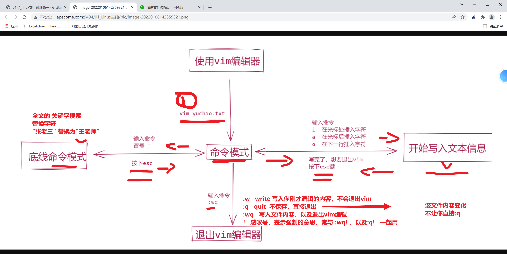

```### 此资源由 58学课资源站 收集整理 ###
	想要获取完整课件资料 请访问：58xueke.com
	百万资源 畅享学习

```
```
vim 测试数据


　　I have a dog. My dog name is DuDu. DuDu is 9 years. DuDu is fat. It wears a white coat. DuDu has two big eyes and two small ears. It has one short mouth. My dog is smart. I like my dog. Do you like DuDu?
　　
　　我有一只狗。我的狗的名字叫嘟嘟。嘟嘟9岁。嘟嘟胖。它穿着一件白色外套。嘟嘟有两个大眼睛和两个小耳朵。它有一个短嘴。我的狗是聪明的。我喜欢我的狗。你喜欢吗?
```


# vim的使用

1.安装vim

```
yum install vim -y 

```

# vim的使用流程

基本上 vi/vim 共分为三种模式，分别是：

- 命令模式（Command mode）
  - 最长用的，按下字母,a,i,o（a 在光标前开始编辑，i是在光标处，开始编辑，o是在光标下一行开始编辑）
  - 当你使用vim 标记某个文件时，第一步就进入了命令模式。
  - *你此时可以按下键盘的几个快捷键，进入不同的指令模式。*
  - 可以移动光标位置，输入快捷键指令，对文件进行编辑，如插入字符，复制，粘贴，删除等操作
- 输入模式（Insert mode）
  - 可以对文件内容进行编辑。
  - 退出编辑模式（按下esc键，回到了命令模式）
- 末行模式（Last line mode）底线模式
  - 从命令模式下 ，输入冒号，即进入了底线命令模式。
  - 进行一些特殊操作，如文本信息的查找，替换，保存，退出等；

还有一种特殊的`可视化模式`（多行操作模式），用于批量的列选操作。

# 图解vim使用流程




底线命令模式，的w模式，就是写入文件内容，以及创建文件的作用。


