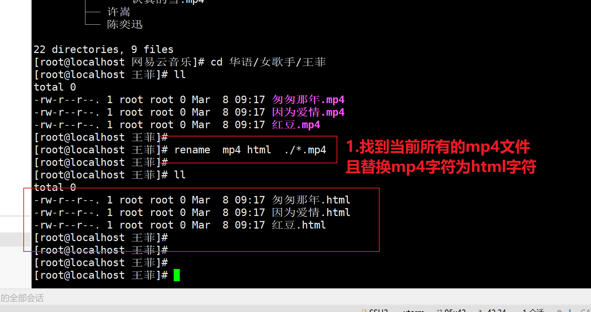
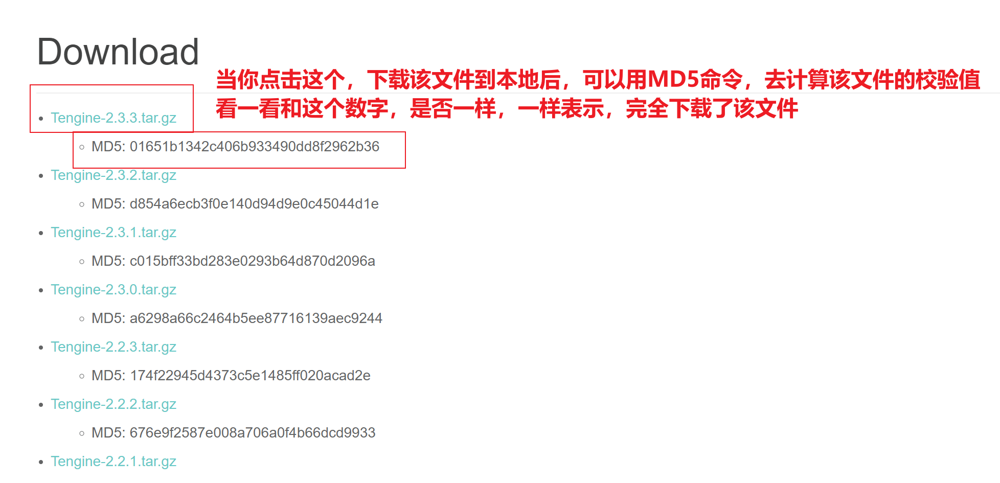
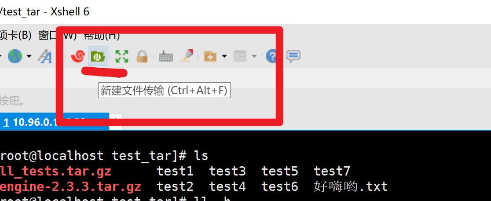
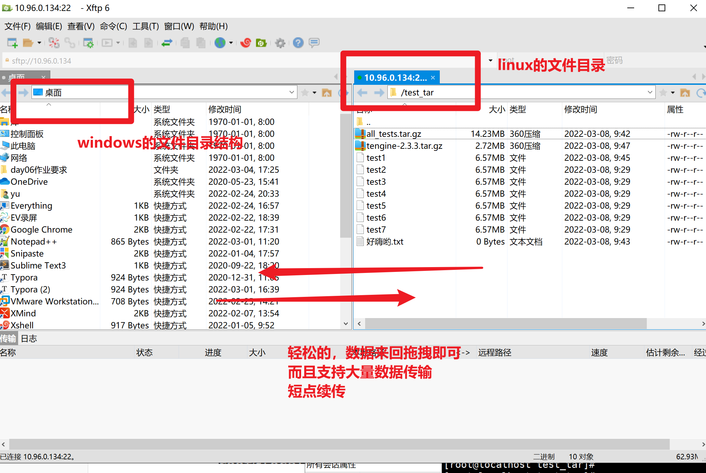
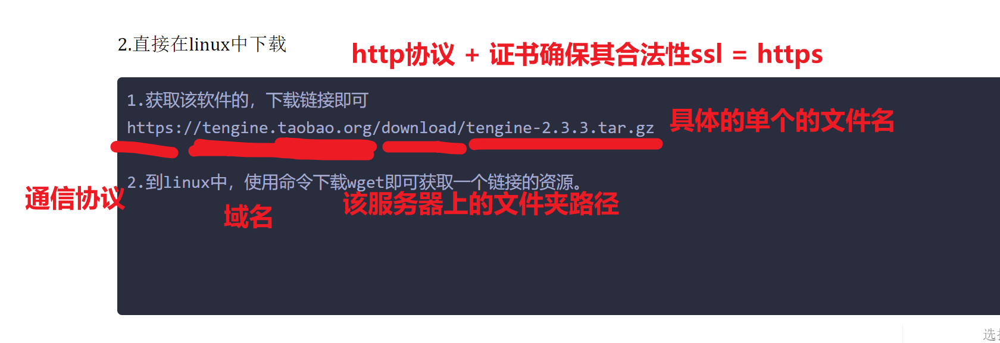

```### 此资源由 58学课资源站 收集整理 ###
	想要获取完整课件资料 请访问：58xueke.com
	百万资源 畅享学习

```
# 昨日作业解析

# 关于rm命令的坑

```
# 删除乐队组合下所有的文件内容
[root@linux0224 ~]#rm -rf /网易云音乐/华语/乐队组合/*

# 删除了乐队组合这个文件夹
[root@linux0224 ~]#rm -rf /网易云音乐/华语/乐队组合/  
```




# 关于tar

```
tar -xf   # 这是一个通用的，万能解压缩命令，已经可以自动适配，大多数压缩格式，自动的解压了gzip压缩的文件。

tar是打包命令
关于压缩，其实是gzip这样的命令
以及还有其他各种压缩指令，他们都是底层的压缩算法的不同，效率的不同，兼容性的不容
最主流的，你用gzip即可

tar  -z 调用gzip压缩指令了。


关于解压到指定目录
[root@localhost test_tar]# tar -xf all_tests.tar -C /tmp/all_test1/
[root@localhost test_tar]# 
[root@localhost test_tar]# 
[root@localhost test_tar]# ll -h /tmp/all_test1/
total 46M
-rw-r--r--. 1 root root 6.6M Mar  8 09:29 test1
-rw-r--r--. 1 root root 6.6M Mar  8 09:29 test2
-rw-r--r--. 1 root root 6.6M Mar  8 09:29 test3
-rw-r--r--. 1 root root 6.6M Mar  8 09:29 test4
-rw-r--r--. 1 root root 6.6M Mar  8 09:29 test5
-rw-r--r--. 1 root root 6.6M Mar  8 09:29 test6
-rw-r--r--. 1 root root 6.6M Mar  8 09:29 test7
[root@localhost test_tar]# 


```

# 关于下载网络上的文件

如何确保该文件的正确性（查看md5值）




## 补充，了解关于文件唯一值校验md5sum命令


## 关于linux如何下载一个网络上的文件

### lrzsz工具

1.下载到win里面，再传输给linux

```
1.先下载


2.使用文件传输工具，将该文件，发给linux
方法1，你的linux安装lrzsz工具，即可实现windows和xshell，直接拖拽文件

[root@localhost test_tar]# yum install lrzsz -y 

安装该工具后，会自动生成
rz  （接收）
sz   (send 发送)
两个命令 


3.获取win下载的那个文件

linux 接收，来自于win的文件

输入rz命令，接收


4.接收完毕后，验证该文件的正确性
[root@localhost test_tar]# md5sum tengine-2.3.3.tar.gz 
01651b1342c406b933490dd8f2962b36  tengine-2.3.3.tar.gz
[root@localhost test_tar]# 


扩充
，也可以直接win，拖拽到xshell里，即可传输


```


### xftp工具

和xshell是一个系列的软件

xshell是专门用于ssh登录服务器的终端软件

xftp 专门用于win和linux之间传输大量文件的，且支持短点续传。



---





2.直接在linux中下载

```
1.获取该软件的，下载链接即可
https://tengine.taobao.org/download/tengine-2.3.3.tar.gz

2.到linux中，使用命令下载wget即可获取一个链接的资源。
还得安装该命令
yum install wget -y

直接使用wget + 资源url(资源链接地址)即可。

wget https://tengine.taobao.org/download/tengine-2.3.3.tar.gz

```




## 下载网络中的开源软件

```
1.wget下载即可
wget https://codeload.github.com/jumpserver/jumpserver/zip/refs/heads/dev

2.解压缩，如果该文件，并非是tar.gz进行压缩的，你就无法用tar命令去解压缩！！
目前已知它是zip压缩包

3.用unzip解压缩
[root@localhost opt]# unzip dev


```


