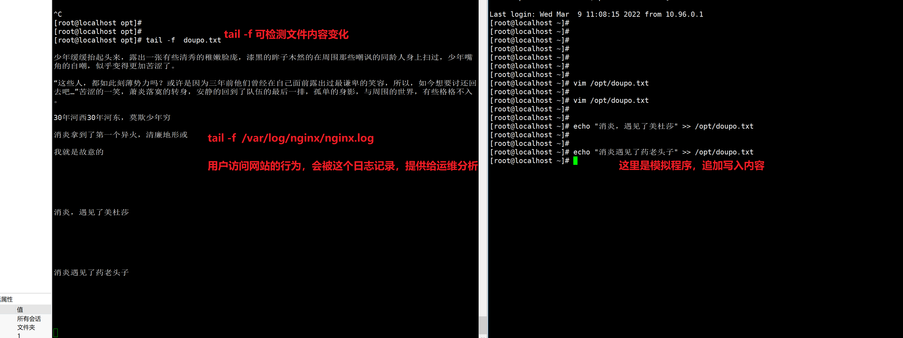
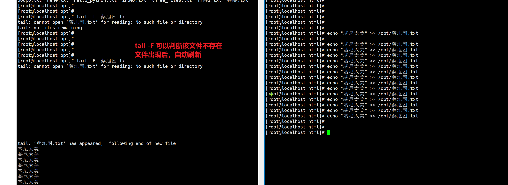
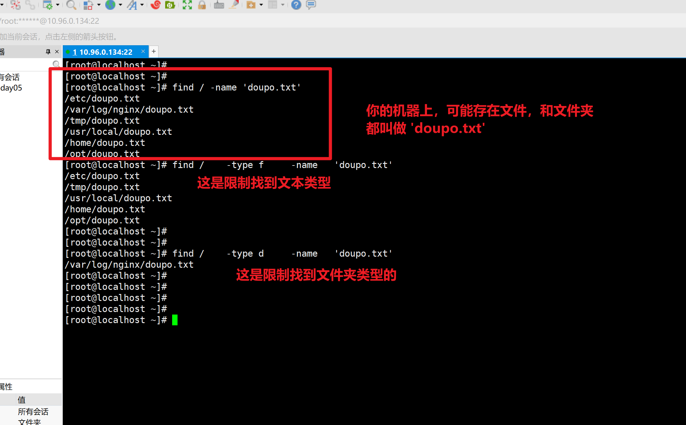

```### 此资源由 58学课资源站 收集整理 ###
	想要获取完整课件资料 请访问：58xueke.com
	百万资源 畅享学习

```
# 任务安排

- 昨日知识回顾 vim
- linux命令提默回顾（复习30分钟，提问+默写）
- 文本处理常用命令篇（下集）


# 了解网站部署

```
1.nginx小试牛刀

yum install  nginx -y 

系统默认是没有这个nginx安装包的。


2.简单了解，给你的机器，配置一个软件仓库（360软件大师，点点点，下载各种工具，它的软件，还携带了一堆广告）

配置阿里云的软件仓库
https://developer.aliyun.com/mirror/

这里配置下载2个软件仓库 （centos和redhat系统的关系）

# wget -O 指定文件存放到哪里   资源的下载链接

# 直接下载Centos-7.repo这个文件，到当前目录
wget https://mirrors.aliyun.com/repo/Centos-7.repo

# 不但下载资源，且指定到某一个路径下
wget -O /etc/yum.repos.d/CentOS-Base.repo https://mirrors.aliyun.com/repo/Centos-7.repo

wget -O /etc/yum.repos.d/epel.repo http://mirrors.aliyun.com/repo/epel-7.repo


3.既然机器有了软件仓库，即可下载各种应用了

[root@localhost opt]# yum install nginx -y


4. 就可以启动该应用
[root@localhost opt]# systemctl start nginx 


5.程序运行了，如何判断他运行？
windows 
	任务管理器 
		查看进程，就是一个个运行中的软件，在消耗系统的资源
		
linux
	任务管理器
		查看进程
			查看nginx这个程序的进程	
			
				执行ps命令 

命令是 ，仅仅查看这个机器上的 nginx进程信息，是否存在
ps -ef |grep nginx 
			
	

6. 一个网站的运行，默认端口是 http的80端口
用你的客户端，浏览器去访问， 
10.96.0.134:80即可


7.注意关闭服务器的防火墙
执行命令
[root@localhost opt]# iptables -F


8.停止这个网站服务，思路是？
停用80端口，也就是，停止这个软件的运行
[root@localhost opt]# systemctl stop nginx

再次重新运行，命令是
systemctl restart nginx


8.可以修改该软件的配置了，比如网站首页的内容

完成1分钟，做一个dnf官网

下载该网址的首页html文件
wget https://dnf.qq.com/main.shtml

移动，拷贝该文件，到你的nginx网站目录下， 它会自动识别

移动 /opt/main.shtml  到/usr/share/nginx/html/ 目录下，且重命名为index.html

[root@localhost opt]# mv /opt/main.shtml /usr/share/nginx/html/index.html
mv: overwrite ‘/usr/share/nginx/html/index.html’? y


9.当你修改了网站的前端页面，无须重启，网站自动更新
http://10.96.0.134/


```

> 完成练习效果，访问你的linux机器地址，看到一个有内容的网址即可。
>
> 课程里是dnf官网，自行更换其他html文件。

# 文件管理篇命令二

# cat命令

```
1.cat 适合读取小文件，不能读取大文件，一次性将文件内容全部读取到内存中，且输出到屏幕上

查看nginx软件的配置文件（前提是你安装了该软件，linux默认安装的软件，配置文件会自动写到/etc目录下）

[root@localhost opt]# cat /etc/nginx/nginx.conf

查看系统的用户信息有哪些
[root@localhost opt]# cat /etc/passwd


2.cat 添加一个功能参数  -n 显示行号
[root@localhost opt]# cat -n  /etc/passwd

3. cat不适合读取大文件，显示也不友好
比如 cat  /var/log/messages


4. 还可以连续读取多个文件，并且显示三文件一共有多少行
[root@localhost opt]# cat -n  doupo.txt   hehe.txt   hello_python.txt

5. 结合重定向符号使用

>   重定向覆盖输出符  ，数据从左边，覆盖写入到右边 
<   重定向覆盖输入符，数据从右边，覆盖写入到左边
>>  重定向追加输出符， ，数据从左边，追加写入到右边 
<<  重定向覆盖输入符，数据从右边，追加写入到左边

cat  doupo.txt   hehe.txt   hello_python.txt  > ./three_files.txt 


6.
[root@localhost opt]# echo 春晓 > 春晓.txt
[root@localhost opt]# echo 春眠不觉晓 > 春晓.txt
[root@localhost opt]# 
[root@localhost opt]# 
[root@localhost opt]# echo 春晓 > 春晓.txt
[root@localhost opt]# 
[root@localhost opt]# 
[root@localhost opt]# echo 春眠不觉晓 >> 春晓.txt
[root@localhost opt]# echo 处处蚊子咬>> 春晓.txt
[root@localhost opt]# echo 越来讽喻诗>> 春晓.txt
[root@localhost opt]# 
[root@localhost opt]# echo 滑落至多为>> 春晓.txt
[root@localhost opt]# 
[root@localhost opt]# 
[root@localhost opt]# cat 春晓.txt 
春晓
春眠不觉晓
处处蚊子咬
越来讽喻诗
滑落至多为


7.使用cat命令来实现，很简单

cat 和重定向符号，结合使用

>   重定向覆盖输出符  ，数据从左边，覆盖写入到右边 
<   重定向覆盖输入符，数据从右边，覆盖写入到左边
>>  重定向追加输出符， ，数据从左边，追加写入到右边 
<<  重定向覆盖输入符，数据从右边，追加写入到左边


写法如下，一般用于写入多行数据

cat >> 古诗2.txt <<EOF
你的数据在这里写。。。
EOF

EOF是一个关键字，end of file  ，文件的结束

[root@localhost opt]# cat  >>古诗2.txt <<EOF
> 嗯嗯嗯
> 呃呃呃，曲项向天歌
> 白毛浮绿水
> 红掌拨清波
> EOF
[root@localhost opt]# 
[root@localhost opt]# 
[root@localhost opt]# cat 古诗2.txt 
嗯嗯嗯
呃呃呃，曲项向天歌
白毛浮绿水
红掌拨清波


8. cat证明文件存在空行的办法
-b  只会对有内容的行，显示其行号，空行不显示
-E  在linux文件中，每一行的结束，默认会添加一个你看不到的，特殊符号 '$'  ，表示是该行的结尾

可以利用-b参数，完成对有内容的行，进行编号的作用
[root@localhost opt]# cat -b doupo.txt 

比如你去查看文件的字符数量有多少


```


# tac命令

将文件从后，向前，倒着查看

```
[root@localhost opt]# cat  -n hehe.txt 
     1	yuchao
     2	yejingyang
     3	chenliangliang
[root@localhost opt]# 
[root@localhost opt]# 
[root@localhost opt]# tac hehe.txt 
chenliangliang
yejingyang
yuchao

```

# ls和sl

ls 查看文件夹下内容

```
安装这个sl命令
yum install sl -y

sl是一个小火车命令
```


# more和less命令

more和cat都是一次性读取所有内容到内存，不适合读取大文件，占资源

less命令是显示多少文本，消耗多少内存，省资源。

```
空格，翻篇

回车 下一行
```

# head和tail命令


### tail -f （重点）

```
head 脑袋

查看文件的默认前10行
[root@localhost opt]# head  doupo.txt 


head -5  文件   # 查看文件的前5行


tail 命令
查看文件的后默认10行
tail -5  文件  #表示查看文件的后5行


tail有一个重点命令，叫做实时刷新文件内容

-f  跟踪文件内容变化，但是需要文件正常退出后，可见，最常用的也就是小写的f，检测程序的日志变化（程序代码，追加新内容到文件中的）


```




### 结合tail和上午安装的nginx练习日志查看

```
1.用tail 检测nginx的访问日志
[root@localhost opt]# tail -f  /var/log/nginx/access.log 


2.用浏览器，访问nginx的页面即可，不断刷新，不断出现新的日志


```

### tail -F 

```
能够对文件进行刷新读取，即使该文件不存在，也可以检测


```




## wc命令

统计文件的行

- vim（set nu）
- cat -n
- wc -l 

```
1.wc命令，统计文件内有多少行，有一个回车，是一个空行
[root@localhost opt]# wc -l doupo.txt 
32 doupo.txt
[root@localhost opt]# ll


2. wc -w 统计文件内的单词数

[root@localhost opt]# wc -w hehe.txt 
9 hehe.txt
[root@localhost opt]# 
[root@localhost opt]# 
[root@localhost opt]# vim hehe.txt 
[root@localhost opt]# 
[root@localhost opt]# cat  hehe.txt 
yu chao    王秉诚  王仁刚    赵阳阳 
yejingyang
chenliangliang

李 文杰   刘永飞 张鑫  
[root@localhost opt]# 
[root@localhost opt]# wc -w hehe.txt 
11 hehe.txt


```


# du命令

统计文件大小的命令

- ls -lh


```
du命令
作用：查看文件或目录(会递归显示子目录)占用磁盘空间大小

语法：du [参数选项] 文件名或目录名

常见参数：

-s ：summaries，只显示汇总的大小，统计文件夹的大小

[root@localhost opt]# du -s .
105072KB	.


-h：表示以高可读性的形式进行显示，如果不写-h，默认以KB的形式显示文件大小

linux的文件系统，对文件最小管理单位是4kb算起。

[root@localhost opt]# du -h *
4.0K	doupo.txt
4.0K	hehe.txt
4.0K	hello_python.txt
4.0K	index.txt
4.0K	three_files.txt
26M	xixi
26M	xixi1
26M	xixi2
26M	xixi3
4.0K	古诗2.txt
4.0K	呵呵.txt
4.0K	春晓.txt
4.0K	蔡旭困.txt


2.显示文件夹的大小
[root@localhost /]# du -h /opt
103M	/opt


3.发现机器磁盘空间不够了，你领导让你看看日志目录是不是太大了
du -sh  /var/log

4.查看nginx软件的日志目录，容量是多少

[root@localhost log]# du -sh /var/log/nginx
32K	/var/log/nginx


```

# find找文件

windows下的强大搜索工具

everything工具

linux的工具是谁？---find命令。

find是递归查找

```
学习一个命令，先学语法

find   从哪找   -name  "你要找什么"

# 从机器上，找到doupo.txt文本

find  /  -name 'doupo.txt'

[root@localhost ~]# find  /  -name 'doupo.txt'
/opt/doupo.txt
[root@localhost ~]# 
[root@localhost ~]# 

缩小搜索范围，从/opt开始找
[root@localhost ~]# 


[root@localhost ~]# find  /opt  -name 'doupo.txt'
/opt/doupo.txt


如果文件名是写死的，找不到，那就是这个/opt目录下没有该文件
[root@localhost ~]# find  /opt  -name 'doupo.txt1'
[root@localhost ~]# 
[root@localhost ~]# 

最大范围，全系统搜索
[root@localhost ~]# find  /  -name 'doupo.txt1'


# 找到机器上所有的 doupo.txt

[root@localhost ~]# # 找出机器上所有的 doupo.txt
[root@localhost ~]# 
[root@localhost ~]# 
[root@localhost ~]# find  /  -name 'doupo.txt'
/etc/doupo.txt
/tmp/doupo.txt
/usr/local/doupo.txt
/home/doupo.txt
/opt/doupo.txt
[root@localhost ~]# 


# 模糊查找，找出/var下所有的log文件  nginx.log  mysql.log   yuchao.log    *.log 
[root@localhost ~]# # 模糊查找，找出/var下所有的log文件
[root@localhost ~]# 
[root@localhost ~]# 
[root@localhost ~]# find /var  -name '*.log'


# 找出机器上，所有的png图片
[root@localhost ~]# find / -name '*.png'


# -type  f   找到文本类型的数据 
# -type  d    找到文件夹类型的数据


# 找出机器上所有的 doupo.txt 【文件，文本文件,可以被cat的文件】
# 严格注意命令的语法细节！！
# 严格注意命令的语法细节！！
# 严格注意命令的语法细节！！

find /    -type f     -name   'doupo.txt' 


```


> 我想查看linux上的图片，如何看

```
图片路径是，/usr/share/nginx/html/nginx-logo.png

有哪些思路
1.windows （linux把该图片，发到win上,lrzsz工具，xftp）

2.linux上装图像编辑器（你的linux也得装图形化）


```




