```### 此资源由 58学课资源站 收集整理 ###
	想要获取完整课件资料 请访问：58xueke.com
	百万资源 畅享学习

```
# 昨日回顾

https://help.aliyun.com/document_detail/26342.html


```
1. 哨兵对于redis主从集群的作用
2. 阿里云是如何用哨兵的
3. 阿里云是如何用redis-cluster的

阿里云
```

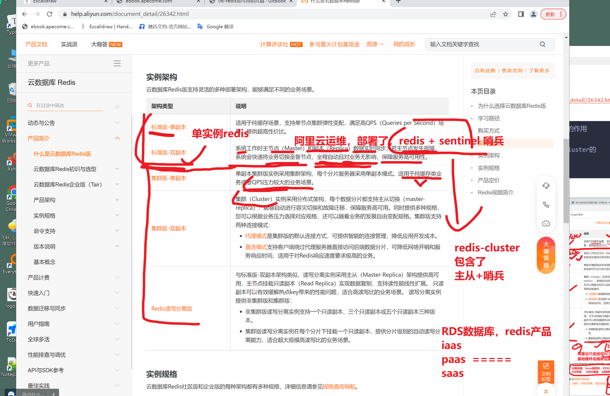


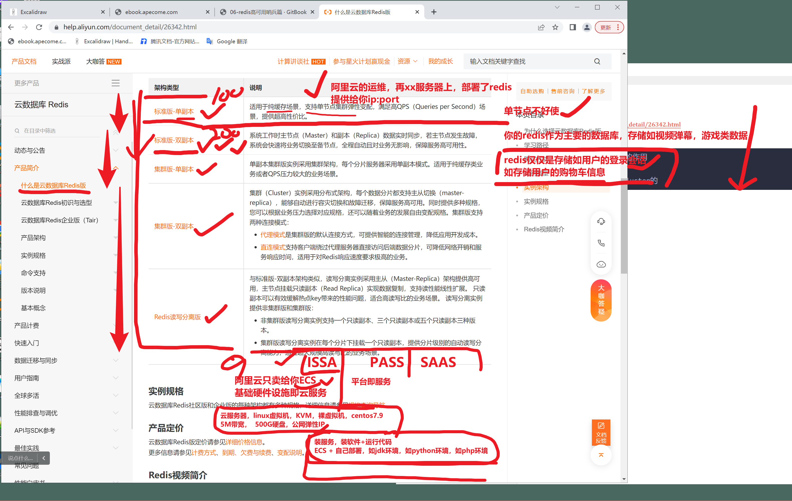


## 回顾哨兵，捋一捋

```
1. 哨兵监测多套主从集群
2. 捋一捋哨兵的监控命令，状态查看命令
3. redis实例的状态查看命令
4. 查看哨兵的日志，查看主从切换过程


```


## redis 两套主从部署

为了简单，用root去启动


### 第一套db-51 6379

```
mkdir -p  /opt/redis_6379/{conf,pid,logs}
mkdir -p /redis_db/

cat >/opt/redis_6379/conf/redis_6379.conf <<'EOF'
daemonize yes
bind 0.0.0.0
port 6379
pidfile /opt/redis_6379/pid/redis_6379.pid
logfile /opt/redis_6379/logs/redis_6379.log
save 900 1
save 300 10
save 60 10000
dbfilename linux_redis_dump.rdb
appendonly yes
appendfilename "linux_appendonly.aof"
dir /redis_db/
appendfsync everysec
aof-use-rdb-preamble yes 
requirepass redis111
EOF


```

### 其他2个从库，只需要加入复制参数即可

```
mkdir -p  /opt/redis_6379/{conf,pid,logs}
mkdir -p /redis_db/

cat >/opt/redis_6379/conf/redis_6379.conf <<'EOF'
daemonize yes
bind 0.0.0.0
port 6379
pidfile /opt/redis_6379/pid/redis_6379.pid
logfile /opt/redis_6379/logs/redis_6379.log
save 900 1
save 300 10
save 60 10000
dbfilename linux_redis_dump.rdb
appendonly yes
appendfilename "linux_appendonly.aof"
dir /redis_db/
appendfsync everysec
aof-use-rdb-preamble yes 
replicaof 10.0.0.51 6379
masterauth redis111
EOF


```


### 启动第一套主从集群，查看状态


```
# 查看redis的数据库信息，以及复制的信息
# 
redis-cli info  Replication
```


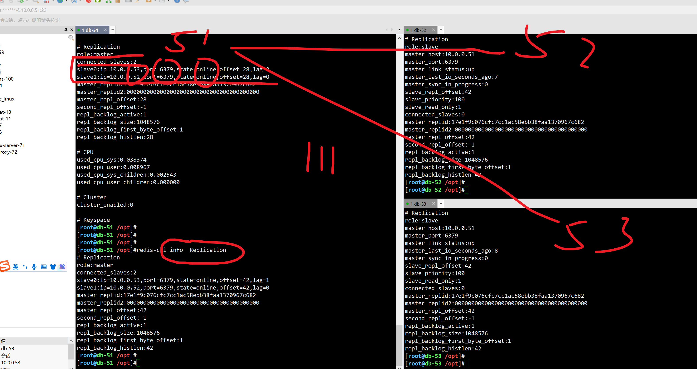


## 第二套redis集群配置

redis默认端口是 6380

### 主库

````
mkdir -p  /opt/redis_6380/{conf,pid,logs}
mkdir -p  /redis_db_6380/

cat >/opt/redis_6380/conf/redis_6380.conf <<'EOF'
daemonize yes
bind 0.0.0.0
port 6380
pidfile /opt/redis_6380/pid/redis_6380.pid
logfile /opt/redis_6380/logs/redis_6380.log
save 900 1
save 300 10
save 60 10000
dbfilename linux_redis_dump.rdb
appendonly yes
appendfilename "linux_appendonly.aof"
dir /redis_db_6380/
appendfsync everysec
aof-use-rdb-preamble yes 
requirepass redis222
EOF


````


### 从库

```
mkdir -p  /opt/redis_6380/{conf,pid,logs}
mkdir -p  /redis_db_6380/

cat >/opt/redis_6380/conf/redis_6380.conf <<'EOF'
daemonize yes
bind 0.0.0.0
port 6380
pidfile /opt/redis_6380/pid/redis_6380.pid
logfile /opt/redis_6380/logs/redis_6380.log
save 900 1
save 300 10
save 60 10000
dbfilename linux_redis_dump.rdb
appendonly yes
appendfilename "linux_appendonly.aof"
dir /redis_db_6380/
appendfsync everysec
aof-use-rdb-preamble yes 
replicaof 10.0.0.51 6380
masterauth redis222
EOF


```


### 启动第二套redis主从集群

```
[root@db-51 /opt]#redis-server /opt/redis_6380/conf/redis_6380.conf 
[root@db-51 /opt]#
[root@db-51 /opt]#ps -ef|grep redis
root       1871      1  0 18:05 ?        00:00:00 redis-server 0.0.0.0:6379
root       1915      1  0 18:10 ?        00:00:00 redis-server 0.0.0.0:6380
root       1922   1769  0 18:10 pts/0    00:00:00 grep --color=auto redis


```


### 查看第二套集群的复制状态

```
redis-cli  -h 127.0.0.1 -p 6380 info  Replication
```


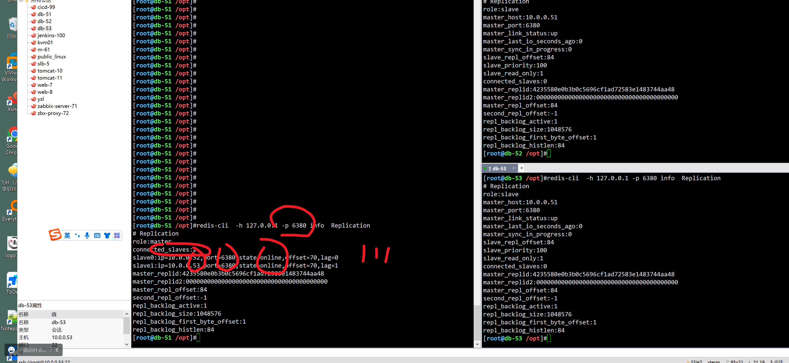


## 部署哨兵了，一套即可，监控多台集群

```
redis主库有密码，哨兵通信机制，也是走主库的，因此得先链接上主库，有权限操作

```

1. 哨兵是基于发布订阅的，频道，互相建立哨兵集群的，交换信息的

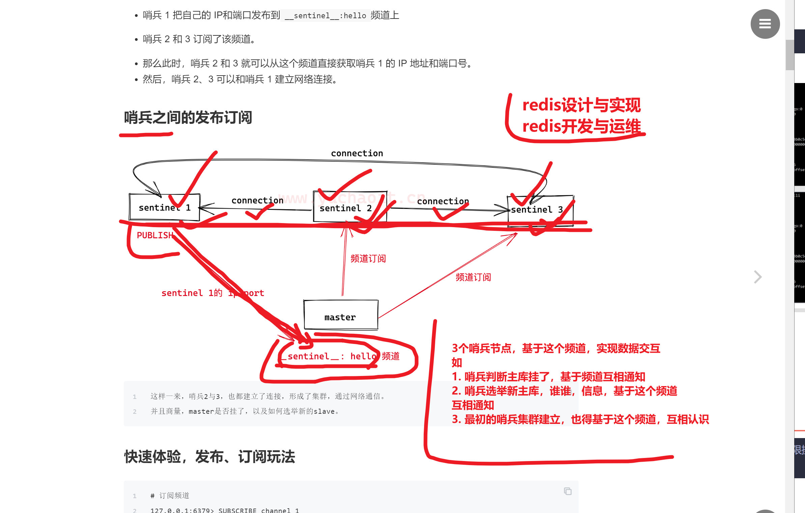


2.哨兵向主库索要 ，master的info命令结果，得知主从赋值集群


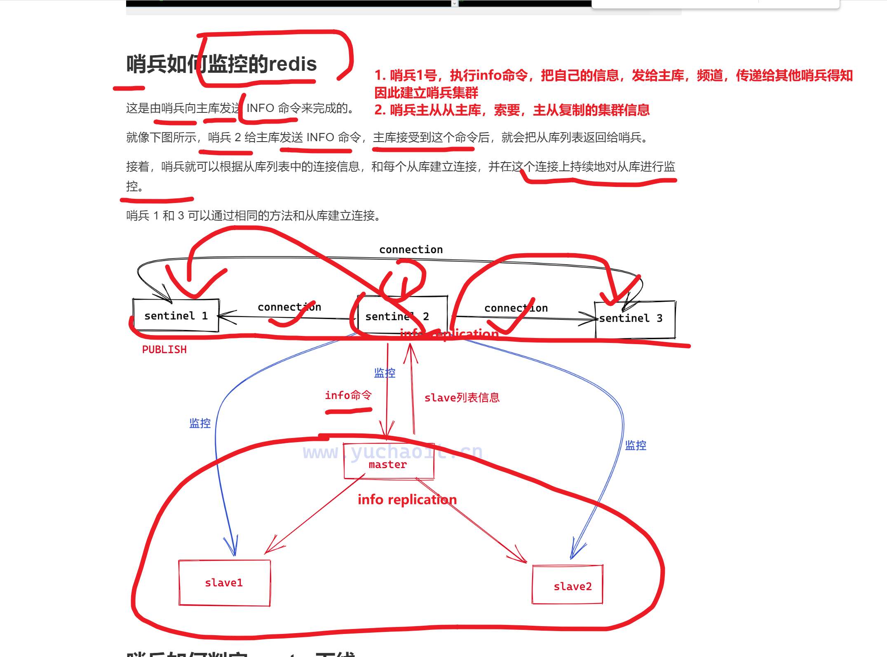


哨兵会做那些事

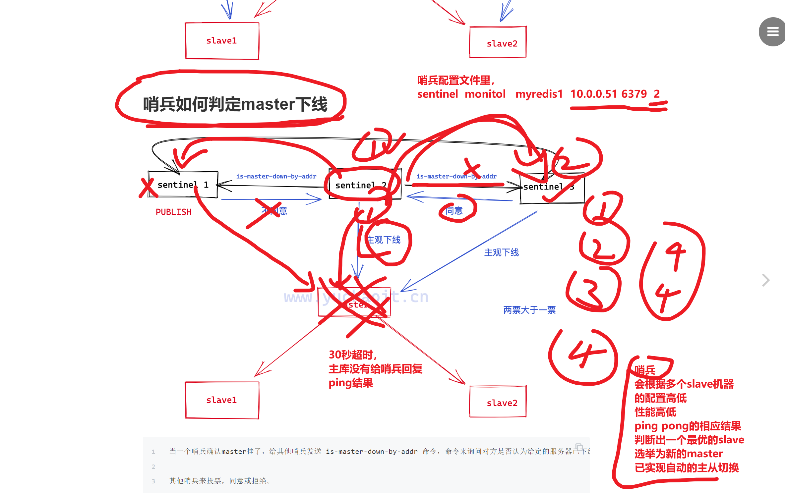

10.35

```
1. 哨兵会自动修改redis从库的配置文件，以及哨兵的配置文件，以实现，主从信息的永久更新


```


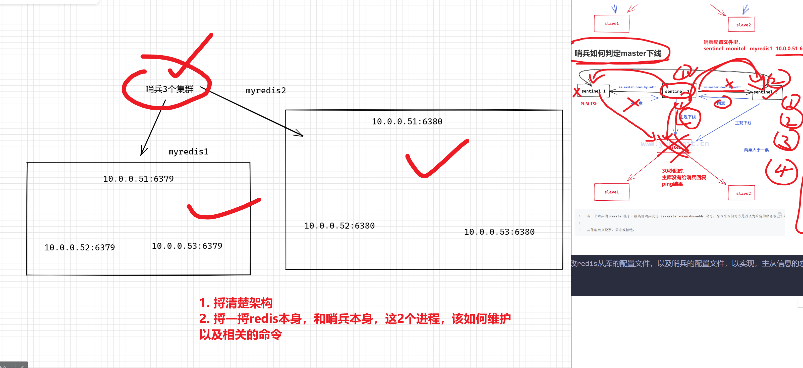


## 改进2套redis实例，加入密码了检查结果

```
第一套复制关系
[root@db-51 /opt]#
[root@db-51 /opt]#redis-cli -a redis111 info replication
Warning: Using a password with '-a' or '-u' option on the command line interface may not be safe.
# Replication
role:master
connected_slaves:2
slave0:ip=10.0.0.52,port=6379,state=online,offset=126,lag=1
slave1:ip=10.0.0.53,port=6379,state=online,offset=126,lag=1
master_replid:d33fffe85b005ce81c23c4bfdb8d7373b04770b2
master_replid2:0000000000000000000000000000000000000000
master_repl_offset:126
second_repl_offset:-1
repl_backlog_active:1
repl_backlog_size:1048576
repl_backlog_first_byte_offset:1
repl_backlog_histlen:126


第二套复制关系
[root@db-51 /opt]#redis-cli -p 6380 -a redis222 info replication
Warning: Using a password with '-a' or '-u' option on the command line interface may not be safe.
# Replication
role:master
connected_slaves:2
slave0:ip=10.0.0.53,port=6380,state=online,offset=112,lag=1
slave1:ip=10.0.0.52,port=6380,state=online,offset=112,lag=0
master_replid:1ffe41f7213aed58c64b958d97217f499ba45b44
master_replid2:0000000000000000000000000000000000000000
master_repl_offset:112
second_repl_offset:-1
repl_backlog_active:1
repl_backlog_size:1048576
repl_backlog_first_byte_offset:1
repl_backlog_histlen:112


```


## 哨兵部署过程

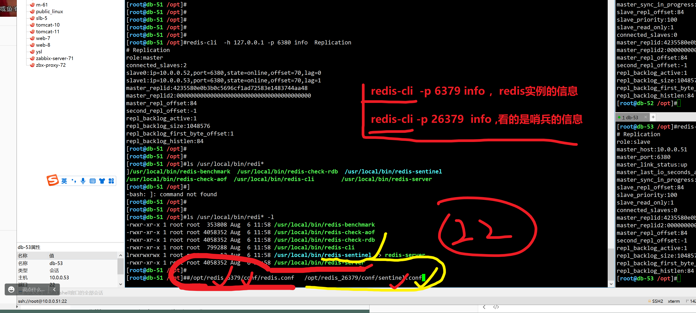


```
1. 无需安装，redis本身提供的命令

mkdir -p /data/redis_26379
mkdir -p /opt/redis_26379/{conf,pid,logs}

cat > /opt/redis_26379/conf/redis_26379.conf <<EOF
bind 0.0.0.0 
port 26379
daemonize yes
logfile /opt/redis_26379/logs/redis_26379.log
dir /data/redis_26379
sentinel monitor myredis1 10.0.0.51 6379 2
sentinel down-after-milliseconds myredis1 30000
sentinel parallel-syncs myredis1 1
sentinel failover-timeout myredis1 180000


sentinel monitor myredis2 10.0.0.51 6380 2
sentinel down-after-milliseconds myredis2 30000
sentinel parallel-syncs myredis2 1
sentinel failover-timeout myredis2 180000

EOF


2.启动哨兵即可
redis-sentinel /opt/redis_26379/conf/redis_26379.conf

[root@db-51 /opt]#ps -ef|grep redis
root       2056      1  0 18:39 ?        00:00:00 redis-server 0.0.0.0:6379
root       2094      1  0 18:40 ?        00:00:00 redis-server 0.0.0.0:6380
root       2137      1  0 18:48 ?        00:00:00 redis-sentinel 0.0.0.0:26379 [sentinel]
root       2158   1769  0 18:50 pts/0    00:00:00 grep --color=auto redis


3.命令检查哨兵集群，以及配置文件
[root@db-51 /opt]#redis-cli -p 26379 info sentinel
# Sentinel
sentinel_masters:2
sentinel_tilt:0
sentinel_running_scripts:0
sentinel_scripts_queue_length:0
sentinel_simulate_failure_flags:0
master0:name=myredis2,status=sdown,address=10.0.0.51:6380,slaves=0,sentinels=1
master1:name=myredis1,status=sdown,address=10.0.0.51:6379,slaves=0,sentinels=1
[root@db-51 /opt]#

4.踩坑了，哨兵没写密码，加入密码即可


```

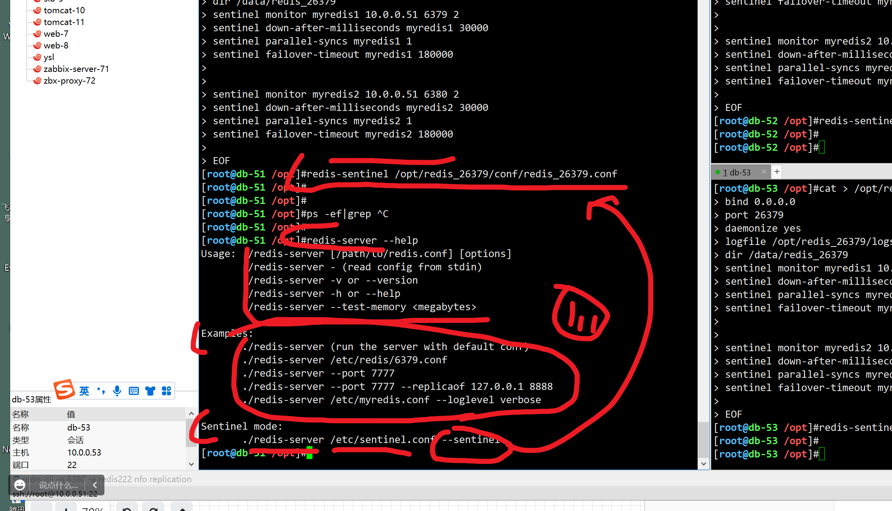


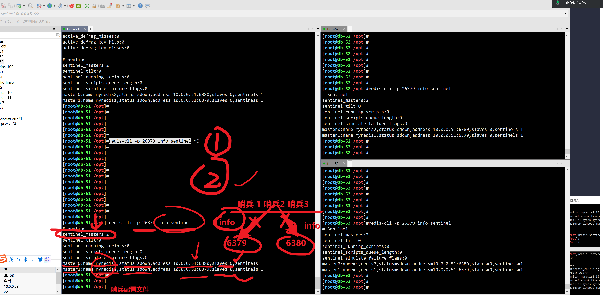


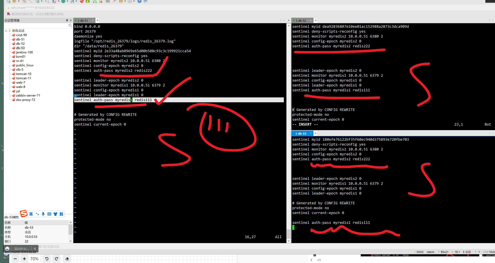

```
重启哨兵，查看复制关系

通过 redis-cli -p 26379 info sentinel 查看了哨兵的状态是OK的

修改哨兵配置文件，记录主从集群的状态

```

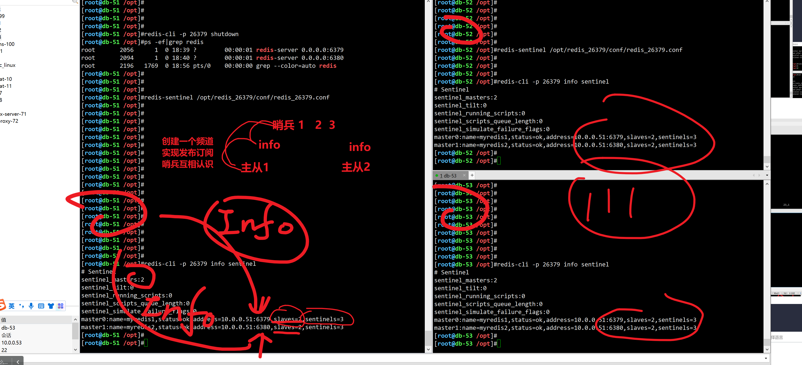


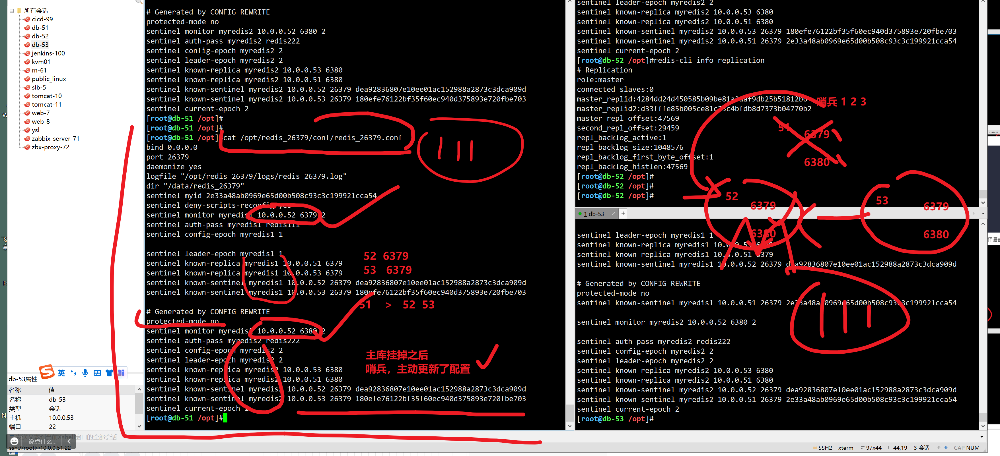

```
分析哨兵，干了什么事，都看过了


```


## 卡在 主从切换上，新的复制关系查看

```
[root@db-51 /opt]#redis-cli -p 26379 info sentinel
# Sentinel
sentinel_masters:2
sentinel_tilt:0
sentinel_running_scripts:0
sentinel_scripts_queue_length:0
sentinel_simulate_failure_flags:0
master0:name=myredis1,status=ok,address=10.0.0.52:6379,slaves=2,sentinels=3
master1:name=myredis2,status=ok,address=10.0.0.52:6380,slaves=2,sentinels=3
[root@db-51 /opt]#

这个信息，意思是，哨兵目前认为最新的复制关系应该是
52 主库 ，51  53 作为从库


查看redis实例状态
redis-cli -p 6379 info replication

发现主从信息是对的，但是没有复制成功


查看哨兵日志


```

## 哨兵主从切换的日志原理查看

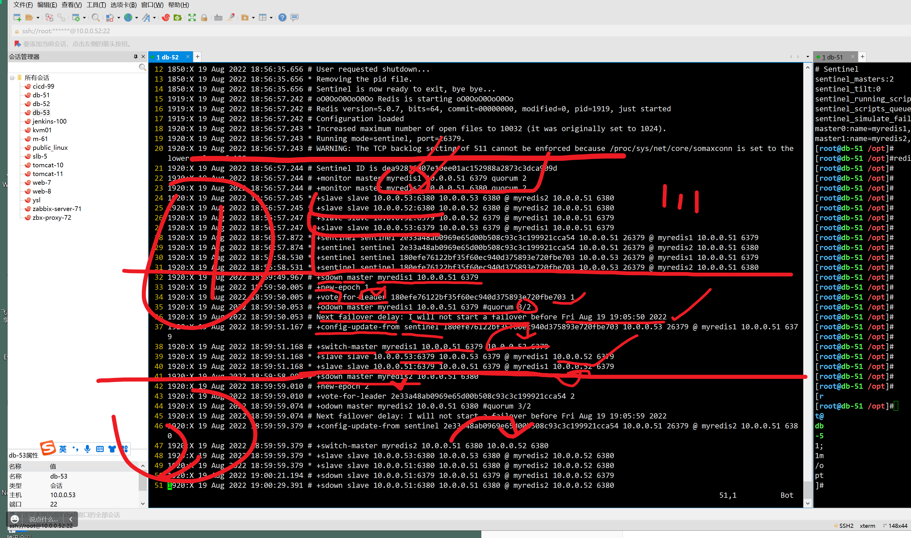


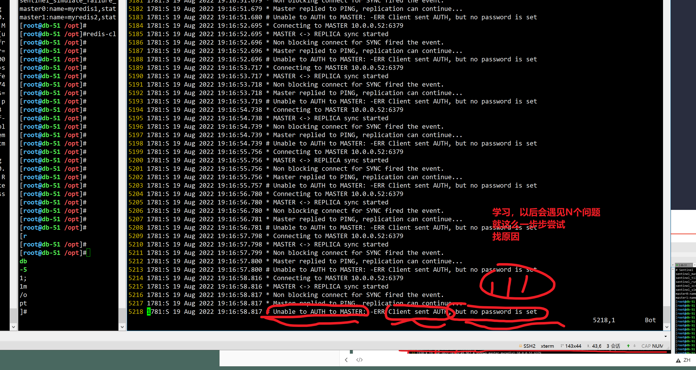


### 解决思路

```
1. 再建立主从关系时，别写死配置文件，因为哨兵也会去修改配置文件，但是不会修改密码的信息
密码是自定义的字符串，哨兵无法处理

2. 初始化时，就是3个master新机器，基于参数 slaveof replicaof建立主从关系即可，
config set requirepass 动态设置密码，确保当前进程的密码认证安全性
主从切换，密码被重置了。


3。删除3个redis实例的配置文件，改的是 myredis1集群的 配置，配置文件中的密码参数，即可实现认证

4.先关闭，53机器，这个从库，然后一并启动 ，53,51从库，查看复制关系

[root@db-53 /opt]#
[root@db-53 /opt]#
[root@db-53 /opt]#redis-cli shutdown
[root@db-53 /opt]#


5.然后一并启动 ，53,51从库，查看复制关系

[root@db-52 /opt]#redis-cli info Replication
# Replication
role:master
connected_slaves:2
slave0:ip=10.0.0.53,port=6379,state=online,offset=322288,lag=0
slave1:ip=10.0.0.51,port=6379,state=online,offset=322288,lag=0
master_replid:4284dd24d450585b09be81a3daf9db25b51812b6
master_replid2:d33fffe85b005ce81c23c4bfdb8d7373b04770b2
master_repl_offset:322288
second_repl_offset:29459
repl_backlog_active:1
repl_backlog_size:1048576
repl_backlog_first_byte_offset:1
repl_backlog_histlen:322288


6.思路梳理
关于redis主从哨兵集群，由于是中小型公司用的较多的内容， 因此如下原理，给看明白了。

redis-cluster 对缓存作主营业务，会用这个技术，以及或者用其他的集群方案。
拿官方的集群方案去讲解作为学习入门。


- 由于我们默认再redis实例中写死了密码参数
- 哨兵进行主从切换后，52为新主库，但是没有密码，52配置文件里没有密码设置的参数
- 53机器，作为从库，但是填入了密码链接参数，导致链接报错
- 解决思路是如上
配置文件别写死参数，config set动态设置即可
- 将53,51的密码相关参数，删掉，重启
- 由于哨兵中记录了51,53的信息，因此自动将51,53加入 为从库
- 如果要密码认证加固，config set 加密码即可

- 再次新一轮的主从切换，本次是没有密码，的查看是否可以切换成功
- - 确认切换成功了，可以自己去redis日志，哨兵日志，查看切换过程，到这看懂，听懂111


=================================================================================
别这么玩了
- 下一次，给加入密码，查看结果

给新主库加入密码
新从库加入密码，查看复制关系
127.0.0.1:6379> CONFIG GET requirepass
1) "requirepass"
2) ""
127.0.0.1:6379> 


写入和哨兵中一致的密码
127.0.0.1:6379> CONFIG set requirepass redis111
OK
127.0.0.1:6379> CONFIG GET requirepass
(error) NOAUTH Authentication required.
127.0.0.1:6379> 
127.0.0.1:6379> auth redis111
OK


```


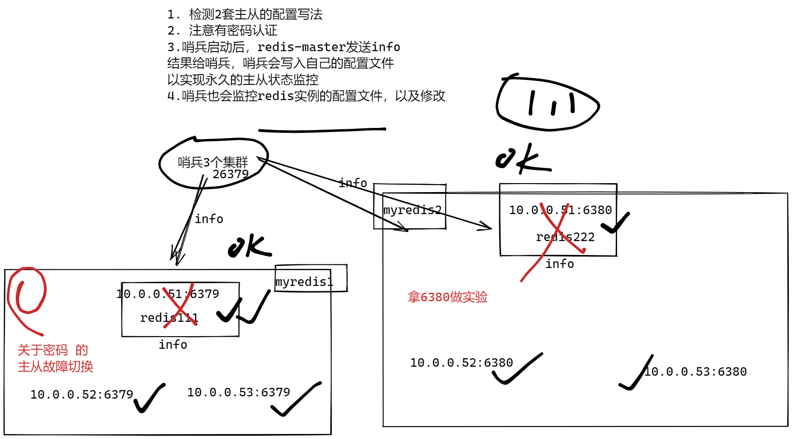


# 今日redis集群


# 1为什么要学redis集群技术的场景

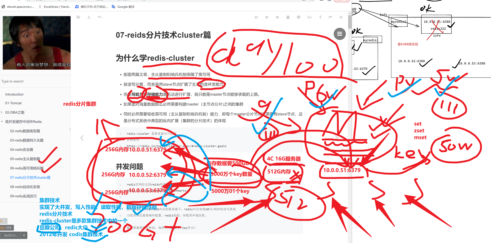


```
1.一个很重的货物，一个较弱的小马，扛不住

解决方案，买个大象，大象单价呢？大象罢工？


2. 同理
1T内存数据，普通服务器，根本扛不住

买一个 1T内存服务器呢？单价呢？服务器集群考虑呢？买多个1T内存服务器呢？


3解决方案，分布式
买多个小马，
买多个普通版服务器，人多力量大

技术，如负载均衡等，都一样。


```


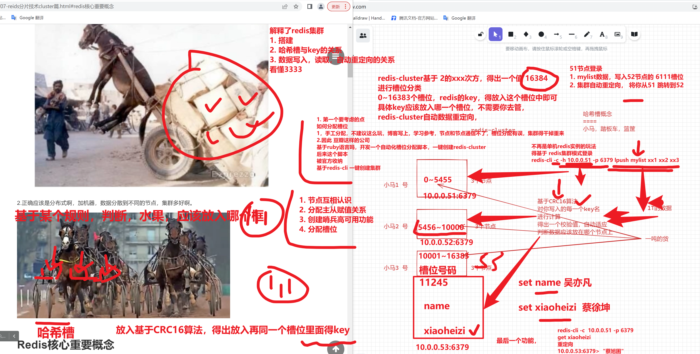

更多细节，建议

1.看博客

2.看书，

太过于理论，深入去理解

## 搭建过程

```
1. 修改配置文件，开启redis-cluster集群功能

```

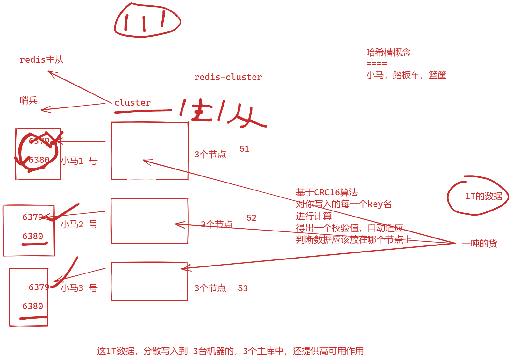

根据配置图，完成架构部署


## db-51机器配置文件，主库配置

```
daemonize yes
bind 0.0.0.0
port 6379
pidfile "/opt/redis_6379/pid/redis_6379.pid"
logfile "/opt/redis_6379/logs/redis_6379.log"
save 900 1
save 300 10
save 60 10000
dbfilename "linux_redis_dump.rdb"
appendonly yes
appendfilename "linux_appendonly.aof"
dir "/redis_db"
appendfsync everysec
aof-use-rdb-preamble yes

cluster-enabled yes
cluster-config-file nodes_6379.conf
cluster-node-timeout 15000

```


启动db-51机器的redis实例节点，第一个节点

```
[root@db-51 ~]#redis-server /opt/redis_6379/conf/redis_6379.conf 
[root@db-51 ~]#
[root@db-51 ~]#ps -ef|grep redis
root       2803      1  0 20:27 ?        00:00:00 redis-server 0.0.0.0:6379 [cluster]
root       2808   2653  0 20:27 pts/0    00:00:00 grep --color=auto redis


```

查看生成集群配置文件

```
[root@db-51 /redis_db]#cat /redis_db/nodes_6379.conf 
2e23d1c06ee0eb50443b3df59bce67555000e34d :0@0 myself,master - 0 0 0 connected
vars currentEpoch 0 lastVoteEpoch 0

```

### 给db-51再开一个从库配置即可

```
[root@db-51 /redis_db]#
[root@db-51 /redis_db]#sed  's/6379/6380/g' /opt/redis_6379/conf/redis_6379.conf  > /opt/redis_6379/conf/redis_6380.conf 


[root@db-51 /redis_db]#ls /opt/redis_6379/conf/
redis_6379.conf  redis_6380.conf

redis-server /opt/redis_6379/conf/redis_6380.conf


```


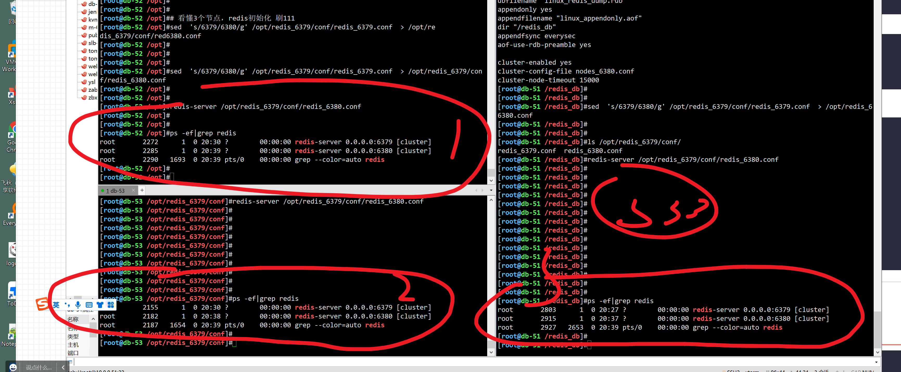


## db-52,db-53一样操作

```
1. 配置文件，只需要加入3个集群参数即可

2. 启动，确保以集群模式运行即可


[root@db-53 /opt]#redis-server /opt/redis_6379/conf/redis_6379.conf 
[root@db-53 /opt]#
[root@db-53 /opt]#ps -ef|grep redis
root       2155      1  0 20:30 ?        00:00:00 redis-server 0.0.0.0:6379 [cluster]
root       2160   1654  0 20:30 pts/0    00:00:00 grep --color=auto redis


```


## 官网5.0最新推荐，基于redis-cli内置命令，一键创建集群方案

```
1. 命令如下，需要设置，节点信息，以及复制关系
# 语法

# --cluster create 创建集群关系 主 主 主 从 从 从 
#--cluster-replicas ，每一个主，就给一个从，建立1主1从的关系
#


redis-cli --cluster create 10.0.0.51:6379 10.0.0.52:6379  10.0.0.53:6379  10.0.0.51:6380  10.0.0.52:6380  10.0.0.53:6380  --cluster-replicas 1


```


## 图解redis-cluster集群创建过程


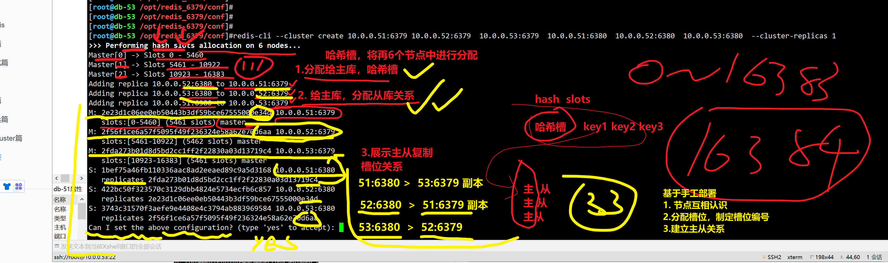


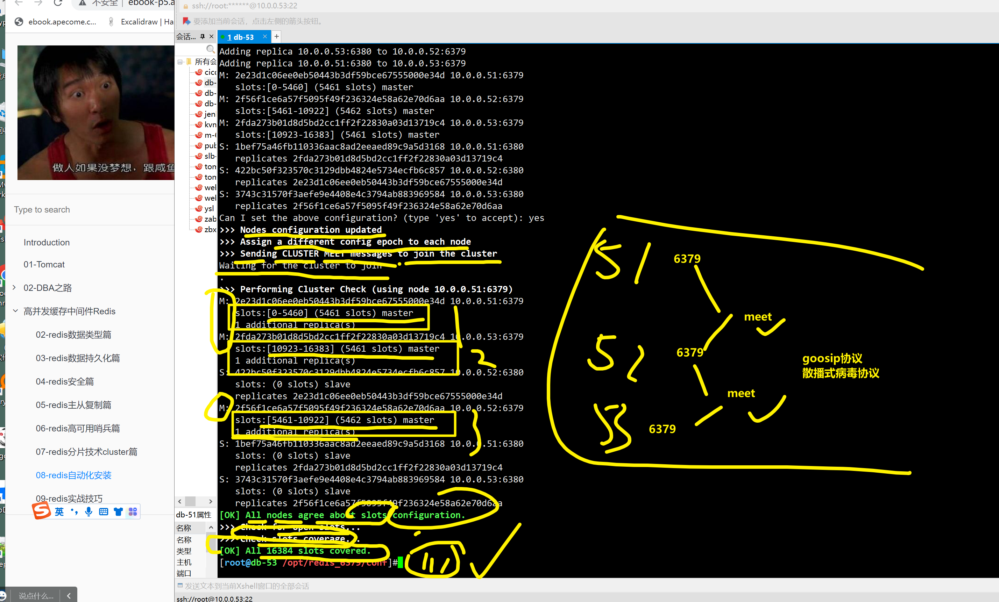


## 使用过程

```
51  6379  6380
52  6379  6380
53  6379  6380 

都作为集群中的任意一个节点，都可以读写数据，集群都会自动重定向，到该数据，所在的槽位，的节点中

# 读


# 写

[root@db-53 /opt/redis_6379/conf]#redis-cli -c -h 10.0.0.51 -p 6380 
10.0.0.51:6380> 
10.0.0.51:6380> 
10.0.0.51:6380> ping
PONG
10.0.0.51:6380> 
10.0.0.51:6380> keys *
(empty list or set)
10.0.0.51:6380> 
#xiaoheizi 这个key，属于再52节点的槽位中，的9844号槽位

10.0.0.51:6380> set xiaoheizi  caixukun
-> Redirected to slot [9844] located at 10.0.0.52:6379
OK
10.0.0.52:6379> 

且自动重定向节点了


[root@db-53 /opt/redis_6379/conf]#
[root@db-53 /opt/redis_6379/conf]#redis-cli -c -h 10.0.0.53 -p 6380 
10.0.0.53:6380> 
10.0.0.53:6380> 
10.0.0.53:6380> 
10.0.0.53:6380> get xiaoheizi
-> Redirected to slot [9844] located at 10.0.0.52:6379
"caixukun"
10.0.0.52:6379> set name1  wuyifan
-> Redirected to slot [12933] located at 10.0.0.53:6379
OK
10.0.0.53:6379> 
10.0.0.53:6379> 
10.0.0.53:6379> 


```


## 查看集群的性能

大量数据写入，CRC16算法，是否均衡写入key


```
是否均衡写入数据测试
# 333  333   333 区间左右

for i in {1..1000}
do
    redis-cli -c -h 10.0.0.53 -p 6380 set k_${i} v_{$i} && echo "${i} is done."
done

[root@db-53 /opt/redis_6379/conf]#redis-cli --cluster info 10.0.0.51:6380
10.0.0.52:6379 (2f56f1ce...) -> 327 keys | 5462 slots | 1 slaves.
10.0.0.53:6379 (2fda273b...) -> 336 keys | 5461 slots | 1 slaves.
10.0.0.51:6379 (2e23d1c0...) -> 339 keys | 5461 slots | 1 slaves.
[OK] 1002 keys in 3 masters.
0.06 keys per slot on average.


```


## 查看集群信息

```
1.看redis本身信息

redis-cli -h 10.0.0.51 -p 6379    info  # redis实例本身的运行信息

redis-cli -h 10.0.0.51 -p 26379    info


看集群信息，通过redis实例端口进入，但是开启集群参数--cluster

[root@db-53 /opt/redis_6379/conf]#redis-cli --cluster info 10.0.0.51:6380
10.0.0.52:6379 (2f56f1ce...) -> 1 keys | 5462 slots | 1 slaves.
10.0.0.53:6379 (2fda273b...) -> 1 keys | 5461 slots | 1 slaves.
10.0.0.51:6379 (2e23d1c0...) -> 0 keys | 5461 slots | 1 slaves.
[OK] 2 keys in 3 masters.

3个命令，看懂3333


```


## 

redis结束。


# 作业安排


1、 redis学习整理


2.、 写简历，最近是黄金期，面试邀约特别多，挨个的写好，找我看建立。

redis整理完毕后，加入简历。


