```### 此资源由 58学课资源站 收集整理 ###
	想要获取完整课件资料 请访问：58xueke.com
	百万资源 畅享学习

```


# 前言

- iptables知识点也很多，并且特别细，理论性也很强
- 如何学习
  - 记好，表，链这两块
  - 以及学会针对表、链进行规则添加，完成常见流量控制的语句编写即可

# 1.服务器防火墙介绍


# 2.软件防火墙介绍

```
1. 系统底层实现流量控制，数据包控制的软件是 netfilter
2. 我们通过iptables命令，实现规则的修改
```


## Iptables介绍

```

```

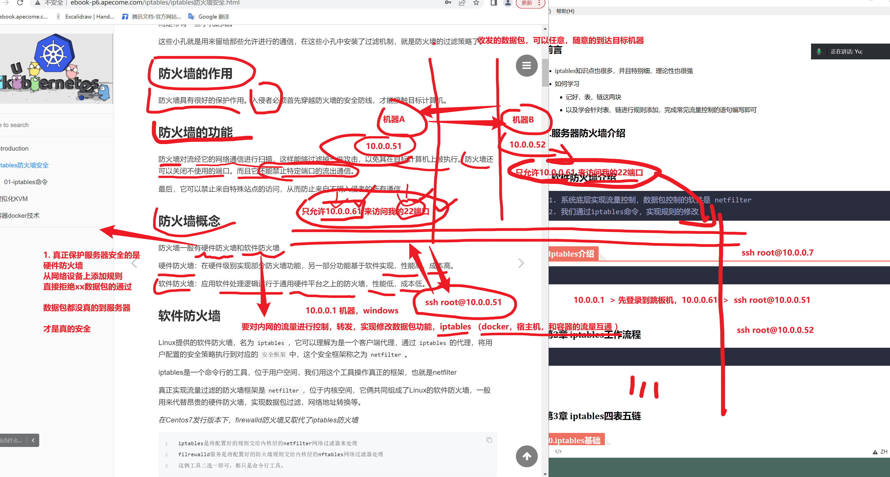


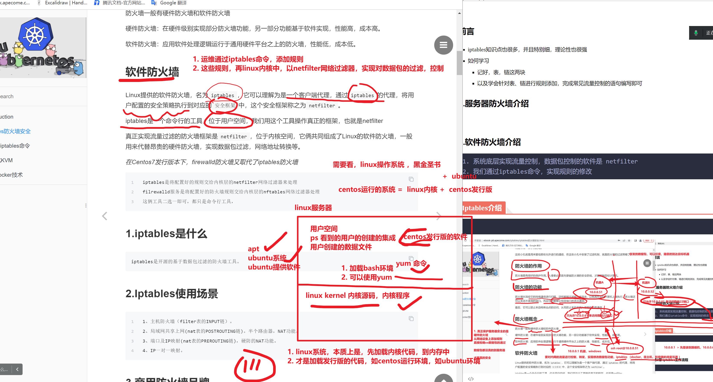


# 第2章 iptables工作流程

```

```


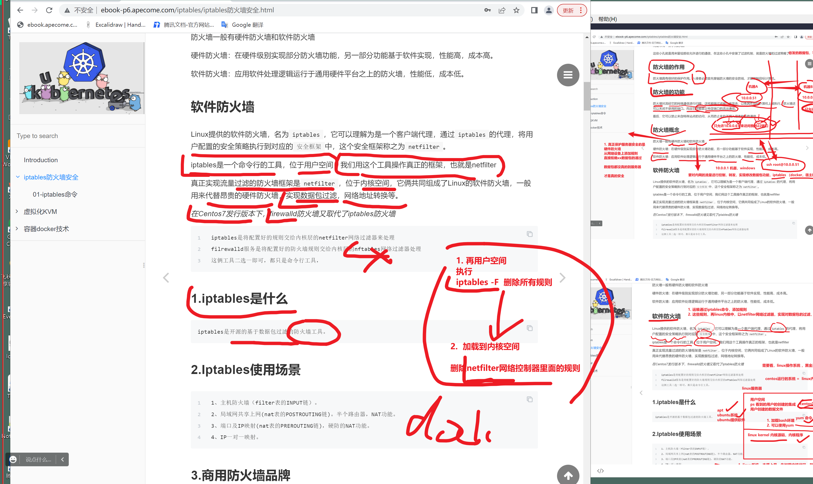


## 图解防火墙，与快递包裹的关系

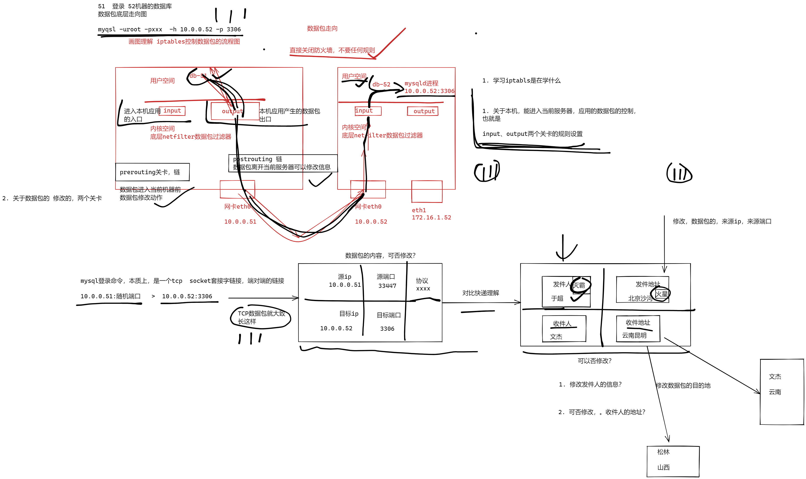

10 20

简单明了，深入浅出

```
掌握主要的 

filter表
- 以及表对应的几个链
- 对应链的规则添加


nat表
- 以及表对应的几个链
- 对应链的规则添加


```

# 举例，你是如何访问nginx的，流量怎么通过的


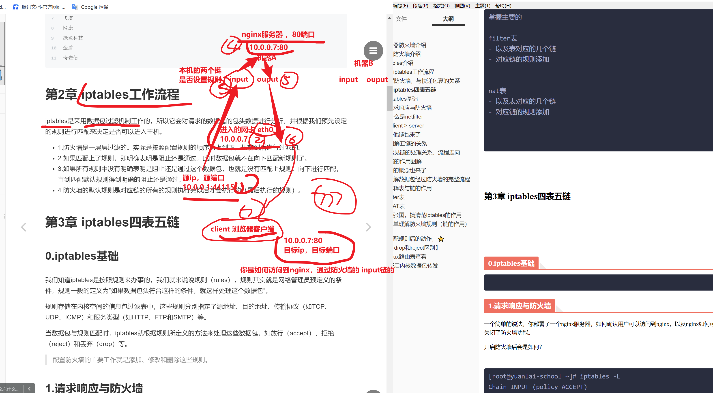


## 举例，2个机器，基于防火墙规则，是否能访问到nginx


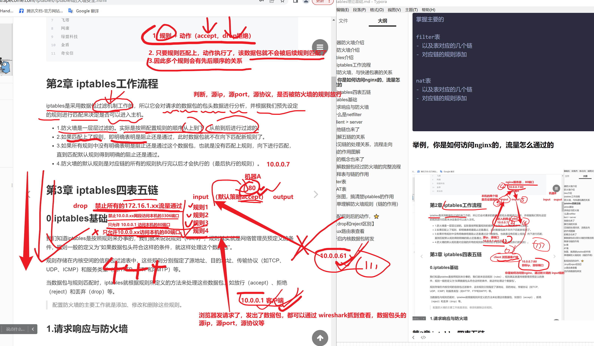

## 防火墙本质作用


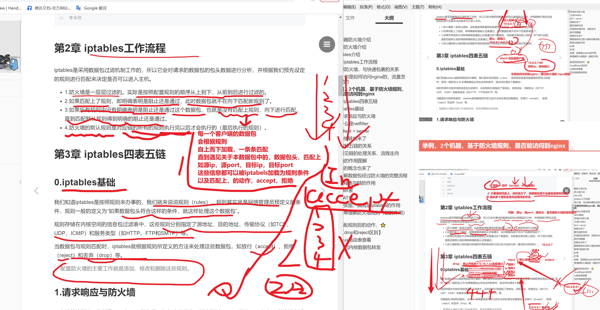


## 测试nginx的规则匹配

```perl
1. 查看防火墙规则
-n 不做主机名解析，只显示，ip，port，更直观
-L  列出所有的链，的语句 （5条链），默认只显示filter表，的3个链的规则

iptables -nL  

# chain 链（一堆规则的集合，名字，链）

[root@m-61 ~]#iptables -nL  
Chain INPUT (policy ACCEPT)
target     prot opt source               destination         

Chain FORWARD (policy ACCEPT)
target     prot opt source               destination         

Chain OUTPUT (policy ACCEPT)
target     prot opt source               destination      


```

# 第一个80端口的访问规则

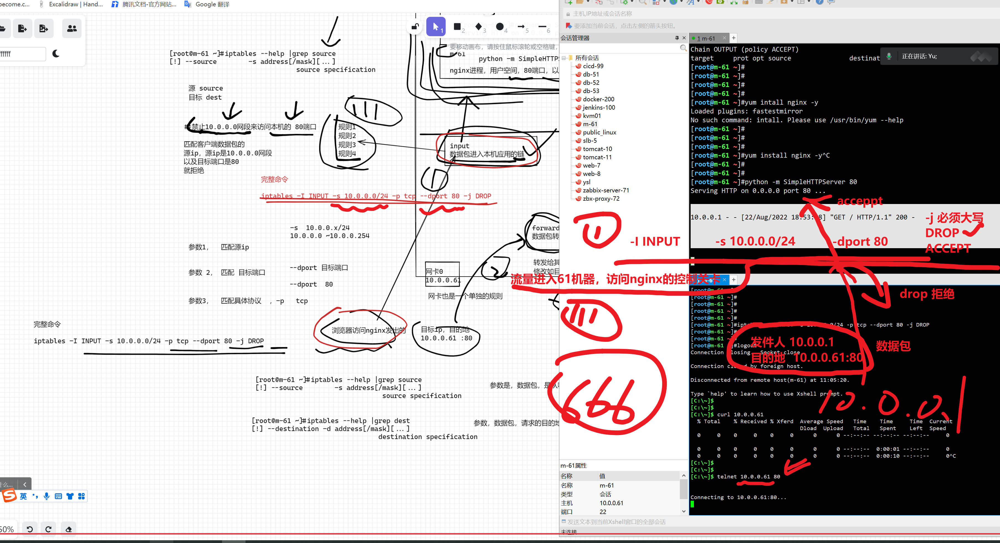


## 如何能让10.0.0.1这个机器访问80端口

```perl
思路，就是你的规则


```


已知，1号规则，是拒绝10网段的，且访问的是80端口的数据包

提问，如何让10.0.0.1，可访问这个80端口？

```perl

1. 清空规则


2. 加规则，改规则（没有改一说，只有删除，重建一说）


怎么加？注意防火墙，前后匹配的语法
思考5分钟，发弹幕，统一记录

陈亮亮
加在这个规则前面

杨松麟
添加 允许10.0.0.0/24 通过80端口在最前面

# -I 再规则最前面，写入新的
# -A 再最后面写入新规则

iptables -I INPUT -s 10.0.0.0/24 -p tcp --dport 80 -j ACCEPT

#删除松林写的规则
[root@m-61 ~]#iptables -D  INPUT 1

[root@m-61 ~]#iptables -nL --line-num
Chain INPUT (policy ACCEPT)
num  target     prot opt source               destination         
1    DROP       tcp  --  10.0.0.0/24          0.0.0.0/0            tcp dpt:80

Chain FORWARD (policy ACCEPT)
num  target     prot opt source               destination         

Chain OUTPUT (policy ACCEPT)
num  target     prot opt source               destination         
[root@m-61 ~]#

# 加入永飞写的规则
# 还原环境，写入2个规则语句即可
# -A -I 参数

iptables -I INPUT -s 10.0.0.1  -p tcp --dport 80 -j ACCEPT
iptables -A INPUT -s 10.0.0.0/24  -p tcp --dport 80 -j DROP


刘永飞
加一条允许10.0.0.1访问80端口的规则加到号码1上面 
iptables -I INPUT -s 10.0.0.1  -p tcp --dport 80 -j ACCEPT


[root@m-61 ~]#iptables -nL
Chain INPUT (policy ACCEPT)
target     prot opt source               destination         
ACCEPT     tcp  --  10.0.0.1             0.0.0.0/0            tcp dpt:80
DROP       tcp  --  10.0.0.0/24          0.0.0.0/0            tcp dpt:80

Chain FORWARD (policy ACCEPT)
target     prot opt source               destination         

Chain OUTPUT (policy ACCEPT)
target     prot opt source               destination         
[root@m-61 ~]#
[root@m-61 ~]#


#给61机器，运行80端口应用，走INPUT链


# 已验证，10.0.0.1是可以访问的
# 验证，永飞这个规则，是单独给 10.0.0.1 访问80的放行规则

# 如何让51机器也可以通过80
# 删除规则
# 添加规则（办法可能会有很多）
# 1. 针对51机器的规则
# 2. 针对51机器所处网段的规则
# 


[root@m-61 ~]#iptables -nL
Chain INPUT (policy ACCEPT)
target     prot opt source               destination         
ACCEPT     tcp  --  10.0.0.1             0.0.0.0/0            tcp dpt:80
DROP       tcp  --  10.0.0.0/24          0.0.0.0/0            tcp dpt:80

Chain FORWARD (policy ACCEPT)
target     prot opt source               destination         

Chain OUTPUT (policy ACCEPT)
target     prot opt source               destination         
[root@m-61 ~]#
[root@m-61 ~]#touch 超哥666
[root@m-61 ~]#
[root@m-61 ~]#
[root@m-61 ~]## 完全看懂 51机器不通，刷1111
[root@m-61 ~]#


```


# 针对当前服务器本身流量控制

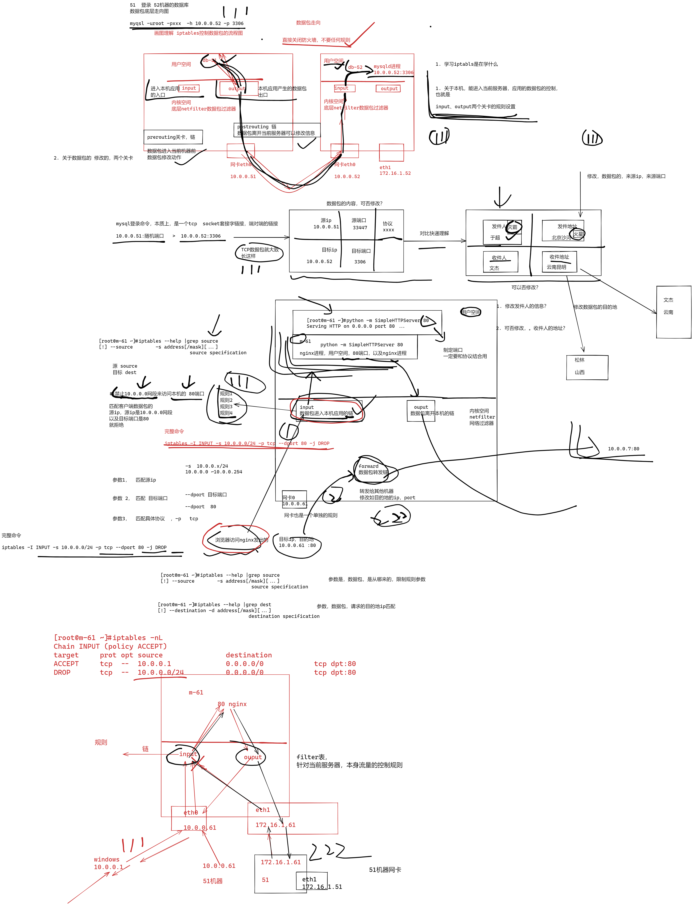


### 什么是netfilter

网络过滤器


# 第3章 iptables四表五链

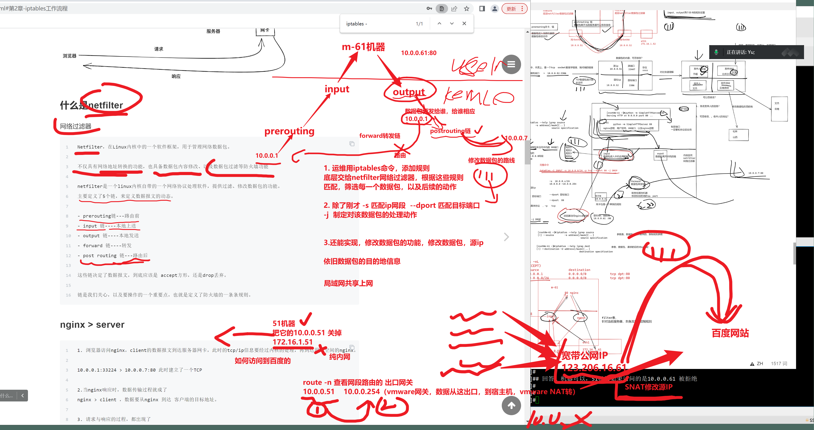


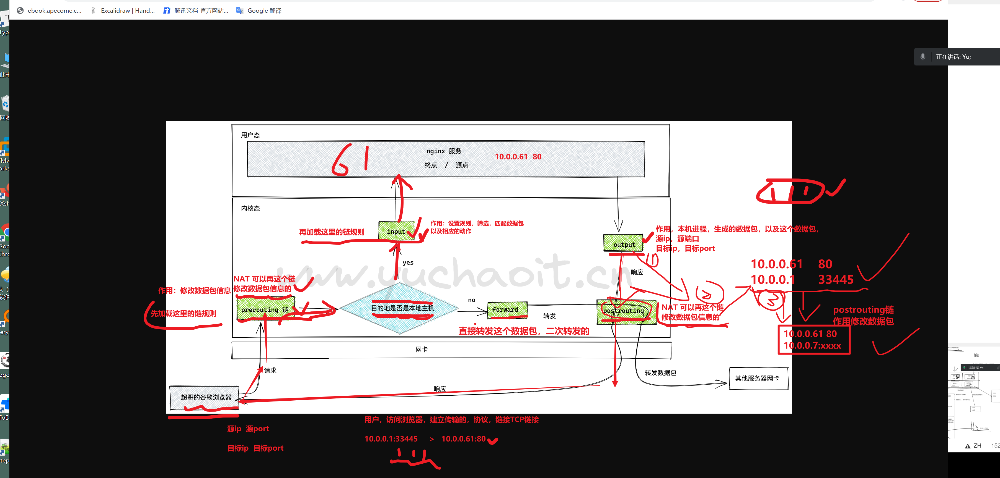


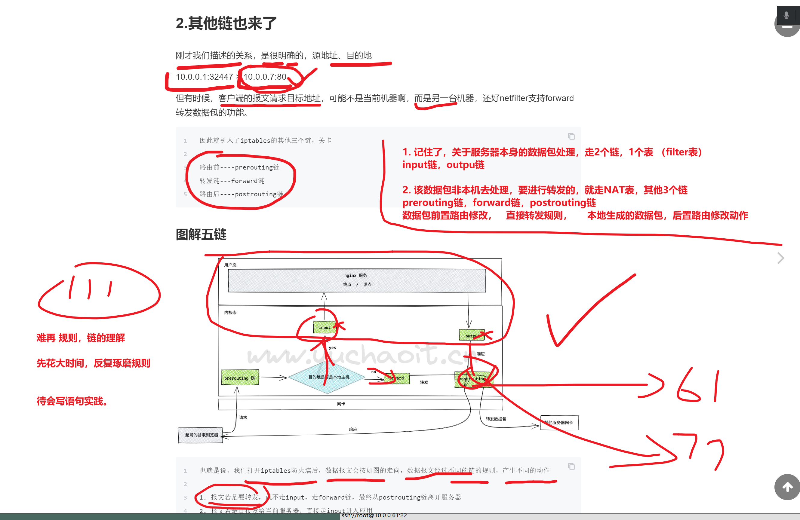


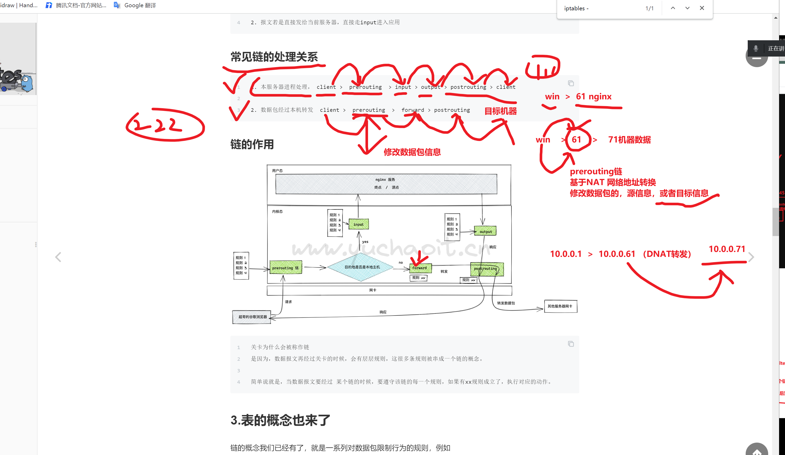


# 如何理解 filter表，NAT表，5个链

4表5链

```
filter表，数据包过滤
nat表，网络地址转发

=======================================


mangle表，拆解报文，修改报文
raw表，取消链路跟踪


```


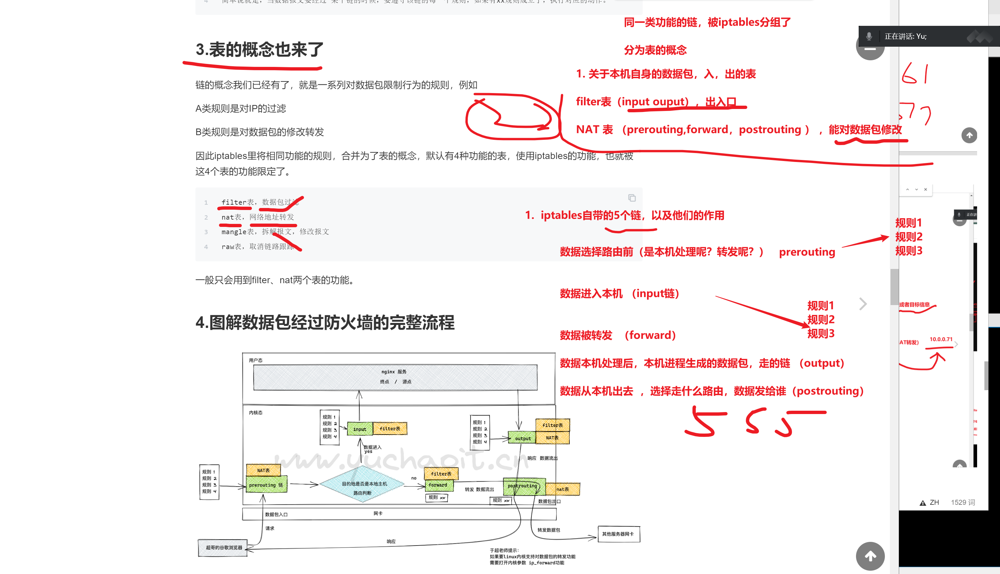


## 记住，如何理解filter表，和nat表的作用

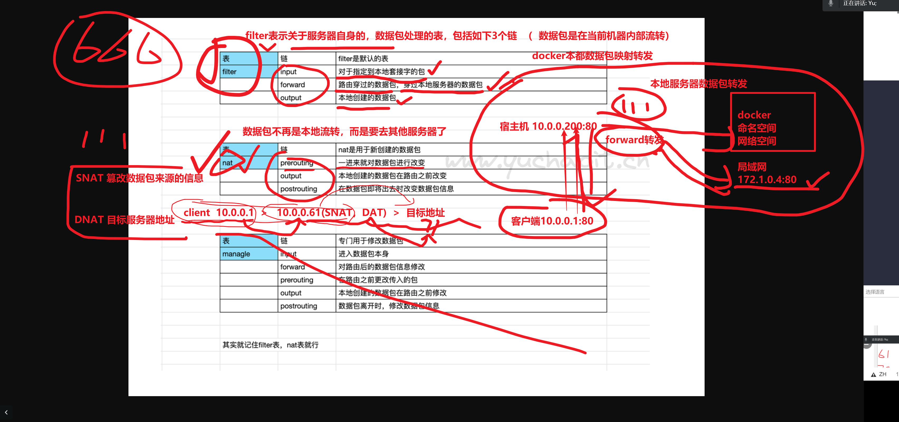


## 再次看图，理解，filter表，和nat表的关系

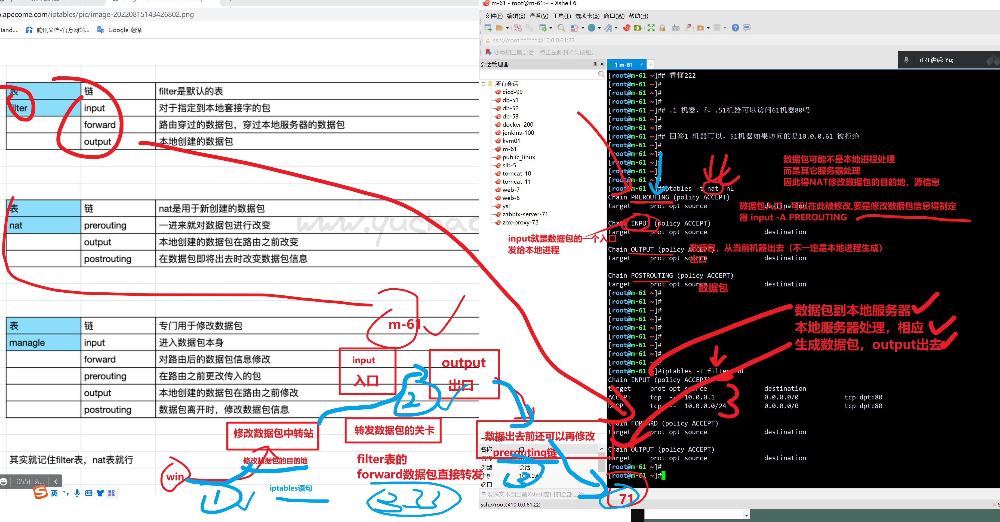


## 关于NAT表，修改数据包的场景原理

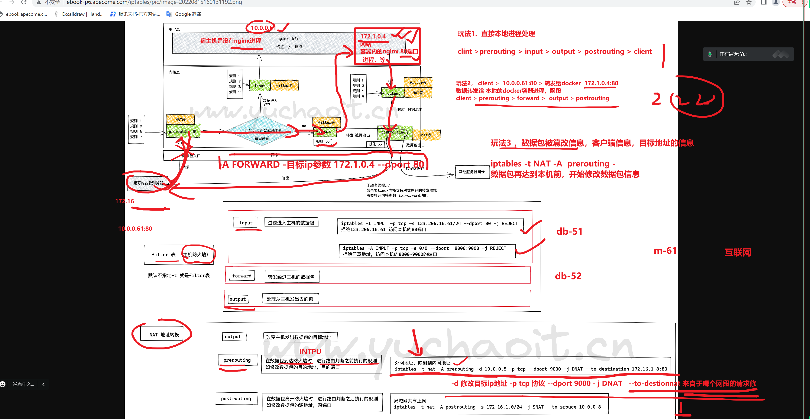


# 总结iptables的学习路线图

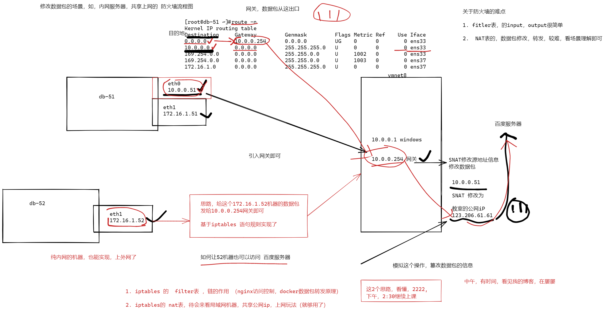


## 0.iptables基础

```

```

## 1.请求响应与防火墙

一个简单的说法，你部署了一个nginx服务器，如何确认用户可以访问到nginx，以及nginx如何可以给用户返回数据？我们以前都是直接关闭了防火墙功能。

开启防火墙后会是如何？


```
[root@yuanlai-school ~]# iptables -L
Chain INPUT (policy ACCEPT)
target     prot opt source               destination

Chain FORWARD (policy ACCEPT)
target     prot opt source               destination

Chain OUTPUT (policy ACCEPT)
target     prot opt source               destination
```

会发现这里有3个chain，表示三个链，链是干啥的？

图解


### 什么是netfilter

网络过滤器

```

```


### Client > server

```
input
output

```

## 2.其他链也来了

刚才我们描述的关系，是很明确的，源地址、目的地

10.0.0.1:32447 > 10.0.0.7:80

```
可以用netstat查看tcp连接
```

但有时候，客户端的报文请求目标地址，可能不是当前机器啊，而是另一台机器，还好netfilter支持forward转发数据包的功能。

```
因此就引入了iptables的其他三个链，关卡

路由前----prerouting链
转发链---forward链
路由后----postrouting链
```


### 图解五链的关系

```

```


### 常见链的处理关系，流程走向

```

```


### 链的作用图解

```

```


## 3.表的概念也来了

```

```


## 4.图解数据包经过防火墙的完整流程


## 5.解释表与链的作用


### filter表

- iptables默认操作的表，不指定就是在改这个
- 作用是控制关于本机的流量
- 涉及的链是xxx

```

```


### NAT表

- 流量转发就靠它了
- 涉及的链是xxx

```

```


## 6.一张图，搞清楚iptables的作用


## 7.简单理解防火墙规则（链的作用）⭐️

```
5条链的作用
```


## 8.匹配规则后的动作，⭐️

```

```

### 【drop和reject区别】

```

```


## 9.linux路由表查看

```
先记住 route -n 可以查看网络关卡即可

```


### 开启内核数据包转发

```

```


