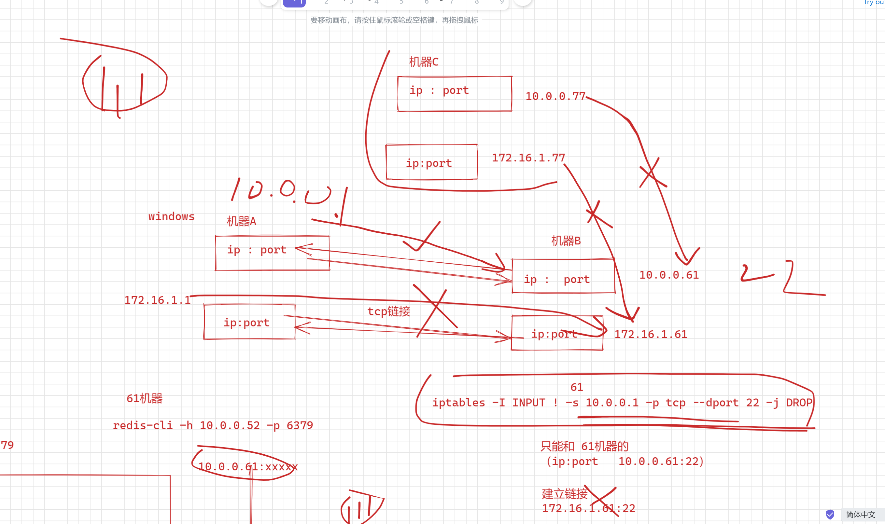
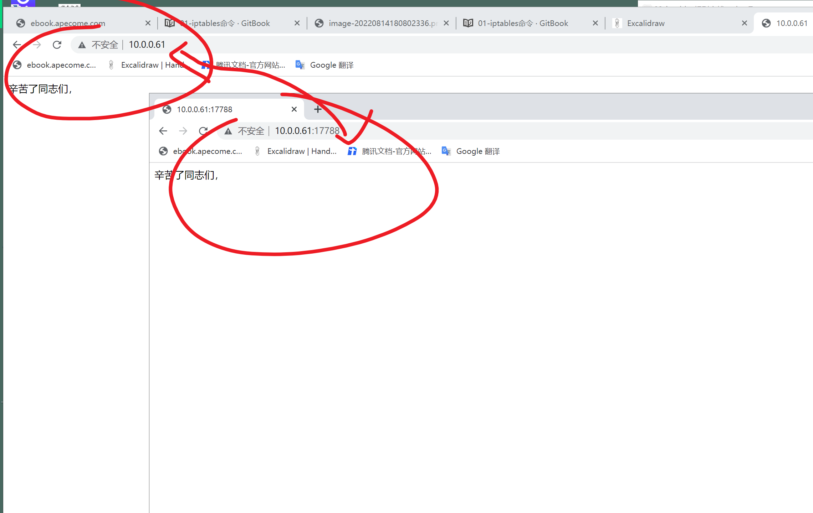

```### 此资源由 58学课资源站 收集整理 ###
	想要获取完整课件资料 请访问：58xueke.com
	百万资源 畅享学习

```


# 01-iptables命令

玩iptables

1. 看着4表，5链的逻辑流程图，思考流量走向
2. 查看iptables规则语法


## 查看，删除规则的  命令

```
iptables -nL  # 查看所有链的规则详细，只显示 ip:port 数字形式

-F 删除所有规则
-X 删除用户自定义的链
-Z 链计数器为零


# 彻底删除，关闭防火墙规则

systemctl stop firewalld  # centos7开启这个服务，会默认生成一堆iptables规则
iptables -F
iptables -X
iptables -Z

#再次查看

iptables -nL


```


## 默认策略


```
# 默认的每一个链，也有默认策略
[root@m-61 ~]#iptables -nL
Chain INPUT (policy ACCEPT)
target     prot opt source               destination         

Chain FORWARD (policy ACCEPT)
target     prot opt source               destination         

Chain OUTPUT (policy ACCEPT)
target     prot opt source               destination     


测试，危险策略，input，默认改为DROP
# 临时添加
[root@m-61 ~]#iptables -t filter   -P INPUT DROP
[root@m-61 ~]#
Socket error Event: 32 Error: 10053.
Connection closing...Socket close.

Connection closed by foreign host.

Disconnected from remote host(m-61) at 14:30:03.

Type `help' to learn how to use Xshell prompt.
[C:\~]$ 


出现这种问题，怎办

- 通过其他非ssh协议的登录机器的方式，删除iptables规则，VNC协议去远程登录（阿里云机器）
- 重启服务器
- 为了安全起见，运维写一个定时任务，删除iptables规则

- 服务器不会有规则，私有云公有云，都是有专门的硬件防火墙，网络设备去直接决绝流量，添加防火墙规则，iptables只是一个软件层面的，控制流程的，如docker会去用

- 打电话给idc机房的运维人员，删除规则


```


```
iptables -F 删除删不掉
默认策略

修改默认策略
iptables -P INPUT ACCEPT
```


```
此时可以链接了
WARNING! The remote SSH server rejected X11 forwarding request.
Last login: Tue Aug 23 22:33:26 2022
[root@m-61 ~]#
[root@m-61 ~]#
[root@m-61 ~]#
[root@m-61 ~]#
[root@m-61 ~]#


```


## 1.安装iptables

```
[root@m-61 ~]#rpm -qi iptables 

可以查看到，该软件，是内核级别的netfilter软件提供的命令行工具
URL         : http://www.netfilter.org/
Summary     : Tools for managing Linux kernel packet filtering capabilities


# 安装iptables插件，可以保存iptables规则到配置文件，永久生效

yum install iptables-services -y

# iptables
iptables-save 

# 设置一个iptables服务，开机自启
# 每次重启，规则都能重新生效


# 如下参数，让当前linxu内核，开启防火墙功能，数据包转发功能，数据包过滤功能

modprobe ip_tables
modprobe iptable_filter
modprobe iptable_nat
modprobe ip_conntrack
modprobe ip_conntrack_ftp
modprobe ip_nat_ftp
modprobe ipt_state

# lsmod这种命令，查看内核级别开启的功能等
#kvm kernle virtual  machine


# 开机自弃，确保每次开启，加载保存的规则
systemctl stop firewalld
systemctl disable firewalld

systemctl start iptables.service
systemctl enable iptables.service


```


2.45 继续


## 2.加载防火墙内核模块

```
让内核开启某个功能支持
```


## 3.启动防火墙


## 4.iptables核心命令

### 1.查看规则

```
# -n --numeric -n 地址和端口的数字输出
# -L  列出所有链的规则
#--line-num


```


.


### 2.清空规则

```
iptables -F <- 清除所有规则，不会处理默认的规则
iptables -X <- 删除用户自定义的链
iptables -Z <- 链的计数器清零（数据包计数器与数据包字节计数器）
```


### 3.添加防火墙规则

````
iptables -t     <-    指定表d(efault: `filter')
iptables -A     <-    把规则添加到指定的链上，默认添加到最后一行。
iptables -I     <-    插入规则，默认插入到第一行(封IP)。
iptables -D     <-    删除链上的规则


````


### 4.查看网络连接状态

```
NEW：已经或将启动新的连接
ESTABLISHED：已建立的连接
RELATED：正在启动的新连接
INVALID：非法或无法识别的

iptables -nL 可以看到状态
```

## 5.如何删除某个规则

禁ping操作


```

1. 加一个测试规则
禁止51机器来ping我，（10.0.0.51   172.16.1.51 ）


# 加入DROP 丢弃(对方直接无响应)

# REJECT 拒绝（对方给了回应，1.给与了恢复 2.告诉他我不给你东西）
64 bytes from 172.16.1.61: icmp_seq=24 ttl=64 time=0.462 ms
64 bytes from 172.16.1.61: icmp_seq=25 ttl=64 time=0.182 ms
64 bytes from 172.16.1.61: icmp_seq=26 ttl=64 time=0.508 ms
64 bytes from 172.16.1.61: icmp_seq=27 ttl=64 time=0.358 ms

你依然能看到这些回应信息，但是没有了数据64bytes数据

# 添加reject 拒绝规则，172网段的ping数据包


[root@m-61 ~]#iptables -A INPUT  -p icmp -s 10.0.0.51 -j DROP
[root@m-61 ~]#
[root@m-61 ~]#iptables -nL --line-num
Chain INPUT (policy ACCEPT)
num  target     prot opt source               destination         
1    DROP       icmp --  10.0.0.51            0.0.0.0/0           

Chain FORWARD (policy ACCEPT)
num  target     prot opt source               destination         

Chain OUTPUT (policy ACCEPT)
num  target     prot opt source               destination      


# -A 向后写入新规则
#加大难度，禁止172网段来ping我 ，禁止 -p imcp协议即可

[root@m-61 ~]#
[root@m-61 ~]#iptables -t filter -A INPUT -s 172.16.1.0/24 -p icmp -j REJECT
[root@m-61 ~]#

# 禁止所有机器来ping我 ,直接丢弃
-s 0.0.0.0/0

#删除多此一举，重复逻辑的规则

#注意细节，规则删除后，重新排序，标号


[root@m-61 ~]#iptables -D INPUT 1
[root@m-61 ~]#
[root@m-61 ~]#
[root@m-61 ~]#iptables -nL --line-num
Chain INPUT (policy ACCEPT)
num  target     prot opt source               destination         
1    DROP       icmp --  0.0.0.0/0            0.0.0.0/0           

Chain FORWARD (policy ACCEPT)
num  target     prot opt source               destination         

Chain OUTPUT (policy ACCEPT)
num  target     prot opt source               destination         
[root@m-61 ~]#
[root@m-61 ~]#


#总结
1. 规则先后加载逻辑
2. 多条规则，是否有重复，需要被优化
3. 规则删除，要注意重新标号了
4. 玩了玩ping的 丢弃，拒绝操作
5. 看懂 DROP 和 REJECT 区别

看懂3333


```


# 2.规则实战玩法

这里的规则添加，很容易就蒙圈了，执行前，想一想。。


直接制定协议，没有端口

加上端口，以及协议


## 1.禁止22端口访问

危险操作，别瞎执行..

-s 来源ip

-p 协议 tcp 

--dport  22


```
参数解释
-p               #<==指定过滤的协议-p（tcp,udp,icmp,all）
--dport          #<==指定目标端口（用户请求的端口）。
-j               #<==对规则的具体处理方法（ACCEPT,DROP,REJECT,SNAT/DNAT)
--sport             #<==指定源端口。


# 单独拒绝某个机器的 22链接，DROP 
# 决绝51的ssh链接，2个口都得封
# 172

# 10
[root@m-61 ~]#iptables -t filter -I INPUT -s 172.16.1.51 -p tcp --dport 22 -j DROP
[root@m-61 ~]#iptables -nL --line-num
Chain INPUT (policy ACCEPT)
num  target     prot opt source               destination         
1    DROP       tcp  --  172.16.1.51          0.0.0.0/0            tcp dpt:22
2    DROP       tcp  --  10.0.0.51            0.0.0.0/0            tcp dpt:22
3    DROP       icmp --  0.0.0.0/0            0.0.0.0/0           

Chain FORWARD (policy ACCEPT)
num  target     prot opt source               destination         

Chain OUTPUT (policy ACCEPT)
num  target     prot opt source               destination         
[root@m-61 ~]#


# 拒绝某个网段的22链接
(删除多此一举的规则)

最前面追加 基于网段的规则，然后删除后续重复的规则即可
[root@m-61 ~]#
[root@m-61 ~]#iptables -t filter -I INPUT -s 172.16.1.0/24 -p tcp --dport 22 -j DROP
[root@m-61 ~]#

[root@m-61 ~]#iptables -t filter -I INPUT -s 10.0.0.0/24 -p tcp --dport 22 -j DROP

# 友情提醒，你的所有22链接tcp，全部被干掉了


=============================================================


# 拒绝所有的22链接（sshd运行再 2222端口）

[root@m-61 ~]#iptables -t filter -I INPUT -s 0.0.0.0/24 -p tcp --dport 22 -j DROP
这种写法，一定是你有其他的sshd入口，或者单独放行某个  机器的ssh链接

# 单独放行windows链接

# 能继续ssh的办法
- 修改sshd端口
- 单独开启某个机器的，22链接的规则，-I 插入即可
# 允许windows可以登录


# N个傻叉黑客，疯狂干你的22端口，总是有无用的流量，DROP


```


## 修改SSHD入口


.


## 查看TCP的ssh链接socket信息


## 单独允许某个ip的流量通过（限制规则，还是最大化规则）


## 允许10.0.0.1所有类型数据包


## 注意，规则的先后添加，注意 逻辑是否会影响到其他规则

来决定是 -A 还是 -I  或是删除其他规则 -D


## 2.禁止某个ip访问具体网卡


```
#禁止51机器，访问 61机器的 ens37网卡
（61机器的 运行的服务，绑定再 ens37网卡上的，51都访问不了）


 # 如精确的 禁止  nginx的访问
 [root@m-61 ~]#iptables -I INPUT -i ens37 -s 172.16.1.51   -p tcp --dport 80 -j DROP
[root@m-61 ~]#
[root@m-61 ~]#
[root@m-61 ~]#iptables -nL --line-num
Chain INPUT (policy ACCEPT)
num  target     prot opt source               destination         
1    DROP       tcp  --  172.16.1.51          0.0.0.0/0            tcp dpt:80

Chain FORWARD (policy ACCEPT)
num  target     prot opt source               destination         

Chain OUTPUT (policy ACCEPT)
num  target     prot opt source               destination         
[root@m-61 ~]## -i -o  网卡设备，用于，你的这个机器，充当为 路由器，对数据包转发的时候，会用到
[root@m-61 ~]#


# 
 


```


## 3.使用取反符号

```

# 只允许 内网172网段，去访问我的nginx
# 除了172网段，访问我80端口的请求全拒绝

iptables -I INPUT   -s  172.16.1.0/24   -p tcp --dport 80 -j DROP 


iptables -I INPUT  ! -s  172.16.1.0/24   -p tcp --dport 80 -j DROP 


# 10.0.0.0 拒绝
iptables -I INPUT -s 10.0.0.0/24 -p tcp --dport 80 -j DROP


#看懂111


```


### 查看机器最新规则

```
iptables -L
```


## 4.只允许10.0.0.0网段的数据包进入

```
1. -s 10.0.0.0/24
2. INPUT


# 方案1，默认策略是 ACCEPT

# 除了10.0.0.0网段的流量，全部丢弃

iptables -I INPUT ! -s 10.0.0.0/24 -j  DROP


# 方案2
修改默认策略，只accept 接受xx网段的流量即可

iptables -I INPUT -s 10.0.0.0/24  -j ACCEPT

# 结果如下，ssh是不会断开的

#默认所有网卡的流量，INPUT，全部决绝了
# 额外放行了 10.0.0.0网段的流量，因此还是可以登录

[root@m-61 ~]#iptables -nL --line-num
Chain INPUT (policy DROP)
num  target     prot opt source               destination         
1    ACCEPT     all  --  10.0.0.0/24          0.0.0.0/0           

Chain FORWARD (policy ACCEPT)
num  target     prot opt source               destination         

Chain OUTPUT (policy ACCEPT)
num  target     prot opt source               destination         
[root@m-61 ~]#


# 都看懂，听懂2222


```


## 5.实现跳板机登录唯一入口


要作为第一个规则，就是`-I`，-A是往后面追加写入规则

```
也就是，编写规则
所有机器，只允许61机器的22号端口流量进入，博客上的有误了，禁止了所有流量


```


## 6.匹配端口范围

> 只允许172.16.1.0/24网段访问本机的22 ，6379，80端口
>
> 利用-m multiport 指定多端口的模块
>
> 指定多个--dport
>
> 添加阿里云安全组的时候，就清晰了
>
> 阿里云里面，提供，在线端口添加
>
> 
>
> 阿里云安全组，添加ip,port规则添加
>
> 2种语法
>
> 80,22,6379,3306
>
> 7777:14000  规则适用于这个端口范围
>
> 看懂111
>
> 
>
> 


> 运维平台添加防火墙规则。，逻辑如下
>
> 
>
> 前端构造数据
>
> 后端解析数据，执行对应的linux命令
>
> iptables命令执行

```
匹配多个单个端口
[root@m-61 ~]#
[root@m-61 ~]#iptables -I INPUT  -m multiport   -s 10.0.0.52 -p tcp --dport 80,22   -j DROP
[root@m-61 ~]#
[root@m-61 ~]#
[root@m-61 ~]#iptables -nL
Chain INPUT (policy ACCEPT)
target     prot opt source               destination         
DROP       tcp  --  10.0.0.52            0.0.0.0/0            multiport dports 80,22

Chain FORWARD (policy ACCEPT)
target     prot opt source               destination         

Chain OUTPUT (policy ACCEPT)
target     prot opt source               destination         


```


## 7.禁止服务器被ping，服务器拒绝icmp的流量，给与响应

测试REJECT动作

```

```


## 8.服务器禁ping，请求直接丢弃

测试DROP动作

```

```


## 9.练习题




```
1. 封禁10.0.0.51 访问61本机（任意协议，任意端口）
10.0.0.51:任意端口  > 10.0.0.61:port


iptables -I INPUT -s 10.0.0.51 -j DROP


2.限制只有10.0.0.1可以ssh登录堡垒机

- 所有机器，禁止ssh登录 堡垒机
- 只有10.0.0.1可以

iptables -I INPUT ! -s 10.0.0.1 -p tcp --dport 22 -j DROP 


3. 封禁任何人访问本机6379

自己能访问 0.0.0.0/0


部署这个6379只能走内网访问

方案
redis.conf 

bind 127.0.0.1


方案，现有防火墙iptables

思路1
[root@m-61 ~]#iptables -I INPUT ! -s 127.0.0.1 -p tcp --dport 6379 -j DROP 


思路2
iptables -I INPUT  -s 10.0.0.0/24   -p tcp --dport 6379 -j DROP 
iptables -I INPUT -s  172.16.1.0/24   -p tcp --dport 6379 -j DROP 


[root@m-61 ~]#
[root@m-61 ~]## 单独让51机器走内网 访问6379
[root@m-61 ~]#
[root@m-61 ~]#iptables -I INPUT -s 172.16.1.51 -p tcp --dport 6379 -j ACCEPT
[root@m-61 ~]#
[root@m-61 ~]#


4.只允许走172内网，访问51机器的6379
[root@m-61 ~]#
[root@m-61 ~]## 单独让51机器走内网 访问6379
[root@m-61 ~]#
[root@m-61 ~]#iptables -I INPUT -s 172.16.1.51 -p tcp --dport 6379 -j ACCEPT
[root@m-61 ~]#
[root@m-61 ~]#


# 4道题，会玩4444


```


## 10.封禁恶意访问网站80口的IP

```
[root@m-61 ~]#iptables -I INPUT -s 10.0.0.51 -p tcp --drpot 80 -j DROP


```


# 3.实战玩法（常见完整的iptables）

iptables基本都是用于内网的流量控制了，不会用于对外的流量限制；

对公网的流量控制，一般都是硬件防火墙的事了。

以及在容器环境下的流量转发，也是生成iptables规则，因此这是学习本章的目的。


```
# 清空现有规则
iptables -F
iptables -X
iptables -Z

# 允许 所有机器，访问本机的 80 443端口 
iptables -A INPUT -p tcp -m multiport --dport 80,443 -j ACCEPT

# 允许所有机器，来访问本机的22端口
iptables -A INPUT -p tcp --dport 22 -j ACCEPT

# 单独允许10.0.0.0 网段的数据包进入本机
iptables -A INPUT -s 10.0.0.0/24 -j ACCEPT

# 单独允许172.16.1.0 网段的数据包进入本机
iptables -A INPUT -s 172.16.1.0/24 -j ACCEPT


# 允许本地回环地址的请求通过  loolback 127.0.0.1
# 这个3个操作，分别是针对 ens33 ens37 lo 的规则放行，看懂1111
# 用的是 -i  lo 本地网卡接口
iptables -A INPUT -i lo -j ACCEPT
# 看懂区别给 777
#加上 -v  开启 verbose mode 调试模式，可以看到具体规则详细信息
# 别加这个规则，测试用
# iptables -A INPUT -s 0.0.0.0/0  -j ACCEPT


# 默认INPUT 所有进入本机的流量，默认策略拒绝
iptables -P INPUT DROP


# 默认关闭forward转发数据包的功能
iptables -P FORWARD DROP

#  允许本机产生的数据包出去
iptables -P OUTPUT ACCEPT 


iptables -nL
```

最终生成的规则，反序

```
[root@m-61 ~]#iptables -nL --line-num
Chain INPUT (policy DROP)
num  target     prot opt source               destination         
1    ACCEPT     tcp  --  0.0.0.0/0            0.0.0.0/0            multiport dports 80,443
2    ACCEPT     tcp  --  0.0.0.0/0            0.0.0.0/0            tcp dpt:22
3    ACCEPT     all  --  10.0.0.0/24          0.0.0.0/0           
4    ACCEPT     all  --  172.16.1.0/24        0.0.0.0/0           
5    ACCEPT     all  --  0.0.0.0/0            0.0.0.0/0           

Chain FORWARD (policy DROP)
num  target     prot opt source               destination         

Chain OUTPUT (policy ACCEPT)
num  target     prot opt source               destination         
[root@m-61 ~]#


```


常见的，web服务器的防火墙规则添加，让它允许 80 443提供访问

这个整个的防火墙规则，示例，适用于内网环境的 web服务器提供。

导致该机器，无法上外网，关闭


## 想让外网机器的流量，到达本地，得允许数据包里面的ip信息

因为默认百度的ip，被我们的input规则， DROP掉了。


18.30 继续


## 3.2 局域网共享上网


## 什么是SNAT（source 源信息 NAT转换）


你现在有一堆机器，纯内网环境，没有对外的网卡


```
实现效果，m-61作为上网网关出口，实现数据包转发
其他机器只有172局域网地址，网关指向m-61
```

根据流程图完成即可


## 局域网主机，配置m-61作为路由的架构图思路


## db-51机器现状

只有内网ip

```
[root@db-51 ~]#ifconfig 
ens37: flags=4163<UP,BROADCAST,RUNNING,MULTICAST>  mtu 1500
        inet 172.16.1.51  netmask 255.255.255.0  broadcast 172.16.1.255
        inet6 fe80::20c:29ff:feb7:6f44  prefixlen 64  scopeid 0x20<link>
        ether 00:0c:29:b7:6f:44  txqueuelen 1000  (Ethernet)
        RX packets 975  bytes 110756 (108.1 KiB)
        RX errors 0  dropped 0  overruns 0  frame 0
        TX packets 1062  bytes 111145 (108.5 KiB)
        TX errors 0  dropped 0 overruns 0  carrier 0  collisions 0

lo: flags=73<UP,LOOPBACK,RUNNING>  mtu 65536
        inet 127.0.0.1  netmask 255.0.0.0
        inet6 ::1  prefixlen 128  scopeid 0x10<host>
        loop  txqueuelen 1000  (Local Loopback)
        RX packets 0  bytes 0 (0.0 B)
        RX errors 0  dropped 0  overruns 0  frame 0
        TX packets 0  bytes 0 (0.0 B)
        TX errors 0  dropped 0 overruns 0  carrier 0  collisions 0

[root@db-51 ~]#
[root@db-51 ~]#
[root@db-51 ~]#route -n
Kernel IP routing table
Destination     Gateway         Genmask         Flags Metric Ref    Use Iface
169.254.0.0     0.0.0.0         255.255.0.0     U     1003   0        0 ens37
172.16.1.0      0.0.0.0         255.255.255.0   U     0      0        0 ens37
[root@db-51 ~]#

```


## 配置m-61机器，添加iptables规则

实现对db-51机器的数据包，进行修改

```
# 给61机器，加上SNAT的功能，路由器的功能
# 将局域网的ip信息，都换成

#  172.16.1.51  >  10.0.0.61  

# 这个语句，就是实现了路由器的SNAT功能的模拟
# 
[root@m-61 ~]#iptables -t nat -A POSTROUTING -s 172.16.1.0/24 -j SNAT --to-source 10.0.0.61


[root@m-61 ~]#echo 'net.ipv4.ip_forward = 1' >> /etc/sysctl.conf


# tplink 也是进行SNAT

windows 是如何通过路由器wifi上网

192.168.0.17  >  路由器里面网关 192.168.0.1  > (SNAT 源地址转换的功能)  > 北京昌平联通的公网ip  >   baidu.com

# 听懂1111

```


```
该玩法，是数据，再2个机器的流转
核心重点是，使用了  nat表中，能对数据包修改的一个链，出口链
postrouting链，因未数据包要从机器出去，修改自己的源ip


```


## 3.3 本地端口映射

```
[root@m-61 ~]## 本地提供一个端口 叫 17788
[root@m-61 ~]#
[root@m-61 ~]## 17788 》 80
[root@m-61 ~]#
[root@m-61 ~]## 听懂111
[root@m-61 ~]#
[root@m-61 ~]## 数据包再本地，数据包信息修改，转发
[root@m-61 ~]#


# 访问61机器指定的一个端口，却能访问到nginx的 80端口

# 添加ipbtales规则
iptables -t nat -A PREROUTING -d 10.0.0.61 -p tcp --dport 20022 -j DNAT --to-destination 172.16.1.61:22


```


```
iptables -t nat -A PREROUTING -d 10.0.0.61 -p tcp --dport 17788 -j DNAT --to-destination 172.16.1.61:80
```





# 4.保存规则记录

```
iptables-save > /opt/www.yuchaoit.cn_iptables.txt

iptables-resotre <  /opt/www.yuchaoit.cn_iptables.txt  # 恢复规则
```


## 踩坑指南

```

```


## 练习题

```
1.从上往下依次匹配
2.一但匹配上,就不在往下匹配了
3.默认规则,默认的情况,默认规则是放行所有


禁止源地址是10.0.0.7的主机访问22端口
iptables -A INPUT -p tcp -s 10.0.0.7 --dport 22 -j DROP

禁止源地址是10.0.0.7的主机访问任何端口
iptables -A INPUT -p tcp -s 10.0.0.7 -j DROP

禁止源地址是10.0.0.8的主机访问80端口
iptables -A INPUT -p tcp -s 10.0.0.8 --dport 80 -j DROP

禁止除了10.0.0.7以外的地址访问80端口
iptables -A INPUT -p tcp ! -s 10.0.0.7 --dport 80 -j DROP

2条规则冲突,会以谁先谁为准
iptables -I INPUT -p tcp -s 10.0.0.7 --dport 22 -j ACCEPT
iptables -I INPUT -p tcp -s 10.0.0.7 --dport 22 -j DROP

禁止10.0.0.7访问22和80端口
iptables -I INPUT -p tcp -s 10.0.0.7 -m multiport --dport 22,80 -j DROP

禁止10.0.0.7访问22到100之间的所有端口
iptables -A INPUT -p tcp -s 10.0.0.7 --dport 22:100 -j DROP

禁止所有主机ping
iptables -A INPUT -p icmp --icmp-type 8 -j DROP

放行10.0.0.7可以ping
iptables -I INPUT 2 -p icmp --icmp-type 8 -s 10.0.0.7 -j ACCEPT

只允许10.0.0.7可以ping
ACCEPT icmp -- 10.0.0.7 0.0.0.0/0 icmptype 8
DROP icmp -- 0.0.0.0/0 0.0.0.0/0 icmptype 8

等同于上一条,优化版,只要不是10.0.0.7就不允许ping
iptables -I INPUT -p icmp --icmp-type 8 ! -s 10.0.0.7 -j DROP
```


