```### 此资源由 58学课资源站 收集整理 ###
	想要获取完整课件资料 请访问：58xueke.com
	百万资源 畅享学习

```
# 0.虚拟化历史

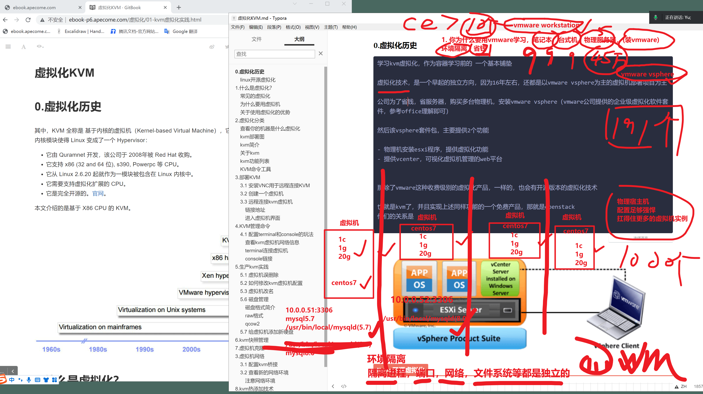

只有一个物理机，安装centos系统

部署多套lnmp集群，部署给多个网站去用

开发说，我的nginx运行端口得是80，我的代码链接的都是80端口-----nginx1.20      mysql  5.7      python2.9 +   xx员工系统

开发说，我的nginx运行端口得是80，我的代码链接的都是80端口----80-----nginx 1.17      mysql8.0       python3.8 +  xx聊天室系统

↓

学会用的，虚拟化技术


```
1. 不好管理
2. 不好装？同一个操作系统下，端口，进程，文件系统路径，都是唯一的，不得冲突
背景，听懂，111

宿主机，dell xx型号， 32核    128GB内存 


3. 思路来了，虚拟机

虚拟机1 ，给业务组1，装lnmp   80 nginx 

虚拟机2 ，给业务组2，装lnmp   80  nginx

4. 公司业务继续加大，又来了50套 lnmp环境

继续加虚拟机xxxxx，虚拟机，给宿主机带来了极大的压力，


5.公司业务扩张，珠海公司，扩张到 东北了，采购物理服务器，继续部署新的虚拟化。


安装路径的区分
/opt/lnmp1/

/opt/lnmp2/


```


同一套path


## 什么是企业级的，vmware vsphere虚拟化，以及使用背景


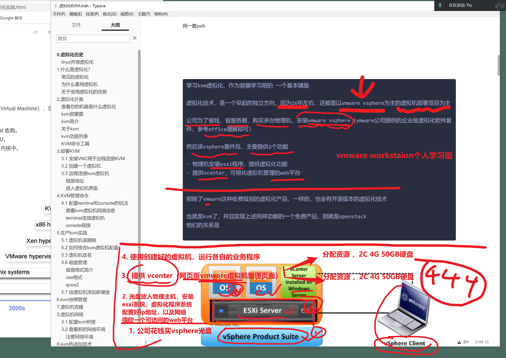


```
学习kvm虚拟化，作为容器学习前的 一个基本铺垫

虚拟化技术，是一个早起的独立方向，因为16年左右，还都是以vmware vsphere为主的虚拟机部署项目为主

公司为了省钱，省服务器，购买多台物理机，安装vmware vsphere（vmware公司提供的企业级虚拟化软件套件，参考office理解即可）

然后该vsphere套件包，主要提供2个功能

- 物理机安装esxi程序，提供虚拟化功能
- 提供vcenter，可视化虚拟机管理的web平台


那除了vmware这种收费级别的虚拟化产品，一样的，也会有开源版本的虚拟化技术

也就是kvm了，并且实现上述同样功能的一个免费产品，那就是openstack
他们的关系是

```

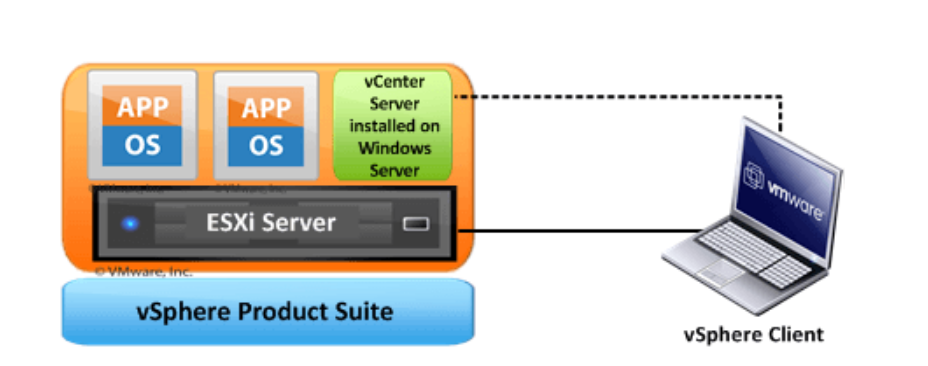

## linux开源虚拟化

```

那除了vmware这种收费级别的虚拟化产品，一样的，也会有开源版本的虚拟化技术

也就是kvm了，并且实现上述同样功能的一个免费产品，那就是openstack
他们的关系是
```


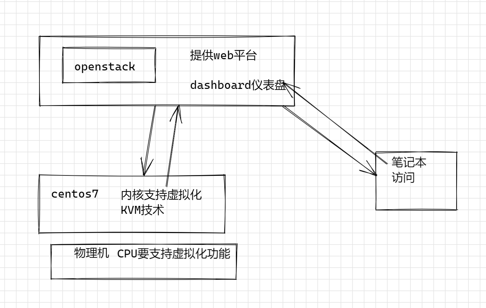


# 1.什么是虚拟化？虚拟化的，前世今生 2015 ~ 2022年


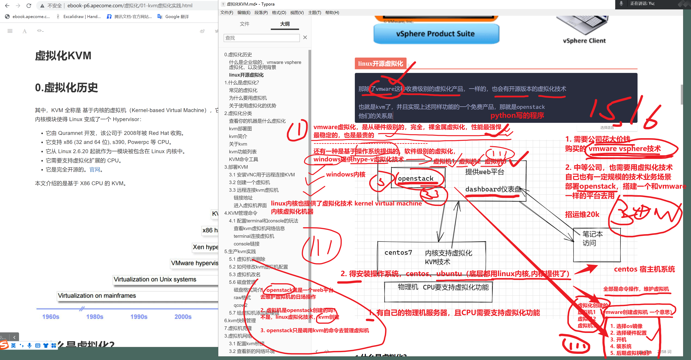


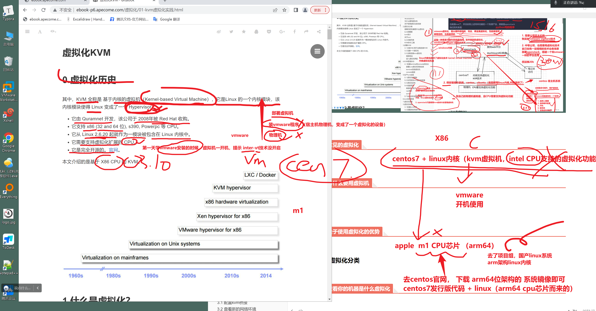

## 你未来，接触非intel芯片的服务器，该如何装系统


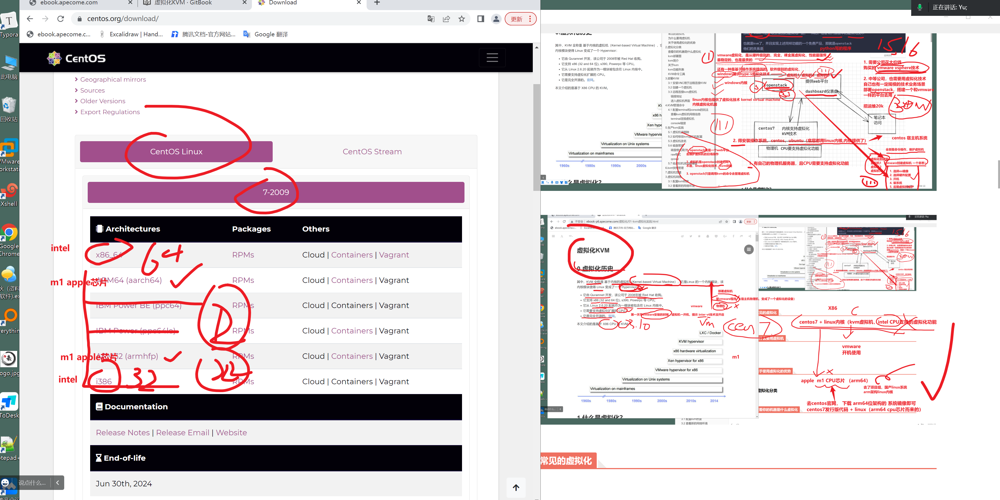


## 常见的虚拟化

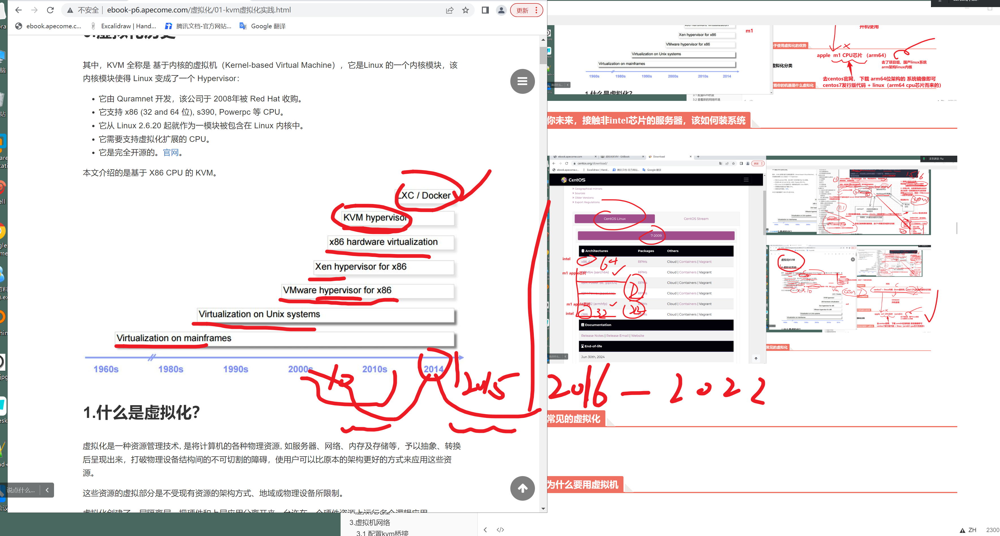


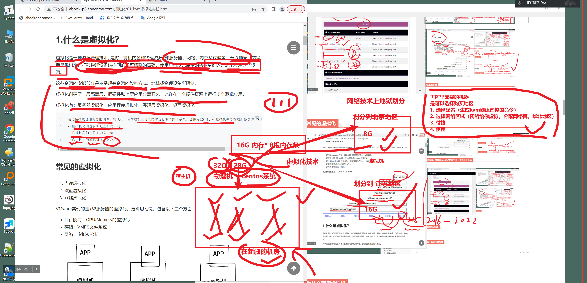


# 图解kvm和ECS的关系，VMware的关系

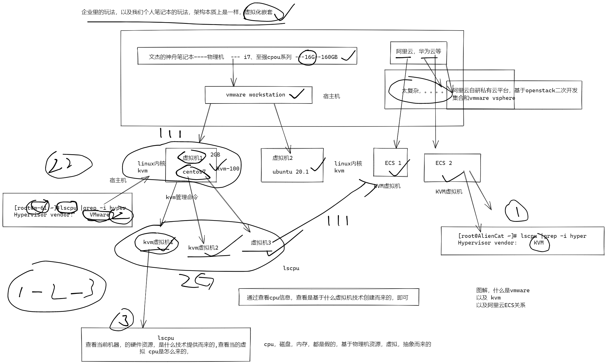


# 什么是完全虚拟化

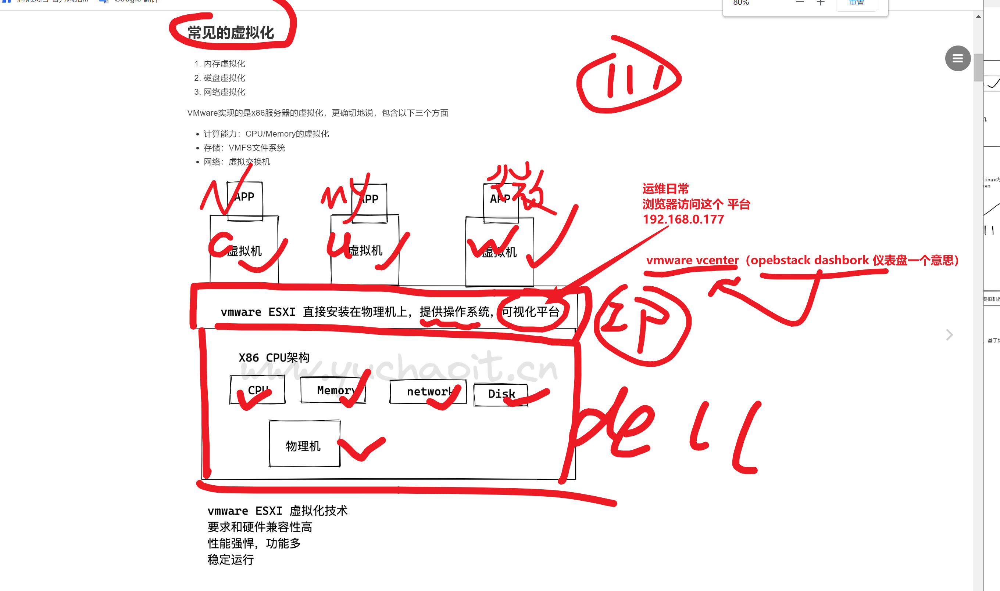


# 因为穷，省钱，用docker虚拟话等


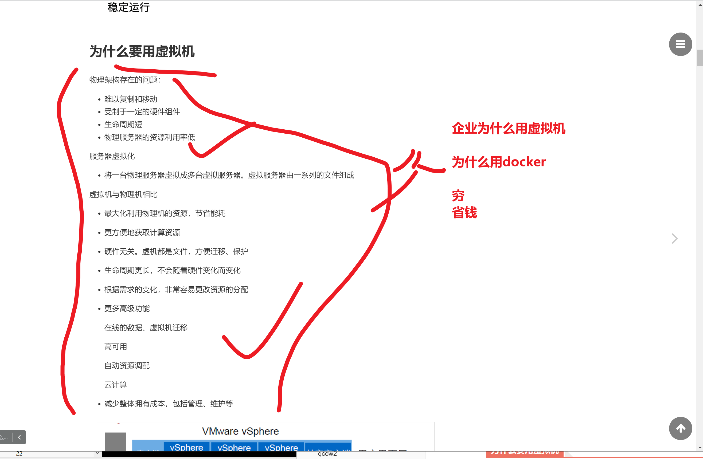


## 虚拟化嵌套架构


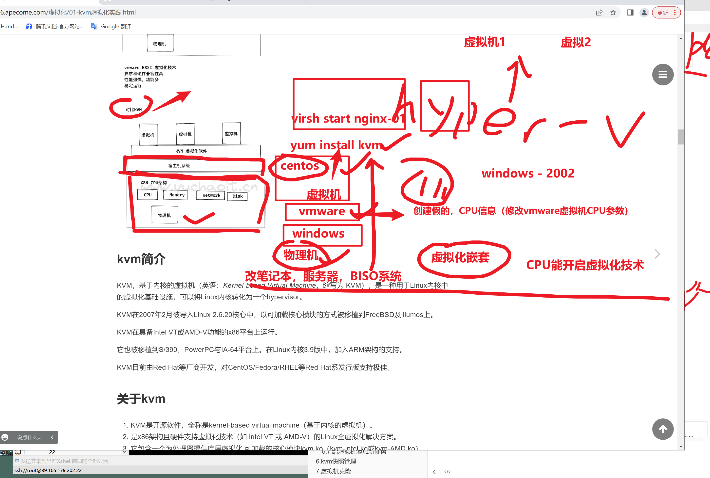


## 为什么要用虚拟机


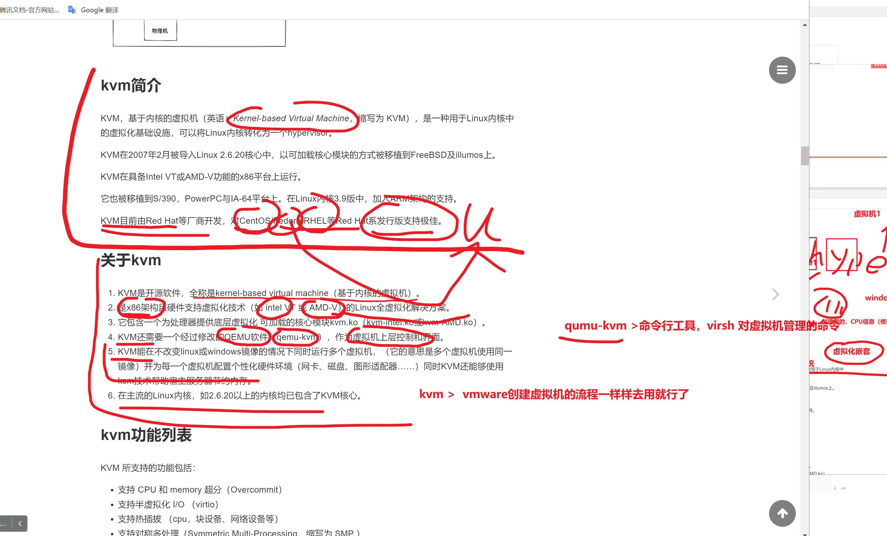


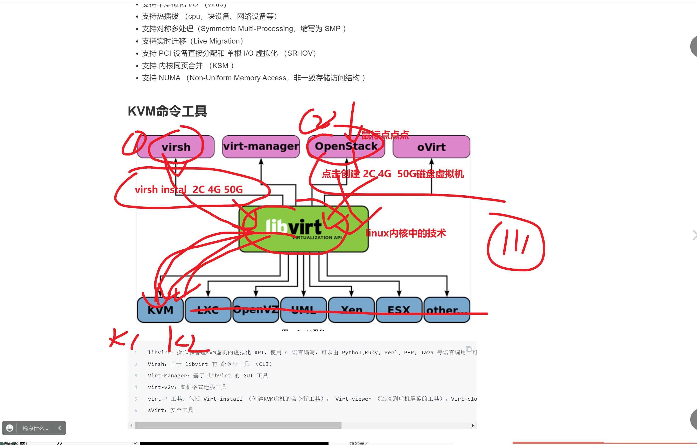


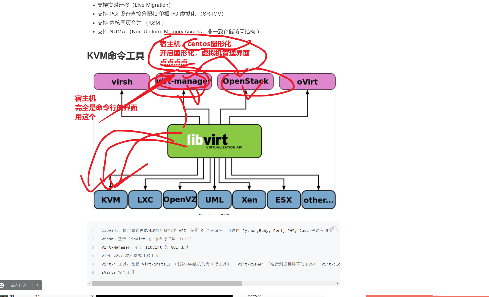


## 关于使用虚拟化的优势


# 2.虚拟化分类


## 查看你的机器是什么虚拟化


## kvm部署图


## kvm简介


## 关于kvm


## kvm功能列表


## KVM命令工具

10.0.0.150


# 3.部署KVM

```
虚拟机嵌套

windows  > vmware > 宿主机（centos7）（16GB） >  


安装kvm


创建kvm虚拟机


# 安装kvm管理工具
# 软件自身+依赖 20
yum install libvirt virt-install qemu-kvm -y

# 不要随便敲
# 220

yum install libvirt* virt-* qemu-kvm* -y # 

安装软件说明内容：

libvirt            # 虚拟机管理
virt               # 虚拟机安装克隆
qemu-kvm   # 管理虚拟机磁盘

# 启动服务
systemctl start libvirtd.service
systemctl status libvirtd.service


```


## 3.1 安装VNC用于远程连接KVM

```
一台机器，远程链接的协议有多重
vnc远程协议，非ssh另一种链接方式


ssh sshd程序运行，提供 10.0.0.150:22 
iptables 导致机器无法链接

账户密码，。被挖矿，导致cpu 99% ，sshd程序正常解析请求
ssh上不去 

https://www.tightvnc.com/download/2.8.63/tightvnc-2.8.63-gpl-setup-64bit.msi


```


## 3.2 创建一个虚拟机

vmware如何装机

- 本地先准备好 os镜像，centos7.iso    ubunt7.iso
- 选择虚拟机配置
- 宿主机的cpu支持得开启虚拟化（虚拟机嵌套，vmware（假的cpu也得支持虚拟化开启））


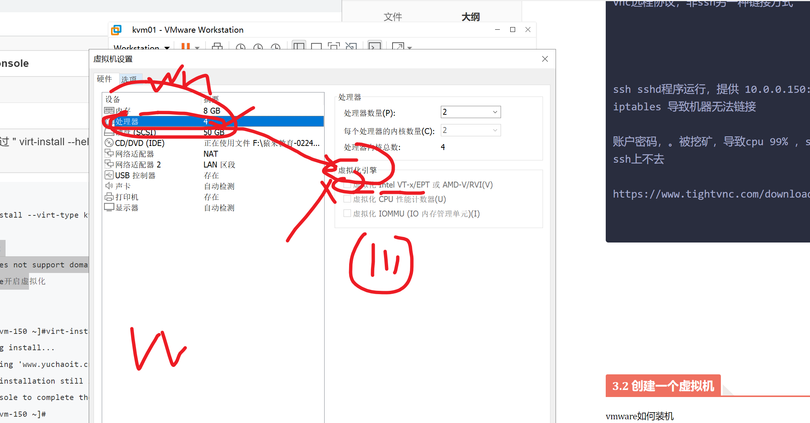


```
装系统方式

1. 基于现有完整的OS镜像，重新装
2. 基于现有一个系统的硬盘，开机即可

#virt-install 安装虚拟机
# 窗机虚拟过程看得懂111
# cpu,内存，系统ISO选择，网络模式(defalut nat ,kvm网络环境，又是一个单独的 192.168.0.xx)
#  network=default

#kmv特性，是在创建时候，虚拟机的硬件上线，就限制死了
#--memory 2048 -vcpus 2
#如果想动态修改kvm虚拟机的配置，还得额外添加参数，设置最大内存，设置最大cpu才可以
# -vcpus 2 给当前虚拟机，设置2核  ，2个工作的cpu线程，top 看到 cpu0 cpu1
# maxvcpus=8 ，当前虚拟机动态设置到最高8核，cpu0 ~ cpu7
# -vcpus 2,maxvcpus=8
# --memory 2048,maxmemory=4096   给这个机器2G内存，可动态设置到最大 4G内存
# --disk /data/linux0224_cento7.raw,format=raw,size=10  
#  虚拟机的磁盘文件，放在/data/  磁盘文件类型，raw类型，最大容量是 10G
# vmware用的虚拟磁盘类型是 vmdk格式，存储工程师关心的，了解即可

# --cdrom  /opt/CentOS-7-x86_64-DVD-1804.iso   制定安装os镜像

# 
# --network network=default 

#  --graphics vnc,listen=0.0.0.0  --noautoconsole 

# 网络模式选择是nat，开启vnc功能 listen 虚拟机运行后，会开启vnc端口，绑定0.0.0.0 从外网去链接 
# 阿里云的服务器，也是这个参数，一样样，也开启vnc功能


# 创建kvm参数，完全看懂777


# 正确，创建kvm第一个虚拟机的命令
[root@kvm-150 /opt]#mkdir -p /data

virt-install --virt-type kvm --os-type=linux --os-variant rhel7 --name linux0224_cento7 --memory 2048,maxmemory=4096 --vcpus 2,maxvcpus=8  --disk /data/linux0224_cento7.raw,format=raw,size=10 --cdrom  /opt/CentOS-7-x86_64-DVD-1804.iso --network network=default --graphics vnc,listen=0.0.0.0  --noautoconsole


# 查看正在运行中的kvm虚拟机列表


[root@kvm-150 /opt]#virsh list
 Id    Name                           State
----------------------------------------------------
 1     linux0224_cento7               running

[root@kvm-150 /opt]#
[root@kvm-150 /opt]#

# 查看所有的虚拟机列表，包含挂掉的

[root@kvm-150 /opt]#virsh list --all
 Id    Name                           State
----------------------------------------------------
 1     linux0224_cento7               running


# 查看虚拟机的端口，ip情况，可以用ssh去链接
[root@kvm-150 /opt]#virsh domifaddr linux0224_cento7
 Name       MAC address          Protocol     Address
-------------------------------------------------------------------------------

[root@kvm-150 /opt]#


# 查看kvm虚拟机的 vnc端口
[root@kvm-150 /opt]#virsh vncdisplay linux0224_cento7
:0
# :1
# vnc默认协议端口  # :0 即 为 5900 端口，以此类推 :1为5901 。  


# 查看宿主机上，kvm产生的端口
[root@kvm-150 /opt]#netstat -tunlp |grep kvm
tcp        0      0 0.0.0.0:5900            0.0.0.0:*               LISTEN      1854/qemu-kvm     


# 可以去链接你的第一个kvm虚拟机

# 10.0.0.150:5900

# 到这完全看懂111


# kvm虚拟机创建好之后2个链接方式
# 宿主机，ssh 进入 kvm机器
#  走console ，无需网络可以直接链接 
# 走vnc链接kvm虚拟机


```


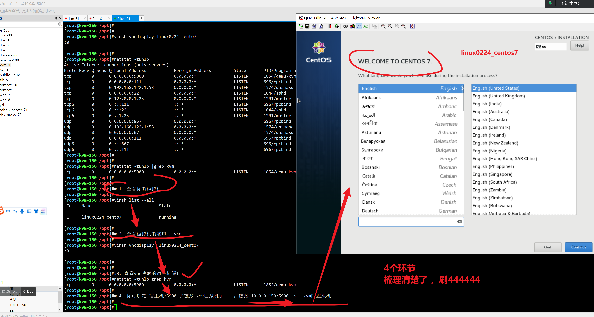


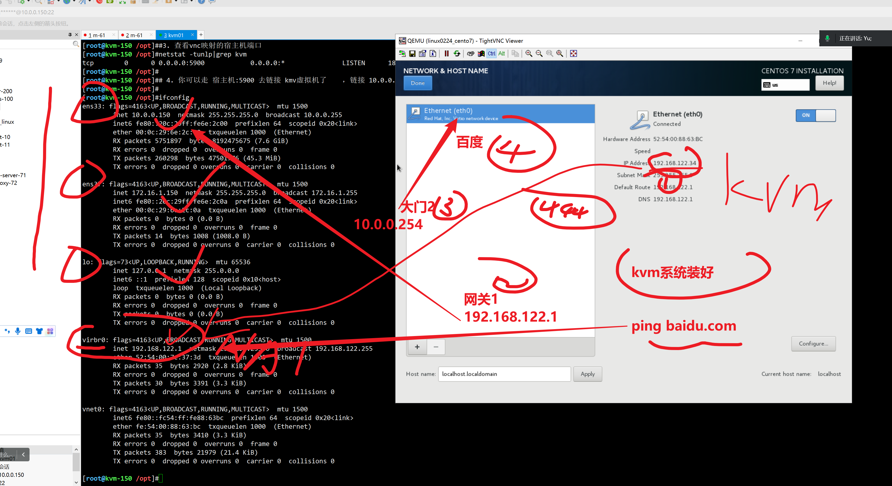


下午 2.42 上课

kvm装一装


## 3.3 远程连接kvm虚拟机

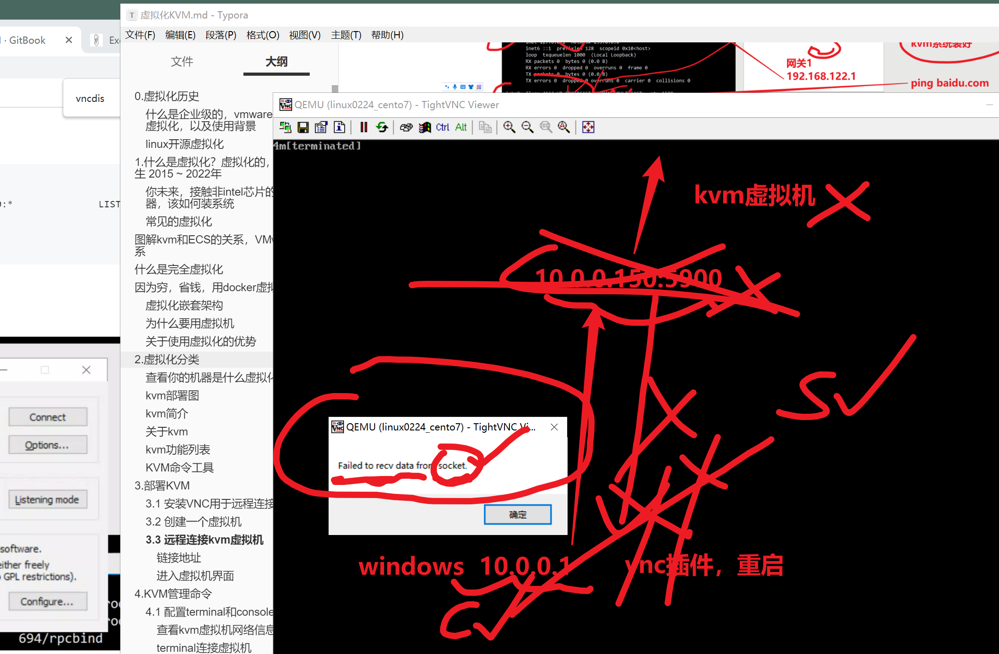


```
client 
server  10.0.0.150:5900
```


```
1. vnc模式，走端口映射，走宿主机的5900，去链接kvm的虚拟机  :0 虚拟机端口号。
[root@kvm-150 /opt]#netstat -tunlp|grep kvm


2.重启虚拟机，去应用，重启后，kvm挂了
3.先宿主机的kvm端口情况
[root@kvm-150 /opt]#netstat -tunlp|grep kvm


4. 对kvm去管理
[root@kvm-150 /opt]#virsh list
 Id    Name                           State
----------------------------------------------------


5.查看所有，以及挂掉的虚拟机状态（挂掉了，没启动，数据都在）
[root@kvm-150 /opt]#virsh list --all
 Id    Name                           State
----------------------------------------------------
 -     linux0224_cento7               shut off


kvm虚拟机，其实就是几部分组成


1. 一个xml配置文件（写入了虚拟机的所有信息，如网络，存储，cpu等）


2. 磁盘文件，/data/
磁盘文件在这
[root@kvm-150 /opt]#ls /data/ -hl
total 1.3G
-rw------- 1 root root 10G Aug 24 23:10 linux0224_cento7.raw


```

## 分析kvm虚拟机的配置文件，如何查看，生成


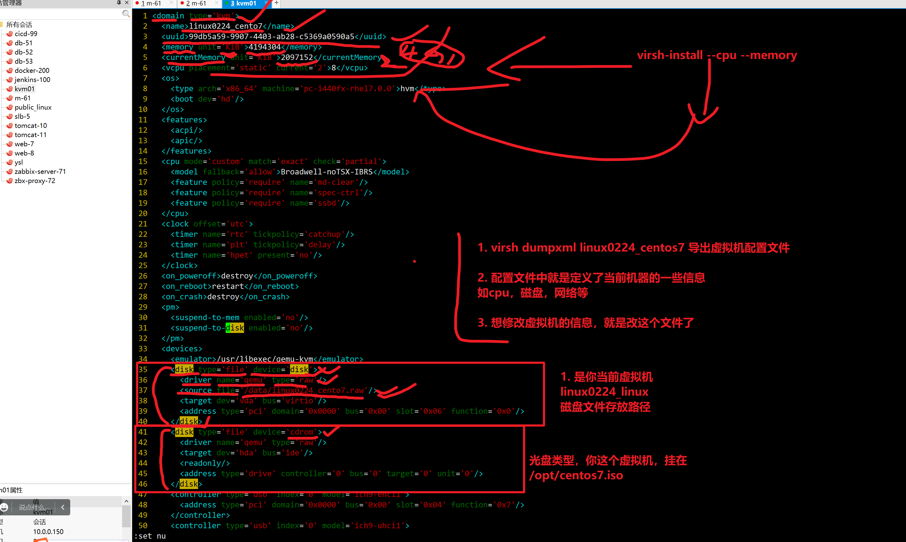


### 链接地址


### 进入虚拟机界面

安装完毕系统即可


# -----4.KVM管理命令-------

重点，管理kvm的常用命令


```perl
1.在运行虚拟机

[root@kvm-150 /opt]#virsh list 
 Id    Name                           State
----------------------------------------------------

[root@kvm-150 /opt]#


2.查看所有虚拟机（挂掉的）
[root@kvm-150 /opt]#virsh list  --all
 Id    Name                           State
----------------------------------------------------
 -     linux0224_cento7               shut off

[root@kvm-150 /opt]#


3.开启某个虚拟机
[root@kvm-150 /opt]#virsh start linux0224_cento7 
Domain linux0224_cento7 started

[root@kvm-150 /opt]#


3.1 查看运行中的虚拟机，ip地址
[root@kvm-150 /opt]#virsh domifaddr linux0224_cento7 
 Name       MAC address          Protocol     Address
-------------------------------------------------------------------------------
 vnet0      52:54:00:88:63:bc    ipv4         192.168.122.34/24

[root@kvm-150 /opt]#


3.2 宿主机尝试ssh登录 kvm
[root@kvm-150 /opt]#ssh root@192.168.122.34

3.3 （这个虚拟机，就是提供给你部署程序的一个机器了而已）
看看它的硬件配置
[root@localhost ~]# lscpu  |grep -i ^cpu
CPU op-mode(s):        32-bit, 64-bit
CPU(s):                2
CPU family:            6
CPU MHz:               2112.000

[root@localhost ~]# free -m
              total        used        free      shared  buff/cache   available
Mem:           1902         117        1641           8         142        1578
Swap:          1023           0        1023


3.4  虚拟机安装一个nginx,net-tools 安装一下

修改yum源
# 虚拟机，拷贝宿主机的配置文件
[root@localhost yum.repos.d]# scp root@10.0.0.150:/etc/yum.repos.d/* ./

#生成缓存 
yum makecache fast


# 安装软件，可以去用vnc链接这个虚拟机，去执行命令安装

yum install 

#额外测试，关闭kvm虚拟机的网络
- ssh断开

- vnc不会断开，这是另一套远程链接的协议（阿里云iptables加错规则，ssh上不去）

可以继续操作，到这都看懂1111

# 可以再vnc协议的远程会话，在启动网络，可以用xshell去管理

[root@localhost yum.repos.d]# yum install vim net-tools nginx -y


3.5 试试，你能如何访问这个nginx？为什么？
默认访问不了，kvm虚拟机自己运行firewalld生成一堆无用规则
systemctl stop firewalld
systemctl disable firewalld
[root@localhost yum.repos.d]# grep -i selinux= /etc/selinux/config 
# SELINUX= can take one of these three values:
SELINUX=dsiabled


和你以前其中架构，初始化，虚拟机配置一样样的

3.6 此时确保宿主机，是可以访问kvm虚拟机的 nginx的

[root@kvm-150 /etc/yum.repos.d]#curl -I 192.168.122.34
HTTP/1.1 200 OK
Server: nginx/1.20.1
Date: Wed, 24 Aug 2022 15:48:39 GMT
Content-Type: text/html
Content-Length: 4833
Last-Modified: Fri, 16 May 2014 15:12:48 GMT
Connection: keep-alive
ETag: "53762af0-12e1"
Accept-Ranges: bytes

3.7 别忘记，重启kvm，让无用的防火墙失效！！！！


16:00  继续


4.关闭，重启，摧毁，某个虚拟机
# 关闭虚拟机

[root@kvm-150 /etc/yum.repos.d]#virsh --help|grep shutdown
    shutdown                       gracefully shutdown a domain
[root@kvm-150 /etc/yum.repos.d]#
[root@kvm-150 /etc/yum.repos.d]#virsh shutdown linux0224_cento7 
Domain linux0224_cento7 is being shutdown


#重启 reboot ，一个运行中的机器，重启

# 先启动，再reboot
[root@kvm-150 /etc/yum.repos.d]#virsh reboot linux0224_cento7 
Domain linux0224_cento7 is being rebooted

[root@kvm-150 /etc/yum.repos.d]#

# 看懂关闭，重启，开机，1111


#摧毁（模拟理解，立即拔电源）
# xx程序，死循环，kvm卡死了
# virsh shutdown 用不了，建议还是优雅关机
# 111

[root@kvm-150 /etc/yum.repos.d]#virsh destroy linux0224_cento7 
Domain linux0224_cento7 destroyed

[root@kvm-150 /etc/yum.repos.d]#
[root@kvm-150 /etc/yum.repos.d]#virsh list --all
 Id    Name                           State
----------------------------------------------------
 -     linux0224_cento7               shut off

[root@kvm-150 /etc/yum.repos.d]#


5.查看，导出，虚拟机配置文件
[root@kvm-150 /opt]#virsh dumpxml linux0224_cento7 > /data/linux0224_cento7.xml 


6. 删除虚拟机，没事别删，要不还要再装，删除配置文件


# 再来一个虚拟机测试用
virt-install --virt-type kvm --os-type=linux --os-variant rhel7 --name test-db-51 --memory 2048,maxmemory=4096 --vcpus 2,maxvcpus=8  --disk /data/test-db-51.raw,format=raw,size=10 --cdrom  /opt/CentOS-7-x86_64-DVD-1804.iso --network network=default --graphics vnc,listen=0.0.0.0  --noautoconsole

# 1.生成磁盘文件
[root@kvm-150 /data]#ll
total 1455476
-rw------- 1 qemu qemu 10737418240 Aug 25 00:21 linux0224_cento7.raw
-rw-r--r-- 1 root root        5287 Aug 24 23:23 linux0224_cento7.xml
-rw------- 1 qemu qemu 10737418240 Aug 25 00:21 test-db-51.raw
[root@kvm-150 /data]#


# 2. 生成配置文件
[root@kvm-150 /data]#ll /etc/libvirt/qemu
total 16
-rw------- 1 root root 4263 Aug 24 20:28 linux0224_cento7.xml
drwx------ 3 root root   42 Aug 24 20:13 networks
-rw------- 1 root root 4245 Aug 25 00:21 test-db-51.xml


# 删除一个虚拟机

# 管理2个虚拟机，通过vnc去链接
[root@kvm-150 /data]#virsh vncdisplay linux0224_cento7 
:0

[root@kvm-150 /data]#
[root@kvm-150 /data]#virsh vncdisplay test-db-51 
:1


[root@kvm-150 /data]#netstat -tunlp |grep kvm
tcp        0      0 0.0.0.0:5900            0.0.0.0:*               LISTEN      6365/qemu-kvm       
tcp        0      0 0.0.0.0:5901            0.0.0.0:*               LISTEN      6572/qemu-kvm       
[root@kvm-150 /data]#


# vnc链接第二个机器
10.0.0.150:5900
10.0.0.150:5901

# 删除虚拟机的玩法
#删除虚拟机的配置文件
[root@kvm-150 /data]#virsh undefine test-db-51 
Domain test-db-51 has been undefined

[root@kvm-150 /data]#
[root@kvm-150 /data]#ll /etc/libvirt/qemu/
total 8
-rw------- 1 root root 4263 Aug 24 20:28 linux0224_cento7.xml
drwx------ 3 root root   42 Aug 24 20:13 networks
[root@kvm-150 /data]#


# 看看磁盘文件
undefine删除虚拟机配置，虚拟机就真的没了，但是磁盘文件还在，有虚拟机，xml备份，还可以恢复该机器的。

# 删除磁盘文件
[root@kvm-150 /data]#rm -f test-db-51.raw 


7.挂起，恢复虚拟机
# 暂停虚拟机

[root@kvm-150 /etc/yum.repos.d]#virsh suspend linux0224_cento7
Domain linux0224_cento7 suspended

# paused暂停

[root@kvm-150 /etc/yum.repos.d]#virsh list 
 Id    Name                           State
----------------------------------------------------
 2     linux0224_cento7               paused


#恢复
[root@kvm-150 /etc/yum.repos.d]#virsh resume linux0224_cento7 
Domain linux0224_cento7 resumed

[root@kvm-150 /etc/yum.repos.d]#virsh list 
 Id    Name                           State
----------------------------------------------------
 2     linux0224_cento7               running

[root@kvm-150 /etc/yum.repos.d]#


8.查看虚拟机端口，vnc端口
[root@kvm-150 /etc/yum.repos.d]#virsh vncdisplay linux0224_cento7 
:0

# :0 即 为 5900 端口，以此类推 :1为5901 。


9.设置kvm开机自启，设置虚拟机开机自启
# 1. libvirtd 服务设置kvm，每次宿主机启动，kvm也就启动了

systemctl enable libvirtd
systemctl is-enabled libvirtd


[root@kvm-150 /data]#virsh autostart linux0224_cento7
Domain linux0224_cento7 marked as autostarted


# 其实这条命令是设置了软连接
ll /etc/libvirt/qemu/autostart/centos7.xml


# 取消开机自启，软连接自动删除
[root@kvm-150 /etc/libvirt/qemu/autostart]#virsh autostart linux0224_cento7
Domain linux0224_cento7 marked as autostarted

[root@kvm-150 /etc/libvirt/qemu/autostart]#
[root@kvm-150 /etc/libvirt/qemu/autostart]#
[root@kvm-150 /etc/libvirt/qemu/autostart]#ll
total 0
lrwxrwxrwx 1 root root 38 Aug 25 00:28 linux0224_cento7.xml -> /etc/libvirt/qemu/linux0224_cento7.xml

```


## 4.1 配置terminal和console的玩法

### 查看kvm虚拟机网络信息

```

```


### terminal连接虚拟机

也就是常见的ssh远程连接

```

```


### console链接

```

```


# 5.生产kvm实践

## 5.1 虚拟机误删除

```

```


## 5.2 如何修改kvm虚拟机配置

```
问题背景：
宿主机磁盘空间不足了，需要迁移kvm虚拟机磁盘文件


```


## 5.3 虚拟机改名


## 5.6 磁盘管理

```
默认的虚拟机磁盘文件
[root@kvm-150 ~]#du -h /new_data/www.yuchaoit.cn.raw 
1.4G    /new_data/www.yuchaoit.cn.raw
```


### 磁盘格式简介

### raw格式

```

```


### qcow2

```
1.查看磁盘信息


2.创建新磁盘


3.查看虚拟磁盘文件


4.调整磁盘文件大小，只能增加，不能减少


5.磁盘镜像格式转换
-f 指定源格式  -O 指定输出格式 

操作步骤
1.虚拟机关机
2.转换磁盘格式
3.编辑配置文件，修改虚拟机磁盘信息


# 先关机

# 格式转换

[root@kvm-150 /opt]#qemu-img convert -f raw -O qcow2 /opt/www.yuchaoit.cn.raw /opt/www.yuchaoit.cn.qcow2


重启机器


# 登录新磁盘格式的虚拟机
```


## 5.7 给虚拟机添加新硬盘

kvm都支持热添加，这是虚拟化的能力，若是真实的服务器，必然是要关机后加硬盘了。


```
1.进入磁盘目录，创建一个新的硬盘


2.查看新、旧硬盘


3.支持热添加硬盘，无须关机了


4.查看虚拟机配置


5.也可以删除虚拟磁盘，例如要更换虚拟磁盘路径


这回slblk也看不到了

6. 再次添加，以及格式化查看新硬盘使用
vdb    第二块硬盘
--live    热添加
--subdriver    驱动类型


虚拟机操作


更新xfs文件系统


```


# 6.kvm快照管理

```
1. 创建虚拟机快照


2.查看快照列表


3.查看快照详细


4.快照还原


5.查看快照文件，linux一切皆文件本质。


6.删除快照

配置文件也被删了


```


# 7.虚拟机克隆

```
1.克隆必须要关机
# 克隆时，虚拟机必须关闭

# --auto-clone    从原始客户机配置中自动生成克隆名称和存储路径。
# -o 指向原有的虚拟机


2.关机，克隆


# 克隆后的磁盘信息


3. 查看新虚拟机


4.启动克隆后的虚拟机


需要修改克隆后的机器，vnc端口


修改克隆机的端口


端口查询


更新虚拟机配置文件


```


# 3.虚拟机网络

我们运行虚拟机的目的是，在虚拟机中运行我们的业务，现在业务所需要的服务都已经运行了，可是除了在宿主机上能访问，其他人都访问不了！！！

我们会利用kvm，创建虚拟机，运行业务服务，如tomcat，lnmp，mysql等等

```
1.进入虚拟机，创建个nginx服务，试试咋访问？


2.运行web服务即可

```


## 3.1 配置kvm桥接

桥接网络，大家应该都还记得，也就是和宿主机处于同一个网络环境。我们vmware里是常用桥接的。

> kvm你就当做和vmware一样玩法，只不过，之前是图形化点击，配置虚拟机
>
> 而kvm是命令行去管理虚拟机了。

```
1.创建桥接网络，在宿主机上执行，注意这个ens33，是根据你宿主机的网卡名字来写，然后创建br0网络

看看我们默认的创建命令，默认的network=default 是NAT模式


2.创建虚拟网桥（注意要打开vmware的DHCP功能）


3. 执行后网络会自动重启，网卡配置文件会自动被修改


4.查看br0网卡配置文件


5.查看宿主机的网桥情况


6.可以创建新虚拟机，使用新的自建网桥，或者修改现有虚拟机配置
新建命令

修改现有虚拟机配置，改为桥接br0网络
修改前


修改后


提示信息


```


## 3.2 查看新的网络环境

### 注意网络环境

```
[root@kvm-150 ~]#virsh domifaddr www.yuchaoit.cn-kvm01 
 Name       MAC address          Protocol     Address
-------------------------------------------------------------------------------
 vnet0      52:54:00:32:32:97    ipv4         192.168.122.108/24
```

我们要注意的是，在kvm虚机默认网络情况下，是dhcp动态分配的192.168网段地址

那么现在，我们配置kvm虚机和宿主机进行网络桥接，处于同一个网段

**那么，如果你的宿主机是动态分配ip地址，那完全没问题，虚机会自动分配ip**

**如果你的宿主机是分配静态ip地址，kvm虚机也得配置静态ip**

修改后的kvm虚拟机网卡

```

```


# 8.kvm热添加技术

## 8.2 热添加网卡

我们这些操作，都是纯命令行操作，若是vmware这样的软件，提供了图形化点击，就简单多了

```

```

## 8.3 热添加CPU

```

```


## 8.4 动态添加内存

```

```


