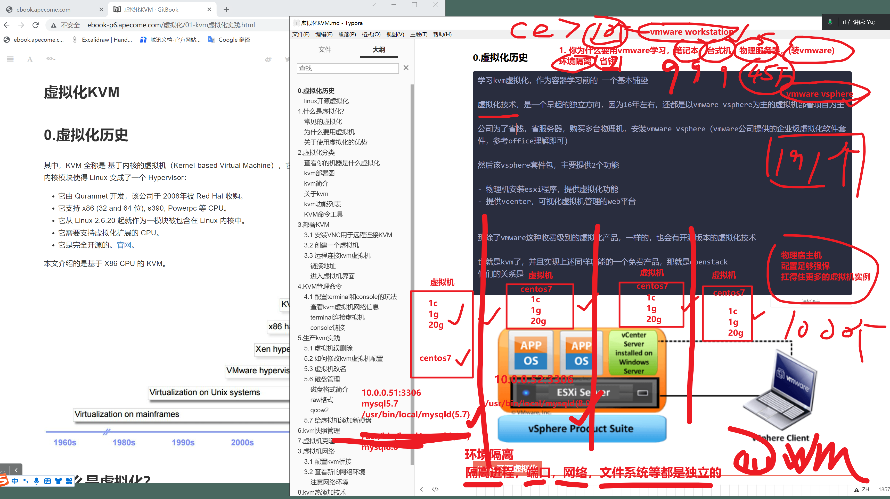

```### 此资源由 58学课资源站 收集整理 ###
	想要获取完整课件资料 请访问：58xueke.com
	百万资源 畅享学习

```
# 0.虚拟化历史



只有一个物理机，安装centos系统

部署多套lnmp集群，部署给多个网站去用

开发说，我的nginx运行端口得是80，我的代码链接的都是80端口-----nginx1.20      mysql  5.7      python2.9 +   xx员工系统

开发说，我的nginx运行端口得是80，我的代码链接的都是80端口----80-----nginx 1.17      mysql8.0       python3.8 +  xx聊天室系统

↓

学会用的，虚拟化技术


```
1. 不好管理
2. 不好装？同一个操作系统下，端口，进程，文件系统路径，都是唯一的，不得冲突
背景，听懂，111

宿主机，dell xx型号， 32核    128GB内存 


3. 思路来了，虚拟机

虚拟机1 ，给业务组1，装lnmp   80 nginx 

虚拟机2 ，给业务组2，装lnmp   80  nginx

4. 公司业务继续加大，又来了50套 lnmp环境

继续加虚拟机xxxxx，虚拟机，给宿主机带来了极大的压力，


5.公司业务扩张，珠海公司，扩张到 东北了，采购物理服务器，继续部署新的虚拟化。


安装路径的区分
/opt/lnmp1/

/opt/lnmp2/


```


同一套path


## 什么是企业级的，vmware vsphere虚拟化，以及使用背景


```
学习kvm虚拟化，作为容器学习前的 一个基本铺垫

虚拟化技术，是一个早起的独立方向，因为16年左右，还都是以vmware vsphere为主的虚拟机部署项目为主

公司为了省钱，省服务器，购买多台物理机，安装vmware vsphere（vmware公司提供的企业级虚拟化软件套件，参考office理解即可）

然后该vsphere套件包，主要提供2个功能

- 物理机安装esxi程序，提供虚拟化功能
- 提供vcenter，可视化虚拟机管理的web平台


那除了vmware这种收费级别的虚拟化产品，一样的，也会有开源版本的虚拟化技术

也就是kvm了，并且实现上述同样功能的一个免费产品，那就是openstack
他们的关系是

```


## linux开源虚拟化

```

那除了vmware这种收费级别的虚拟化产品，一样的，也会有开源版本的虚拟化技术

也就是kvm了，并且实现上述同样功能的一个免费产品，那就是openstack
他们的关系是
```


# 1.什么是虚拟化？虚拟化的，前世今生 2015 ~ 2022年


## 你未来，接触非intel芯片的服务器，该如何装系统


## 常见的虚拟化


# 图解kvm和ECS的关系，VMware的关系


# 什么是完全虚拟化


# 因为穷，省钱，用docker虚拟话等


## 虚拟化嵌套架构


## 为什么要用虚拟机


## 关于使用虚拟化的优势


# 2.虚拟化分类


## 查看你的机器是什么虚拟化


## kvm部署图


## kvm简介


## 关于kvm


## kvm功能列表


## KVM命令工具

10.0.0.150


# 3.部署KVM

```
虚拟机嵌套

windows  > vmware > 宿主机（centos7）（16GB） >  


安装kvm


创建kvm虚拟机


# 安装kvm管理工具
# 软件自身+依赖 20
yum install libvirt virt-install qemu-kvm -y

# 不要随便敲
# 220

yum install libvirt* virt-* qemu-kvm* -y # 

安装软件说明内容：

libvirt            # 虚拟机管理
virt               # 虚拟机安装克隆
qemu-kvm   # 管理虚拟机磁盘

# 启动服务
systemctl start libvirtd.service
systemctl status libvirtd.service


```


## 3.1 安装VNC用于远程连接KVM

```
一台机器，远程链接的协议有多重
vnc远程协议，非ssh另一种链接方式


ssh sshd程序运行，提供 10.0.0.150:22 
iptables 导致机器无法链接

账户密码，。被挖矿，导致cpu 99% ，sshd程序正常解析请求
ssh上不去 

https://www.tightvnc.com/download/2.8.63/tightvnc-2.8.63-gpl-setup-64bit.msi


```


## 3.2 创建一个虚拟机

vmware如何装机

- 本地先准备好 os镜像，centos7.iso    ubunt7.iso
- 选择虚拟机配置
- 宿主机的cpu支持得开启虚拟化（虚拟机嵌套，vmware（假的cpu也得支持虚拟化开启））


```
装系统方式

1. 基于现有完整的OS镜像，重新装
2. 基于现有一个系统的硬盘，开机即可

#virt-install 安装虚拟机
# 窗机虚拟过程看得懂111
# cpu,内存，系统ISO选择，网络模式(defalut nat ,kvm网络环境，又是一个单独的 192.168.0.xx)
#  network=default

#kmv特性，是在创建时候，虚拟机的硬件上线，就限制死了
#--memory 2048 -vcpus 2
#如果想动态修改kvm虚拟机的配置，还得额外添加参数，设置最大内存，设置最大cpu才可以
# -vcpus 2 给当前虚拟机，设置2核  ，2个工作的cpu线程，top 看到 cpu0 cpu1
# maxvcpus=8 ，当前虚拟机动态设置到最高8核，cpu0 ~ cpu7
# -vcpus 2,maxvcpus=8
# --memory 2048,maxmemory=4096   给这个机器2G内存，可动态设置到最大 4G内存
# --disk /data/linux0224_cento7.raw,format=raw,size=10  
#  虚拟机的磁盘文件，放在/data/  磁盘文件类型，raw类型，最大容量是 10G
# vmware用的虚拟磁盘类型是 vmdk格式，存储工程师关心的，了解即可

# --cdrom  /opt/CentOS-7-x86_64-DVD-1804.iso   制定安装os镜像

# 
# --network network=default 

#  --graphics vnc,listen=0.0.0.0  --noautoconsole 

# 网络模式选择是nat，开启vnc功能 listen 虚拟机运行后，会开启vnc端口，绑定0.0.0.0 从外网去链接 
# 阿里云的服务器，也是这个参数，一样样，也开启vnc功能


# 创建kvm参数，完全看懂777


# 正确，创建kvm第一个虚拟机的命令
[root@kvm-150 /opt]#mkdir -p /data

virt-install --virt-type kvm --os-type=linux --os-variant rhel7 --name linux0224_cento7 --memory 2048,maxmemory=4096 --vcpus 2,maxvcpus=8  --disk /data/linux0224_cento7.raw,format=raw,size=10 --cdrom  /opt/CentOS-7-x86_64-DVD-1804.iso --network network=default --graphics vnc,listen=0.0.0.0  --noautoconsole


# 查看正在运行中的kvm虚拟机列表


[root@kvm-150 /opt]#virsh list
 Id    Name                           State
----------------------------------------------------
 1     linux0224_cento7               running

[root@kvm-150 /opt]#
[root@kvm-150 /opt]#

# 查看所有的虚拟机列表，包含挂掉的

[root@kvm-150 /opt]#virsh list --all
 Id    Name                           State
----------------------------------------------------
 1     linux0224_cento7               running


# 查看虚拟机的端口，ip情况，可以用ssh去链接
[root@kvm-150 /opt]#virsh domifaddr linux0224_cento7
 Name       MAC address          Protocol     Address
-------------------------------------------------------------------------------

[root@kvm-150 /opt]#


# 查看kvm虚拟机的 vnc端口
[root@kvm-150 /opt]#virsh vncdisplay linux0224_cento7
:0
# :1
# vnc默认协议端口  # :0 即 为 5900 端口，以此类推 :1为5901 。  


# 查看宿主机上，kvm产生的端口
[root@kvm-150 /opt]#netstat -tunlp |grep kvm
tcp        0      0 0.0.0.0:5900            0.0.0.0:*               LISTEN      1854/qemu-kvm     


# 可以去链接你的第一个kvm虚拟机

# 10.0.0.150:5900

# 到这完全看懂111


# kvm虚拟机创建好之后2个链接方式
# 宿主机，ssh 进入 kvm机器
#  走console ，无需网络可以直接链接 
# 走vnc链接kvm虚拟机


```


下午 2.42 上课

kvm装一装


## 3.3 远程连接kvm虚拟机


```
client 
server  10.0.0.150:5900
```


```
1. vnc模式，走端口映射，走宿主机的5900，去链接kvm的虚拟机  :0 虚拟机端口号。
[root@kvm-150 /opt]#netstat -tunlp|grep kvm


2.重启虚拟机，去应用，重启后，kvm挂了
3.先宿主机的kvm端口情况
[root@kvm-150 /opt]#netstat -tunlp|grep kvm


4. 对kvm去管理
[root@kvm-150 /opt]#virsh list
 Id    Name                           State
----------------------------------------------------


5.查看所有，以及挂掉的虚拟机状态（挂掉了，没启动，数据都在）
[root@kvm-150 /opt]#virsh list --all
 Id    Name                           State
----------------------------------------------------
 -     linux0224_cento7               shut off


kvm虚拟机，其实就是几部分组成


1. 一个xml配置文件（写入了虚拟机的所有信息，如网络，存储，cpu等）


2. 磁盘文件，/data/
磁盘文件在这
[root@kvm-150 /opt]#ls /data/ -hl
total 1.3G
-rw------- 1 root root 10G Aug 24 23:10 linux0224_cento7.raw


```

## 分析kvm虚拟机的配置文件，如何查看，生成


### 链接地址


### 进入虚拟机界面

安装完毕系统即可


# -----4.KVM管理命令-------

重点，管理kvm的常用命令


```perl
1.在运行虚拟机

[root@kvm-150 /opt]#virsh list 
 Id    Name                           State
----------------------------------------------------

[root@kvm-150 /opt]#


2.查看所有虚拟机（挂掉的）
[root@kvm-150 /opt]#virsh list  --all
 Id    Name                           State
----------------------------------------------------
 -     linux0224_cento7               shut off

[root@kvm-150 /opt]#


3.开启某个虚拟机
[root@kvm-150 /opt]#virsh start linux0224_cento7 
Domain linux0224_cento7 started

[root@kvm-150 /opt]#


3.1 查看运行中的虚拟机，ip地址
[root@kvm-150 /opt]#virsh domifaddr linux0224_cento7 
 Name       MAC address          Protocol     Address
-------------------------------------------------------------------------------
 vnet0      52:54:00:88:63:bc    ipv4         192.168.122.34/24

[root@kvm-150 /opt]#


3.2 宿主机尝试ssh登录 kvm
[root@kvm-150 /opt]#ssh root@192.168.122.34

3.3 （这个虚拟机，就是提供给你部署程序的一个机器了而已）
看看它的硬件配置
[root@localhost ~]# lscpu  |grep -i ^cpu
CPU op-mode(s):        32-bit, 64-bit
CPU(s):                2
CPU family:            6
CPU MHz:               2112.000

[root@localhost ~]# free -m
              total        used        free      shared  buff/cache   available
Mem:           1902         117        1641           8         142        1578
Swap:          1023           0        1023


3.4  虚拟机安装一个nginx,net-tools 安装一下

修改yum源
# 虚拟机，拷贝宿主机的配置文件
[root@localhost yum.repos.d]# scp root@10.0.0.150:/etc/yum.repos.d/* ./

#生成缓存 
yum makecache fast


# 安装软件，可以去用vnc链接这个虚拟机，去执行命令安装

yum install 

#额外测试，关闭kvm虚拟机的网络
- ssh断开

- vnc不会断开，这是另一套远程链接的协议（阿里云iptables加错规则，ssh上不去）

可以继续操作，到这都看懂1111

# 可以再vnc协议的远程会话，在启动网络，可以用xshell去管理

[root@localhost yum.repos.d]# yum install vim net-tools nginx -y


3.5 试试，你能如何访问这个nginx？为什么？
默认访问不了，kvm虚拟机自己运行firewalld生成一堆无用规则
systemctl stop firewalld
systemctl disable firewalld
[root@localhost yum.repos.d]# grep -i selinux= /etc/selinux/config 
# SELINUX= can take one of these three values:
SELINUX=dsiabled


和你以前其中架构，初始化，虚拟机配置一样样的

3.6 此时确保宿主机，是可以访问kvm虚拟机的 nginx的

[root@kvm-150 /etc/yum.repos.d]#curl -I 192.168.122.34
HTTP/1.1 200 OK
Server: nginx/1.20.1
Date: Wed, 24 Aug 2022 15:48:39 GMT
Content-Type: text/html
Content-Length: 4833
Last-Modified: Fri, 16 May 2014 15:12:48 GMT
Connection: keep-alive
ETag: "53762af0-12e1"
Accept-Ranges: bytes

3.7 别忘记，重启kvm，让无用的防火墙失效！！！！


16:00  继续


4.关闭，重启，摧毁，某个虚拟机
# 关闭虚拟机

[root@kvm-150 /etc/yum.repos.d]#virsh --help|grep shutdown
    shutdown                       gracefully shutdown a domain
[root@kvm-150 /etc/yum.repos.d]#
[root@kvm-150 /etc/yum.repos.d]#virsh shutdown linux0224_cento7 
Domain linux0224_cento7 is being shutdown


#重启 reboot ，一个运行中的机器，重启

# 先启动，再reboot
[root@kvm-150 /etc/yum.repos.d]#virsh reboot linux0224_cento7 
Domain linux0224_cento7 is being rebooted

[root@kvm-150 /etc/yum.repos.d]#

# 看懂关闭，重启，开机，1111


#摧毁（模拟理解，立即拔电源）
# xx程序，死循环，kvm卡死了
# virsh shutdown 用不了，建议还是优雅关机
# 111

[root@kvm-150 /etc/yum.repos.d]#virsh destroy linux0224_cento7 
Domain linux0224_cento7 destroyed

[root@kvm-150 /etc/yum.repos.d]#
[root@kvm-150 /etc/yum.repos.d]#virsh list --all
 Id    Name                           State
----------------------------------------------------
 -     linux0224_cento7               shut off

[root@kvm-150 /etc/yum.repos.d]#


5.查看，导出，虚拟机配置文件
[root@kvm-150 /opt]#virsh dumpxml linux0224_cento7 > /data/linux0224_cento7.xml 


6. 删除虚拟机，没事别删，要不还要再装，删除配置文件


# 再来一个虚拟机测试用
virt-install --virt-type kvm --os-type=linux --os-variant rhel7 --name test-db-51 --memory 2048,maxmemory=4096 --vcpus 2,maxvcpus=8  --disk /data/test-db-51.raw,format=raw,size=10 --cdrom  /opt/CentOS-7-x86_64-DVD-1804.iso --network network=default --graphics vnc,listen=0.0.0.0  --noautoconsole

# 1.生成磁盘文件
[root@kvm-150 /data]#ll
total 1455476
-rw------- 1 qemu qemu 10737418240 Aug 25 00:21 linux0224_cento7.raw
-rw-r--r-- 1 root root        5287 Aug 24 23:23 linux0224_cento7.xml
-rw------- 1 qemu qemu 10737418240 Aug 25 00:21 test-db-51.raw
[root@kvm-150 /data]#


# 2. 生成配置文件
[root@kvm-150 /data]#ll /etc/libvirt/qemu
total 16
-rw------- 1 root root 4263 Aug 24 20:28 linux0224_cento7.xml
drwx------ 3 root root   42 Aug 24 20:13 networks
-rw------- 1 root root 4245 Aug 25 00:21 test-db-51.xml


# 删除一个虚拟机

# 管理2个虚拟机，通过vnc去链接
[root@kvm-150 /data]#virsh vncdisplay linux0224_cento7 
:0

[root@kvm-150 /data]#
[root@kvm-150 /data]#virsh vncdisplay test-db-51 
:1


[root@kvm-150 /data]#netstat -tunlp |grep kvm
tcp        0      0 0.0.0.0:5900            0.0.0.0:*               LISTEN      6365/qemu-kvm       
tcp        0      0 0.0.0.0:5901            0.0.0.0:*               LISTEN      6572/qemu-kvm       
[root@kvm-150 /data]#


# vnc链接第二个机器
10.0.0.150:5900
10.0.0.150:5901

# 删除虚拟机的玩法
#删除虚拟机的配置文件
[root@kvm-150 /data]#virsh undefine test-db-51 
Domain test-db-51 has been undefined

[root@kvm-150 /data]#
[root@kvm-150 /data]#ll /etc/libvirt/qemu/
total 8
-rw------- 1 root root 4263 Aug 24 20:28 linux0224_cento7.xml
drwx------ 3 root root   42 Aug 24 20:13 networks
[root@kvm-150 /data]#


# 看看磁盘文件
undefine删除虚拟机配置，虚拟机就真的没了，但是磁盘文件还在，有虚拟机，xml备份，还可以恢复该机器的。

# 删除磁盘文件
[root@kvm-150 /data]#rm -f test-db-51.raw 


7.挂起，恢复虚拟机
# 暂停虚拟机

[root@kvm-150 /etc/yum.repos.d]#virsh suspend linux0224_cento7
Domain linux0224_cento7 suspended

# paused暂停

[root@kvm-150 /etc/yum.repos.d]#virsh list 
 Id    Name                           State
----------------------------------------------------
 2     linux0224_cento7               paused


#恢复
[root@kvm-150 /etc/yum.repos.d]#virsh resume linux0224_cento7 
Domain linux0224_cento7 resumed

[root@kvm-150 /etc/yum.repos.d]#virsh list 
 Id    Name                           State
----------------------------------------------------
 2     linux0224_cento7               running

[root@kvm-150 /etc/yum.repos.d]#


8.查看虚拟机端口，vnc端口
[root@kvm-150 /etc/yum.repos.d]#virsh vncdisplay linux0224_cento7 
:0

# :0 即 为 5900 端口，以此类推 :1为5901 。


9.设置kvm开机自启，设置虚拟机开机自启
# 1. libvirtd 服务设置kvm，每次宿主机启动，kvm也就启动了

systemctl enable libvirtd
systemctl is-enabled libvirtd


[root@kvm-150 /data]#virsh autostart linux0224_cento7
Domain linux0224_cento7 marked as autostarted


# 其实这条命令是设置了软连接
ll /etc/libvirt/qemu/autostart/centos7.xml


# 取消开机自启，软连接自动删除
[root@kvm-150 /etc/libvirt/qemu/autostart]#virsh autostart linux0224_cento7
Domain linux0224_cento7 marked as autostarted

[root@kvm-150 /etc/libvirt/qemu/autostart]#
[root@kvm-150 /etc/libvirt/qemu/autostart]#
[root@kvm-150 /etc/libvirt/qemu/autostart]#ll
total 0
lrwxrwxrwx 1 root root 38 Aug 25 00:28 linux0224_cento7.xml -> /etc/libvirt/qemu/linux0224_cento7.xml

```


## ------------------就业指导。。。。-------------------------


```perl
前言

同志们，课程里，你会学到很多技术，很多高级知识

随着你自己对运维的理解，你也会发现，这后面的高级技术，是需要一定的场景，才有用武之地的

初级运维可能会用不上，公司的机器环境，架构形式，如redis-cluster，mha可能都用不到，基本就是主从复制，但是你得学，为的不是一份普通运维工作，而是你以后，下一次的跳槽，去到一个更大的平台，那会再回过头看笔记，就能用上了。

那么最基础的，你现在差不多可以找一个初级运维岗，大约1~3年经验是合适的。

1年经验 linux基础，文件查找，磁盘管理，文档编写，web集群 + 数据库 + shell 足以，大约2，3个项目经验，也就是所学的几大块知识点


2~3 年经验，nginx，nfs，rsync，keepalived，mysql，shell，zabbix监控，cicd，jumpserver，docker,就都得给写上了
不一定得是项目经验，可以是作为个人技能，表述为你的都会，但是公司没用上，这才要跳槽么，想用自己努力所学技术，为公司提供技术服务，解决技术问题。
预计要维护 
- 阿里云，对外的一个web集群技术，如slb，ecs，cdn等
- 内网web集群，也就是LNMP


3年+   前面 都得会，以及后面的docker，k8s，容器化部署项目，也都得写简历上。（1,2年经验的，也可以写，写在个人技能优势上，绝对是加分的）

学的东西很多，你自己要去梳理，别到最后，简历上就写一个LNMP ？？？
以及待你上班之后，就不会再有这种按部就班的学习资料，一切都是未知数，你不思考？怎么玩？

最后，别捡了芝麻，丢了西瓜，有的同学说，工作里，的确日常就用到你学的 30%技能，的确就是这样

别学到最后，linux基础也忘了，部署一个网站也忘了？？？


```


## -----------------昨日复习-----------

```
虚拟机


# 增
# 增加ubuntu
# --os-variant os镜像对应
# 
[root@kvm-150 ~]#osinfo-query os |grep 20.04
 ubuntu20.04          | Ubuntu 20.04                                       | 20.04    | http://ubuntu.com/ubuntu/20.04          
[root@kvm-150 ~]#


#   --network network=default nat （自动dhcp，基于虚拟网桥virbr0 ，分给一个地址192.168.122.1）

virt-install --virt-type kvm --os-type=linux --os-variant ubuntu20.04 --name linux0224_ubuntu20_04 --memory 4048,maxmemory=6096 --vcpus 2,maxvcpus=8  --disk /data/linux0224_ubuntu.raw,format=raw,size=20 --cdrom  /opt/ubuntu-20.04.4-desktop-amd64.iso --network network=default --graphics vnc,listen=0.0.0.0  --noautoconsole

#查询ubuntu虚拟机

[root@kvm-150 ~]#virsh list 
 Id    Name                           State
----------------------------------------------------
 7     linux0224_cento7               running
 8     linux0224_ubuntu20_04          running

[root@kvm-150 ~]#netstat -tunlp|grep kvm
tcp        0      0 0.0.0.0:5900            0.0.0.0:*               LISTEN      19293/qemu-kvm      
tcp        0      0 0.0.0.0:5901            0.0.0.0:*               LISTEN      19546/qemu-kvm   

# vnc链接ubuntu
10.0.0.150:5901


# 删
删除虚拟机
先关机
再删除配置
再删除磁盘镜像

virsh shutdown linux0224_ubuntu20_04 
virsh undefine linux0224_ubuntu20_04 


# 改
[root@kvm-150 ~]#virsh shutdown linux0224_cento7 
Domain linux0224_cento7 is being shutdown

[root@kvm-150 ~]#virsh start linux0224_cento7 
Domain linux0224_cento7 started

[root@kvm-150 ~]#virsh destroy linux0224_cento7 
Domain linux0224_cento7 destroyed

挂起，恢复
[root@kvm-150 ~]#
[root@kvm-150 ~]#virsh suspend linux0224_cento7 
Domain linux0224_cento7 suspended

[root@kvm-150 ~]#
[root@kvm-150 ~]#
[root@kvm-150 ~]#virsh resume linux0224_cento7 
Domain linux0224_cento7 resumed

# 编辑虚拟机的配置文件
[root@kvm-150 ~]#virsh edit linux0224_cento7 
Domain linux0224_cento7 XML configuration not changed.

# 不知道有什么命令？
[root@kvm-150 ~]#virsh --help


# 查==================================== 

[root@kvm-150 ~]#virsh list
 Id    Name                           State
----------------------------------------------------
 4     linux0224_cento7               running

[root@kvm-150 ~]#virsh list --all
 Id    Name                           State
----------------------------------------------------
 4     linux0224_cento7               running

[root@kvm-150 ~]#

===========================================================================

查看如何链接

ip:port   sshd  222

[root@kvm-150 ~]#virsh domifaddr linux0224_cento7 
 Name       MAC address          Protocol     Address
-------------------------------------------------------------------------------
 vnet0      52:54:00:88:63:bc    ipv4         192.168.122.34/24

[root@kvm-150 ~]#

[root@kvm-150 ~]#ssh root@192.168.122.34 -p 22
root@192.168.122.34's password: 
Last login: Thu Aug 25 00:17:09 2022 from gateway
[root@test-kvm01 ~]# 

==========================================================================

vnc链接方式
[root@kvm-150 ~]#virsh vncdisplay linux0224_cento7 
:0

[root@kvm-150 ~]#netstat -tunlp |grep kvm
tcp        0      0 0.0.0.0:5900            0.0.0.0:*               LISTEN      6365/qemu-kvm       
[root@kvm-150 ~]#

==========================================================================

用支持vnc协议的客户端链接即可
链接kvm所在的宿主机的ip即可
==========================================================================
查看虚拟机配置文件

[root@kvm-150 ~]#virsh dumpxml linux0224_cento7 
[root@kvm-150 ~]#virsh dumpxml linux0224_cento7  > /opt/linux0224_centos_kvm01.xml

[root@kvm-150 ~]#ls /etc/libvirt/qemu/
autostart  linux0224_cento7.xml  networks

==========================================================================


# 宿主机吗，是一个独立的完整的操作系统，centos发行版 + linux内核程序，2套程序，操作系统

[root@kvm-150 ~]#cat /etc/redhat-release 
CentOS Linux release 7.5.1804 (Core) 
[root@kvm-150 ~]#
[root@kvm-150 ~]#
[root@kvm-150 ~]#uname -r
3.10.0-862.el7.x86_64


# kvm，基于vmware安装的系统，都是基于 centos7.iso  ubun.iso镜像，安装完整的操作系统

发行版 + linux内核 ===完整的os系统


# 安装ubuntu系统


```


## 今日内容


## 4.1 配置terminal和console的玩法

### 查看kvm虚拟机网络信息

```
[root@kvm-150 ~]#
[root@kvm-150 ~]#virsh domifaddr linux0224_cento7 
 Name       MAC address          Protocol     Address
-------------------------------------------------------------------------------
 vnet0      52:54:00:88:63:bc    ipv4         192.168.122.34/24


```


### terminal连接虚拟机

> terminal中断链接
>
> xshell就是一个中断
>
> 走ssh链接，ip配好

也就是常见的ssh远程连接

```
宿主机  >  ssh > kvm虚拟机

[root@kvm-150 ~]#ssh root@192.168.122.34
root@192.168.122.34's password: 
Last login: Thu Aug 25 18:44:46 2022
[root@test-kvm01 ~]# 

```


### console链接

```
用于再没有网络的环境下，如vnc链接方式，走控制台链接
virsh console命令去链接

机器，开启这个功能，了解

1. 先进入虚拟机，执行如下命令，调整内核参数
1.通过为内核传递参数 console=ttyS0，来让内核把输出定向至 ttyS0
grubby --update-kernel=ALL --args="console=ttyS0,115200n8"
reboot

2.宿主机登录
virsh console linux0224_cento7 
目前不好使 ctrl ] ，这个组合键，可以退出console


3.此时去用console链接试试
[root@kvm-150 ~]#virsh console linux0224_cento7 
配置好ssh后，即可远程链接


```


# 5.生产kvm实践

## 5.1 虚拟机正确删除玩法

```
virsh undefine centos7 

删除


virt-install --virt-type kvm --os-type=linux --os-variant rhel7 --name linux0224111 --memory 2048,maxmemory=4096 --vcpus 2,maxvcpus=8  --disk /data/l1111inux0224_cento7.raw,format=raw,size=10 --cdrom  /opt/CentOS-7-x86_64-DVD-1804.iso --network network=default --graphics vnc,listen=0.0.0.0  --noautoconsole

[root@kvm-150 ~]#ll /etc/libvirt/qemu
total 20
drwxr-xr-x 2 root root   34 Aug 25 00:28 autostart
-rw------- 1 root root 4259 Aug 25 19:13 linux0224111.xml
-rw------- 1 root root 4263 Aug 24 20:28 linux0224_cento7.xml
-rw------- 1 root root 3783 Aug 25 18:59 linux0224_ubuntu20_04.xml
drwx------ 3 root root   42 Aug 24 20:13 networks
[root@kvm-150 ~]#

强制关机
[root@kvm-150 ~]#virsh destroy linux0224111 
Domain linux0224111 destroyed

关机之后删除，配置文件也被删了，虚拟机也没了
[root@kvm-150 ~]#ll /etc/libvirt/qemu
total 20
drwxr-xr-x 2 root root   34 Aug 25 00:28 autostart
-rw------- 1 root root 4259 Aug 25 19:13 linux0224111.xml
-rw------- 1 root root 4263 Aug 24 20:28 linux0224_cento7.xml
-rw------- 1 root root 3783 Aug 25 18:59 linux0224_ubuntu20_04.xml
drwx------ 3 root root   42 Aug 24 20:13 networks
[root@kvm-150 ~]#
[root@kvm-150 ~]#
[root@kvm-150 ~]#virsh undefine linux0224111 
Domain linux0224111 has been undefined

# 误删除玩法
直接undefind删除一个再运行中的机器
- 删除配置文件
- 机器还运行中，重启，机器就没了


# 磁盘文件干掉
[root@kvm-150 /data]#rm -f l1111inux0224_cento7.raw 


[root@kvm-150 /data]#ll -h
total 11G
-rw------- 1 qemu qemu 10G Aug 25 19:16 linux0224_cento7.raw
-rw------- 1 qemu qemu 20G Aug 25 19:18 linux0224_ubuntu.raw
[root@kvm-150 /data]#


```


## 5.1.1 如何正确开机ubuntu

```perl
1. 移除ubunt虚拟机的 光盘信息

2. 重启即可 ,找不到光盘镜像，否则要改ubuntu虚拟机配置文件
virsh edit linux0224_ubuntu20_04 
[root@kvm-150 /data]#mv /opt/ubuntu-20.04.4-desktop-amd64.iso /
[root@kvm-150 /data]#


3.启动
[root@kvm-150 /data]#virsh start linux0224_ubuntu20_04 
Domain linux0224_ubuntu20_04 started

[root@kvm-150 /data]#virsh list --all
 Id    Name                           State
----------------------------------------------------
 7     linux0224_cento7               running
 10    linux0224_ubuntu20_04          running

[root@kvm-150 /data]#


# 手误账户错了
linnux0224账户
123123密码


# 确保让ubuntu可以ssh远程链接

# 配置console功能，登录，修改apt源
如下一个简单的命令，就可以开启console了
RHEL/CentOS7和Ubuntu 15.04都使用了systemd，所以也可以直接使用systemctl来启用Guest虚拟机的控制台，方法相同

systemctl enable serial-getty@ttyS0.service

systemctl start serial-getty@ttyS0.service


此时可以直接在Host物理服务器使用virsh console my_vm直接访问虚拟机控制台，非常方便。

linnux0224@linnux0224-KVM:~$ uname -r
linnux0224@linnux0224-KVM:~$ cat /etc/os-release 


# 可以用xshell去维护了


# 填入如下的apt源
#  vi /etc/apt/sources.list

deb https://mirrors.aliyun.com/ubuntu/ focal main restricted universe multiverse
deb-src https://mirrors.aliyun.com/ubuntu/ focal main restricted universe multiverse

deb https://mirrors.aliyun.com/ubuntu/ focal-security main restricted universe multiverse
deb-src https://mirrors.aliyun.com/ubuntu/ focal-security main restricted universe multiverse

deb https://mirrors.aliyun.com/ubuntu/ focal-updates main restricted universe multiverse
deb-src https://mirrors.aliyun.com/ubuntu/ focal-updates main restricted universe multiverse

# deb https://mirrors.aliyun.com/ubuntu/ focal-proposed main restricted universe multiverse
# deb-src https://mirrors.aliyun.com/ubuntu/ focal-proposed main restricted universe multiverse

deb https://mirrors.aliyun.com/ubuntu/ focal-backports main restricted universe multiverse
deb-src https://mirrors.aliyun.com/ubuntu/ focal-backports main restricted universe multiverse

# 更新apt源缓存
sudo apt-get update

# 下载vim openssh 等
root@linnux0224-KVM:~# sudo apt-get install vim openssh-server openssl net-tools -y

# 启动sshd服务即可
root@linnux0224-KVM:~# systemctl start sshd

linnux0224@linnux0224-KVM:~$ sudo netstat -tunlp|grep ssh
[sudo] password for linnux0224: 
tcp        0      0 0.0.0.0:22              0.0.0.0:*               LISTEN      4764/sshd: /usr/sbi 
tcp6       0      0 :::22                   :::*                    LISTEN      4764/sshd: /usr/sbi 
linnux0224@linnux0224-KVM:~$ 


#走ssh linnux0224@192.168.122.205

linnux0224@linnux0224-KVM:~$ sudo su -
[sudo] password for linnux0224: 
root@linnux0224-KVM:~# 
root@linnux0224-KVM:~# 


root@linnux0224-KVM:~# echo 到这都看懂111
到这都看懂111


```

如何部署ubuntu基础apt环境，以及配置ssh远程服务教程笔记。


## 5.2 如何修改kvm虚拟机配置

虚拟机磁盘目录配置


```
问题背景：
宿主机磁盘空间不足了，需要迁移kvm虚拟机磁盘文件

# 怎办？
# 1. 买磁盘 50GB    /dev/sdb
# 2. vmware热更新识别磁盘。。。

[root@kvm-150 ~]#ls /dev/sd*
/dev/sda  /dev/sda1  /dev/sda2  /dev/sdb


# 2. 磁盘格式mkfs.xfs 
# 遇见一个有自己的私有云环境，才会用到


# 老大给你需求是，虚拟机磁盘，换一个路径，加一个500GB硬盘上去
#目前的磁盘
[root@kvm-150 ~]#ls /data/
linux0224_cento7.raw  linux0224_ubuntu.raw

#挪到
#/new_data  50G磁盘

[root@kvm-150 ~]#mkfs.xfs /dev/sdb


mkdir -p /new_data
[root@kvm-150 ~]#mount -t xfs  /dev/sdb  /new_data/
[root@kvm-150 ~]#
[root@kvm-150 ~]#
[root@kvm-150 ~]#mount -l |grep sdb
/dev/sdb on /new_data type xfs (rw,relatime,attr2,inode64,noquota)


[root@kvm-150 ~]## sdb创建玩法，看懂111
[root@kvm-150 ~]#
[root@kvm-150 ~]#df -h |grep sdb
/dev/sdb                  50G   33M   50G   1% /new_data

# 虚拟机kvm的磁盘，挪到这里来
# 确保kvm虚拟机都关机
[root@kvm-150 ~]#virsh shutdown linux0224_cento7 
Domain linux0224_cento7 is being shutdown


# 移动kvm磁盘文件，到新设备里
[root@kvm-150 ~]#mv /data/* /new_data/

# 修改kvm虚拟机配置，识别新磁盘路径即可
 35     <disk type='file' device='disk'>
     36       <driver name='qemu' type='raw'/>
     37       <source file='/data/linux0224_cento7.raw'/>
     38       <target dev='vda' bus='virtio'/>
     39       <address type='pci' domain='0x0000' bus='0x00' slot='0x06' function='0x0'/>
     40     </disk>

[root@kvm-150 ~]#virsh edit linux0224_cento7 
Domain linux0224_cento7 XML configuration edited.


[root@kvm-150 ~]#virsh edit linux0224_ubuntu20_04 
Domain linux0224_ubuntu20_04 XML configuration edited.


# 开机，2个kvm虚拟机

[root@kvm-150 ~]#virsh start linux0224_cento7 
Domain linux0224_cento7 started

[root@kvm-150 ~]#virsh start linux0224_ubuntu20_04 
Domain linux0224_ubuntu20_04 started

[root@kvm-150 ~]#virsh list
 Id    Name                           State
----------------------------------------------------
 2     linux0224_cento7               running
 3     linux0224_ubuntu20_04          running

[root@kvm-150 ~]#


# 确保2虚拟机可以正常用就好


```


## 5.3 虚拟机改名

````
1. 关机虚拟机


2. 改名即可，命令改名，会修改配置文件

[root@kvm-150 ~]#virsh shutdown linux0224_cento7 
Domain linux0224_cento7 is being shutdown

[root@kvm-150 ~]#virsh domrename linux0224_cento7  centos7
Domain successfully renamed

[root@kvm-150 ~]#virsh list --all
 Id    Name                           State
----------------------------------------------------
 3     linux0224_ubuntu20_04          running
 -     centos7                        shut off

[root@kvm-150 ~]#virsh dumpxml centos7 > /tmp/centos7.xml
[root@kvm-150 ~]#vim /tmp/centos7.xml 
[root@kvm-150 ~]#

````

修改ubuntu虚拟机的名字

```
[root@kvm-150 ~]#virsh shutdown linux0224_ubuntu20_04 
Domain linux0224_ubuntu20_04 is being shutdown

[root@kvm-150 ~]#
[root@kvm-150 ~]#
[root@kvm-150 ~]#virsh dumpxml linux0224_ubuntu20_04 |grep name
  <name>linux0224_ubuntu20_04</name>
    <feature policy='require' name='md-clear'/>
    <feature policy='require' name='spec-ctrl'/>
    <feature policy='require' name='ssbd'/>
    <timer name='rtc' tickpolicy='catchup'/>
    <timer name='pit' tickpolicy='delay'/>
    <timer name='hpet' present='no'/>
      <driver name='qemu' type='raw'/>
      <driver name='qemu' type='raw'/>
        <model name='isa-serial'/>
[root@kvm-150 ~]#
[root@kvm-150 ~]#
[root@kvm-150 ~]#virsh domrename linux0224_ubuntu20_04 ubunt20_04
Domain successfully renamed


```


## 5.6 磁盘管理

```
默认的虚拟机磁盘文件
[root@kvm-150 ~]#du -h /new_data/www.yuchaoit.cn.raw 
1.4G    /new_data/www.yuchaoit.cn.raw
```


### 磁盘格式简介

知识储备，技多不压身


### raw格式

```
1. 占空间，默认的磁盘格式
2. 不支持快照
```


### qcow2

1. 省空间
2. 支持快照


centos7

ubunt 

raw磁盘格式，改为qcow2 格式，且 玩玩快照功能


## 

```
1.查看磁盘信息
# virsh 管理虚拟机
# qemu-img 管理底层虚拟化设备信息，如查看信息

qemu-img info /opt/www.yuchaoit.cn.raw 

[root@kvm-150 ~]#qemu-img info /new_data/linux0224_cento7.raw 
image: /new_data/linux0224_cento7.raw
file format: raw
virtual size: 10G (10737418240 bytes)
disk size: 1.9G
[root@kvm-150 ~]#
[root@kvm-150 ~]#
[root@kvm-150 ~]#
[root@kvm-150 ~]#qemu-img info /new_data/linux0224_ubuntu.raw 
image: /new_data/linux0224_ubuntu.raw
file format: raw
virtual size: 20G (21474836480 bytes)
disk size: 17G


2.创建新磁盘（创建镜像磁盘的命令），用于新装机，装系统去用的

qemu-img create -f qcow2  /new_data/centos-mysql.qcow2   5G


3.查看虚拟磁盘文件
[root@kvm-150 ~]#qemu-img create -f qcow2  /new_data/centos-mysql.qcow2   5G
Formatting '/new_data/centos-mysql.qcow2', fmt=qcow2 size=5368709120 encryption=off cluster_size=65536 lazy_refcounts=off 
[root@kvm-150 ~]#
[root@kvm-150 ~]#
[root@kvm-150 ~]#
[root@kvm-150 ~]#du -h /new_data/*
196K	/new_data/centos-mysql.qcow2
2.0G	/new_data/linux0224_cento7.raw
18G	/new_data/linux0224_ubuntu.raw
[root@kvm-150 ~]#

[root@kvm-150 ~]#qemu-img info /new_data/centos-mysql.qcow2 
image: /new_data/centos-mysql.qcow2
file format: qcow2
virtual size: 5.0G (5368709120 bytes)
disk size: 196K
cluster_size: 65536
Format specific information:
    compat: 1.1
    lazy refcounts: false
[root@kvm-150 ~]#


4.调整磁盘文件大小，只能增加，不能减少

[root@kvm-150 ~]#qemu-img resize /new_data/centos-mysql.qcow2 +35G
Image resized.

[root@kvm-150 ~]#qemu-img info /new_data/centos-mysql.qcow2 
image: /new_data/centos-mysql.qcow2
file format: qcow2
virtual size: 40G (42949672960 bytes)
disk size: 260K
cluster_size: 65536
Format specific information:
    compat: 1.1
    lazy refcounts: false


5.此时这个mysql 镜像，可以用于创建新的kvm虚拟机了


5.磁盘镜像格式转换

centos7.raw镜像，换成qcow2 格式


-f 指定源格式  -O 指定输出格式 
# convert 转换 

#1. 先关机，再转换磁盘镜像格式
[root@kvm-150 /new_data]#virsh shutdown centos7 
Domain centos7 is being shutdown

# 生成了一个新的镜像
qemu-img convert -f raw -O qcow2 linux0224_cento7.raw linux0224_cento7.qcow2


# 修改磁盘镜像的配置文件，读取新的 qcow2格式

修改如下2个参数

     36       <driver name='qemu' type='qcow2'/>
     37       <source file='/new_data/linux0224_cento7.qcow2'/>
[root@kvm-150 /new_data]#
[root@kvm-150 /new_data]#virsh edit centos7 
Domain centos7 XML configuration edited.

# 再次启动
[root@kvm-150 /new_data]#virsh start centos7 
Domain centos7 started

[root@kvm-150 /new_data]#virsh list
 Id    Name                           State
----------------------------------------------------
 5     ubunt20_04                     running
 6     centos7                        running


# 尝试访问
[root@kvm-150 /new_data]#virsh console centos7 
Connected to domain centos7
Escape character is ^]

CentOS Linux 7 (Core)
Kernel 3.10.0-862.el7.x86_64 on an x86_64

test-kvm01 login: root
Password: 
Last login: Thu Aug 25 19:58:58 on tty1
[root@test-kvm01 ~]# 
[root@test-kvm01 ~]# ping baidu.com
PING baidu.com (39.156.66.10) 56(84) bytes of data.
64 bytes from 39.156.66.10 (39.156.66.10): icmp_seq=1 ttl=127 time=7.93 ms
 
--- baidu.com ping statistics ---
1 packets transmitted, 1 received, 0% packet loss, time 0ms
rtt min/avg/max/mdev = 7.934/7.934/7.934/0.000 ms
[root@test-kvm01 ~]# 


# 小结，kvm玩法，可能是命令多，但是理解上，还是很简单的，
# 听懂，看懂111
# 下午 2.00继续


操作步骤
1.虚拟机关机
2.转换磁盘格式
3.编辑配置文件，修改虚拟机磁盘信息


# 先关机

# 格式转换

[root@kvm-150 /opt]#qemu-img convert -f raw -O qcow2 /opt/www.yuchaoit.cn.raw /opt/www.yuchaoit.cn.qcow2


重启机器


# 登录新磁盘格式的虚拟机
```


## -------下午开始-------5.7 给虚拟机添加新硬盘

kvm都支持热添加，这是虚拟化的能力，若是真实的服务器，必然是要关机后加硬盘了。


1. 创建新硬盘
2. 修改虚拟机配置文件，使用该新硬盘


attach-disk 是临时，热添加磁盘


```perl
1.进入磁盘目录，创建一个新的硬盘
#-f qcow2 更省空间，以及支持快照的磁盘格式

qemu-img create -f qcow2 /new_data/disk2.qcow2   5G


2.查看新、旧硬盘
# 看看旧的，centos7这个虚拟机，正在用的

[root@kvm-150 /new_data]#qemu-img info linux0224_cento7.qcow2

[root@kvm-150 /new_data]#qemu-img info disk2.qcow2 


3.支持热添加硬盘，无须关机了
# 查看命令帮助信息
[root@kvm-150 /new_data]#virsh attach-disk --help
  NAME
    attach-disk - attach disk device

  SYNOPSIS
    attach-disk <domain> <source> <target> [--targetbus <string>] [--driver <string>] [--subdriver <string>] [--iothread <string>] [--cache <string>] [--io <string>] [--type <string>] [--mode <string>] [--sourcetype <string>] [--serial <string>] [--wwn <string>] [--rawio] [--address <string>] [--multifunction] [--print-xml] [--persistent] [--config] [--live] [--current]


virsh attach-disk  主机名  新的硬盘路径  虚拟设备的名字 --live 激活  --cache=none 不要缓存 
--subdriver=qcow2


--subdriver=qcow2  使用qcow2这个类型的驱动 


# attach-disk 额外再加一个硬盘


# 给centos7虚拟机，添加一个新磁盘，路径是 /new_data/disk2.qcow2
# 机器内部名字叫vdb
# 使用的驱动是 qcow2 这个镜像格式的驱动

[root@kvm-150 /new_data]#virsh attach-disk centos7 /new_data/disk2.qcow2 vdb --live  --cache=none --subdriver=qcow2

# 什么事永久添加，虚拟机配置信息，要写入到/etc/libvirt/qemu/centos7.xml 永久生效


4.查看虚拟机配置，看看配置文件的变化，以及进入机器，查看虚拟磁盘信息
[root@kvm-150 /new_data]#virsh dumpxml centos7 > /tmp/new_centos7.xml

[root@test-kvm01 ~]# lsblk 
NAME            MAJ:MIN RM  SIZE RO TYPE MOUNTPOINT
sr0              11:0    1 1024M  0 rom  
vda             252:0    0   10G  0 disk 
├─vda1          252:1    0    1G  0 part /boot
└─vda2          252:2    0    9G  0 part 
  ├─centos-root 253:0    0    8G  0 lvm  /
  └─centos-swap 253:1    0    1G  0 lvm  [SWAP]
vdb             252:16   0    5G  0 disk 
[root@test-kvm01 ~]# 


4.1 关机机器，查看disk 2 还是否再


5.也可以删除虚拟磁盘，例如要更换虚拟磁盘路径
# 不能重复添加
virsh detach-disk centos7 vdb

virsh edit centos7 


这回slblk也看不到了

6. 再次添加，以及格式化查看新硬盘使用
vdb    第二块硬盘
--live    热添加
--subdriver    驱动类型


虚拟机操作


更新xfs文件系统


[root@test-kvm01 ~]# mkfs.xfs /dev/vdb 
meta-data=/dev/vdb               isize=512    agcount=4, agsize=327680 blks
         =                       sectsz=512   attr=2, projid32bit=1
         =                       crc=1        finobt=0, sparse=0
data     =                       bsize=4096   blocks=1310720, imaxpct=25
         =                       sunit=0      swidth=0 blks
naming   =version 2              bsize=4096   ascii-ci=0 ftype=1
log      =internal log           bsize=4096   blocks=2560, version=2
         =                       sectsz=512   sunit=0 blks, lazy-count=1
realtime =none                   extsz=4096   blocks=0, rtextents=0
[root@test-kvm01 ~]# 
[root@test-kvm01 ~]# 
[root@test-kvm01 ~]# mount -t xfs 
[root@test-kvm01 ~]# 
[root@test-kvm01 ~]# 
[root@test-kvm01 ~]# mkdir /my_vdb
[root@test-kvm01 ~]# 
[root@test-kvm01 ~]# 
[root@test-kvm01 ~]# mount -t xfs /dev/vd
vda   vda1  vda2  vdb   
[root@test-kvm01 ~]# mount -t xfs /dev/vdb /my_vdb/
[root@test-kvm01 ~]# 
[root@test-kvm01 ~]# 
[root@test-kvm01 ~]# 
[root@test-kvm01 ~]# df -h
Filesystem               Size  Used Avail Use% Mounted on
/dev/mapper/centos-root  8.0G  1.3G  6.8G  16% /
devtmpfs                 2.0G     0  2.0G   0% /dev
tmpfs                    2.0G     0  2.0G   0% /dev/shm
tmpfs                    2.0G  8.6M  2.0G   1% /run
tmpfs                    2.0G     0  2.0G   0% /sys/fs/cgroup
/dev/vda1               1014M  130M  885M  13% /boot
tmpfs                    228M     0  228M   0% /run/user/0
/dev/vdb                 5.0G   33M  5.0G   1% /my_vdb
[root@test-kvm01 ~]# 
[root@test-kvm01 ~]# 

# 更新磁盘的文件系统信息
[root@test-kvm01 ~]# xfs_growfs /my_vdb/

#  再磁盘格式化后可以用了，即永久生效了。这个热添加，新硬盘看懂1111

====================================================
# 再加一个20G硬盘 
# 3个硬盘，vda  vdb  vdc

1. 删除vdb设备
virsh detach-disk centos7 vdb

2. 重新添加，vdb，vdc
[root@kvm-150 /new_data]#virsh attach-disk centos7 /new_data/disk2.qcow2 vdb --live  --cache=none --subdriver=qcow2
Disk attached successfully


qemu-img create -f qcow2 /new_data/disk3.qcow2   20G


# 给机器，在追加一个新硬盘，20G
virsh attach-disk centos7 /new_data/disk3.qcow2 vdc --live  --cache=none --subdriver=qcow2

# 进入机器，格式化磁盘，挂在使用，该磁盘的信息，会写入配置，文件，永久生效
# 
[root@test-kvm01 ~]# mkfs.xfs -f /dev/vdb
[root@test-kvm01 ~]# mkfs.xfs /dev/vdc


# 挂在2个设备

mkdir -p /{my_vdb,my_vdc}

mount -t xfs /dev/vdb  /my_vdb
mount -t xfs /dev/vdc  /my_vdc

# 验证结果
[root@test-kvm01 ~]# df -h |grep vd
/dev/vda1               1014M  130M  885M  13% /boot
/dev/vdb                 5.0G   33M  5.0G   1% /my_vdb
/dev/vdc                  20G   33M   20G   1% /my_vdc

#验证是否是持久化生效的


```


## 如何让热添加磁盘，永久生效（磁盘信息，写入配置文件）

```perl
1.基于如下命令，更新配置文件即可

virsh define 


2. 查看机器持久化配置信息


# 1. 查看当前虚拟机正在用的配置
[root@kvm-150 /new_data]#virsh dumpxml centos7 |grep 'source file'
      <source file='/new_data/linux0224_cento7.qcow2'/>
      <source file='/new_data/disk2.qcow2'/>
      <source file='/new_data/disk3.qcow2'/>


# 2.查看本地虚拟机配置，旧的信息
[root@kvm-150 /new_data]#cat /etc/libvirt/qemu/centos7.xml |grep 'source file'
      <source file='/new_data/linux0224_cento7.qcow2'/>
      <source file='/new_data/disk2.qcow2'/>


# 更新配置文件
# 以我的为准
# 先dumpxml把当前虚拟机正在用的配置，写入到一个文件中
virsh dumpxml centos7 > /opt/latest_centos7.xml
# 读取最新配置
virsh define /opt/latest_centos7.xml

# 更新默认
# /etc/libvirt/qemu/centos7.xml

# 重启机器试试

[root@kvm-150 /new_data]#virsh shutdown centos7 
Domain centos7 is being shutdown

[root@kvm-150 /new_data]#
[root@kvm-150 /new_data]#
[root@kvm-150 /new_data]#virsh start centos7 
Domain centos7 started

# 1111
```


3.10

## virsh命令整理

```
-------------------------------------------virsh参数如下-------------------------------------------
autostart      #自动加载指定的一个虚拟机
connect        #重新连接到hypervisor
console        #连接到客户会话
create         #从一个SML文件创建一个虚拟机
start          #开始一个非活跃的虚拟机
destroy        #删除一个虚拟机
define         #从一个XML文件定义一个虚拟机
domid          #把一个虚拟机名或UUID转换为ID
domuuid        #把一个郁闷或ID转换为UUID
dominfo        #查看虚拟机信息
domstate       #查看虚拟机状态
domblkstat     #获取虚拟机设备快状态
domifstat      #获取虚拟机网络接口状态
dumpxml        #XML中的虚拟机信息
edit           #编辑某个虚拟机的XML文件
list           #列出虚拟机
migrate        #将虚拟机迁移到另一台主机
quit           #退出非交互式终端
reboot         #重新启动一个虚拟机
resume         #重新恢复一个虚拟机
save           #把一个虚拟机的状态保存到一个文件
dump           #把一个虚拟机的内核dump到一个文件中以方便分析
shutdown       #关闭一个虚拟机
setmem         #改变内存的分配
setmaxmem      #改变最大内存限制值
suspend        #挂起一个虚拟机
vcpuinfo       #虚拟机的cpu信息
version        #显示virsh版本
```


# 6.kvm快照管理

15.10 继续


啰嗦一句，kvm玩法， 和docker很像，这里听懂，后面更简单


关于快照的命令帮助

````
    snapshot-create                Create a snapshot from XML
    snapshot-create-as             Create a snapshot from a set of args
    snapshot-current               Get or set the current snapshot
    snapshot-delete                Delete a domain snapshot
    snapshot-dumpxml               Dump XML for a domain snapshot
    snapshot-edit                  edit XML for a snapshot
    snapshot-info                  snapshot information
    snapshot-list                  List snapshots for a domain
    snapshot-parent                Get the name of the parent of a snapshot
    snapshot-revert                Revert a domain to a snapshot

````


```
1. 创建虚拟机快照
virsh snapshot-create-as --name touch-one-txt  linux0224_centos7


2.查看快照列表
virsh snapshot-list linux0224_centos7


3.查看快照详细
virsh snapshot-info  linux0224_centos7 --snapshotname touch-one-txt


4.快照还原
[root@kvm-150 ~]#virsh snapshot-revert linux0224_centos7 --snapshotname touch-one-txt


5.查看快照文件，linux一切皆文件本质。
5.1 和kvm虚拟机免密登录

virsh domifaddr linux0224_centos7 
ssh-keygen 
ssh-copy-id root@192.168.122.34
ssh 'root@192.168.122.34'

[root@kvm-150 ~]#ssh 'root@192.168.122.34'
Last login: Thu Aug 25 23:22:10 2022 from gateway
[root@test-kvm01 ~]# ll
total 4
-rw-------. 1 root root 1202 Aug 24 12:44 anaconda-ks.cfg
-rw-r--r--  1 root root    0 Aug 25 23:16 天热辛苦了同志们.txt
[root@test-kvm01 ~]# 
[root@test-kvm01 ~]# 


6.删除快照

virsh snapshot-delete linux0224_centos7 --snapshotname touch-one-txt

[root@kvm-150 ~]#virsh snapshot-list linux0224_centos7 
 Name                 Creation Time             State
------------------------------------------------------------

[root@kvm-150 ~]#


7.有一个专门管理快照的配置文件目录


[root@kvm-150 ~]#virsh snapshot-create-as --name kuaizhao-v1  linux0224_centos7 
Domain snapshot kuaizhao-v1 created
[root@kvm-150 ~]#
[root@kvm-150 ~]#
[root@kvm-150 ~]#
[root@kvm-150 ~]#virsh snapshot-list linux0224_centos7 
 Name                 Creation Time             State
------------------------------------------------------------
 kuaizhao-v1          2022-08-25 23:27:47 +0800 running

[root@kvm-150 ~]#

[root@kvm-150 ~]#ll /var/lib/libvirt/qemu/snapshot/linux0224_centos7/
total 8
-rw------- 1 root root 5418 Aug 25 23:27 kuaizhao-v1.xml


[root@kvm-150 ~]#ll /var/lib/libvirt/qemu/snapshot/linux0224_centos7/
total 8
-rw------- 1 root root 5418 Aug 25 23:27 kuaizhao-v1.xml
[root@kvm-150 ~]#
[root@kvm-150 ~]#
[root@kvm-150 ~]#
[root@kvm-150 ~]#virsh snapshot-delete linux0224_centos7 --snapshotname kuaizhao-v1 
Domain snapshot kuaizhao-v1 deleted

[root@kvm-150 ~]#
[root@kvm-150 ~]#ll /var/lib/libvirt/qemu/snapshot/linux0224_centos7/
total 0
[root@kvm-150 ~]#

```

看懂 kvm快照增删改查，来一波777

学习讲究个套路，语法记住了，就行。


# 7.虚拟机完整克隆


```
1.克隆必须要关机
# 克隆时，虚拟机必须关闭

# --auto-clone    从原始客户机配置中自动生成克隆名称和存储路径。
# -o 指向原有的虚拟机

# 克隆linux0224_centos7 虚拟机

# --auto-clone    从原始客户机配置中自动生成克隆名称和存储路径。
# -o 指向原有的虚拟机

# -o 填写一个关机状态的虚拟机名字

# 先关机，再克隆

[root@kvm-150 /new_data]#virsh shutdown linux0224_centos7 
Domain linux0224_centos7 is being shutdown


virt-clone --auto-clone -o linux0224_centos7  -n new_linux0224_centos7

# 克隆了，克隆所有原有机器磁盘（看懂111）
自动生成了如下2个新磁盘文件（克隆，复制的磁盘镜像文件）

[root@kvm-150 /new_data]#virt-clone --auto-clone -o linux0224_centos7  -n new_linux0224_centos7
Allocating 'linux0224_cento7-clone.qcow2'                                                |  10 GB  00:00:02     
Allocating 'disk3-clone.qcow2'                                                           |  20 GB  00:00:00     

Clone 'new_linux0224_centos7' created successfully.


# 新克隆机器的磁盘，和原有磁盘在一起，名字
[root@kvm-150 /new_data]#ll |grep clone
-rw------- 1 root root     2883584 Aug 25 23:35 disk3-clone.qcow2
-rw------- 1 root root  1478950912 Aug 25 23:35 linux0224_cento7-clone.qcow2


3. 查看新虚拟机

[root@kvm-150 /new_data]#virsh list --all
 Id    Name                           State
----------------------------------------------------
 5     ubunt20_04                     running
 -     linux0224_centos7              shut off
 -     new_linux0224_centos7          shut off

[root@kvm-150 /new_data]#virsh start new_linux0224_centos7 
Domain new_linux0224_centos7 started

[root@kvm-150 /new_data]#


4.启动克隆后的虚拟机


需要修改克隆后的机器，vnc端口（）


修改克隆机的端口（不用默认的端口，自由修改）
[root@kvm-150 /new_data]#virsh vncdisplay linux0224_centos7 
:2

[root@kvm-150 /new_data]#virsh vncdisplay ubunt20_04 
:1

[root@kvm-150 /new_data]#virsh vncdisplay new_linux0224_centos7 
:0

# 直接去修改，kvm虚拟机配置文件

[root@kvm-150 /new_data]#virsh edit new_linux0224_centos7 
Domain new_linux0224_centos7 XML configuration edited.


修改虚拟机配置
    105     <graphics type='vnc' port='28888' autoport='no' listen='0.0.0.0'>
    106       <listen type='address' address='0.0.0.0'/>
    107     </graphics>


更新虚拟机配置文件
[root@kvm-150 /new_data]#virsh dumpxml new_linux0224_centos7 |grep graphics
    <graphics type='vnc' port='5900' autoport='yes' listen='0.0.0.0'>
    </graphics>
[root@kvm-150 /new_data]#
[root@kvm-150 /new_data]#
[root@kvm-150 /new_data]#
[root@kvm-150 /new_data]#
[root@kvm-150 /new_data]#cat /etc/libvirt/qemu/new_linux0224_centos7.xml |grep graphics
    <graphics type='vnc' port='28888' autoport='no' listen='0.0.0.0'>
    </graphics>
[root@kvm-150 /new_data]#
[root@kvm-150 /new_data]#
[root@kvm-150 /new_data]#
[root@kvm-150 /new_data]#virsh define /etc/libvirt/qemu/new_linux0224_centos7.xml
Domain new_linux0224_centos7 defined from /etc/libvirt/qemu/new_linux0224_centos7.xml


# 别用reboot，废物，用先shutdown，再start
[root@kvm-150 /new_data]#netstat -tunlp|grep kvm
tcp        0      0 0.0.0.0:5901            0.0.0.0:*               LISTEN      2312/qemu-kvm       
tcp        0      0 0.0.0.0:5902            0.0.0.0:*               LISTEN      7503/qemu-kvm       
tcp        0      0 0.0.0.0:28888           0.0.0.0:*               LISTEN      8124/qemu-kvm       
[root@kvm-150 /new_data]#


```


16:00继续


# -----3.虚拟机网络------


我们运行虚拟机的目的是，在虚拟机中运行我们的业务，现在业务所需要的服务都已经运行了，可是除了在宿主机上能访问，其他人都访问不了！！！

我们会利用kvm，创建虚拟机，运行业务服务，如tomcat，lnmp，mysql等等

```
1.进入虚拟机，创建个nginx服务，试试咋访问？


2.运行web服务即可

```


## 3.1 配置kvm桥接

桥接网络，大家应该都还记得，也就是和宿主机处于同一个网络环境。我们vmware里是常用桥接的。

> kvm你就当做和vmware一样玩法，只不过，之前是图形化点击，配置虚拟机
>
> 而kvm是命令行去管理虚拟机了。

## 图解网桥创建


```perl
1.创建桥接网络，在宿主机上执行，注意这个ens33，是根据你宿主机的网卡名字来写，然后创建br0网络

看看我们默认的创建命令，默认的network=default 是NAT模式


# 先看你默认创建机器的命令
virt-install --virt-type kvm --os-type=linux --os-variant rhel7 --name linux0224_cento7 --memory 2048,maxmemory=4096 --vcpus 2,maxvcpus=8  --disk /data/linux0224_cento7.raw,format=raw,size=10 --cdrom  /opt/CentOS-7-x86_64-DVD-1804.iso --network network=default --graphics vnc,listen=0.0.0.0  --noautoconsole


1. 先看宿主机上网络设备接口有哪些

[root@kvm-150 ~]#ip addr


2.创建虚拟网桥（再宿主机上，在创建一个网络接口，链接宿主机，和虚拟机，确保再同一个网段）
virsh iface-bridge ens33   kvm-bridge0


3. 执行后网络会自动重启，网卡配置文件会自动被修改


4.查看br0网卡配置文件


5.查看宿主机的，网络接口情况，网桥情况
[root@kvm-150 ~]#ifconfig kvm-bridge0
kvm-bridge0: flags=4163<UP,BROADCAST,RUNNING,MULTICAST>  mtu 1500
        inet 10.0.0.150  netmask 255.255.255.0  broadcast 10.0.0.255
        inet6 fe80::20c:29ff:fe6e:2c00  prefixlen 64  scopeid 0x20<link>
        ether 00:0c:29:6e:2c:00  txqueuelen 1000  (Ethernet)
        RX packets 131  bytes 10272 (10.0 KiB)
        RX errors 0  dropped 0  overruns 0  frame 0
        TX packets 62  bytes 8660 (8.4 KiB)
        TX errors 0  dropped 0 overruns 0  carrier 0  collisions 0

[root@kvm-150 ~]#


6.可以创建新虚拟机，使用新的自建网桥，或者修改现有虚拟机配置


新建命令，创建虚拟机的方式，有2种
#--cdrom 
1是基于镜像，从0装机   /opt/centos7.iso    
virt-install --virt-type kvm --os-type=linux --os-variant rhel7 --name linux0224_cento7 --memory 2048,maxmemory=4096 --vcpus 2,maxvcpus=8  --disk /data/linux0224_cento7.raw,format=raw,size=10 --cdrom  /opt/CentOS-7-x86_64-DVD-1804.iso --network network=default --graphics vnc,listen=0.0.0.0  --noautoconsole


# 简历，写了解kvm？不写?熟悉，还是熟练？


# 转换ubuntu磁盘类型，为qcow2格式
[root@kvm-150 /new_data]#virsh shutdown ubunt20_04 
Domain ubunt20_04 is being shutdown


qemu-img convert -f raw -O qcow2 linux0224_ubuntu.raw linux0224_ubuntu.qcow2
#查看转换的结果
12G	linux0224_ubuntu.qcow2

18G	linux0224_ubuntu.raw

# 到这看懂111
# 修改配置文件,修改ubuntu配置，用心的磁盘文件


2种克隆一个机器，拿它的磁盘，启动即可
- 先克隆一个磁盘 ubuntu，基于ubuntu启动系统，使用自建的网桥
# -b制定要克隆的源磁盘文件
# 不支持raw格式，将ubuntu，改为qcow2格式
# 链接克隆玩法，看懂1111
# 
qemu-img create -f qcow2 -b linux0224_ubuntu.qcow2  nginx-ubuntu.qcow2

# 原本，基于镜像启动的
# --disk /new_data/nginx-ubuntu.qcow2,format=qcow2,size=20  
# --boot hd
#  --network bridge=kvm-bridge0
- 使用这个磁盘启动即可
# --boot hd 以硬盘形式启动系统
#qcow2 格式


virt-install --virt-type kvm --os-type=linux --os-variant ubuntu20.04 --name nginx_ubuntu --memory 4048,maxmemory=6096 --vcpus 2,maxvcpus=8  --disk /new_data/nginx-ubuntu.qcow2,format=qcow2,size=20  --boot hd  --network bridge=kvm-bridge0 --graphics vnc,listen=0.0.0.0  --noautoconsole

# 链接克隆机器，就可以用了，修改网卡配置文件才行

systemctl enable serial-getty@ttyS0.service

systemctl start serial-getty@ttyS0.service

# 复制你设置的静态ip
root@linnux0224-KVM:~# cat /etc/netplan/01-network-manager-all.yaml 
# Let NetworkManager manage all devices on this system
network:
  version: 2
  renderer: NetworkManager
  ethernets:
    ens3:
      dhcp4: no
      addresses:
        - 10.0.0.77/24
      gateway4: 10.0.0.254
      nameservers:
        addresses: 
          - 223.5.5.5
          - 223.6.6.6 
root@linnux0224-KVM:~# 


# 应用静态网卡设置
linnux0224@linnux0224-KVM:~$ sudo netplan apply

# 确保，宿主机可以走 10.0.0.77 静态ip链接


# 安装ubuntu （给一个ubuntu虚拟机，从nat上午模式，切换到自建网桥上，设置静态ip 10.0.0.77）
# 听懂 1111
# 安装nginx，启动，待会能从windows去访问这个kvm虚拟机，ubuntu 的nginx
sudo apt-get install nginx -y

sudo apt-get install curl -y

========================================================================================================================

修改现有虚拟机配置，改为桥接br0网络
修改前


修改后


提示信息


```


## 最终访问ubuntu虚拟机nginx结果

基于桥接模式的结果


## 3.2 查看新的网络环境

### 注意网络环境

```
[root@kvm-150 ~]#virsh domifaddr www.yuchaoit.cn-kvm01 
 Name       MAC address          Protocol     Address
-------------------------------------------------------------------------------
 vnet0      52:54:00:32:32:97    ipv4         192.168.122.108/24
```

我们要注意的是，在kvm虚机默认网络情况下，是dhcp动态分配的192.168网段地址

那么现在，我们配置kvm虚机和宿主机进行网络桥接，处于同一个网段

**那么，如果你的宿主机是动态分配ip地址，那完全没问题，虚机会自动分配ip**

**如果你的宿主机是分配静态ip地址，kvm虚机也得配置静态ip**

修改后的kvm虚拟机网卡

```

```


# 8.kvm热添加技术


## 8.2 热添加网卡


```
[root@kvm-150 /new_data]#virsh --help|grep  attach
    attach-device                  attach device from an XML file
    attach-disk                    attach disk device
    attach-interface               attach network interface


1. 给ubuntu 这nginx机器，再加一个网卡
# virtual 虚拟机 input  output（网卡，虚拟网桥对）


virsh attach-interface www.yuchaoit.cn-kvm01  --type bridge --model virtio --source kvm-bridge0


```


我们这些操作，都是纯命令行操作，若是vmware这样的软件，提供了图形化点击，就简单多了

```perl
virt-install --virt-type kvm --os-type=linux --os-variant ubuntu20.04 --name nginx_ubuntu --memory 4048,maxmemory=6096 --vcpus 2,maxvcpus=8  --disk /new_data/nginx-ubuntu.qcow2,format=qcow2,size=20  --boot hd  --network bridge=kvm-bridge0 --graphics vnc,listen=0.0.0.0  --noautoconsole

```

## 8.3 热添加CPU

```
#kvm特性，创建的时候，设置最大值，不能超过它


[root@kvm-150 /new_data]#ssh linnux0224@10.0.0.77 'lscpu|head -5'
linnux0224@10.0.0.77's password: 
Architecture:                    x86_64
CPU op-mode(s):                  32-bit, 64-bit
Byte Order:                      Little Endian
Address sizes:                   45 bits physical, 48 bits virtual
CPU(s):                          4
[root@kvm-150 /new_data]#


```


## 8.4 动态添加内存

```
关于机器的配置，务必慎重修改

[root@kvm-150 /new_data]#virsh setmem nginx_ubuntu --size=5242880


[root@kvm-150 /new_data]#ssh linnux0224@10.0.0.77 'lscpu|head -5'
linnux0224@10.0.0.77's password: 
Architecture:                    x86_64
CPU op-mode(s):                  32-bit, 64-bit
Byte Order:                      Little Endian
Address sizes:                   45 bits physical, 48 bits virtual
CPU(s):                          4
[root@kvm-150 /new_data]#
[root@kvm-150 /new_data]#ssh linnux0224@10.0.0.77 'free -m'
linnux0224@10.0.0.77's password: 
              total        used        free      shared  buff/cache   available
Mem:           4908         444        3991          14         472        4230
Swap:           923           0         923
[root@kvm-150 /new_data]#


```


# 8.5 要永久生效

和热添加磁盘一个逻辑

```
virsh define 
# 带出当前虚拟机状态的配置
[root@kvm-150 /new_data]#virsh dumpxml nginx_ubuntu > /opt/end_nginx_ubuntu.xml
# 读取，更新虚拟机持久化配置文件

[root@kvm-150 /new_data]#virsh dumpxml nginx_ubuntu > /opt/end_nginx_ubuntu.xml
[root@kvm-150 /new_data]#
[root@kvm-150 /new_data]#virsh define /opt/end_nginx_ubuntu.xml
Domain nginx_ubuntu defined from /opt/end_nginx_ubuntu.xml

[root@kvm-150 /new_data]#

#重启试试

root@kvm-150 /new_data]#
[root@kvm-150 /new_data]#ssh linnux0224@10.0.0.77 'free -m;lscpu |head -5 |tail -1'
linnux0224@10.0.0.77's password: 
              total        used        free      shared  buff/cache   available
Mem:           4908         463        3989          14         456        4209
Swap:           923           0         923
CPU(s):                          4
[root@kvm-150 /new_data]## 看懂 6666
[root@kvm-150 /new_data]#


```

kvm到此结束，好好复习，加油吧老同志。

散会。


