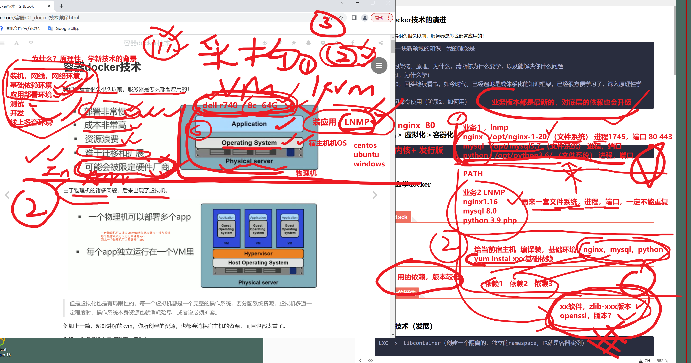
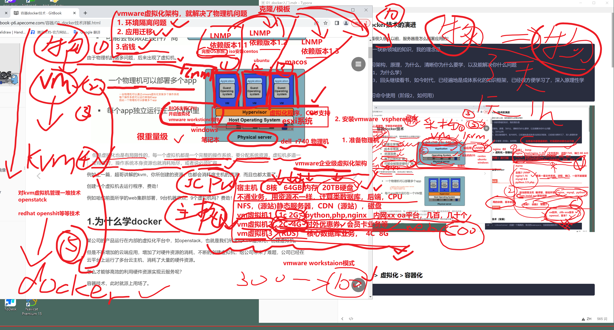
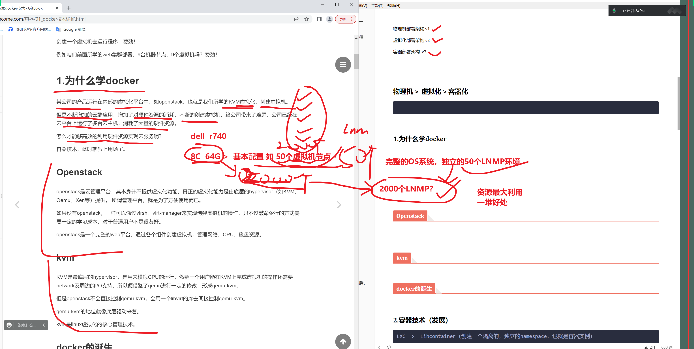
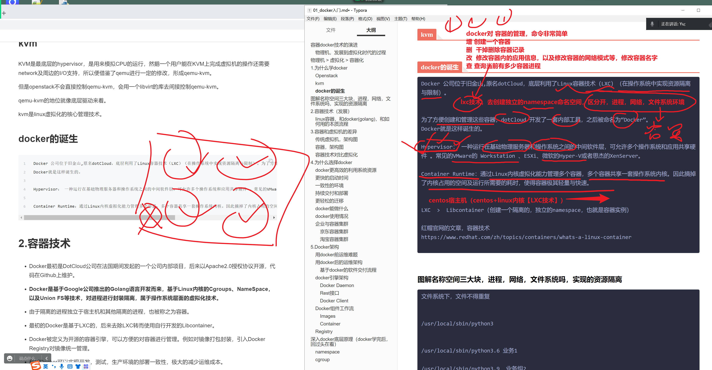
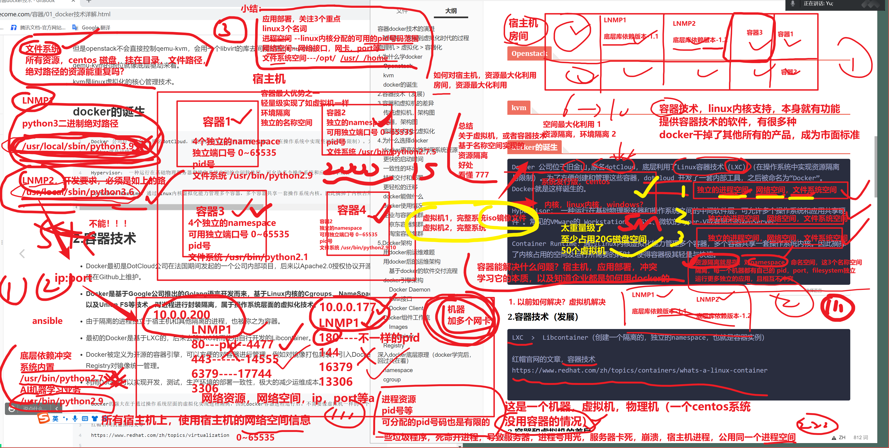
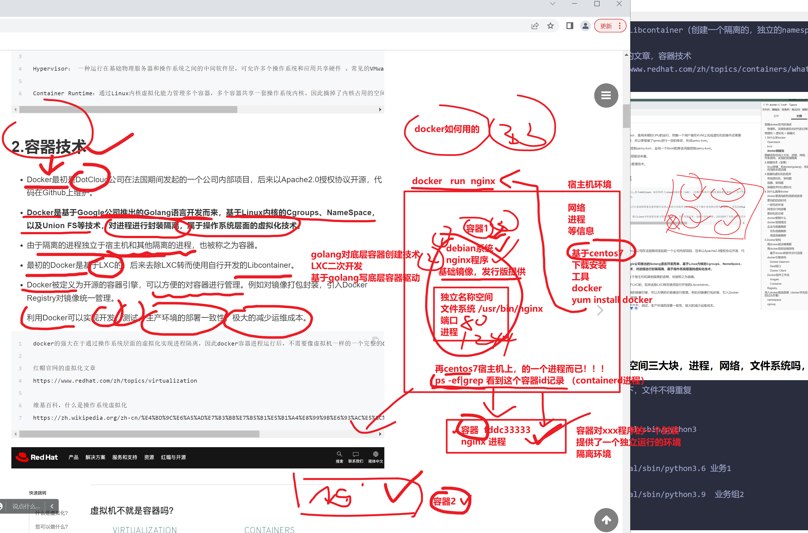
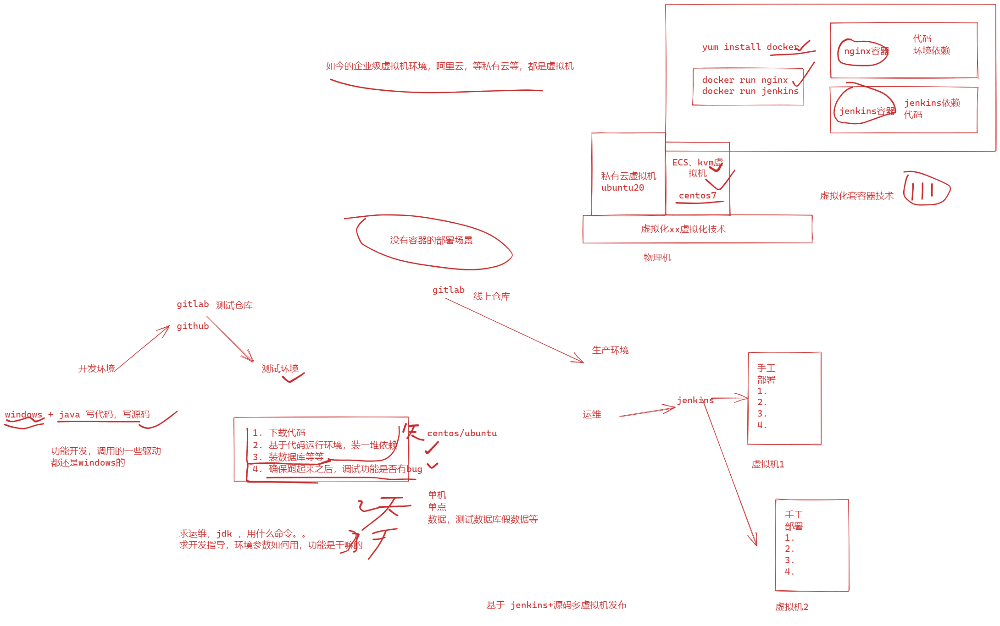
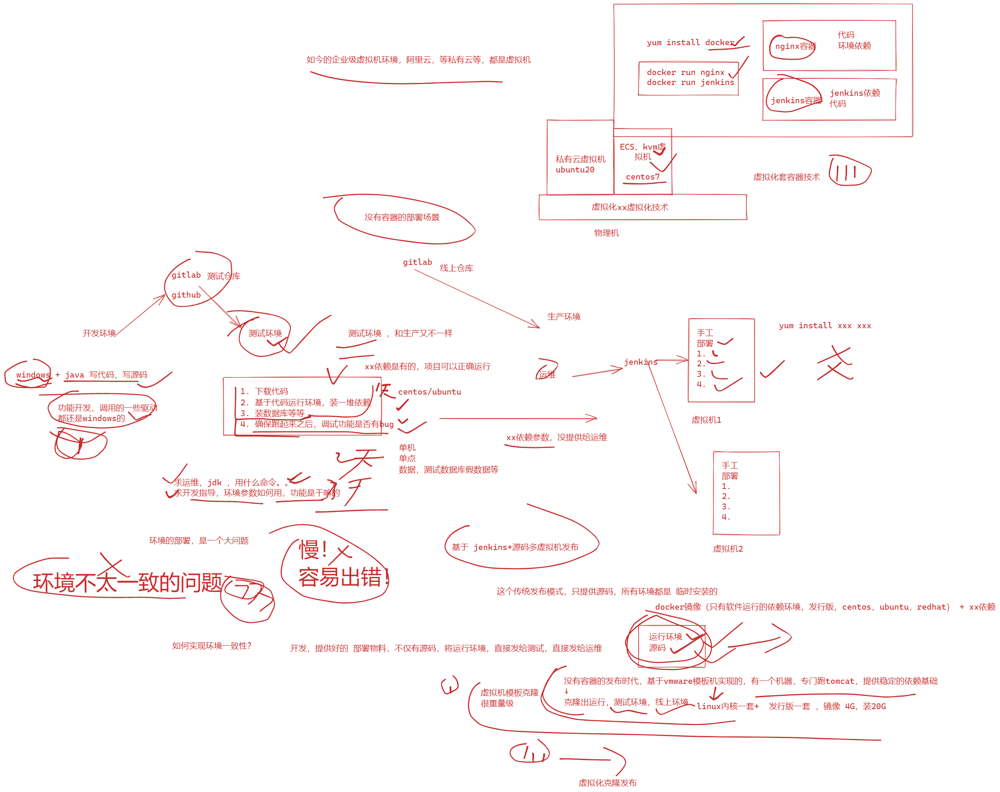
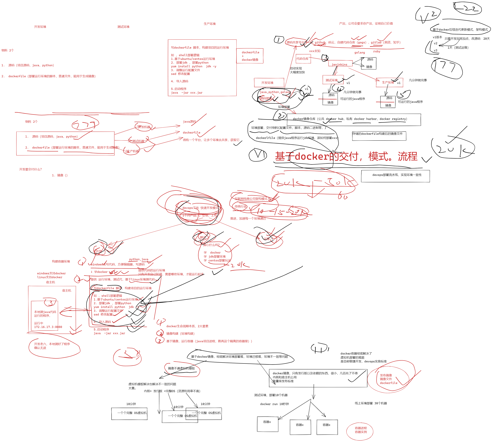

```### 此资源由 58学课资源站 收集整理 ###
	想要获取完整课件资料 请访问：58xueke.com
	百万资源 畅享学习

```
# 容器docker技术的演进

我们先看看很久很久以前，服务器是怎么部署应用的！

```
学习每一块新领域的知识，我的理念是

1. 学习架构，原理，为什么，清晰你为什么要学，以及能解决你什么问题
（阶段1，为什么学）
（阶段3，回头继续看书，如今时代，已经遍地是成体系化的知识框架，已经很方便学习了，深入原理性学习）
2. 学习命令使用（阶段2，如何用）
```




## 物理机，发展到虚拟化时代的过程




物理机部署架构 v1 

虚拟化部署架构 v2

容器部署架构  v3


# 物理机 >  虚拟化 > 容器化

```

```


# 1.为什么学docker




## Openstack


## kvm


## docker的诞生

```
Docker 公司位于旧金山,原名dotCloud，底层利用了Linux容器技术（LXC）（在操作系统中实现资源隔离与限制）。


为了方便创建和管理这些容器，dotCloud 开发了一套内部工具，之后被命名为“Docker”。
Docker就是这样诞生的。

Hypervisor： 一种运行在基础物理服务器和操作系统之间的中间软件层，可允许多个操作系统和应用共享硬件 。常见的VMware的 Workstation 、ESXi、微软的Hyper-V或者思杰的XenServer。

Container Runtime：通过Linux内核虚拟化能力管理多个容器，多个容器共享一套操作系统内核。因此摘掉了内核占用的空间及运行所需要的耗时，使得容器极其轻量与快速。


LXC  >  Libcontainer（创建一个隔离的，独立的namespace，也就是容器实例）

红帽官网的文章，容器技术
https://www.redhat.com/zh/topics/containers/whats-a-linux-container

```




# 图解名称空间三大块，进程，网络，文件系统吗，实现的资源隔离

```
文件系统下，文件不得重复


/usr/local/sbin/python3


/usr/local/sbin/python3.6 业务1  

/usr/local/sbin/python3.9  业务组2


```




# 2.容器技术（发展）

```
LXC  >  Libcontainer（创建一个隔离的，独立的namespace，也就是容器实例）

红帽官网的文章，容器技术
https://www.redhat.com/zh/topics/containers/whats-a-linux-container


```


## linux容器，和docker(golang)，和如何用的本质流程


## docker由来




# docker为什么能实现多环境 的一致性部署，以及快速发布


### 基于虚拟机，源码，jenkins多环境发布




## 基于虚拟机模板发布




## -----互联网公司，基于docker的快速发布，更新模式-------





## 基于容器实现环境一致性发布


# 3.容器和虚拟机的差异

## 传统虚拟机，架构图


## 容器，架构图


## 容器技术对比虚拟化


# 4.为什么选择docker

## docker更高效的利用系统资源


## 更快的启动时间


## 一致性的环境


## 持续交付和部署


## 更轻松的迁移


## docker能做什么


## docker使用情况


## 企业与容器集群

### 京东容器集群


### 淘宝容器集群


# 5.Docker架构

## 用docker前运维难题


## 用docker后的运维架构

前提是，你们的开发、运维都好好的学习了docker技术，否则docker带来的，是更复杂的维护成本。


### 基于docker的软件交付流程


## docker引擎架构

```
架构层级图
```


### Docker Daemon

安装使用Docker，得先运行Docker Daemon进程，用于管理docker，如：

- 镜像 images
- 容器 containers
- 网络 network
- 数据卷 Data Volumes

### Rest接口

提供和Daemon交互的API接口

写代码，直接和docker主进程交互，对容器管理。

### Docker Client

客户端使用REST API和Docker Daemon进行访问。

运维常用的docker维护命令。

## Docker组件工作流

```
绘图理解

镜像（模板）
↓
容器（运行机器实例）


要清楚虚拟机，容器的区别。

```


### Images


### Container


## Registry


# 深入docker底层原理（docker学完后，回过头在看）


## namespace


## cgroup


