```### 此资源由 58学课资源站 收集整理 ###
	想要获取完整课件资料 请访问：58xueke.com
	百万资源 畅享学习

```
# 容器docker技术的演进

我们先看看很久很久以前，服务器是怎么部署应用的！

```
学习每一块新领域的知识，我的理念是

1. 学习架构，原理，为什么，清晰你为什么要学，以及能解决你什么问题
（阶段1，为什么学）
（阶段3，回头继续看书，如今时代，已经遍地是成体系化的知识框架，已经很方便学习了，深入原理性学习）
2. 学习命令使用（阶段2，如何用）
```

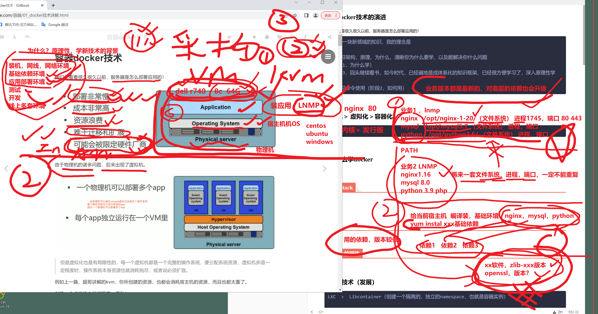


## 物理机，发展到虚拟化时代的过程

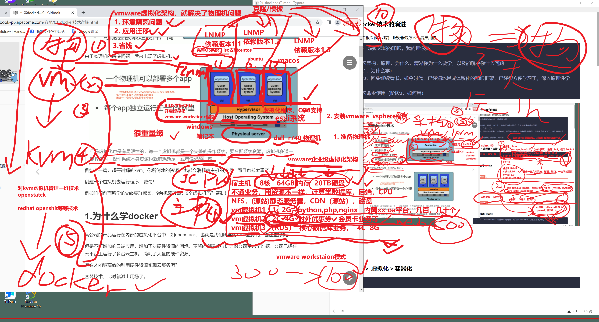


物理机部署架构 v1 

虚拟化部署架构 v2

容器部署架构  v3


# 物理机 >  虚拟化 > 容器化

```

```


# 1.为什么学docker

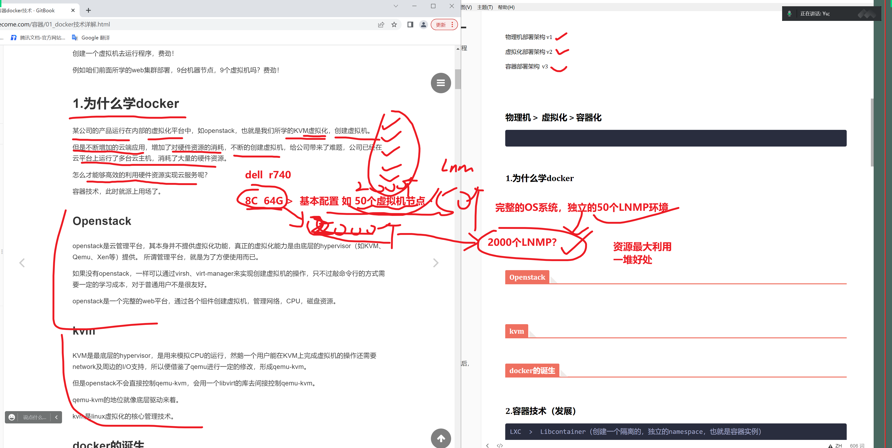


## Openstack


## kvm


## docker的诞生

```
Docker 公司位于旧金山,原名dotCloud，底层利用了Linux容器技术（LXC）（在操作系统中实现资源隔离与限制）。


为了方便创建和管理这些容器，dotCloud 开发了一套内部工具，之后被命名为“Docker”。
Docker就是这样诞生的。

Hypervisor： 一种运行在基础物理服务器和操作系统之间的中间软件层，可允许多个操作系统和应用共享硬件 。常见的VMware的 Workstation 、ESXi、微软的Hyper-V或者思杰的XenServer。

Container Runtime：通过Linux内核虚拟化能力管理多个容器，多个容器共享一套操作系统内核。因此摘掉了内核占用的空间及运行所需要的耗时，使得容器极其轻量与快速。


LXC  >  Libcontainer（创建一个隔离的，独立的namespace，也就是容器实例）

红帽官网的文章，容器技术
https://www.redhat.com/zh/topics/containers/whats-a-linux-container

```

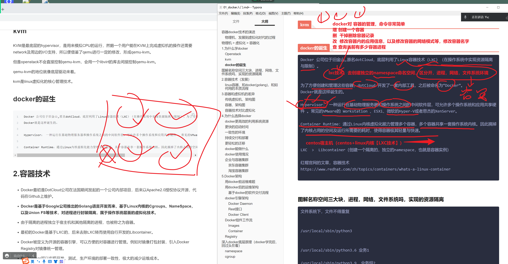


# 图解名称空间三大块，进程，网络，文件系统吗，实现的资源隔离

```
文件系统下，文件不得重复


/usr/local/sbin/python3


/usr/local/sbin/python3.6 业务1  

/usr/local/sbin/python3.9  业务组2


```


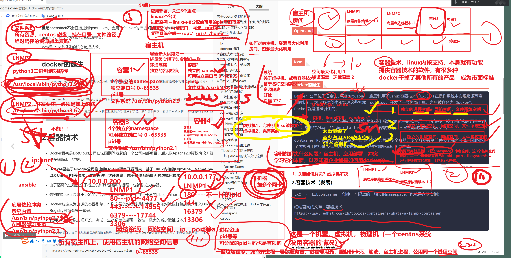

# 2.容器技术（发展）

```
LXC  >  Libcontainer（创建一个隔离的，独立的namespace，也就是容器实例）

红帽官网的文章，容器技术
https://www.redhat.com/zh/topics/containers/whats-a-linux-container


```


## linux容器，和docker(golang)，和如何用的本质流程


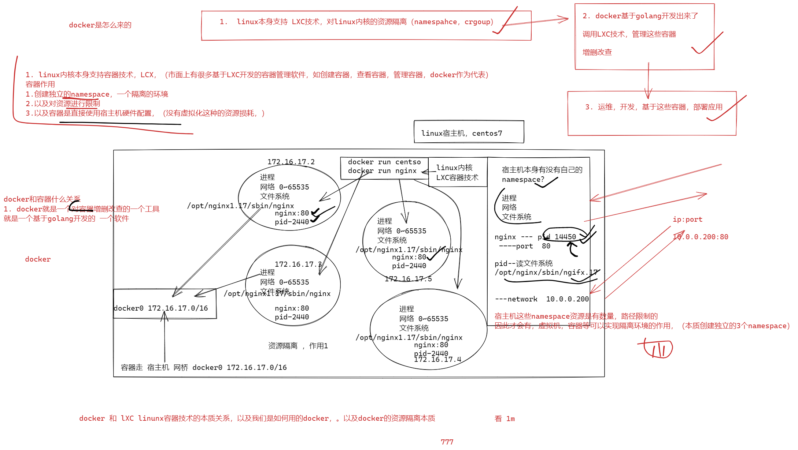


## docker由来

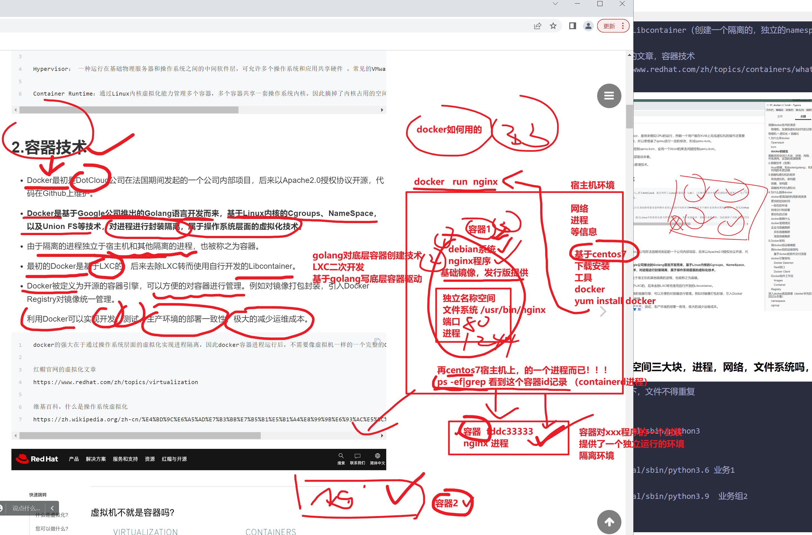


# docker为什么能实现多环境 的一致性部署，以及快速发布


### 基于虚拟机，源码，jenkins多环境发布

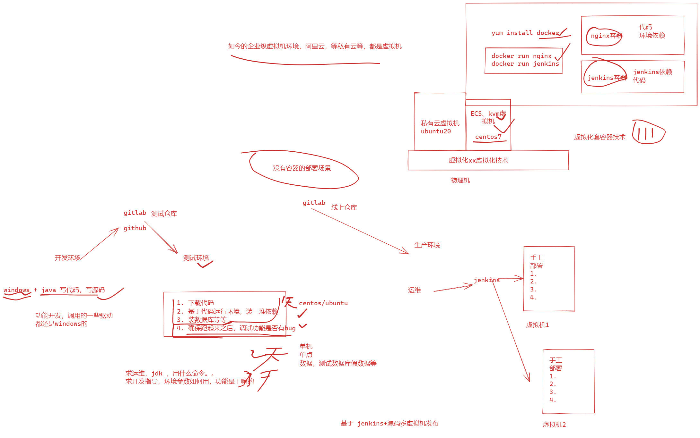


## 基于虚拟机模板发布

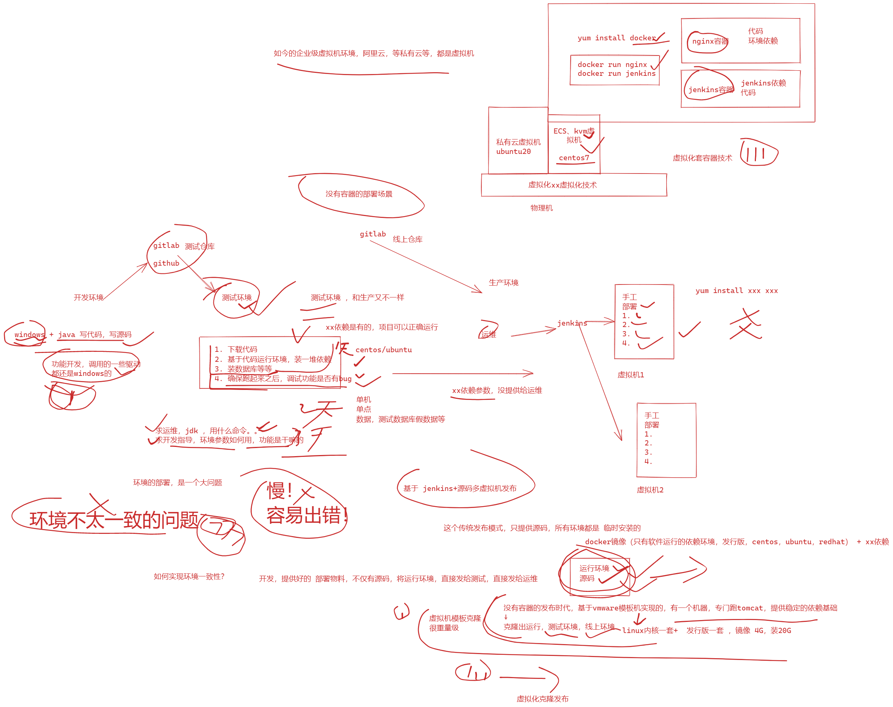


## -----互联网公司，基于docker的快速发布，更新模式-------


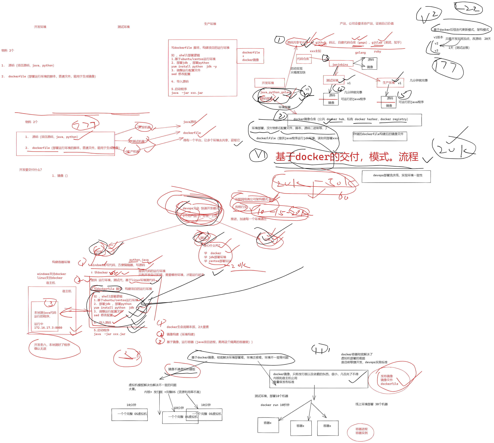


## 基于容器实现环境一致性发布

```
开发
	源码程序 （程序依赖，----应用依赖，-----应用故障-----）
	jdk具体版本  java，java进程挂了，
	底层依赖具体版本
	
	python 3.9.10 解释器版本
	-----pip3 install flask==2.4------  -----，python进程卡死了 150% CPU -----
	模块依赖可能至少20个+
	nginx突然崩溃
	-------------------------------------------------------------
	centos发行版，yum install xxx   程序依赖的 (操作系统自身的故障，)
	----yum install curl wget net-tools---  （xx运维，不小心删除了某个软件，导致xx依赖也被删了，系统故障）
     硬件级别故障，cpu快满了，磁盘快满了，某个应用占用i/o特别高
     （----系统依赖---，---系统故障--）
	
1111

测试环境

	源码程序 （程序依赖，----应用依赖，-----应用故障-----）
	jdk具体版本  java，java进程挂了，
	底层依赖具体版本
	
	python 3.9.10 解释器版本
	-----pip3 install flask==2.4------  -----，python进程卡死了 150% CPU -----
	模块依赖可能至少20个+
	nginx突然崩溃
	-------------------------------------------------------------
	centos发行版，yum install xxx   程序依赖的 (操作系统自身的故障，)
	----yum install curl wget net-tools---  （xx运维，不小心删除了某个软件，导致xx依赖也被删了，系统故障）
     硬件级别故障，cpu快满了，磁盘快满了，某个应用占用i/o特别高
     （----系统依赖---，---系统故障--）
	
1111


生产环境

	源码程序 （程序依赖，----应用依赖，-----应用故障-----）
	jdk具体版本  java，java进程挂了，
	底层依赖具体版本
	
	python 3.9.10 解释器版本
	-----pip3 install flask==2.4------  -----，python进程卡死了 150% CPU -----
	模块依赖可能至少20个+
	nginx突然崩溃
	-------------------------------------------------------------
	centos发行版，yum install xxx   程序依赖的 (操作系统自身的故障，)
	----yum install curl wget net-tools---  （xx运维，不小心删除了某个软件，导致xx依赖也被删了，系统故障）
     硬件级别故障，cpu快满了，磁盘快满了，某个应用占用i/o特别高
     （----系统依赖---，---系统故障--）
	
1111
```


# 3.容器和虚拟机的差异

## 传统虚拟机，架构图

## 容器的本质原理，之名称空间，进程隔离，资源最大化利用.

容器特性能听懂看懂，能清晰说出来。777


- 容器，环境交付的一致性（镜像的概念，对环境打包）
- 提供隔离的运行环境，多个程序之间，不会出现依赖冲突（容器1 yum install ，容器2），完全不影响宿主机（产生一些数据）
- 轻量级（笔记本，100个nginx容器不是问题）
  - 等于再你宿主机上跑了100个进程（100个环境隔离的 ，独立的nginx）
  - 让你用虚拟机去部署
- 高性能
  - 容器没有对宿主机资源的损耗，浪费，虚拟出具体 1c 2g不是
  - 而是直接使用宿主机的最高配置。
    - 对它做一定的限制？
    - 对容器资源限制，cpu，内存
- 

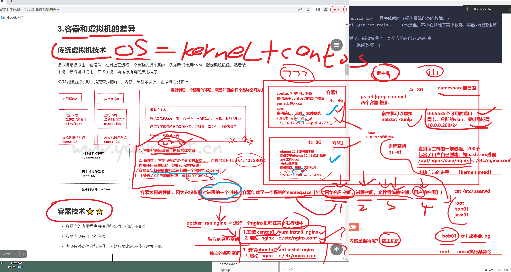


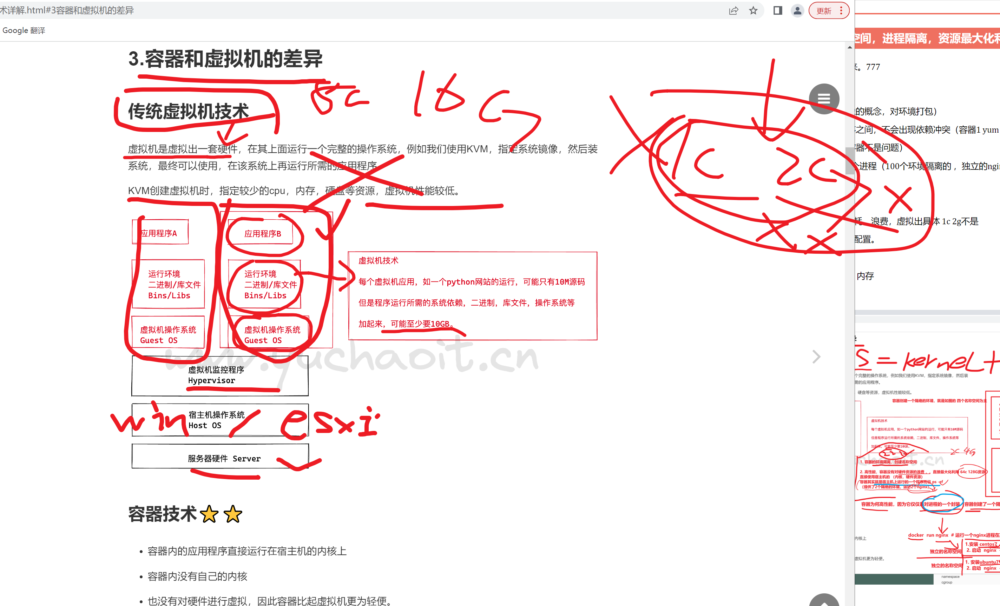


## 容器，架构图

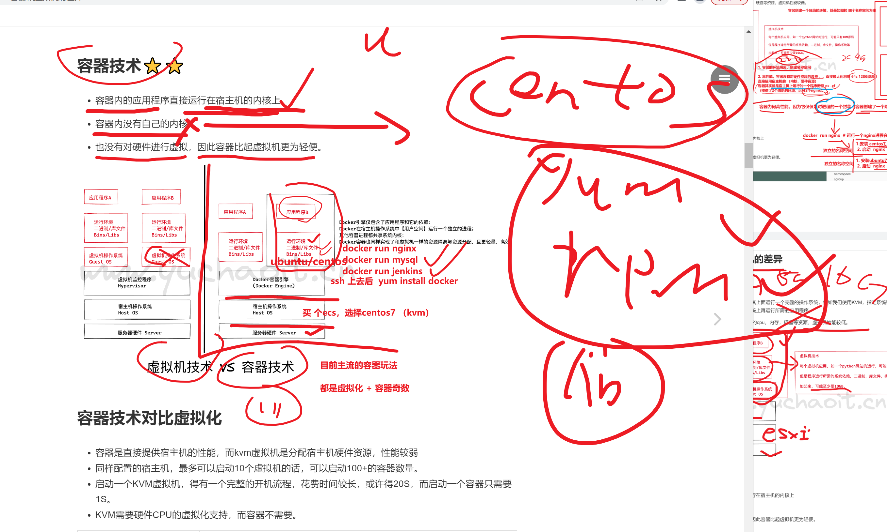


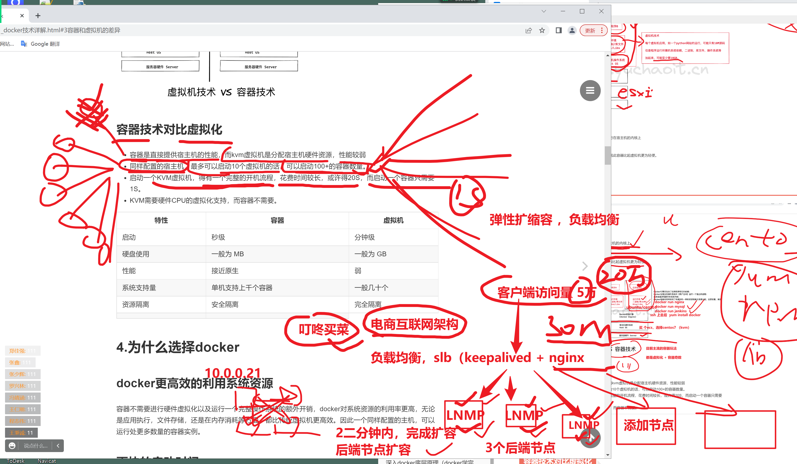


# 容器与微服务发布，与弹性扩缩的关系

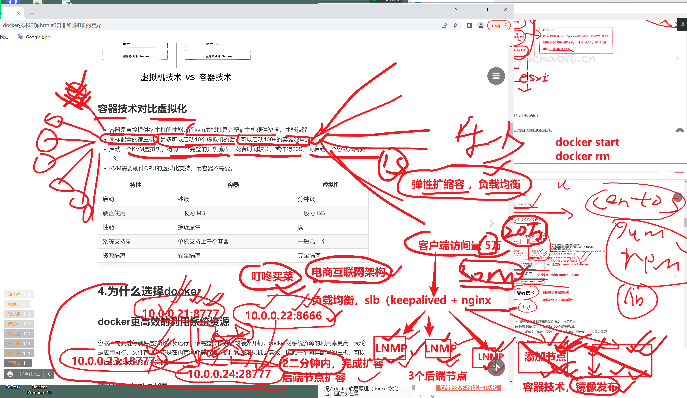


10.26 继续


## 容器技术对比虚拟化


# 4.为什么选择docker

## docker更高效的利用系统资源


## 更快的启动时间


## 一致性的环境


## 持续交付和部署


## 更轻松的迁移


## docker能做什么


## docker使用情况


## 企业与容器集群

### 京东容器集群


### 淘宝容器集群


# ------5.Docker架构------

10.26 继续


## 用docker前运维难题


## 用docker后的运维架构

前提是，你们的开发、运维都好好的学习了docker技术，否则docker带来的，是更复杂的维护成本。


### 基于docker的软件交付流程


## docker引擎架构

```
架构层级图
```


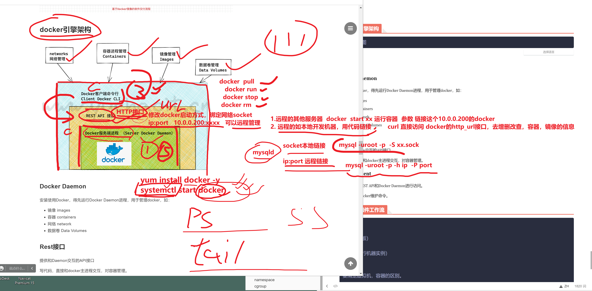


### Docker Daemon

安装使用Docker，得先运行Docker Daemon进程，用于管理docker，如：

- 镜像 images
- 容器 containers
- 网络 network
- 数据卷 Data Volumes

### Rest接口

提供和Daemon交互的API接口

写代码，直接和docker主进程交互，对容器管理。

### Docker Client

客户端使用REST API和Docker Daemon进行访问。

运维常用的docker维护命令。

## Docker组件工作流

如何去用docker，装好之后，如何用它，运行程序，管理程序。删除程序。


```
绘图理解

镜像（模板）
↓
容器（运行机器实例）


要清楚虚拟机，容器的区别。

```

```
小结

1. docker pull命令的4个步骤，去下载镜像

2. docker run
```


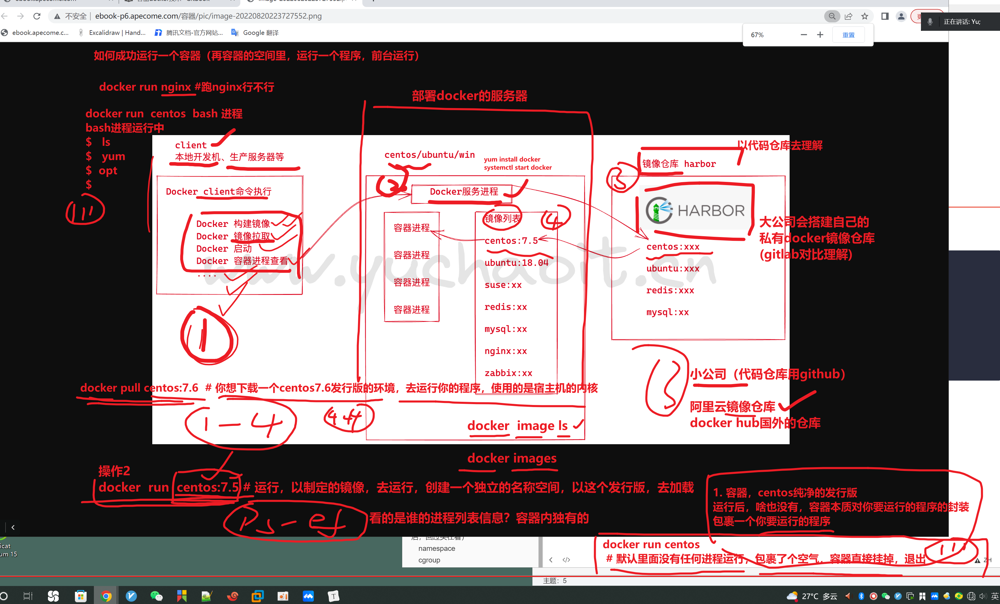


## 运行容器的5个流程

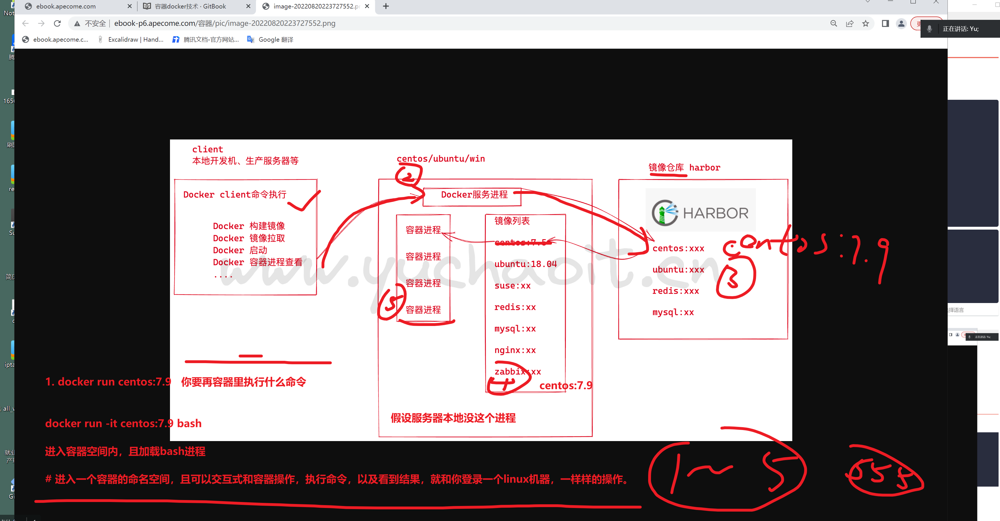


### Images


### Container


## Registry


# 深入docker底层原理（docker学完后，回过头在看）


## namespace


## cgroup


