```### 此资源由 58学课资源站 收集整理 ###
	想要获取完整课件资料 请访问：58xueke.com
	百万资源 畅享学习

```


# docker命令复习


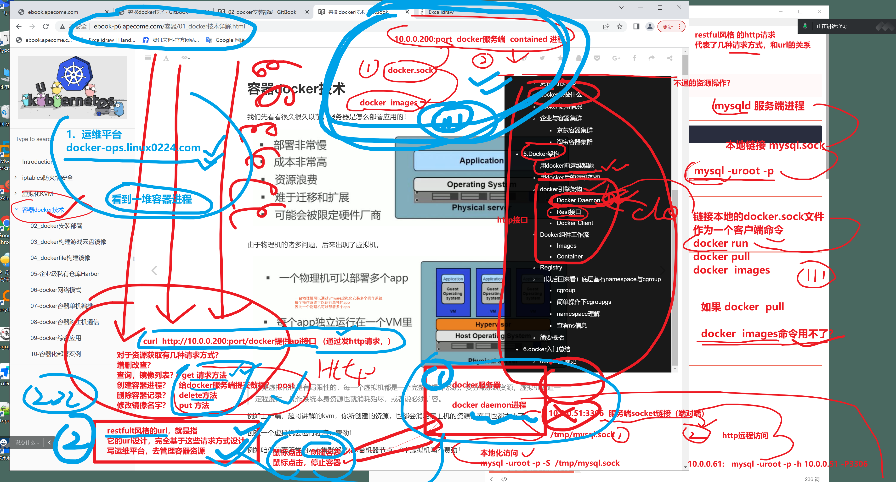


> 又是美好的一天（又是烧脑的一天）

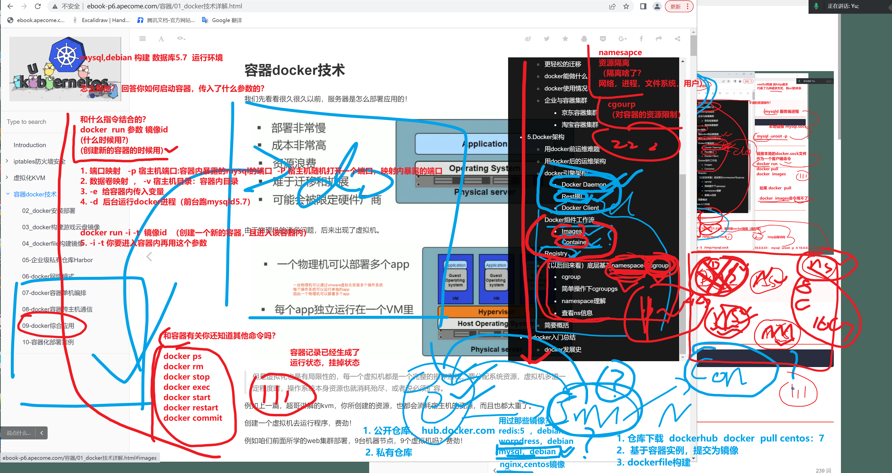


## 回顾所有容器管理命令

谁复习？我复习？

10.23

增删改查


## 3.容器

```
技巧，容器特性，可以当做一个命令去使用。


增

docker run 镜像id   # 基于镜像，生成一个新的容器进程

docker run 
-i
-t
-d
-p
-P
-v

docker start 挂掉的容器id 				# 尝试启动一个容器 


删 ，删除容器记录

docker rm  容器id   # 删除一个容器记录
docker rm -f  容器id  #先stop 容器 ，然后再rm 删除记录


改，修改容器运行记录，状态
    docker commit 容器id  # 提交容器记录为新的镜像
    docker rename  旧容器名  新容器名  


    [root@docker-200 ~]#docker rename cranky_wilbur  bingcheng_docker
    [root@docker-200 ~]#
    [root@docker-200 ~]#docker ps
    CONTAINER ID   IMAGE          COMMAND                  CREATED          STATUS          PORTS     NAMES
    e5cb987f3e72   nginx:1.19.7   "/docker-entrypoint.…"   24 minutes ago   Up 22 minutes   80/tcp    bingcheng_docker
    [root@docker-200 ~]#

	docker stop 容器id  # 停止一个运行中的容器
    [root@docker-200 ~]#docker stop bingcheng_docker 
    bingcheng_docker


	docker restart 容器id  # 重启一个容器进程

	docker kill 等于 docket stop  可以停止单个，多个容器#

	别去看一些老教程，好好听我的课
	docker  export  容器id # 导出容器为
	docker import /opt/bingcheng.tar  
	
	
	
	
	
	
# 你只需要理解 
# 再第一步，知道导出它的意图
#理解 如下命令玩法即可
#  444444444

docker  export  >  docker import >  docker tag >  docker  run > 


# 和docker commit 一个意思，直接将docker容器进程，导出为一个镜像tar包

# 1. docker export 导出当前机器一个运行中的容器，为一个镜像tar文件
[root@docker-200 ~]#docker export bingcheng_docker > /opt/bingcheng.tar

# 2.可以发给其他机器，docker import导入为新镜像
# 然后可以用docker import命令导入tar包为新镜像
[root@docker-201 /opt]#docker images
REPOSITORY   TAG       IMAGE ID       CREATED         SIZE
<none>       <none>    c80569235212   8 seconds ago   131MB


# 3.改名字
[root@docker-201 /opt]#docker tag c80569235212   yuchao163/nginx:1.19.7
[root@docker-201 /opt]#
[root@docker-201 /opt]#
[root@docker-201 /opt]#docker images
REPOSITORY        TAG       IMAGE ID       CREATED              SIZE
yuchao163/nginx   1.19.7    c80569235212   About a minute ago   131MB
[root@docker-201 /opt]#
[root@docker-201 /opt]#


# 4.不知道镜像啥作用？什么命令帮你


=====================================================
查，查询容器的各种信息

docker ps     # 查询运行中的容器
docker ps -a  # 查询容器的历史记录，运行的，挂掉的
docker ps -aq  # 查询所有容器的记录，只显示id号
docker top  容器id  # 查看一个运行中的容器进程信息
docker port 容器id   # 查看容器的端口映射情况，
docker inspect  容器id  #输出容器的详细json数据信息
docker logs 容器id  # 输出容器内，的stdout，stderr的日志（需要你自己主动设置）
# 容器内，只有 nginx  access.log  error.log  ??
# 容器nginx   50个业务，50个*.log 
# 如何将提取日志信息？
# 从宿主机，拿到容器内这些日志？  进入容器，看日志去呗。。。


# 正确的exec 后面的参数是什么
#作用 ，运行一个命令， 再一个运行中的容器内

[root@docker-200 ~]## 在这个容器内 ，创建一个 /opt/heiheihei.log

# 交互式，进入容器空间内，执行命令，touch /opt/heiheihei.log 
[root@docker-200 ~]#docker exec    -i -t  10b646bb3e09  
[root@docker-200 ~]#docker exec    -i -t  10b646bb3e09   bash 
root@10b646bb3e09:/# touch /opt/heiheihei.log

root@10b646bb3e09:/# ls
bin  boot  dev	docker-entrypoint.d  docker-entrypoint.sh  etc	home  lib  lib64  media  mnt  opt  proc  root  run  sbin  srv  sys  tmp  usr  var

root@10b646bb3e09:/# cd /opt
root@10b646bb3e09:/opt# ls
heiheihei.log

# 非交互式的，再给容器，写入这个日志，一句话 xixi 
[root@docker-200 ~]#docker exec 10b bash -c "echo 'xixi' > /opt/heiheihei.log"
[root@docker-200 ~]#
[root@docker-200 ~]#

# 试试能查出来，强写入的这个数据吗
# 非交互
[root@docker-200 ~]#docker exec 10b bash -c "echo 'xixi' > /opt/heiheihei.log"
[root@docker-200 ~]#
[root@docker-200 ~]#
[root@docker-200 ~]#
[root@docker-200 ~]#
[root@docker-200 ~]#docker exec 10b cat /opt/heiheihei.log
xixi
[root@docker-200 ~]#docker exec 10b bash -c "cat /opt/heiheihei.log"
xixi
[root@docker-200 ~]#
[root@docker-200 ~]#
[root@docker-200 ~]#
[root@docker-200 ~]## 完全看懂的同学，刷666
[root@docker-200 ~]#
[root@docker-200 ~]#


# docket stats 容器id  #查看运行中的容器，使用资源情况 cpu ,内存 磁盘等


 


# docker info 显示docker服务端信息


[root@docker-200 ~]#docker run -d -p 80:80 nginx:1.19.7 
10b646bb3e0980c08100c6ab4c352501a47944b14167b11fef6b37e0e9908ce6
[root@docker-200 ~]#
[root@docker-200 ~]#
[root@docker-200 ~]#
[root@docker-200 ~]#docker ps
CONTAINER ID   IMAGE          COMMAND                  CREATED         STATUS         PORTS                               NAMES
10b646bb3e09   nginx:1.19.7   "/docker-entrypoint.…"   8 seconds ago   Up 7 seconds   0.0.0.0:80->80/tcp, :::80->80/tcp   vigilant_bhabha
[root@docker-200 ~]#
[root@docker-200 ~]#
[root@docker-200 ~]#
[root@docker-200 ~]#docker port 10b
80/tcp -> 0.0.0.0:80
80/tcp -> :::80


```


## 容器资源监控docket stats


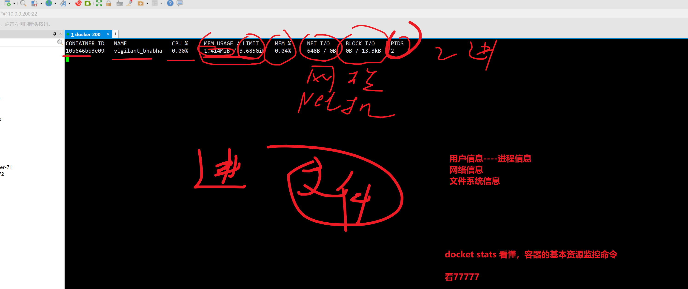


```
docker  核心

仓库管理命令

增删改查，还是查看状态等 

容器管理命令


镜像管理命令


```


## 2.镜像

会玩镜像的命令操作，11111


````
增新增镜像的命令
    docker pull  镜像名:tag

    docker commit   容器id

    docker load  <  本地镜像tar文件

	docker save 镜像id  >  具体镜像tar文件 

	docker build  Dockerfile  # 基于dockerfile生成一个新的镜像，下一步所学


删

docker rmi  镜像id


改

镜像改不了，只读文件模板
（如何理解修改镜像？）
# 1. 运行镜像，生成读写层容器实例。
docker run 镜像id  # 基于镜像，运行容器实例，该的文件系统，都是容器里的资料，不会修改镜像本身
docker run centos:7.9.2009  yum install vim -y # 开辟一个读写层，容器层，再这容器里的文件系统中，去安装nginx软件

vim在哪？怎么找打他？命令是什么？
看什么新信息？容器id


# 2.提交该容器空间的，携带vim的记录，为新的镜像
[root@docker-200 ~]#docker commit e40 linux0224-vim-centos7
sha256:d4ac65da3829505ad5c86fb381939f341171126417b3f7df4edb3663a9e1e17d


# 3.此时新镜像，就可以使用centos7 + vim了


docker tag 修改镜像的版本信息，以及镜像名，如加上docker hub的账户
[root@docker-200 ~]#docker tag mysql:5.7.7   yuchao163/mysql:5.7.7
[root@docker-200 ~]#docker images yuchao163/mysql*
REPOSITORY        TAG       IMAGE ID       CREATED       SIZE
yuchao163/mysql   5.7.7     cf8a22028fe7   7 years ago   322MB


查

# 查询只读镜像文件的一层一层关系
docker histroy 镜像id


docker images 
docker image ls  

# 列出镜像文件列表

````


### 镜像，容器，提交容器记录，工作流原理

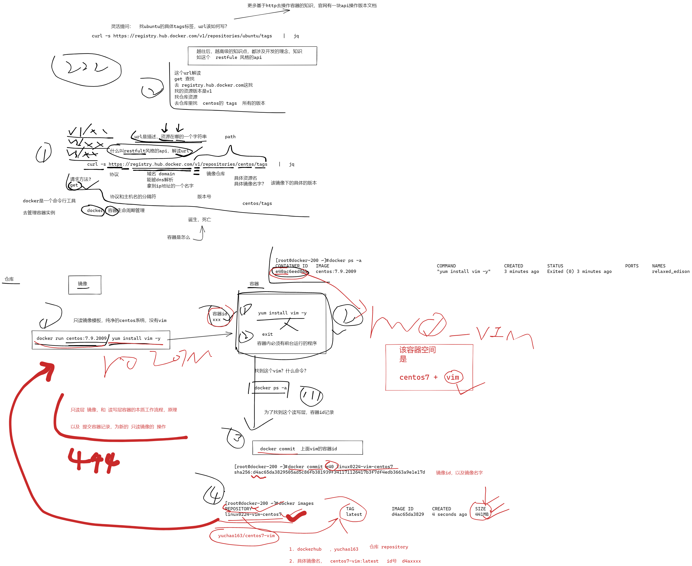


## 分析docker日志输出原理，docker logs查看

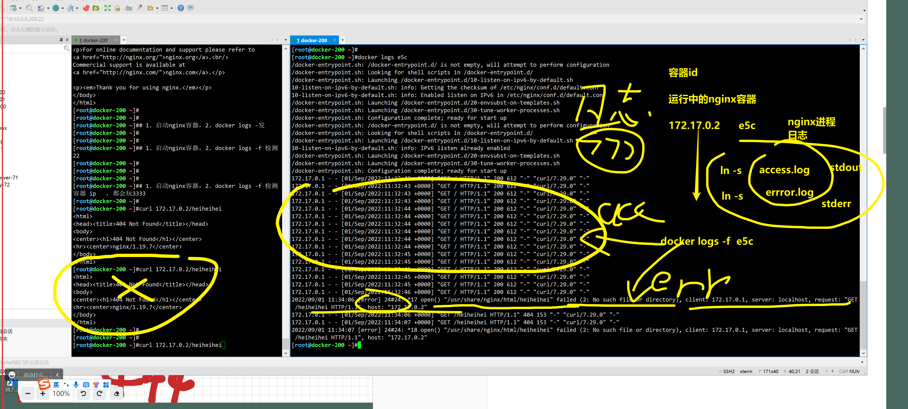


## 分析启动docker报错的流程

都是疑点，难点，你要掌握的分析能力。


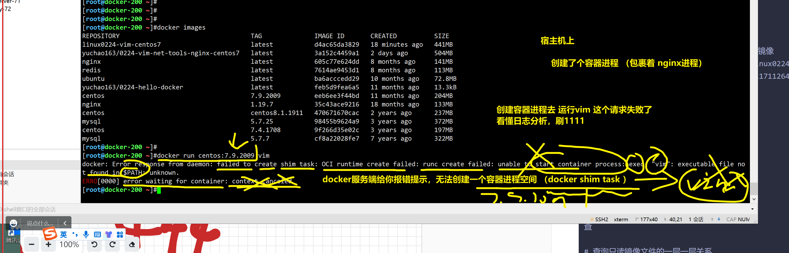


## 查看容器特性，将容器当做个命令去用


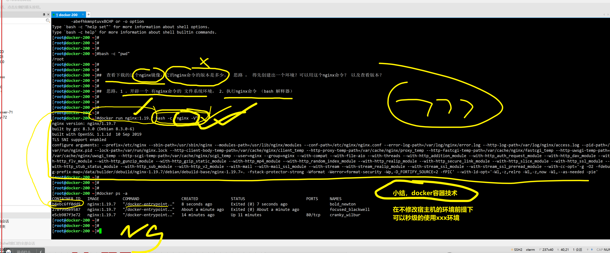


## 镜像和容器的工作原理

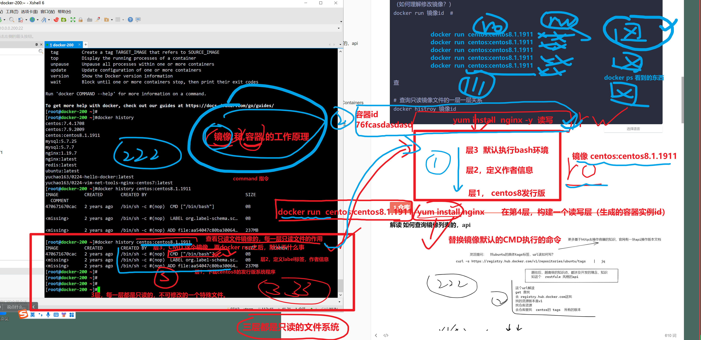


## 1.仓库

### 解读 如何查询镜像列表的，api

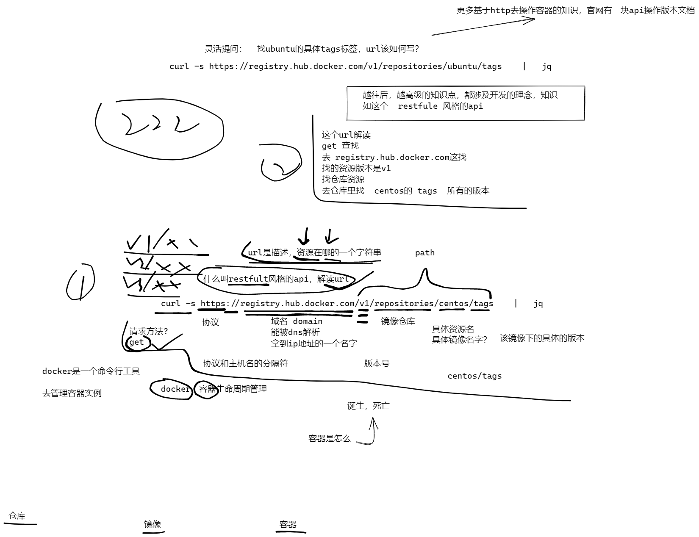


```
1. 如何看仓库相关的 帮助命令信息？  docker命令帮助


仓库平台，提供镜像存储，镜像查询地方

# 怎么着版本选择
# docker仓库官网，提供了restful风格的http协议的 api接口（http://url 获取镜像版本列表的json数据，这就叫api 行不）api就是提供json数据源的一个 url而已。

# 未来深入学学，容器接口的知识
再来看
https://docs.docker.com/engine/api/v1.41/#tag/Service/operation/ServiceUpdate


docker search  镜像名:tag版本

docker search centos # 搜索关于centos相关的镜像


# 下载镜像的方式
curl -s https://registry.hub.docker.com/v1/repositories/centos/tags|jq

docker pull 镜像名:tag

docker pull centos:centos8.1.1911


# 推送本地镜像上传到docker hub
# 1.登录docker hub
docker login


# 2.修改镜像的名字？规则
docker tag 旧镜像名   用户名/新名字


# 3. 推送
docker push  用户名/新名字  


# 登录docker hub
docker login


```


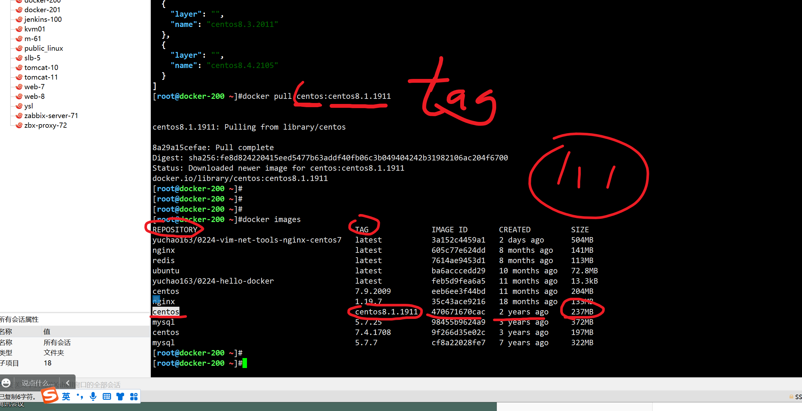


# ----前面是docker的完整管理命令-----


## 关于容器

```
1. 知道为什么要学，要用
2. 容器生命周期管理  ，   仓库下载镜像，基于镜像运行容器，  你的程序都在容器里跑着。
3. 容器记录也可以再提交为镜像，自定义镜像玩法。

属于先学会，docker命令怎么用


用docker解决具体部署问题。。
1. 跟程序有关的，如何访问到你的程序？

2. 以及你程序产生的数据， 如何提取出来？如何持久化？保存？？

从容器空间内拿出来。。


```


# ---1.容器端口映射----

```
我们使用容器，不单是运行单机程序，当然是需要运行网络服务在容器中，那么如何配置docker的容器网络，基础网络配置，网桥配置，端口映射，还是很重要。

这里的学习思路，是先学习基本的容器网络操作命令

后面环节深入学习docker网络配置。

容器里运行web服务，是基本需求，想要让外部访问容器内应用，可以通过参数

-p  port:port
-P  随机port:port

宿主机：容器
```


# ---2.配置docker数据目录管理----


## 如何提取容器内日志

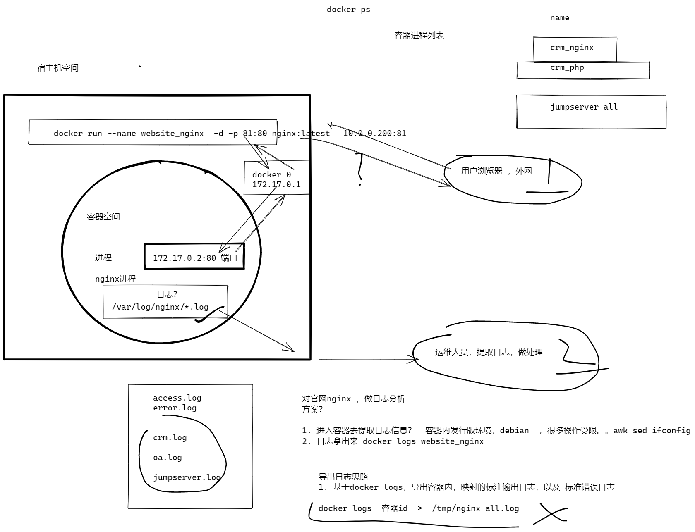


## 如何提取容器所有的日志

```
1. 查看容器的日志输出到哪
[root@docker-200 ~]#docker inspect website_nginx |grep -i log


2. 默认容器日志，是以json格式，保存docker的数据目录下
linux一切接文件，你docker内产生的数据，都在 这个主目录下，看懂 22222

/var/lib/docker/containers/


3.提取容器内所有的日志，拿到本地  ，docker cp命令
# 能直接拿到容器内的资料，到宿主机来（超级方便）
# docker run mysql
# docker cp my.cnf ./


[root@docker-200 /all-nginx-log]#docker cp  website_nginx:/var/log/nginx/*   ./
Error: No such container:path: website_nginx:/var/log/nginx/*
[root@docker-200 /all-nginx-log]#
[root@docker-200 /all-nginx-log]#
[root@docker-200 /all-nginx-log]#docker cp  website_nginx:/var/log/nginx/  ./
[root@docker-200 /all-nginx-log]#
[root@docker-200 /all-nginx-log]#
[root@docker-200 /all-nginx-log]#ls
nginx
[root@docker-200 /all-nginx-log]#ls nginx/
access.log  error.log  test1.log
[root@docker-200 /all-nginx-log]#ls nginx/ -l
total 4
lrwxrwxrwx 1 root root 11 Dec 30  2021 access.log -> /dev/stdout
lrwxrwxrwx 1 root root 11 Dec 30  2021 error.log -> /dev/stderr
-rw-r--r-- 1 root root 36 Sep  1 21:15 test1.log
[root@docker-200 /all-nginx-log]#cat nginx/access.log 


^C
[root@docker-200 /all-nginx-log]#
[root@docker-200 /all-nginx-log]#
[root@docker-200 /all-nginx-log]#cat^C
[root@docker-200 /all-nginx-log]#cd nginx/
[root@docker-200 /all-nginx-log/nginx]#
[root@docker-200 /all-nginx-log/nginx]#
[root@docker-200 /all-nginx-log/nginx]#ls
access.log  error.log  test1.log
[root@docker-200 /all-nginx-log/nginx]#cat test1.log 
111
111
111
111
111
111
111
111
111
[root@docker-200 /all-nginx-log/nginx]## 常见做法是，将容器内的xx目录，和宿主机的xx目录，直接做映射关系，好比挂在一样 mount
[root@docker-200 /all-nginx-log/nginx]#
[root@docker-200 /all-nginx-log/nginx]#
[root@docker-200 /all-nginx-log/nginx]## 直接将 容器内的 /var/log/nginx/    /all-nginx-log/nginx/  # 看懂111
[root@docker-200 /all-nginx-log/nginx]#
[root@docker-200 /all-nginx-log/nginx]#


```


我们使用docker容器，也需要关注容器内的存储

Data Volumes是一个可供一个或多个容器使用的特殊目录

- 数据卷可以在容器内共享和重用
- 数据卷的修改会立即生效
- 数据卷的更新，不回影响镜像
- 数据卷会一直存在，即使容器被删除

数据卷的用法类似于Linux的mount挂载操作

**镜像中被指定为挂载点的目录**

其中文件会被隐藏，显示挂载的数据卷。


### 1.先看不用数据卷的玩法

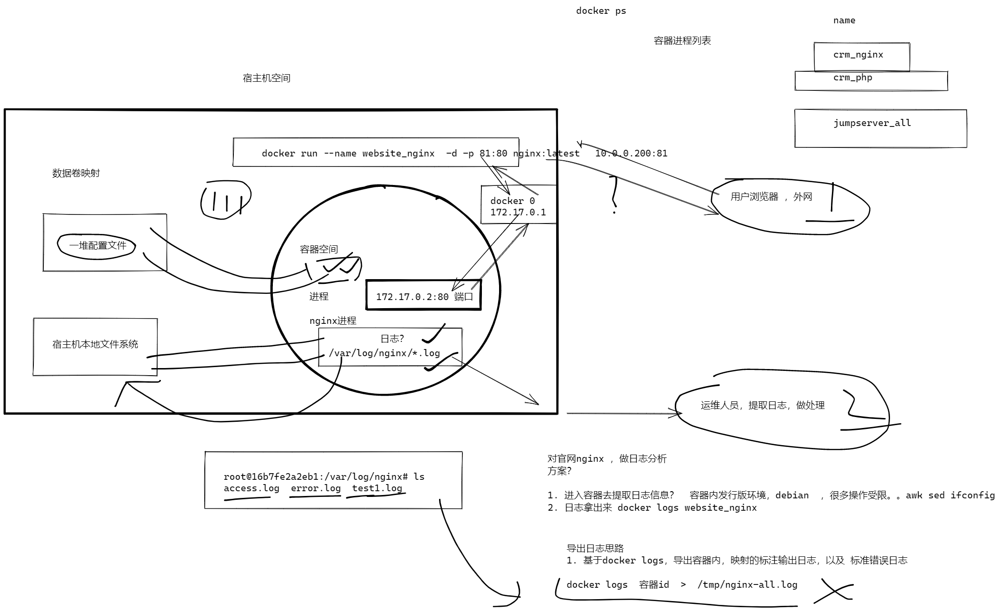


```
需求是，要部署一个 小鸟飞飞的游戏代码，如何部署到容器里


nginx静态网址，源码，再宿主机上

# 思路？

0. 启动一个nginx容器
[root@docker-200 /xiaoniao]#docker run -d nginx:1.19.7  
f7484648a48cb99f66f65cf0c4779ba99111ec653e9301e67f73f6f8d0491097
[root@docker-200 /xiaoniao]#


1.准备好如下部署的物料
[root@docker-200 /xiaoniao]#
[root@docker-200 /xiaoniao]#tree
.
├── conf
│?? └── xiaoniao.conf
└── statis-file
    ├── 2000.png
    ├── 21.js
    ├── icon.png
    ├── img
    │?? ├── bg1.jpg
    │?? ├── bg2.jpg
    │?? ├── number1.png
    │?? ├── number2.png
    │?? ├── s1.png
    │?? └── s2.png
    ├── index.html
    ├── sound1.mp3
    └── xiaoniaofeifei.zip

3 directories, 13 files

[root@docker-200 /xiaoniao]#cat conf/xiaoniao.conf 
server {
listen 81;
server_name localhost;
    root /xiaoniao;
    index index.html;
}


2. 源码拷贝到运行中的容器里
# 目标地conf地址
/etc/nginx/conf.d/

[root@docker-200 /xiaoniao]#docker cp conf/xiaoniao.conf   f7484648a48c:/etc/nginx/conf.d/
[root@docker-200 /xiaoniao]#
[root@docker-200 /xiaoniao]#
[root@docker-200 /xiaoniao]#docker exec f74 ls /etc/nginx/conf.d
default.conf
xiaoniao.conf


# 目标静态资源地址 ，以配置文件来的 容器内的/xiaoniao

[root@docker-200 /xiaoniao]#docker exec f74 ls /xiaoniao
2000.png
21.js
icon.png
img
index.html
sound1.mp3
xiaoniaofeifei.zip
[root@docker-200 /xiaoniao]## 看懂 conf，静态资源，都放入容器了 ，刷111
[root@docker-200 /xiaoniao]#docker cp xiaoniao/  f7484648a48c:/


3. 重启nginx
# 进入到容器内，尝试重启程序
root@f7484648a48c:/etc/nginx/conf.d# nginx -s reload

# 可以重启容器
docker restart f74

# 但是宿主机访问不了


4.此时，该容器，默认是没有expose放开81端口的，没法用

5. 提交新镜像
[root@docker-200 /xiaoniao]#docker ps
CONTAINER ID   IMAGE          COMMAND                  CREATED          STATUS         PORTS     NAMES
f7484648a48c   nginx:1.19.7   "/docker-entrypoint.…"   13 minutes ago   Up 3 minutes   80/tcp    wizardly_colden
[root@docker-200 /xiaoniao]#
[root@docker-200 /xiaoniao]#
[root@docker-200 /xiaoniao]## 该容器，是不是支持了 81端口的小鸟飞飞的功能
[root@docker-200 /xiaoniao]#
[root@docker-200 /xiaoniao]## 提交为镜像

6.提交为镜像tar包
提交容器记录，为镜像，的命令？

[root@docker-200 /xiaoniao]#docker commit f7484648a48c  xiaoniao-81
sha256:4ad7fab135fbe6abcbbef8dfb30e5de83b000d6eafa1d328e7647924a550b63c
[root@docker-200 /xiaoniao]#
[root@docker-200 /xiaoniao]#
[root@docker-200 /xiaoniao]#docker images
REPOSITORY                                   TAG              IMAGE ID       CREATED              SIZE
xiaoniao-81                                  latest           4ad7fab135fb   4 seconds ago        133MB


7.运行新容器，使用新代码环境
[root@docker-200 /xiaoniao]#docker run -d -p 81:81 xiaoniao-81
5c4764949d485b89994b620e30d95f26a4f73dfdb1a02c240057c025415e1f28
[root@docker-200 /xiaoniao]#
[root@docker-200 /xiaoniao]#
[root@docker-200 /xiaoniao]#docker ps
CONTAINER ID   IMAGE          COMMAND                  CREATED          STATUS         PORTS                                       NAMES
5c4764949d48   xiaoniao-81    "/docker-entrypoint.…"   2 seconds ago    Up 1 second    80/tcp, 0.0.0.0:81->81/tcp, :::81->81/tcp   dazzling_cohen
f7484648a48c   nginx:1.19.7   "/docker-entrypoint.…"   16 minutes ago   Up 6 minutes   80/tcp                                      wizardly_colden
[root@docker-200 /xiaoniao]#
[root@docker-200 /xiaoniao]#


8.代码更新了，如何更新网站
[root@docker-200 /xiaoniao]#grep 文杰 xiaoniao/index.html 
        <title>文杰飞飞飞</title>
[root@docker-200 /xiaoniao]#


[root@docker-200 /xiaoniao]#docker cp xiaoniao/  5c4764949d48:/
[root@docker-200 /xiaoniao]#


9.然后呢？
[root@docker-200 /xiaoniao]#docker cp xiaoniao/  5c4764949d48:/
[root@docker-200 /xiaoniao]#
[root@docker-200 /xiaoniao]#
[root@docker-200 /xiaoniao]#docker restart 5c4
5c4
[root@docker-200 /xiaoniao]## 静态资源，无需重启容器，动态资源，得重启容器，


```

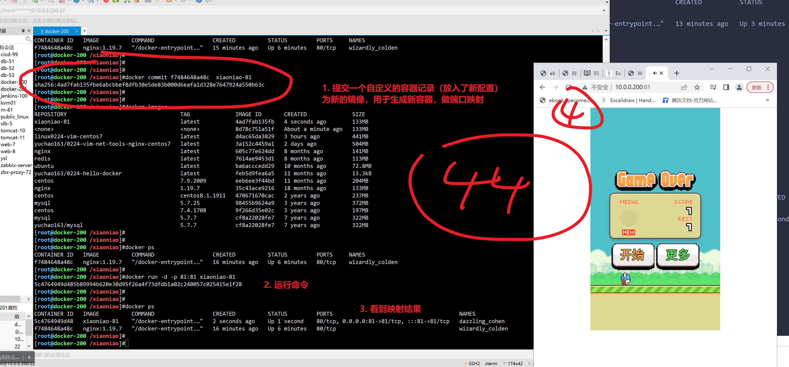


### 2.数据卷映射，和端口映射概念一样


# 3.容器多目录映射

从零新发布新容器


```
资源如下

- 配置文件
[root@docker-200 /xiaoniao-all]#tree
.
├── conf.d
│   └── xiaoniao.conf
├── logs
└── xiaoniao
    ├── 2000.png
    ├── 21.js
    ├── icon.png
    ├── img
    │   ├── bg1.jpg
    │   ├── bg2.jpg
    │   ├── number1.png
    │   ├── number2.png
    │   ├── s1.png
    │   └── s2.png
    ├── index.html
    ├── sound1.mp3
    └── xiaoniaofeifei.zip

4 directories, 13 files


- 运行环境是？（可运行nginx  1.15.11 的镜像，）


1. 代码直接用宿主机上的源码，不用再反复 docker cp了
# 一条命令就ok了

# -v 宿主机目录:容器内的目录 

docker run -d  -p 81:81  -p  80:80   \
-v /xiaoniao-all/conf.d/:/etc/nginx/conf.d/ \
-v /xiaoniao-all/xiaoniao/:/xiaoniao/ \
-v /xiaoniao-all/logs/:/var/log/nginx/ \
nginx:1.15.11


2. 容器内的运行日志，也都拿出来
容器内的日志写入
/xiaoniao-all/logs/


3.结果检查

- 更新配置
[root@docker-200 /xiaoniao-all/conf.d]#ls
xiaoniao.conf
[root@docker-200 /xiaoniao-all/conf.d]#vim xiaoniao.conf 
[root@docker-200 /xiaoniao-all/conf.d]#docker ps
CONTAINER ID   IMAGE           COMMAND                  CREATED         STATUS         PORTS                                           NAMES
74594130d5c6   nginx:1.15.11   "nginx -g 'daemon of…"   4 minutes ago   Up 4 minutes   0.0.0.0:80-81->80-81/tcp, :::80-81->80-81/tcp   agitated_meitner
[root@docker-200 /xiaoniao-all/conf.d]#
[root@docker-200 /xiaoniao-all/conf.d]#docker restart 745
745
[root@docker-200 /xiaoniao-all/conf.d]#


- 更新网站

[root@docker-200 /xiaoniao-all]#grep 王局 xiaoniao/index.html 
<h1> 除了王局以外，我估计至少有5个浑水摸鱼，没听课的</h1>
[root@docker-200 /xiaoniao-all]#


- 网站的日志


```


## 今日所学总结

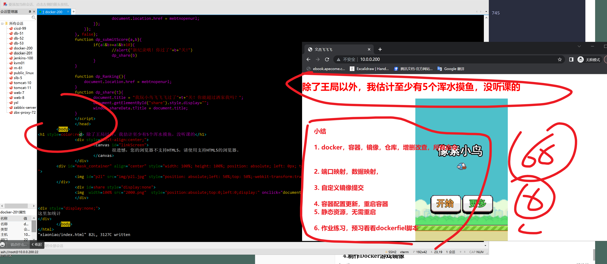


## 查看容器的数据卷


# 4.制作Docker游戏镜像

## 自定义镜像玩法

当docker hub 没有你想要的合适得镜像，就是自己制作么。

```
1. 制作nginx镜像

2. 制作python3、centos镜像


```


# 5.再制作一个私有云盘镜像

## 实践


