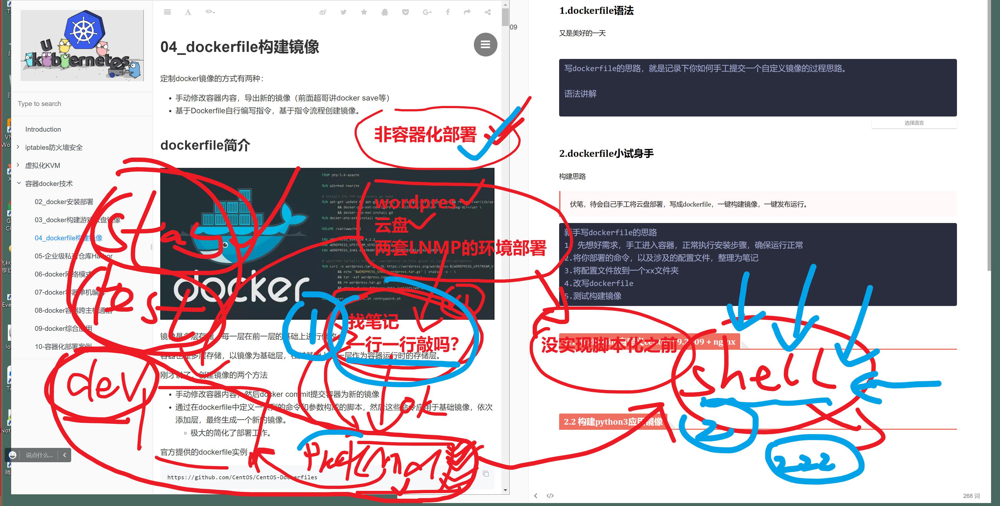
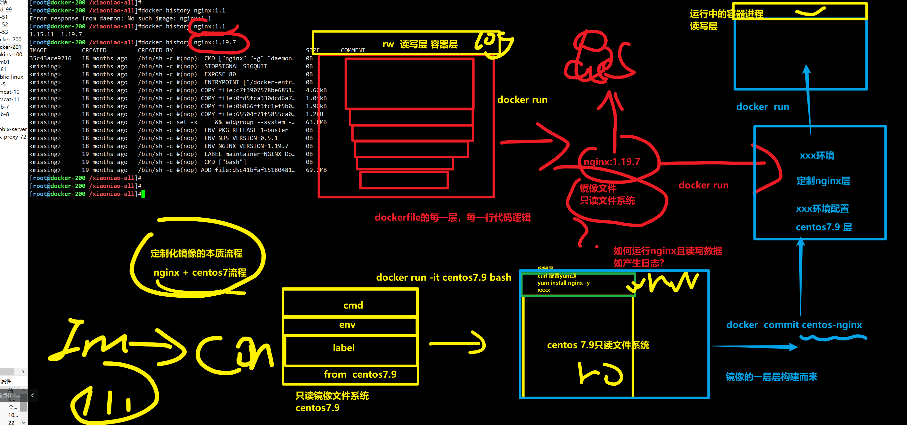
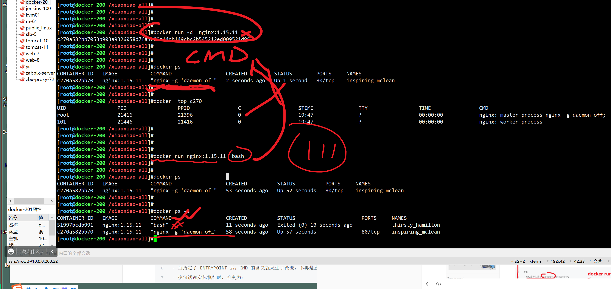

```### 此资源由 58学课资源站 收集整理 ###
	想要获取完整课件资料 请访问：58xueke.com
	百万资源 畅享学习

```


# 1.dockerfile语法

## 非容器化部署




## 容器化部署，优化思路等


### 宿主机nginx，转发流量给多个容器

```
1. 宿主机的nginx，提供多域名的虚拟主机匹配，将请求，转发给后端节点

# 后端单节点的部署
# 反向代理，升级到负载均衡

upstream wordpress_pool{
	# 超快速，实现业务的，弹性扩缩容，看懂1111
	server  http://172.17.0.2:80; # 容器1
	server 	http://172.17.0.3:80; # 容器2
	# server 	http://172.17.0.4:80  # 容器3 业务流量加大了，后端节点多一点
	# server 	http://172.17.0.5:80  # 容器4 业务流量加大了，后端节点多一点
	# server 	http://172.17.0.6:80  # 容器5 业务流量加大了，后端节点多一点
}
server{
listen 80;
server_name wordpress.linux0224.com;

    location / {
	proxy_pass http://wordpress_pool;
	# 转发请求头的参数，保留客户端的原始请求信息
    }

}

# 同上，业务发布过程

server{
listen 80;
server_name yunpan.linux0224.com;

    location / {
	proxy_pass http://172.17.0.3:8444;
	# 转发请求头的参数，保留客户端的原始请求信息
    }

}
```


### 纯容器化的部署过程

```perl
nginx

应用
都是基于容器去跑的

阿里云服务器， 公网ip  123.206.16.61


入口
↓
都是docker0网段的局域网ip （172.17.0.1）


介入层是谁？nginx  ，容器 nginx_lb       172.17.0.2

# 反向代理，升级到负载均衡

upstream wordpress_pool{
	# 超快速，实现业务的，弹性扩缩容，看懂1111
	server  http://172.17.0.3:80; # 容器1
	server 	http://172.17.0.4:80; # 容器2
	# server 	http://172.17.0.4:80  # 容器3 业务流量加大了，后端节点多一点
	# server 	http://172.17.0.5:80  # 容器4 业务流量加大了，后端节点多一点
	# server 	http://172.17.0.6:80  # 容器5 业务流量加大了，后端节点多一点
}

server{
listen 80;
server_name wordpress.linux0224.com;

    location / {
	proxy_pass http://wordpress_pool;
	# 转发请求头的参数，保留客户端的原始请求信息
    }

}


↓


后端节点的其他容器    ，一组后端wordpress节点
wordpres_asxasx  172.17.0.3
wordpres_Asdasdasd  172.17.0.4
wordpres_qweqweqwe  172.17.0.5
wordpres_werwerewr  172.17.0.6

```


## 容器化部署nginx和后端的方式


# 开始dockerfile学习

带着疑问，为什么要写dockerfile ？

```
伏笔，要讲昨天部署的云盘笔记，改造为dockerfile构建 云盘镜像

换一个主机，docker主机，再创建云盘运行环境
笔记      纯linux命令  ，shell脚本，
再跑一边，进入docker容器内，自定制的操作，写成脚本dockerfile 


```


你的镜像从哪来的？


```
wordpress镜像？
docker pull wordpress  # 制作一个wordpress ，docker hub


云盘镜像，源代码+ 运行环境。
思路就是
1. 手工部署流程，选择发行版
2. 如定制运行环境，依赖包的安装


```


你是怎么制作wordpress镜像的？

```
wordpress镜像？
docker pull wordpress  # 制作一个wordpress ，docker hub


```


你是怎么制作nginx运行容器的？

````
docker pull nginx  # debian + nginx


# 选择更合适的 ，更熟练系统去维护

# docker最佳镜像，用ubuntu？centos？还是debian？

# 团队里的运维，大家都会一个发行版，目的要能干活，能产出 


# nginx ，以及一堆配置文件，要放入容器里去跑 centos7.9

# 要定制化的镜像都有十来个
# 一句话，dockerfile的学习，将你之前容器化手工部署操作，改造为doickerfiel脚本
# 建议操作，也是这么来


#  docker pull centgos:7.9
#  docker run -it  xxxx
#  yum install xxx
#  配置文件放进来

# 定制化镜像的过程


````


又是美好的一天


```
写dockerfile的思路，就是记录下你如何手工提交一个自定义镜像的过程思路。

语法讲解


```


# 2.dockerfile小试身手

构建思路

> 伏笔，待会自己手工将云盘部署，写成dockerfile，一键构建镜像，一键发布运行。




## 先熟悉dockerfile语法

## 看看官网的脚本语法


```
新手写dockerfile的思路
1. 先想好需求，手工进入容器，正常执行安装步骤，确保运行正常
2.将你部署的命令，以及涉及的配置文件，整理为笔记
3.将配置文件放到一个xx文件夹
4.改写dockerfile
5.测试构建镜像
```


## CMD


## 运行容器时，替换CMD




## EXPOSE参数


## ADD-COPY


再dockerfile 部署环境脚本的时候

如yum源替换的需求 切换某个目录的时候

WORKDIR   /etc/yum.respos.d/  ，不能！！！

执行配置文件替换  ，替换现有的repo，centos源，替换为阿里云源，sed命令

RUN  sed xxxxxxxxxx


## ENV

```
设置容器运行时的环境变量

```


## USER，WORKDIR


## 一些实践命令，VOLUME，CMD，ENTRYPOINT，结合dockerfile实践学习


## ----解释，写时复制（还是容器，镜像的本质关系）-----

也叫联合文件系统（更多细节理论，看博客）


## 1.根据官网的dockerfile示例，学一学如何构建镜像

遍看语法，遍看应用

### django,python web模块，部署python代码的运行环境


```
# 需求，基于dockerfile，构建 python3的运行环境，安装好的一个django模块
# 跑一个能运行django 页面的 平台，代码生成


# 思路，手工部署的逻辑
1. 基础运行系统环境，centos
2. 编译，rpm，yum  ，yum install python3 python3-devel 
3. 安装python3的模块  ，  pip3  install  django

看懂3333，下一步，转化为 dockerfile，思考如何写


```


```
基于dockerfile 构建镜像

```

### dockerfile构建结果解读


```
Removing intermediate container 3bc7e1d8dd26
 ---> 21522cdfa2d8
Step 6/7 : EXPOSE 8000
 ---> Running in 383c1c6d83a4
Removing intermediate container 383c1c6d83a4
 ---> 81aa4ffcf562
Step 7/7 : CMD [ "/bin/bash" ]
 ---> Running in 34bed0d03961
Removing intermediate container 34bed0d03961
 ---> 2064400fdf7a
Successfully built 2064400fdf7a
Successfully tagged test-django-1:latest

```


### 构建的镜像查看

```
[root@docker-200 /guanfang-dockerfile/django_centos7]#docker history test-django-1:latest 
IMAGE          CREATED          CREATED BY                                      SIZE      COMMENT
2064400fdf7a   4 minutes ago    /bin/sh -c #(nop)  CMD ["/bin/bash"]            0B        
81aa4ffcf562   4 minutes ago    /bin/sh -c #(nop)  EXPOSE 8000                  0B        
21522cdfa2d8   4 minutes ago    /bin/sh -c yum -y install python-pip python-…   98.8MB    
fc93086f2485   4 minutes ago    /bin/sh -c yum -y install epel-release          182MB     
5808863f13d5   4 minutes ago    /bin/sh -c yum -y update; yum clean all         160MB     
4d1e3d809848   38 minutes ago   /bin/sh -c #(nop)  MAINTAINER The CentOS Pro…   0B        
eeb6ee3f44bd   11 months ago    /bin/sh -c #(nop)  CMD ["/bin/bash"]            0B        
<missing>      11 months ago    /bin/sh -c #(nop)  LABEL org.label-schema.sc…   0B        
<missing>      11 months ago    /bin/sh -c #(nop) ADD file:b3ebbe8bd304723d4…   204MB     
[root@docker-200 /guanfang-dockerfile/django_centos7]#
[root@docker-200 /guanfang-dockerfile/django_centos7]#

```

### 如何用这个构建好的django镜像

```python
1.官网给这个镜像环境，提供了 git，你可以去下载源码，  提供 Python-django
你可以用django命令去创建 web源码环境


2. 官网给的这个python镜像，只是个环境，需要你自己去创建python网站代码，再提交去使用，维护

# 开发一个django平台代码流程如下

[root@ab4946068db5 opt]# django-admin startproject myblog


# 开发一个欢迎页面
[root@ab4946068db5 myblog]# cd /opt/myblog

[root@ab4946068db5 ~]# vi /opt/myblog/myblog/urls.py
from django.conf.urls import url
from django.contrib import admin


from django.http import HttpResponse
import datetime

def hello_0224(request):
    now = datetime.datetime.now()
    html = "<html><body>It is now %s.  welcome  linux 0224  ~~~~</body></html>" % now
    return HttpResponse(html)


urlpatterns = [
    url(r'^admin/', admin.site.urls),
    url(r'hello_0224',hello_0224)
]
          


# 修改django配置文件，允许所有地址访问
[root@ab4946068db5 myblog]# vi /opt/myblog/myblog/settings.py 

     28 ALLOWED_HOSTS = ['*']


# 尝试启动页面
[root@ab4946068db5 ~]# python /opt/myblog/manage.py runserver 0.0.0.0:8000


#  至此，代码放入了该镜像里
#并且，可以正确启动项目了

# 定制一个镜像，直接docker run 运行，且端口映射，再windows中可以访问到这个系统


# 1.提交这个容器
[root@docker-200 /my-django]#docker commit ab4 welcome-linux-python  
sha256:21c7812027556210e230d76052ff75744f1673232696d5454a0a57b0b39d877e
[root@docker-200 /my-django]#

# 2.开发启动脚本
[root@docker-200 /my-django]#cat start-django.sh 
python /opt/myblog/manage.py runserver 0.0.0.0:8000
[root@docker-200 /my-django]#


# 3.基于镜像，创建容器实例，运行这个代码程序
# - 不用脚本启
docker run -d  -p 8000:8000  welcome-linux-python python /opt/myblog/manage.py runserver 0.0.0.0:8000

        
        
        
# - 用脚本启该怎么办(容器里没这个脚本)

# 想办法，脚本放入容器
#  -v 更省事

docker run -d -v /my-django/:/my_django   -p 8000:8000 welcome-linux-python bash /my_django/start-django.sh

    
    
# （定制化写入到镜像里）


```


### 运行自定义的镜像，启动django网站（原理流程分析）

```
http://10.0.0.200:8000/hello_0224  自己开发的一个路由


创建django的后台账户密码
再多学几个容器内的python命令操作

# 数据表生成，为的admin后台页面的数据生成
[root@026ce6466ac9 myblog]# python manage.py makemigrations
No changes detected


# 数据迁移，写入到sqllit数据库
[root@026ce6466ac9 myblog]# python manage.py migrate     

# 此时可以创建用户（记录到数据表里）
[root@026ce6466ac9 myblog]# python ./manage.py createsuperuser
Username (leave blank to use 'root'): chaoge
Email address: yc_uuu@163.com
Password: 
Password (again): 
Superuser created successfully.

http://10.0.0.200:8000/hello_0224  自己开发的一个路由

http://10.0.0.200:8000/admin


```


# ----下午开始-----

```
上午的python镜像使用逻辑还可以改进。
代码，脚本，都不应该放入容器。
（代码写死放入再了镜像里）
都基于数据映射维护。

镜像应该是无状态的！
镜像，只提供一个运行环境（为何官方给你的dockerfile只有环境）


=====================
有状态的应也应该做好数据卷功能


# 镜像作用


```

## 镜像只提供程序运行环境，代码，配置等，有状态的文件，放在外面


```
1.准备一个纯净的python运行环境即可
[root@docker-200 ~]#docker images test-django-1
REPOSITORY      TAG       IMAGE ID       CREATED       SIZE
test-django-1   latest    2064400fdf7a   3 hours ago   645MB
[root@docker-200 ~]#


2.准备好数据物料，配置文件，脚本，源码等

- 把源码数据拿出来
[root@docker-200 ~]#docker cp 026ce6466ac9:/opt/myblog  /opt/
[root@docker-200 ~]#ls /opt/myblog/
db.sqlite3  manage.py  myblog


- 启动脚本
[root@docker-200 ~]#ls /opt/myblog/
db.sqlite3  manage.py  myblog  start-django.sh
[root@docker-200 ~]#

# 脚本如下
[root@docker-200 /opt/myblog]#cat start-django.sh 
cd /opt/myblog/
python  ./manage.py  runserver 0.0.0.0:8000 


3.优化启动方式，数据映射，将物料放入容器运行，更合适的


[root@docker-200 /opt/myblog]#docker run -d  -p 8000:8000 -v /opt/myblog:/opt/myblog    test-django-1 bash /opt/myblog/start-django.sh
856694d08b4ac23429237800a4285ada06b12e9aad3155ca77fbe96765736ef9
[root@docker-200 /opt/myblog]#
[root@docker-200 /opt/myblog]#

4. 后续，对该网站的更新，只需要随意源码数据即可，

- 修改源码
- 重启容器


```


3.40继续

 


## 无状态的容器是指？

```
容器运行后，容器内产生的数据，不重要，随意，删除，创建新的容器

# 11111


哪些软件是这样的特性？容器跑了你需要的程序
nginx 最大无状态的app


nginx:1.15.1 镜像 ，转发流量 代理软件，日志  

docker run nginx:1.15.1
随意创建，删除


docker run nginx:1.15.1
docker run nginx:1.15.1
docker run nginx:1.15.1


# 再写无状态应用类的容器部署，写dockerfile一般就是

FROM centos
LABEL 

ENV
RUN 

CMD  


```


## 有状态的容器该如何运行

```
VOLUME 关键字  ，将容器内的数据，持久化放入到宿主机

上午的python镜像使用逻辑还可以改进。
代码，脚本，都不应该放入容器。
（代码写死放入再了镜像里）
都基于数据映射维护。

镜像应该是无状态的！
镜像，只提供一个运行环境（为何官方给你的dockerfile只有环境）


=====================
有状态的应也应该做好数据卷功能


# 镜像作用


```


### worepress, dockerfile


- 镜像应该是只提供运行环境，源码数据都从外部映射

```

```


- 源码数据直接打包到镜像里，以镜像作为交付标准

```
wordpress给的方案，是这个

部署操作如下
# 当前目录下，找到Dockerfile 去构建
# 会使用构建的历史缓存记录

[root@docker-200 /centos7]#docker build -t my-wordpress .


# 再生产下，不需要环境要下载最新的一些数据
[root@docker-200 /centos7]#docker build --no-cache -t my-wordpress .


# 如何用
[root@docker-200 /centos7]#docker run  -P my-wordpress
No DB_ENV_MYSQL_USER variable. Please link to database using alias 'db'.

# 因为wordpress，需要读取数据库，才是合理运行

# 解决办法如下


#1. 先启动mysql容器
# 看懂 1111

- 基于官网给的Dockerfile案例，部署mariadb环境，构建镜像
- 注意要给 RUN chmod +x ./fix-permissions.sh 给个权限
- 发现又猜了个坑，docker-entrypoint.sh
- 数据库持久化方案 （docker run -v /var/lib/mysql/:/var/lib/mysql/    ，dockerfile的 VOLUME 制定/var/lib/mysql/）
- 又发现需要引入数据库环境变量（docker run -e 传入   ENV指令传入  ）
- 修改Dockerfile，写入 变量
ENV MYSQL_ROOT_PASSWORD='linux0224'
网络原因，先用-e参数参数的方式

- --link参数，去主动和一个容器建立链接，将对方ip，主机名写入自己的/etc/hosts

bash-4.2$ mysql -uroot -plinux0224 -h my-mariadb-server  -e "show databases;"
+--------------------+
| Database           |
+--------------------+
| information_schema |
| mysql              |
| performance_schema |
+--------------------+
bash-4.2$ 
bash-4.2$ 
bash-4.2$ # 看懂1111
bash-4.2$ 


# 至此证明mariadb容器是运行了

# 启动wordpres，发现官网给的dockerfile，php版本，和wordpress对不上
# 修改Dockerfile，修改镜像

# 构建一个lnp环境，wordpress源码放外面。
# 去掉Dockerfile如下部署内容
# 
ADD scripts /scripts
RUN curl -LO http://wordpress.org/latest.tar.gz                         &&\
    tar xvzf /latest.tar.gz -C /var/www/html --strip-components=1       &&\
    rm /latest.tar.gz                                                   &&\
    chown -R apache:apache /var/www/                                    &&\
    chmod 755 /scripts/*


# 重新构建
[root@docker-200 /centos7]#docker build -t v1-wordpress .

# 准备wordpress低版本源码
wget https://wordpress.org/wordpress-5.1.14.zip
unzip wordpress-5.1.14.zip

# 注意目录映射
useradd -u 48 apache
chown -R apache.apache ./*

# 你们公司的php开发，会告诉你，这套源码需要什么php版本，你就去装这个版本
# 不会像限制这样，没人告诉你，自己乱尝试
# 升级php版本

#   DB_ENV_MYSQL_USER    
#  DB_ENV_MYSQL_PASSWORD
#   DB_ENV_MYSQL_DATABASE 

# 启动wordpress时，传入这3变量
# DB_HOST
docker run -d --link my-mariadb-server \
-e DB_ENV_MYSQL_USER='root' \
-e DB_ENV_MYSQL_PASSWORD='linux0224' \
-e DB_ENV_MYSQL_DATABASE='wordpress' \
-e DB_HOST='my-mariadb-server' \
-p 80:80 -v /centos7/other-wordpress/wordpress:/var/www/html  v1-wordpress


# 报错思路，wordpress，不知道如何链接mysql
# 修改wp-config 的文件，或者启动wordpress容器，多传入几个 mysql的链接变量即可


休息
wordpress，如何链接mariadb。


docker run -d  -e MYSQL_ROOT_PASSWORD='linux0224'  -p 3306:3306 my-mariadb


[root@docker-200 /mariadb-docker/centos7]#docker build -t my-mariadb  .
- 修改Dockerfile，重新构建

============================================================
# 最终Dockerfile如下


- 启动mariadb容器，需要注意，你宿主机是否需要用这个mysql端口，-p 
- wordpress容器去链接 mysql容器


```


```
1. 制定基础镜像

```


## 2.1 dockerfile自定义centos7.9.2009 + nginx


## 2.2 构建python3应用镜像


# 3.Dockerfile分段构建优化（面试背）


# 5.构建tomcat镜像（多阶段构建）

## 5.1 构建基础镜像centos7


## 5.2 构建jdk基础镜像


## 5.3 构建tomcat镜像


## 5.4 构建业务镜像


## 5.5 数据库配置

```
1. 宿主机部署
2. 容器内部署
```


