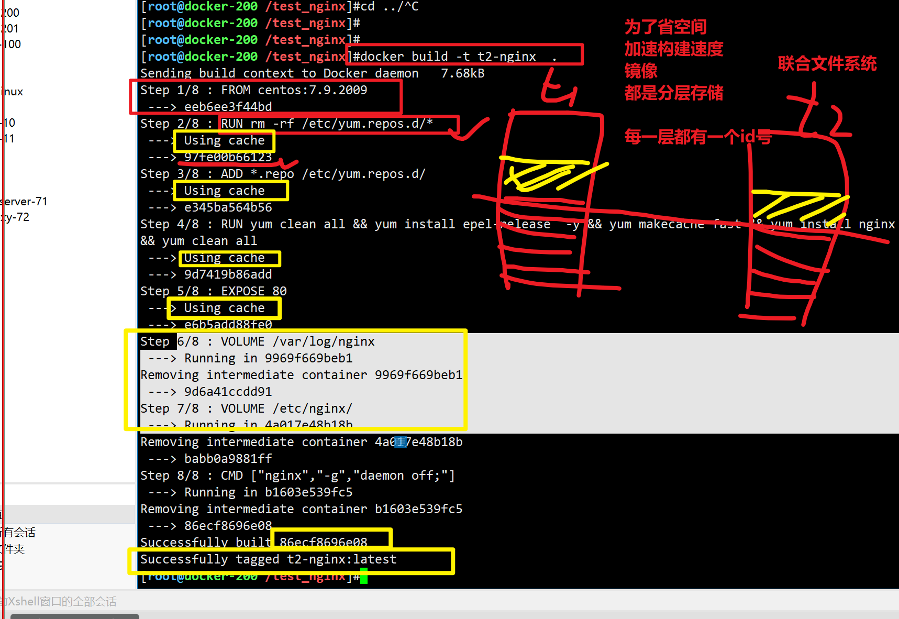
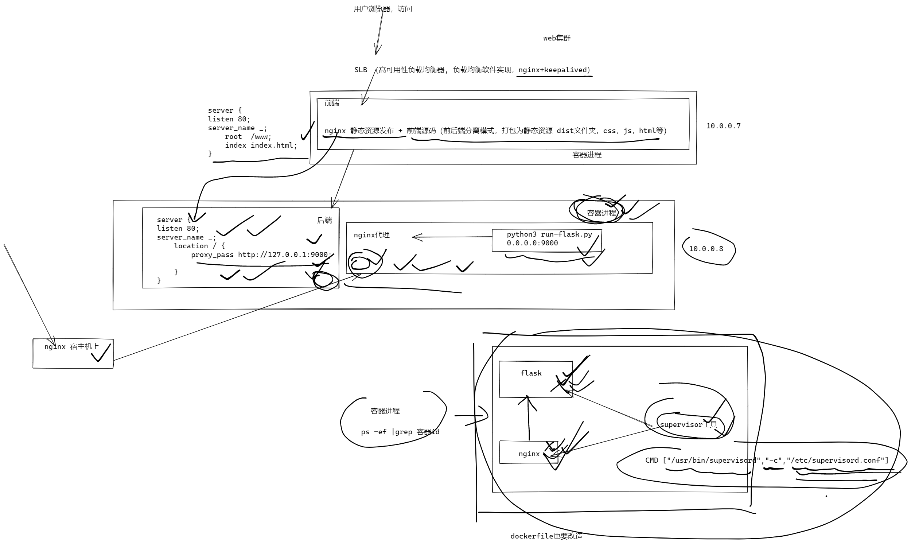
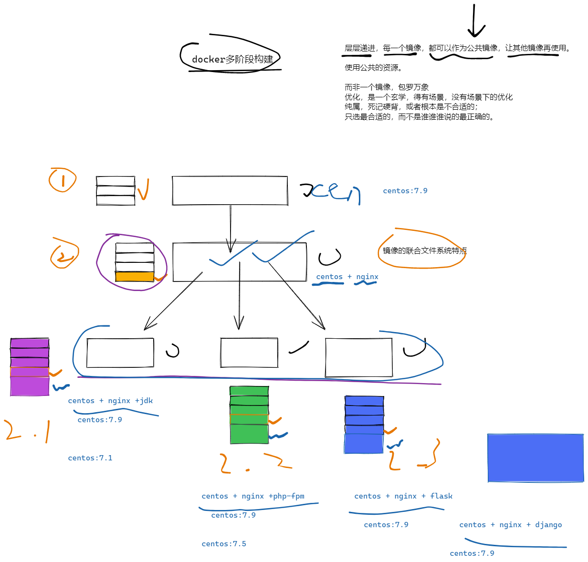

```### 此资源由 58学课资源站 收集整理 ###
	想要获取完整课件资料 请访问：58xueke.com
	百万资源 畅享学习

```
# 今日任务

```
1.回顾dockerfile构建镜像流程，关键字volume，entrypoiont，cmd，expose的作用。

2. 构建nginx+centos镜像

3. 构建python3镜像

4. 学习supervisor进程管理工具

5. dockerfile多阶段构建java容器

6. harbor 部署

7.容器化部署应用案例


```

# dockerlfile重点参数

## volume

```
volume定义匿名数据卷，在启动容器时忘记挂载数据卷，会自动挂载到匿名卷。
无状态容器，为了有状态应用部署/var/lib/mysql/

作用：
避免重要的数据，因容器重启而丢失，这是非常致命的。

避免容器不断变大，产生大量的数据，容器最终可以提供为镜像。


也可以-v参数，主动修改

-v 宿主机:容器:权限,权限2


```

准备一个dockerfile ，填入volumu参数

### centos+nginx 的dockerfile练习这些参数

- 配置文件
- dockerfile本身


## 镜像1，没有volume的玩法

```perl
1. 准备好部署nginx所需的配置文件，如 yum源的设置，如nginx.conf


curl -o ./centos-163.repo https://mirrors.163.com/.help/CentOS7-Base-163.repo


2. 准备Dockerfile
# 和Dockerfile同级的配置文件，ADD添加到容器内
# 
FROM centos:7.9.2009
RUN rm -rf /etc/yum.repos.d/*
ADD *.repo /etc/yum.repos.d/
RUN yum clean all && yum install epel-release -y  && yum makecache fast \
&& yum install nginx -y \
&& yum clean all
EXPOSE 80
CMD ["nginx","-g","daemon off;"]

# 检查构建的nginx+centos镜像
[root@docker-200 /test_nginx]#docker build -t t1-nginx .


# 查看该容器，的存储卷是否有
# 有卷的话，表示容器内某个目录下的数据，会被映射放入到宿主机的xx目录下
# 保证，容器的无状态化，容器可以随意删除，数据都被保留再外了


[root@docker-200 /test_nginx]#docker inspect 88f |grep -i volumes -A 5
\            "VolumesFrom": null,
            "CapAdd": null,
            "CapDrop": null,
            "CgroupnsMode": "host",
            "Dns": [],
            "DnsOptions": [],
--
            "Volumes": null,
            "WorkingDir": "",
            "Entrypoint": null,
            "OnBuild": null,
            "Labels": {
                "org.label-schema.build-date": "20201113",


# 这种没有volume参数的镜像，必须手动制定-v才能实现数据外挂


[root@docker-200 /test_nginx]#docker inspect 88f |grep -iE 'volumes|mounts'
            "VolumesFrom": null,
        "Mounts": [],
            "Volumes": null,

#  该方式，数据都在容器里出不来了
#  想办法，进入到容器内，如给容器内再安装xx程序，把日志都读出来，写入到外部的程序里


# 运行容器，添加数据卷挂在参数 -v
[root@docker-200 /test_nginx]#docker run -d -P -v /test_nginx/logs/:/var/log/nginx/   t1-nginx


# 查看该容器的，外部数据挂在信息
[root@docker-200 /test_nginx]#docker inspect 7e6 | jq


    "Mounts": [
      {
        "Type": "bind",
        "Source": "/test_nginx/logs",
        "Destination": "/var/logs/nginx",
        "Mode": "",
        "RW": true,
        "Propagation": "rprivate"
      }
    ],


```


## 给镜像，加上存储卷，防止运行时，忘记-v挂载参数

```perl
[root@docker-200 /test_nginx]#cat Dockerfile 
FROM centos:7.9.2009
RUN rm -rf /etc/yum.repos.d/*
ADD *.repo /etc/yum.repos.d/
RUN yum clean all && yum install epel-release  -y && yum makecache fast \
&& yum install nginx -y \
&& yum clean all
EXPOSE 80

VOLUME /var/log/nginx
VOLUME /etc/nginx/
CMD ["nginx","-g","daemon off;"]
[root@docker-200 /test_nginx]#


[root@docker-200 /test_nginx]#docker build -t t2-nginx  .

# 查看容器内的卷的信息，自动挂在到宿主机的匿名目录下，docker数据目录下的，一个volume的目录中，统一管理
# 显示，容器内的卷的目录，和宿主机的一个文件夹 ，做的映射关系
 "Mounts": [
      {
        "Type": "volume",
        "Name": "fae458defb793499764a6f5081ce7a675e08b6ffcb0bd1b8ecd1b5fb757f06dc",
        "Source": "/var/lib/docker/volumes/fae458defb793499764a6f5081ce7a675e08b6ffcb0bd1b8ecd1b5fb757f06dc/_data",
        "Destination": "/etc/nginx",
        "Driver": "local",
        "Mode": "",
        "RW": true,
        "Propagation": ""
      },
      {
        "Type": "volume",
        "Name": "b9dc8bd83c425904c7930a40ea76f4a027bfeb3e14c9b28c1fabaa10c82a2040",
        "Source": "/var/lib/docker/volumes/b9dc8bd83c425904c7930a40ea76f4a027bfeb3e14c9b28c1fabaa10c82a2040/_data",
        "Destination": "/var/log/nginx",
        "Driver": "local",
        "Mode": "",
        "RW": true,
        "Propagation": ""
      }
    ],

# 显示容器的卷的信息
 "VolumesFrom": null,
                "Source": "/var/lib/docker/volumes/fae458defb793499764a6f5081ce7a675e08b6ffcb0bd1b8ecd1b5fb757f06dc/_data",
                "Source": "/var/lib/docker/volumes/b9dc8bd83c425904c7930a40ea76f4a027bfeb3e14c9b28c1fabaa10c82a2040/_data",


# 显示有哪些卷
 "Volumes": {
                "/etc/nginx/": {},
                "/var/log/nginx": {}

# 先进入卷，对应的挂在目录看看
[root@docker-200 /var/lib/docker/volumes]#ls


# 清理，没有容器再用的，废物卷
#清理了30M
[root@docker-200 /var/lib/docker/volumes]#docker volume prune 

#剩下2个，nginx容器正在用的卷
[root@docker-200 /var/lib/docker/volumes]#docker volume ls
DRIVER    VOLUME NAME
local     b9dc8bd83c425904c7930a40ea76f4a027bfeb3e14c9b28c1fabaa10c82a2040
local     fae458defb793499764a6f5081ce7a675e08b6ffcb0bd1b8ecd1b5fb757f06dc


# 当你主动再用-v参数，是如何？
[root@docker-200 /test_nginx/html]#docker ps
CONTAINER ID   IMAGE      COMMAND                  CREATED          STATUS          PORTS                                     NAMES
347c3f44351d   t2-nginx   "nginx -g 'daemon of…"   6 seconds ago    Up 5 seconds    0.0.0.0:49156->80/tcp, :::49156->80/tcp   laughing_kapitsa


# 查看容器的卷的信息，和-v 绑定挂在的信息
[root@docker-200 /var/lib/docker/volumes]#docker inspect 347 | jq

# 明确，nginx内的 html静态资源目录，以ro模式挂在，是无法读写的

# 配置文件，日志文件，都是可读写的卷的映射


# 如果要改为，读写的html静态资源该如何？
# nginx容器
是有状态（容器内产生的数据，需要被保留）

还是无状态(容器内的数据，随便丢)的？


只需要重建一个容器就好 ，读取之前配置文件，日志，html


#  改配置文件
[root@docker-200 /var/lib/docker/volumes/d3c7e215d2d98deb27809c3d1dc0a0cc5c4538cec2b2f69422e626843e5a03ab/_data]#grep 10011 nginx.conf
        listen       10011;


# 日志，1000条
[root@docker-200 /var/lib/docker/volumes/842410bd248397ba59789a1db58ff1e3354b106ac1ab5773fcdbe5f44a8e93ca/_data]#for i in `seq 1000` ;do curl -s   127.0.0.1:49156   -o /dev/null;done
[root@docker-200 /var/lib/docker/volumes/842410bd248397ba59789a1db58ff1e3354b106ac1ab5773fcdbe5f44a8e93ca/_data]#wc -l access.log 
1016 access.log


# html也是准备好的
[root@docker-200 /test_nginx/html]#cat index.html 
<meta charset=utf8> <h1>一分耕耘一分收获，我宿主机改不了吗</h1>

看看新跑一个容器，能用这些数据吗


# 启动新的容器

docker run --name my-all-nginx -d -p 10011:10011 \
-v /var/lib/docker/volumes/842410bd248397ba59789a1db58ff1e3354b106ac1ab5773fcdbe5f44a8e93ca/_data:/var/log/nginx/  \
-v /var/lib/docker/volumes/d3c7e215d2d98deb27809c3d1dc0a0cc5c4538cec2b2f69422e626843e5a03ab/_data:/etc/nginx/ \
-v /test_nginx/html:/usr/share/nginx/html t2-nginx


```




存储卷，和-v参数的玩法


11.15 


## cmd、entrypoint关系

都是再定义`镜像`时，指定这个镜像，再`docker run`运行创建`容器`时，再容器里，`执行什么命令的`。


````
entrypoint  入口点，命令


CMD [参数1  参数2  参数3]


entrypoint  参数1  参数2  参数3


````

### cmd镜像

docker本质可以理解为golang编译的二进制命令

docker容器，当做命令去使


```
RUN apt-get update \
&& apt-get install -y curl \ 
&& rm -rf /var/lib/apt/lists/*

CMD [ "curl", "http://myip.ipip.net" ]


# 定义个镜像，运行的容器，可以当做命令去使
# 容器作用，就是获取当前机器的ip

FROM centos:7.4.1708
LABEL author: linux0224
WORKDIR /opt
ENV name='linux0224'
CMD ["curl" ,"-s","ifconfig.me"]

# http://myip.ipip.net


#docker本质所有的信息，都是提交为json了，必须是双引号


[root@docker-200 /test_curl]#docker build -t t1-curl .
[root@docker-200 /test_curl]#docker build -t t2-curl .


# 运行容器

[root@docker-200 /test_curl]#docker run t2-curl curl -s http://myip.ipip.net
当前 IP：125.33.244.31  来自于：中国 北京 北京  联通


# 将容器当命令使，用一次就结束，
[root@docker-200 /test_curl]#docker run --rm  t2-curl 

# 仅仅想加一个参数，都不行
[root@docker-200 /test_curl]#docker run --rm  t2-curl curl -s ifconfig.me -i
HTTP/1.1 200 OK
access-control-allow-origin: *
content-type: text/plain; charset=utf-8
content-length: 13
date: Mon, 05 Sep 2022 03:36:43 GMT
x-envoy-upstream-service-time: 1
strict-transport-security: max-age=2592000; includeSubDomains
server: istio-envoy
Via: 1.1 google

125.33.244.31[root@docker-200 /test_curl]#

```


### entrypoint来了

```
定义一个程序入口，命令，可以是一个脚本吗，CMD传入的东西都会被当做参数给entrypoint  cmd  


# 修改这个查询ip的容器构建
[root@docker-200 /test_curl]#cat Dockerfile 
FROM centos:7.4.1708
LABEL author: linux0224
WORKDIR /opt
ENV name='linux0224'
ENTRYPOINT ["curl","http://myip.ipip.net"]


# 可以给容器运行时，动态传入参数
[root@docker-200 /test_curl]#docker run --rm t3-curl 
  % Total    % Received % Xferd  Average Speed   Time    Time     Time  Current
                                 Dload  Upload   Total   Spent    Left  Speed
100    68  100    68    0     0   1045      0 --:--:-- --:--:-- --:--:--  1062
当前 IP：125.33.244.31  来自于：中国 北京 北京  联通
[root@docker-200 /test_curl]#docker run --rm t3-curl -s
当前 IP：125.33.244.31  来自于：中国 北京 北京  联通
[root@docker-200 /test_curl]#docker run --rm t3-curl -s -i
HTTP/1.1 200 OK
Date: Mon, 05 Sep 2022 03:39:35 GMT
Content-Type: text/plain; charset=utf-8
Content-Length: 68
Connection: keep-alive
Node: ipip-myip5
X-Request-Id: 5f39740890e8aa47f46dbb041c060d77
Server: WAF
Connection: close

当前 IP：125.33.244.31  来自于：中国 北京 北京  联通
[root@docker-200 /test_curl]#


# 改造同时用entrypoint，和cmd，理解 ，什么事入口点，参数指令
# 最终Dockerfile
[root@docker-200 /test_curl]#cat Dockerfile 
FROM centos:7.4.1708
LABEL author: linux0224
WORKDIR /opt
ENV name='linux0224'

CMD ["-s","-i","ifconfig.me"]

ENTRYPOINT ["curl"]

# [root@docker-200 /test_curl]#docker run --rm  t5-curl  -L www.baidu.com


# [root@docker-200 /test_curl]#docker build -t t4-curl .
# curl -s 

# 当做命令去用，镜像等于是什么命令，curl命令。

[root@docker-200 /test_curl]#docker run --rm t5-curl
HTTP/1.1 200 OK
access-control-allow-origin: *
content-type: text/plain; charset=utf-8
content-length: 13
date: Mon, 05 Sep 2022 03:52:01 GMT
x-envoy-upstream-service-time: 1
strict-transport-security: max-age=2592000; includeSubDomains
server: istio-envoy
Via: 1.1 google

125.33.244.31

# 换一个curl的地址呢？


```


## 小结 volume，cmd，etrnpoint的关系

```
volume 定义容器内要映射的目录，docker会创建一个卷
基于docker volume ls查看
以及docker inspect 容器id  查看


cmd 会作为entrypoint的参数传入给docker容器


```


12.15


# 构建nginx+centos镜像

```
1.创建目录
[root@docker-200 ~]#mkdir /www.yuchaoit.cn/test_dockerfile/nginx_base/

2.准备配置文件，如yum文件
cd /www.yuchaoit.cn/test_dockerfile/nginx_base/

curl -o ./Centos-7.repo http://mirrors.aliyun.com/repo/Centos-7.repo
curl -o ./epel-7.repo http://mirrors.aliyun.com/repo/epel-7.repo

[root@docker-200 /www.yuchaoit.cn/test_dockerfile/nginx_base]#ls
Centos-7.repo  Dockerfile  epel-7.repo


3.写Dockerfile，必须是大写开头的名字，以及看好位置
cat > Dockerfile <<'EOF'
FROM centos:7.9.2009
RUN rm -rf /etc/yum.repos.d/*
ADD *.repo /etc/yum.repos.d/
RUN yum makecache fast \
&& yum install nginx -y \
&& yum clean all
EXPOSE 80
CMD ["nginx","-g","daemon off;"]
EOF

# 提示，RUN的写法，是为了降低镜像体积，删除缓存

4.最终目录结果
[root@docker-200 /www.yuchaoit.cn/test_dockerfile/nginx_base]#ls
Centos-7.repo  Dockerfile  epel-7.repo

```


## 构建python3+ flask  镜像

动态代码的镜像环境

xx程序给你一套flask代码，需要你测python3

> python，AI系统，本地开发，调试的时候，开发用的ubuntu ,英伟达GPU驱动，官网找的资料ubuntu驱动下载，apt安装

*.rpm

*.deb


- python3 解释器


- 安装该项目的模块

````
from flask import Flask

from redis import Redis

# 需要安装2个python的模块，flask，python去读取redis数据库，redis
# 20个模块


pip3 install flask

pip3 instlal redis


````


## 先启动redis数据库


flask代码，要能识别一个主机名解析，redis  >  redis机器的ip  > ip:6379

```
--link 

先启动redis数据库
[root@docker-200 /py3-docker]#docker run -d --name redis redis 

# 待会去看redis数据信息


```


```perl
1. 准备源码
本地准备，git pull

#coding:utf-8
from flask import Flask
from redis import Redis

app = Flask(__name__)
redis = Redis(host='redis', port=6379)

@app.route('/')
def hello():
    count = redis.incr('hits')
    return 'linux0224 learn docker ，没毛病 , this page has been visited {} times\n'.format(count)

if __name__ == "__main__":
    app.run(host="0.0.0.0",port=8999, debug=True)


# 2依赖文件，都是开发给你提供好的，直接基于这个文件装，就可以安装所有项目所需的模块


[root@docker-200 /py3-docker]#ls
requirements.txt  run-flask.py
[root@docker-200 /py3-docker]#cat requirements.txt 
flask
redis


2. 准备运行环境的构建，Dockerfile，
# 都是交互式编译操作
# 脚本化部署操作，思考，非交互式
# 输入-y  修改配置文件  ，手动输入，vim去修改
# sed


FROM centos:7.6.1810
RUN curl -o /etc/yum.repos.d/CentOS-Base.repo https://mirrors.aliyun.com/repo/Centos-7.repo;
RUN curl -o /etc/yum.repos.d/epel.repo http://mirrors.aliyun.com/repo/epel-7.repo;

WORKDIR /opt
ADD .  .

RUN yum makecache fast \
&& yum install python3 python3-devel python3-pip -y \
&& python3 -m pip install    -i https://mirrors.aliyun.com/pypi/simple --upgrade pip \
&& pip3 install      -i https://mirrors.aliyun.com/pypi/simple -r  ./requirements.txt 


EXPOSE 8999
CMD ["python3","run-flask.py"]


# 构建
[root@docker-200 /py3-docker]#docker build -t t1-flask-redis .


# 启动flask要去链接，读取redis
docker run -d -P --name flask-redis-app   --link=redis t1-flask-redis


```


## 小结

python应用容器，读写redis的代码，部署过程，。


3点继续


# 学习supervisor进程管理工具

```
# 你的容器，是包裹着你的应用进程的一个程序，前台运行的程序
# 进程管理工具，实现进程pid检测，进程挂了自动重启
# 一次性管理多个进程
# 一个后端应用，nginx+后端，


# 俩容器，redis容器，

#  nginx + flask 容器
# 加上supervisor进程管理工具，检测到容器内的应用进程挂了，自动重启该应用进程


```


### 改造flask容器,dockerlfile


```perl
nginx和flask进程，再同一个容器，它俩进程，同时用supervisor去管理


1. 准备物料，nginx配置文件


前端访问后端的入口，80端口


cat > nginx_flask.conf <<'EOF'
server{
    listen 80;
    server_name _;
    location / {
        proxy_pass http://127.0.0.1:8999;
     
    }
}
EOF


源码文件
[root@docker-200 /nginx-flask]#cat run-flask.py 
#coding:utf-8
from flask import Flask
from redis import Redis

app = Flask(__name__)
redis = Redis(host='redis', port=6379)

@app.route('/')
def hello():
    count = redis.incr('hits')
    return 'linux0224 learn docker ，没毛病 , this page has been visited {} times\n'.format(count)

if __name__ == "__main__":
    app.run(host="0.0.0.0",port=8999, debug=True)
[root@docker-200 /nginx-flask]#


==============================================================
# supervisor配置文件（本质上就是帮你去执行启动xx程序的一个工具而已）
cat > nginx_flask.ini <<'EOF'
[program:my-nginx]
command=nginx -g 'daemon off;'
autostart=true
autorestart=true
startsecs=5
redirect_stderr=true
stdout_logfile_maxbytes=20MB
stdout_logfile_backups=20
stdout_logfile=/var/log/supervisor/nginx.log

[program:my-flask]
command=python3  /opt/run-flask.py
autostart=true
autorestart=true
startsecs=5
redirect_stderr=true
stdout_logfile_maxbytes=20MB
stdout_logfile_backups=20
stdout_logfile=/var/log/supervisor/flask.log
EOF

===============================================================

# python模块依赖文件
[root@docker-200 /nginx-flask]#cat requirements.txt 
flask
redis
requests
ipython


# 所有的物料

[root@docker-200 /nginx-flask]#ll
total 16
-rw-r--r-- 1 root root 115 Sep  5 23:25 nginx_flask.conf
-rw-r--r-- 1 root root 435 Sep  5 23:29 nginx_flask.ini
-rw-r--r-- 1 root root  29 Sep  5 23:30 requirements.txt
-rw-r--r-- 1 root root 366 Sep  5 23:25 run-flask.py


# dockerfile的修改，镜像中，包裹 nginx，supervisor，flask仨程序
cat > Dockerfile <<'EOF'
FROM centos:7.6.1810
#RUN curl -o /etc/yum.repos.d/CentOS-Base.repo https://mirrors.aliyun.com/repo/Centos-7.repo;
#RUN curl -o /etc/yum.repos.d/epel.repo http://mirrors.aliyun.com/repo/epel-7.repo;

RUN yum install -y https://dl.fedoraproject.org/pub/epel/epel-release-latest-7.noarch.rpm
RUN curl -o /etc/yum.repos.d/CentOS-Base.repo http://mirrors.163.com/.help/CentOS7-Base-163.repo


WORKDIR /opt

COPY requirements.txt /opt/
COPY run-flask.py  /opt

RUN yum makecache fast \
&& yum install python3 python3-devel python3-pip -y \
&& python3 -m pip install    -i https://mirrors.aliyun.com/pypi/simple --upgrade pip \
&& pip3 install      -i https://mirrors.aliyun.com/pypi/simple -r requirements.txt \
&& yum install supervisor nginx -y

COPY nginx_flask.ini /etc/supervisord.d/

COPY nginx_flask.conf /etc/nginx/conf.d/

RUN sed -i 's/nodaemon=false/nodaemon=true/g' /etc/supervisord.conf


EXPOSE 8999
EXPOSE 80
VOLUME /var/log/supervisor/

CMD ["/usr/bin/supervisord","-c","/etc/supervisord.conf"]

EOF


# supervisor默认启动程序，是后台运行，但是docker的特性，要求，容器内进程，必须前台运行，因此修改supervisor配置文件

# EXPOSE 也是主动声明，告诉别人，以及docker这个镜像，运行容器后，应该暴露的端口是多少

#  -p 8999:8999  -p 80:80
#  -P 


# 最终的物料

[root@docker-200 /nginx-flask]#ll
total 20
-rw-r--r-- 1 root root 816 Sep  5 23:38 Dockerfile
-rw-r--r-- 1 root root 115 Sep  5 23:25 nginx_flask.conf
-rw-r--r-- 1 root root 435 Sep  5 23:29 nginx_flask.ini
-rw-r--r-- 1 root root  29 Sep  5 23:30 requirements.txt
-rw-r--r-- 1 root root 366 Sep  5 23:25 run-flask.py
[root@docker-200 /nginx-flask]#
[root@docker-200 /nginx-flask]#


# 构建镜像，运行容器
# 先运行redis数据库，后端要读
[root@docker-200 /nginx-flask]#docker run --name my-redis  -d redis
29e91a3f37409bfc4f1f0593f23f9b4afea8f31925fc5730e3c51682aa21e6f0
[root@docker-200 /nginx-flask]#


# 构建nginx-flask镜像
# 去掉无用的软件安装步骤，加速下载。

[root@docker-200 /nginx-flask]#docker build -t nginx-flask-redis .


# 查看镜像构建层关系，运行业务容器，查看请求走向
[root@docker-200 /nginx-flask]#docker history nginx-flask-redis:latest 


# 启动镜像，运行supervisord进程，顺带启动后端的nginx，flask
[root@docker-200 /nginx-flask]#docker run -d -p 80:80  --name my-nginx-flask-redis   nginx-flask-redis:latest 
9807962a74ae01d9ed8c152ea8c4ecedf188d5ede7e0e510fc37e51bd42371a3
[root@docker-200 /nginx-flask]#
[root@docker-200 /nginx-flask]#
[root@docker-200 /nginx-flask]#docker port my-nginx-flask-redis 
80/tcp -> 0.0.0.0:80
80/tcp -> :::80
[root@docker-200 /nginx-flask]#

# 进入容器内，查看进程关系，明确supervisor是nginx，flask的父亲进程
[root@docker-200 /nginx-flask]#docker exec -it my-nginx-flask-redis  bash
[root@9807962a74ae opt]# ps -ef


# 再看supervisor管理的进程配置文件，以及日志的信息
[root@9807962a74ae supervisor]# ls /etc/supervisord.d/
nginx_flask.ini
[root@9807962a74ae supervisor]# cat /etc/supervisord.conf 

# 查看进程管理信息
# 登录supervisor，交互式管理进程
[root@9807962a74ae supervisor]# supervisorctl -c /etc/supervisord.conf    

# 非交互式管理进程

[root@9807962a74ae supervisor]# supervisorctl -c /etc/supervisord.conf   status all
my-flask                         RUNNING   pid 9, uptime 0:09:38
my-nginx                         RUNNING   pid 101, uptime 0:00:52
[root@9807962a74ae supervisor]# 
[root@9807962a74ae supervisor]# 
[root@9807962a74ae supervisor]# 
[root@9807962a74ae supervisor]# 
[root@9807962a74ae supervisor]# supervisorctl -c /etc/supervisord.conf   stop my-nginx
my-nginx: stopped
[root@9807962a74ae supervisor]# 
[root@9807962a74ae supervisor]# supervisorctl -c /etc/supervisord.conf   start all     
my-nginx: started
[root@9807962a74ae supervisor]# supervisorctl -c /etc/supervisord.conf   status all
my-flask                         RUNNING   pid 9, uptime 0:10:11
my-nginx                         RUNNING   pid 134, uptime 0:00:09
[root@9807962a74ae supervisor]# 


# stop all 批量重启一组进程


# 演示supervisor的进程自动重启高级作用

[root@9807962a74ae opt]# supervisorctl -c /etc/supervisord.conf status all 
my-flask                         RUNNING   pid 157, uptime 0:00:11
my-nginx                         RUNNING   pid 158, uptime 0:00:11
[root@9807962a74ae opt]# 


# 确认是代码链接的redis主机名的问题。
# flask应用容器，得从主机名，链接redis容器
#  redis容器名（主机名）， prod-redis
# 和你代码一致。


# 调试通过后，记录下文档，确认上线标准。


# 1.先启动redis数据库
# 添加配置文件等，启动redis，是否要端口映射，数据卷映射，主机名等定制。

[root@docker-200 ~]#
[root@docker-200 ~]#docker run -d --name prod-redis   redis
144c6a281bd6c4f7cd67fc99b8131677e8f51117e459194133e3e597395f1808
[root@docker-200 ~]#
[root@docker-200 ~]#
[root@docker-200 ~]#docker ps
CONTAINER ID   IMAGE     COMMAND                  CREATED         STATUS        PORTS      NAMES
144c6a281bd6   redis     "docker-entrypoint.s…"   2 seconds ago   Up 1 second   6379/tcp   prod-redis
[root@docker-200 ~]#
[root@docker-200 ~]#


# 2.修改flask应用代码的配置文件
[root@docker-200 /nginx-flask]#cat run-flask.py 
#coding:utf-8
from flask import Flask
from redis import Redis

app = Flask(__name__)
redis = Redis(host='prod-redis', port=6379)

@app.route('/')
def hello():
    count = redis.incr('hits')
    return '上线啦~~~~~给力。linux0224 learn docker ，没毛病 , this page has been visited {} times\n'.format(count)

if __name__ == "__main__":
    app.run(host="0.0.0.0",port=8999, debug=True)
[root@docker-200 /nginx-flask]#


# 3.修改交付的docker镜像
docker build -t prod-nginx-flask-redis .


# 4. 运行线上容器

docker run -d -p 80:80 --name prod-nginx-flask --link prod-redis prod-nginx-flask-redis

# 5.检查运行日志的映射关系


# 5.收工回家睡觉，上线完毕。


[root@1b10ba794e27 opt]# supervisorctl -c /etc/supervisord.conf restart all     
my-flask: stopped
my-nginx: stopped
my-flask: started
my-nginx: started
[root@1b10ba794e27 opt]# 

```


## 图解supervisor进程管理工具




```
刚才讲的这个supervisor进程管理工具，能确保容器内的应用进程自动重启。
也属于docker的优化篇。


是需要写入简历，docker部分的一个知识点。

腾讯文档里的大佬简历模板也有参考，也有用到supervisor的，一个很常见的技术，我一个百度的go开发朋友他们组里也用这个管理进程。比较常见。

```


# dockerfile多阶段构建java容器


## 图解镜像优化，多阶段构建





```
前提

我们目前构建docker镜像
都是一个文件，一个完整的镜像，环境+代码

centos


centos +  nginx   + flask + jdk 

centos +  jdk

centos +  php-fpm


centos+nginx+flask


```


## 基于jdk环境，部署多个阶段的镜像


````
1.centos基础镜像（基础环境，可以给很多其他镜像，作为一个base image,vim）
时区环境
容器内环境，支持中文


FROM centos:7.6.1810

RUN curl -o /etc/yum.repos.d/CentOS-Base.repo http://mirrors.163.com/.help/CentOS7-Base-163.repo
RUN yum install -y https://dl.fedoraproject.org/pub/epel/epel-release-latest-7.noarch.rpm

RUN  yum install net-tools bash-completion supervisor vim  -y \
&& yum clean all \
&& rm -rf /etc/localtime \
&& ln -s /usr/share/zoneinfo/Asia/Shanghai /etc/localtime 

构建镜像
[root@docker-200 /multi-iamges/base-centos]#docker build -t base_centos:7.6.1810 .


1.1 nginx 加一个nginx层  (nginx留在宿主机上)


2. jdk基础镜像  base_centos:7.6.1810  + jdk java运行环境 
看笔记，写dockerfile指令，改造脚本

（业务1jar包部署）
（业务2jar包部署）
（业务3jar包部署）


环境变量，安装jdk

修改容器内的/etc/profile

本地准备好一个/etc/profile，加入了JAVA运行环境变量
[root@docker-200 /multi-iamges/jdk-centos]#
[root@docker-200 /multi-iamges/jdk-centos]#docker cp 899faf38a84f:/etc/profile .
[root@docker-200 /multi-iamges/jdk-centos]#ls
profile
[root@docker-200 /multi-iamges/jdk-centos]#vim profile 
[root@docker-200 /multi-iamges/jdk-centos]#
[root@docker-200 /multi-iamges/jdk-centos]#
[root@docker-200 /multi-iamges/jdk-centos]#tail -5 profile 
export JAVA_HOME=/opt/jdk
export TOMCAT_HOME=/opt/tomcat
export PATH=$JAVA_HOME/bin:$JAVA_HOME/jre/bin:$TOMCAT_HOME/bin:$PATH

export CLASSPATH=.$CLASSPATH:$JAVA_HOME/bin:$JAVA_HOME/jre/lib:$JAVA_HOME/lib/tools.jar
[root@docker-200 /multi-iamges/jdk-centos]#


准备centos+jdk安装包了

[root@docker-200 /multi-iamges/jdk-centos]#ll
total 190528
-rw-r--r-- 1 root root 195094741 Mar 31  2021 jdk-8u221-linux-x64.tar.gz
-rw-r--r-- 1 root root      2010 Sep  6 01:15 profile
[root@docker-200 /multi-iamges/jdk-centos]#


# 写Dockerfile


FROM base_centos:7.6.1810
ADD jdk-8u221-linux-x64.tar.gz /opt
ADD profile /etc/profile
RUN ln -s /opt/jdk1.8.0_221 /opt/jdk
ENV JAVA_HOME /opt/jdk
ENV JRE_HOME $JAVA_HOME/jre
ENV CLASSPATH $JAVA_HOME/lib:$JRE_HOME/lib
ENV PATH $PATH:$JAVA_HOME/bin


# 构建jdk基础环境，可以再组合jdk+hadoop  jdk+es  jdk+springboot等
[root@docker-200 /multi-iamges/jdk-centos]#docker build -t base_jdk:1.8.0 .


# 如jar包部署测试
[root@docker-200 /multi-iamges/jdk-centos]#ll
total 281592
-rw-r--r-- 1 root root       248 Sep  6 01:19 Dockerfile
-rw-r--r-- 1 root root  93243769 Sep  6 01:29 halo-1.5.4.jar
drwxr-xr-x 7   10  143       245 Jul  4  2019 jdk1.8.0_221
-rw-r--r-- 1 root root 195094741 Mar 31  2021 jdk-8u221-linux-x64.tar.gz
-rw-r--r-- 1 root root      2010 Sep  6 01:15 profile


# 启动命令，jar包直接跑，这个方式，用的最多了。
[root@docker-200 /multi-iamges/jdk-centos/jar-app]#docker run -d -p 8090:8090 -v /multi-iamges/jdk-centos/jar-app:/jar-app/ base_jdk:1.8.0   java -jar /jar-app/halo-1.4.1.jar
7e5129e0a98dc27f7d789c14152b3bfd89df316e96c6aafeff33e8e4899e70e3


# halo博客，用的是自己的数据库


# jpress博客，用的是数据库，该如何部署？
# 数据库的部署。
- 链接rds？ id:port
- 还是yum部署给宿主机？ ip:port
- 还是链接容器内的数据库 IP:port（确保jpress博客数据安全）
[root@docker-200 /multi-iamges/jdk-centos/jar-app]#docker run -e MYSQL_ROOT_PASSWORD='linux0224'  -d -p 3306:3306  -v /var/lib/mysql:/var/lib/mysql   mysql:5.7.25 
bca69498653843f2433661267525bdf1011c21f8ff2a365fdfde7b84f20bab3c
[root@docker-200 /multi-iamges/jdk-centos/jar-app]#
[root@docker-200 /multi-iamges/jdk-centos/jar-app]#docker ps
CONTAINER ID   IMAGE          COMMAND                  CREATED         STATUS        PORTS                                                  NAMES
bca694986538   mysql:5.7.25   "docker-entrypoint.s…"   2 seconds ago   Up 1 second   0.0.0.0:3306->3306/tcp, :::3306->3306/tcp, 33060/tcp   hardcore_chatterjee
[root@docker-200 /multi-iamges/jdk-centos/jar-app]#

[root@docker-200 /multi-iamges/jdk-centos/jar-app]#docker rename hardcore_chatterjee test-mysql
[root@docker-200 /multi-iamges/jdk-centos/jar-app]#
[root@docker-200 /multi-iamges/jdk-centos/jar-app]#
[root@docker-200 /multi-iamges/jdk-centos/jar-app]#docker ps
CONTAINER ID   IMAGE          COMMAND                  CREATED          STATUS          PORTS                                                  NAMES
bca694986538   mysql:5.7.25   "docker-entrypoint.s…"   29 seconds ago   Up 28 seconds   0.0.0.0:3306->3306/tcp, :::3306->3306/tcp, 33060/tcp   test-mysql
[root@docker-200 /multi-iamges/jdk-centos/jar-app]#


# tomcat环境的部署
# 1.源码准备

# 2.tomcat的包

# 3.supervisor配置文件
# docker内的进程运行，必须是前台运行
# /opt/tomcat/bin/catalina.sh run，run指令会让tomcat前台运行


cat > tomcat.ini << 'EOF'
[program:my-tomcat]
command=/opt/tomcat/bin/catalina.sh run
autostart=true
autorestart=true
startsecs=5
redirect_stderr=true
stdout_logfile_maxbytes=20MB
stdout_logfile_backups=20
stdout_logfile=/var/log/supervisor/tomcat.log
EOF

## 所有的物料，tomcat.ini 配置文件，tomcat运行环境，源码war包

[root@docker-200 /multi-iamges/tomcat-centos]#ll
total 78008
-rw-r--r-- 1 root root 10610025 Aug  9 06:00 apache-tomcat-8.5.82.tar.gz
-rw-r--r-- 1 root root 69261961 Jul 16 18:24 jpress.war
-rw-r--r-- 1 root root      226 Sep  6 02:09 tomcat.ini


# Dockerfile构建环境,加入supervisor
# supervisor + tomcat + 业务代码=== 运行环境镜像

FROM base_jdk:1.8.0
ADD apache-tomcat-8.5.82.tar.gz /opt
RUN ln -s /opt/apache-tomcat-8.5.82 /opt/tomcat
COPY jpress.war  /opt/tomcat/webapps/
COPY tomcat.ini /etc/supervisord.d/
RUN sed -i 's/nodaemon=false/nodaemon=true/g' /etc/supervisord.conf
EXPOSE  8080
CMD ["/usr/bin/supervisord","-c","/etc/supervisord.conf"]


# 构建tomcat镜像
[root@docker-200 /multi-iamges/tomcat-centos]#docker build --no-cache -t base_tomcat:8.5.82 .


# 运行jpreess博客
[root@docker-200 /multi-iamges/tomcat-centos]#docker run -d --name test-jpress -p 8080:8080  --link test-mysql  base_tomcat:8.5.82
5ec77de3d6387d2ed3bd47a354435a57c5ccd30de852245968da3093ecc8e94e


#准备一个tomcat运行环境，建立公共的tomcat+supervisor镜像环境


# 检查最后的运行环境


````


# harbor 部署

```

```


# 容器化部署应用案例


```

```


