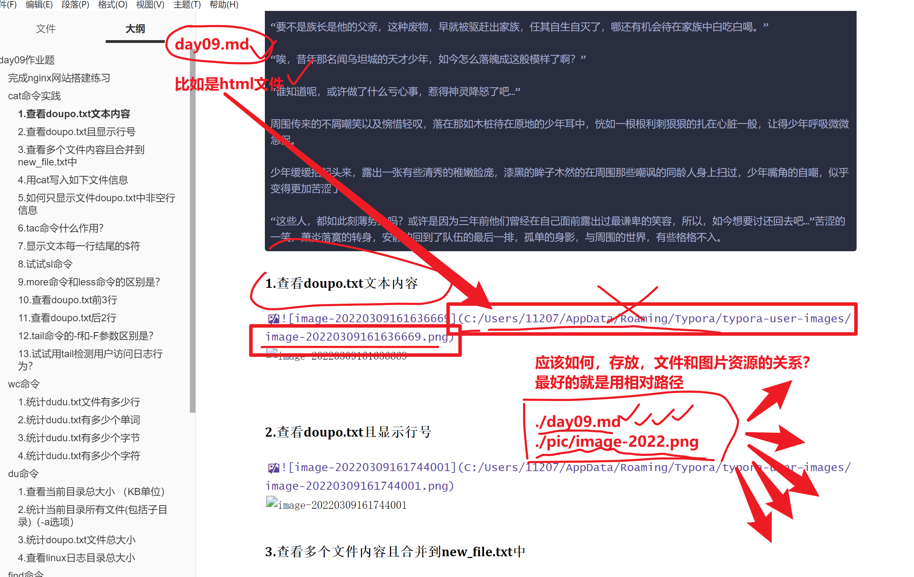
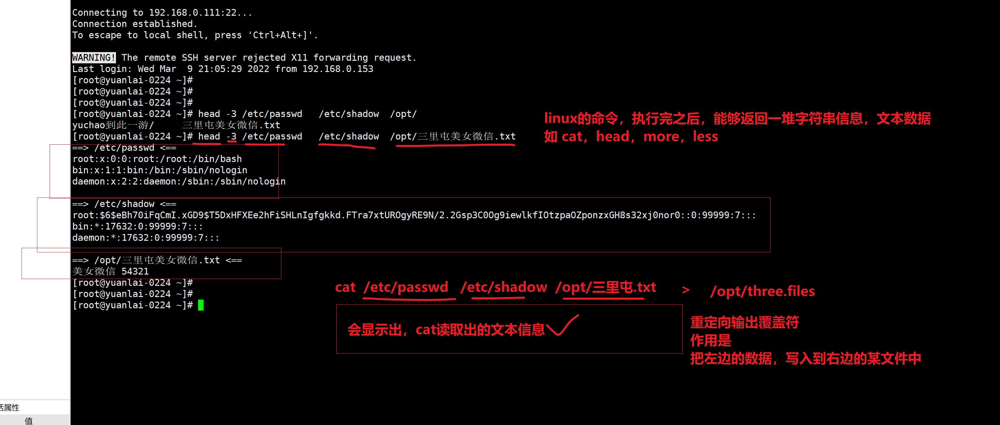
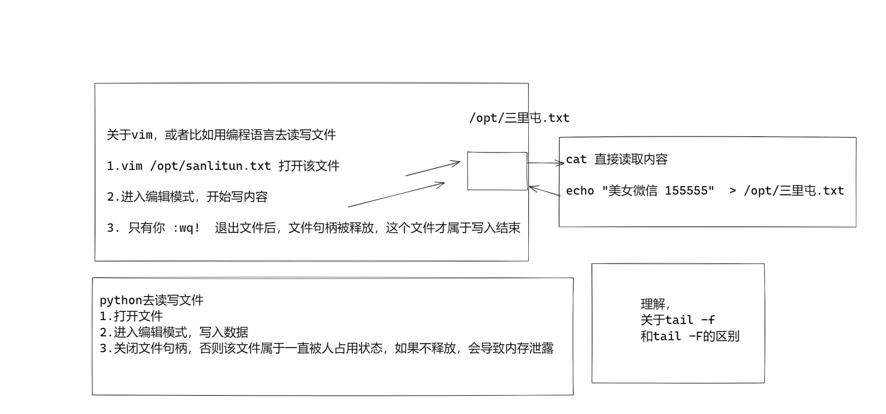
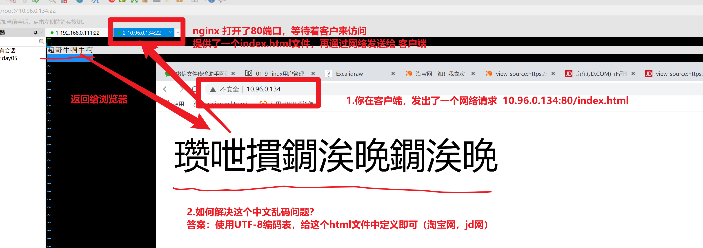
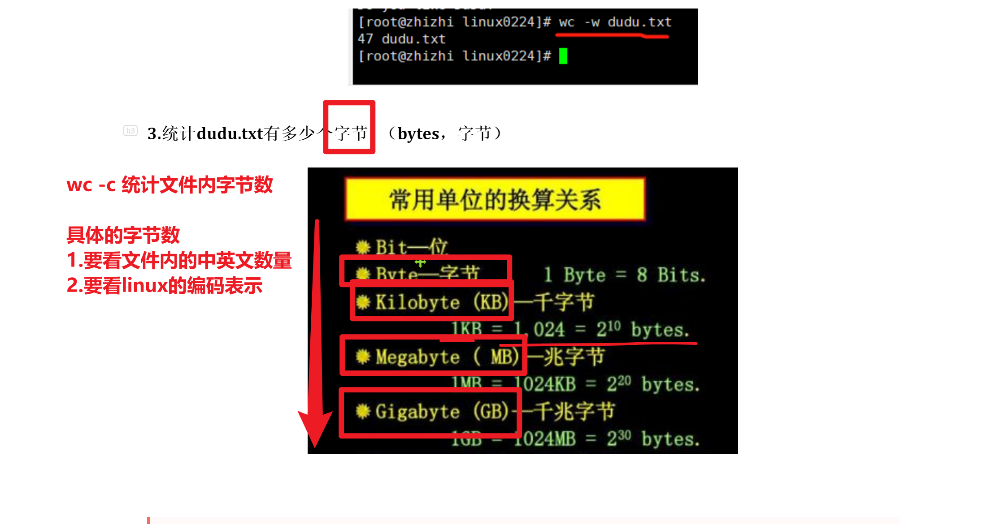
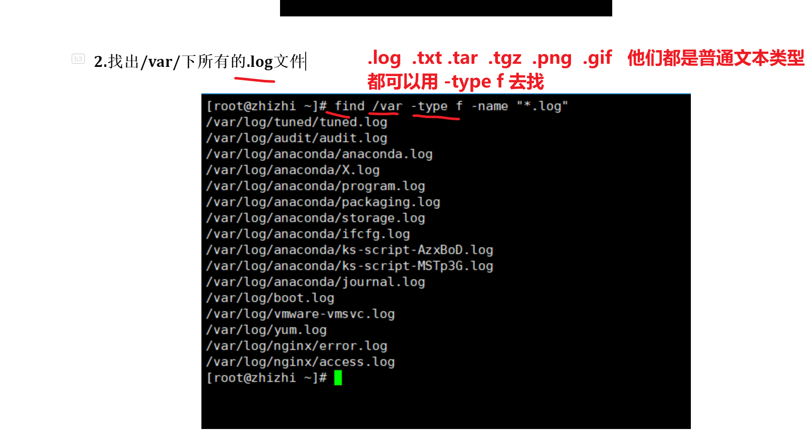
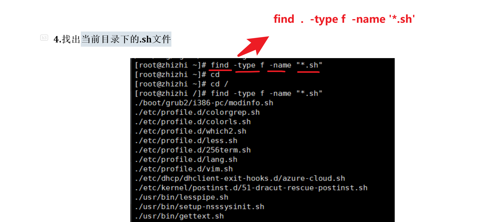
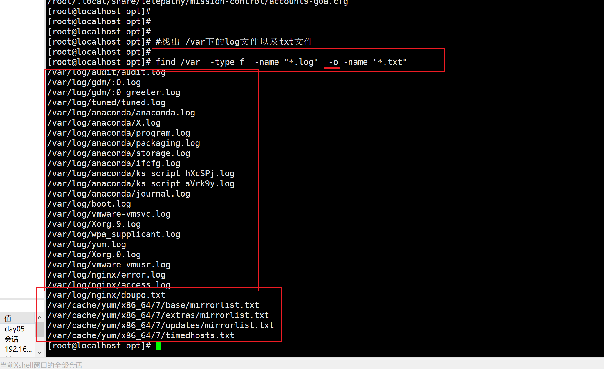
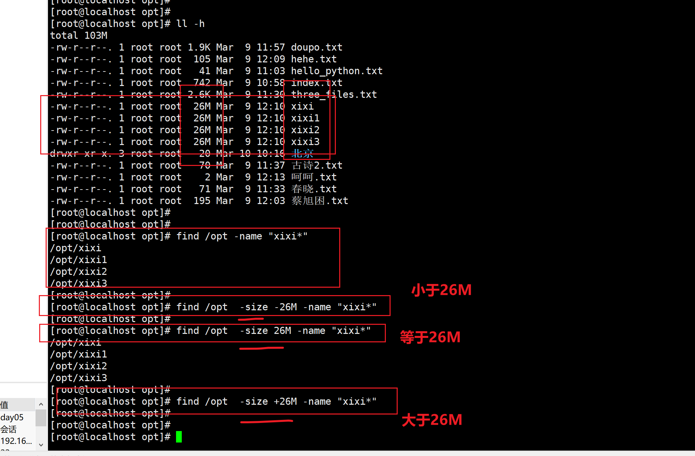

```### 此资源由 58学课资源站 收集整理 ###
	想要获取完整课件资料 请访问：58xueke.com
	百万资源 畅享学习

```


# 关于代码文件和图片文件的存放

务必搞清楚，绝对路径和相对路径



# 关于linux命令执行的结果，以及后续处理




# 关于文件打开的底层流程（文件句柄的概念）




# tail -f用法

```
1.要求被检测的文件，存在

2.可以tail -f检测


```


# 关于html乱码以及UTF-8编码表的概念



```
字节和字符挂钩的

简单记忆

1.查看你机器的字符集（编码表）是什么，是linux的LANG变量(字符集作用可以修改linux的中英文提示)

echo $LANG

[root@yuanlai-0224 ~]# echo $LANG
en_US.UTF-8   # en_US 表示英文  UTF-8 表示全世界通用的一个支持N多个国家语言的编码表（一个网站）

全世界有N多种语言，N多种网站，那么这些不同语言，如何再计算机中表示，以及用容量单位表示。

需要记住的是

目前，最主流的，全世界通用的是UTF-8编码表

以及

中文是3个字节

英文是1个字节

比如，实际应用场景

1.你必须在你的网页文件中，指定是UTF-8编码，你的html文件里的中文汉字，才能够正确的在网络中传输（bit容，比如你发一个图片是2M的概念） (汉字，使用utf-8编码成容量单位后，才可以进行传输)


```




## wc统计字符（字节）

在linux的UTF-8编码表下，如下记忆

```
[root@localhost ~]# echo $LANG
en_US.UTF-8

```

- 在UTF-8这个编码表下
- 中文是3个字节(bytes)

- 英文是1个字节(1个英文字母等于1bytes)

```
实践

[root@localhost ~]# echo "haohappy"  |  wc -c # -c是统计，数一数有几个字节(bytes)
9


[root@localhost ~]# echo "王力宏" |wc -c
10

```


# 关于find找文件的类型



---

## find -o参数，找出多种类型的文件





## \关于find的-size参数




