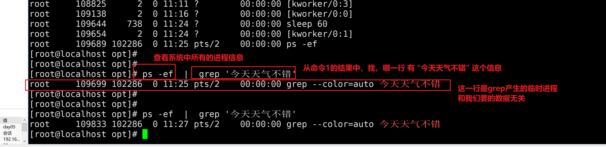

```### 此资源由 58学课资源站 收集整理 ###
	想要获取完整课件资料 请访问：58xueke.com
	百万资源 畅享学习

```
# 今日笔记

# grep

grep是对数据进行过滤查找关键字

源数据可以是

- 文件内容  `grep  hello  /opt/hello.txt`，找出存在hello的那一行
- 命令的执行结果 ，这个需要结合管道符使用，`cat /etc/passwd | grep 'root'`

```
测试数据

I teach linux.

I like python.

My qq is 877348180.

My name is chaoge.

Our school website is http://yuchaoit.cn。

Where is my girl friend.

Who is your boy friend.
My phone number is 15233334444.
```

1.找出存在My字符的行

linux是区分大小写的，注意

-n 参数，显示存在该关键字的行号

`grep -n 'root'  /etc/passwd`

-i grep忽略大小写

`grep -i 'root' /etc/passwd  `，无论大小写，找出/etc/passwd文件中，包含的root信息


```
grep '关键字'  文件名


[root@localhost opt]# grep 'My' testgrep.txt 
My qq is 877348180.
My name is chaoge.
My phone number is 15233334444.
[root@localhost opt]# 
[root@localhost opt]# 
[root@localhost opt]# 


[root@localhost opt]# grep -n  'My' testgrep.txt 
5:My qq is 877348180.
7:My name is chaoge.
14:My phone number is 15233334444.

```

找出小写的my的行

```
[root@localhost opt]# grep -n  'my' testgrep.txt 
11:Where is my girl friend.
[root@localhost opt]# 

```

比如，搜索系统的一些日志文件，找出关于root相关的信息

```
[root@localhost opt]# grep -n  'root'  /var/log/messages 

[root@localhost opt]# grep -n  'root'  /var/log/secure

```

grep不仅能从文件里搜索关键字，只要是文本数据，就可以进行搜索过滤

> grep作用是，从文件中（而非文件夹）匹配出存在该关键字的那一行信息。

```
[root@localhost opt]# grep 'apple' ./*
./t1.txt:apple1
./t2.txt:apple2
./t3.txt:apple3
grep: ./北京: Is a directory


[root@localhost opt]# grep 'aoligei'  古诗2.txt 
[root@localhost opt]# 
[root@localhost opt]# 
[root@localhost opt]# grep 'aoligei'  t1.txt 
aoligei
[root@localhost opt]# 
[root@localhost opt]# grep -n  'aoligei'  t1.txt 
7:aoligei

```

greo的忽略大小写参数 -i 结合-n显示行号

```
[root@localhost opt]# grep -n -i 'apple' t1.txt t2.txt t3.txt   
t1.txt:1:apple1
t1.txt:2:apple1
t1.txt:3:apple1
t1.txt:4:apple1
t1.txt:8:Apple1
t1.txt:9:apple1
t1.txt:10:Apple1
t2.txt:1:apple2
t3.txt:1:apple3


```

利用grep找出nginx软件，配置文件中，定义的网站监听端口号

```
[root@localhost opt]# grep -n -i 'listen'  /etc/nginx/nginx.conf
39:        listen       80;

```


# 管道符


管道符，和grep结合的是最多的

```
管道符，在linux中的表达符号是 

|     (快捷键shift + \)


```

管道符得标准定义

```
管道是一种通信机制，通常用于进程间的通信。

它表现出来的形式将==前面每一个进程的输出（stdout）直接作为下一个进程的输入（stdin）==。
```


## 利用grep和管道符，来查看系统用户信息

```
1.找出chaoge用户的信息
/etc/passwd 是系统的用户信息存放文件
在这个文件中，是用户通过命令创建的用户，id号是从1000开始的，比如
useradd yejinyang01
添加完之后，就会在这个文件中生成一行信息


关于查找用户是否存在的命令
# grep 'yejingyang' /etc/passwd
[root@localhost opt]# 
[root@localhost opt]# 
[root@localhost opt]# # 如何查看linux是否存在某用户，如yejingyang
[root@localhost opt]# 
[root@localhost opt]# 
[root@localhost opt]# id yejingyang
id: yejingyang: no such user

通过grep找到用户，表示该用户存在
[root@localhost opt]# id yejinyang
uid=1001(yejinyang) gid=1001(yejinyang) groups=1001(yejinyang)
[root@localhost opt]# 
[root@localhost opt]# 
[root@localhost opt]# 
[root@localhost opt]# grep 'yejinyang'  /etc/passwd
yejinyang:x:1001:1001::/home/yejinyang:/bin/bash


```

管道符

```
命令1  | 命令2 

命令1，拿到用户文件信息   |  交给grep再去过滤

[root@localhost opt]# cat /etc/passwd |  grep 'yejinyang'
yejinyang:x:1001:1001::/home/yejinyang:/bin/bash
[root@localhost opt]# 
[root@localhost opt]# grep 'yejinyang' /etc/passwd


```

## 管道符常见用法

检查进程

```
1.查看系统进程信息的命令

ps  -ef  # -e 显示所有的进程信息  -f 格式化显示出进程的id号，等其他信息

2.上述命令，找到了一堆进程，如何过滤出我们要的信息呢？

学习如何，正确使用 grep 和管道符，去过滤机器上某个进程，判断某个进程是否存在

1.找出vim的进程

2.找出nginx的进程

```



----


----


----


检查端口

```
1.需要学习，检查系统端口的命令，这个命令，和ps -ef  一样，是查看系统某资源信息
netstat -tunlp   # 这个组合参数，是查看系统上，所有的端口信息

2. 过滤出，机器上，和ssh远程连接的端口信息，提示程序名叫ssdh，或者端口号是22

结合查看端口的命令+ 管道符+ grep，实现，高效的过滤

netstat -tunlp   | grep  'nginx'


```


统计文件数量

```
# 1.统计系统中/var/log目录下有多少个log文件
1.先找出/var/log下所有的log文件，find是递归搜索，找出所有的log后缀文件，不放过一个
find /var/log -name '*.log' | wc -l

```


统计系统用户数量

```
/etc/passwd 

cat /etc/passwd |  wc -l
```


## 管道符，结合find命令搜索信息

```
1.找出系统中所有的txt文件，然后再过滤出，其中包含了apple信息的txt是哪些


1.
find / -name '*.txt'  # 这个命令找出的，每一个txt文件的名字吧，并且就是，一堆，一行一行的文本而已

2.我要判断出，这些文件，哪一个是包含了apple字符串内容的
一个个的去grep这些文件才行！！！


```


1.解读1


2.解读2


## 需求

>1.找出系统上所有的txt文本 
>
>2.判断哪些文件中是包含了apple文本行的
>
>grep  -l  显示匹配到数据的的文件名

这道题，需要用到grep+管道符+xargs理解。


# xargs

作用是，简单的说 就是把其他命令的给它的数据，传递给它后面的命令作为参数

先抛出需求


语法如下

```
命令1 | xargs 选项

选项

-i 用 {} 代替传递的数据


```

## xargs实现批量备份


## xargs实现批量重命名


## 全系统中搜索，包含某数据的文件名

```
[root@localhost tmp]# find /  -type f  -name '*.txt' | xargs  -i grep -l 'xiake' {}
/var/log/nginx/mima.txt

```


# 下午补充 find其他用法


