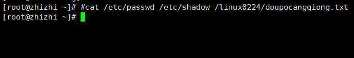

```### 此资源由 58学课资源站 收集整理 ###
	想要获取完整课件资料 请访问：58xueke.com
	百万资源 畅享学习

```
# day09作业题

## 完成nginx网站搭建练习

nginx 软件的名字

`yum install nginx  -y  `


* 1.安装ngibx(nginx  单词错了)

```
错的。。

yum install nginx -y 
```

* 2.查看nginx是否运行（windows的任务管理器一样，看到程序运行的进程信息）

```
[root@zhizhi ~]# ps -ef | grep   nginx
root       1691      1  0 10:31 ?        00:00:00 nginx: master process /usr/sbin/nginx
nginx      1692   1691  0 10:31 ?        00:00:00 nginx: worker process
nginx      1693   1691  0 10:31 ?        00:00:00 nginx: worker process
nginx      1694   1691  0 10:31 ?        00:00:00 nginx: worker process
nginx      1695   1691  0 10:31 ?        00:00:00 nginx: worker process
root       3148   2983  0 15:53 pts/1    00:00:00 grep --color=auto nginx
```

* 3.关闭防火墙

```
[root@zhizhi ~]# iptables -F
[root@zhizhi ~]# 

```

* 修改selinux防火墙文件

```
[root@zhizhi ~]# cat /etc/selinux/config

# This file controls the state of SELinux on the system.
# SELINUX= can take one of these three values:
#     enforcing - SELinux security policy is enforced.
#     permissive - SELinux prints warnings instead of enforcing.
#     disabled - No SELinux policy is loaded.
SELINUX=enforcing
# SELINUXTYPE= can take one of three two values:
#     targeted - Targeted processes are protected,
#     minimum - Modification of targeted policy. Only selected processes are protected. 
#     mls - Multi Level Security protection.
SELINUXTYPE=targeted 
```

* 停用80端口

```
[root@zhizhi ~]# systemctl stop nginx
[root@zhizhi ~]# 
```

* 下载网址首页html文件

```
[root@zhizhi ~]# wgt https://www.jd.com
-bash: wgt: command not found
[root@zhizhi ~]# wget https://www.jd.com/
--2022-03-09 16:01:17--  https://www.jd.com/
Resolving www.jd.com (www.jd.com)... 60.9.5.3
Connecting to www.jd.com (www.jd.com)|60.9.5.3|:443... connected.
HTTP request sent, awaiting response... 200 OK
Length: 143891 (141K) [text/html]
Saving to: ‘index.html’

100%[========================================================================>] 143,891     --.-K/s   in 0.03s   

2022-03-09 16:01:18 (4.28 MB/s) - ‘index.html’ saved [143891/143891]

[root@zhizhi ~]# 
```

*  讲改文件移动到nginx网站目录下

```
[root@zhizhi ~]# mv index.html /usr/share/nginx/html/
mv: overwrite ‘/usr/share/nginx/html/index.html’? y
[root@zhizhi ~]# 
```

* 完成

访问你的linux机器，可以看到一个美化的html页面。


## cat命令实践

* 文本数据写入/linux0224/doupo.txt


```
cat >> /linux0224/doupo.txt  << EOF
把你的文本写在这，复制在这
EOF


bash 提示报错，/linux0224/doupo.txt 没有这个文件或目录

解释错误

1. 上述的cat命令是能够创建文件的。
2. 但是 /linux0224 这个目录，cat是创建不了的


```


```
“斗之力，三段！”

望着测验魔石碑上面闪亮得甚至有些刺眼的五个大字，少年面无表情，唇角有着一抹自嘲，紧握的手掌，因为大力，而导致略微尖锐的指甲深深的刺进了掌心之中，带来一阵阵钻心的疼痛…

“萧炎，斗之力，三段！级别：低级！”测验魔石碑之旁，一位中年男子，看了一眼碑上所显示出来的信息，语气漠然的将之公布了出来…

中年男子话刚刚脱口，便是不出意外的在人头汹涌的广场上带起了一阵嘲讽的骚动。

“三段？嘿嘿，果然不出我所料，这个“天才”这一年又是在原地踏步！”

“哎，这废物真是把家族的脸都给丢光了。”

“要不是族长是他的父亲，这种废物，早就被驱赶出家族，任其自生自灭了，哪还有机会待在家族中白吃白喝。”

“唉，昔年那名闻乌坦城的天才少年，如今怎么落魄成这般模样了啊？”

“谁知道呢，或许做了什么亏心事，惹得神灵降怒了吧…”

周围传来的不屑嘲笑以及惋惜轻叹，落在那如木桩待在原地的少年耳中，恍如一根根利刺狠狠的扎在心脏一般，让得少年呼吸微微急促。

少年缓缓抬起头来，露出一张有些清秀的稚嫩脸庞，漆黑的眸子木然的在周围那些嘲讽的同龄人身上扫过，少年嘴角的自嘲，似乎变得更加苦涩了。

“这些人，都如此刻薄势力吗？或许是因为三年前他们曾经在自己面前露出过最谦卑的笑容，所以，如今想要讨还回去吧…”苦涩的一笑，萧炎落寞的转身，安静的回到了队伍的最后一排，孤单的身影，与周围的世界，有些格格不入。
```

### 1.查看doupo.txt文本内容

```
cat doupo.txt
```


### 2.查看doupo.txt且显示行号

```
cat -n doupo.txt
```


### 3.查看多个文件内容且合并到new_file.txt中

```
语法
cat  file1.txt file2.txt file3.txt > /opt/files.txt
```




### 4.用cat写入如下文件信息

```
文件1 
[root@yuanlai-0224 ~]# cat /linux0224/古诗.txt

《望庐山瀑布》
李白走进烤鸭店
烤鸭香味生紫烟
口水流下三千尺
摸摸口袋没有钱

文件2
[root@yuanlai-0224 ~]# cat /linux0224/test1.sh
#!/bin/bash
# testing a bad command
if badcommand
then
    echo "It worked."
fi
```

* 文件1


* 文件2


### 5.如何只显示文件doupo.txt中（只给有内容的行，显示其行号）


### 6.tac命令什么作用？

* 倒叙查看文件

```
[root@zhizhi linux0224]# cat -E 古诗.txt 
《望庐山瀑布》$
李白走进烤鸭店$
烤鸭香味生紫烟$
口水流下三千尺$
摸摸口袋没有钱$
[root@zhizhi linux0224]# tac 古诗.txt 
摸摸口袋没有钱
口水流下三千尺
烤鸭香味生紫烟
李白走进烤鸭店
《望庐山瀑布》
[root@zhizhi linux0224]# 
```

### 7.显示文本每一行结尾的$符

wc统计字符数的时候


### 8.试试sl命令


* sl -a

  

* sl -l

  

* sl -F

  

### 9.more命令和less命令的区别是？

* more同cat,一次性读取所有内容,占内存资源

  * ```
    cat 一次性读取文件所有内容，且输出到屏幕上，文本太多的话，无法观看
    more 分屏显示文本内容，可以用空格，回车，翻页查看，但是也很占内存
    ```

  * 

* less命令,如果文本内容过多的话,不会一次性显示读取完,显示界面有多大就先显示多少

  ```
  空格 -- 翻篇
  
  回车 -- 下一行
  ```

### 10.查看doupo.txt前3行


### 11.查看doupo.txt后2行


### 12.tail命令的-f和-F参数区别是？

* -f  跟踪文本的内容变化,但是需要正常写入保存可见


* -F  能够对文件进行刷新读取,及时检测文件不存在也是可以的 


### 13.试试用tail检测用户访问网站的行为？

```
提示，查看nginx访问日志，路径默认是
/var/log/nginx/access.log 

tail -f /var/log/nginx/access.log 


如何访问你自己的linux机器的网站程序？
直接访问你linux机器的 ip:port

ip:80


```


## wc命令

（word count缩写）

测试文件dudu.txt

```
I have a dog. My dog name is DuDu. 
DuDu is 9 years. DuDu is fat. It wears a white coat.
DuDu has two big eyes and two small ears. 
It has one short mouth. 
My dog is smart. I like my dog.
Do you like DuDu?
```

### 1.统计dudu.txt文件有多少行

```
wc -l    # -l 参数 全称是 lines 

```


### 2.统计dudu.txt有多少个单词


### 3.统计dudu.txt有多少个字节   （bytes，字节）


>字节和字符挂钩的
>
>简单记忆
>
>1.查看你机器的字符集（编码表）是什么，是linux的LANG变量(字符集作用可以修改linux的中英文提示)
>
>echo $LANG
>
>[root@yuanlai-0224 ~]# echo $LANG
>en_US.UTF-8   # en_US 表示英文  UTF-8 表示全世界通用的一个支持N多个国家语言的编码表（一个网站）
>
>全世界有N多种语言，N多种网站，那么这些不同语言，如何再计算机中表示，以及用容量单位表示。
>
>需要记住的是
>
>目前，最主流的，全世界通用的是UTF-8编码表
>
>以及
>
>中文是3个字节
>
>英文是1个字节，一个英文字母，一个字节
>
>比如，实际应用场景
>
>1.你必须在你的网页文件中，指定是UTF-8编码，你的html文件里的中文汉字，才能够正确的在网络中传输（bit容，比如你发一个图片是2M的概念） (汉字，使用utf-8编码成容量单位后，才可以进行传输)
>
>
>
>

>

bit 和 bytes

bytes 和 kb

kb 和mb

mb 和gb

gb 和 tb 


```
关于wc命令，统计字节数


```


### 4.统计dudu.txt有多少个字符

```
有几个字符，就等于让你数数，有几个英文字母

wc -m

[root@localhost ~]# echo "haohappy"  |  wc -m
9
[root@localhost ~]# 
[root@localhost ~]# echo "haohappy"  |  cat -E
haohappy$
[root@localhost ~]# 
[root@localhost ~]# 
[root@localhost ~]# echo "haohappy"  |  wc -c # -c是统计，数一数有几个字节
9
[root@localhost ~]# 

```


## du命令

### 1.查看当前目录总大小 （KB单位）


### 2.统计当前目录所有文件(包括子目录)（-a选项）

```

```


### 3.统计doupo.txt文件总大小


### 4.查看linux日志目录总大小


## find命令

### 1.找出系统中的doupo.txt文件绝对路径


### 2.找出/var/下所有的.log文件


### 3.找出/etc下所有的.conf文件


### 4.找出当前目录下的.sh文件


### 5.找出家目录下名为nginx.tgz的文件


```
find  ~  -name 'nginx.tgz'
```

你这是错误的！


### 5.找出系统中所有的压缩文件（严谨）

```
了解下常见的压缩后缀
# 常见的压缩文件，*.tar  *.tgz  *.zip  *.tar.gz 

find  /  -type f -name 
find  /  -type f -name '*.tgz'
find  /  -type f -name '*.zip'
find  /  -type f -name '*.tar.gz'


# 简便的办法，叫做 -o 参数  ，-o参数表示或者的意思，

# 表示找出这四种压缩文件
find / -type f  -name '*.tar' -o  -name '*.tgz' -o -name '*.zip'  -o -name '*.tar.gz'


```


这个也是错的


### 6.找出/usr/local/下所有的tar包


### 7.找出系统上超过20M的压缩包（自行查阅）

```
find / -type f  -size +20M -name "*.tar"


```


## grep命令（自行查阅）

* 测试文本

```
I teach linux.

I like python.

My qq is 877348180.

My name is chaoge.

Our school website is http://yuchaoit.cn。

Where is my girl friend.

Who is your boy friend.
My phone number is 15233334444.
```

### 1.查找哪些文本行包含了 'My'


### 2.查找包含'my'的行


### 3.忽略大小写找出包含'my'的行


### 4.找出系统日志/var/log/messages中关于root的信息


### 5.同时在/var/loge/mgessage和/var/log/secure中找出关于root的信息


## 判断题

```
[root@yuanlai-0224 ~]# echo '世界很大，我要去看看' > /tmp/world.txt
[root@yuanlai-0224 ~]# echo '世界很大，我要去看看' > /tmp/world.txt
[root@yuanlai-0224 ~]# echo '世界很大，我要去看看' >> /tmp/world.txt
[root@yuanlai-0224 ~]# echo '世界很大，我要去看看' >> /tmp/world.txt
[root@yuanlai-0224 ~]# echo '世界很大，我要去看看' > /tmp/world.txt
[root@yuanlai-0224 ~]# echo '世界很大，我要去看看' >> /tmp/world.txt
```

结果是什么

```
[root@yuanlai-0224 ~]# cat /tmp/world.txt
```

* 两遍'世界很大,我要去看看'


