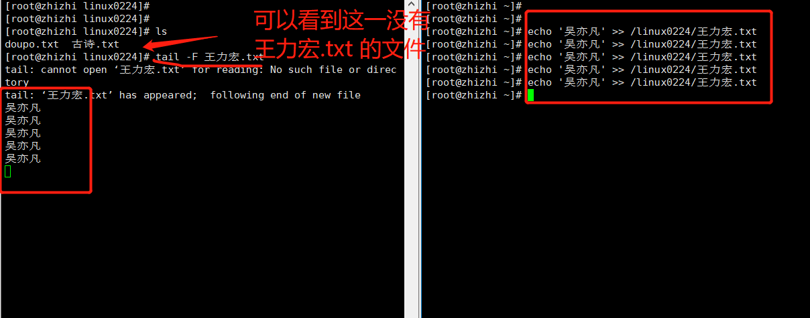

```### 此资源由 58学课资源站 收集整理 ###
	想要获取完整课件资料 请访问：58xueke.com
	百万资源 畅享学习

```
# 文件管理命令二

## cat命令

### 1.cat

```
1.cat 适合读取小文件,使用cat查看文件,不管文件有多少内容都会一次性展示在终端,一来这样不方便我们查看信息,二来这样的操作会非常的占内存资源
```

### 2.cat 	-n 

* 显示行数

  (但是会发现孩是将内容一下子全部展现在了终端,很杂乱)

* 

```
[root@zhizhi log]# cat -n vmware-vmsvc.log 
     1	[Mar 05 13:00:45.568] [ message] [vmsvc] Log caching is enabled with maxCacheEntries=4096.
     2	[Mar 05 13:00:45.570] [ message] [vmsvc] Core dump limit set to -1
     3	[Mar 05 13:00:45.570] [ message] [vmtoolsd] Tools Version: 10.1.10.63510 (build-6082533)
     4	[Mar 05 13:00:45.600] [ message] [vmtoolsd] Plugin 'hgfsServer' initialized.
     
......

    75	[Mar 09 14:59:51.451] [ message] [vix] ToolsDaemonTcloReceiveVixCommand: command 62, additionalError = 17
    76	[Mar 09 14:59:53.450] [ message] [powerops] Script exit code: 0, success = 1
    77	[Mar 09 15:00:20.634] [ warning] [guestinfo] *** WARNING: GuestInfo collection interval longer than expected; actual=350 sec, expected=30 sec. ***
```


* 还可一次性查看多个文件

  cat 	-n	文件1	文件2	文件3 (-n加了显示行数,不加也可查看,没有行数)

```
[root@zhizhi 测试文件]# echo '张三' > 张三.txt
[root@zhizhi 测试文件]# echo '李四' > 李四.txt
[root@zhizhi 测试文件]# cat -n 张三.txt  李四.txt 
     1	张三
     2	李四
[root@zhizhi 测试文件]# 

```


### cat结合重定向符

```
>   重定向覆盖输出符  ，数据从左边，覆盖写入到右边 
<   重定向覆盖输入符，数据从右边，覆盖写入到左边
>>  重定向追加输出符， ，数据从左边，追加写入到右边 
<<  重定向覆盖输入符，数据从右边，追加写入到左边
```

* 例:将几个文本组合写入一个文本里

```
cat  doupo.txt   hehe.txt   hello_python.txt  > ./three_files.txt
```

* ### 重点

  cat >> 文件名 <<EOF

  数据1

  数据2

  ...

  EOF

  *(EOF -- end of file)
  
  ```
  [root@zhizhi 测试文件]# cat >> 王五.txt <<EOF
  > 涨三
  > 李四
  > 和王五
  > EOF
  [root@zhizhi 测试文件]# cat 王五.txt 
  涨三
  李四
  和王五
  [root@zhizhi 测试文件]# 
  ```
  
  


### cat	-b

* 只会对有内容的行,显示其行内容,空行不现实

  [root@localhost opt]# cat -b doupo.txt 

### cat	-E

(在Linux文件中,每一行结尾,都会有一个看不见的'$',变质是改行的结尾)


## tac命令

* 倒叙查看文件

```
[root@zhizhi linux0224]# cat -E 古诗.txt 
《望庐山瀑布》$
李白走进烤鸭店$
烤鸭香味生紫烟$
口水流下三千尺$
摸摸口袋没有钱$
[root@zhizhi linux0224]# tac 古诗.txt 
摸摸口袋没有钱
口水流下三千尺
烤鸭香味生紫烟
李白走进烤鸭店
《望庐山瀑布》
[root@zhizhi linux0224]# 

```


## more和less命令

* more同cat,一次性读取所有内容,不方便查看,占内存资源

* less命令,如果文本内容过多的话,不会一次性显示读取完,显示界面有多大就先显示多少

  ```
  空格 -- 翻篇
  
  回车 -- 下一行
  ```

## head和tail命令

* head -- 脑袋

  默认查看文件前10行

  ```
  [root@zhizhi linux0224]# head  doupo.txt 
  ```

  * head -5

    显示前五行

* tail 

  默认查看文件后10行

  ```
  [root@zhizhi linux0224]# tail  doupo.txt 
  ```

  * tail -5

    显示后五行

### 重点

* tail

  实时刷新文件内容功能

* -f  跟踪文件内容变化,但是需要文件正常退出后,可见,最常用的也就是小写的  f  检查程序的日志变化(程序代码,追加新内容到文件中)


* -F
* 能够对文件进行刷新读取,及时检测文件不存在也是可以的 




## wc命令

统计文件的行

* vim -- set nu  显示行数
* cat -n  显示行数
* wc -l  统计一共有多少行


* wc -w  统计文件内的单词数


* wc -c

  字节数(空格,回车,换行)

  

## du命令

* 查看文件或目录(递归显示子目录)占用磁盘空间大小

  du	参数	文件名或目录名

* -s -- summaries  只显示汇总大小,统计文件夹的大小

  ```
  [root@localhost opt]# du -s .
  105072KB	.
  ```

* -h

  表示以高可读性的形式进行显示,如果不写  -h  默认一kb的形式显示文件大小

  - linux的文件系统,对文件最小管理单位是4kb(了解)


## find -- 查找文件

* find是递归查询

  find	范围	-name	"要找的内容"


```
-type  f   找到文本类型的数据 
-type  d    找到文件夹类型的数据

find /    -type f     -name   '古诗.txt' 
```


