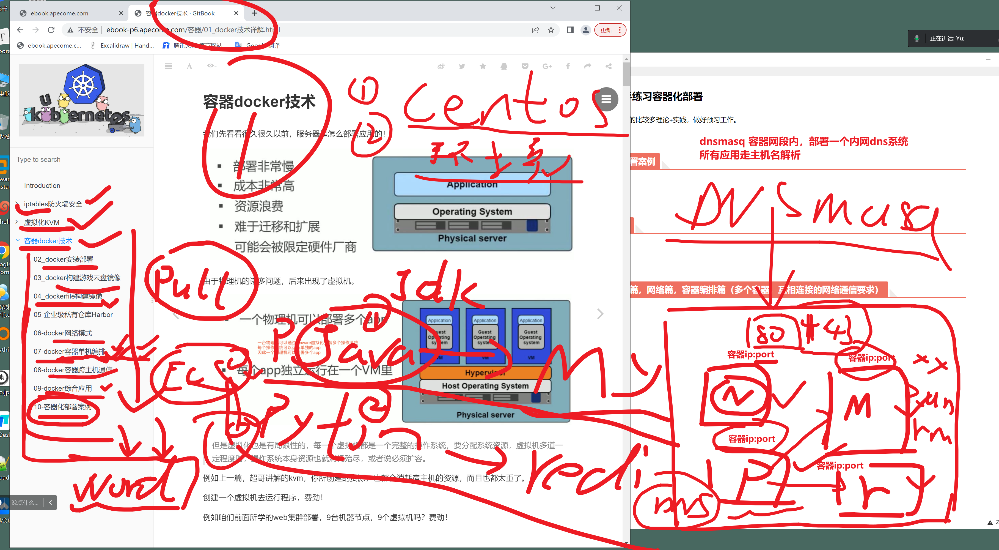
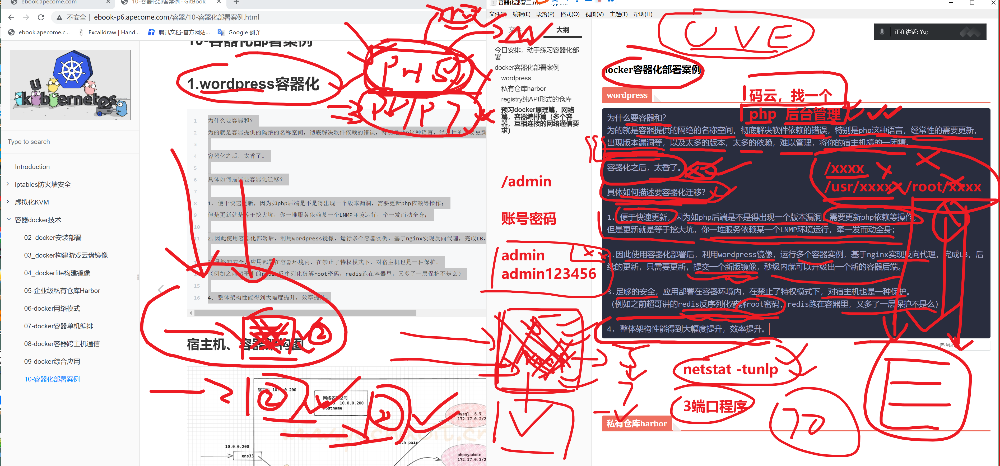
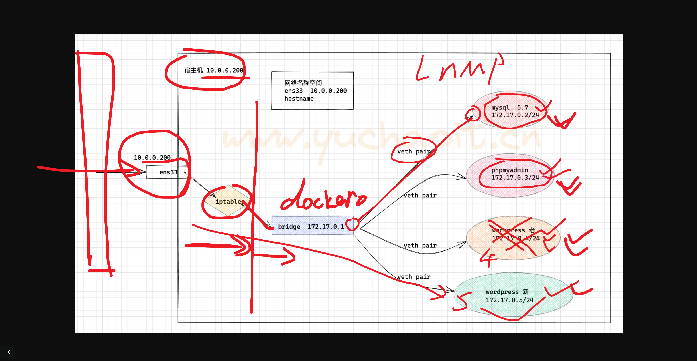
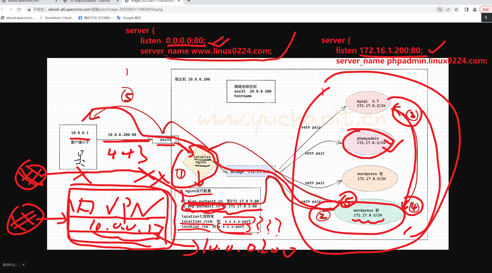
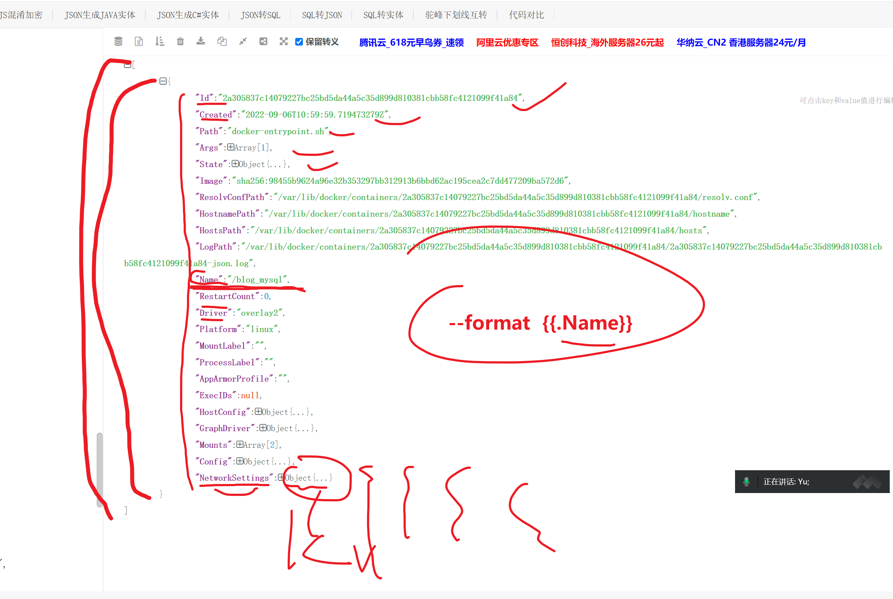
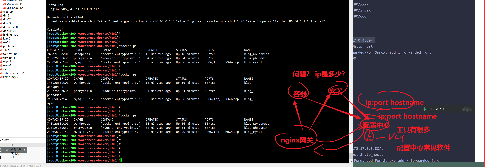
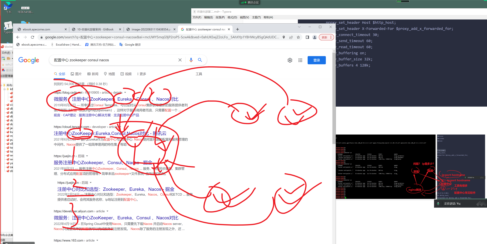

```### 此资源由 58学课资源站 收集整理 ###
	想要获取完整课件资料 请访问：58xueke.com
	百万资源 畅享学习

```
# 今日安排，动手练习容器化部署

后面的内容还会连贯性的比较多


理论+实践，做好预习工作。





# docker容器化部署案例

## wordpress

```
为什么要容器和？
为的就是容器提供的隔绝的名称空间，彻底解决软件依赖的错误，特别是php这种语言，经常性的需要更新，出现版本漏洞等，以及太多的版本，太多的依赖，难以管理，将你的宿主机搞的一团糟。

容器化之后，太香了。

具体如何描述要容器化迁移？

1. 便于快速更新，因为如php后端是不是得出现一个版本漏洞，需要更新php依赖等操作；
但是更新就是等于挖大坑，你一堆服务依赖某一个LNMP环境运行，牵一发而动全身；

2.因此使用容器化部署后，利用wordpress镜像，运行多个容器实例，基于nginx实现反向代理，完成LB，后续的更新，只需要更新，提交一个新版镜像，秒级内就可以升级出一个新的容器后端。

3.足够的安全，应用部署在容器环境内，在禁止了特权模式下，对宿主机也是一种保护。
（例如之前超哥讲的redis反序列化破解root密码，redis跑在容器里，又多了一层保护不是么）

4. 整体架构性能得到大幅度提升，效率提升。
```








## 容器化部署LNMP的逻辑图




## 容器化部署wordprress

### mysql配置

```

cat >  my.cnf <<'EOF'
[mysqld]
port=3306
user=mysql
character_set_server=utf8mb4
collation-server=utf8mb4_general_ci


[mysql]
socket=/tmp/mysql.sock
EOF

# 1.直接再宿主机部署mysql，更为合理


# 2.基于centos基础镜像，构建mariadb数据库镜像环境

--restart=always


# 运行mysql容器
docker run \
--restart=always \
 --name blog_mysql -d \
-v /wordpress-docker/db/:/var/lib/mysql \
-e MYSQL_ROOT_PASSWORD="linux0224" \
-v /wordpress-docker/conf/:/etc/mysql \
-d mysql:5.7.25  # 执行了xxxx命令，xxx脚本启动数据库服务端，if 该变量为空，mysqld，且echo 提示你要设置xxxx变量，才能运行


# 启动时，传入

MYSQL_USER='wordpress_user'
MYSQL_PASSWORD='wordpress_pwd'
MYSQL_DATABASE='wordpress'


docker run \
--restart=always \
 --name blog_mysql -d \
-v /new_mysql_data:/var/lib/mysql    \
-e MYSQL_ROOT_PASSWORD="linux0224"  \
-e MYSQL_USER='wordpress_user'  \
-e MYSQL_PASSWORD='wordpress_pwd' \
-e MYSQL_DATABASE='wordpress' \
-v /wordpress-docker/conf/:/etc/mysql  \
-d mysql:5.7.25


```

### phpadmin

拿到新的镜像的时候，该如何去用，传入什么环境变量才能正确启动


```
docker run -it  --rm  --name blog_phpadmin  phpmyadmin


1. 看dockerhub，给了什么资料，
https://hub.docker.com/_/phpmyadmin

2. docker history  
docker run 去分析 入口点脚本，启动脚本，都调用了哪些变量


# 启动php-admin，链接数据库


docker run  --restart=always  --link blog_mysql --name blog_phpadmin -d -e PMA_HOST=blog_mysql phpmyadmin


```


### 关于mysql的官网环境变量文档

https://hub.docker.com/_/mysql


## wordpress

```
docker run -d --link blog_mysql --restart=always --name blog_wordpress \
-v /wordpress-docker/html:/var/www/html \
wordpress 

# 提供好lnp的wordpress环境了，代码，php版本都是适配的

```


## 检查3个应用容器

```
[root@docker-200 /wordpress-docker/html]#docker ps
CONTAINER ID   IMAGE          COMMAND                  CREATED          STATUS          PORTS                 NAMES
748d2e63ec01   wordpress      "docker-entrypoint.s…"   3 seconds ago    Up 3 seconds    80/tcp                blog_wordpress
215e25e8b63e   phpmyadmin     "/docker-entrypoint.…"   18 minutes ago   Up 18 minutes   80/tcp                blog_phpadmin
2a305837c140   mysql:5.7.25   "docker-entrypoint.s…"   40 minutes ago   Up 40 minutes   3306/tcp, 33060/tcp   blog_mysql


# 批量获取容器主机名和id，格式化输出
--format='{{.Name}} - {{range .NetworkSettings.Networks}}{{.IPAddress}}{{end}}'
https://pkg.go.dev/text/template


# 提取容器IP的格式化玩法


[root@docker-200 /wordpress-docker/html]#docker inspect --format='{{.NetworkSettings.Networks.bridge.IPAddress}}'  blog_mysql
172.17.0.2


# 简单玩法， 基于key 提取value，格式化主机名，容器ip
[root@docker-200 /wordpress-docker/html]#docker inspect --format='{{.Name}}   {{.NetworkSettings.Networks.bridge.IPAddress}}'  `docker ps -aq`
/blog_wordpress   172.17.0.4
/blog_phpadmin   172.17.0.3
/blog_mysql   172.17.0.2


```





## 接入层网关，nginx跑起来

```
1.部署服务
yum install nginx -y


2.准备好七层代理配置文件，基于应用层的转发代理，http层代理，http协议，url，port等
[root@docker-200 /wordpress-docker/html]#docker inspect --format='{{.Config.ExposedPorts}}' blog_wordpress  
map[80/tcp:{}]

# 批量获取容器ip技巧 ，别名技巧
[root@docker-200 /wordpress-docker/html]#alias dockerport='docker inspect --format="{{.Name}}   {{.NetworkSettings.Networks.bridge.IPAddress}}"  `docker ps -aq`'


# 转发业务配置
server {
    listen       80;
    server_name  blog.linux0224.cc;
    # http://blog.linux0224.cc:80
    # http://blog.linux0224.cc:80/
    # http://blog.linux0224.cc:80/xxxx
    # http://blog.linux0224.cc:80/index
    # http://blog.linux0224.cc:80/ooo
    location /
    {
        # 默认转发给wordpress
        proxy_pass http://172.17.0.4:80/;
        proxy_set_header Host $http_host;
        proxy_set_header X-Forwarded-For $proxy_add_x_forwarded_for;
        proxy_connect_timeout 30;
        proxy_send_timeout 60;
        proxy_read_timeout 60;
        proxy_buffering on;
        proxy_buffer_size 32k;
        proxy_buffers 4 128k;
    }
}


# phpadmin配置
    server {
    listen       80;
    server_name  phpmyadmin.linux0224.cc;
    location / {
            proxy_pass http://172.17.0.3:80/;
            proxy_set_header Host $http_host;
            proxy_set_header X-Forwarded-For $proxy_add_x_forwarded_for;
            proxy_connect_timeout 30;
            proxy_send_timeout 60;
            proxy_read_timeout 60;
            proxy_buffering on;
            proxy_buffer_size 32k;
            proxy_buffers 4 128k;
    }


}


```








## 私有仓库harbor


## registry纯API形式的仓库


## 预习docker原理篇，网络篇，容器编排篇（多个容器，互相连接的网络通信要求）


