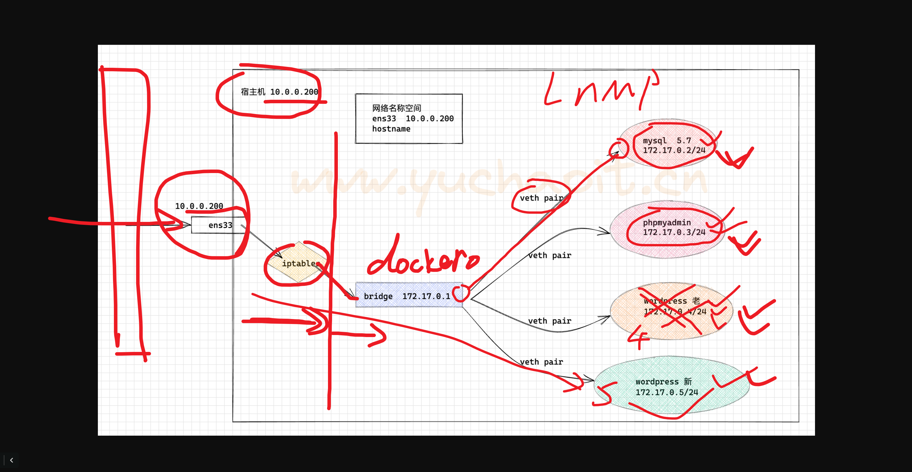

```### 此资源由 58学课资源站 收集整理 ###
	想要获取完整课件资料 请访问：58xueke.com
	百万资源 畅享学习

```
# 今日安排，动手练习容器化部署

后面的内容还会连贯性的比较多


理论+实践，做好预习工作。


# docker容器化部署案例

## wordpress

```
为什么要容器和？
为的就是容器提供的隔绝的名称空间，彻底解决软件依赖的错误，特别是php这种语言，经常性的需要更新，出现版本漏洞等，以及太多的版本，太多的依赖，难以管理，将你的宿主机搞的一团糟。

容器化之后，太香了。

具体如何描述要容器化迁移？

1. 便于快速更新，因为如php后端是不是得出现一个版本漏洞，需要更新php依赖等操作；
但是更新就是等于挖大坑，你一堆服务依赖某一个LNMP环境运行，牵一发而动全身；

2.因此使用容器化部署后，利用wordpress镜像，运行多个容器实例，基于nginx实现反向代理，完成LB，后续的更新，只需要更新，提交一个新版镜像，秒级内就可以升级出一个新的容器后端。

3.足够的安全，应用部署在容器环境内，在禁止了特权模式下，对宿主机也是一种保护。
（例如之前超哥讲的redis反序列化破解root密码，redis跑在容器里，又多了一层保护不是么）

4. 整体架构性能得到大幅度提升，效率提升。
```





## 容器化部署LNMP的逻辑图


## 容器化部署wordprress

### mysql配置

```

cat >  my.cnf <<'EOF'
[mysqld]
port=3306
user=mysql
character_set_server=utf8mb4
collation-server=utf8mb4_general_ci


[mysql]
socket=/tmp/mysql.sock
EOF

# 1.直接再宿主机部署mysql，更为合理


# 2.基于centos基础镜像，构建mariadb数据库镜像环境

--restart=always


# 运行mysql容器
docker run \
--restart=always \
 --name blog_mysql -d \
-v /wordpress-docker/db/:/var/lib/mysql \
-e MYSQL_ROOT_PASSWORD="linux0224" \
-v /wordpress-docker/conf/:/etc/mysql \
-d mysql:5.7.25  # 执行了xxxx命令，xxx脚本启动数据库服务端，if 该变量为空，mysqld，且echo 提示你要设置xxxx变量，才能运行


# 启动时，传入

MYSQL_USER='wordpress_user'
MYSQL_PASSWORD='wordpress_pwd'
MYSQL_DATABASE='wordpress'


docker run \
--restart=always \
 --name blog_mysql -d \
-v /new_mysql_data:/var/lib/mysql    \
-e MYSQL_ROOT_PASSWORD="linux0224"  \
-e MYSQL_USER='wordpress_user'  \
-e MYSQL_PASSWORD='wordpress_pwd' \
-e MYSQL_DATABASE='wordpress' \
-v /wordpress-docker/conf/:/etc/mysql  \
-d mysql:5.7.25


```

### phpadmin

拿到新的镜像的时候，该如何去用，传入什么环境变量才能正确启动


```
docker run -it  --rm  --name blog_phpadmin  phpmyadmin


1. 看dockerhub，给了什么资料，
https://hub.docker.com/_/phpmyadmin

2. docker history  
docker run 去分析 入口点脚本，启动脚本，都调用了哪些变量


# 启动php-admin，链接数据库


docker run  --restart=always  --link blog_mysql --name blog_phpadmin -d -e PMA_HOST=blog_mysql phpmyadmin


```


### 关于mysql的官网环境变量文档

https://hub.docker.com/_/mysql


## wordpress

```
docker run -d --link blog_mysql --restart=always --name blog_wordpress \
-v /wordpress-docker/html:/var/www/html \
wordpress 

# 提供好lnp的wordpress环境了，代码，php版本都是适配的

```


## 检查3个应用容器

```
[root@docker-200 /wordpress-docker/html]#docker ps
CONTAINER ID   IMAGE          COMMAND                  CREATED          STATUS          PORTS                 NAMES
748d2e63ec01   wordpress      "docker-entrypoint.s…"   3 seconds ago    Up 3 seconds    80/tcp                blog_wordpress
215e25e8b63e   phpmyadmin     "/docker-entrypoint.…"   18 minutes ago   Up 18 minutes   80/tcp                blog_phpadmin
2a305837c140   mysql:5.7.25   "docker-entrypoint.s…"   40 minutes ago   Up 40 minutes   3306/tcp, 33060/tcp   blog_mysql


# 批量获取容器主机名和id，格式化输出
--format='{{.Name}} - {{range .NetworkSettings.Networks}}{{.IPAddress}}{{end}}'
https://pkg.go.dev/text/template


# 提取容器IP的格式化玩法


[root@docker-200 /wordpress-docker/html]#docker inspect --format='{{.NetworkSettings.Networks.bridge.IPAddress}}'  blog_mysql
172.17.0.2


# 简单玩法， 基于key 提取value，格式化主机名，容器ip
[root@docker-200 /wordpress-docker/html]#docker inspect --format='{{.Name}}   {{.NetworkSettings.Networks.bridge.IPAddress}}'  `docker ps -aq`
/blog_wordpress   172.17.0.4
/blog_phpadmin   172.17.0.3
/blog_mysql   172.17.0.2


```


## 接入层网关，nginx跑起来

```
1.部署服务
yum install nginx -y


2.准备好七层代理配置文件，基于应用层的转发代理，http层代理，http协议，url，port等
[root@docker-200 /wordpress-docker/html]#docker inspect --format='{{.Config.ExposedPorts}}' blog_wordpress  
map[80/tcp:{}]

# 批量获取容器ip技巧 ，别名技巧
[root@docker-200 /wordpress-docker/html]#alias dockerport='docker inspect --format="{{.Name}}   {{.NetworkSettings.Networks.bridge.IPAddress}}"  `docker ps -aq`'


# 转发业务配置
server {
    listen       80;
    server_name  blog.linux0224.cc;
    # http://blog.linux0224.cc:80
    # http://blog.linux0224.cc:80/
    # http://blog.linux0224.cc:80/xxxx
    # http://blog.linux0224.cc:80/index
    # http://blog.linux0224.cc:80/ooo
    location /
    {
        # 默认转发给wordpress
        proxy_pass http://172.17.0.4:80/;
        proxy_set_header Host $http_host;
        proxy_set_header X-Forwarded-For $proxy_add_x_forwarded_for;
        proxy_connect_timeout 30;
        proxy_send_timeout 60;
        proxy_read_timeout 60;
        proxy_buffering on;
        proxy_buffer_size 32k;
        proxy_buffers 4 128k;
    }
}


# phpadmin配置
    server {
    listen       80;
    server_name  phpmyadmin.linux0224.cc;
    location / {
            proxy_pass http://172.17.0.3:80/;
            proxy_set_header Host $http_host;
            proxy_set_header X-Forwarded-For $proxy_add_x_forwarded_for;
            proxy_connect_timeout 30;
            proxy_send_timeout 60;
            proxy_read_timeout 60;
            proxy_buffering on;
            proxy_buffer_size 32k;
            proxy_buffers 4 128k;
    }


}


```


## 如何学习后续的知识


## zabbix容器化

```
s/c 架构软件

zabbix-server    s  机器A  ，纯应用


zabbix-agent     c  机器B , 纯应用 ，容器化


数据库存储   单独的机器节点， 

无论装哪你都会维护。


mysql 容器里 ip:port   1.

zabbix链接它，  ip:port      2. --link


# 1.部署mysql容器

[root@docker-200 ~]#docker ps -l
CONTAINER ID   IMAGE          COMMAND                  CREATED        STATUS        PORTS                 NAMES
093020ea60c6   mysql:5.7.25   "docker-entrypoint.s…"   14 hours ago   Up 14 hours   3306/tcp, 33060/tcp   blog_mysql


# 2.部署zabbix
近期任务，对cicd系统升级，对监控系统的升级

jenkins版本太低，4.x，公司新java，php类业务，需要装的插件 
↓


主动去看zabbix官方文档，看现有基础软件，是否有更新，以及新功能 


调研
jenkins，zabbix新版本功能，如何部署，环境是如何


测试

dockerfile 去链


升级，线上


zabbix4.0

↓

zabbix6.0
↓
zabbix5.0


```

### 部署zabbix服务端

````
1. 准备mysql数据库
[root@docker-200 ~]#docker ps
CONTAINER ID   IMAGE             COMMAND                  CREATED        STATUS        PORTS                                       NAMES
093020ea60c6   mysql:5.7.25      "docker-entrypoint.s…"   14 hours ago   Up 14 hours   3306/tcp, 33060/tcp                         blog_mysql


2.下载支持mysql的zabbix服务端软件
# 想知道一个镜像，该如何传入env变量运行
# 1. 官网镜像文档，说明 
# 2.docker history 看镜像每一层的记录，以及entrypoint.sh的脚本启动逻辑
# 2222


# 启动容器后，都看看日志
# 启动zabbix-server，得数据库中有 ，
#  库，用户，密码

mysql> grant all privileges on zabbix.* to zabbix@'%' identified by 'zabbix';
Query OK, 0 rows affected, 1 warning (0.01 sec)

mysql> flush privileges;
Query OK, 0 rows affected (0.00 sec)

mysql> 
mysql> 


# 1111

docker run --name zabbix-server-mysql \
--link blog_mysql \
-e DB_SERVER_HOST="blog_mysql" \
-e MYSQL_USER="zabbix" \
-e MYSQL_PASSWORD="zabbix" \
-p 10051:10051 \
-d zabbix/zabbix-server-mysql


# 还得跑一个nginx代理软件去访问zabbix-server ，提供zabbix-ui
docker run --name zabbix-web-nginx-mysql \
--link blog_mysql \
--link zabbix-server-mysql \
-e DB_SERVER_HOST="blog_mysql" \
-e MYSQL_USER="zabbix" \
-e MYSQL_PASSWORD="zabbix" \
-e ZBX_SERVER_HOST="zabbix-server-mysql" \
-e PHP_TZ="Asia/Shanghai" \
-p 8777:8080 \
-d zabbix/zabbix-web-nginx-mysql


# 访问

10.0.0.200:8777


````


## cicd容器化部署

## 图解容器内，再执行docker命令,如 纯容器化的cicd系统


### 构工具jenkins的容器化安装


```
jenkins工具，得提权运行


下载代码，下载一堆资料

容器最大化运行命令

以及远程执行命令，脚本等


#1. 宿主机准备好目录，以及授权
useradd -u 1000 jenkins -M -s /sbin/nologin
mkdir /data/jenkins/ -p 
chown -R jenkins:jenkins /data/jenkins/


# 2.下载镜像，且启动jenkins容器，且最大化权限运行

# 3.容器下的cicd发布，jenkins要帮你执行 docker run命令


```

## 完整的提权，以及jenkins内使用docker命令的启动方式

```perl
docker run \
--name docker-jenkins \
-p 8080:8080 -p 50000:50000 \
--privileged=true \
--user root \
-v /usr/bin/docker:/usr/bin/docker \
-v /var/run/docker.sock:/var/run/docker.sock \
-v  /linux0224_data/jenkins/:/var/jenkins_home \
-d jenkins/jenkins

# 容器内，jenkins的数据目录，都映射给宿主机
# worksopace/job_name/xxxxxx

# 查看jenkins数据目录即可，以及docker容器的信息（运行用户）


# 导入插件，改为中文，创建job查看效果

# docker restart容器
[root@docker-200 /linux0224_data/jenkins/workspace/wuyifan_job]#cat 666.log 
练习docker部署jenkins暂停

[root@docker-200 /linux0224_data/jenkins/workspace/wuyifan_job]#docker inspect docker-jenkins |grep -i user
            "UsernsMode": "",
            "User": "root",


# 容器内运行进程的用户，，指定为root   --user root
# 基于如下2个启动docker的脚本，去理解docker主进程的sock文件在哪
[root@docker-200 ~]#vim /lib/systemd/system/docker.service 
[root@docker-200 ~]#vim /lib/systemd/system/docker.socket 


https://docs.docker.com/engine/reference/run/#runtime-privilege-and-linux-capabilities


```


## docker-compose

对比纯docker命令和docker-compose写的yaml文件

纯命令模式

```perl
docker run \
--name docker-jenkins \
--restart=always \ 
-p 8080:8080  \
-p 50000:50000 \
--privileged=true \
--user root \
-v /usr/bin/docker:/usr/bin/docker \
-v /var/run/docker.sock:/var/run/docker.sock \
-v  /linux0224_data/jenkins/:/var/jenkins_home \
-d       jenkins/jenkins
```


云原生时代，基于容器化部署的应用，以后都是yaml语法

描述即应用，描述即服务

`云原生运维，都是yaml工程师`


如何理解yaml的数据类型关系，建议转json去理解

## 简单回忆，yaml和json的关系

说yaml，写json


yaml第一大数据类型 ，字典类型 


```
json

{  "name":"linux0224"}
  
  
  
 yaml
 
name:
   "linux0224"
  
  yaml定义字典的语法
  
name: "linux0224"
   
   
   
   
列表类型

[ "加强","文杰","王局"]

三个短横线，是同一层关系就可以，再同一个层级下，就是一个列表里的多个独立的元素，否则就是一个字符串了，并非新的一个元素。

- "加强"
- "文杰"
- "王局"


保留这个3个杠是否可以省略，待会来看

["1","2","3","444"]

- "1"
- "2"
- "3"
- "444"


嵌套

{
	"names": [
		"加强",
		"文杰",
		"王局"
	]
}

names:
  - 加强
  - 文杰
  - 王局
  

容器信息的yaml ，json
{
	"nginx-contaioner":  {
	
			"ports": ["80","81"],
			"volumes":  ["/var/log/nginx/","/opt/"]
	}
}

优化

{
	"nginx-container": {
		"ports": [
			80,
			81
		],
		"volumes": [
			"/var/log/nginx",
			"/opt/"
		]
	}
}


转成yaml

"nginx-container":
  "ports":
    - 80
    - 81
  "volumes":
    - /var/log/nginx
    - /opt/

#
   
```


docker-compose.yaml


````yaml
version: '3'      # yaml语法版本，版本越高，支持字段就越多，得看官网文档，有有哪些字段语法
services:		   #定义服务，名字
  myjenkins:		# myenkins服务
    image: 'jenkins/jenkins:latest'  # 镜像名
    container_name: myjenkins   # 你运行容器的名字 
    restart: always   # 容器重启策略
    privileged: true		# 特权化运行容器
    user: root		# 制定容器进程执行用户 
    ports:
      - '8080:8080'  
      - '50000:50000'
    volumes:
      - '/data/jenkins:/var/jenkins_home'
      - '/var/run/docker.sock:/var/run/docker.sock'
      - '/usr/bin/docker:/usr/bin/docker'
      - '/root/.ssh:/root/.ssh'
````


## 练习JSON，手写转YAML


yaml的空格数量必须严格

json是不关心空格，根据元素，根据逗号，去理解json的变量的关系


```json
{
"NetworkMode": "default",
      "PortBindings": {
        "50000/tcp": [
          {
            "HostIp": "",
            "HostPort": "50000"
          }
        ],
        "8080/tcp": [
          {
            "HostIp": "",
            "HostPort": "8080"
          }
        ]
      },
      "RestartPolicy": {
        "Name": "no",
        "MaximumRetryCount": 0
      }

}
```


## jenkins-compose语法

```yaml

# yaml 根据官网提供一些字段，等于docker run 命令的一些参数 
# --user=
# --privileged=
# --restart=
-p 8080:8080
-p 50000:50000
-v /data/jenkins:/var/jenkins_home
-v /var/run/docker.sock:/var/run/docker.sock
-v  xxxxxx
-v xxx


version: '3'      # yaml语法版本，版本越高，支持字段就越多，得看官网文档，有有哪些字段语法
services:		   #定义服务，名字
  myjenkins:		# myenkins服务
    image: 'jenkins/jenkins:latest'  # 镜像名
    container_name: myjenkins   # 你运行容器的名字 
    restart: always   # 容器重启策略
    privileged: true		# 特权化运行容器
    user: root		# 制定容器进程执行用户 
    ports:
      - '8080:8080'  
      - '50000:50000'
    volumes:
      - '/linux0224_data/jenkins:/var/jenkins_home'
      - '/var/run/docker.sock:/var/run/docker.sock'
      - '/usr/bin/docker:/usr/bin/docker'
      - '/root/.ssh:/root/.ssh'
      
      
# docker-compose 一个以前版本 python,golang写的工具，读取yaml文件，执行yaml

# 1. 先安装
yum install docker-compose -y  # 旧版本的 python脚本化的 docker-compose工具
# 直接wget去官网下载一个二进制命令 


# 2. 写docker-compose.yml
[root@docker-200 ~]#vim docker-compose.yml 

先检查yml的语法是否对，没东西输出，表示正确
# 直接对当前目录下的 yaml进行语法校验
[root@docker-200 ~]#docker-compose config -q 


# 3.运行该docker-compose.yml


[root@docker-200 ~]#docker-compose up -d


      
# 容器内也获取宿主机的 ssh公私钥

# 容器内想免密 ssh操作xx机器 


```


## gitlab容器化(docker-compose)

````
wget https://raw.githubusercontent.com/sameersbn/docker-gitlab/master/docker-compose.yml

需要修改yaml文件，也就是gitlab的运行环境信息
    - GITLAB_HOST=10.0.0.200
    - GITLAB_PORT=10089
    - GITLAB_SSH_PORT=10022


docker-compose -f docker-compose.yml up -d

````


### gitlab-yaml

```yaml
version: '2.3'

services:
  redis:
    restart: always
    image: redis:6.2.6
    command:
    - --loglevel warning
    volumes:
    - redis-data:/data:Z

  postgresql:
    restart: always
    image: sameersbn/postgresql:12-20200524
    volumes:
    - postgresql-data:/var/lib/postgresql:Z
    environment:
    - DB_USER=gitlab
    - DB_PASS=password
    - DB_NAME=gitlabhq_production
    - DB_EXTENSION=pg_trgm,btree_gist

  gitlab:
    restart: always
    image: sameersbn/gitlab:15.3.2
    depends_on:
    - redis
    - postgresql
    ports:
    - "10080:80"
    - "10022:22"
    volumes:
    - gitlab-data:/home/git/data:Z
    healthcheck:
      test: ["CMD", "/usr/local/sbin/healthcheck"]
      interval: 5m
      timeout: 10s
      retries: 3
      start_period: 5m
    environment:
    - DEBUG=false

    - DB_ADAPTER=postgresql
    - DB_HOST=postgresql
    - DB_PORT=5432
    - DB_USER=gitlab
    - DB_PASS=password
    - DB_NAME=gitlabhq_production

    - REDIS_HOST=redis
    - REDIS_PORT=6379

    - TZ=Asia/Kolkata
    - GITLAB_TIMEZONE=Kolkata

    - GITLAB_HTTPS=false
    - SSL_SELF_SIGNED=false

    - GITLAB_HOST=10.0.0.200
    - GITLAB_PORT=10089
    - GITLAB_SSH_PORT=10022
    - GITLAB_RELATIVE_URL_ROOT=
    - GITLAB_SECRETS_DB_KEY_BASE=long-and-random-alphanumeric-string
    - GITLAB_SECRETS_SECRET_KEY_BASE=long-and-random-alphanumeric-string
    - GITLAB_SECRETS_OTP_KEY_BASE=long-and-random-alphanumeric-string

    - GITLAB_ROOT_PASSWORD=
    - GITLAB_ROOT_EMAIL=

    - GITLAB_NOTIFY_ON_BROKEN_BUILDS=true
    - GITLAB_NOTIFY_PUSHER=false

    - GITLAB_EMAIL=notifications@example.com
    - GITLAB_EMAIL_REPLY_TO=noreply@example.com
    - GITLAB_INCOMING_EMAIL_ADDRESS=reply@example.com

    - GITLAB_BACKUP_SCHEDULE=daily
    - GITLAB_BACKUP_TIME=01:00

    - SMTP_ENABLED=false
    - SMTP_DOMAIN=www.example.com
    - SMTP_HOST=smtp.gmail.com
    - SMTP_PORT=587
    - SMTP_USER=mailer@example.com
    - SMTP_PASS=password
    - SMTP_STARTTLS=true
    - SMTP_AUTHENTICATION=login

    - IMAP_ENABLED=false
    - IMAP_HOST=imap.gmail.com
    - IMAP_PORT=993
    - IMAP_USER=mailer@example.com
    - IMAP_PASS=password
    - IMAP_SSL=true
    - IMAP_STARTTLS=false

    - OAUTH_ENABLED=false
    - OAUTH_AUTO_SIGN_IN_WITH_PROVIDER=
    - OAUTH_ALLOW_SSO=
    - OAUTH_BLOCK_AUTO_CREATED_USERS=true
    - OAUTH_AUTO_LINK_LDAP_USER=false
    - OAUTH_AUTO_LINK_SAML_USER=false
    - OAUTH_EXTERNAL_PROVIDERS=

    - OAUTH_CAS3_LABEL=cas3
    - OAUTH_CAS3_SERVER=
    - OAUTH_CAS3_DISABLE_SSL_VERIFICATION=false
    - OAUTH_CAS3_LOGIN_URL=/cas/login
    - OAUTH_CAS3_VALIDATE_URL=/cas/p3/serviceValidate
    - OAUTH_CAS3_LOGOUT_URL=/cas/logout

    - OAUTH_GOOGLE_API_KEY=
    - OAUTH_GOOGLE_APP_SECRET=
    - OAUTH_GOOGLE_RESTRICT_DOMAIN=

    - OAUTH_FACEBOOK_API_KEY=
    - OAUTH_FACEBOOK_APP_SECRET=

    - OAUTH_TWITTER_API_KEY=
    - OAUTH_TWITTER_APP_SECRET=

    - OAUTH_GITHUB_API_KEY=
    - OAUTH_GITHUB_APP_SECRET=
    - OAUTH_GITHUB_URL=
    - OAUTH_GITHUB_VERIFY_SSL=

    - OAUTH_GITLAB_API_KEY=
    - OAUTH_GITLAB_APP_SECRET=

    - OAUTH_BITBUCKET_API_KEY=
    - OAUTH_BITBUCKET_APP_SECRET=
    - OAUTH_BITBUCKET_URL=

    - OAUTH_SAML_ASSERTION_CONSUMER_SERVICE_URL=
    - OAUTH_SAML_IDP_CERT_FINGERPRINT=
    - OAUTH_SAML_IDP_SSO_TARGET_URL=
    - OAUTH_SAML_ISSUER=
    - OAUTH_SAML_LABEL="Our SAML Provider"
    - OAUTH_SAML_NAME_IDENTIFIER_FORMAT=urn:oasis:names:tc:SAML:2.0:nameid-format:transient
    - OAUTH_SAML_GROUPS_ATTRIBUTE=
    - OAUTH_SAML_EXTERNAL_GROUPS=
    - OAUTH_SAML_ATTRIBUTE_STATEMENTS_EMAIL=
    - OAUTH_SAML_ATTRIBUTE_STATEMENTS_NAME=
    - OAUTH_SAML_ATTRIBUTE_STATEMENTS_USERNAME=
    - OAUTH_SAML_ATTRIBUTE_STATEMENTS_FIRST_NAME=
    - OAUTH_SAML_ATTRIBUTE_STATEMENTS_LAST_NAME=

    - OAUTH_CROWD_SERVER_URL=
    - OAUTH_CROWD_APP_NAME=
    - OAUTH_CROWD_APP_PASSWORD=

    - OAUTH_AUTH0_CLIENT_ID=
    - OAUTH_AUTH0_CLIENT_SECRET=
    - OAUTH_AUTH0_DOMAIN=
    - OAUTH_AUTH0_SCOPE=

    - OAUTH_AZURE_API_KEY=
    - OAUTH_AZURE_API_SECRET=
    - OAUTH_AZURE_TENANT_ID=

volumes:
  redis-data:
  postgresql-data:
  gitlab-data:
```


# 如何理解docker-compose和docker run对比参照


## 运行，创建gitlab的多个容器组，docker-compose单机编排管理


```


```


## 私有仓库harbor

3点准时上课


```
1. 下载harbor软件包，yml文件，提供给docker-comepose去部署

2.获取harbor的包
[root@docker-200 /docker-gitlab]#cd /docker-harbor/
[root@docker-200 /docker-harbor]#
[root@docker-200 /docker-harbor]#ls
harbor-offline-installer-v1.9.0-rc1.tgz
[root@docker-200 /docker-harbor]#
[root@docker-200 /docker-harbor]#tar -zxf harbor-offline-installer-v1.9.0-rc1.tgz 


3.查看解压的文件，是否要修改相关参数
[root@docker-200 /docker-harbor/harbor]#ll
total 605144
-rw-r--r-- 1 root root 619632806 Sep  4  2019 harbor.v1.9.0.tar.gz   # harbor软件的镜像包
-rw-r--r-- 1 root root      5805 Sep  4  2019 harbor.yml 
##  该软件的配置文件
# 更多基于容器，k8s下部署软件，配置文件基本都是以yaml居多

-rwxr-xr-x 1 root root      5088 Sep  4  2019 install.sh  #  安装脚本
-rw-r--r-- 1 root root     11347 Sep  4  2019 LICENSE   # 授权说明
-rwxr-xr-x 1 root root      1748 Sep  4  2019 prepare  # 脚本


# 修改部分参数
# harbor软件运行再容器里，映射暴露给宿主机去访问
# yaml 字典语法

hostname: 10.0.0.200
harbor_admin_password: linux0224


# 安装脚本一键自动化
[root@docker-200 /docker-harbor/harbor]#docker-compose --version
docker-compose version 1.18.0, build 8dd22a9
[root@docker-200 /docker-harbor/harbor]#
[root@docker-200 /docker-harbor/harbor]#
[root@docker-200 /docker-harbor/harbor]#./install.sh 

[Step 0]: checking installation environment ...


# 11111

# 以后你会听见很多微服务的概念
# 就是一个个运行的容器称之为一个个服务


```


### 修改docker配置，支持非https镜像仓库

```
[root@docker-200 /docker-harbor/harbor]#cat /etc/docker/daemon.json 
{
  "registry-mirrors": ["https://ms9glx6x.mirror.aliyuncs.com"],
  "insecure-registries":["http://10.0.0.200"]

}
[root@docker-200 /docker-harbor/harbor]#


[root@docker-200 /docker-harbor/harbor]#systemctl daemon-reload
[root@docker-200 /docker-harbor/harbor]#
[root@docker-200 /docker-harbor/harbor]#
[root@docker-200 /docker-harbor/harbor]#systemctl restart docker
[root@docker-200 /docker-harbor/harbor]#


[root@docker-200 /docker-harbor/harbor]#docker start `docker ps -aq`
96cff7e117a0
be5f7bf241b0
650cf16e87cb
bf71f260a3d9
4230e1058246
bdc8e86601af
2d41af8a32cd
785d941341e6
65c5e99c1434

```

## 创建私有镜像仓库

````
如何推送本地镜像，到企业级docker 镜像 仓库harbor中

一样需要修改镜像 tag，指定项目地址

docker tag SOURCE_IMAGE[:TAG] 10.0.0.200/linux0224/IMAGE[:TAG]

docker tag t1-flask-redis:latest  10.0.0.200/linux0224/t1-flask-redis:latest

[root@docker-200 /docker-harbor/harbor]#docker images 10.0.0.200/linux0224/t1-flask-redis
REPOSITORY                            TAG       IMAGE ID       CREATED        SIZE
10.0.0.200/linux0224/t1-flask-redis   latest    7fdc7ff08d60   43 hours ago   551MB


# 登录docker  harbor
[root@docker-200 /docker-harbor/harbor]#docker login 10.0.0.200
Username: admin
Password: 
WARNING! Your password will be stored unencrypted in /root/.docker/config.json.
Configure a credential helper to remove this warning. See
https://docs.docker.com/engine/reference/commandline/login/#credentials-store

Login Succeeded


# 推送镜像
[root@docker-200 /docker-harbor/harbor]#docker push 10.0.0.200/linux0224/t1-flask-redis


# 下载私有镜像
[root@docker-200 /docker-harbor/harbor]#docker run 10.0.0.200/linux0224/t1-flask-redis:latest


````


## registry纯API形式的仓库

```
访问某个url，即可看到镜像数据信息

以及根据url，基于不通的请求方式，就可以推送数据，下载数据，比如查询数据

就是镜像信息，这就是一个API


docker search registry

-p 
-v

docker run -d \
      --name linux0224_registry \
      --restart=always \
    -p 5000:5000 \
    -v /data/registry:/var/lib/registry \
    registry
    
    
# 1.确保接口可以访问
[root@docker-200 /docker-harbor/harbor]#curl http://10.0.0.200:5000/ -I
HTTP/1.1 200 OK
Cache-Control: no-cache
Date: Wed, 07 Sep 2022 08:24:47 GMT

# 私有仓库接口 /v2 path
http://10.0.0.200:5000/v2/


# 2.推送本地镜像到私有registry
修改镜像tag，制定为本地私有镜像仓库api

# 访问认证，账户密码认证
# 私有registery没这个功能


docker tag ubuntu:latest  10.0.0.200:5000/ubuntu:latest


docker  push 10.0.0.200:5000/ubuntu:latest

# 修改docker配置文件，加入私有registry，改为 非安全模式的 镜像地址

[root@docker-200 /docker-harbor/harbor]#cat  /etc/docker/daemon.json 
{
  "registry-mirrors": ["https://ms9glx6x.mirror.aliyuncs.com"],
  "insecure-registries":["http://10.0.0.200","http://10.0.0.200:5000"]

}
[root@docker-200 /docker-harbor/harbor]#


# 重启docker
[root@docker-200 /docker-harbor/harbor]#systemctl daemon-reload
[root@docker-200 /docker-harbor/harbor]#systemctl restart docker


# 再次尝试推送镜像

[root@docker-200 /docker-harbor/harbor]## 查询私有仓库 api接口
[root@docker-200 /docker-harbor/harbor]#
[root@docker-200 /docker-harbor/harbor]#curl  10.0.0.200:5000/v2/_catalog
{"repositories":["linux0224/t1-flask-redis","ubuntu"]}
[root@docker-200 /docker-harbor/harbor]#
[root@docker-200 /docker-harbor/harbor]#


# 下载该镜像

# 利用ubuntu打印一句话

docker run 10.0.0.200:5000/ubuntu  echo "散会，今天学习，容器化部署zabbix，jenkins，gitlab，docker-compose初步学习，练习了yaml语法，私有harbor部署，registry部署，学会了刷6666"


```


### 官方提供registry仓库的API接口规则文档

https://docs.docker.com/registry/spec/api/#listing-repositories

```
列出所有的镜像地址 api是

[root@docker-200 /docker-harbor/harbor]#curl  10.0.0.200:5000/v2/_catalog
{"repositories":["linux0224/t1-flask-redis"]}

# 看懂 1111


```


