```### 此资源由 58学课资源站 收集整理 ###
	想要获取完整课件资料 请访问：58xueke.com
	百万资源 畅享学习

```
# 07-docker容器单机编排

## 为什么要学docker-compose

```
1. 当你去部署一组应用、多组应用，里面会运行很多容器

应用1，crm系统，lnmp、8个容器之间，都有关系，如大家都是属于哪一个网段  192.168.15.0/24 
8个容器之间的 网络用哪一个网桥
8个容器都要暴露出哪些端口
8个容器都要定义哪些数据卷


应用2、同上  12个容器 
12个容器 docker run  * 12

定义好yaml文件，【描述好 你要】

====================================================
docker run 运行的时候，再临时传入参数，
--network
-v
--link
=========================================

ansible  all  -m shell -a 'xxxx'
========================================================
install-lnmp.yaml 先描述好，脚本要部署的环境
====================================

定义好yaml文件，【描述好 你要】

1.  用的网桥是谁
2. 存储卷
3. 容器和容器之间的依赖关系
4. 


你写过哪些yaml脚本？

- ansible playbook,role的脚本
- docker-compose.yml 描述容器部署的脚本 【先描述好，你要部署，安装，什么镜像，什么存储，】
- k8s的资源描述yaml   【先描述好，你要部署，安装，什么镜像，什么存储，】

# 1111


```


# 什么是docker-compose

[docker-compose的定位就是*定义和运行多个docker容器应用*。](http://ebook-p6.apecome.com/容器/www.yuchaoit.cn)

之前我们了解可以用dockerfile模板文件让用户方便的定义一个单独的应用容器，然而，如LNMP这样的Web项目，就涉及多个服务之间的配合，如nginx,mysql,php,redis等。

# 安装docker-compose


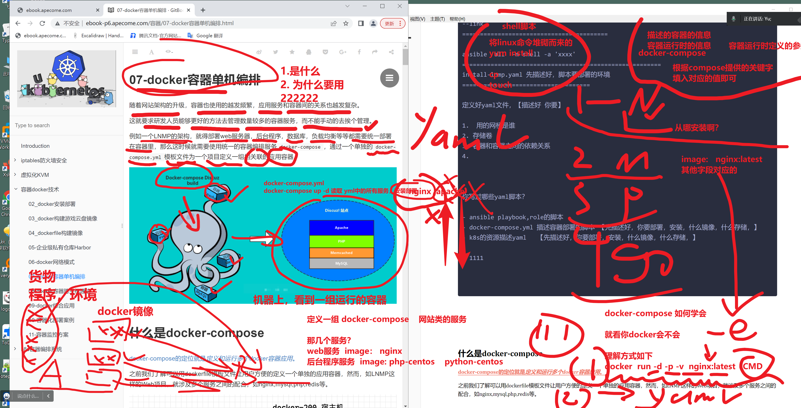


## 如何找到docker官网的资料

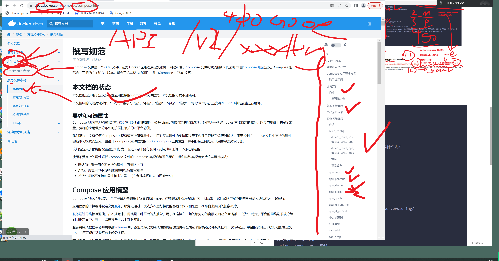


## 所有高级软件，最精准的资料都是这么找

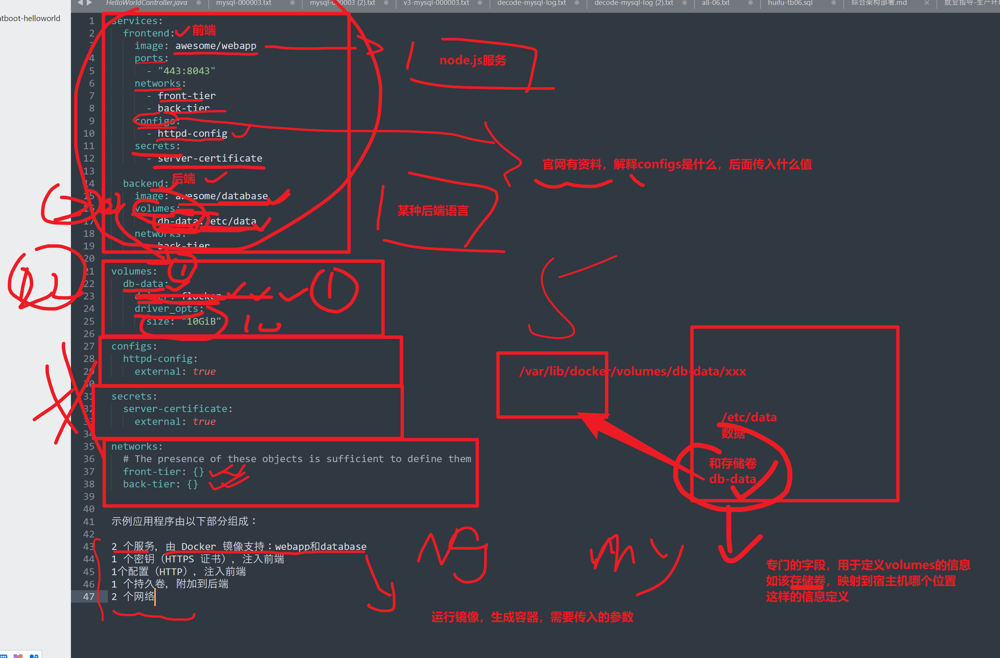


## 如何查官网资料，理解字段如何写

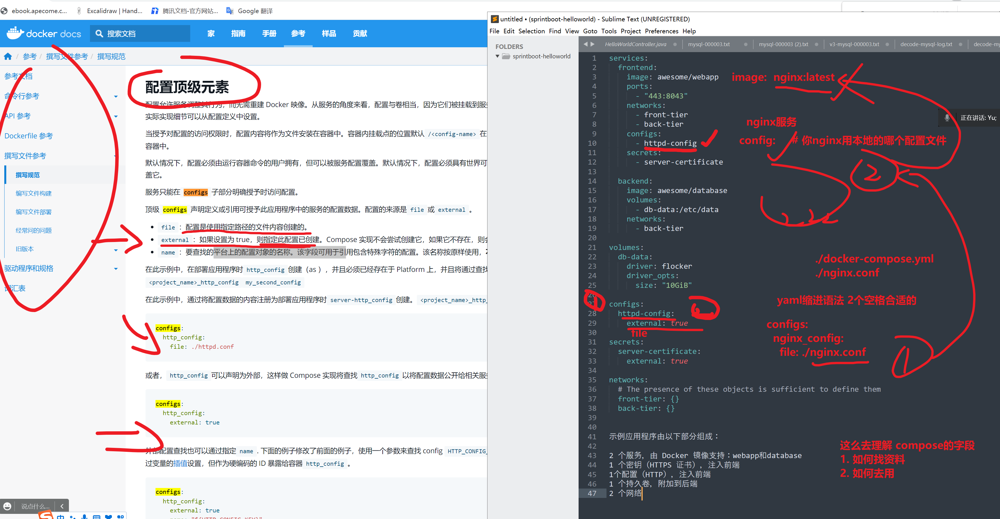


10.24


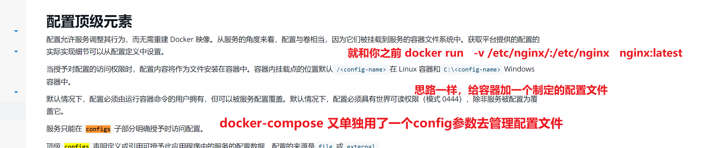


## 如何查阅官网的docker-compose字段


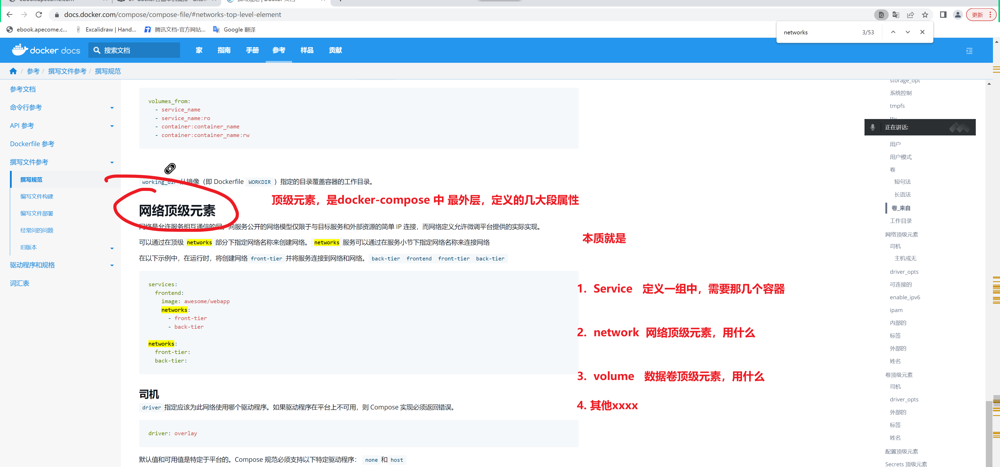


## 如何转化理解，将docker的手工运行，转为yaml


```

lnmp ，公司的，php后端的，员工管理系统 ， 部署到容器里

nginx  ,php,mysql, 互相走主机名


1.    --name my-mysql
2.   --name  my-php    --link my-mysql
3.   --name  my-nginx  --link my-php 


docker run 挨个的运行 每一个容器的环境的环境

# 服务1，nginx，web服务，代理服务
# 现有的宿主机nginx运行环境，迁移到容器里去跑 /etc/nginx/


docker run -d   --name mynginx -p 80:80   -v  /etc/nginx/:/etc/nginx   -v /var/log/nginx:/var/log/nginx   nginx:1.17.1 


# 服务2，php服务，提供后端服务
# 先基于dockerfile构建号，php+centos环境，myphp


docker run -d --name  myphp  -v 宿主机目录:容器内要暴露给外部的数据  myphp


1.捋清楚启动容器的顺序-----------你写yaml，。中服务的依赖关系定义
2. 容器启动的参数，如网络，数据卷，端口暴露，这就是 对每一个制定的服务，设置的参数


```


# 下一步学k8s也是这样，官网资料，没有之一最完美。


## 1. 如何用docker-compose

````
1. 定义你的一组容器的关系
nginx
php
mysql
redis

yaml语法该如何写，有哪些字段？该用什么语法？缩进的关系是什么呢？
看官网
关于compose-yaml的官网首页
https://docs.docker.com/compose/compose-file/


https://docs.docker.com/compose/compose-file/compose-versioning/


2. 运行创建一组容器
docker-compose up   参数
````


## 安装docker-compose

```
curl -L https://github.com/docker/compose/releases/download/1.29.2/docker-compose-`uname -s`-`uname -m` > /usr/local/bin/docker-compose

[root@docker-200 ~]#file /usr/local/bin/docker-compose 
/usr/local/bin/docker-compose: ELF 64-bit LSB shared object, x86-64, version 1 (SYSV), dynamically linked (uses shared libs), for GNU/Linux 3.2.0, BuildID[sha1]=3507aa01d32c34dc8e8c6462b764adb90a82768d, stripped


[root@docker-200 ~]#docker-compose --version
docker-compose version 1.29.2, build 5becea4c


```


## docker-compose命令整理

```
# 默认使用docker-compose.yml构建镜像
$ docker-compose build
$ docker-compose build --no-cache # 不带缓存的构建

# 指定不同yml文件模板用于构建镜像
$ docker-compose build -f docker-compose1.yml

# 列出Compose文件构建的镜像
$ docker-compose images                          

# 启动所有编排容器服务
$ docker-compose up -d

# 查看正在运行中的容器
$ docker-compose ps 

# 查看所有编排容器，包括已停止的容器
$ docker-compose ps -a

# 进入指定容器执行命令
$ docker-compose exec nginx bash 
$ docker-compose exec web python manage.py migrate --noinput

# 查看web容器的实时日志
$ docker-compose logs -f web

# 停止所有up命令启动的容器
$ docker-compose down 

# 停止所有up命令启动的容器,并移除数据卷
$ docker-compose down -v

# 重新启动停止服务的容器
$ docker-compose restart web

# 暂停web容器
$ docker-compose pause web

# 恢复web容器
$ docker-compose unpause web

# 删除web容器，删除前必需停止stop web容器服务
$ docker-compose rm web  

# 查看各个服务容器内运行的进程 
$ docker-compose top     

# 合集命令
build
config -q
create
down
events
exec
help
images
kill
logs
pause
restart
rm
run
scale
start
stop
top
unpause
up
```


## docker-compose语法

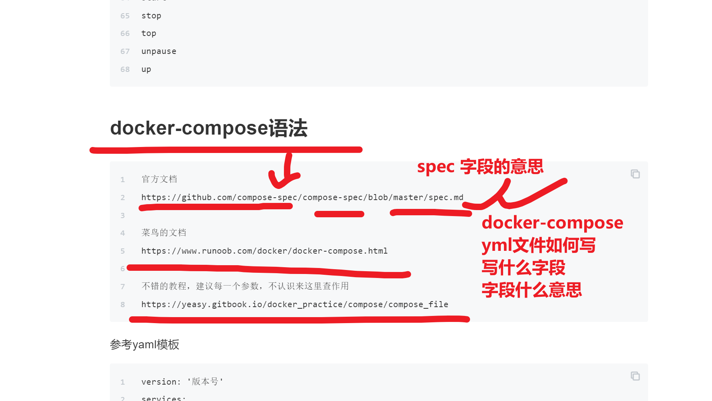


```
官方文档

#
https://docs.docker.com/compose/compose-file/


菜鸟的文档
https://www.runoob.com/docker/docker-compose.html


不错的教程，建议每一个参数，不认识来这里查作用
https://yeasy.gitbook.io/docker_practice/compose/compose_file


一台服务器，200个容器实例 

```


## 先看一个简单的模板，理解语法

```
不可能上来就从头写 yaml

shell脚本

1. 多看
2. 多模仿
3. 熟练看懂较多脚本之后，理解大部分的字段，是什么作用，缩进关系，以及改写什么参数，以及遇见不认识的参数，去哪找资料，


4. 模仿改造为你自己的脚本，【如智能汽车运行系统】，跑起来，ubuntu里面。。
【wordpres运行系统】


# docker-compose  v3 三代版本，能用最新的字段

    
    


docker-compose.yml


```

## 如何理解yml的元素关系，以及作用


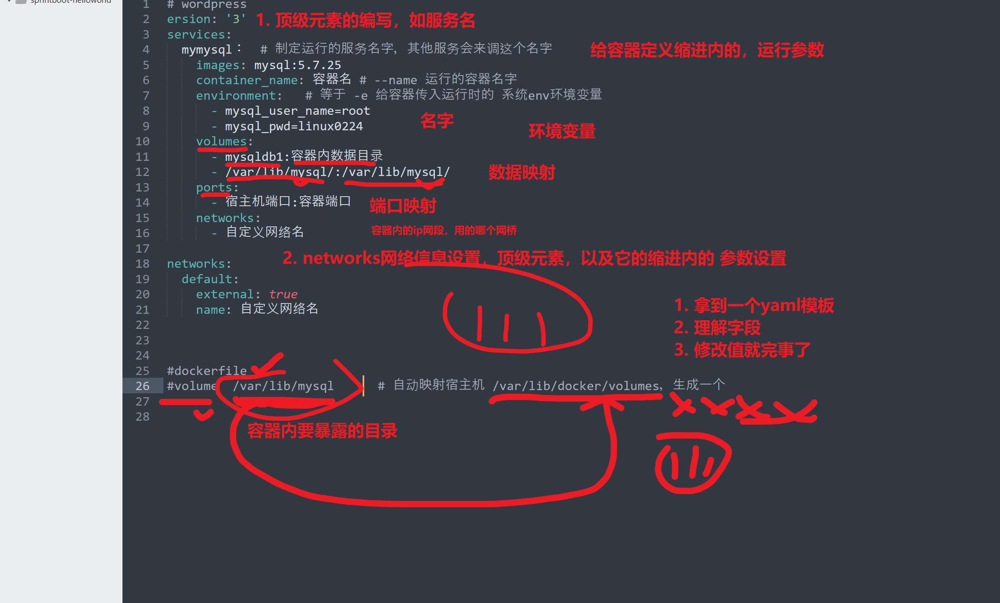


# 1.案例1：部署python应用

centos+flask  容器

redis容器


提供一个 网站程序，刷新一次，看到页面计数器+1

  

```perl
docker run  xxx
docker run   xxx
容器实例

↓
改造为 yaml，描述 容器与容器之间的关系

# 规范写法
1. 定义好目录，准备源码，配置文件，docker-compose.yml

- 模拟开发，准备好源码程序
- python程序运行环境 ，运维一定要懂部署这个环节
[root@docker-200 /compose-all/flask-redis]#cat flask-redis.py

from flask import Flask
from redis import Redis

app = Flask(__name__)
redis = Redis(host='redis', port=6379)

@app.route('/')
def hello():
    count = redis.incr('dianji')
    return 'linux0224 学习 docker-compose中，运行flask程序 , 这个页面被点击了 {} 次\n'.format(count)

if __name__ == "__main__":
    app.run(host="0.0.0.0", debug=True)


文件2，python程序的 依赖模块文件
cat > requirements.txt <<'EOF'
flask
redis
EOF


2. 准备运行环境的设置，docker-compose.yml

2.1 先构建好本地镜像
cat > Dockerfile <<'EOF'
FROM python:3.9.7
MAINTAINER linux0224
COPY flask-redis.py /opt
COPY requirements.txt /opt
WORKDIR /opt
RUN pip3 install --upgrade pip -i https://pypi.douban.com/simple
RUN pip3 install -r requirements.txt -i https://pypi.douban.com/simple
EOF

2.2 查看镜像

[root@docker-200 /compose-all/flask-redis]#docker history my-flask-redis:latest 

[root@docker-200 /compose-all/flask-redis]#docker images my-flask-redis
REPOSITORY       TAG       IMAGE ID       CREATED              SIZE
my-flask-redis   latest    3c2066a34a73   About a minute ago   937MB


3.准备你的docker-compose.yml ，容器编排脚本文件，描述容器和容器之间的运行参数，运行关系


3.1 给你的flask应用，单独创建个网桥
[root@docker-200 /compose-all/flask-redis]#docker network create --subnet='192.168.17.0/24' --gateway='192.168.17.254'  my-flask-net
8bc6a228adcb8f6d588b8ce986e77536c5f1d7b088eb5c8317080b9aef640b94

[root@docker-200 /compose-all/flask-redis]#docker inspect my-flask-net


```


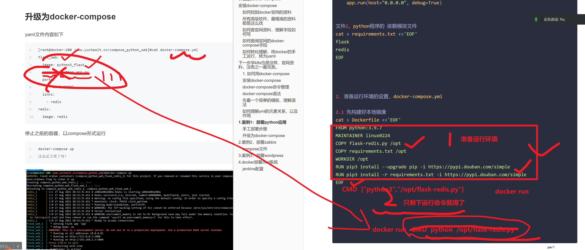


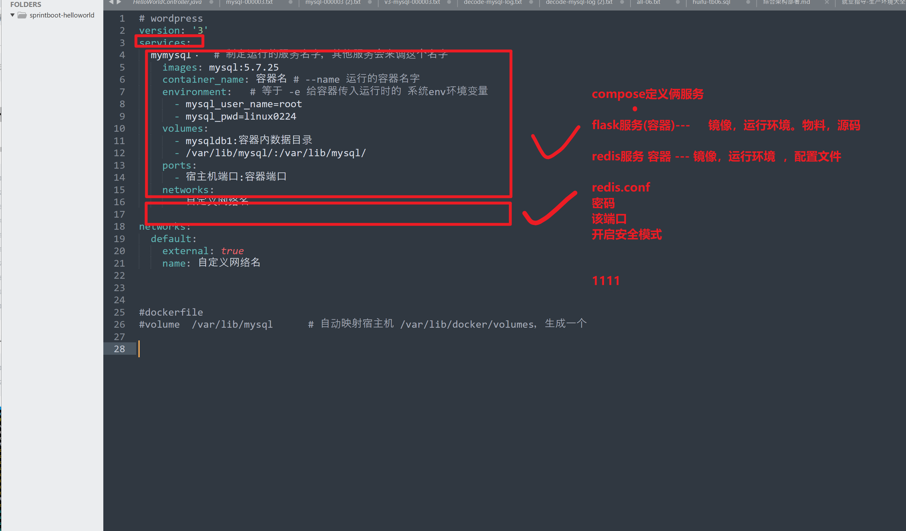


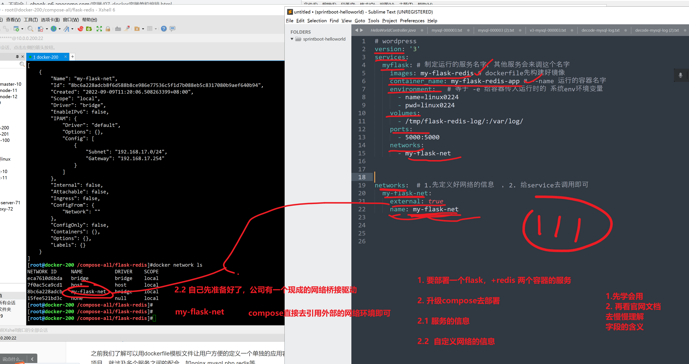

### 执行compose文件，去创建flask+redis的两个容器，服务，以及自定义网络的运行环境

还差了很多东西。

你再公司部署compose环境，就是一步步调试而来，学会如何调试


查看command如何用字段的文档

https://docs.docker.com/compose/compose-file/#command


1.欠缺flask的运行命令

2.欠缺flask链接redis容器的代码中用的主机名，是redis

查看服务和服务之间的依赖参数文档

https://docs.docker.com/compose/compose-file/#depends_on


先启动redis

flask再去依赖它


```
[root@docker-200 /compose-all/flask-redis]#cat docker-compose.yml 
# wordpress
version: '3'
services:
  myflask: # 制定运行的服务名字，其他服务会来调这个名字
    image: my-flask-redis # dockerfile先构建好镜像
    container_name: my-flask-redis-app # --name 运行的容器名字
    environment:   # 等于 -e 给容器传入运行时的 系统env环境变量  
      - name=linux0224
      - pwd=linux0224
    volumes:
      - /tmp/flask-redis-log/:/var/log/
    ports:
      - 5000:5000
    command: ["python3","/opt/flask-redis.py"]
    networks:
      - my-flask-net
    
  redis:
    image: redis:latest
    container_name: my-redis 
    environment:
      - redis_name=redis5
    ports:
      - 6379:6379
    networks:
      - my-flask-net


networks:  # 1.先定义好网络的信息  ，2. 给service去调用即可
  my-flask-net:  # 宿主机网络的驱动类型
    external: true  # 调用外部的网络环境
    name: my-flask-net  #具体网络驱动的名字

# 看懂1111


# compose 将你 docker run 运行参数，改为描述文件
#  docker run --network = 网桥
# docker run --network=host
[root@docker-200 /compose-all/flask-redis]#

```


检查语法、执行创建俩容器

```
[root@docker-200 /compose-all/flask-redis]#docker-compose config -q


```

## v2调整版compose文件


```yaml
version: '3'
services:
  myflask: # 制定运行的服务名字，其他服务会来调这个名字
    image: my-flask-redis # dockerfile先构建好镜像
    container_name: my-flask-redis-app # --name 运行的容器名字
    environment:   # 等于 -e 给容器传入运行时的 系统env环境变量  
      - name=linux0224
      - pwd=linux0224
    volumes:
      - /tmp/flask-redis-log/:/var/log/
    ports:
      - 5000:5000
    command: ["python3","/opt/flask-redis.py"]
    networks:
      - my-flask-net
    depends_on:
      - redis

  redis:
    image: redis:latest
    container_name: redis 
    environment:
      - redis_name=redis5
    ports:
      - 6379:6379
    networks:
      - my-flask-net


networks:  # 1.先定义好网络的信息  ，2. 给service去调用即可
  my-flask-net:  # 宿主机网络的驱动类型
    external: true  # 调用外部的网络环境
    name: my-flask-net  #具体网络驱动的名字
```


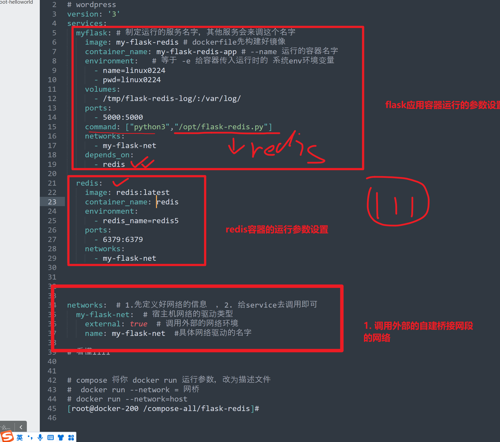


## 确认运行成功

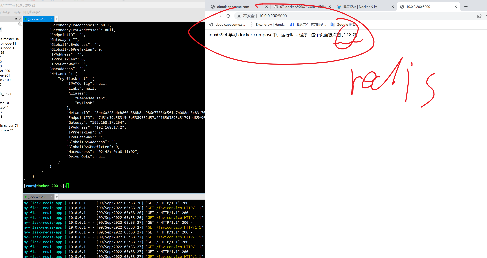


## 检查容器内设置信息

```

```


## ====作业，练习docker-compose生产产品部=====

```
1. 练习jumpserver容器化部署，去官网找资料
https://docs.jumpserver.org/zh/master/install/setup_by_fast/

2.将spug跑起来
https://spug.cc/docs/install-docker


1. 看人家docker-compose怎么写，理解语法

2. 运行起来的容器，内部信息，如环境变量，存储卷，如后端应用进程，如配置文件


```


# 2.案例2，部署docker-compopose部署zabbix

12.10继续


## compose文件

```
获取zabbix-compose的脚本

升级compose复杂编排

1. 你可以自己去官网，获取复杂得去琢磨部署逻辑
https://github.com/zabbix/zabbix-docker


```

## 自己写zabbix-compose文件


### 解决权限问题

```
给映射的mysql数据目录，给个用户 mysql 2000
[root@docker-200 /compose-all/zabbix-linux0224]#useradd -u 2000 -M -s /sbin/nologin mysql
[root@docker-200 /compose-all/zabbix-linux0224]#
[root@docker-200 /compose-all/zabbix-linux0224]#chown -R mysql.mysql /data/


```


```yaml
version: '3'                               #内容填3或者2
services:
  mysql:                                        #服务名称 
    image: mysql:5.7                            #镜像名称
    container_name: mysql                       #容器名称
    user: 2000:2000                             #指定用户
    environment:                                #服务所需的操作
      - "MYSQL_ROOT_PASSWORD=linux0224"
      - "MYSQL_DATABASE=zabbix"
      - "MYSQL_USER=zabbix"
      - "MYSQL_PASSWORD=zabbixlinux0224"
    volumes:
      - "/data/docker_mysql:/var/lib/mysql"     #映射的数据目录
    ports:
      - "3306:3306"                             #映射端口
    command:                                    #所需的命令，这里指指定字符集
      --character-set-server=utf8 
      --collation-server=utf8_bin

  zabbix-server-mysql:
    image: zabbix/zabbix-server-mysql
    container_name: zabbix-server-mysql
    environment:
      - "DB_SERVER_HOST=mysql"
      - "MYSQL_USER=zabbix"
      - "MYSQL_PASSWORD=zabbixlinux0224"
    ports:
      - "10051:10051"
    depends_on:                                      #需要链接的服务，link换成了depends_on
      - mysql 

  zabbix-web-nginx-mysql:
    image: zabbix/zabbix-web-nginx-mysql
    container_name: zabbix-web-nginx-mysql
    environment:
      - "DB_SERVER_HOST=mysql"
      - "MYSQL_USER=zabbix"
      - "MYSQL_PASSWORD=zabbixlinux0224"
      - "ZBX_SERVER_HOST=zabbix-server-mysql"
      - "PHP_TZ=Asia/Shanghai"
    ports:
      - "80:8080"
    depends_on:
      - mysql
      - zabbix-server-mysql

networks:
  deault:
    external: true
    name: zabbix-net
```


## 运行创建docker-compose所有容器组

```[root@docker-200 /compose-all/zabbix-all]#mv zabbix.yml docker-compose.yml
[root@docker-200 /compose-all/zabbix-all]#
[root@docker-200 /compose-all/zabbix-all]#
[root@docker-200 /compose-all/zabbix-all]#docker-compose config -q
[root@docker-200 /compose-all/zabbix-all]#
[root@docker-200 /compose-all/zabbix-linux0224]#docker-compose up -d
WARNING: Some networks were defined but are not used by any service: deault
Creating network "zabbix-linux0224_default" with the default driver
Creating mysql ... done
Creating zabbix-server-mysql ... done
Creating zabbix-web-nginx-mysql ... done
[root@docker-200 /compose-all/zabbix-linux0224]#


# 创建网络资源，以当前文件夹命名，创建network环境

以及创建容器运行

```


## 停止，docker-compose容器组

```
docker-compose stop

默认都找当前
[root@docker-200 /compose-all/zabbix-all]#ls
docker-compose.yml

```


## 危险命令，停止且移除compose定义的资源

```
docker-compose down 
[root@docker-200 /compose-all/zabbix-all]#ls
docker-compose.yml

```


## 、用compose命令查看容器组信息

```
[root@docker-200 /compose-all/zabbix-linux0224]#docker-compose stop
WARNING: Some networks were defined but are not used by any service: deault
Stopping zabbix-web-nginx-mysql ... done
Stopping zabbix-server-mysql    ... done
[root@docker-200 /compose-all/zabbix-linux0224]#
[root@docker-200 /compose-all/zabbix-linux0224]#
[root@docker-200 /compose-all/zabbix-linux0224]#
[root@docker-200 /compose-all/zabbix-linux0224]#
[root@docker-200 /compose-all/zabbix-linux0224]#docker-compose start
WARNING: Some networks were defined but are not used by any service: deault
Starting mysql                  ... done
Starting zabbix-server-mysql    ... done
Starting zabbix-web-nginx-mysql ... done
[root@docker-200 /compose-all/zabbix-linux0224]#docker-compose ps
WARNING: Some networks were defined but are not used by any service: deault
         Name                       Command               State                          Ports                       
---------------------------------------------------------------------------------------------------------------------
mysql                    docker-entrypoint.sh --cha ...   Up      0.0.0.0:3306->3306/tcp,:::3306->3306/tcp, 33060/tcp
zabbix-server-mysql      /sbin/tini -- /usr/bin/doc ...   Up      0.0.0.0:10051->10051/tcp,:::10051->10051/tcp       
zabbix-web-nginx-mysql   docker-entrypoint.sh             Up      0.0.0.0:80->8080/tcp,:::80->8080/tcp, 8443/tcp     
[root@docker-200 /compose-all/zabbix-linux0224]#

```


# 删除compose容器组信息

```
[root@docker-200 /compose-all/zabbix-linux0224]#
[root@docker-200 /compose-all/zabbix-linux0224]#docker-compose down

```


12. 46继续


## 解释自己写的zabbix-yaml


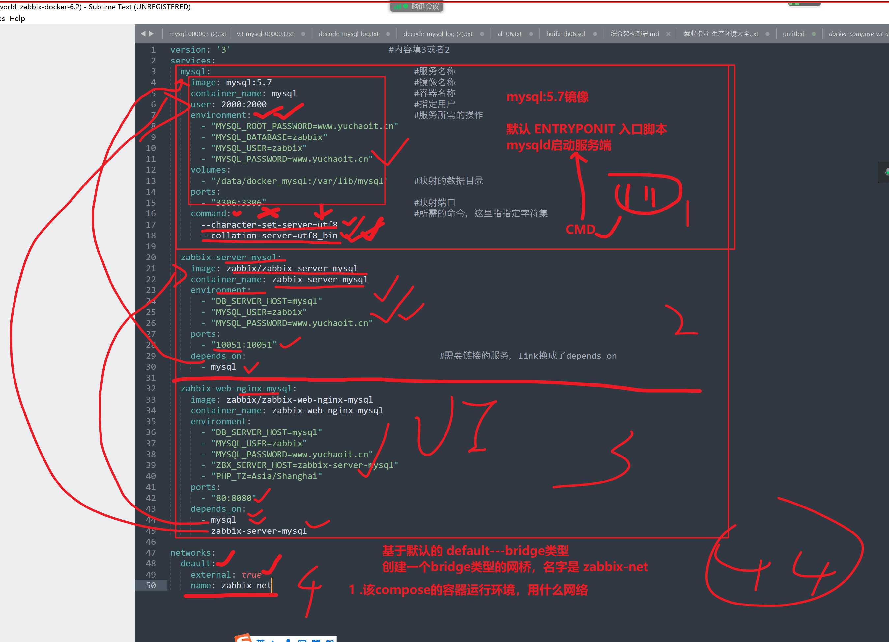


# 3.案例3，部署wordpress

使用的是第三代compose版本语法，有些旧的参数就不适用了。


```yaml
version: "3"
services:
   db:
     image: mysql:8.0
     command:
     # 给哪个命令传递的？docker run mysql:8.0   mysqld   --参数1 --参数2 --参数3
     # mysql8.0 5.7 密码加密插件
      - --default_authentication_plugin=mysql_native_password
      - --character-set-server=utf8mb4
      - --collation-server=utf8mb4_unicode_ci
     volumes:
       - db_data:/var/lib/mysql
     restart: always
     # 给系统设置一个环境变量，env可以查询到
     # 部署脚本读取
     environment:
       MYSQL_ROOT_PASSWORD: www.yuchaoit.cn
       MYSQL_DATABASE: wordpress
       MYSQL_USER: wordpress
       MYSQL_PASSWORD: www.yuchaoit.cn
# 听懂db 服务yaml解释，1111
# jumpserver spug跑起来 
# 还有课程练习题
   wordpress:
     depends_on:
       - db
     image: wordpress:latest
     ports:
       - "8000:80"
     restart: always
     environment:
       WORDPRESS_DB_HOST: db:3306
       WORDPRESS_DB_USER: wordpress
       WORDPRESS_DB_PASSWORD: www.yuchaoit.cn
# 顶级元素先定义存储卷的名
volumes:
  db_data:  
```


创建yml，运行结果

```
[root@docker-200 /compose-all/wordpress-compose]#docker-compose -f wordpress.yml  up -d  # kandong 111
Creating network "wordpress-compose_default" with the default driver
Creating volume "wordpress-compose_db_data" with default driver
Pulling db (mysql:8.0)...
8.0: Pulling from library/mysql
72a69066d2fe: Already exists
93619dbc5b36: Already exists
99da31dd6142: Already exists
626033c43d70: Already exists
37d5d7efb64e: Already exists
ac563158d721: Already exists
d2ba16033dad: Already exists
688ba7d5c01a: Pull complete
00e060b6d11d: Pull complete
1c04857f594f: Pull complete
4d7cfa90e6ea: Pull complete
e0431212d27d: Pull complete
Digest: sha256:e9027fe4d91c0153429607251656806cc784e914937271037f7738bd5b8e7709
Status: Downloaded newer image for mysql:8.0
Creating wordpress-compose_db_1 ... done
Creating wordpress-compose_wordpress_1 ... done

```


## 分析，查看结果

```
[root@docker-200 /compose-all/wordpress-compose]#docker inspect wordpress-compose_default 


# 自建数据卷的信息
[root@docker-200 /compose-all/wordpress-compose]#docker-compose -f wordpress.yml ps
            Name                           Command               State                  Ports                
-------------------------------------------------------------------------------------------------------------
wordpress-compose_db_1          docker-entrypoint.sh --def ...   Up      3306/tcp, 33060/tcp                 
wordpress-compose_wordpress_1   docker-entrypoint.sh apach ...   Up      0.0.0.0:8000->80/tcp,:::8000->80/tcp
[root@docker-200 /compose-all/wordpress-compose]#
[root@docker-200 /compose-all/wordpress-compose]#
[root@docker-200 /compose-all/wordpress-compose]#docker inspect wordpress-compose_db_1 

# 容器内，暴露的数据卷
            "Volumes": {
                "/var/lib/mysql": {}
            },

# 挂在再外部的信息
 },
        "Mounts": [
            {
                "Type": "volume",  # 卷的类型
                "Name": "wordpress-compose_db_data",
                "Source": "/var/lib/docker/volumes/wordpress-compose_db_data/_data",
                "Destination": "/var/lib/mysql",
                "Driver": "local",
                "Mode": "rw",
                "RW": true,
                "Propagation": ""
            }
        ],


# volume 类型解释
# volume   容器内的数据，映射到宿主机的 /var/lib/docker/volumes/卷的名字
# bind类型   docker run -v 宿主机目录:容器目录

#  1111
```


# 4.docker部署cicd系统

## jenkins+gitlab组合compose文件


```yaml
version: '3'
services:
  jenkins:
    image: 'jenkins/jenkins:latest'
    container_name: jenkins 
    restart: always
    privileged: true
    user: root
    ports:
      - '8080:8080'
      - '50000:50000'
    volumes:
      - '/data/jenkins:/var/jenkins_home'
      - '/var/run/docker.sock:/var/run/docker.sock'
      - '/usr/bin/docker:/usr/bin/docker'
      - '/root/.ssh:/root/.ssh'
  gitlab:
    image: 'gitlab/gitlab-ce:latest'
    restart: always
    hostname: 'www.yuchaoit.cn'
    environment:
      GITLAB_OMNIBUS_CONFIG: |
        external_url 'http://10.0.0.200'
        gitlab_rails['gitlab_shell_ssh_port'] = 2222
        alertmanager['enable'] = false
        grafana['enable'] = false
        prometheus['enable'] = false
        node_exporter['enable'] = false
        redis_exporter['enable'] = false
        postgres_exporter['enable'] = false
        pgbouncer_exporter['enable'] = false
        gitlab_exporter['enable'] = false
    ports:
      - '9090:80'
      - '2222:22'
    volumes:
      - '/data/gitlab/config:/etc/gitlab'
      - '/data/gitlab/logs:/var/log/gitlab'
      - '/data/gitlab/data:/var/opt/gitlab'
```


换一个环境变量的简单写法

```yaml
version: '3'
services:
  jenkins:
    image: 'jenkins/jenkins:latest'
    container_name: jenkins 
    restart: always
    privileged: true
    user: root
    ports:
      - '8080:8080'
      - '50000:50000'
    volumes:
      - '/linux0224_data/jenkins/:/var/jenkins_home'
      - '/var/run/docker.sock:/var/run/docker.sock'
      - '/usr/bin/docker:/usr/bin/docker'
      - '/root/.ssh:/root/.ssh'
  gitlab:
    image: 'gitlab/gitlab-ce:latest'
    restart: always
    hostname: 'www.yuchaoit.cn'
    environment:
      GITLAB_OMNIBUS_CONFIG: |
        external_url 'http://10.0.0.200'
        gitlab_rails['gitlab_shell_ssh_port'] = 2222
        alertmanager['enable'] = false
        grafana['enable'] = false
        prometheus['enable'] = false
        node_exporter['enable'] = false
        redis_exporter['enable'] = false
        postgres_exporter['enable'] = false
        pgbouncer_exporter['enable'] = false
        gitlab_exporter['enable'] = false
    ports:
      - '9090:80'
      - '2222:22'
    volumes:
      - '/data/gitlab/config:/etc/gitlab'
      - '/data/gitlab/logs:/var/log/gitlab'
      - '/data/gitlab/data:/var/opt/gitlab'
```

解决该疑问的思路

1.基于上述的语法，先创建好容器，然后再去看GITLAB_OMNIBUS_CONFIG

2.再去思考如何改造这个写法

## 图解yaml作用

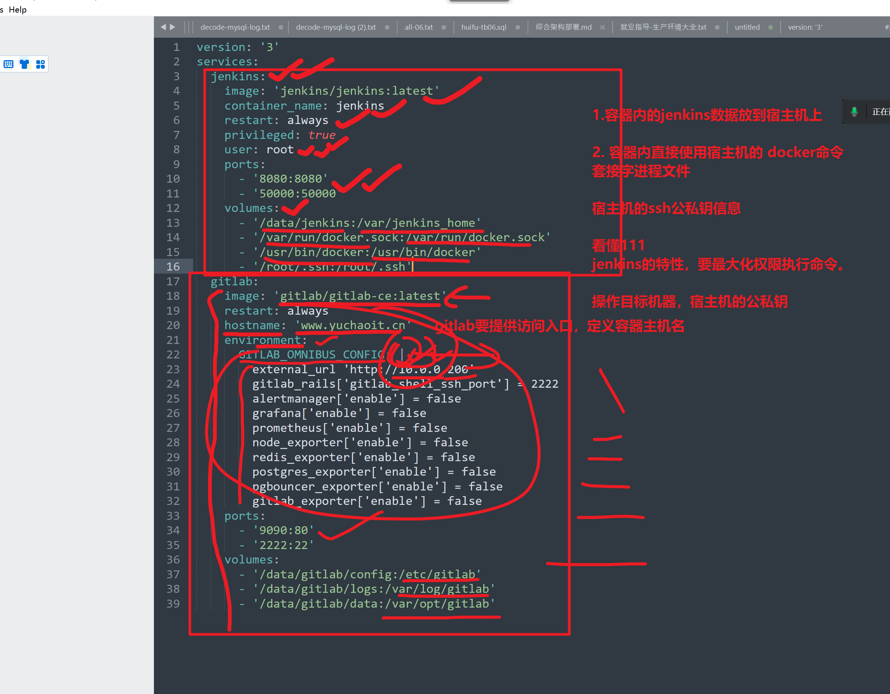


## 创建jenkins，gitlab容器组运行

```
[root@docker-200 /compose-all/cicd]#docker-compose ps
    Name                   Command                       State                                                   Ports                                         
---------------------------------------------------------------------------------------------------------------------------------------------------------------
cicd_gitlab_1   /assets/wrapper                  Up (health: starting)   0.0.0.0:2222->22/tcp,:::2222->22/tcp, 443/tcp, 0.0.0.0:9090->80/tcp,:::9090->80/tcp   
jenkins         /sbin/tini -- /usr/local/b ...   Up                      0.0.0.0:50000->50000/tcp,:::50000->50000/tcp, 0.0.0.0:8080->8080/tcp,:::8080->8080/tcp
[root@docker-200 /compose-all/cicd]#

```


## 批量编排，查看容器组的日志

```
# docker-compose.yml 
#描述即服务
# 先定义好yaml文件，业务的容器组信息，都在这里
# 下一步的k8s也是如此。
#yaml是核心


docker-compose logs -f docker-compose.yml


```


## 用jenkins创建一个容器

最大权限，且映射宿主机的docker socket接口

```
Started by user admin
Running as SYSTEM
Building in workspace /var/jenkins_home/workspace/docker-nginx
[docker-nginx] $ /bin/sh -xe /tmp/jenkins8542799331025195030.sh
+ docker run -d --name wuyifan-nginx -v /tmp/wuyifan-log:/var/log/nginx/ nginx:latest
c621d70ccceb5bba6786a7bdf60e3111d205a4e696d133dd04d15f17e7abf69c
Finished: SUCCESS

```


## gitlab运行


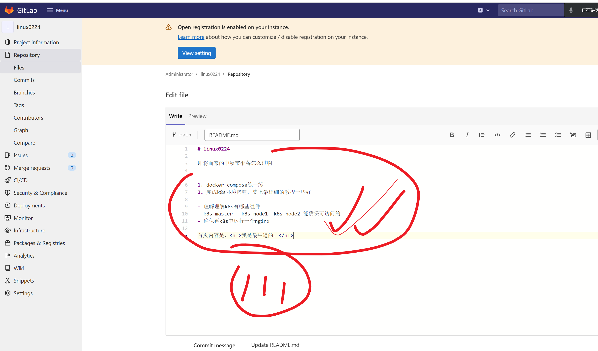


## 容器化构建，jenkins，gitlab，执行docker创建命令测试

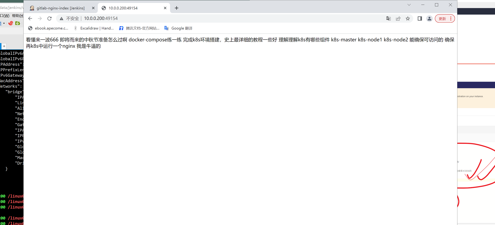


