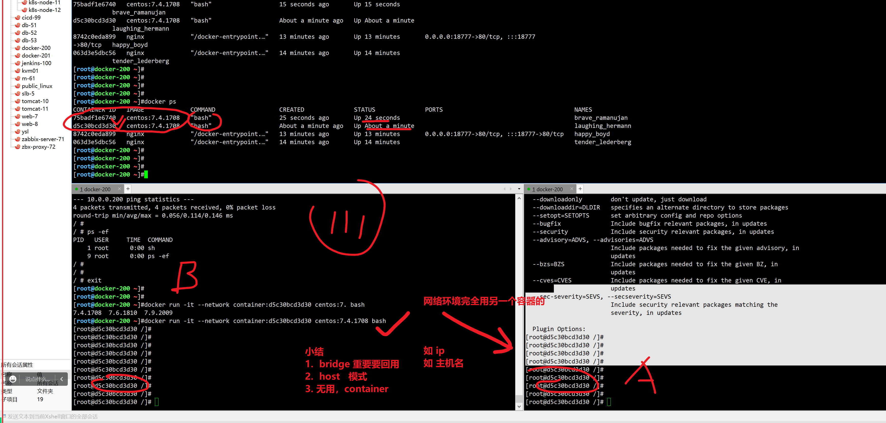

```### 此资源由 58学课资源站 收集整理 ###
	想要获取完整课件资料 请访问：58xueke.com
	百万资源 畅享学习

```
# docker网络

```
[root@docker-200 ~]#docker inspect linux0224_registry

```

## 测一测你本地单机的所有容器，的ip

```
[root@docker-200 ~]#docker inspect --format='{{.Name}} - {{range .NetworkSettings.Networks}}{{.IPAddress}}{{end}}' $(docker ps -aq)  | column -t
/sleepy_poincare     -
/linux0224_registry  -  172.17.0.2
/distracted_mendel   -
/nginx               -
/harbor-jobservice   -  172.22.0.3
/harbor-core         -  172.22.0.8
/redis               -  172.22.0.7
/registry            -  172.22.0.5
/harbor-db           -  172.22.0.2
/harbor-portal       -  172.22.0.6
/registryctl         -  172.22.0.9
/harbor-log          -  172.22.0.4


```


## 查看现有容器环境，和网桥的关系


```
2个桥， =======DRIVE=====bridge==========

网络驱动类型====bridge

查看容器有几座桥（容器网络，创建网桥）？


docker network ls


[root@docker-200 ~]#docker network ls
NETWORK ID     NAME                   DRIVER    SCOPE
d759d6afc28e   bridge                 bridge    local
a22b66f2f0c0   dockergitlab_default   bridge    local
e94e1740135d   harbor_harbor          bridge    local
7f0ac5ca9cd1   host                   host      local
15fee521bd3c   none                   null      local
5f10a2922758   root_default           bridge    local
859d85bb6186   tmp_default            bridge    local


几个容器网桥？ 5个

如何知道这5个网桥用的网段是？

docker查看资源信息的命令

docker inspect image xx

docker inspect container xx

docker inspect network  xx
```


### 查看当前主机所有网桥的网段信息

```
[root@docker-200 ~]#docker inspect  `docker network ls -q` |grep -i '"Subnet"'
                    "Subnet": "172.17.0.0/16",
                    "Subnet": "172.20.0.0/16",
                    "Subnet": "172.22.0.0/16",
                    "Subnet": "172.19.0.0/16",
                    "Subnet": "172.18.0.0/16",


# 后续的容器，制定用哪个网桥
```


## 再制定一个网桥去运行容器


11.51 继续


# Docker网络


我们使用容器，不单是运行单机程序，当然是需要运行网络服务在容器中，那么如何配置docker的容器网络，基础网络配置，网桥配置，端口映射，还是很重要。

## docker网络功能


## docker网络图解（面试背）

原理性的知识，需要用实践去证明，去理解。

```
1. docker0

2.  veth pair
```


## ----关于docker网络相关命令----

11.52继续


## 查看网桥


## 删除无用网桥


```
[root@docker-200 ~]#docker network rm  859d85bb6186 5f10a2922758
859d85bb6186
5f10a2922758
[root@docker-200 ~]#
[root@docker-200 ~]#docker network rm  859d85bb6186 5f10a2922758
Error: No such network: 859d85bb6186
Error: No such network: 5f10a2922758
[root@docker-200 ~]#
[root@docker-200 ~]#docker network prune 
WARNING! This will remove all custom networks not used by at least one container.
Are you sure you want to continue? [y/N] y
Deleted Networks:
harbor_harbor
dockergitlab_default


# 查看剩下的默认的docker网络环境信息

[root@docker-200 ~]#ip addr 


4: docker0: <NO-CARRIER,BROADCAST,MULTICAST,UP> mtu 1500 qdisc noqueue state DOWN group default 
    link/ether 02:42:ad:e8:ba:38 brd ff:ff:ff:ff:ff:ff
    inet 172.17.0.1/16 brd 172.17.255.255 scope global docker0
       valid_lft forever preferred_lft forever
    inet6 fe80::42:adff:fee8:ba38/64 scope link 
       valid_lft forever preferred_lft forever
[root@docker-200 ~]#

#查看宿主机的网桥信息


[root@docker-200 ~]#brctl show
bridge name	bridge id		STP enabled	interfaces
docker0		8000.0242ade8ba38	no	
```


## 为什么要学docker网络管理


# 容器访问控制


## 容器访问外部网络


```
vmware宿主机能帮 你做 数据转发


linux机器，和容器之间，数据数据包转

linux内核的tcp数据包转发支持  net.ipv4.ip_forward = 1

iptables功能  iptables -F

```


## 容器之间访问

```
走同一个网桥下，链接同一个网桥，就可以实现容器的网络通信

这个虚拟网桥

172.16.0.0 

172.16.2.2
172.16.2.3


```


# 1.Docker四种网卡模式(面试问)

## 图解4种默认的网络策略


第三方不谈


## --net 参数

```
说docker 有几种网络通信模式

```


## 查看docker的网络模式


## 查看docker0默认网桥


### 查看实际容器创建的虚拟网卡


## 查看端口映射与防火墙的关系


# 2.玩一玩bridge模式

## 容器桥接网络原理


## 2.1 创建容器，用自带的网桥，brdige，基于docker network 查看


```perl
[root@docker-200 ~]#docker run --name docker0-net    --network=00dafdbf4726   -it busybox sh


[root@docker-200 ~]#
[root@docker-200 ~]#docker run --name bride-net    --network=bridge   -it busybox sh
/ # 
/ # 
/ # 


# 自建docker网桥，以及定义局域网段，创建容器

===============================================================
# 再某个网络环境下，局域网段，不得冲突
# br-linux0224   --subnet 192.168.55.0/24 192.168.55.0/24  

这个网段下，只能跑  254个独立容器


--gateway 192.168.55.1   192.168.55.1 网关 

# 看懂  1111


192.168.55.2 容器
=============================================================

# br-linux0225   192.168.56.0/24   

同理如上


# 创建自建网桥

docker network create --driver bridge --subnet 192.168.55.0/24  --gateway 192.168.55.1 linux0224-net1

[root@docker-200 ~]#docker network ls
NETWORK ID     NAME             DRIVER    SCOPE
00dafdbf4726   bridge           bridge    local
7f0ac5ca9cd1   host             host      local
5ab8b0856f15   linux0224-net1   bridge    local
15fee521bd3c   none             null      local

[root@docker-200 ~]#brctl show
bridge name	bridge id		STP enabled	interfaces
br-5ab8b0856f15		8000.024247e06d14	no		
docker0		8000.0242ade8ba38	no		
[root@docker-200 ~]#
[root@docker-200 ~]#ifconfig 
br-5ab8b0856f15: flags=4099<UP,BROADCAST,MULTICAST>  mtu 1500
        inet 192.168.55.1  netmask 255.255.255.0  broadcast 192.168.55.255
        ether 02:42:47:e0:6d:14  txqueuelen 0  (Ethernet)
        RX packets 18  bytes 1080 (1.0 KiB)
        RX errors 0  dropped 0  overruns 0  frame 0
        TX packets 14  bytes 1008 (1008.0 B)
        TX errors 0  dropped 0 overruns 0  carrier 0  collisions 0


# 使用该网桥，运行容器了

docker run -it --network=linux0224-net1  busybox sh


=====================================================


=============================================================

docker network create --driver bridge --subnet 192.168.55.0/24  --gateway 192.168.55.1 linux0224-net1


1.网桥 名字  linux0224-net2  子网是  172.14.0.0/16  网关是 172.14.0.1

docker network create  --driver bridge --subnet 172.14.0.0/16  --gateway 172.14.0.1 linux0224-net2

如何查看该有哪些网桥
docker network ls
ifconfig
brctl show
ip addr


2.使用该网桥，运行容器

运行一个nginx容器，且对外11155访问，使用自建网桥，日志挂到宿主机的/tmp/nginx_log/

docker run --network=linux0224-net2  -d -p 11155:80 -v /tmp/nginx_log/:/var/log/nginx/  nginx

3. 查看容器的详细信息

数据卷信息  -v 的信息，显示到 docker inspect 的 mounts里面


端口信息
            "Ports": {
                "80/tcp": [
                    {
                        "HostIp": "0.0.0.0",
                        "HostPort": "11155"
                    },
[root@docker-200 ~]#


同理如上
```


## 桥接网络模式特点


### 桥接数据图


## =====下午3点继续====


下午内容

## 修改docker0默认的网桥配置

```
1. 先查看默认的docker0，网桥的网段信息
[root@docker-200 ~]##如何查看当前 docker0网段是多少
[root@docker-200 ~]#


[root@docker-200 ~]##如何查看当前 docker0网段是多少

docker network ls # 查出来的

[root@docker-200 ~]#docker inspect bridge

"Subnet": "172.17.0.0/16",
"Gateway": "172.17.0.1"


2.使用默认的docker0去创建个容器

busybox简单调试网络信息
快速创建容器，查看网络信息
进入容器内，看看docker0的网段信息


# 直接使用默认的网桥docker0，空口无凭

# 如何证明，容器用的哪个网桥


[root@docker-200 ~]#brctl show
bridge name	bridge id		STP enabled	interfaces
br-5ab8b0856f15		8000.024247e06d14	no		veth09af822
br-a0412ee1f5e5		8000.0242ed1d23c5	no		
docker0		8000.0242ade8ba38	no		veth541cf13

# ifconfig也的确看到，多了一个veth虚拟网络接口


==============================================
[root@docker-200 ~]#docker run -it  busybox

/ # ifconfig
eth0      Link encap:Ethernet  HWaddr 02:42:AC:11:00:02  
          inet addr:172.17.0.2  Bcast:172.17.255.255  Mask:255.255.0.0


```


```
brctl show

ip addr show 


# 更简便的办法，查看网桥，和容器的关系呢？

# 直接看网桥详细信息，或者容器的详细信息
# 基于容器信息看到关系
# 修改docker0网桥之间，容器记录 a99   172.17.0.2 zheg IP


[root@docker-200 ~]#docker inspect a99d78d85464 |grep  -i networks -A 2
        "NetworkSettings": {
            "Bridge": "",
            "SandboxID": "dfb497ddf3c426252b3267aeb312b07469107462bd04528b01a8b59177a27504",
--
            "Networks": {
                "bridge": {
                    "IPAMConfig": null,


# 查看网桥详细信息，有哪些容器再用它


[root@docker-200 ~]#docker inspect bridge 


# 公司对容器的网络环境有要求，网络部门给了其他网段的ip，说你们的容器环境，只能用和这个
# 192.168.15.0/24

# 你默认的docker0，得使用这个网段下的ip，容器创建的ip是这个局域网内的

# docker0作为默认网桥，得修改docker配置文件

[root@docker-200 ~]#cat /etc/docker/daemon.json 
{
  "bip":"192.168.15.1/24",
  "registry-mirrors": ["https://ms9glx6x.mirror.aliyuncs.com"],
  "insecure-registries":["http://10.0.0.200","http://10.0.0.200:5000"]

}
[root@docker-200 ~]#


# 重载docker配置
# 重启


[root@docker-200 ~]## 看懂修改docker0网段，以及运行2容器，生成2个veth虚拟接口，以及直接访问新的ip  192.168.15.3:80 看懂333
[root@docker-200 ~]#
[root@docker-200 ~]#


```


## ====host模式，原理，背诵=====

16继续

```
1.  hosts启动的容器，没有自己的网卡，ip信息，直接用宿主机的
2.  但是除了network网络空间，其他如进程，文件系统，还是容器自己的
3.  通过参数 --network host 开启
4.  host模式，没有端口映射功能
5.  直接使用宿主机的网络环境，因此网络性能更高一筹。
```


创建容器，使用host网络模式

```
[root@docker-200 ~]#docker run -d --network=host nginx
063d3e5dbc563d71f396fff608f3240fc83feac49406166e57e1e3aecb7904d4
[root@docker-200 ~]#

```


## container模式




```
1. container模式的容器是
容器A使用另一个已存在的容器B，共享它的网络空间

# 1.先准备好一个容器A
# 容器A用的是默认的 bridge网桥

[root@docker-200 ~]#docker ps
CONTAINER ID   IMAGE     COMMAND                  CREATED         STATUS         PORTS                                     NAMES
8742c0eda899   nginx     "/docker-entrypoint.…"   6 minutes ago   Up 6 minutes   0.0.0.0:18777->80/tcp, :::18777->80/tcp   happy_boyd


2.创建新容器，制定用容器A的网络环境


```


## None模式

```
1.None模式是不创建任何网络信息，这个模式几乎不用。

2.若是给none模式的容器创建网络环境，得自己基于ip命令去创建网络名称空间，操作较为复杂。


创建一个容器，有独立的文件系统，进程空间，用户空间，完全没有网络空间
如果要自己定制网络环境

1. 先创建网络名称空间
2. 再创建网络接口
3. 再创建ip信息等


```


### 今天作业

听懂今天docker单机网络管理，刷1111

回去练习。


整理

1.docker网络管理玩法

2.预习docker-compose下一篇博客


## ====上午小结====

1. 为什么要学docker网络管理，容器是要对外提供访问服务的，以及容器所处的网络环境，ip从哪获取的
2. docker network命令管理，brctl命令
3. 如何理解docker网桥，虚拟网络接口veth
4. 自建docker网桥，设置子网，网关


查看上午创建的所有网桥信息

```
加强说，ifconfig   ，br-自己建网桥id

查出2个网桥接口
[root@docker-200 ~]#ifconfig  |grep br-
br-5ab8b0856f15: flags=4099<UP,BROADCAST,MULTICAST>  mtu 1500
br-a0412ee1f5e5: flags=4163<UP,BROADCAST,RUNNING,MULTICAST>  mtu 1500


# 基于过滤器参数，查找网桥相关的接口
[root@docker-200 ~]#docker network ls --filter driver=bridge
NETWORK ID     NAME             DRIVER    SCOPE
00dafdbf4726   bridge           bridge    local  # 是默认的docker0
5ab8b0856f15   linux0224-net1   bridge    local
a0412ee1f5e5   linux0224-net2   bridge    local


#brctl命令

[root@docker-200 ~]#brctl show | column -t
bridge           name               bridge  id           STP  enabled  interfaces
br-5ab8b0856f15  8000.024247e06d14  no
br-a0412ee1f5e5  8000.0242ed1d23c5  no      vethffee987
docker0          8000.0242ade8ba38  no
[root@docker-200 ~]#


# 分析，为何 br-a04xxxx  这个网桥，只有它有一个 interfaces网络接口，vethffee987

1。查看当前容器进程
[root@docker-200 ~]#docker ps -q
26f8ce308859


2.查看该容器的网络信息
[root@docker-200 ~]#docker inspect 26f8ce308859 --format="{{.NetworkSettings.Networks}}"
map[linux0224-net2:0xc00065e000]
=========================================================
也就是如下信息
            "Networks": {
                "linux0224-net2": {
                    "IPAMConfig": null,
                    "Links": null,
                    "Aliases": [
                        "26f8ce308859"
                    ],
                    "NetworkID": "a0412ee1f5e57a69262c1619625a4de1b04e1e212c016cead532260620913a32",
                    "EndpointID": "485d438d855e7bc7b1e5c719b27b1672819c10edec43b58e4c42d2336ce26b26",
                    "Gateway": "172.14.0.1",
                    "IPAddress": "172.14.0.2",
                    "IPPrefixLen": 16,
                    "IPv6Gateway": "",
                    "GlobalIPv6Address": "",
                    "GlobalIPv6PrefixLen": 0,
                    "MacAddress": "02:42:ac:0e:00:02",
                    "DriverOpts": null

================================================

当前运行中的容器，使用网络配置是 ，名字为 linux0224-net2 的网桥
a0412ee1f5e5   linux0224-net2   bridge    local


[root@docker-200 ~]#docker network ls --filter name=linux0224-net2
NETWORK ID     NAME             DRIVER    SCOPE
a0412ee1f5e5   linux0224-net2   bridge    local

# 查看网桥和容器的关系


```


## 查看bridge模式详细

```
docker inspect 可以查看容器各类资源信息
```


## 基于busybox容器调试网络


## 若是遇见要自定义容器网段的需求


# 3.玩一玩host模式


# 4.container模式


# 5.查看None模式

## None模式原理


# 6.自定义桥接网络模式


