```### 此资源由 58学课资源站 收集整理 ###
	想要获取完整课件资料 请访问：58xueke.com
	百万资源 畅享学习

```
# 学习前言

不能站在上帝视角，一开始就大而全的去理解k8s所有组件，对于新人入门是灾难。
前期，抓住重点，学会安装，应用部署，不断加入新组件，理解该组件能解决什么问题。
才是循序渐进的学习方法

当然，在课余时间，为了掌握这一类重量级的技术，必须得看资料，理解为什么k8s提供那么多组件，以及作用

东西多，不怕多，拆开来，一点点学习，一点点进步。

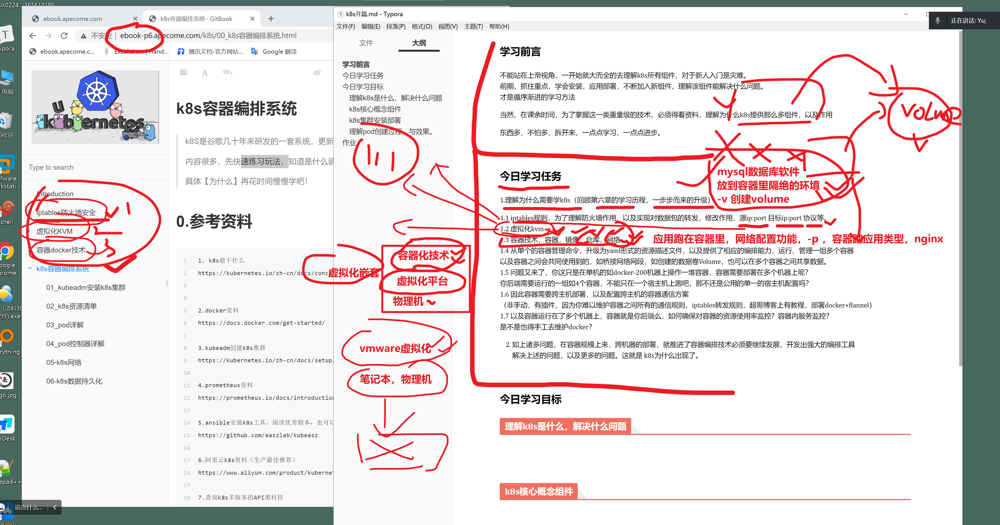


# 今日学习任务

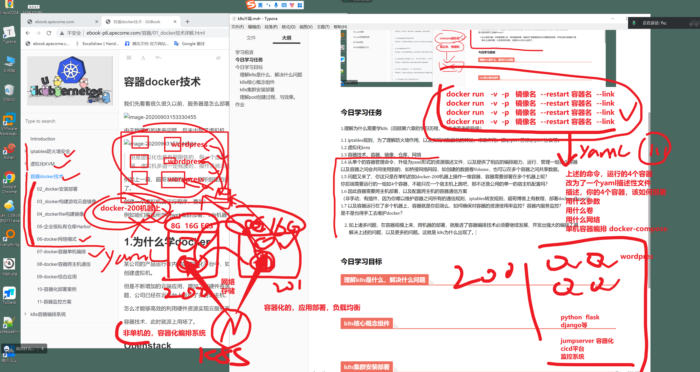


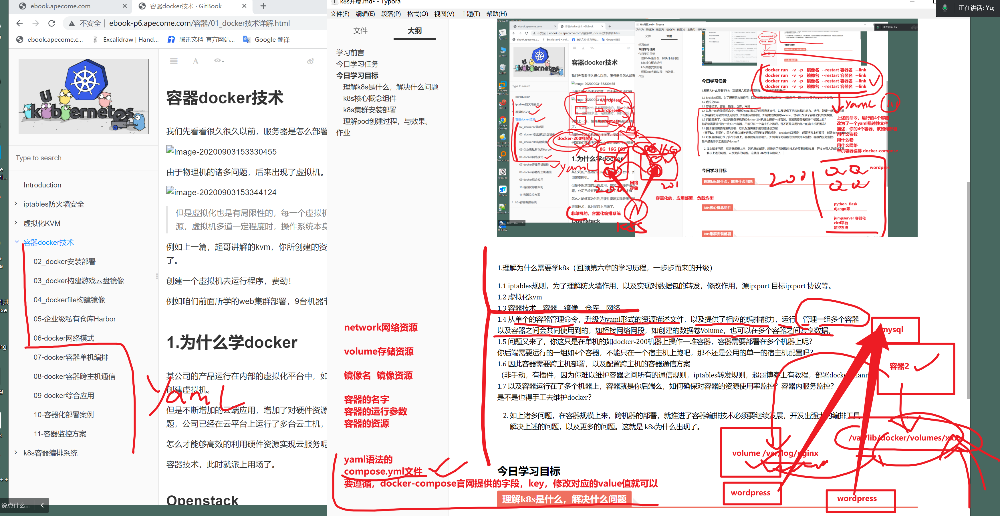


1.理解为什么需要学k8s（回顾第六章的学习历程，一步步而来的升级）

1.1 iptables规则，为了理解防火墙作用、以及实现对数据包的转发，修改作用，源ip:port 目标ip:port 协议等。
1.2 虚拟化kvm
1.3 容器技术，容器，镜像，仓库，网络
1.4 从单个的容器管理命令，升级为yaml形式的资源描述文件，以及提供了相应的编排能力，运行、管理一组多个容器
以及容器之间会共同使用到的，如桥接网络网段，如创建的数据卷Volume，也可以在多个容器之间共享数据。
1.5 问题又来了，你这只是在单机的如docker-200机器上操作一堆容器，容器需要部署在多个机器上呢？
你后端需要运行的一组如4个容器，不能只在一个宿主机上跑吧，那不还是公用的单一的宿主机配置吗？
1.6 因此容器需要跨主机部署，以及配置跨主机的容器通信方案
（非手动，有插件，因为你难以维护容器之间所有的通信规则，iptables转发规则，超哥博客上有教程，部署docker+flannel）
1.7 以及容器运行在了多个机器上，容器就是你后端么，如何确保对容器的资源使用率监控？容器内服务监控？
是不是也得手工去维护docker？


2. 如上诸多问题，在容器规模上来，跨机器的部署，就推进了容器编排技术必须要继续发展，开发出强大的编排工具
解决上述的问题，以及更多的问题。这就是 k8s为什么出现了。

## 为什么学习k8s的背景

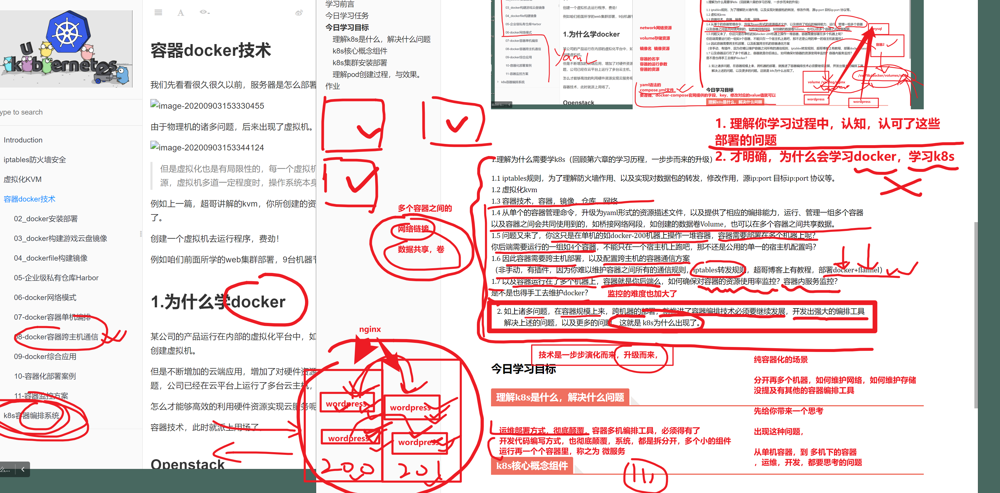


10.10


# 今日学习目标

今天理论较多，操作较少，安装好k8s即可，开篇的理解，大于操作。

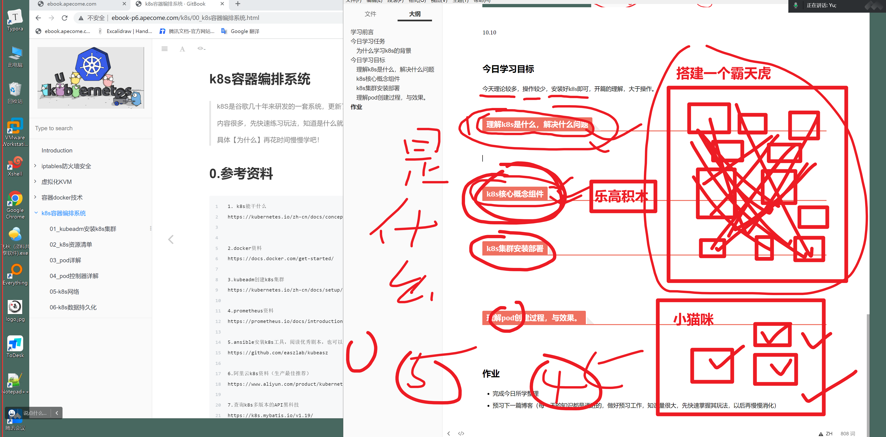


## 理解k8s是什么，解决什么问题

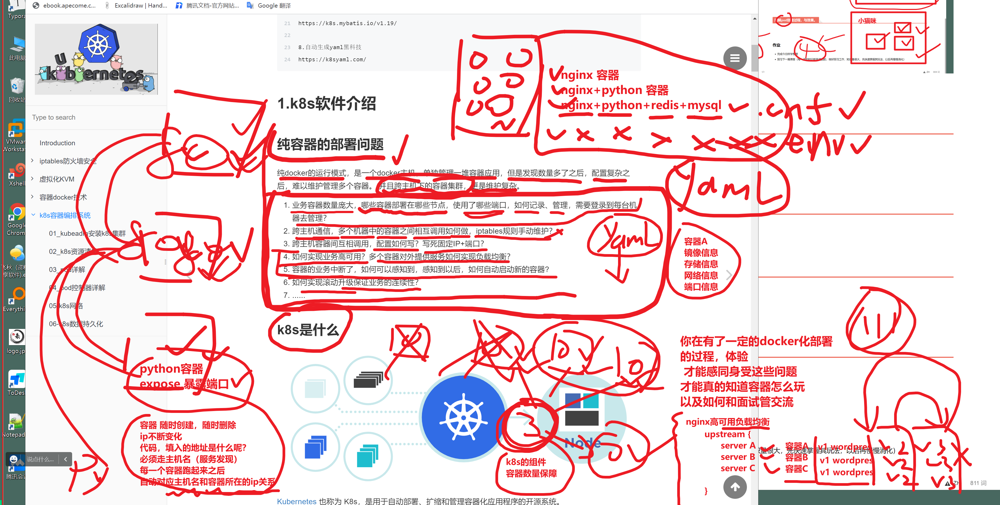

```
上述所有问题，k8s全给你解决了
```


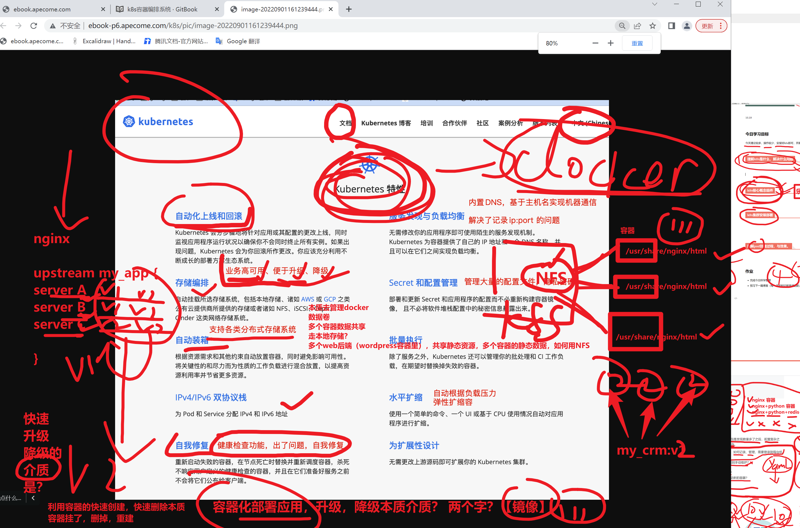


## k8s官网的介绍，作用


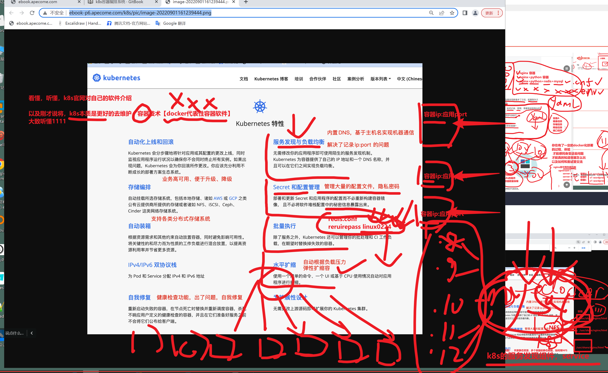


## 为什么会出现k8s

部署时代架构

v1  物理机

↓

v2 虚拟化，vmware 商业版为代表，出现开源版的 openstack

↓

v3 容器化部署，容器化大规模应用后，难以维护，出现了

↓

k8s技术


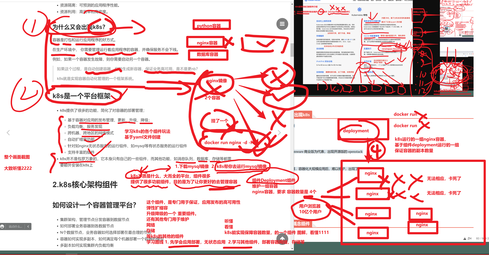


10 57


## k8s核心概念组件

刚才一直在说，为什么要学k8s，以及它的作用，和docker的关系，解决了docker维护的什么难题。


下一步就是，k8s到底是什么，架构如何，如何部署，核心理念。


## k8s称之为容器管理平台的本质，解决了什么问题


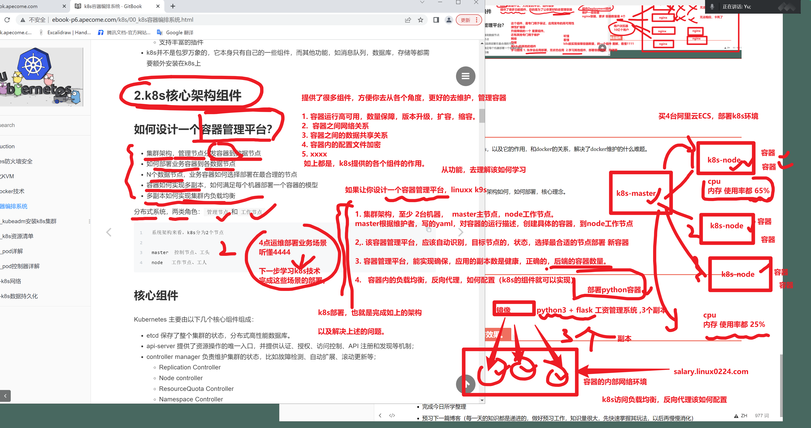


## k8s核心组件，的作用

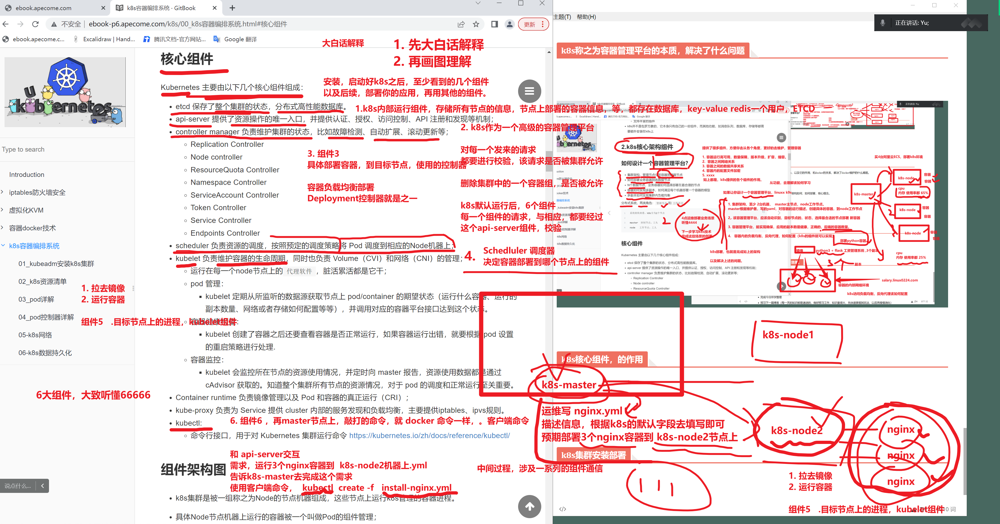


## k8s组件通信架构图

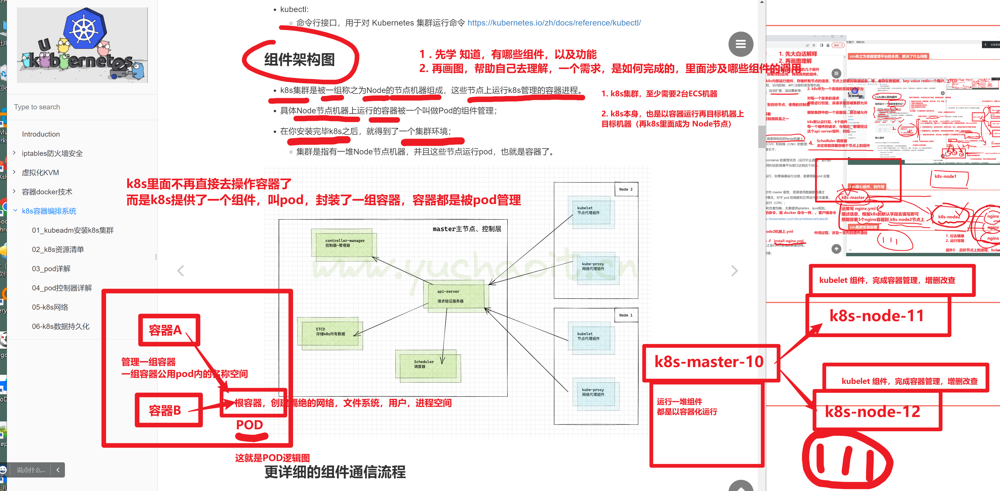


## 面试题，pod是如何被创建到目标机器上的，组件走向

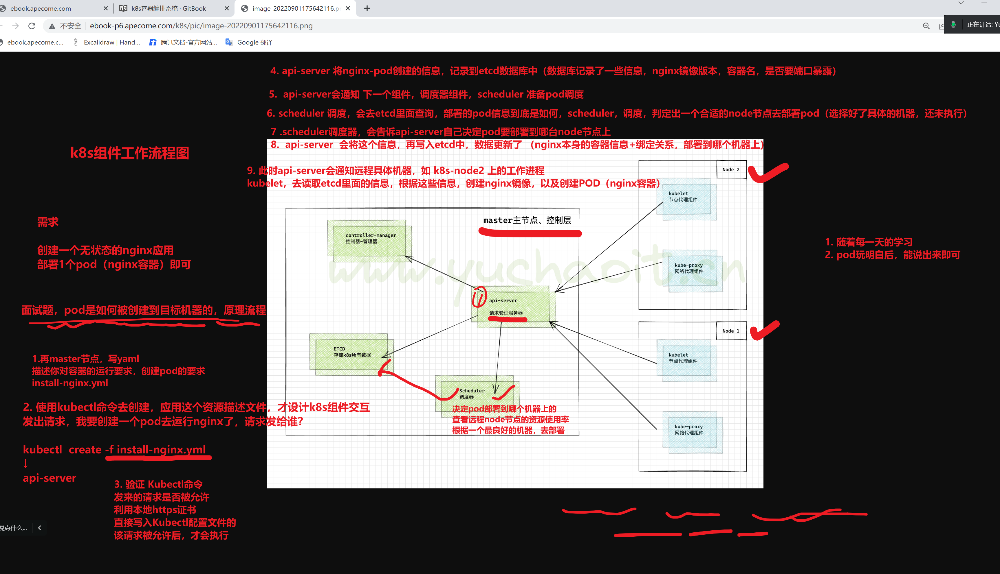


一回生，二回熟，三天后你就能说出来了。


## 理解k8s核心几块资源

k8s默认的组件很多，每一个pod控制器（工作负载），以及网络插件组件，没法一个个的去读，前期也都被封装在了底层，也关心不到。

因此，只聊我们能用到的几个组件，如pod创建，需要用到几个组件，需要背一背，以及查看对应的资源，再机器上的容器进程信息。

后续不断的加入新知识，再去理解对应的组件

`即可循序渐进的理解，k8s的复杂知识。`

`当然，建议也是，平日里，看k8s官网文档，以及如k8s权威指南 v5版本的书籍，去阅读理论知识，扩充自己的理论知识，更合适。`

`v1-v5`

上课，为了更快速的，理解，操作，k8s组件该如何玩


1. 快速学会玩法
2. 再去看资料理解本质原理


## node概念

ECS机器，k8s运行的一个环境。

pod等资源，属于k8s安装好后的，集群内的一个资源信息。


1.k8s工作节点，node，运行环境可以是：：：：vmware创建的一个虚拟机 ，k8s-node-11  k8s-node-12

2.node上具体运行啥？运行容器，k8s部署的应用，都是跑再容器里，还得装docker

3. 初始化，运行工作节点，或者主节点，背后逻辑就是
   1. 下载k8s自身的一些组件的镜像
   2. 运行镜像，创建对应的容器，到对应的目标机器上（k8s-master、k8s-node）


主要的部署架构逻辑，听懂1111

## k8s-node的部署逻辑图

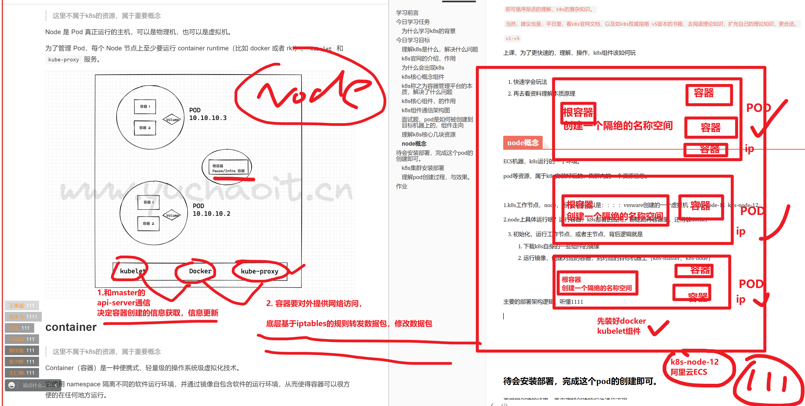


```1. Pod是在K8s集群中运行部署应用或服务的最小单元，它是可以支持多容器的。
2. pod的IP是随机变化的，删除pod，IP变化
3. pod内都有一个根容器
4. 一个pod内可以有一个、多个容器
5.一个pod内的所有容器，共享根容器的网络名称空间，文件系统，进程资源
6.一个pod内的容器网络地址，由根容器提供。

```

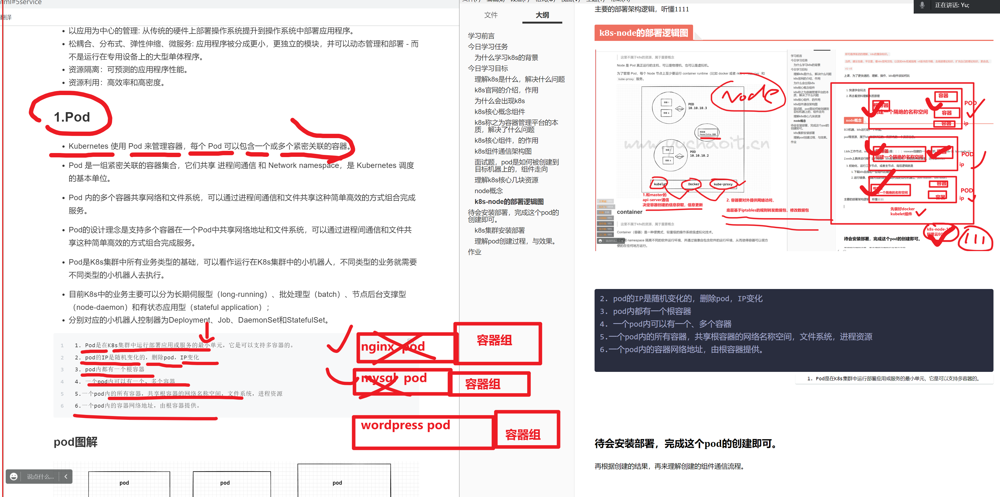


## pod部署的4个静态，区分，有无数据要持久化，以及容器有无数据共享

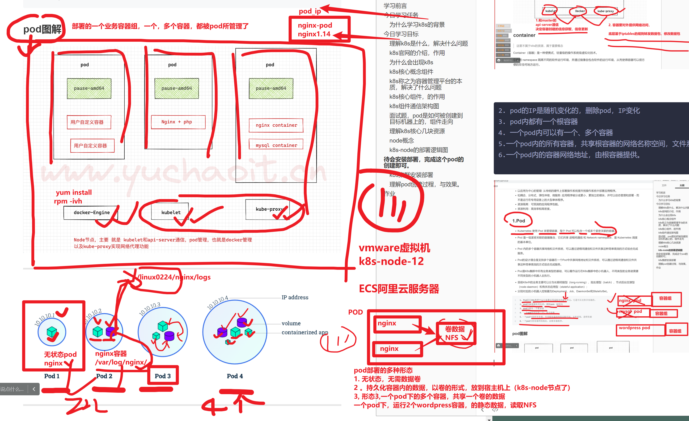


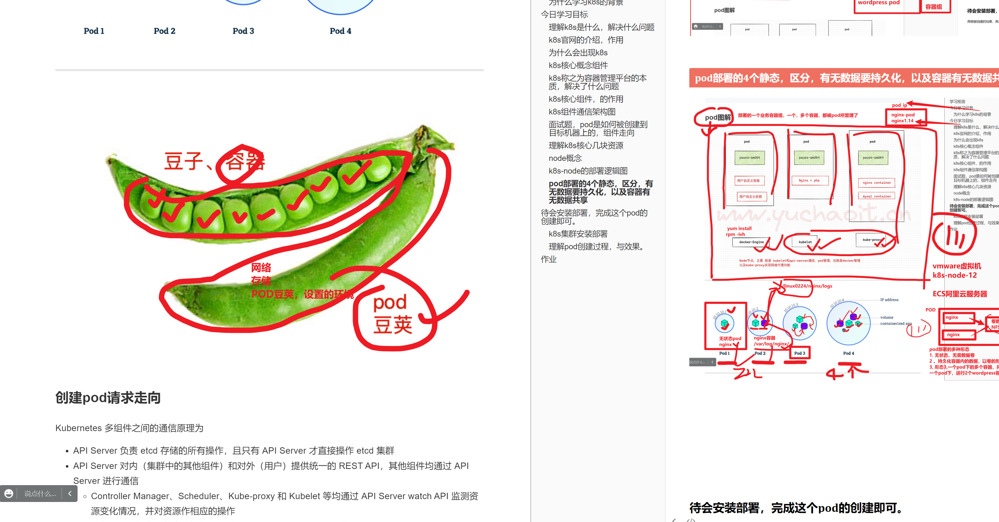


## 理解了pod的创建，使用，运行，再去看原理图，pod是如何创建和多个组件通信流程的

## k8s核心，部署应用，需要理解的概念名词。


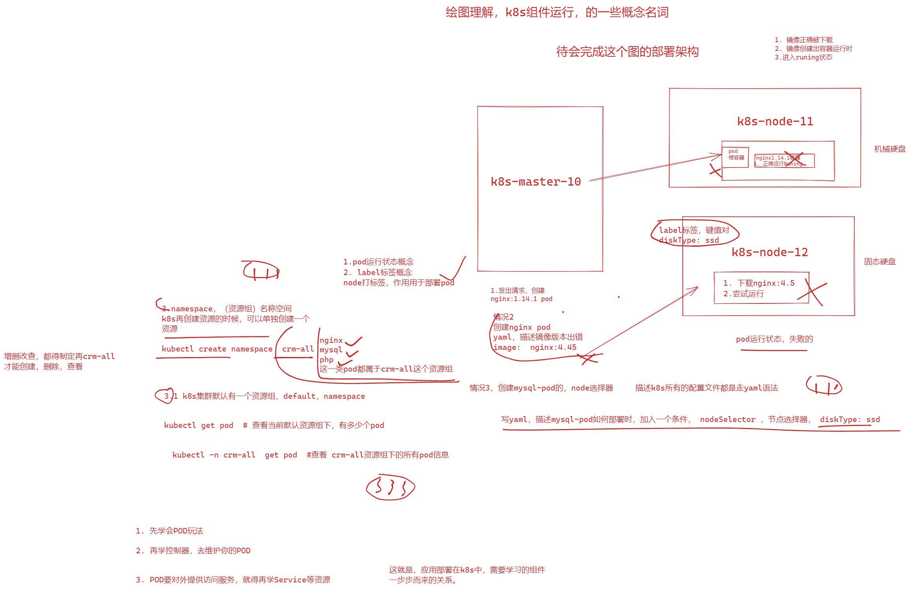


# 待会安装部署，完成这个pod的创建即可。

再根据创建的结果，再来理解创建的组件通信流程。


## k8s集群安装部署

带着理论，再去部署，验证你的理论


## 环境准备，目前都是3个机器执行。

- 准备3台机器，注意配置，别太低，否则跑不起来。

- 系统初始化配置，如ntp等

```
主机名、节点ip、部署组件
# k8s kubeadm 一键自动化，安装k8s集群，安装所有运行需要的组件
# 

k8s-master  10.0.0.10   etcd, kube-apiserver, kube-controller-manager, kubectl, kubeadm, kubelet, kube-proxy, flannel


k8s-node1  10.0.0.11  kubectl, kubelet, kube-proxy, flannel,docker


k8s-node2   10.0.0.12 kubectl, kubelet, kube-proxy, flannel,docker

确保三台机器，的跨节点的容器互相通信，装网络插件flannel


```


## 环境初始化

```
cat  >>/etc/hosts <<'EOF'
10.0.0.10 k8s-master-10 
10.0.0.11 k8s-node-11
10.0.0.12 k8s-node-12
EOF

ping -c 2 k8s-master-10
ping -c 2 k8s-node-11
ping -c 2 k8s-node-12

```


## 防火墙初始化

```
systemctl stop firewalld NetworkManager
systemctl disable firewalld NetworkManager

sed -ri 's#(SELINUX=).*#\1disabled#' /etc/selinux/config
setenforce 0
systemctl disable firewalld && systemctl stop firewalld


getenforce 0

iptables -F
iptables -X
iptables -Z

iptables -P FORWARD ACCEPT
```

## 关闭swap

k8s默认禁用swap功能

```
swapoff -a
# 防止开机自动挂载 swap 分区
sed -i '/ swap / s/^\(.*\)$/#\1/g' /etc/fstab
```


## yum源配置

```
curl  -o /etc/yum.repos.d/CentOS-Base.repo https://mirrors.aliyun.com/repo/Centos-7.repo
curl  -o /etc/yum.repos.d/epel.repo http://mirrors.aliyun.com/repo/epel-7.repo
sed -i '/aliyuncs/d' /etc/yum.repos.d/*.repo

yum clean all && yum makecache fast
```


## ntp配置

```
yum install chrony -y

systemctl start chronyd
systemctl enable chronyd

date


# 修改配置文件，加入ntp.aliyun.com上游地址即可

ntpdate -u ntp.aliyun.com


hwclock -w

```

## 修改linux内核参数，开启数据包转发功能

```
# 容器夸主机通通信，底层是走的iptables，内核级别的数据包转发

cat <<EOF >  /etc/sysctl.d/k8s.conf
net.bridge.bridge-nf-call-ip6tables = 1
net.bridge.bridge-nf-call-iptables = 1
net.ipv4.ip_forward=1
vm.max_map_count=262144
EOF


modprobe br_netfilter
# 加载读取内核参数配置文件
sysctl -p /etc/sysctl.d/k8s.conf

```


## 安装docker基础环境（）

```
yum remove docker docker-common docker-selinux docker-engine -y 

curl -o /etc/yum.repos.d/docker-ce.repo https://mirrors.aliyun.com/docker-ce/linux/centos/docker-ce.repo

yum makecache fast

yum list docker-ce --showduplicates

yum install docker-ce-19.03.15 docker-ce-cli-19.03.15 -y

#配置docker加速器、以及crgoup驱动，改为k8s官方推荐的systemd，否则初始化时会有报错。

mkdir -p /etc/docker

cat > /etc/docker/daemon.json <<'EOF'
{
  "registry-mirrors" : [
    "https://ms9glx6x.mirror.aliyuncs.com"],
    "exec-opts":["native.cgroupdriver=systemd"]
}
EOF

#启动
systemctl start docker && systemctl enable docker

docker version


```


## 安装k8s的初始化工具kubeadm命令（所有节点执行）

```
# 安装k8s集群环境初始化的工具
#  kubelet-1.19.3 ，   # 组件，增删改查pod再具体机器上，pod可以运行主节点上，node节点上
#  kubeadm-1.19.3      # k8s版本 1.19.3 ，自动拉去k8s基础组件镜像的一个工具
#  kubectl-1.19.3      # 管理，维护k8s客户端换，和服务端交互的一个命令行工具

听懂111


```

所有机器执行

```bash
[root@k8s-master-10 ~]#cat init-k8s.sh 
#设置阿里云源

curl -o /etc/yum.repos.d/Centos-7.repo http://mirrors.aliyun.com/repo/Centos-7.repo

curl -o /etc/yum.repos.d/docker-ce.repo http://mirrors.aliyun.com/docker-ce/linux/centos/docker-ce.repo


cat <<EOF > /etc/yum.repos.d/kubernetes.repo
[kubernetes]
name=Kubernetes
baseurl=http://mirrors.aliyun.com/kubernetes/yum/repos/kubernetes-el7-x86_64
enabled=1
gpgcheck=0
repo_gpgcheck=0
gpgkey=http://mirrors.aliyun.com/kubernetes/yum/doc/yum-key.gpg
        http://mirrors.aliyun.com/kubernetes/yum/doc/rpm-package-key.gpg
EOF


yum clean all && yum makecache


#yum list kubeadm --showduplicates   列出，这个阿里云k8s源，提供了哪些k8s版本让你玩
# 这个脚本看懂1111


# 安装指定版本 kubeadm-1.19.3   ，安装的kubeadm版本，就是决定了，拉去什么版本的k8s集群版本的镜像

yum install kubelet-1.19.3 kubeadm-1.19.3   kubectl-1.19.3 ipvsadm -y

```


## k8s安装完毕之后，设置所有节点的kubelet开机运行

## 为何要让kublet，docker，开机启动

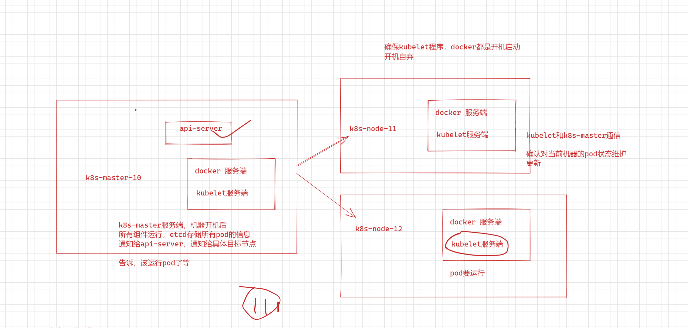


```
## 查看kubeadm 版本，初始化的k8s版本信息，就是 v1.19.3版本

$ kubeadm version


[root@k8s-master-10 ~]#kubeadm version
kubeadm version: &version.Info{Major:"1", Minor:"19", GitVersion:"v1.19.3", GitCommit:"1e11e4a2108024935ecfcb2912226cedeafd99df", GitTreeState:"clean", BuildDate:"2020-10-14T12:47:53Z", Go


## 设置kubelet开机启动
systemctl enable kubelet
systemctl enable docker


```


## 先保留所有节点的应用 端口状态，待会看k8s跑起来之后，占用了哪些端口，知道哪些程序运行了

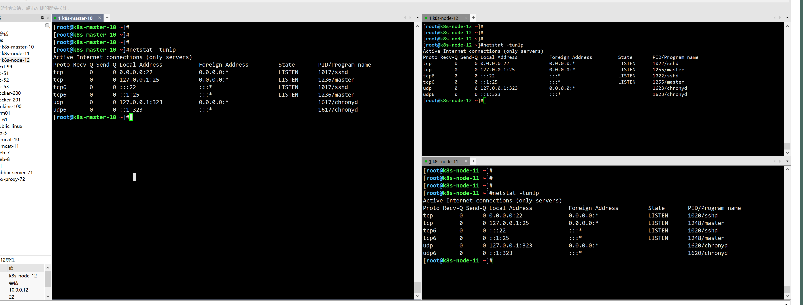


## 初始化k8s-master主节点（只在主节点执行）

```
# kubeadm init   初始化，加入一些参数

#
kubeadm init \
--apiserver-advertise-address=10.0.0.10 \
--image-repository registry.aliyuncs.com/google_containers \
--kubernetes-version v1.19.3 \
--service-cidr=10.1.0.0/16 \
--pod-network-cidr=10.2.0.0/16 \
--service-dns-domain=cluster.local \
--ignore-preflight-errors=Swap \
--ignore-preflight-errors=NumCPU


kubeadm init \
--apiserver-advertise-address=10.0.0.10 \   # api-server运行再k8s-master的ip上
--image-repository registry.aliyuncs.com/google_containers \ # 拉去k8s镜像，从阿里云上获取，否则默认是国外的k8s镜像地址，下载不了
--kubernetes-version v1.19.3 \  # 和kubeadm保持一直
--service-cidr=10.1.0.0/16 \    #  k8s服务发现网段设置，service网段
--pod-network-cidr=10.2.0.0/16 \   # 设置pod创建后，的运行网段地址
--service-dns-domain=cluster.local \ #  k8s服务发现网段设置，service资源的域名后缀
--ignore-preflight-errors=Swap \  # 忽略swap报错
--ignore-preflight-errors=NumCPU  #  忽略cpu数量报错
```


## k8s-master初始化过程讲解


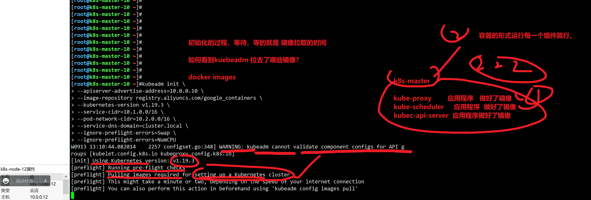


```perl
中间的组件创建过程，以及ssl证书创建过程，暂时不用看，以后回国头再看


# k8s-master成功装好了

Your Kubernetes control-plane has initialized successfully!

To start using your cluster, you need to run the following as a regular user:
# 创建k8s集群配置文件
# 制定了，默认的ssl整数在哪，api-server的地址，等
  mkdir -p $HOME/.kube
  sudo cp -i /etc/kubernetes/admin.conf $HOME/.kube/config
  sudo chown $(id -u):$(id -g) $HOME/.kube/config
  
  
  
  ======================-===============
# pod分布再多个机器上，pod互相之间链接，得部署，集群网络，选用flannel网络插件
# 安装，使用即可。


You should now deploy a pod network to the cluster.
==================================
Run "kubectl apply -f [podnetwork].yaml" with one of the options listed at:
  https://kubernetes.io/docs/concepts/cluster-administration/addons/


# 使用如下命令，将k8s-node加入集群即可，
Then you can join any number of worker nodes by running the following on each as root:
===================================================

# join添加到集群中
kubeadm join 10.0.0.10:6443 --token vf7bng.p0lkay3nygloh561 \
    --discovery-token-ca-cert-hash sha256:ddedb46b4e161fb487ae3ceab0b014283df1afbe7cf1604804e1d075ceeaf69a 
    ====================================
[root@k8s-master-10 ~]#


# k8s-master初始化结果，讲解，听懂6666


```

## k8s-master运行的组件查看，控制平面（官网说法）查看

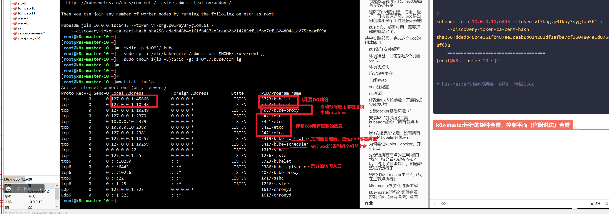


构成k8s主节点。


## 此时主节点就可以用

查看 k8s集群状态，查看有哪些工作节点


````
客户端命令
# 可以直接和api-server交互，查询 你要的信息 

# 这个命令，默认会去加载ssl证书，确保安全
# 以后再聊，kubectl的整数添加参数
# 再主节点上，使用这个命令是可以直接用的


kubectl   get  nodes  

# 显示更详细的信息

kubectl   get  nodes  -owide

````


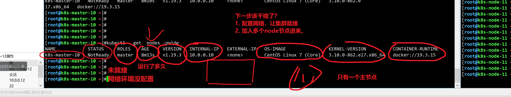


## 加入k8s-node到集群中

```
只需要用上述的集群命令添加即可。

```


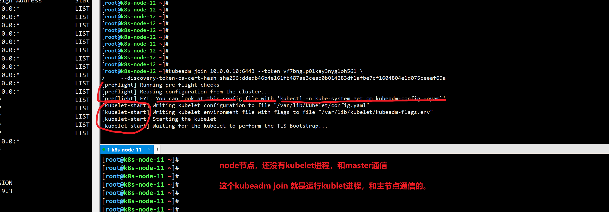

此时node机器就可以和master机器 通信 了，走kubelet进程

```
[root@k8s-node-12 ~]#netstat -tunlp
Active Internet connections (only servers)
Proto Recv-Q Send-Q Local Address           Foreign Address         State       PID/Program name    
tcp        0      0 127.0.0.1:44061         0.0.0.0:*               LISTEN      13018/kubelet       
tcp        0      0 127.0.0.1:10248         0.0.0.0:*               LISTEN      13018/kubelet       
tcp        0      0 127.0.0.1:10249         0.0.0.0:*               LISTEN      13454/kube-proxy    
tcp        0      0 0.0.0.0:22              0.0.0.0:*               LISTEN      1022/sshd           
tcp        0      0 127.0.0.1:25            0.0.0.0:*               LISTEN      1255/master         
tcp6       0      0 :::10250                :::*                    LISTEN      13018/kubelet       
tcp6       0      0 :::10256                :::*                    LISTEN      13454/kube-proxy    
tcp6       0      0 :::22                   :::*                    LISTEN      1022/sshd           
tcp6       0      0 ::1:25                  :::*                    LISTEN      1255/master         
udp        0      0 127.0.0.1:323           0.0.0.0:*                           1623/chronyd        
udp6       0      0 ::1:323                 :::*                                1623/chronyd   

```

该进程是以什么形式运行的？

宿主机直接，以1号进程，systemd去启动的kubelet进程

```
systemctl status kubelet 查看


```


## k8s-master主节点，查看所有工作节点的信息

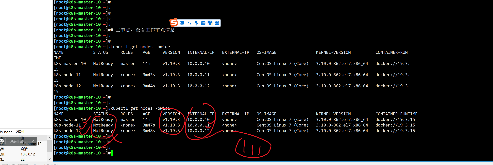


```
查看k8s集群，用到了哪些机器

```


## 如何让集群就绪呢？部署网络插件


```
# 1. 下载网络插件的，配置文件 ，yaml以及配置文件
git clone --depth 1 https://github.com/coreos/flannel.git

# 2.再k8s主节点上，应用这个yaml，基于yaml，创建具体的pod过程。

# 3.如果需要修改pod运行网络的话，要改配置文件，
/root/flannel-master/Documentation/kube-flannel.yml

# 创建k8s资源，都是写这种yml文件了

[root@k8s-master-10 ~/flannel-master/Documentation]#grep 'Network' -A 5 kube-flannel.yml 
      "Network": "10.2.0.0/16",
      "Backend": {
        "Type": "vxlan"
      }
    }
---


# 修改的第二处，夸主机的容器通信，最终不得走宿主机的物理网卡。
# 告诉flannel的你物理网卡是谁
      containers:
      - name: kube-flannel
       #image: flannelcni/flannel:v0.19.2 for ppc64le and mips64le (dockerhub limitations may apply)
        image: docker.io/rancher/mirrored-flannelcni-flannel:v0.19.2
        command:
        - /opt/bin/flanneld
        args:
        - --ip-masq
        - --kube-subnet-mgr
        - --iface=ens33

# 基于kubectl命令，应用这个yml文件，读取，以及创建pod资源

[root@k8s-master-10 ~/flannel-master/Documentation]#kubectl create -f ./kube-flannel.yml 
namespace/kube-flannel created
clusterrole.rbac.authorization.k8s.io/flannel created
clusterrolebinding.rbac.authorization.k8s.io/flannel created
serviceaccount/flannel created
configmap/kube-flannel-cfg created
daemonset.apps/kube-flannel-ds created


# 查看当前机器的容器，关于flannel网络插件的进程
[root@k8s-master-10 ~/flannel-master/Documentation]#docker ps |grep flannel
812ebf6b0578        registry.aliyuncs.com/google_containers/pause:3.2   "/pause"                 31 seconds ago      Up 31 seconds                           k8s_POD_kube-flannel-ds-9x4l2_kube-flannel_37b34022-cc0d-47c3-b677-3fe657374dbc_0


修改pod网络的网段地址，根据kubeadm init 初始化时，设置的地址来

```

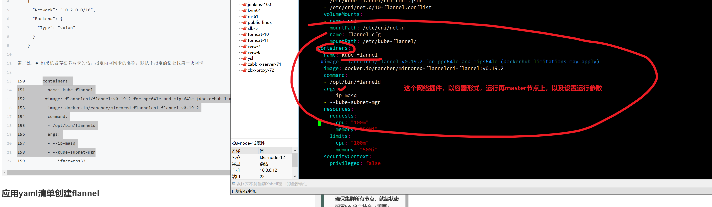


## 为何所有节点，都有了网络插件进程

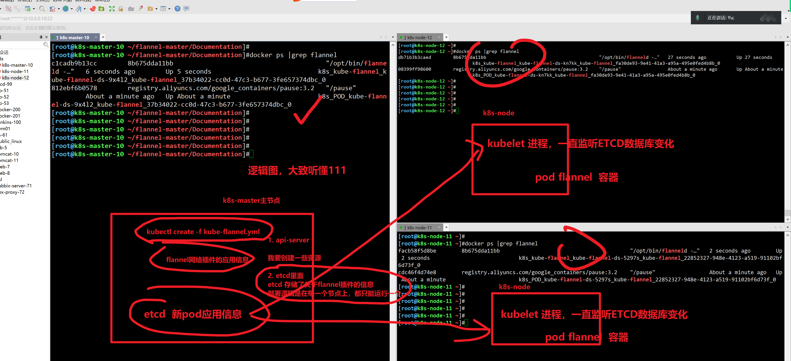


## 至此，所有机器，都走flannel进行集群通信了。

```
[root@k8s-master-10 ~/flannel-master/Documentation]#kubectl get nodes -o wide
NAME            STATUS   ROLES    AGE   VERSION   INTERNAL-IP   EXTERNAL-IP   OS-IMAGE                KERNEL-VERSION          CONTAINER-RUNTIME
k8s-master-10   Ready    master   41m   v1.19.3   10.0.0.10     <none>        CentOS Linux 7 (Core)   3.10.0-862.el7.x86_64   docker://19.3.15
k8s-node-11     Ready    <none>   31m   v1.19.3   10.0.0.11     <none>        CentOS Linux 7 (Core)   3.10.0-862.el7.x86_64   docker://19.3.15
k8s-node-12     Ready    <none>   31m   v1.19.3   10.0.0.12     <none>        CentOS Linux 7 (Core)   3.10.0-862.el7.x86_64   docker://19.3.15
[root@k8s-master-10 ~/flannel-master/Documentation]## 至此表示，3个节点，集群通信OK，可以pod部署了，。看懂111
[root@k8s-master-10 ~/flannel-master/Documentation]#
[root@k8s-master-10 ~/flannel-master/Documentation]#
[root@k8s-master-10 ~/flannel-master/Documentation]#
[root@k8s-master-10 ~/flannel-master/Documentation]#
[root@k8s-master-10 ~/flannel-master/Documentation]## 至此表示，3个节点，集群通信OK，可以pod部署了，。看懂111
[root@k8s-master-10 ~/flannel-master/Documentation]#

```


## 确保集群所有节点，就绪状态


## 配置k8s命令补全（重要）

```
k8s命令太多，务必要配置补全


操作节点：k8s-master

yum install bash-completion -y
source /usr/share/bash-completion/bash_completion
source <(kubectl completion bash)
echo "source <(kubectl completion bash)" >> ~/.bashrc


```


## 发出pod创建请求，运行一个nginx-pod

```
# 查看命令帮助

kubectl run --help

# 后台运行一个nginx ，1.14.1 pod ，看结果
[root@k8s-master-10 ~/flannel-master/Documentation]#kubectl run linux0224-pod-1-nginx --image=nginx:1.14.1 
pod/linux0224-pod-1-nginx created


# 如何查看pod信息？ get 查询
[root@k8s-master-10 ~/flannel-master/Documentation]#kubectl get pods -owide
NAME                    READY   STATUS    RESTARTS   AGE   IP         NODE          NOMINATED NODE   READINESS GATES
linux0224-pod-1-nginx   1/1     Running   0          38s   10.2.2.2   k8s-node-11   <none>           <none>


```


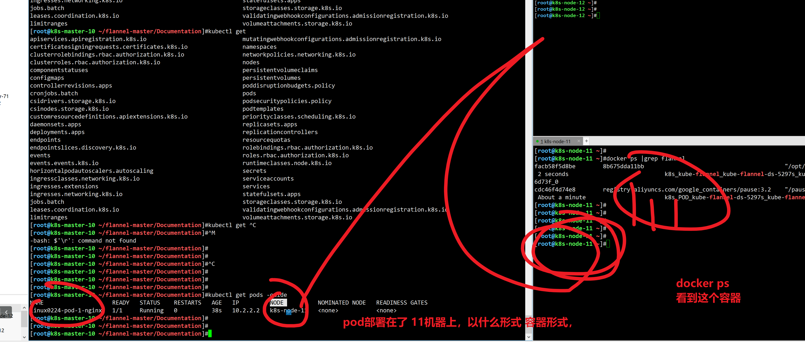


## 访问pod-ip即可。

pod的ip是k8s集群，才能访问通的一个ip，无法再 外部访问，外部访问，得设置更多网络规则。


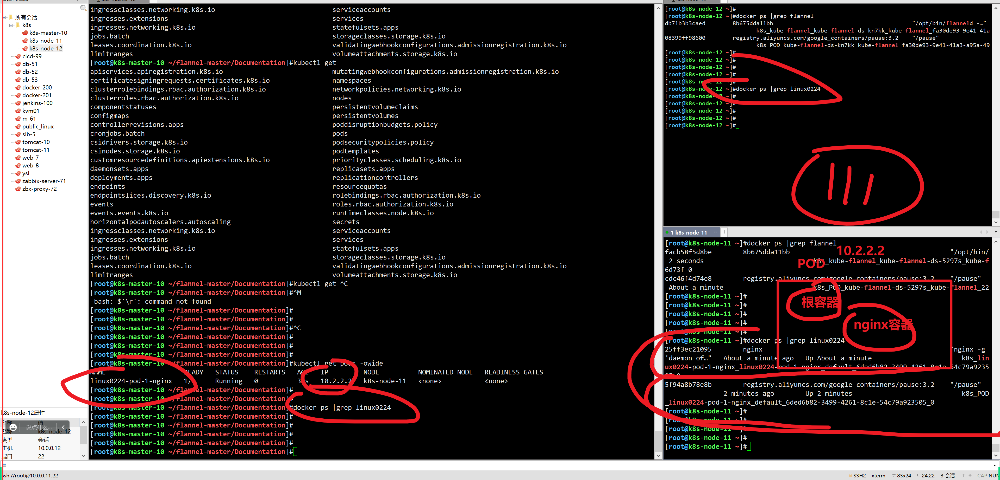


## 如何修改这个页面

```
你会的改法？
直接修改容器信息，具体机器上，的集体容器进程
[root@k8s-node-11 ~]#docker exec 25ff3ec21095  sh -c "echo '<meta charset-utf8> 同志们辛苦了。'  > /usr/share/nginx/html/index.html"


容器集群。，走管理节点去管理pod。再去修改 容器信息，让你明白，。pod和容器的关系
命令很像

[root@k8s-master-10 ~/flannel-master/Documentation]#kubectl exec linux0224-pod-1-nginx  --  sh -c "echo '辛苦了同志们，散会，下午好好消化下，干饭' >/usr/share/nginx/html/index.html  "
[root@k8s-master-10 ~/flannel-master/Documentation]#


[root@k8s-master-10 ~/flannel-master/Documentation]##基于k8s命令，修改pod内的容器信息，以及帮助信息查看
[root@k8s-master-10 ~/flannel-master/Documentation]#
[root@k8s-master-10 ~/flannel-master/Documentation]#kubectl exec linux0224-pod-1-nginx  --  sh -c "echo '辛苦了同志们，散会，下午好好消化下，干饭' >/usr/share/nginx/html/index.html  "
[root@k8s-master-10 ~/flannel-master/Documentation]#


```


# 作业

- 完成今日所学整理
- 预习下一篇博客（每一天的知识都是递进的，做好预习工作，知识量很大，先快速掌握其玩法，以后再慢慢消化）


