```### 此资源由 58学课资源站 收集整理 ###
	想要获取完整课件资料 请访问：58xueke.com
	百万资源 畅享学习

```
# 昨日回顾

## k8s学习方法经验

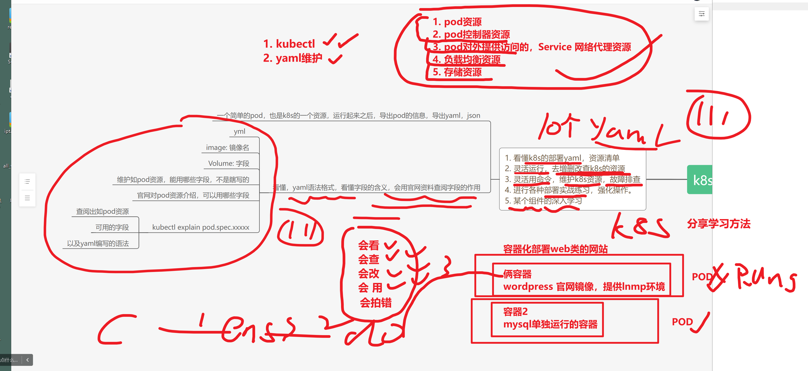


## day1学习复习


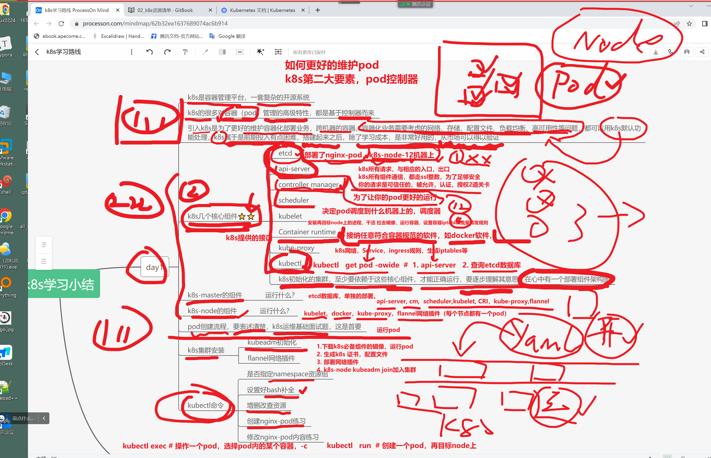


# 今日内容


```
docker run  xxx 


docker-compose.yml


kubectl run  # pod


# 写yaml，pod资源，描述清单，描述pod，运行的信息，如pod名字，如pod内的容器的名字

kubectl create -f nginx-pod.yml


```


## pod控制-工作负载xxx

xxxx


## pod服务发现-service资源

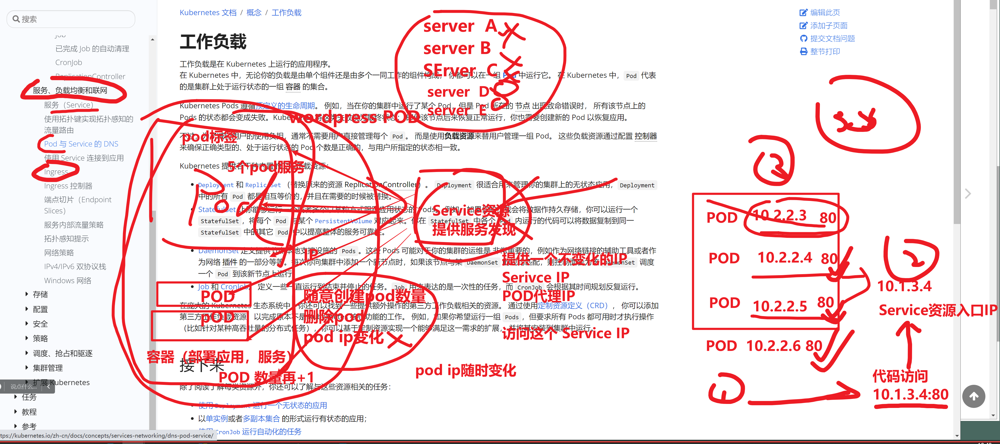


## 持久化卷

xxx


## 配置文件管理，configmap，secret

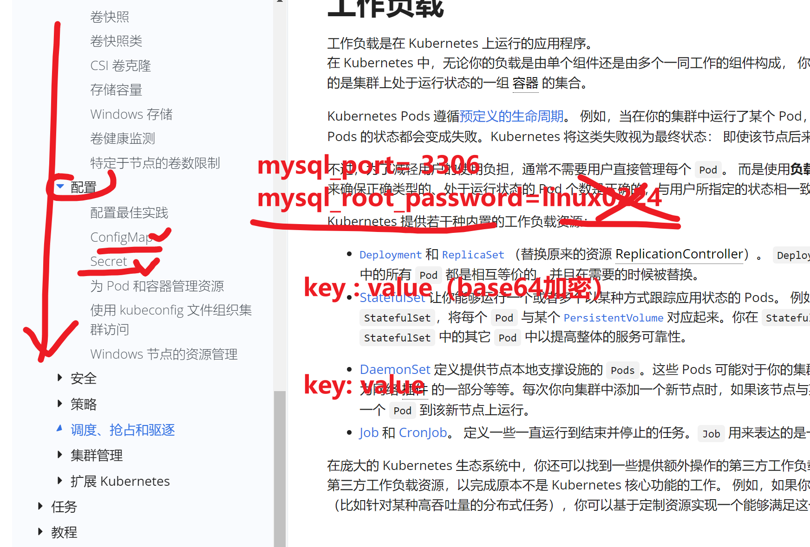


## k8s集群是否正常

````
[root@k8s-master-10 ~]#kubectl get nodes 
NAME            STATUS   ROLES    AGE   VERSION
k8s-master-10   Ready    master   21h   v1.19.3
k8s-node-11     Ready    <none>   21h   v1.19.3
k8s-node-12     Ready    <none>   21h   v1.19.3


# 输出命令格式

# -o wide 显示更详细完整的信息
[root@k8s-master-10 ~]#kubectl get nodes  -o wide
NAME            STATUS   ROLES    AGE   VERSION   INTERNAL-IP   EXTERNAL-IP   OS-IMAGE                KERNEL-VERSION          CONTAINER-RUNTIME
k8s-master-10   Ready    master   21h   v1.19.3   10.0.0.10     <none>        CentOS Linux 7 (Core)   3.10.0-862.el7.x86_64   docker://19.3.15
k8s-node-11     Ready    <none>   21h   v1.19.3   10.0.0.11     <none>        CentOS Linux 7 (Core)   3.10.0-862.el7.x86_64   docker://19.3.15
k8s-node-12     Ready    <none>   21h   v1.19.3   10.0.0.12     <none>        CentOS Linux 7 (Core)   3.10.0-862.el7.x86_64   docker://19.3.15


# -o 输出json
[root@k8s-master-10 ~]#kubectl get nodes  -o json


# -o yaml 输出为yaml格式
[root@k8s-master-10 ~]#kubectl get nodes  -o yaml


````


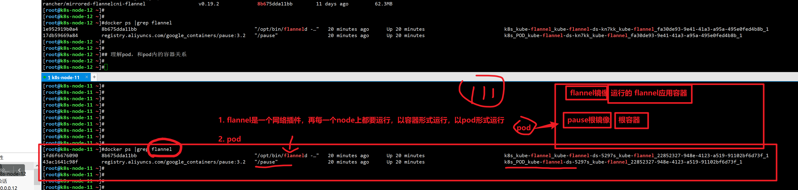


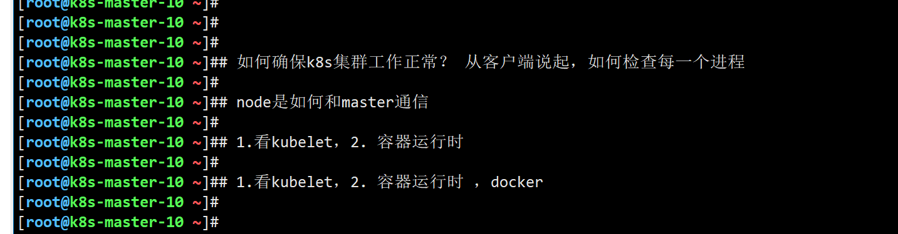


## 查看k8s集群内，默认提供了多少个资源（组件）让你玩呢？

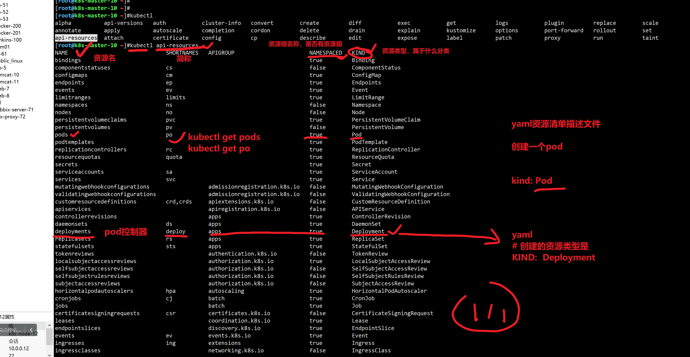


## 基于namespace查询资源

namespace这里的作用是资源组，对资源单独创建一个环境去管理。


默认有一个default资源组，namespace，kubectl不指定，默认就是它


```perl
[root@k8s-master-10 ~]#kubectl -n default get pods  -owide
NAME                    READY   STATUS    RESTARTS   AGE   IP         NODE          NOMINATED NODE   READINESS GATES
linux0224-pod-1-nginx   1/1     Running   1          21h   10.2.2.3   k8s-node-11   <none>           <none>
[root@k8s-master-10 ~]#
[root@k8s-master-10 ~]#
[root@k8s-master-10 ~]#kubectl  get pods  -owide
NAME                    READY   STATUS    RESTARTS   AGE   IP         NODE          NOMINATED NODE   READINESS GATES
linux0224-pod-1-nginx   1/1     Running   1          21h   10.2.2.3   k8s-node-11   <none>           <none>
[root@k8s-master-10 ~]#
[root@k8s-master-10 ~]#


[root@k8s-master-10 ~]#
[root@k8s-master-10 ~]## 基于kubectl run  linux0224-pod-1-nginx --image=nginx:1.14.1
[root@k8s-master-10 ~]#
[root@k8s-master-10 ~]#
[root@k8s-master-10 ~]##声明式，yaml模式去创建这个pod


# 基于现有的环境，去获取yaml，改就行了。
[root@k8s-master-10 ~]#kubectl get pods linux0224-pod-1-nginx  -oyaml > linux0224-pod-1.yml
[root@k8s-master-10 ~]#vim linux0224-pod-1.yml 

# 看懂这个技巧 ，刷222

# 基于这个yaml，再来创建一个，声明式的 pod-2

# 先删除无用的，k8s自动加上，pod运行信息

```

## 编写yaml，声明式，获取，创建资源描述清单的流程


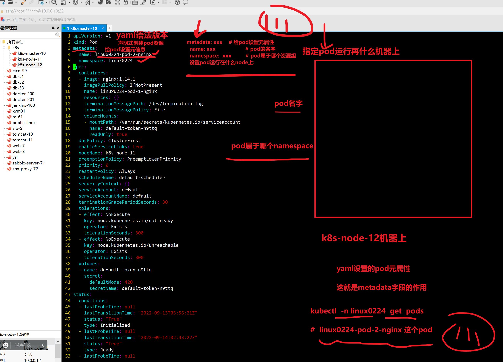


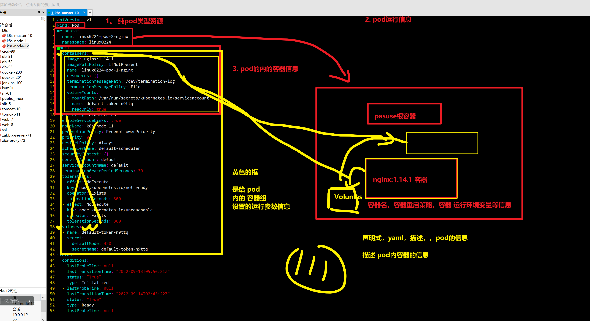


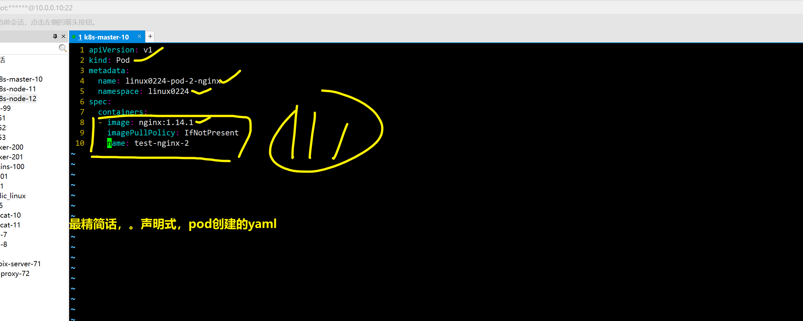


### 基于声明式yaml，创建pod资源

```
[root@k8s-master-10 ~]#vim linux0224-pod-2.yml 
[root@k8s-master-10 ~]#
[root@k8s-master-10 ~]#
[root@k8s-master-10 ~]#kubectl create -f linux0224-pod-2.yml 
Error from server (NotFound): error when creating "linux0224-pod-2.yml": namespaces "linux0224" not found
[root@k8s-master-10 ~]#cat linux0224-pod-
cat: linux0224-pod-: No such file or directory
[root@k8s-master-10 ~]#
[root@k8s-master-10 ~]#
[root@k8s-master-10 ~]#cat linux0224-pod-2.yml 
apiVersion: v1
kind: Pod
metadata:
  name: linux0224-pod-2-nginx
  namespace: linux0224
spec:
  containers:
  - image: nginx:1.14.1
    imagePullPolicy: IfNotPresent
    name: test-nginx-2
[root@k8s-master-10 ~]#

```


### 发现没有namespace，查看当前 master有哪些名称空间

```
[root@k8s-master-10 ~]#kubectl get namespaces 
NAME              STATUS   AGE
default           Active   22h
kube-flannel      Active   21h
kube-node-lease   Active   22h
kube-public       Active   22h
kube-system       Active   22h
[root@k8s-master-10 ~]#
[root@k8s-master-10 ~]#
[root@k8s-master-10 ~]#
[root@k8s-master-10 ~]#kubectl get po # 查看默认defualt下，有哪些pod
NAME                    READY   STATUS    RESTARTS   AGE
linux0224-pod-1-nginx   1/1     Running   1          21h
[root@k8s-master-10 ~]#
[root@k8s-master-10 ~]#
[root@k8s-master-10 ~]#
[root@k8s-master-10 ~]#kubectl -n kube-flannel  get po 
NAME                    READY   STATUS    RESTARTS   AGE
kube-flannel-ds-5297s   1/1     Running   1          21h
kube-flannel-ds-9x4l2   1/1     Running   1          21h
kube-flannel-ds-kn7kk   1/1     Running   1          21h
[root@k8s-master-10 ~]#
[root@k8s-master-10 ~]#
[root@k8s-master-10 ~]#
[root@k8s-master-10 ~]#
[root@k8s-master-10 ~]#kubectl -n kube-system get po # 猜一猜有谁？ api-server
NAME                                    READY   STATUS    RESTARTS   AGE
coredns-6d56c8448f-6bnpp                1/1     Running   1          22h
coredns-6d56c8448f-gkb7l                1/1     Running   1          22h
etcd-k8s-master-10                      1/1     Running   1          22h
kube-apiserver-k8s-master-10            1/1     Running   1          22h
kube-controller-manager-k8s-master-10   1/1     Running   1          22h
kube-proxy-2jk26                        1/1     Running   1          22h
kube-proxy-b7gzk                        1/1     Running   1          22h
kube-proxy-bdqln                        1/1     Running   1          22h
kube-scheduler-k8s-master-10            1/1     Running   1          22h
[root@k8s-master-10 ~]#
[root@k8s-master-10 ~]## 到这看懂666
[root@k8s-master-10 ~]#
[root@k8s-master-10 ~]## 到这看懂666 ，。基于名称空间，去查看一组资源
[root@k8s-master-10 ~]#
[root@k8s-master-10 ~]#

```


### 创建linux0224名称空间，去运行你的pod

```
[root@k8s-master-10 ~]#kubectl create namespace linux0224
namespace/linux0224 created
[root@k8s-master-10 ~]#
[root@k8s-master-10 ~]#
[root@k8s-master-10 ~]#kubectl get namespaces 
NAME              STATUS   AGE
default           Active   22h
kube-flannel      Active   21h
kube-node-lease   Active   22h
kube-public       Active   22h
kube-system       Active   22h
linux0224         Active   3s
[root@k8s-master-10 ~]#
[root@k8s-master-10 ~]#
[root@k8s-master-10 ~]#kubectl create -f linux0224-pod-2.yml 
pod/linux0224-pod-2-nginx created


```

## 理解pod描述字段，和容器描述字段的关系

11. 48


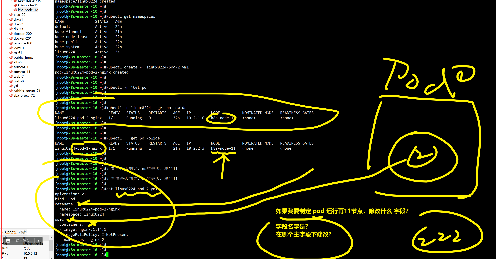


## 如何编辑公司现有的k8s资源，图解

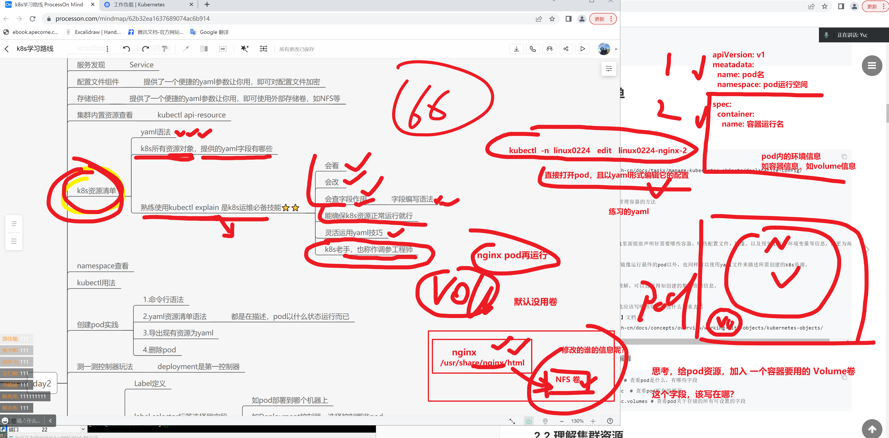


### 查看基于yaml创建出的nginx-pod-2

```

```

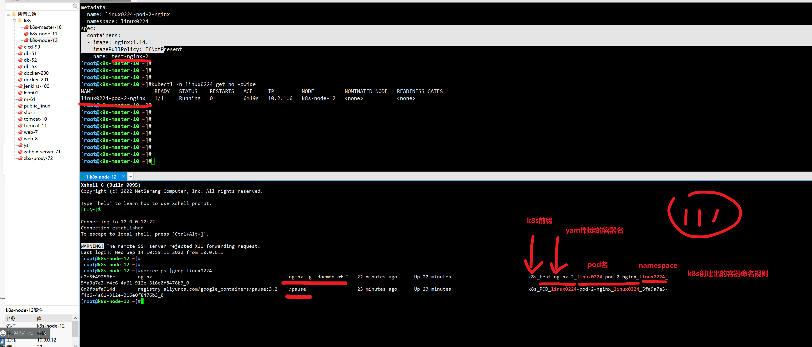


## 再来一个nginx-pod，查看容器命名规则

```
[root@k8s-master-10 /all-k8s-yaml]#cat nginx-pod-3.yml 
apiVersion: v1
kind: Pod
metadata:
  name: nginx-3
  namespace: linux0224
spec:
  containers:
  - image: nginx:1.21.1
    name: t3-nginx


# a创建资源


#记录pod的更新状态
C[root@k8s-master-10 /all-k8s-yaml]#kubectl -n linux0224 get po -o wide -w 
NAME                    READY   STATUS              RESTARTS   AGE   IP         NODE          NOMINATED NODE   READINESS GATES
linux0224-pod-2-nginx   1/1     Running             0          27m   10.2.1.6   k8s-node-12   <none>           <none>
nginx-3                 0/1     ContainerCreating   0          20s   <none>     k8s-node-11   <none>           <none>

nginx-3                 1/1     Running             0          21s   10.2.2.4   k8s-node-11   <none>           <none>


```

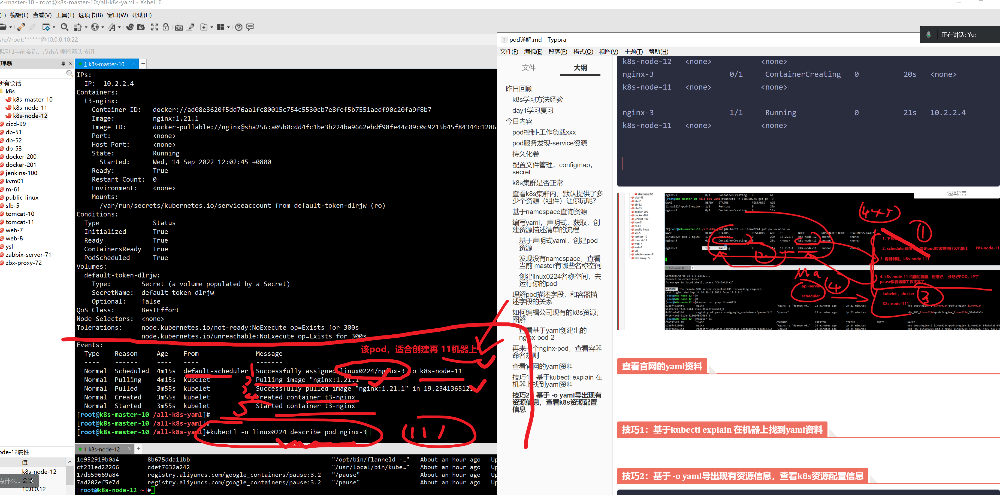


```
Events:
  Type    Reason     Age    From               Message
  ----    ------     ----   ----               -------
  Normal  Scheduled  4m15s  default-scheduler  Successfully assigned linux0224/nginx-3 to k8s-node-11
  Normal  Pulling    4m15s  kubelet            Pulling image "nginx:1.21.1"
  Normal  Pulled     3m55s  kubelet            Successfully pulled image "nginx:1.21.1" in 19.234136512s
  Normal  Created    3m55s  kubelet            Created container t3-nginx
  Normal  Started    3m55s  kubelet            Started container t3-nginx
[root@k8s-master-10 /all-k8s-yaml]#
[root@k8s-master-10 /all-k8s-yaml]#
[root@k8s-master-10 /all-k8s-yaml]#kubectl -n linux0224 describe pod nginx-3


```


### 查看，测试访问pod

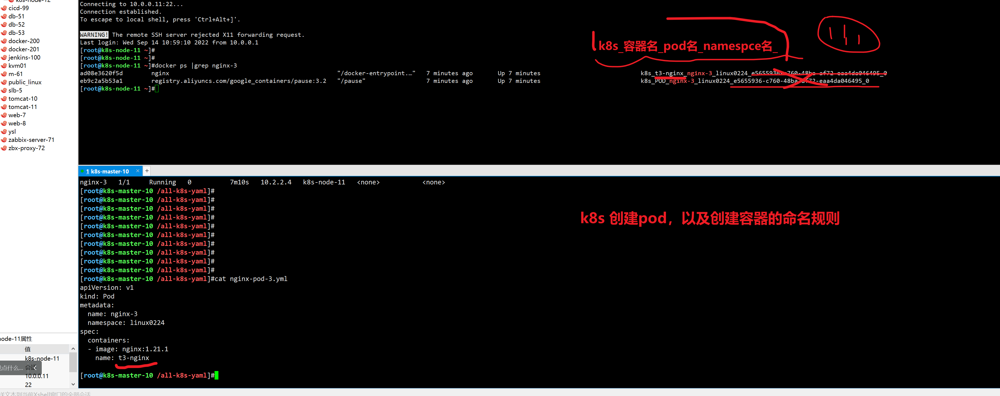


## 查看官网的yaml资料


2.12继续上课


## 技巧1：基于kubectl explain 在机器上找到yaml资料


## 技巧2：基于 -o yaml导出现有资源信息，查看k8s资源配置信息

```

```


