```### 此资源由 58学课资源站 收集整理 ###
	想要获取完整课件资料 请访问：58xueke.com
	百万资源 畅享学习

```
# 昨日回顾

## k8s学习方法经验


## day1学习复习


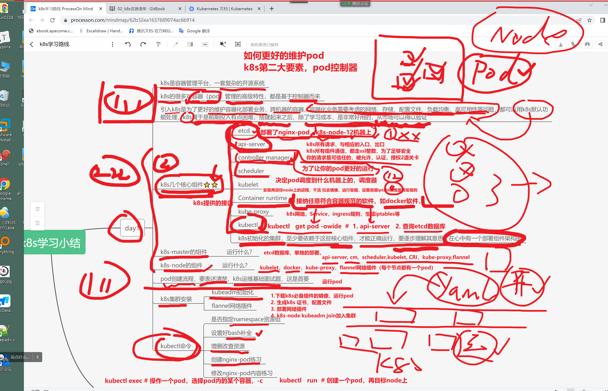


# 今日内容


```
docker run  xxx 


docker-compose.yml


kubectl run  # pod


# 写yaml，pod资源，描述清单，描述pod，运行的信息，如pod名字，如pod内的容器的名字

kubectl create -f nginx-pod.yml


```


## pod控制-工作负载xxx

xxxx


## pod服务发现-service资源

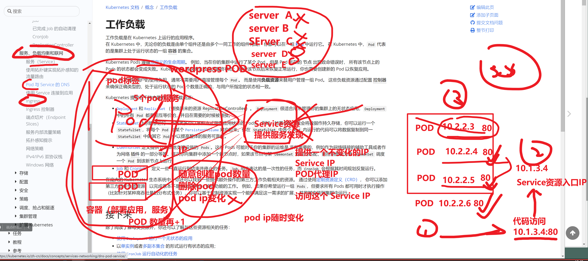


## 持久化卷

xxx


## 配置文件管理，configmap，secret

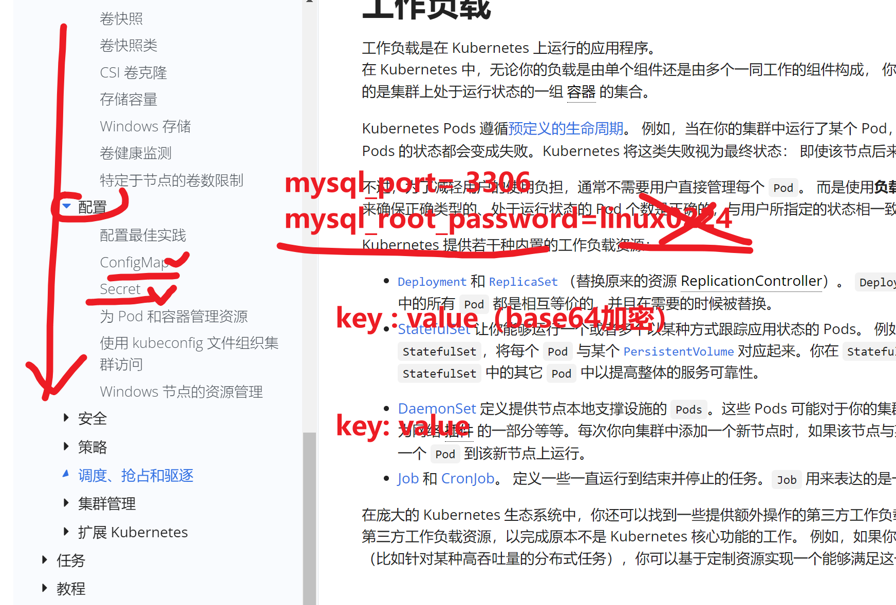


## k8s集群是否正常

````
[root@k8s-master-10 ~]#kubectl get nodes 
NAME            STATUS   ROLES    AGE   VERSION
k8s-master-10   Ready    master   21h   v1.19.3
k8s-node-11     Ready    <none>   21h   v1.19.3
k8s-node-12     Ready    <none>   21h   v1.19.3


# 输出命令格式

# -o wide 显示更详细完整的信息
[root@k8s-master-10 ~]#kubectl get nodes  -o wide
NAME            STATUS   ROLES    AGE   VERSION   INTERNAL-IP   EXTERNAL-IP   OS-IMAGE                KERNEL-VERSION          CONTAINER-RUNTIME
k8s-master-10   Ready    master   21h   v1.19.3   10.0.0.10     <none>        CentOS Linux 7 (Core)   3.10.0-862.el7.x86_64   docker://19.3.15
k8s-node-11     Ready    <none>   21h   v1.19.3   10.0.0.11     <none>        CentOS Linux 7 (Core)   3.10.0-862.el7.x86_64   docker://19.3.15
k8s-node-12     Ready    <none>   21h   v1.19.3   10.0.0.12     <none>        CentOS Linux 7 (Core)   3.10.0-862.el7.x86_64   docker://19.3.15


# -o 输出json
[root@k8s-master-10 ~]#kubectl get nodes  -o json


# -o yaml 输出为yaml格式
[root@k8s-master-10 ~]#kubectl get nodes  -o yaml


````


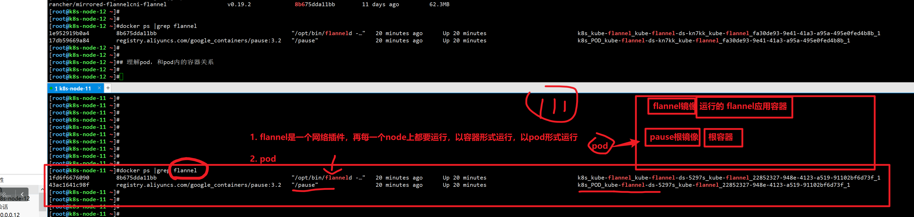


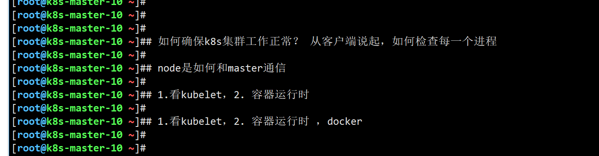


## 查看k8s集群内，默认提供了多少个资源（组件）让你玩呢？

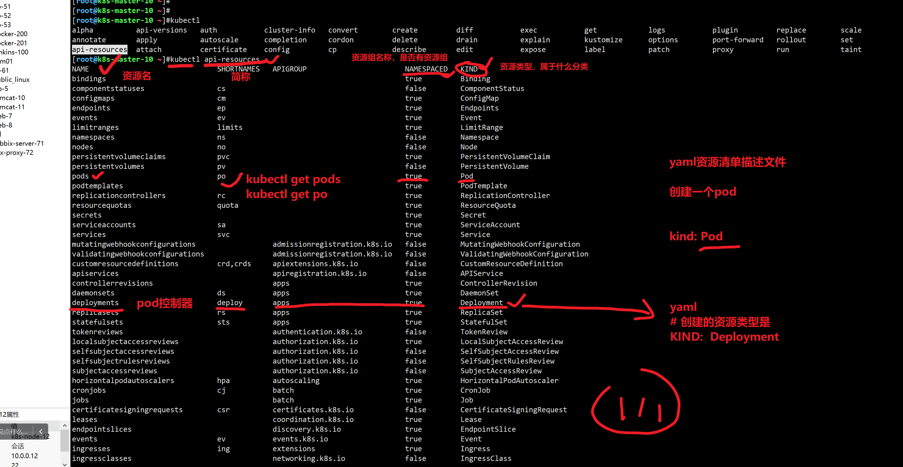


## 基于namespace查询资源

namespace这里的作用是资源组，对资源单独创建一个环境去管理。


默认有一个default资源组，namespace，kubectl不指定，默认就是它


```perl
[root@k8s-master-10 ~]#kubectl -n default get pods  -owide
NAME                    READY   STATUS    RESTARTS   AGE   IP         NODE          NOMINATED NODE   READINESS GATES
linux0224-pod-1-nginx   1/1     Running   1          21h   10.2.2.3   k8s-node-11   <none>           <none>
[root@k8s-master-10 ~]#
[root@k8s-master-10 ~]#
[root@k8s-master-10 ~]#kubectl  get pods  -owide
NAME                    READY   STATUS    RESTARTS   AGE   IP         NODE          NOMINATED NODE   READINESS GATES
linux0224-pod-1-nginx   1/1     Running   1          21h   10.2.2.3   k8s-node-11   <none>           <none>
[root@k8s-master-10 ~]#
[root@k8s-master-10 ~]#


[root@k8s-master-10 ~]#
[root@k8s-master-10 ~]## 基于kubectl run  linux0224-pod-1-nginx --image=nginx:1.14.1
[root@k8s-master-10 ~]#
[root@k8s-master-10 ~]#
[root@k8s-master-10 ~]##声明式，yaml模式去创建这个pod


# 基于现有的环境，去获取yaml，改就行了。
[root@k8s-master-10 ~]#kubectl get pods linux0224-pod-1-nginx  -oyaml > linux0224-pod-1.yml
[root@k8s-master-10 ~]#vim linux0224-pod-1.yml 

# 看懂这个技巧 ，刷222

# 基于这个yaml，再来创建一个，声明式的 pod-2

# 先删除无用的，k8s自动加上，pod运行信息

```

## 编写yaml，声明式，获取，创建资源描述清单的流程


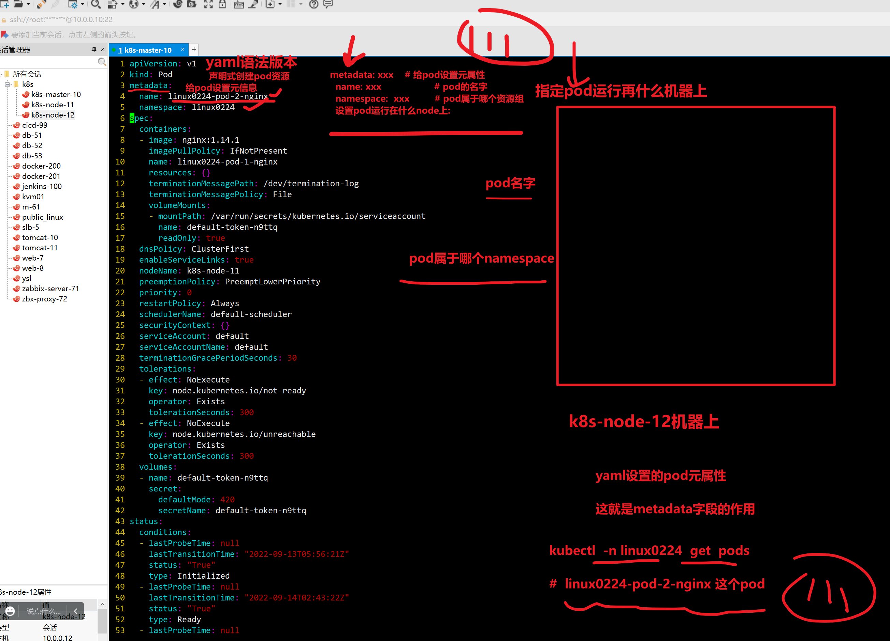


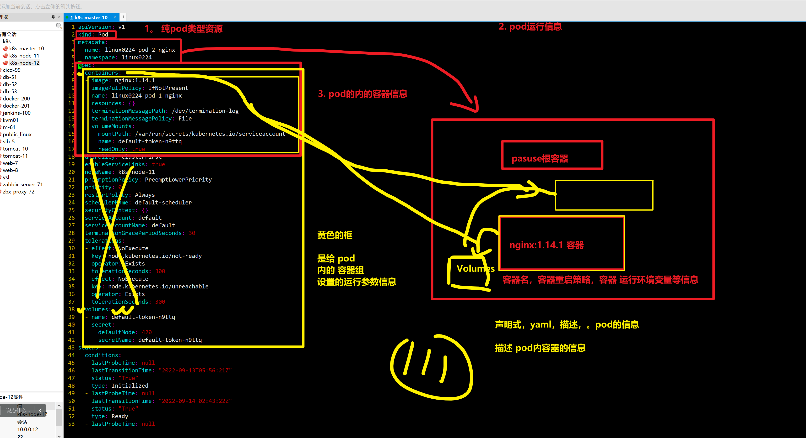


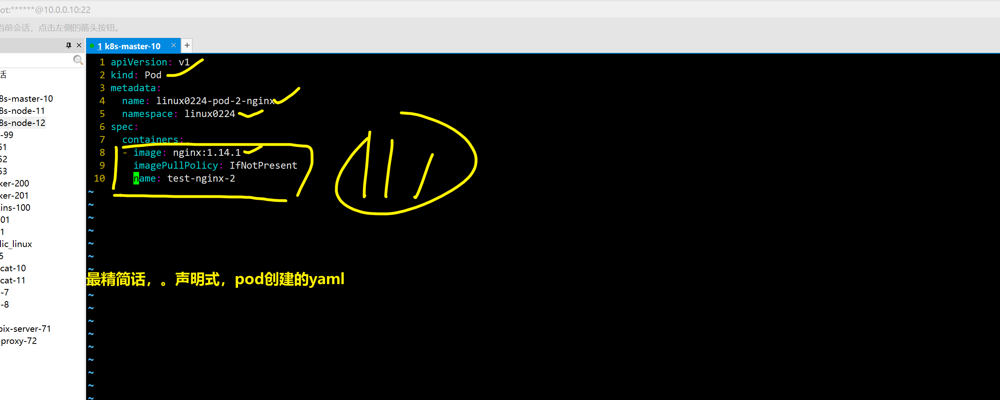


### 基于声明式yaml，创建pod资源

```
[root@k8s-master-10 ~]#vim linux0224-pod-2.yml 
[root@k8s-master-10 ~]#
[root@k8s-master-10 ~]#
[root@k8s-master-10 ~]#kubectl create -f linux0224-pod-2.yml 
Error from server (NotFound): error when creating "linux0224-pod-2.yml": namespaces "linux0224" not found
[root@k8s-master-10 ~]#cat linux0224-pod-
cat: linux0224-pod-: No such file or directory
[root@k8s-master-10 ~]#
[root@k8s-master-10 ~]#
[root@k8s-master-10 ~]#cat linux0224-pod-2.yml 
apiVersion: v1
kind: Pod
metadata:
  name: linux0224-pod-2-nginx
  namespace: linux0224
spec:
  containers:
  - image: nginx:1.14.1
    imagePullPolicy: IfNotPresent
    name: test-nginx-2
[root@k8s-master-10 ~]#

```


### 发现没有namespace，查看当前 master有哪些名称空间

```
[root@k8s-master-10 ~]#kubectl get namespaces 
NAME              STATUS   AGE
default           Active   22h
kube-flannel      Active   21h
kube-node-lease   Active   22h
kube-public       Active   22h
kube-system       Active   22h
[root@k8s-master-10 ~]#
[root@k8s-master-10 ~]#
[root@k8s-master-10 ~]#
[root@k8s-master-10 ~]#kubectl get po # 查看默认defualt下，有哪些pod
NAME                    READY   STATUS    RESTARTS   AGE
linux0224-pod-1-nginx   1/1     Running   1          21h
[root@k8s-master-10 ~]#
[root@k8s-master-10 ~]#
[root@k8s-master-10 ~]#
[root@k8s-master-10 ~]#kubectl -n kube-flannel  get po 
NAME                    READY   STATUS    RESTARTS   AGE
kube-flannel-ds-5297s   1/1     Running   1          21h
kube-flannel-ds-9x4l2   1/1     Running   1          21h
kube-flannel-ds-kn7kk   1/1     Running   1          21h
[root@k8s-master-10 ~]#
[root@k8s-master-10 ~]#
[root@k8s-master-10 ~]#
[root@k8s-master-10 ~]#
[root@k8s-master-10 ~]#kubectl -n kube-system get po # 猜一猜有谁？ api-server
NAME                                    READY   STATUS    RESTARTS   AGE
coredns-6d56c8448f-6bnpp                1/1     Running   1          22h
coredns-6d56c8448f-gkb7l                1/1     Running   1          22h
etcd-k8s-master-10                      1/1     Running   1          22h
kube-apiserver-k8s-master-10            1/1     Running   1          22h
kube-controller-manager-k8s-master-10   1/1     Running   1          22h
kube-proxy-2jk26                        1/1     Running   1          22h
kube-proxy-b7gzk                        1/1     Running   1          22h
kube-proxy-bdqln                        1/1     Running   1          22h
kube-scheduler-k8s-master-10            1/1     Running   1          22h
[root@k8s-master-10 ~]#
[root@k8s-master-10 ~]## 到这看懂666
[root@k8s-master-10 ~]#
[root@k8s-master-10 ~]## 到这看懂666 ，。基于名称空间，去查看一组资源
[root@k8s-master-10 ~]#
[root@k8s-master-10 ~]#

```


### 创建linux0224名称空间，去运行你的pod

```
[root@k8s-master-10 ~]#kubectl create namespace linux0224
namespace/linux0224 created
[root@k8s-master-10 ~]#
[root@k8s-master-10 ~]#
[root@k8s-master-10 ~]#kubectl get namespaces 
NAME              STATUS   AGE
default           Active   22h
kube-flannel      Active   21h
kube-node-lease   Active   22h
kube-public       Active   22h
kube-system       Active   22h
linux0224         Active   3s
[root@k8s-master-10 ~]#
[root@k8s-master-10 ~]#
[root@k8s-master-10 ~]#kubectl create -f linux0224-pod-2.yml 
pod/linux0224-pod-2-nginx created


```

## 理解pod描述字段，和容器描述字段的关系

11. 48


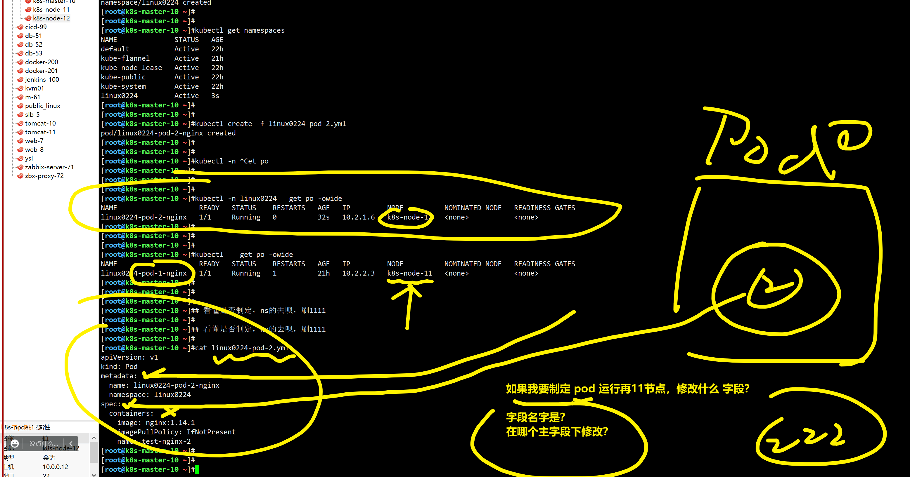


## 如何编辑公司现有的k8s资源，图解

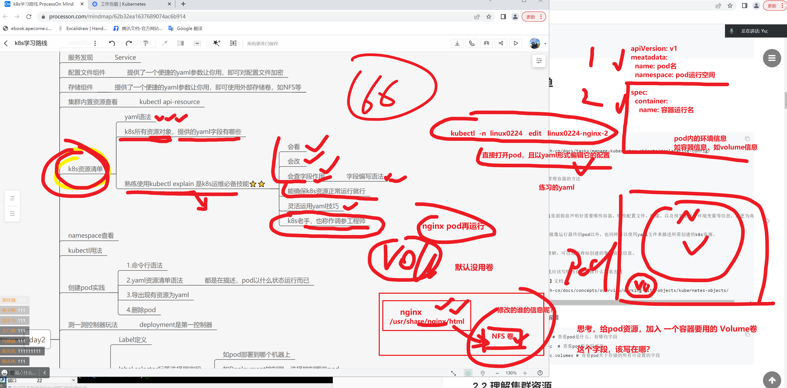


### 查看基于yaml创建出的nginx-pod-2

```

```

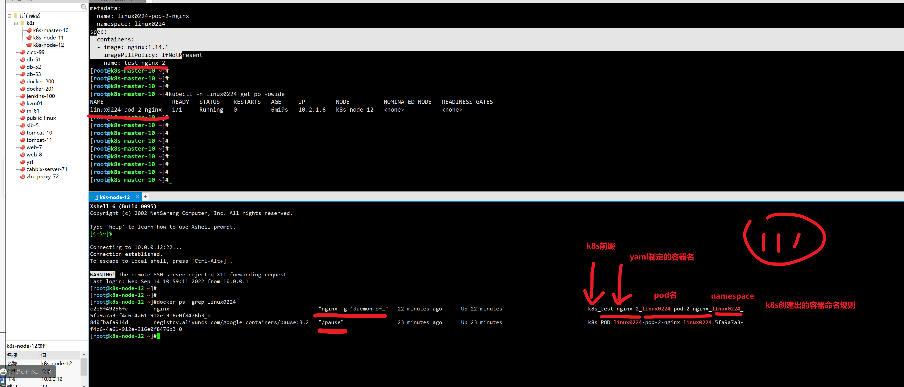


## 再来一个nginx-pod，查看容器命名规则

```
[root@k8s-master-10 /all-k8s-yaml]#cat nginx-pod-3.yml 
apiVersion: v1
kind: Pod
metadata:
  name: nginx-3
  namespace: linux0224
spec:
  containers:
  - image: nginx:1.21.1
    name: t3-nginx


# a创建资源


#记录pod的更新状态
C[root@k8s-master-10 /all-k8s-yaml]#kubectl -n linux0224 get po -o wide -w 
NAME                    READY   STATUS              RESTARTS   AGE   IP         NODE          NOMINATED NODE   READINESS GATES
linux0224-pod-2-nginx   1/1     Running             0          27m   10.2.1.6   k8s-node-12   <none>           <none>
nginx-3                 0/1     ContainerCreating   0          20s   <none>     k8s-node-11   <none>           <none>

nginx-3                 1/1     Running             0          21s   10.2.2.4   k8s-node-11   <none>           <none>


```

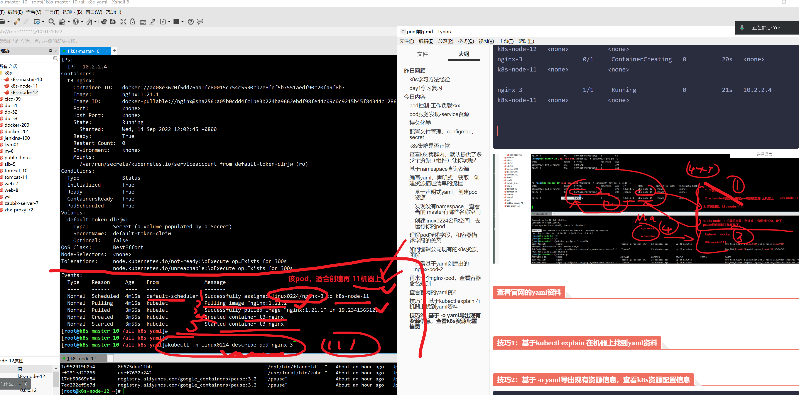


```
Events:
  Type    Reason     Age    From               Message
  ----    ------     ----   ----               -------
  Normal  Scheduled  4m15s  default-scheduler  Successfully assigned linux0224/nginx-3 to k8s-node-11
  Normal  Pulling    4m15s  kubelet            Pulling image "nginx:1.21.1"
  Normal  Pulled     3m55s  kubelet            Successfully pulled image "nginx:1.21.1" in 19.234136512s
  Normal  Created    3m55s  kubelet            Created container t3-nginx
  Normal  Started    3m55s  kubelet            Started container t3-nginx
[root@k8s-master-10 /all-k8s-yaml]#
[root@k8s-master-10 /all-k8s-yaml]#
[root@k8s-master-10 /all-k8s-yaml]#kubectl -n linux0224 describe pod nginx-3


```


### 查看，测试访问pod

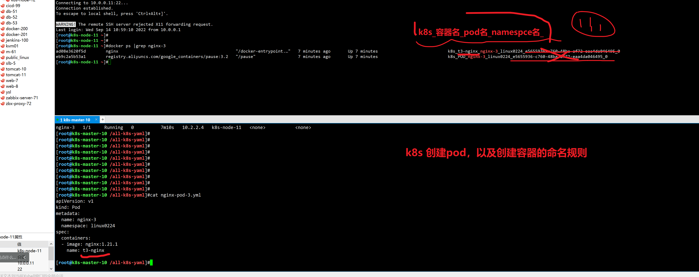


## =======今天开始===查看官网的yaml资料=========

今天任务简单点，学完昨日脑图知识点即可

主要学习目标

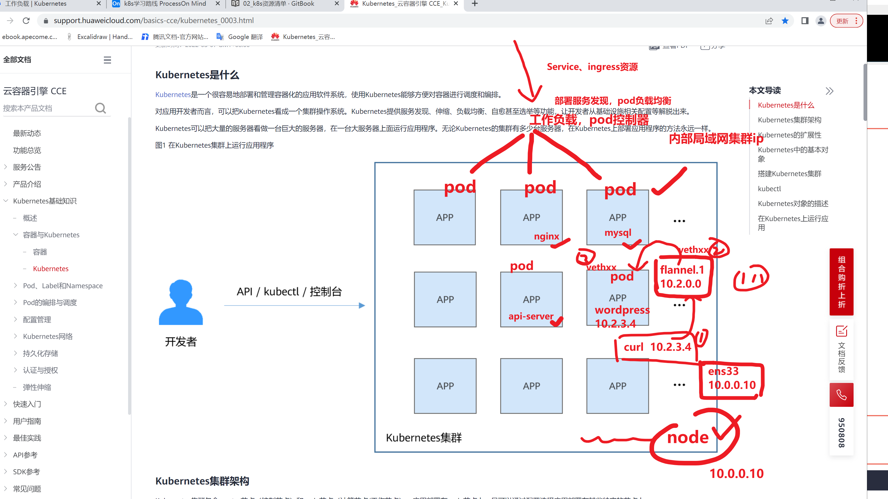


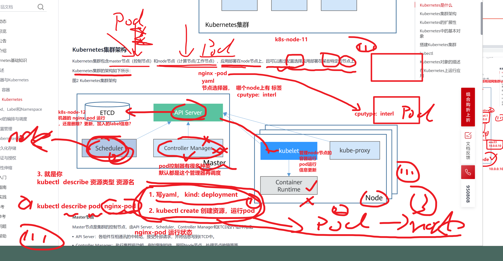


## 如何学习k8s最核心的对象（k8s集群内资源）

k8s的一些抽象的理念，pod，控制器，service，代码层面的逻辑概念。


集群外资源？node资源，k8s所处的机器，cpu，内存等资源


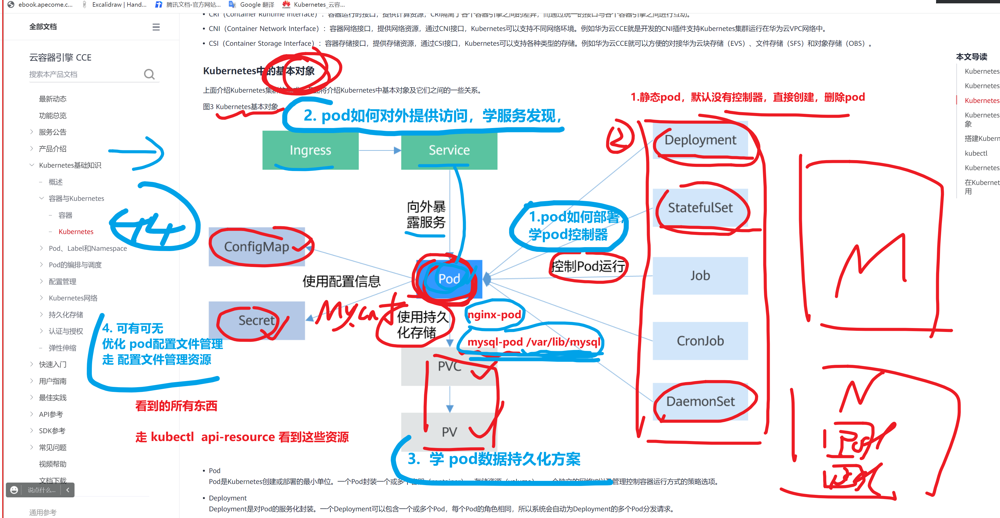


## 学习，理解k8s资源对象的正确姿势

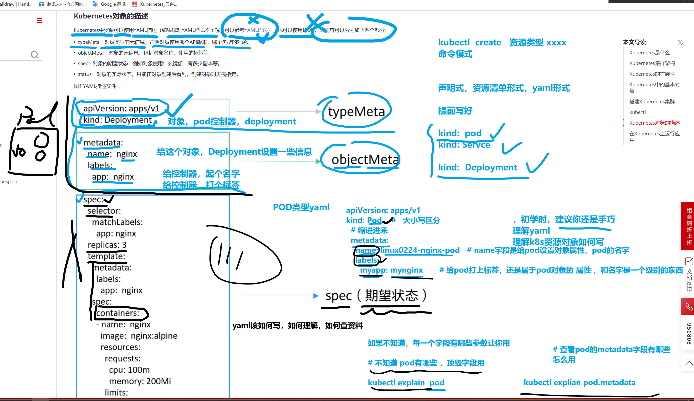


## 如何创建k8s资源，拿来及用

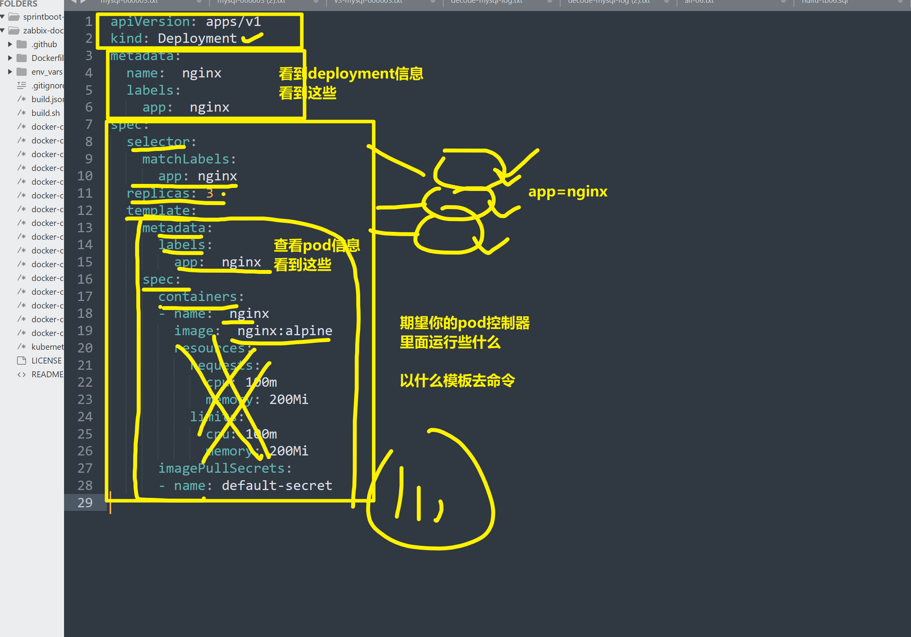

```yaml
# 、给pod控制器，放入到具体ns下

[root@k8s-master-10 ~]#kubectl create namespace linux0224
namespace/linux0224 created


# 修改yaml

```


### 查看Deployment顶级字段如何用

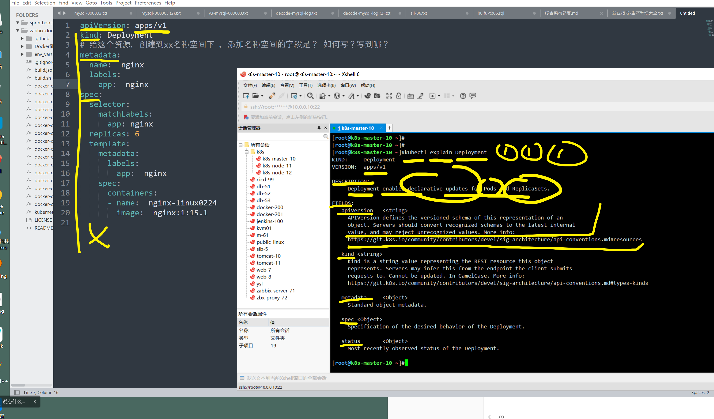


### 查看Deployment如何加入某namespace下

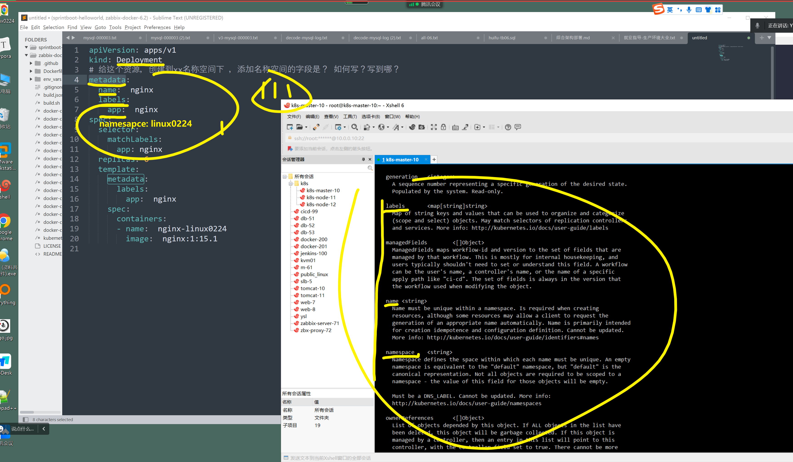

### 最终yaml

```yaml
apiVersion: apps/v1
kind: Deployment
# 给这个资源，创建到xx名称空间下 ，添加名称空间的字段是？ 如何写？写到哪？
metadata:
  name:  nginx
  labels:
    app:  nginx
  namespace: linux0224
spec:
  selector:
    matchLabels:
      app: nginx
  replicas: 6
  template:
    metadata:
      labels:
        app:  nginx
    spec:
      containers:
      - name:  nginx-linux0224
        image:  nginx:1:15.1
# 当前这个yaml，没有描述，NodeSelector，节点选择器，以后说，自动分配到某个Node节点上的


```


### 创建声明式yaml的k8s对象

```
[root@k8s-master-10 /all-k8s-yml]#vim t1-nginx-deployment.yml
[root@k8s-master-10 /all-k8s-yml]#
[root@k8s-master-10 /all-k8s-yml]#
[root@k8s-master-10 /all-k8s-yml]#kubectl create -f t1-nginx-deployment.yml 
deployment.apps/nginx created


```

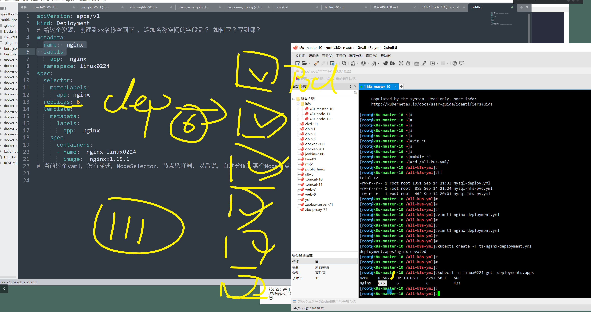

查看所有pod的信息

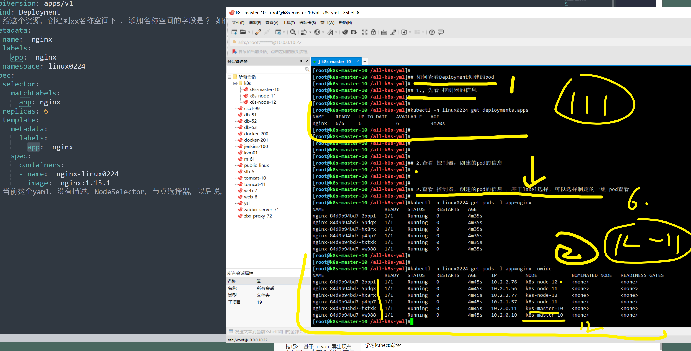


### 修改namespace下的pod信息


```
[root@k8s-master-10 /all-k8s-yml]#kubectl exec nginx-84d9b94bd7-hx8rx -- bash -c 'echo "sleep yi hui  ">/usr/share/nginx/html/index.html'  
Error from server (NotFound): pods "nginx-84d9b94bd7-hx8rx" not found
[root@k8s-master-10 /all-k8s-yml]#
[root@k8s-master-10 /all-k8s-yml]#
[root@k8s-master-10 /all-k8s-yml]#
[root@k8s-master-10 /all-k8s-yml]#kubectl  -n linux0224  exec nginx-84d9b94bd7-hx8rx -- bash -c 'echo "sleep yi hui  ">/usr/share/nginx/html/index.html'  
[root@k8s-master-10 /all-k8s-yml]#
[root@k8s-master-10 /all-k8s-yml]#
[root@k8s-master-10 /all-k8s-yml]#
[root@k8s-master-10 /all-k8s-yml]## kandong 111
[root@k8s-master-10 /all-k8s-yml]#
[root@k8s-master-10 /all-k8s-yml]#curl 10.2.2.77
sleep yi hui  

```


# 静态POD玩法流程

都主动加上namespace去理解


背景：

linux0224 该名称空间下的资源


## 命令行创建pod


```
先查看当前所有的pods 详细信息
kubectl -n linux0224 get pods -owide


创建 nginx1.21.1   静态pod
[root@k8s-master-10 /all-k8s-yml]#kubectl -n linux0224 run --image=nginx:1.21.1 my-pod-1-nginx
pod/my-pod-1-nginx created


创建  mysql5.7   pod

[root@k8s-master-10 /all-k8s-yml]#kubectl -n linux0224 run --image=mysql:5.7  my-pod-2-mysql
pod/my-pod-2-mysql created


查看当前ns所有的pods 详细信息

[root@k8s-master-10 /all-k8s-yml]#kubectl -n linux0224 get pods -owide


访问nginx-pod
[root@k8s-master-10 /all-k8s-yml]#curl -I 10.2.1.58


发现mysql-pod，还在创建容器，看看它的详细信息
[root@k8s-master-10 /all-k8s-yml]#kubectl -n linux0224 describe pod my-pod-2-mysql 


查看events信息即可
Events:
  Type     Reason     Age                From               Message
  ----     ------     ----               ----               -------
  Normal   Scheduled  99s                default-scheduler  Successfully assigned linux0224/my-pod-2-mysql to k8s-node-11
  Normal   Pulling    99s                kubelet            Pulling image "mysql:5.7"
  Normal   Pulled     71s                kubelet            Successfully pulled image "mysql:5.7" in 28.467102149s
  Normal   Created    27s (x4 over 71s)  kubelet            Created container my-pod-2-mysql
  Normal   Pulled     27s (x3 over 70s)  kubelet            Container image "mysql:5.7" already present on machine
  Normal   Started    26s (x4 over 71s)  kubelet            Started container my-pod-2-mysql
  Warning  BackOff    12s (x6 over 69s)  kubelet            Back-off restarting failed container


再来查看pod的信息吗，状态，只看mysql-pod信息

[root@k8s-master-10 /all-k8s-yml]#kubectl -n linux0224 get pods my-pod-2-mysql  -owide
NAME             READY   STATUS             RESTARTS   AGE     IP          NODE          NOMINATED NODE   READINESS GATES
my-pod-2-mysql   0/1     CrashLoopBackOff   5          5m38s   10.2.1.59   k8s-node-11   <none>           <none>

# 查看pod内容器的运行日志


```


### 查看k8s资源的详细信息

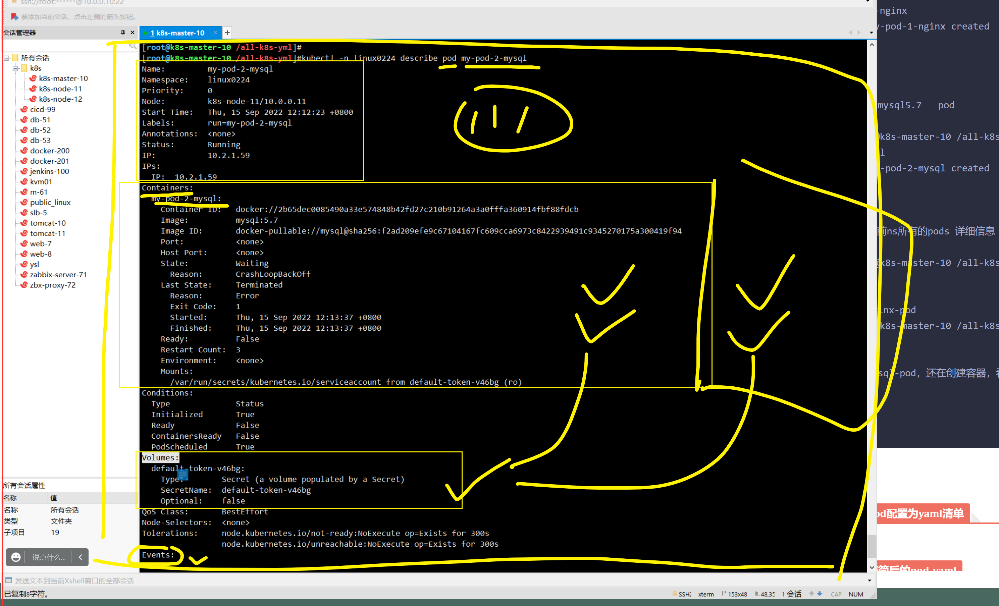


### 查看pod日志，找出故障原因

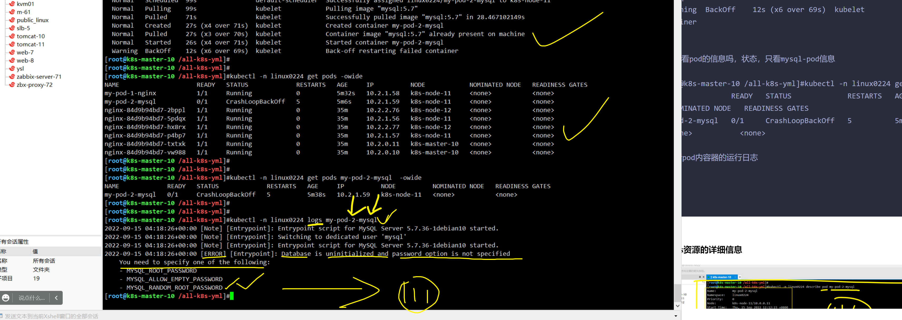

````
pod创建成共，容器运行参数有问题，导致挂了

kubectl run 弊端

得编辑修改pod信息即可


````

### 编辑pod配置

```
[root@k8s-master-10 /all-k8s-yml]#kubectl -n linux0224 edit pods my-pod-2-mysql 

```


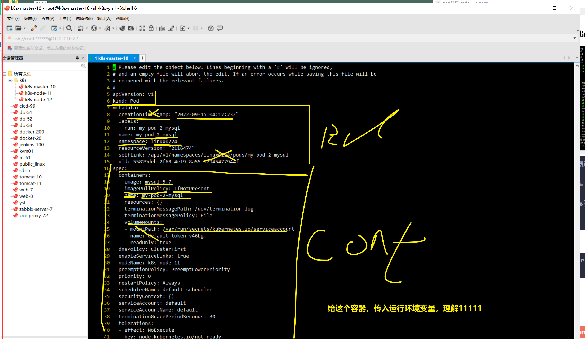


### 给pod修改env环境变量（不支持修改pod的env环境变量）

```
[root@k8s-master-10 ~]#kubectl explain Pod.spec.containers.env


发现不允许修改。
```


### 运行一个可访问的mysql5.7，声明式yaml去运行

```
# yaml怎么写？
# 基于现有资源，修改即可
[root@k8s-master-10 ~]#kubectl -n linux0224 get po my-pod-2-mysql -oyaml > /all-k8s-yml/my-pod-2-mysql.yml

# 修改如下

[root@k8s-master-10 ~]#cat /all-k8s-yml/my-pod-2-mysql.yml 
apiVersion: v1
kind: Pod
metadata:
  labels:
    run: my-pod-2-mysql
  name: my-pod-2-mysql
  namespace: linux0224
spec:
  containers:
  - image: mysql:5.7
    imagePullPolicy: IfNotPresent
    name: my-pod-2-mysql
    env:
      - name: MYSQL_ROOT_PASSWORD
        value: 'linux0224'


# 查看pod，以及显示pod的标签信息
# 删除旧的pod
[root@k8s-master-10 /all-k8s-yml]#kubectl -n linux0224 delete pod my-pod-2-mysql 
pod "my-pod-2-mysql" deleted


#再新建新的pod
[root@k8s-master-10 /all-k8s-yml]#kubectl -n linux0224 get pods -l run=my-pod-2-mysql -o wide
NAME             READY   STATUS    RESTARTS   AGE   IP          NODE          NOMINATED NODE   READINESS GATES
my-pod-2-mysql   1/1     Running   0          39s   10.2.1.60   k8s-node-11   <none>           <none>
[root@k8s-master-10 /all-k8s-yml]#
[root@k8s-master-10 /all-k8s-yml]#
[root@k8s-master-10 /all-k8s-yml]## 到这都看懂111
[root@k8s-master-10 /all-k8s-yml]#
[root@k8s-master-10 /all-k8s-yml]#
[root@k8s-master-10 /all-k8s-yml]## 用一个临时pod，访问这个mysql-pod，然后退出自动删除自己
[root@k8s-master-10 /all-k8s-yml]#
[root@k8s-master-10 /all-k8s-yml]#


# 可以临时开启一个pod，去链接mysql-pod服务端
[root@k8s-master-10 /all-k8s-yml]#kubectl -n linux0224 run test-mysql  --rm -it --image=mysql:5.7 -- bash


# 查看mysql-pod本身的输数据信息

[root@k8s-master-10 /all-k8s-yml]#
[root@k8s-master-10 /all-k8s-yml]#kubectl -n linux0224 exec my-pod-2-mysql -- bash -c 'mysql -uroot -plinux0224 -e "show databases;"'
mysql: [Warning] Using a password on the command line interface can be insecure.
Database
information_schema
linux0224666
mysql
performance_schema
sys
[root@k8s-master-10 /all-k8s-yml]#
[root@k8s-master-10 /all-k8s-yml]## kandong 1111111


```


## 导出pod配置为yaml清单

```
[root@k8s-master-10 /all-k8s-yml]#kubectl -n linux0224 get pods my-pod-2-mysql -o yaml > /tmp/latest_mysql57.yml

```


## 查看精简后的pod-yaml

```
[root@k8s-master-10 /all-k8s-yml]#cat my-pod-2-mysql.yml 
apiVersion: v1
kind: Pod
metadata:
  labels:
    run: my-pod-2-mysql
  name: my-pod-2-mysql
  namespace: linux0224
spec:
  containers:
  - image: mysql:5.7
    imagePullPolicy: IfNotPresent
    name: my-pod-2-mysql
    env:
      - name: MYSQL_ROOT_PASSWORD
        value: 'linux0224'
[root@k8s-master-10 /all-k8s-yml]#

```


## 删除创建的pod

- 静态pod

- 控制器下的pod区别


```
如kubectl run创建的

如 yaml中创建的是 KIND: pod类型

删除了就没了，不会自建

[root@k8s-master-10 /all-k8s-yml]#kubectl -n linux0224 delete pod my-pod-1-nginx 
pod "my-pod-1-nginx" deleted
[root@k8s-master-10 /all-k8s-yml]#


# 查看pod资源的标签
[root@k8s-master-10 /all-k8s-yml]#kubectl -n linux0224 get pods -owide  --show-labels 


# 基于标签删除pod
[root@k8s-master-10 /all-k8s-yml]#kubectl -n linux0224 delete pods -l run=my-pod-2-mysql
pod "my-pod-2-mysql" deleted


# 删除deployment控制器下的nginx
[root@k8s-master-10 /all-k8s-yml]#kubectl -n linux0224 describe pods nginx-84d9b94bd7-5pdqx


# 删不掉，副本保障，重建6个nginx-pod

```


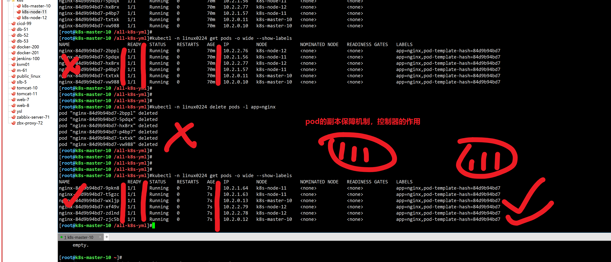


## 查看deployment和pod 两个资源

```
[root@k8s-master-10 /all-k8s-yml]#kubectl -n linux0224 get pods


[root@k8s-master-10 /all-k8s-yml]#kubectl -n linux0224 get deployments.apps 
NAME    READY   UP-TO-DATE   AVAILABLE   AGE
nginx   6/6     6            6           72m

```


## 删除deployment

删除pod、控制器的区别

````
[root@k8s-master-10 /all-k8s-yml]#
[root@k8s-master-10 /all-k8s-yml]#
[root@k8s-master-10 /all-k8s-yml]#kubectl -n linux0224 delete deployments.apps nginx 
deployment.apps "nginx" deleted
[root@k8s-master-10 /all-k8s-yml]#kubectl -n linux0224 get deployments.apps 
No resources found in linux0224 namespace.
[root@k8s-master-10 /all-k8s-yml]#kubectl -n linux0224 get pods
No resources found in linux0224 namespace.
[root@k8s-master-10 /all-k8s-yml]#

````


### 检测pods信息变化

```
[root@k8s-master-10 ~]#kubectl -n linux0224 get pods -w

```


## 基于资源清单创建资源

略过


## 查看pod具体字段的详细解释

```
[root@k8s-master-10 /all-k8s-yml]#kubectl explain pod.metadata.namespace

```


# label玩法---学习kubectl命令

- node的查看，node标签管理,，给机器加上一个标签 k-v

```
[root@k8s-master-10 /all-k8s-yml]#kubectl get nodes -owide --show-labels 


# 修改node节点的 label信息
[root@k8s-master-10 /all-k8s-yml]#kubectl label nodes k8s-node-12 diskType=sansumssd --overwrite 
node/k8s-node-12 labeled

# 查看标签
[root@k8s-master-10 /all-k8s-yml]#kubectl get nodes -owide --show-labels -l diskType=sansumssd
NAME          STATUS   ROLES    AGE   VERSION   INTERNAL-IP   EXTERNAL-IP   OS-IMAGE                KERNEL-VERSION          CONTAINER-RUNTIME   LABELS
k8s-node-12   Ready    <none>   10d   v1.19.3   10.0.0.12     <none>        CentOS Linux 7 (Core)   3.10.0-862.el7.x86_64   docker://19.3.15    beta.kubernetes.io/arch=amd64,beta.kubernetes.io/os=linux,diskType=sansumssd,kubernetes.io/arch=amd64,kubernetes.io/hostname=k8s-node-12,kubernetes.io/os=linux


# 给11机器加一个标签

[root@k8s-master-10 /all-k8s-yml]#kubectl label nodes k8s-node-11 cpuType=interl
node/k8s-node-11 labeled
[root@k8s-master-10 /all-k8s-yml]#
[root@k8s-master-10 /all-k8s-yml]#kubectl label nodes k8s-node-11 cpuType=intel --overwrite 
node/k8s-node-11 labeled
[root@k8s-master-10 /all-k8s-yml]#
[root@k8s-master-10 /all-k8s-yml]#
[root@k8s-master-10 /all-k8s-yml]#kubectl get nodes -owide --show-labels -l cpuType=intel
NAME          STATUS   ROLES    AGE   VERSION   INTERNAL-IP   EXTERNAL-IP   OS-IMAGE                KERNEL-VERSION          CONTAINER-RUNTIME   LABELS
k8s-node-11   Ready    <none>   10d   v1.19.3   10.0.0.11     <none>        CentOS Linux 7 (Core)   3.10.0-862.el7.x86_64   docker://19.3.15    beta.kubernetes.io/arch=amd64,beta.kubernetes.io/os=linux,cpuType=intel,daemon=need,kubernetes.io/arch=amd64,kubernetes.io/hostname=k8s-node-11,kubernetes.io/os=linux
[root@k8s-master-10 /all-k8s-yml]#

```


- 静态pod创建，命令模式，查看，编辑，描述，删除

```
没有yaml的形式哦，不推荐使用


kubectl run   xxxx

kubectl get pods   xxxx

kubectl edit  pods  xxxx

kubectl describe pods    xxxx

kubectl delete pods     xxxx


```


- 静态pod的 yaml模式，声明式定义，增删改查

```
yaml语法，删除资源 

kubectl explain  资源.字段.字段.xxxxxx

kubectl  create  -f    xx.yml

kubectl  delete -f  xx.yml


```


- pod打标签，增删改查


```
[root@k8s-master-10 /all-k8s-yml]#kubectl -n linux0224 get po --show-labels 
NAME             READY   STATUS    RESTARTS   AGE   LABELS
my-pod-2-mysql   1/1     Running   0          16s   run=my-pod-2-mysql


增


删


改


查


```

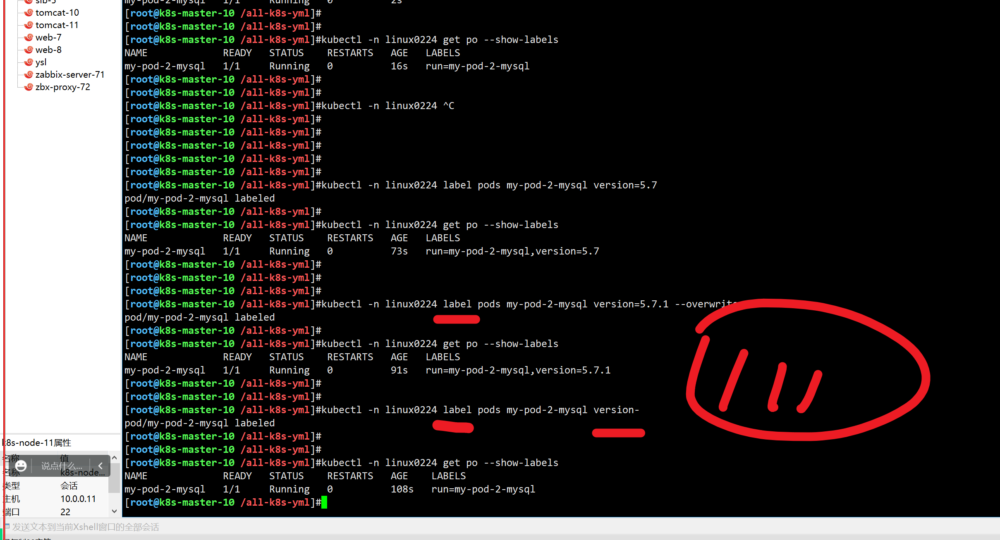


- 初体验控制器deployment玩法


散会。


完成学习笔记

预习、


