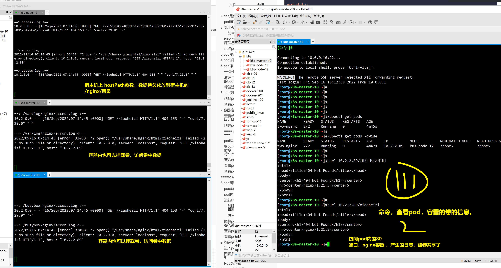
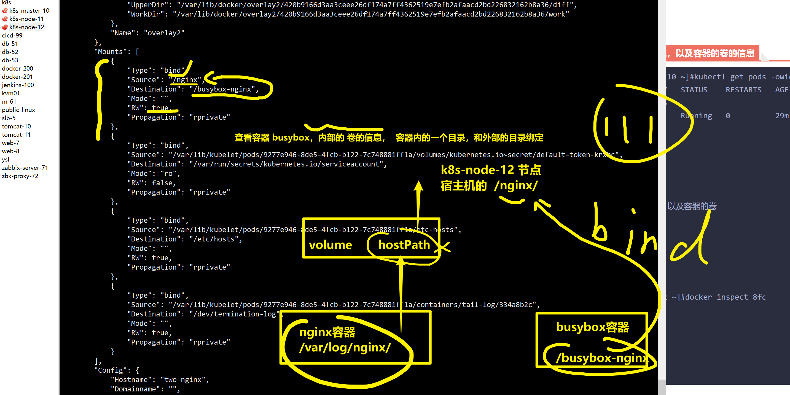
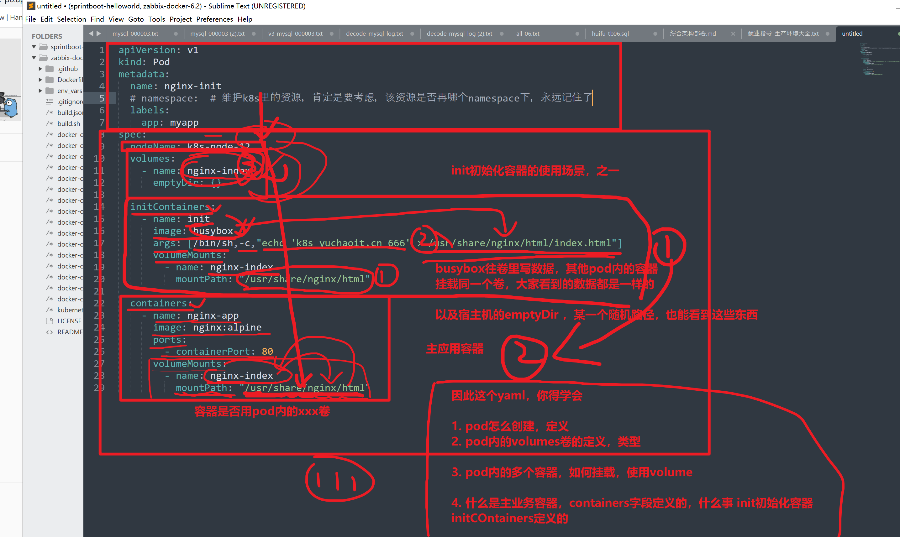

```### 此资源由 58学课资源站 收集整理 ###
	想要获取完整课件资料 请访问：58xueke.com
	百万资源 畅享学习

```
# 1.pod是什么

官网资料

https://kubernetes.io/zh-cn/docs/concepts/workloads/pods/

普通pod

```
kubectl run   xxxx  # 立即创建运行一个pod，再目标node上，静态pod

```


## pod该如何用


应该走控制器去维护pod


# 2.创建Pod

```
kubectrl run  不推荐使用


写声明式脚本yaml

看懂
会查，遇见不认识的字段，知道怎么查意思，以及如何基于yaml去填入值

```


具体一个创建pod的yaml

是我大意了，也是坑，好事

清空这个错误的环境

```
[root@k8s-master-10 /all-k8s-yml]#kubectl delete -f day4-pod.yml 
pod "nginx-linux0224" deleted
[root@k8s-master-10 /all-k8s-yml]## 1. api-server  2. etcd查询该pod信息   3.api-server通知目标node机器的kubelet去干活，删除容器，确认容器删除后，kubelet再返回数据给api-server吗，再更新etcd数据，确认pod被删除


```


```yaml
apiVersion: v1                      # Kubernetes的API Version
kind: Pod                           # Kubernetes的资源类型
metadata:
  name: nginx-linux0224                      # Pod的名称
  namespace: linux0224

spec:                               # Pod的具体规格（specification），pod里面跑什么
  containers:  # 定义pod内运行的容器信息
    - image: nginx:1.14.1             # 使用的镜像为 nginx:alpine
      name: container-1               # pod内，运行的第一个容器的名字
      
    - image: mysql:5.7
      name: container-2
      env:
        - name: MYSQL_ROOT_PASSWORD
          value: "linux0224"
# kubectl explain  Pod.spec.containers.name


```

创建pod，创建资源

```
kubectl create -f day4-pod.yml  #  ns是？ default

[root@k8s-master-10 /all-k8s-yml]#kubectl -n linux0224 describe pods nginx-linux0224 

[root@k8s-master-10 /all-k8s-yml]#kubectl -n linux0224 get pods nginx-linux0224 -owide --show-labels
NAME              READY   STATUS    RESTARTS   AGE    IP          NODE          NOMINATED NODE   READINESS GATES   LABELS
nginx-linux0224   2/2     Running   0          117s   10.2.1.72   k8s-node-11   <none>           <none>            <none>


```

### 如何更新pod的信息

```
【【【【【【【【【【【【编辑pod资源】】】】】】】】】】】】】】


# 1. 基于label命令可以更新pod 标签

[root@k8s-master-10 /all-k8s-yml]#kubectl -n linux0224 label pods nginx-linux0224 my=pod2 --overwrite 
pod/nginx-linux0224 labeled


# 2.  修改源yaml，是否可以？
[root@k8s-master-10 /all-k8s-yml]#cat day4-pod.yml 
apiVersion: v1                      # Kubernetes的API Version
kind: Pod                           # Kubernetes的资源类型
metadata:
  name: nginx-linux0224                      # Pod的名称
  namespace: linux0224
  labels:
    my: pod1

spec:                               # Pod的具体规格（specification），pod里面跑什么
  containers:  # 定义pod内运行的容器信息
    - image: nginx:1.14.1             # 使用的镜像为 nginx:alpine
      name: container-1               # pod内，运行的第一个容器的名字
      
    - image: mysql:5.7
      name: container-2
      env:
        - name: MYSQL_ROOT_PASSWORD
          value: "linux0224"
[root@k8s-master-10 /all-k8s-yml]#

#


# 3.  直接 edit 编辑pod资源


```


## kubectl apply基于yaml更新资源信息

```
[root@k8s-master-10 /all-k8s-yml]#kubectl apply -f day4-pod.yml 
Warning: kubectl apply should be used on resource created by either kubectl create --save-config or kubectl apply
pod/nginx-linux0224 configured
[root@k8s-master-10 /all-k8s-yml]#


[root@k8s-master-10 /all-k8s-yml]#kubectl -n linux0224 get pods --show-labels 
NAME              READY   STATUS    RESTARTS   AGE   LABELS
my-pod-2-mysql    1/1     Running   1          22h   run=my-pod-2-mysql
nginx-linux0224   2/2     Running   0          10m   my=pod1


```


## 小结pod资源创建，更新玩法


# 3.pod资源状态查看

```
# 是否添加名称空间

# 以及是否添加参数


[root@k8s-master-10 /all-k8s-yml]#kubectl -n linux0224 get pods 
NAME              READY   STATUS    RESTARTS   AGE
my-pod-2-mysql    1/1     Running   1          22h
nginx-linux0224   2/2     Running   0          40m
[root@k8s-master-10 /all-k8s-yml]#
[root@k8s-master-10 /all-k8s-yml]#
[root@k8s-master-10 /all-k8s-yml]#
[root@k8s-master-10 /all-k8s-yml]#
[root@k8s-master-10 /all-k8s-yml]#
[root@k8s-master-10 /all-k8s-yml]#kubectl -n linux0224 get pods -o wide
NAME              READY   STATUS    RESTARTS   AGE   IP          NODE          NOMINATED NODE   READINESS GATES
my-pod-2-mysql    1/1     Running   1          22h   10.2.1.68   k8s-node-11   <none>           <none>
nginx-linux0224   2/2     Running   0          40m   10.2.1.72   k8s-node-11   <none>           <none>
[root@k8s-master-10 /all-k8s-yml]#
[root@k8s-master-10 /all-k8s-yml]#
[root@k8s-master-10 /all-k8s-yml]#
[root@k8s-master-10 /all-k8s-yml]#kubectl -n linux0224 get pods -o wide --show-labels 
NAME              READY   STATUS    RESTARTS   AGE   IP          NODE          NOMINATED NODE   READINESS GATES   LABELS
my-pod-2-mysql    1/1     Running   1          22h   10.2.1.68   k8s-node-11   <none>           <none>            run=my-pod-2-mysql
nginx-linux0224   2/2     Running   0          40m   10.2.1.72   k8s-node-11   <none>           <none>            k2=v2,my=pod2


```


# 4.pod详情查看

```
[root@k8s-master-10 /all-k8s-yml]#kubectl -n linux0224 describe pods nginx-linux0224 

```


# 5.pod停止删除

基于标签

基于资源对象的名字

删除的是哪个名称空间


## 一次性删除多个pod


````
[root@k8s-master-10 /all-k8s-yml]#kubectl -n linux0224 delete pods my-pod-2-mysql nginx-linux0224
pod "my-pod-2-mysql" deleted
pod "nginx-linux0224" deleted


````


## 清理当前namespace下所有的pod，默认就是default

```
[root@k8s-master-10 /all-k8s-yml]#kubectl delete pods  --all  # 删除default名称空间下的 所有 pods对象
pod "client-mysql" deleted
pod "my-nginx-1" deleted
pod "my-nginx-13" deleted
pod "my-nginx-2" deleted


# 能真的，删除所有pod吗？会有限制吗？如？

#  pod是基于控制器创建
# 删除逻辑

↓
删控制器
↓
等于删除pod


听懂111


```


## 标签选择器删除pod

```
[root@k8s-master-10 /all-k8s-yml]#kubectl -n linux0224 get pods -w -owide


```


# 6.pod使用环境变量


## 创建pod-env

```
apiVersion: v1
kind: Pod
metadata:
  name: yuchao-nginx
  namespace: linux0224
  labels:
    l1: v1
    l2: v2
    l3: v3
  
spec:
    containers:
    - image: nginx:alpine
      name: container-0
      env:                            # 环境变量
      - name: my_env
        value: v1
      - name: my_env2
        value: v2

```

创建

```
[root@k8s-master-10 /all-k8s-yml]#cat day4-pod-env.yml 
apiVersion: v1
kind: Pod
metadata:
  name: pod-env-2
  namespace: linux0224
  labels:
    l1: v1
    l2: v2
    l3: v3
  
spec:
    containers:
    - image: nginx:alpine
      name: container-0
      env:                            # 环境变量
      - name: my_env
        value: v1
      - name: my_env2
        value: v2

[root@k8s-master-10 /all-k8s-yml]#
[root@k8s-master-10 /all-k8s-yml]#
[root@k8s-master-10 /all-k8s-yml]#
[root@k8s-master-10 /all-k8s-yml]#kubectl create -f day4-pod-env.yml 
pod/pod-env-2 created
[root@k8s-master-10 /all-k8s-yml]#
[root@k8s-master-10 /all-k8s-yml]#kubectl -n linux0224 get pods
NAME              READY   STATUS    RESTARTS   AGE
nginx-linux0224   2/2     Running   0          7m20s
pod-env-2         1/1     Running   0          5s

```


## 查看pod内环境变量

111


````
查看pod资源的信息


1.  docker  容器内env # 找到目标Node

[root@k8s-node-11 ~]#docker exec k8s_container-0_pod-env-2_linux0224_597f8d4f-5181-4959-bb8d-cf62b0e8a84f_0  env  |grep -E 'my_env|my_env2'
my_env2=v2
my_env=v1


2.   pod exec 看信息
[root@k8s-master-10 /all-k8s-yml]#kubectl -n linux0224 exec pod-env-2 -- env |grep -E 'my_env|my_env2'
my_env2=v2
my_env=v1


3.   describe

[root@k8s-master-10 /all-k8s-yml]#kubectl -n linux0224 describe pods pod-env-2 

    Environment:
      my_env:   v1
      my_env2:  v2


Labels:       l1=v1
              l2=v2
              l3=v3


4.   看yaml
[root@k8s-master-10 /all-k8s-yml]#kubectl -n linux0224 get pods pod-env-2 -o yaml 

spec:
  containers:
  - env:
    - name: my_env
      value: v1
    - name: my_env2
      value: v2


````


# 7.容器启动命令

创建pod，运行容器（默认执行CMD）


## 查看给容器设置的运行参数字段，k8s资源里面如何找

```
[root@k8s-master-10 /all-k8s-yml]#kubectl explain pod.spec.containers.command

```


## 创建pod-command-busybox

查看yaml实例

```
apiVersion: v1
kind: Pod
metadata:
  name: day4-busybox-pod-cmd
  namespace: linux0224 # 单独开一个ns环境
spec:
  containers:
  - image: busybox
    name: day4-busybox-pod-cmd 

# busybox 镜像，运行容器后，默认执行bash，容器运行后立即退出了

# pod  > busybox 
```


运行结果

```
busybox pod ,运行pod后，运行容器，只执行bash命令

pod重启容器，一开始提示pod状态complete，完成状态

多次重启发现容器无法运行，提示
CrashLoopBackOff
```


## ==== pod反复重启状态解释===


```
1. 上述的busybox pod 反复重启，是为何？

2.首先pod内的容器是正常退出的，运行后就结束了

3. 默认pod策略restartPlicy是always，也就是pod会不断重启，反复进入，complete,crash状态


4.查看pod重启策略
[root@k8s-master-10 /all-k8s-yml/day4]#kubectl -n linux0224 get pods -oyaml  |grep -i always
      imagePullPolicy: Always
    restartPolicy: Always

```


## pod运行的多种状态

running ，pod内的容器，都以及ready就绪了可以工作了

···


```
[root@k8s-master-10 /all-k8s-yml]#kubectl -n linux0224 logs day4-busybox-pod-cmd 

```


## 继续运行pod，让pod执行个命令，运行centos7容器，执行curl命令

```
[root@k8s-master-10 /all-k8s-yml]#
[root@k8s-master-10 /all-k8s-yml]#cat day4-pod-cmd.yml 
apiVersion: v1
kind: Pod
metadata:
  name: day4-pod-cmd
  namespace: linux0224 # 单独开一个ns环境
spec:
  containers:
  - image: centos:7.9.2009
    name: day4-nginx-pod-cmd 
    command:
      - "curl"
      - "www.apecome.com"
[root@k8s-master-10 /all-k8s-yml]#


```


## 查看ns下的pod

```
kubectl -n linux0224 get pods -owide
```


## 查看pod事件

```
kubectl -n linux0224 describe  pods xxxxx


```


## 查看pod日志

```
[root@k8s-master-10 /all-k8s-yml]#cat day4-nginx-logs.yml 
apiVersion: v1
kind: Pod
metadata:
  name: mynginx
  namespace: linux0224
spec:
  containers:
  - image: nginx:alpine
    name: container-0


[root@k8s-master-10 /all-k8s-yml]#kubectl -n linux0224  logs -f mynginx 

```


# ====2.40 继续====


# 8.pod网络空间原理

## pause容器


```
https://jimmysong.io/kubernetes-handbook/concepts/pause-container.html


像 Pod 这样一个东西，本身是一个逻辑概念。那在机器上，它究竟是怎么实现的呢？这就是我们要解释的一个问题。

既然说 Pod 要解决这个问题，核心就在于如何让一个 Pod 里的多个容器之间最高效的共享某些资源和数据。

因为容器之间原本是被 Linux Namespace 和 cgroups 隔开的，所以现在实际要解决的是怎么去打破这个隔离，然后共享某些事情和某些信息。这就是 Pod 的设计要解决的核心问题所在。

所以说具体的解法分为两个部分：网络和存储。

Pause 容器就是为解决 Pod 中的网络问题而生的。

kubernetes 中的 pause 容器主要为每个业务容器提供以下功能：

在 pod 中担任 Linux 命名空间共享的基础；

启用 pid 命名空间，开启 init 进程。
```


## pod内共享网络空间

```
1.pod内的所有容器，都通过container模式，使用pause容器的网络空间（docker那一块的知识点）
2.容器看到的网络环境，就是根容器的环境
3.pod内的一组容器可以直接走localhost通信
4.pod内的多个容器不能重复用同一端口
5.pod的生命周期，代表了内部的所有容器生命周期
```


## 运行Pod内多个容器


```yaml
apiVersion: v1
kind: Pod
metadata:
  name: two-nginx
spec:
  nodeName: k8s-node-12

  volumes:
  - name: nginx-log   # 定义卷的名字
    hostPath:    # 卷的映射方式，映射到宿主机上的具体目录 
      path: /nginx/   # 宿主机，节点的目录名

  containers:
  - name: nginx-two
    image: nginx:alpine
    volumeMounts:    # 容器1，nginx容器，挂载本地的目录，到卷中，实现数据共享
      - name: nginx-log
        mountPath: /var/log/nginx/  # nginx容器本地的目录，

  - name: tail-log
    image: busybox   # 
    args: [/bin/sh,-c,'tail -f /busybox-nginx/access.log']
    volumeMounts:  # 该容器，也挂载这个卷的目录
      - name: nginx-log
        mountPath: /busybox-nginx/ 
```

### 创建pod，多个容器，以及查看数据的挂载

```
[root@k8s-master-10 /all-k8s-yml/day4]#kubectl create -f pod-volume.yal 
pod/two-nginx created
[root@k8s-master-10 /all-k8s-yml/day4]#
[root@k8s-master-10 /all-k8s-yml/day4]#
[root@k8s-master-10 /all-k8s-yml/day4]#kubectl get pods -owide
NAME        READY   STATUS    RESTARTS   AGE   IP          NODE          NOMINATED NODE   READINESS GATES
two-nginx   2/2     Running   0          4s    10.2.2.89   k8s-node-12   <none>           <none>
[root@k8s-master-10 /all-k8s-yml/day4]#

```


### 进入pod内制定的容器


## 图解pod，内的多个容器，对卷的数据的挂在使用





## 查看pod内容器的网络信息


```
# pod看不到容器内的网络信息

# 直接看容器的网络信息


# 进入容器内看
[root@k8s-master-10 ~]#kubectl exec -it two-nginx -c tail-log -- sh

# 
[root@k8s-master-10 ~]#kubectl exec -it two-nginx -c nginx-two  -- sh


# 走docker inspect去看


```


15. 35 继续


## 查看pod的卷的信息，以及容器的卷的信息

```
[root@k8s-master-10 ~]#kubectl get pods -owide
NAME        READY   STATUS    RESTARTS   AGE   IP          NODE          NOMINATED NODE   READINESS GATES
two-nginx   2/2     Running   0          29m   10.2.2.89   k8s-node-12   <none>           <none>


# k8s去看pod的卷，以及容器的卷


# 直接看容器的卷

[root@k8s-node-12 ~]#docker inspect 8fc 


# 再看nginx容器的卷的信息
[root@k8s-node-12 ~]#docker inspect 82c 


```




## 带着一个问题思考，pod被删除，这个nginx日志会如何？

```
# 最终在哪？
# volume卷的类型，hostPath类型，将pod内的 数据，持久化放到了节点上 k8s-node-12的 /nginx/中
# 伏笔，如下一步，pod内数据，放入NFS持久化


[root@k8s-node-12 /nginx]#ll
total 8
-rw-r--r-- 1 root root  259 Sep 16 15:14 access.log
-rw-r--r-- 1 root root 2457 Sep 16 15:47 error.log
[root@k8s-node-12 /nginx]#


[root@k8s-master-10 ~]#
[root@k8s-master-10 ~]## 通知容器要退出，程序要结束，容器结束，pod结束
[root@k8s-master-10 ~]#
[root@k8s-master-10 ~]#

```


# 9.图解多容器pod

xxx讲解过了。


## Pod练习题

> 将之前docker课程里的
>
> flask计数器程序+redis两个容器，放入同一个pod里运行，确保用curl可以访问。

```
0. 得有源码，物料，代码+配置文件+启动脚本（开发提供）

[root@k8s-node-12 /flask-k8s]#cat run.py 
from flask import Flask
from redis import Redis

app = Flask(__name__)
redis = Redis(host='127.0.0.1', port=6379)

@app.route('/')
def hello():
    count = redis.incr('dianji')
    return '成功k8s迁移运行flask程序 , 这个页面被点击了 {} 次\n'.format(count)

if __name__ == "__main__":
    app.run(host="0.0.0.0", debug=True)


# 启动python程序，测试启动方式，（生产启动方式）

# 写个启动脚本
[root@k8s-node-11 /my-flask-redis]#cat start.sh 
python3 run.py

# 加上个依赖文件
[root@k8s-node-11 /my-flask-redis]#cat requirements.txt 
flask
redis


## 交付思路，以镜像作为最终交付标准，以及打上版本标签


1. 构建镜像 ，提供python3环境，解释器，pip3包
Dockerfile

==========================================
FROM python:3.9.7
MAINTAINER linux0224
# 源码，写入镜像内
COPY run.py /opt
COPY requirements.txt /opt
COPY start.sh /opt
WORKDIR /opt                   # 容器内的环境上下文， /opt    1111
RUN pip3 install --upgrade pip -i https://pypi.douban.com/simple
RUN pip3 install -r /opt/requirements.txt -i https://pypi.douban.com/simple


2.再制定的节点上，构建镜像
[root@k8s-node-11 /my-flask-redis]#docker build --no-cache -t my-flask-redis .

[root@k8s-node-11 /my-flask-redis]#docker images my-flask-redis
REPOSITORY          TAG                 IMAGE ID            CREATED             SIZE
my-flask-redis      latest              4502bad4a9b1        25 seconds ago      937MB

看懂11111


3.节点上的镜像有了，不就可以k8s部署

- 拉去镜像
- 创建pod
- 运行容器


4. pod > flask+redis

准备pod的yaml
[root@k8s-master-10 /all-k8s-yml/day4]#cat v1-flask-redis.yml 
apiVersion: v1
kind: Pod
metadata:
  name: my-flask-redis-pod

spec:
  nodeName: k8s-node-11
  containers:
  - image: redis
    name: my-reids-1 


  - image: my-flask-redis:latest
    imagePullPolicy: IfNotPresent  # 如果该node有这个镜像，就不去 docker pull
    name: my-flask-2 
    command:
        - "bash"
        - "/opt/start.sh"


5. 创建资源，查看资源，调试资源
[root@k8s-master-10 /all-k8s-yml/day4]#kubectl create -f v1-flask-redis.yml 


[root@k8s-master-10 /all-k8s-yml/day4]#kubectl get pods -owide
NAME                 READY   STATUS    RESTARTS   AGE     IP          NODE          NOMINATED NODE   READINESS GATES
my-flask-redis-pod   2/2     Running   0          2m36s   10.2.1.78   k8s-node-11   <none>           <none>


[root@k8s-master-10 /all-k8s-yml/day4]#kubectl logs -f  my-flask-redis-pod -c my-flask-2 
 * Serving Flask app 'run'
 * Debug mode: on
WARNING: This is a development server. Do not use it in a production deployment. Use a production WSGI server instead.
 * Running on all addresses (0.0.0.0)
 * Running on http://127.0.0.1:5000
 * Running on http://10.2.1.78:5000
Press CTRL+C to quit
 * Restarting with stat
 * Debugger is active!
 * Debugger PIN: 204-619-073
10.2.2.0 - - [16/Sep/2022 09:25:18] "GET / HTTP/1.1" 200 -


[root@k8s-node-12 ~]#curl 10.2.1.78:5000
成功k8s迁移运行flask程序 , 这个页面被点击了 11 次
[root@k8s-node-12 ~]#curl 10.2.1.78:5000
成功k8s迁移运行flask程序 , 这个页面被点击了 12 次
[root@k8s-node-12 ~]#curl 10.2.1.78:5000
成功k8s迁移运行flask程序 , 这个页面被点击了 13 次
[root@k8s-node-12 ~]#


去redis里查查key -value

      

[root@k8s-master-10 /all-k8s-yml/day4]#kubectl exec -it my-flask-redis-pod -c my-reids-1 -- sh
# 
# 
# 
# 
# 
# redis-cli
127.0.0.1:6379> dbsize
(integer) 1
127.0.0.1:6379> 
127.0.0.1:6379> keys *
1) "dianji"
127.0.0.1:6379> TYPE dianji
string
127.0.0.1:6379> 
127.0.0.1:6379> 
127.0.0.1:6379> get dianji
"13"
127.0.0.1:6379> get dianji
"17"
127.0.0.1:6379> 


# 11
```


### 拍错思路


# ======10.pod生命周期=======

上周截止到这里，k8s部署python flask源代码+ redis数据库运行环境


```
pod
运行1个活或者多个容器


pod
应用+数据库

yaml怎么写 pod，跑起来就的了


镜像怎么构建


部署多个应用容器


数据库类，有状态应用。


pod单独泡在一个机器上吗？分布式再多个Node节点shang


k8s-node-11 flask pod

k8s-node-12  redis pod


```


## pod状态与生命周期


## pod运行几种status图解


# 11.容器生命周期钩子


Kubernetes提供了[容器生命周期钩子](https://kubernetes.io/docs/concepts/containers/container-lifecycle-hooks/)，在容器的生命周期的特定阶段执行调用，比如容器在停止前希望执行某项操作，就可以注册相应的钩子函数。目前提供的生命周期钩子函数如下所示。

- 启动后处理（PostStart）：容器启动后触发。
- 停止前处理（PreStop）：容器停止前触发。

实际使用时，只需配置Pod的lifecycle.postStart或lifecycle.preStop参数，如下所示。


## pod生命周期完整示意


## 文字详解pod生命周期


# 12.pod如何封装容器

我们已知道pod是可以运行一个、多个容器的抽象组件。

在实际工作中该如何考虑，一个pod运行一个、还是多个容器？

## 图解POD部署思路


# 13.初始化容器

> 先知道有这些容器字段的用法，可以完成一些环境检查，环境初始化的需求。
>
> 并不是说一定要加上，遇见了该一类初始化容器，理解其作用、如何查询字段，知道如何用即可。
>
> 具体该怎么灵活的去用，还要根据实际环境，去逐步思考，而不是每一个pod都加上初始化容器（考虑是否有必要）

## 创建、访问nginx-init容器

```yaml
apiVersion: v1
kind: Pod
metadata:
  name: nginx-init
  namespace: yuchaoit
  labels:
    app: myapp
spec:
  nodeName: k8s-node-12
  volumes:
    - name: nginx-index
      emptyDir: {}

  initContainers:
    - name: init 
      image: busybox
      args: [/bin/sh,-c,"echo 'k8s yuchaoit.cn 666' > /usr/share/nginx/html/index.html"]
      volumeMounts:
        - name: nginx-index
          mountPath: "/usr/share/nginx/html"

  containers:
    - name: nginx-app
      image: nginx:alpine
      ports:
        - containerPort: 80
      volumeMounts:
        - name: nginx-index
          mountPath: "/usr/share/nginx/html"
```





# 14.pod生命周期钩子


## 查看初始化容器的容器字段的关系

```
[root@k8s-master-10 /all-k8s-yml/day5]#kubectl explain pod.spec |grep -E 'containers|initContainers'


```


## 查看容器字段的，钩子功能字段

```
[root@k8s-master-10 /all-k8s-yml/day5]#kubectl explain pod.spec.containers.lifecycle


```


## postStart


启动后处理（PostStart）：容器启动后触发。

查询启动钩子，有哪些参数

```

```


### 用法1 ，执行命令方式


```
apiVersion: v1
kind: Pod
metadata:
  name: nginx-hook
  labels:
    app: myapp-hook
spec:
  containers:
    - name: nginx-hook
      image: nginx:alpine
      ports:
        - containerPort: 80
      lifecycle:
        postStart:
          exec:
            command: [/bin/sh,-c,'echo k8s 不错不错 666 >> /usr/share/nginx/html/index.html']
  nodeName: k8s-node-12


# 再nginx容器启动后，容器内执行个命令
```


## 演示，钩子，执行失败的话，会一直重启容器

```
[root@k8s-master-10 /all-k8s-yml/day5]#cat poststart-pod-nginx.yml 
apiVersion: v1
kind: Pod
metadata:
  name: nginx-hook
  labels:
    app: myapp-hook
spec:
  containers:
    - name: nginx-hook
      image: nginx:alpine
      ports:
        - containerPort: 80
      lifecycle:
        postStart:
          exec:
          # 主动修改错误的钩子命令，最为演示
            command: [/bin/sh,-c,'echo k8s 不错不错 666 >> /uuuuuuusr/share/nginx/html/index.html']
  nodeName: k8s-node-12


# 再nginx容器启动后，容器内执行个命令
[root@k8s-master-10 /all-k8s-yml/day5]#

```


### 用法2  启动后钩子的http方法


试试，钩子的http方法


```
apiVersion: v1
kind: Pod
metadata:
  name: nginx-hook
  labels:
    app: myapp-hook
spec:
  containers:
    - name: nginx-hook
      image: nginx:alpine  
      ports:
        - containerPort: 80
      lifecycle:
        postStart:
          #exec:
          #  command: [/bin/sh,-c,'echo k8s 不错不错 666 >> /usr/share/nginx/html/index.html']
          httpGet:
            port: 80
            path: /linux0224  # /首页  ，部署flask程序 /index /login  /home /register
           
  nodeName: k8s-node-12

```


学习k8s资源玩法

```
1. kubectl explain 去查看资源的方法，解释，用法


2. 资源创建后，是否运行，还是出错，要学会如何去看

1111


```


## 总结启动钩子


### 创建、访问pod以及钩子效果


## prestop

将nginx日志，挂载到宿主机上，然后退出pod，查看日志变化。

```
容器退出前，会执行这个钩子函数

```


```yaml
apiVersion: v1
kind: Pod
metadata:
  name: nginx-hook-pre
  labels:
    app: myapp-hook-pre


spec:
  nodeName: k8s-node-12

  volumes:
    - name: nginxlog
      hostPath:
        path: /nginx_log/


  containers:
    - name: nginx-hook-pre
      image: nginx:alpine
      ports:
        - containerPort: 80
      lifecycle:
        postStart:
          exec:
            command: [/bin/sh,-c,'echo k8s  linux0224 加油鸭  ！！！  66 >> /usr/share/nginx/html/index.html']

        preStop:
          exec:
            command: [/bin/sh,-c,'echo 再见吧您！学个锤子，躺平不好吗！！！！>> /var/log/nginx/prestop-test.log']
      volumeMounts:
        - name: nginxlog
          mountPath: /var/log/nginx/
```


### 创建访问


### 干掉停止pod


# 15.Pod健康探针

> 1.就好比nginx运行后，你或许得先curl -I  确保状态码是200，才得知nginx这个进程是正确运行了。
>
> 2.nginx正常就代表你的网站正常了吗？你如果不去访问后端的URL接口，让代码加载，才能知道到底程序是否正常。
>
> 这就是探针存在的意义。


## 存活探针、liveness probe

```
# explpan  , cka 

[root@k8s-master-10 /all-k8s-yml/day5]#kubectl explain pod.spec.containers.livenessProbe


```


## 【命令】去探测容器存活


### 思考题、先运行一个不健康的pod


```
答案

livenessprobe探针，exec执行失败，文件路径不存在，导致健康探针不正确，kill，重启容器
有时候会重启失败

反复重启，反复不健康


为什么还会是running，是因为，nginx是正常启动了，就进入running，健康运行的。

但是里面业务可能还是错的，因此需要就绪探针。

查看pod内容器默认的重启策略


[root@k8s-master-10 ~]#kubectl get pod liveness-pod -oyaml |grep -i restart
        f:restartPolicy: {}
  restartPolicy: Always
    restartCount: 0


```


```

```


```
确保，存活探针，查看nginx首页文件，命令正确执行，则，判断容器是健康的。

[root@k8s-master-10 /all-k8s-yml/day5]#cat liveness-probe-nginx-pod.yml 
apiVersion: v1
kind: Pod
metadata:
  name: liveness-pod
  labels:
    app: myapp-liveness
spec:
  nodeName: k8s-node-12

  volumes:
    - name: nginx-html
      hostPath:
        path: /usr/share/nginx/html


  containers:
    - name: nginx-liveness
      image: nginx:alpine
      imagePullPolicy: IfNotPresent
      lifecycle:
        postStart:
          exec:
            command: [/bin/sh,-c,'echo k8s  还挺有意思，但是内容太多，任重而道远。。。。。 666 >> /usr/share/nginx/html/index.html']
        preStop:
          exec:
            command: [/bin/sh,-c,'echo 学个锤子。。>> /usr/share/nginx/html/index.html']

      livenessProbe:
        exec:
          command:
            - cat
            - /usr/share/nginx/html/index.htmllllllllllllllllll
        initialDelaySeconds: 3 # 3秒后探针
        periodSeconds: 5   # 隔5秒谈一次
      volumeMounts:
        - name: nginx-html
          mountPath: /usr/share/nginx/html
[root@k8s-master-10 /all-k8s-yml/day5]#

```


### 探针参数解释


### 运行探针pod

```

```


## 【httpGet】 探针

```

```


### 检查httpGet探针结果


### 参数解释

如上，这个Probe往容器的80端口发送HTTP GET请求，如果请求不成功，Kubernetes会重启容器。


## =====存活探针结果参数（describe查看）=======


## 该什么时候用健康探针


# =========16.就绪探针============

> 12.50


这里也就是上面说的，如何确保服务部署正确

1.可访问 200 OK（监控）

2.业务可提供解析，前后端链路正确工作（就绪）


## yaml

Readiness Probe的配置与[存活探针（livness probe）](https://support.huaweicloud.com/basics-cce/kubernetes_0010.html)一样，都是在Pod Template的containers里面

如下所示，这个Readiness Probe向Pod发送HTTP请求，当Probe收到2xx或3xx返回时，说明Pod已经就绪。


### 运行就绪探针（非就绪演示）


```
apiVersion: v1
kind: Pod
metadata:
  name: readiness-http-pod
  namespace: yuchaoit
  labels:
    app: myapp-readiness
spec:
  nodeName: k8s-node-12

  volumes:
    - name: nginx-html
      hostPath:
        path: /usr/share/nginx/html


  containers:
    - name: nginx-readiness
      image: nginx:alpine
      imagePullPolicy: IfNotPresent
      lifecycle:
        postStart:
          exec:
            command: [/bin/sh,-c,'echo k8s www.yuchaoit.cn 666 >> /usr/share/nginx/html/index.html']
        preStop:
          exec:
            command: [/bin/sh,-c,'echo 再见吧您！超哥打卡下班了！www.yuchaoit.cn >> /usr/share/nginx/html/index.html']

      livenessProbe:
        #exec:
        #  command:
        #   - cat
        #    - /usr/share/nginx/html/index.html

        httpGet:
          path: /index.html
          port: 80

        initialDelaySeconds: 3
        periodSeconds: 1

      readinessProbe:
        httpGet:
          path: /read
          port: 80
        initialDelaySeconds: 10    # 容器启动后多久开始探测
        timeoutSeconds: 2          # 表示容器必须在2s内做出相应反馈给probe，否则视为探测失败
        periodSeconds: 30          # 探测周期，每30s探测一次
        successThreshold: 1        # 连续探测1次成功表示成功
        failureThreshold: 3        # 连续探测3次失败表示失败

      volumeMounts:
        - name: nginx-html
          mountPath: /usr/share/nginx/html
          
```


### 运行就绪探针（非就绪演示）


```
apiVersion: v1
kind: Pod
metadata:
  name: readiness-http-pod-2
  labels:
    app: myapp-readiness
spec:
  nodeName: k8s-node-12

  volumes:
    - name: nginx-html
      hostPath:
        path: /linux0224/


  containers:
    - name: nginx-readiness
      image: nginx:alpine
      imagePullPolicy: IfNotPresent
      lifecycle:
        postStart:
          exec:
            command: [/bin/sh,-c,'echo k8s www.yuchaoit.cn 666 >> /usr/share/nginx/html/index.html']
        preStop:
          exec:
            command: [/bin/sh,-c,'echo 再见吧您！超哥打卡下班了！www.yuchaoit.cn >> /usr/share/nginx/html/index.html']

      livenessProbe:
        #exec:
        #  command:
        #   - cat
        #    - /usr/share/nginx/html/index.html

        httpGet:
          path: /index.html
          port: 80

        initialDelaySeconds: 3
        periodSeconds: 1

      readinessProbe:
        httpGet:
          path: /read
          port: 80
        initialDelaySeconds: 10    # 容器启动后多久开始探测
        timeoutSeconds: 2          # 表示容器必须在2s内做出相应反馈给probe，否则视为探测失败
        periodSeconds: 30          # 探测周期，每30s探测一次
        successThreshold: 1        # 连续探测1次成功表示成功
        failureThreshold: 3        # 连续探测3次失败表示失败

      volumeMounts:
        - name: nginx-html
          mountPath: /usr/share/nginx/html
          
```


## 如何让pod就绪？


```
apiVersion: v1
kind: Pod
metadata:
  name: readiness-http-pod-2
  labels:
    app: myapp-readiness
spec:
  nodeName: k8s-node-12

  volumes:
    - name: nginx-html
      hostPath:
        path: /linux0224/


  containers:
    - name: nginx-readiness
      image: nginx:alpine
      imagePullPolicy: IfNotPresent
      lifecycle:
        postStart:
          exec:
            command: [/bin/sh,-c,'echo k8s www.yuchaoit.cn 666 >> /usr/share/nginx/html/index.html']
        preStop:
          exec:
            command: [/bin/sh,-c,'echo 再见吧您！超哥打卡下班了！www.yuchaoit.cn >> /usr/share/nginx/html/index.html']

      livenessProbe:
        #exec:
        #  command:
        #   - cat
        #    - /usr/share/nginx/html/index.html

        httpGet:
          path: /index.html
          port: 80

        initialDelaySeconds: 3
        periodSeconds: 1

      readinessProbe:
        httpGet:
          path: /read
          port: 80
        initialDelaySeconds: 10    # 容器启动后多久开始探测
        timeoutSeconds: 2          # 表示容器必须在2s内做出相应反馈给probe，否则视为探测失败
        periodSeconds: 30          # 探测周期，每30s探测一次
        successThreshold: 1        # 连续探测1次成功表示成功
        failureThreshold: 3        # 连续探测3次失败表示失败

      volumeMounts:
        - name: nginx-html
          mountPath: /usr/share/nginx/html
          
          
```


# 17.pod资源限制


