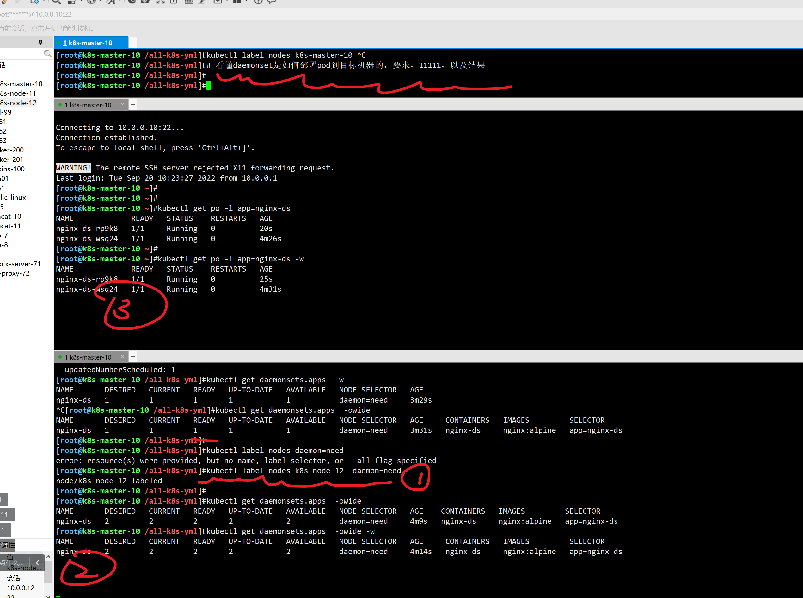
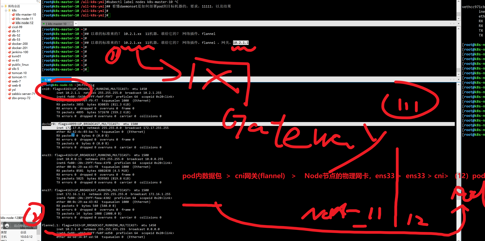

```### 此资源由 58学课资源站 收集整理 ###
	想要获取完整课件资料 请访问：58xueke.com
	百万资源 畅享学习

```
# 5.DaemonSet控制器,

DaemonSet是这样一种对象（守护进程），它在集群的每个节点上运行一个Pod，且保证只有一个Pod，这非常适合一些系统层面的应用，例如日志收集、资源监控等，这类应用需要每个节点都运行，且不需要太多实例，一个比较好的例子就是Kubernetes的kube-proxy。

> DaemonSet跟节点相关，如果节点异常，也不会在其他节点重新创建。


## 查看k8s默认安装的flannel网络插件，使用pod控制器

```
k8s集群，想正常工作，实现pod跨节点通信

先确保，每个Node节点，部署好一个flannel 应用pod。

走的就是daemonset控制器


```


## 查看flannle名称空间的资源

```
[root@k8s-master-10 ~]#
[root@k8s-master-10 ~]#
[root@k8s-master-10 ~]#kubectl -n kube-flannel get all -owide
NAME                        READY   STATUS    RESTARTS   AGE   IP          NODE            NOMINATED NODE   READINESS GATES
pod/kube-flannel-ds-47dn4   1/1     Running   4          15d   10.0.0.11   k8s-node-11     <none>           <none>
pod/kube-flannel-ds-768rd   1/1     Running   4          15d   10.0.0.10   k8s-master-10   <none>           <none>
pod/kube-flannel-ds-vjtl9   1/1     Running   4          15d   10.0.0.12   k8s-node-12     <none>           <none>

NAME                             DESIRED   CURRENT   READY   UP-TO-DATE   AVAILABLE   NODE SELECTOR   AGE   CONTAINERS     IMAGES                                                  SELECTOR
daemonset.apps/kube-flannel-ds   3         3         3       3            3           <none>          15d   kube-flannel   docker.io/rancher/mirrored-flannelcni-flannel:v0.19.2   app=flannel
[root@k8s-master-10 ~]#
[root@k8s-master-10 ~]#
[root@k8s-master-10 ~]#
[root@k8s-master-10 ~]#
[root@k8s-master-10 ~]#
[root@k8s-master-10 ~]#kubectl get nodes -owide --show-labels 
NAME            STATUS   ROLES    AGE   VERSION   INTERNAL-IP   EXTERNAL-IP   OS-IMAGE                KERNEL-VERSION          CONTAINER-RUNTIME   LABELS
k8s-master-10   Ready    master   15d   v1.19.3   10.0.0.10     <none>        CentOS Linux 7 (Core)   3.10.0-862.el7.x86_64   docker://19.3.15    beta.kubernetes.io/arch=amd64,beta.kubernetes.io/os=linux,kubernetes.io/arch=amd64,kubernetes.io/hostname=k8s-master-10,kubernetes.io/os=linux,node-role.kubernetes.io/master=,role=ingress-nginx-controller
k8s-node-11     Ready    <none>   15d   v1.19.3   10.0.0.11     <none>        CentOS Linux 7 (Core)   3.10.0-862.el7.x86_64   docker://19.3.15    beta.kubernetes.io/arch=amd64,beta.kubernetes.io/os=linux,cpuType=intel,daemon=need,kubernetes.io/arch=amd64,kubernetes.io/hostname=k8s-node-11,kubernetes.io/os=linux
k8s-node-12     Ready    <none>   15d   v1.19.3   10.0.0.12     <none>        CentOS Linux 7 (Core)   3.10.0-862.el7.x86_64   docker://19.3.15    beta.kubernetes.io/arch=amd64,beta.kubernetes.io/os=linux,diskType=sansumssd,kubernetes.io/arch=amd64,kubernetes.io/hostname=k8s-node-12,kubernetes.io/os=linux
[root@k8s-master-10 ~]#
[root@k8s-master-10 ~]#
[root@k8s-master-10 ~]#
[root@k8s-master-10 ~]#
[root@k8s-master-10 ~]#kubectl -n kube-flannel get pods -owide --show-labels 
NAME                    READY   STATUS    RESTARTS   AGE   IP          NODE            NOMINATED NODE   READINESS GATES   LABELS
kube-flannel-ds-47dn4   1/1     Running   4          15d   10.0.0.11   k8s-node-11     <none>           <none>            app=flannel,controller-revision-hash=69d876d66d,pod-template-generation=1,tier=node
kube-flannel-ds-768rd   1/1     Running   4          15d   10.0.0.10   k8s-master-10   <none>           <none>            app=flannel,controller-revision-hash=69d876d66d,pod-template-generation=1,tier=node
kube-flannel-ds-vjtl9   1/1     Running   4          15d   10.0.0.12   k8s-node-12     <none>           <none>            app=flannel,controller-revision-hash=69d876d66d,pod-template-generation=1,tier=node
[root@k8s-master-10 ~]#
[root@k8s-master-10 ~]#
[root@k8s-master-10 ~]#
[root@k8s-master-10 ~]#
[root@k8s-master-10 ~]## 小结，k8s 默认利用flannel网络插件，通过daemonset，控制器类型，确保flannel-pod的运行，再多个节点上。  目前看到是3个pod。 看111
[root@k8s-master-10 ~]#
[root@k8s-master-10 ~]## 查看daemonset的详细信息，和node的关系。
[root@k8s-master-10 ~]#
[root@k8s-master-10 ~]#

```


## yaml示例

```

```





## 创建ds控制器


### 给机器加上标签


### 基于标签选择node


### 再加一个节点


### 删除ds下的pod


# 补充，网络信息查看，pod查看

```
root@k8s-node-11 ~]##  veth（绑定再宿主机的xx网桥） ---------------------------------------pod内的veth0   
[root@k8s-node-11 ~]## 1111
[root@k8s-node-11 ~]##  veth（绑定再宿主机的 ，flannel网桥） ---------------------------------------pod内的veth0   
[root@k8s-node-11 ~]#


```





