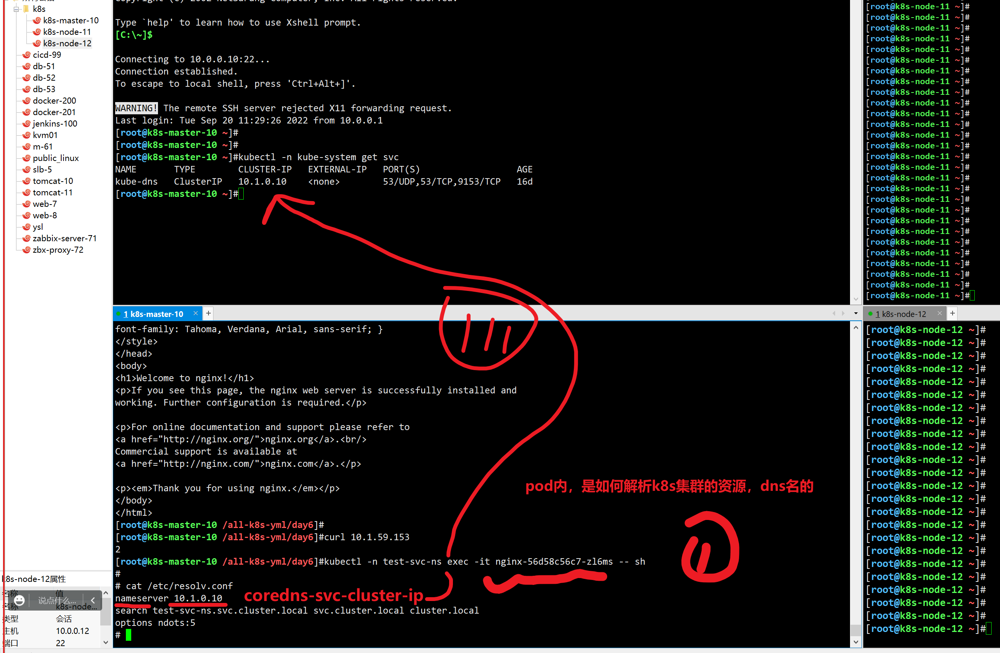
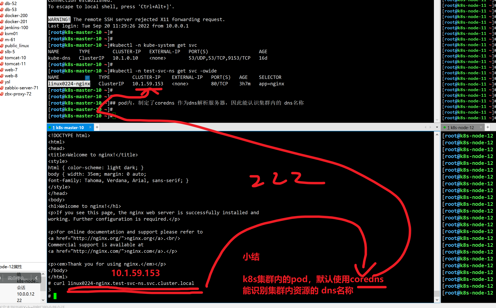

```### 此资源由 58学课资源站 收集整理 ###
	想要获取完整课件资料 请访问：58xueke.com
	百万资源 畅享学习

```


# 05-k8s网络

## 你为什么要学k8s


## 什么是，容器网络接口，容器运行时接口


## 了解pod，跨主机数据包通信图

```
同节点上的pod通信

跨节点的pod通信

```


pod数据包，走flannel封装为udp，走物理网卡出去

## 查看物理网卡，udp封装的icmp数据包


## 同节点下的pod通信，数据包查看

deploy部署2个pod

1111


```yaml
[root@k8s-master-10 /all-k8s-yml/day5]#cat last-deploy-nginx.yml 
apiVersion: apps/v1      # 注意这里与Pod的区别，Deployment是apps/v1而不是v1
kind: Deployment         # 资源类型为Deployment
metadata:
  name: test-net-busybox-deployment            # Deployment的名称
spec:
  replicas: 2            # Pod的数量，Deployment会确保一直有2个Pod运行         
  selector:              # Label Selector
    matchLabels:
      myenv: test
  template:              # Pod的定义，用于创建Pod，也称为Pod template
    metadata:
      labels:
        myenv: test
    spec:
      nodeSelector:
        env: test-network
      containers:
      - image: busybox
        name: last-busybox-containers
        imagePullPolicy: IfNotPresent
        command:  ["/bin/sh","-c","while true;do echo $(date) 呵呵 ;sleep 2;done"]
        
```


打标签

```
11部署2个pod

[root@k8s-master-10 /all-k8s-yml/day6]#kubectl get po -l myenv=test
NAME                                           READY   STATUS    RESTARTS   AGE
test-net-busybox-deployment-5574b8f778-6rrmr   1/1     Running   0          5s
test-net-busybox-deployment-5574b8f778-jbmqn   1/1     Running   0          5s
[root@k8s-master-10 /all-k8s-yml/day6]#
[root@k8s-master-10 /all-k8s-yml/day6]#kubectl logs -f test-net-busybox-deployment-5574b8f778-
Error from server (NotFound): pods "test-net-busybox-deployment-5574b8f778-" not found
[root@k8s-master-10 /all-k8s-yml/day6]#kubectl logs -f test-net-busybox-deployment-5574b8f778-6rrmr 
Tue Sep 20 03:27:46 UTC 2022 呵呵
Tue Sep 20 03:27:48 UTC 2022 呵呵
Tue Sep 20 03:27:50 UTC 2022 呵呵
Tue Sep 20 03:27:52 UTC 2022 呵呵
Tue Sep 20 03:27:54 UTC 2022 呵呵
Tue Sep 20 03:27:56 UTC 2022 呵呵
Tue Sep 20 03:27:58 UTC 2022 呵呵
Tue Sep 20 03:28:00 UTC 2022 呵呵
Tue Sep 20 03:28:02 UTC 2022 呵呵
Tue Sep 20 03:28:04 UTC 2022 呵呵
Tue Sep 20 03:28:06 UTC 2022 呵呵
Tue Sep 20 03:28:08 UTC 2022 呵呵


进入pod容器，查看网络通信关系


```


## 抓数据包看结果

```
参数
#  -nn    只显示数字，ip port 
# -s 0
# -v 显示完整信息 
# -i 抓取指定网卡

tcpdump -nn -i cni0 -s0   -v


2.node01宿主机cni0接口抓包
[root@k8s-node01 ~]# tcpdump -nni cni0 -s0   -v


3.node01宿主机flannel.1接口抓包
[root@k8s-node01 ~]# tcpdump -nni flannel.1 -s0 - -v


4.node01宿主机eth0（ens33）接口抓包
[root@k8s-node01 ~]# tcpdump -nni ens33 -s0  -v


[root@k8s-node-12 ~]# tcpdump -nni cni0 -s0   -v -w /tmp/net.log
tcpdump: listening on cni0, link-type EN10MB (Ethernet), capture size 262144 bytes
^C594 packets captured
629 packets received by filter
0 packets dropped by kernel


```


## 创建pod，查看网络情况

```
[root@k8s-master-10 /all-k8s-yml/prometheus]#ifconfig 
cni0: flags=4163<UP,BROADCAST,RUNNING,MULTICAST>  mtu 1450
        inet 10.2.0.1  netmask 255.255.255.0  broadcast 10.2.0.255
        inet6 fe80::84cc:cbff:fee6:84f0  prefixlen 64  scopeid 0x20<link>
        ether 86:cc:cb:e6:84:f0  txqueuelen 1000  (Ethernet)
        RX packets 1183997  bytes 90259985 (86.0 MiB)
        RX errors 0  dropped 0  overruns 0  frame 0
        TX packets 1356368  bytes 637041516 (607.5 MiB)
        TX errors 0  dropped 0 overruns 0  carrier 0  collisions 0

```


## 跨节点的pod通信

基于deployment创建，以及lable，再2个节点上创建2个pod即可


```
[root@k8s-master-10 /all-k8s-yml/day6]#
[root@k8s-master-10 /all-k8s-yml/day6]#cat test-net-busybox.yaml 
apiVersion: apps/v1      # 注意这里与Pod的区别，Deployment是apps/v1而不是v1
kind: Deployment         # 资源类型为Deployment
metadata:
  name: test-2-net-busybox-deployment            # Deployment的名称
  namespace: test-net
spec:
  replicas: 2            # Pod的数量，Deployment会确保一直有2个Pod运行         
  selector:              # Label Selector
    matchLabels:
      myenv: test
  template:              # Pod的定义，用于创建Pod，也称为Pod template
    metadata:
      labels:
        myenv: test
    spec:
      nodeSelector:
        env2: net
      containers:
      - image: busybox
        name: last-busybox-containers
        imagePullPolicy: IfNotPresent
        command:  ["/bin/sh","-c","while true;do echo $(date) 呵呵 ;sleep 2;done"]
[root@k8s-master-10 /all-k8s-yml/day6]#
[root@k8s-master-10 /all-k8s-yml/day6]#kubectl create ns test-net
namespace/test-net created
[root@k8s-master-10 /all-k8s-yml/day6]#
[root@k8s-master-10 /all-k8s-yml/day6]#kubectl create -f test-net-busybox.yaml 
deployment.apps/test-2-net-busybox-deployment created
[root@k8s-master-10 /all-k8s-yml/day6]#


[root@k8s-master-10 /all-k8s-yml/day6]#
[root@k8s-master-10 /all-k8s-yml/day6]#kubectl -n test-net edit deployments.apps test-2-net-busybox-deployment 
deployment.apps/test-2-net-busybox-deployment edited
[root@k8s-master-10 /all-k8s-yml/day6]#kubectl -n test-net get po -owide
NAME                                            READY   STATUS    RESTARTS   AGE     IP           NODE          NOMINATED NODE   READINESS GATES
test-2-net-busybox-deployment-5db9ff768-g4ln2   1/1     Running   0          2m31s   10.2.1.115   k8s-node-11   <none>           <none>
test-2-net-busybox-deployment-5db9ff768-gw6p2   1/1     Running   0          3s      10.2.2.129   k8s-node-12   <none>           <none>
test-2-net-busybox-deployment-5db9ff768-hkhkk   1/1     Running   0          2m31s   10.2.1.114   k8s-node-11   <none>           <none>
test-2-net-busybox-deployment-5db9ff768-mhv7g   1/1     Running   0          3s      10.2.2.131   k8s-node-12   <none>           <none>
test-2-net-busybox-deployment-5db9ff768-pp95w   1/1     Running   0          3s      10.2.1.116   k8s-node-11   <none>           <none>
test-2-net-busybox-deployment-5db9ff768-zrlxw   1/1     Running   0          3s      10.2.2.130   k8s-node-12   <none>           <none>
[root@k8s-master-10 /all-k8s-yml/day6]## 到这看懂111
[root@k8s-master-10 /all-k8s-yml/day6]#
[root@k8s-master-10 /all-k8s-yml/day6]#


# 注意，给副本数，加大点


```


## 同一个节点下的2个pod


## 图解同一个Node下的Pod通信


## 跨主机POD通信原理

### 跨节点准备好pod


### [跨节点pod通信原理图](http://www.yuchaoit.cn/)


12.10 继续，看pod代理。


# =========1.Service========


官网资料入口

https://kubernetes.io/zh-cn/docs/concepts/services-networking/service/#%E5%8A%A8%E6%9C%BA


问你k8s杂学的？看官网学呗。


## Service解决Pod访问问题


# svc作用和工作原理


## 创建3个后端Pod

```
# 基于deployment创建3个pod，加上标签。
apiVersion: apps/v1      
kind: Deployment         
metadata:
  name: nginx
  namespace: yuchaoit       
spec:
  replicas: 3                    
  selector:              
    matchLabels:
      app: nginx
  template:              
    metadata:
      labels:
        app: nginx
    spec:
      containers:
      - image: nginx:latest
        name: container-0
        resources:
          limits:
            cpu: 100m
            memory: 200Mi
          requests:
            cpu: 100m
            memory: 200Mi
```


```
# 基于deployment创建3个pod，加上标签。
apiVersion: apps/v1      
kind: Deployment         
metadata:
  name: nginx
  namespace: test-svc-ns       
spec:
  replicas: 3                    
  selector:              
    matchLabels:
      app: nginx
  template:              
    metadata:
      labels:
        app: nginx
    spec:
      containers:
      - image: nginx:latest
        name: container-0
        resources:
          limits:
            cpu: 100m
            memory: 200Mi
          requests:
            cpu: 100m
            memory: 200Mi
```

创建结果


### 创建查看pod

```
[root@k8s-master-10 /all-k8s-yml/day6]#kubectl create ns test-svc-ns
namespace/test-svc-ns created
[root@k8s-master-10 /all-k8s-yml/day6]#
[root@k8s-master-10 /all-k8s-yml/day6]#kubectl create -f test-svc-deploy-nginx.yml 
deployment.apps/nginx created


[root@k8s-master-10 /all-k8s-yml/day6]#kubectl -n test-svc-ns get po -owide
NAME                     READY   STATUS    RESTARTS   AGE   IP           NODE            NOMINATED NODE   READINESS GATES
nginx-56d58c56c7-2zp46   1/1     Running   0          17s   10.2.1.117   k8s-node-11     <none>           <none>
nginx-56d58c56c7-mr7p9   1/1     Running   0          17s   10.2.2.132   k8s-node-12     <none>           <none>
nginx-56d58c56c7-zl6ms   1/1     Running   0          17s   10.2.0.42    k8s-master-10   <none>           <none>
[root@k8s-master-10 /all-k8s-yml/day6]#
[root@k8s-master-10 /all-k8s-yml/day6]#


至此3个后端pod组，ok了。


```


## 创建ervice资源

### 三种Service类型IP


https://kubernetes.io/zh-cn/docs/concepts/services-networking/service/

```
[root@k8s-master-10 ~]#kubectl explain Service.spec.type


[root@k8s-master-10 /all-k8s-yml/day6]#kubectl explain svc.spec.type


ClusterIP


NodePort


```


### 创建ClusterIP

## svc代理后端原理逻辑图


```
# 集群内，开启一个固定死的ip，svc的ip地址，负载均衡代理一组pod

apiVersion: v1
kind: Service
metadata:
  name: linux0224-nginx        # Service的名称 ，svc  ip，dns
  namespace: test-svc-ns 
spec:
  selector:          # Label Selector，选择包含app=nginx标签的Pod
    app: nginx
  ports:
  - name: service0
    targetPort: 80   # Pod的端口
    port: 80         # Service对外暴露的端口，也就是ClusterIP的port
    protocol: TCP    # 转发协议类型，支持TCP和UDP
  type: ClusterIP    # Service的类型
  
  
  
```


### 准备一组后端

```
[root@k8s-master-10 /all-k8s-yml/day6]#
[root@k8s-master-10 /all-k8s-yml/day6]#
[root@k8s-master-10 /all-k8s-yml/day6]#curl 10.2.1.117
1
[root@k8s-master-10 /all-k8s-yml/day6]#curl 10.2.2.132
2
[root@k8s-master-10 /all-k8s-yml/day6]#curl 10.2.0.42
3
[root@k8s-master-10 /all-k8s-yml/day6]## k8s，基础不难，认真学，都能学会。看懂1111
[root@k8s-master-10 /all-k8s-yml/day6]#

```


### 查看svc

```
[root@k8s-master-10 /all-k8s-yml/day6]#kubectl -n test-svc-ns get svc
No resources found in test-svc-ns namespace.


# 创建svc


```


### 图解Service和pod关系


## 再加一个pod，查看endpoints后端pods组信息


```
如何玩
访问 10.1.59.153:80

在哪访问？ clusterIP类型


```


3点准时上课。

休息。


## =========服务发现原理=======

### 理解svc本质是四层代理，代理一组后端pod

思考，应用部署，前后端pod组，该如何通信

答案，前端pod应用，填入后端svc入口。


## k8s容器化web集群演进


## service服务发现的作用


## k8s集群，dns域名解析走向


## 如何制定coredns，去解析集群内的dns名称


## 查看k8s集群的pod是如何用这个dns系统





linux0224-nginx.test-svc-ns.svc.cluster.local


## coredns，和pod，和svc的查找关系




## 文字原理


```
1.k8s内置DNS插件CoreDNS，实现在k8s集群中以DNS服务提供名称解析
2.CoreDNS为每一个pod提供Service的名称解析服务
- 可以查看每一个pod的dns解析文件，查看nameserver，其实就是CoreDNS自己的ClusterIp
- 是因为安装了CoreDNS集群后，在kubelet配置文件里，默认添加了参数
[root@k8s-master-10 ~]#cat /var/lib/kubelet/config.yaml 
clusterDNS:
- 10.1.0.10
clusterDomain: cluster.local

因此每一个pod在被创建时，默认使用该DNS服务器。

在每一个pod中都可以基于如下规则，访问Service

servicename.default.svc.cluster.local
servicename.namespace
servicename
```


## 不同的ns下的资源，如何解析k8s集群的dns名称


## default下的pod，去访问其他ns下的svc资源

```
[root@k8s-master-10 ~]#kubectl run -it t-nginx --rm --image=nginx -- sh

# 
# curl linux0224-nginx.test-svc-ns.svc.cluster.local
3
# # 33333   
# 

```


### 使用ServiceName访问Service

k8s集群内默认提供了DNS解析插件coredns

在kube-system命名空间下可以查看到CoreDNS的Pod。

## web应用的，通信架构图，详解=====


## Service怎么找到后端pod？

试试修改deployment部署的pod副本数

```

```


### 再次查看svc信息

```

```


### Endpoints资源

Endpoints也是一种资源，k8s通过该资源监控pod的IP，实现让Service能发现Pod。

记录的就是Pod的IP了。

```

```


### 图解service和pod关系


## ==========NodePort类型的Service=================


NodePort类型的Service可以让Kubemetes集群每个节点上保留一个相同的端口， 外部访问连接首先访问节点IP:Port，然后将这些连接转发给服务对应的Pod。


### 图解NodePort


### yaml

创建新的svc资源类型，去访问4个pod后端


咱们讲的，比较细致，比较慢

下功夫，认真听，练习，就学会的了。。。


```yaml
apiVersion: v1
kind: Service
metadata:
  name: nodeport-service
  namespace: test-svc-ns
spec:
  type: NodePort
  ports:
  - port: 80      # service集群内代理的 ip:port
    targetPort: 80    # pod后端，暴露是什么端口，5000，80
    nodePort: 30005     #  给k8s集群的Node节点，暴露一个端口，去访问这个svc
    # # 默认情况下，为了方便起见，Kubernetes 控制平面会从某个范围内分配一个端口号（默认：30000-32767）
    name: service1  # 若不指定，svc里显示unset
  selector:           # 标签选择器
    app: nginx
```


### 创建nodePort类型SVC


```
[root@k8s-master-10 /all-k8s-yml/day6]#kubectl create -f nodeport-svc.yml 
service/nodeport-service created
[root@k8s-master-10 /all-k8s-yml/day6]#
[root@k8s-master-10 /all-k8s-yml/day6]#
[root@k8s-master-10 /all-k8s-yml/day6]#kubectl -n test-svc-ns get svc -owide
NAME               TYPE        CLUSTER-IP    EXTERNAL-IP   PORT(S)        AGE     SELECTOR
linux0224-nginx    ClusterIP   10.1.59.153   <none>        80/TCP         3h51m   app=nginx
nodeport-service   NodePort    10.1.61.17    <none>        80:30005/TCP   22s     app=nginx
[root@k8s-master-10 /all-k8s-yml/day6]#
[root@k8s-master-10 /all-k8s-yml/day6]## 集群内再访问svc，访问4个pod
[root@k8s-master-10 /all-k8s-yml/day6]#
[root@k8s-master-10 /all-k8s-yml/day6]#curl 10.1.61.17:80
1
[root@k8s-master-10 /all-k8s-yml/day6]#curl 10.1.61.17:80
1
[root@k8s-master-10 /all-k8s-yml/day6]#curl 10.1.61.17:80
3
[root@k8s-master-10 /all-k8s-yml/day6]#curl 10.1.61.17:80
3
[root@k8s-master-10 /all-k8s-yml/day6]#curl 10.1.61.17:80
3
[root@k8s-master-10 /all-k8s-yml/day6]#curl 10.1.61.17:80
3
[root@k8s-master-10 /all-k8s-yml/day6]#curl 10.1.61.17:80
3
[root@k8s-master-10 /all-k8s-yml/day6]## 1111
[root@k8s-master-10 /all-k8s-yml/day6]#

```


### 访问NodePort类型SVC

先修改pod的nginx页面，容易对比效果

```
[root@k8s-master-10 /all-k8s-yml/day6]#kubectl create -f nodeport-svc.yml 
service/nodeport-service created
[root@k8s-master-10 /all-k8s-yml/day6]#
[root@k8s-master-10 /all-k8s-yml/day6]#
[root@k8s-master-10 /all-k8s-yml/day6]#kubectl -n test-svc-ns get svc -owide
NAME               TYPE        CLUSTER-IP    EXTERNAL-IP   PORT(S)        AGE     SELECTOR
linux0224-nginx    ClusterIP   10.1.59.153   <none>        80/TCP         3h51m   app=nginx
nodeport-service   NodePort    10.1.61.17    <none>        80:30005/TCP   22s     app=nginx
[root@k8s-master-10 /all-k8s-yml/day6]#
[root@k8s-master-10 /all-k8s-yml/day6]## 集群内再访问svc，访问4个pod
[root@k8s-master-10 /all-k8s-yml/day6]#
[root@k8s-master-10 /all-k8s-yml/day6]#curl 10.1.61.17:80
1
[root@k8s-master-10 /all-k8s-yml/day6]#curl 10.1.61.17:80
1
[root@k8s-master-10 /all-k8s-yml/day6]#curl 10.1.61.17:80
3
[root@k8s-master-10 /all-k8s-yml/day6]#curl 10.1.61.17:80
3
[root@k8s-master-10 /all-k8s-yml/day6]#curl 10.1.61.17:80
3
[root@k8s-master-10 /all-k8s-yml/day6]#curl 10.1.61.17:80
3
[root@k8s-master-10 /all-k8s-yml/day6]#curl 10.1.61.17:80
3
[root@k8s-master-10 /all-k8s-yml/day6]## 1111
[root@k8s-master-10 /all-k8s-yml/day6]#

```


## 集群外部访问


# 2.Ingress资源

https://kubernetes.io/zh-cn/docs/concepts/services-networking/ingress/

Ingress 是对集群中服务的外部访问进行管理的 API 对象，典型的访问方式是 HTTP。

Ingress 可以提供负载均衡、SSL 终结和基于名称的虚拟托管。


## 为什么会出现Ingress


## 图解Ingress工作原理


## Ingress工作机制

```
实际操作原理就是，k8s提供了控制器，让你可以很省心的，只需要描述yaml，自动生成nginx规则。


1. 写yaml

2. 部署好ingress-nginx 


3. 创建yaml资源，ingress-nginx自动生成对应七层代理的nginx.conf


4.访问ingress


```


## 创建基于域名的Ingress，  jiayou.linux0224.com


### 1.创建Ingress-nginx控制器

```
nginx ，代理内网一套系统

先装nginx，实现负载均衡的软件，就nginx一款吗？？？lvs，haproxy。。。


ingress-nginx 控制器 ,还有没有k8s中，其他类型的 ingres控制器》有。。。以后进阶再去了解。。


```

```yaml
---
apiVersion: v1
kind: Namespace
metadata:
  name: nginx-ingress


---
apiVersion: v1
kind: ServiceAccount
metadata:
  name: nginx-ingress
  namespace: nginx-ingress


---
kind: ClusterRole
apiVersion: rbac.authorization.k8s.io/v1
metadata:
  name: nginx-ingress
rules:
- apiGroups:
  - ""
  resources:
  - services
  - endpoints
  verbs:
  - get
  - list
  - watch
- apiGroups:
  - ""
  resources:
  - secrets
  verbs:
  - get
  - list
  - watch
- apiGroups:
  - ""
  resources:
  - configmaps
  verbs:
  - get
  - list
  - watch
  - update
  - create
- apiGroups:
  - ""
  resources:
  - pods
  verbs:
  - list
  - watch
- apiGroups:
  - ""
  resources:
  - events
  verbs:
  - create
  - patch
  - list
- apiGroups:
  - extensions
  resources:
  - ingresses
  verbs:
  - list
  - watch
  - get
- apiGroups:
  - "extensions"
  resources:
  - ingresses/status
  verbs:
  - update
- apiGroups:
  - k8s.nginx.org
  resources:
  - virtualservers
  - virtualserverroutes
  - globalconfigurations
  - transportservers
  - policies
  verbs:
  - list
  - watch
  - get
- apiGroups:
  - k8s.nginx.org
  resources:
  - virtualservers/status
  - virtualserverroutes/status
  verbs:
  - update
---
kind: ClusterRoleBinding
apiVersion: rbac.authorization.k8s.io/v1
metadata:
  name: nginx-ingress
subjects:
- kind: ServiceAccount
  name: nginx-ingress
  namespace: nginx-ingress
roleRef:
  kind: ClusterRole
  name: nginx-ingress
  apiGroup: rbac.authorization.k8s.io


---
apiVersion: v1
kind: Secret
metadata:
  name: default-server-secret
  namespace: nginx-ingress
type: Opaque
data:
  tls.crt: LS0tLS1CRUdJTiBDRVJUSUZJQ0FURS0tLS0tCk1JSUN2akNDQWFZQ0NRREFPRjl0THNhWFhEQU5CZ2txaGtpRzl3MEJBUXNGQURBaE1SOHdIUVlEVlFRRERCWk8KUjBsT1dFbHVaM0psYzNORGIyNTBjbTlzYkdWeU1CNFhEVEU0TURreE1qRTRNRE16TlZvWERUSXpNRGt4TVRFNApNRE16TlZvd0lURWZNQjBHQTFVRUF3d1dUa2RKVGxoSmJtZHlaWE56UTI5dWRISnZiR3hsY2pDQ0FTSXdEUVlKCktvWklodmNOQVFFQkJRQURnZ0VQQURDQ0FRb0NnZ0VCQUwvN2hIUEtFWGRMdjNyaUM3QlBrMTNpWkt5eTlyQ08KR2xZUXYyK2EzUDF0azIrS3YwVGF5aGRCbDRrcnNUcTZzZm8vWUk1Y2Vhbkw4WGM3U1pyQkVRYm9EN2REbWs1Qgo4eDZLS2xHWU5IWlg0Rm5UZ0VPaStlM2ptTFFxRlBSY1kzVnNPazFFeUZBL0JnWlJVbkNHZUtGeERSN0tQdGhyCmtqSXVuektURXUyaDU4Tlp0S21ScUJHdDEwcTNRYzhZT3ExM2FnbmovUWRjc0ZYYTJnMjB1K1lYZDdoZ3krZksKWk4vVUkxQUQ0YzZyM1lma1ZWUmVHd1lxQVp1WXN2V0RKbW1GNWRwdEMzN011cDBPRUxVTExSakZJOTZXNXIwSAo1TmdPc25NWFJNV1hYVlpiNWRxT3R0SmRtS3FhZ25TZ1JQQVpQN2MwQjFQU2FqYzZjNGZRVXpNQ0F3RUFBVEFOCkJna3Foa2lHOXcwQkFRc0ZBQU9DQVFFQWpLb2tRdGRPcEsrTzhibWVPc3lySmdJSXJycVFVY2ZOUitjb0hZVUoKdGhrYnhITFMzR3VBTWI5dm15VExPY2xxeC9aYzJPblEwMEJCLzlTb0swcitFZ1U2UlVrRWtWcitTTFA3NTdUWgozZWI4dmdPdEduMS9ienM3bzNBaS9kclkrcUI5Q2k1S3lPc3FHTG1US2xFaUtOYkcyR1ZyTWxjS0ZYQU80YTY3Cklnc1hzYktNbTQwV1U3cG9mcGltU1ZmaXFSdkV5YmN3N0NYODF6cFErUyt1eHRYK2VBZ3V0NHh3VlI5d2IyVXYKelhuZk9HbWhWNThDd1dIQnNKa0kxNXhaa2VUWXdSN0diaEFMSkZUUkk3dkhvQXprTWIzbjAxQjQyWjNrN3RXNQpJUDFmTlpIOFUvOWxiUHNoT21FRFZkdjF5ZytVRVJxbStGSis2R0oxeFJGcGZnPT0KLS0tLS1FTkQgQ0VSVElGSUNBVEUtLS0tLQo=
  tls.key: LS0tLS1CRUdJTiBSU0EgUFJJVkFURSBLRVktLS0tLQpNSUlFcEFJQkFBS0NBUUVBdi91RWM4b1JkMHUvZXVJTHNFK1RYZUprckxMMnNJNGFWaEMvYjVyYy9XMlRiNHEvClJOcktGMEdYaVN1eE9ycXgrajlnamx4NXFjdnhkenRKbXNFUkJ1Z1B0ME9hVGtIekhvb3FVWmcwZGxmZ1dkT0EKUTZMNTdlT1l0Q29VOUZ4amRXdzZUVVRJVUQ4R0JsRlNjSVo0b1hFTkhzbysyR3VTTWk2Zk1wTVM3YUhudzFtMApxWkdvRWEzWFNyZEJ6eGc2clhkcUNlUDlCMXl3VmRyYURiUzc1aGQzdUdETDU4cGszOVFqVUFQaHpxdmRoK1JWClZGNGJCaW9CbTVpeTlZTW1hWVhsMm0wTGZzeTZuUTRRdFFzdEdNVWozcGJtdlFmazJBNnljeGRFeFpkZFZsdmwKMm82MjBsMllxcHFDZEtCRThCay90elFIVTlKcU56cHpoOUJUTXdJREFRQUJBb0lCQVFDZklHbXowOHhRVmorNwpLZnZJUXQwQ0YzR2MxNld6eDhVNml4MHg4Mm15d1kxUUNlL3BzWE9LZlRxT1h1SENyUlp5TnUvZ2IvUUQ4bUFOCmxOMjRZTWl0TWRJODg5TEZoTkp3QU5OODJDeTczckM5bzVvUDlkazAvYzRIbjAzSkVYNzZ5QjgzQm9rR1FvYksKMjhMNk0rdHUzUmFqNjd6Vmc2d2szaEhrU0pXSzBwV1YrSjdrUkRWYmhDYUZhNk5nMUZNRWxhTlozVDhhUUtyQgpDUDNDeEFTdjYxWTk5TEI4KzNXWVFIK3NYaTVGM01pYVNBZ1BkQUk3WEh1dXFET1lvMU5PL0JoSGt1aVg2QnRtCnorNTZud2pZMy8yUytSRmNBc3JMTnIwMDJZZi9oY0IraVlDNzVWYmcydVd6WTY3TWdOTGQ5VW9RU3BDRkYrVm4KM0cyUnhybnhBb0dCQU40U3M0ZVlPU2huMVpQQjdhTUZsY0k2RHR2S2ErTGZTTXFyY2pOZjJlSEpZNnhubmxKdgpGenpGL2RiVWVTbWxSekR0WkdlcXZXaHFISy9iTjIyeWJhOU1WMDlRQ0JFTk5jNmtWajJTVHpUWkJVbEx4QzYrCk93Z0wyZHhKendWelU0VC84ajdHalRUN05BZVpFS2FvRHFyRG5BYWkyaW5oZU1JVWZHRXFGKzJyQW9HQkFOMVAKK0tZL0lsS3RWRzRKSklQNzBjUis3RmpyeXJpY05iWCtQVzUvOXFHaWxnY2grZ3l4b25BWlBpd2NpeDN3QVpGdwpaZC96ZFB2aTBkWEppc1BSZjRMazg5b2pCUmpiRmRmc2l5UmJYbyt3TFU4NUhRU2NGMnN5aUFPaTVBRHdVU0FkCm45YWFweUNweEFkREtERHdObit3ZFhtaTZ0OHRpSFRkK3RoVDhkaVpBb0dCQUt6Wis1bG9OOTBtYlF4VVh5YUwKMjFSUm9tMGJjcndsTmVCaWNFSmlzaEhYa2xpSVVxZ3hSZklNM2hhUVRUcklKZENFaHFsV01aV0xPb2I2NTNyZgo3aFlMSXM1ZUtka3o0aFRVdnpldm9TMHVXcm9CV2xOVHlGanIrSWhKZnZUc0hpOGdsU3FkbXgySkJhZUFVWUNXCndNdlQ4NmNLclNyNkQrZG8wS05FZzFsL0FvR0FlMkFVdHVFbFNqLzBmRzgrV3hHc1RFV1JqclRNUzRSUjhRWXQKeXdjdFA4aDZxTGxKUTRCWGxQU05rMXZLTmtOUkxIb2pZT2pCQTViYjhibXNVU1BlV09NNENoaFJ4QnlHbmR2eAphYkJDRkFwY0IvbEg4d1R0alVZYlN5T294ZGt5OEp0ek90ajJhS0FiZHd6NlArWDZDODhjZmxYVFo5MWpYL3RMCjF3TmRKS2tDZ1lCbyt0UzB5TzJ2SWFmK2UwSkN5TGhzVDQ5cTN3Zis2QWVqWGx2WDJ1VnRYejN5QTZnbXo5aCsKcDNlK2JMRUxwb3B0WFhNdUFRR0xhUkcrYlNNcjR5dERYbE5ZSndUeThXczNKY3dlSTdqZVp2b0ZpbmNvVlVIMwphdmxoTUVCRGYxSjltSDB5cDBwWUNaS2ROdHNvZEZtQktzVEtQMjJhTmtsVVhCS3gyZzR6cFE9PQotLS0tLUVORCBSU0EgUFJJVkFURSBLRVktLS0tLQo=


---
kind: ConfigMap
apiVersion: v1
metadata:
  name: nginx-config
  namespace: nginx-ingress
data:


---
apiVersion: apps/v1
kind: Deployment
metadata:
  name: nginx-ingress
  namespace: nginx-ingress
spec:
  replicas: 1
  selector:
    matchLabels:
      app: nginx-ingress
  template:
    metadata:
      labels:
        app: nginx-ingress
    spec:
      nodeSelector:
        role: ingress-nginx-controller
      serviceAccountName: nginx-ingress
      containers:
      - image: nginx/nginx-ingress:1.7.2
        imagePullPolicy: IfNotPresent
        name: nginx-ingress
        ports:
        - name: http
          containerPort: 80
          hostPort: 80
        - name: https
          containerPort: 443
          hostPort: 443
        securityContext:
          allowPrivilegeEscalation: true
          runAsUser: 101 #nginx
          capabilities:
            drop:
            - ALL
            add:
            - NET_BIND_SERVICE
        env:
        - name: POD_NAMESPACE
          valueFrom:
            fieldRef:
              fieldPath: metadata.namespace
        - name: POD_NAME
          valueFrom:
            fieldRef:
              fieldPath: metadata.name
        args:
          - -nginx-configmaps=$(POD_NAMESPACE)/nginx-config
          - -default-server-tls-secret=$(POD_NAMESPACE)/default-server-secret


```

### 创建，ingress-nginx控制器资源

```
[root@k8s-master-10 /all-k8s-yml/day6/ingree-nginx]#kubectl create -f ingress-nginx.yml 


查看ingress控制器创建结果
[root@k8s-master-10 /all-k8s-yml/day6/ingree-nginx]#kubectl -n nginx-ingress get po -owide --show-labels 
NAME                             READY   STATUS    RESTARTS   AGE   IP          NODE            NOMINATED NODE   READINESS GATES   LABELS
nginx-ingress-75c88594dc-42pvw   1/1     Running   0          83s   10.2.0.49   k8s-master-10   <none>           <none>            app=nginx-ingress,pod-template-hash=75c88594dc
[root@k8s-master-10 /all-k8s-yml/day6/ingree-nginx]#


这里面就跑了nginx

进入控制器看看
证实，该控制器，基于deployment运行了一个nginx程序

下一步写 ingress.yml，自动生成nginx的配置文件而已，实现集群外部流量，转发给内部svc、给内部的pod

看懂111111111111
```


### 设置master也参与pod调度


### 验证ingress-nginx控制器正常


### 创建ingress规则

```yaml
apiVersion: networking.k8s.io/v1
kind: Ingress
metadata:
  name: test-ingress
  namespace: test-svc-ns
  
spec:
  rules:                                 # 转发规则,如下字段的，值，都会生成nginx.conf
  - host: "aoligei.linux0224.com"        # 填入你们的业务域名  > server_name xxxxxxx;
    http:                                # 基于http协议解析，七层代理规则
      paths:                            # 基于url路径匹配 ，location 
      - pathType: Prefix                 #要设置路径类型，否则不合法，
        path: "/"                     # 以 / 分割的URL路径前缀匹配，区分大小写，这里表默认所有路径。  location  / { xxx}
        backend:                      # 后端Service信息的组合  proxy_pass
          service:                     # ingress > svc【  】 > pod 
            name: linux0224-nginx    # 代理到名字是service1的ClusterIP
            port:                    # 代理到的Service的端口号。
              number: 80
```

查看业务对应的svc，是你运维自己创建的

```

```


### 创建ingress后端的service、pod


### 检验ingress状态


## 查看ingress资源创建后，控制器，到底干啥了。


### 访问七层负载均衡的k8s集群


### ingress七层代理原理（面试背）

[在生产下](http://www.yuchaoit.cn/)，ingress的七层域名，就直接绑定到SLB的地址即可。

```
1. ingress controller 通过和 api-server交互，动态感知集群中ingress规则的变化

2. ingress controller 读取ingress规则，也就是你们的业务域名，对应哪个Service、自动生成nginx配置，再写入到ingress控制器所处的pod，里面的nginx.conf

3. 自动reload nginx，实现域名，配置动态更新。

grep -E '[a-z]' /etc/nginx/conf.d/yuchaoit-test-ingress.conf
```


# 解释ingress的访问流程图

如何用ingress去再集群外部，发布，访问你的pod应用。

```
1. 先有后端pod应用组

[root@k8s-master-10 ~]#kubectl -n test-svc-ns get po -owide
NAME                     READY   STATUS    RESTARTS   AGE   IP           NODE            NOMINATED NODE   READINESS GATES
nginx-56d58c56c7-2zp46   1/1     Running   0          24h   10.2.1.117   k8s-node-11     <none>           <none>
nginx-56d58c56c7-jzcz6   1/1     Running   0          23h   10.2.0.43    k8s-master-10   <none>           <none>
nginx-56d58c56c7-mr7p9   1/1     Running   0          24h   10.2.2.132   k8s-node-12     <none>           <none>
nginx-56d58c56c7-zl6ms   1/1     Running   0          24h   10.2.0.42    k8s-master-10   <none>           <none>
[root@k8s-master-10 ~]#
[root@k8s-master-10 ~]#


2. 可以直接用svc去代理你的pod组
[root@k8s-master-10 ~]#kubectl -n test-svc-ns get svc -owide
NAME               TYPE        CLUSTER-IP    EXTERNAL-IP   PORT(S)        AGE   SELECTOR
linux0224-nginx    ClusterIP   10.1.59.153   <none>        80/TCP         24h   app=nginx


更多再，生产下，由于ingress是第三方组件，还需要额外安装软件。ingree-nginx
如果pod量不大，可以不用ingree-nginx
直接用进群内的pod+集群内svc   +   宿主机nginx  的组合即可。！！！


3.部署你的ingree-nginx控制器（nginx运行再一个pod里）
查看你创建的ingree

[root@k8s-master-10 ~]#kubectl -n nginx-ingress get po -owide
NAME                             READY   STATUS    RESTARTS   AGE   IP           NODE          NOMINATED NODE   READINESS GATES
nginx-ingress-75c88594dc-h9d49   1/1     Running   0          19h   10.2.2.134   k8s-node-12   <none>           <none>


4.查看ingree-nginx-pod的 *（nginx、容器里）发布网络类型。！！！


```


# 以及如何用svc、或ingress发布应用


浏览器 > ingree-nginx  集群外流量

↓

集群内 svc  >pod


