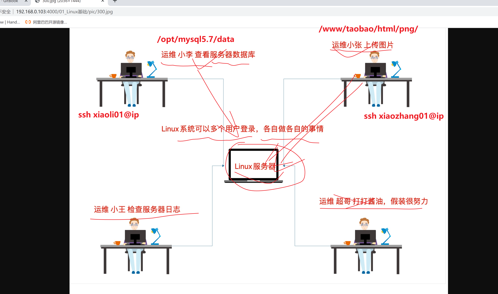
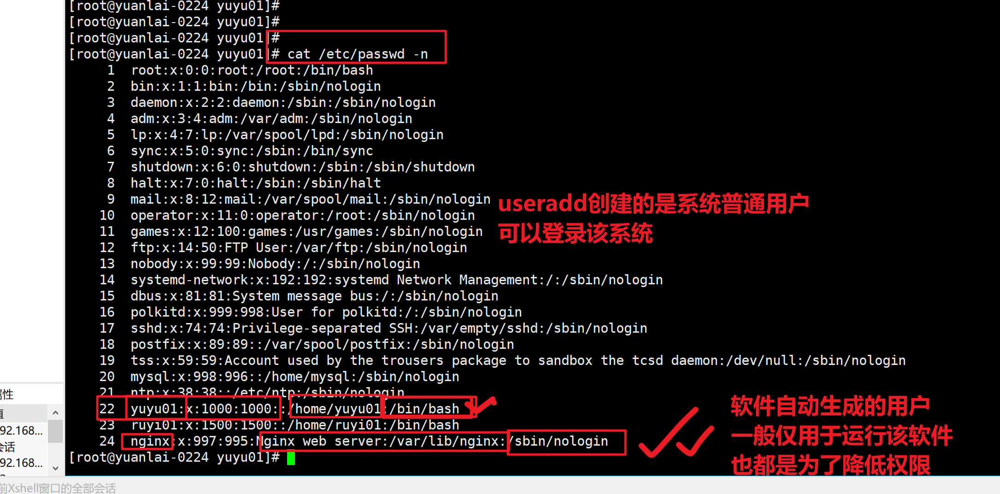
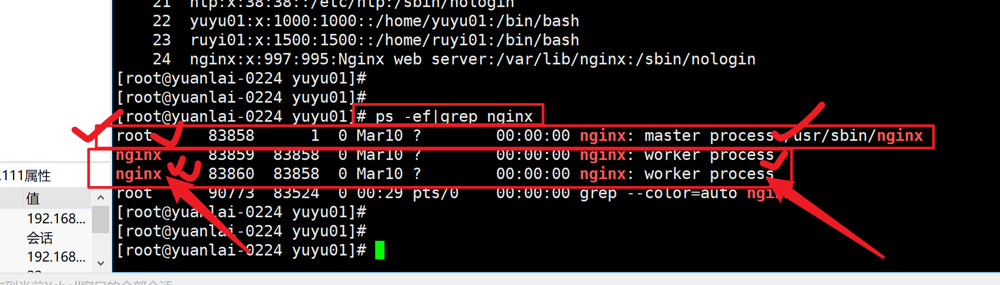
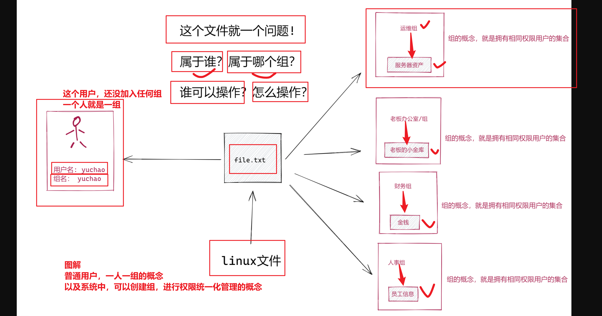
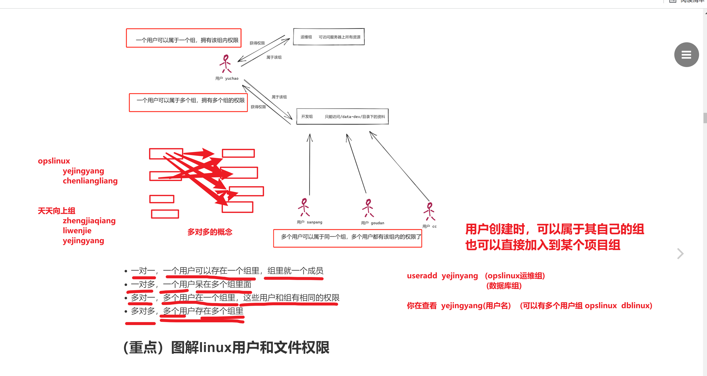
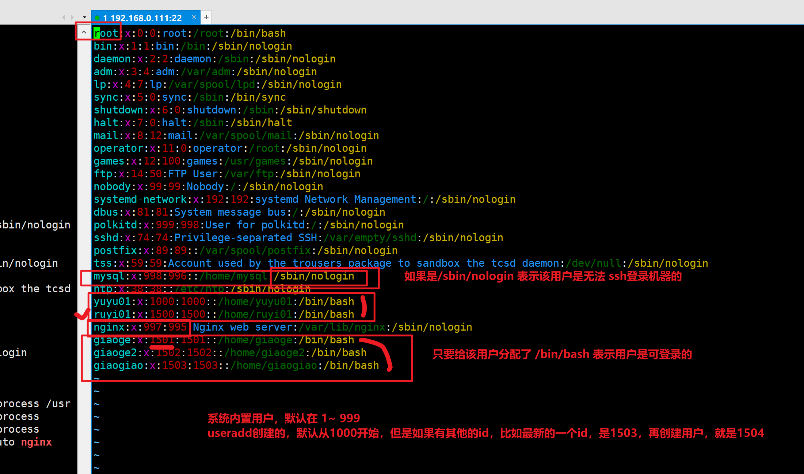
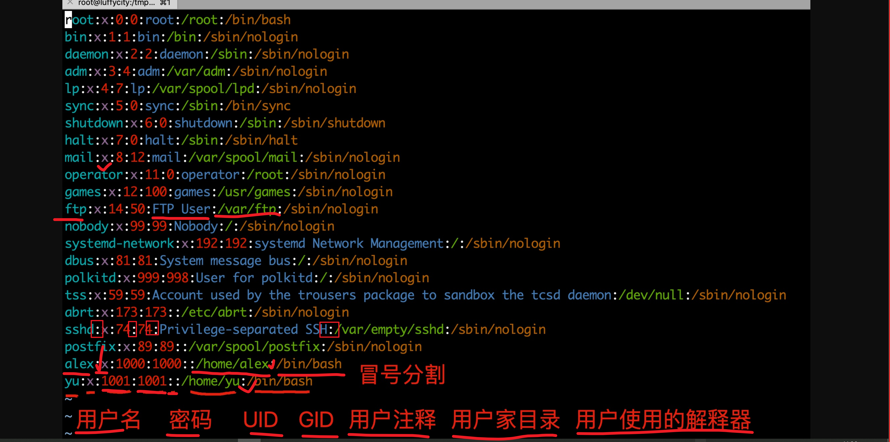
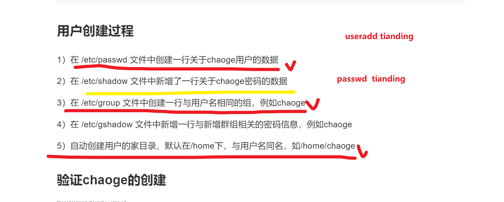

```### 此资源由 58学课资源站 收集整理 ###
	想要获取完整课件资料 请访问：58xueke.com
	百万资源 畅享学习

```
# 今日笔记



不同的用户，在不同的目录下，操作不同的文件

权限都是不一样。

- 用户登录的机器

- 该文件，和这个用户的关系是什么。

在单位里运维作为服务器的管理员，root权限是有的

而开发，测试，他们是不可能有root权限的

即使需要使用root权限，运维会给他配置（临时使用管理员身份运行）----sudo

root对普通账号的管理

- 修改他的密码
- 禁止他登录
- 禁止他一个月登录


## 用户分类

- 系统通过useradd创建的普通用户
- 安装软件时，自动生成的用户



- 还有系统默认的一些用户

如何判断他们，根据用户的id号，UID来决定。


关于普通用户去运行软件，也是为了降低系统的风险性，如nginx这个假用户，运行了软件的工作进程



## 关于root

- root为什么是root呢？为什么权限最大呢，因为他的UID是0，系统根据用户的id号，决定它的作用
- linux中的每一个用户，都有一个自己的组。

>0224班，root---超哥
>
>普通用户---叶金阳---一个人就成一个组，叶金阳组
>
>
>
>组的概念

- 超哥这个讲师机(root创建的一个文本文件)，只能让披荆斩棘组（读，写，执行）

- 其他人，无任何权限

组，组内成员，权限统一化的概念。

>披荆斩棘组 
>
>​		张少辉
>
>​		叶金阳
>
>天天向上组
>
>​	   李文杰
>
>​		 郑佳强
>
>Tiger组
>
>​	 王仁刚
>
>​	 王秉诚
>
>
>
>





- 用户概念

- 用户组的概念

- 一个系统文件，应该属于单个用户，也可以属于某个组


# linux的用户，用户组

```
于超老师所在的运维团队有3个人，分别是
于超、狗蛋、三胖

于超负责代码部署、系统中的名字叫 yuchao
狗蛋负责数据库部署，系统中的名字叫 goudan
三胖负责监控，系统中的名字叫 sanpang

公司的网站在服务器上运行着，运维团队要检查网站的状况，此时他们是分工很明确的，三人同时登录了服务器
1、yuchao的权限只能操作网站代码、日志等
	ssh yuchao01@服务器ip    
		/www/apecome/conf
		/www/apecome/html/png
			/www/apecome/html/*.html
			/www/apecome/html/js/
		/www/apecome/sbin/
			这里面必然存放了软件的可执行命令，启动命令
		/www/apecome/log/
			网站的各种日志，统一放这管理
		
2、goudan的权限只能操作数据库，登录、查看日志
	ssh goudan01@ip
		/database_mysql/
3、sanpang的权限只能查看监控程序的状态、日志
	ssh sanpang01@ip
		/zabbix01/

并且他们不能越权访问其他人的文件资料，提示权限不够
```

# linux的用户组

### linux的用户组

- 为了方便管理属于同一组的用户，Linux 系统中还引入了用户组的概念。
  - 通过使用用 户组号码(GID，Group IDentification)，我们可以把多个用户加入到同一个组中，从而方 便为组中的用户统一规划权限或指定任务。
- 对于linux而言，比如公司的开发部门，需要访问服务器上一个文件夹的资料，并且允许读取、允许修改写入，开发部门有30个人，你要给每一个人都添加读写权限吗？
- 那必然是给开发部门设置的权限就是，允许读写该文件夹，然后属于该部门的人员，就自然有了组内的权限，后续开发部门招新人，只要加入组内，权限也有了。
- Linux管理员在创建用户时，将自动创建一个与其同名的用户组，这个用户组只有该用户一个人，
  - `useradd yuchao01`





# root的权利

- Linux系统的特性就是可以满足多个用户，同时工作，因此Linux系统必须具备很好的安全性。
- 在安装RHEL7时设置的root管理员密码，这个root管理员就是所有UNIX系统中的超级用户，它拥有最高的系统所有权，能够管理系统的各项功能，如添加/删除用户，启动/关闭进程，开启/禁用硬件设备等等。
- 因此“能力越大，责任越大”，root权限必须很好的掌握，否则一个错误的命令可能会摧毁整个系统。

## root为什么权利这么大？

root只是个名字而已，权利很大的原因，在于他的UID是0。

```
[root@yuanlai-0224 opt]# id
uid=0(root) gid=0(root) groups=0(root)
```

- UID，user Identify，好比身份证号
- GID，group Identify，好比户口本的家庭编号
- 在Linux系统中，用户也有自己的UID身份账号且唯一
- 在Linux中UID为0，就是超级用户，如要设置管理员用户，可以改UID为0（不推荐该操作）
  - 建议普通用户用sudo提权。
- 系统用户UID为1~999 Linux安装的服务程序都会`创建独有的用户`负责运行。
- 普通用户UID从1000开始：由管理员创建（centos7），最大值1000~60000范围
- centos6创建普通用户是500开始




---

解释/etc/passwd





和用户创建相关的配置文件

useradd命令

```
/etc/passwd 用户信息
/etc/shadow  用户密码信息
/etc/group 用户组信息
/etc/gshadow 用户组密码信息  ，在大公司，用户和组数量很大的情况下，需要制定复杂的权限管理，那时会用到组密码

当你执行useradd的时候，系统自动创建 /home/chengzhiwei01 这个家目录下会一些用户默认模板文件
是从下面这个文件夹，拷贝过去的


/etc/skel
skel是skeleton的缩写，意为骨骼、框架。故此目录的作用是在建立新用户时，用于初始化用户根目录。系统会将此目录下的所有文件、目录都复制到新建用户的根目录，并且将用户属主与用户组调整为与此根目录相同。
```

##关于用户创建，涉及的配置文件




