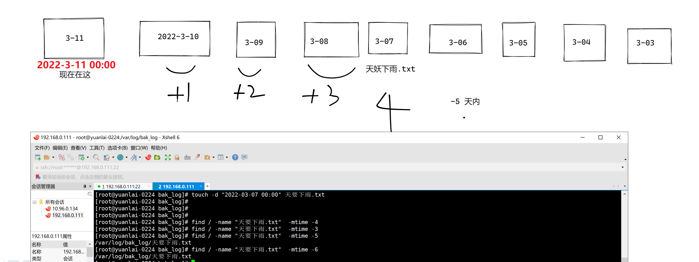

```### 此资源由 58学课资源站 收集整理 ###
	想要获取完整课件资料 请访问：58xueke.com
	百万资源 畅享学习

```
# 昨日作业解析

# 关于html中找到相对路径的资源

```
[root@yuanlai-0224 html]# 
[root@yuanlai-0224 html]# ls
404.html  50x.html  en-US  icons  img  index.html  mylogo  poweredby.png
[root@yuanlai-0224 html]# vim index.html 
[root@yuanlai-0224 html]# vim index.html 
[root@yuanlai-0224 html]# cat index.html 
<meta charset=utf8>
今天是阴天，心情一般般


```

# 图解find -mtime时间查找




