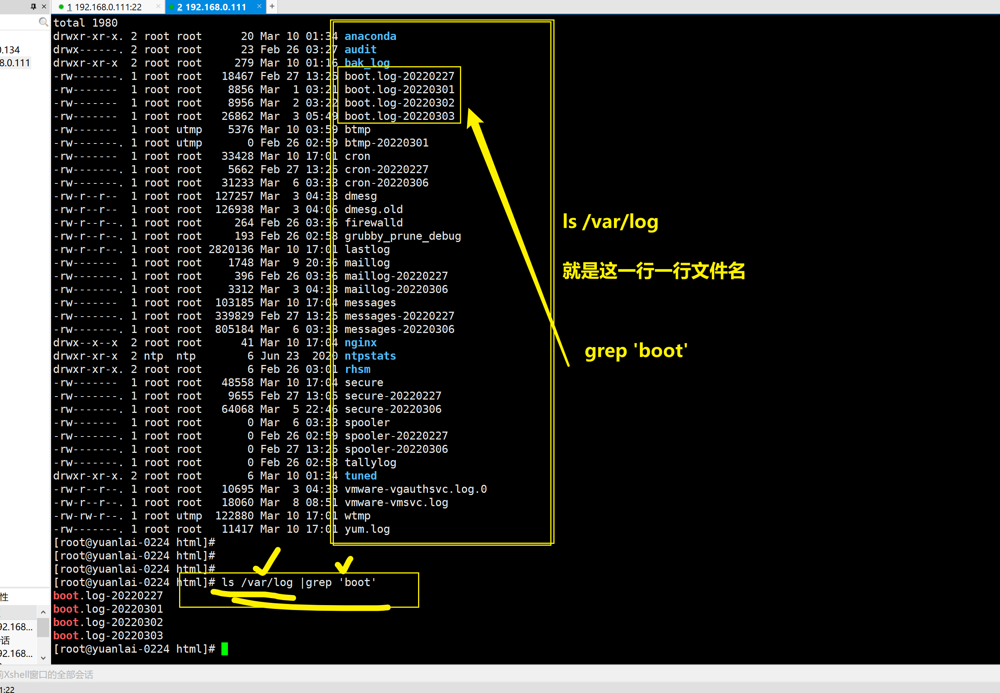

```### 此资源由 58学课资源站 收集整理 ###
	想要获取完整课件资料 请访问：58xueke.com
	百万资源 畅享学习

```
## 题⽬

1.关于笔记md⽂件和图⽚资源如何存放，你的理解，如果md⽂档中，图⽚失效原因可能是？

对绝对路径，相对路径的理解

```
md文件

图片资源文件

比如部署网页，html里面肯定要找图片等静态资源


```


2.显示出/opt/下内容，再写⼊到/tmp/about_opt.txt （一条命令，完成这个操作）

```
命令是？

[root@yuanlai-0224 html]# ls /opt  > /tmp/about_opt.txt
[root@yuanlai-0224 html]# 
[root@yuanlai-0224 html]# cat /tmp/about_opt.txt 
yuchao到此一游
三里屯美女微信.txt.bak
小哥哥电话.txt


```


~~~
find /opt/         #下图只是一部分


~~~


~~~
cat /tmp/about_opt.txt     #下图只是一部分
~~~


3.计算机常⽤⽂件⼤⼩单位换算是？

~~~
是KB  MB  GB  TB
1KB = 1024Bytes (字节)
1MB = 1024KB 
1GB = 1024MB
1TB = 1024GB

文件大小

磁盘容量

~~~


4.如下字符串分别是⼏个字节？（默认是UTF-8编码表）

- 英文占一个字节，英文输入法下的特殊符号，也是1个字节
- 中文占3个字节，中文输入法下的特殊符号，也是3个字节

```
你！好     # 几个字节   3*3+1 =10  

你!好      # 几个字节   3*2+1+1  =8


文杰的写法是
1.将文本，写入文件，再用wc去处理文件
2. echo 字符串  |  wc -c   # 利用管道符的数据传递功能，进行结果的二次加工


```


男⼉当⾃强


我命由我不由天!


hello!linux


5.找出系统上所有的txt、log、png⽂件。（⼀条命令）

-o 或者

~~~
find / -type f  -name '*.txt' -o -name '*.log' -o -name '*.png'
~~~


6.找出系统上所有的txt、log、png⽂件，且显示其⽂件详细信息。（⼀条命令完成）

~~~

find -type f  -name '*.txt' -o -name '*.log' -o -name '*.png' |xargs -i ls -l {}

~~~


7.找出系统中超过1M的txt，并且显示其⽂件具体容量信息。（⼀条命令完成）


8.请找出/var/log⽬录下哪些⽂件中含passwd信息。（提示，查⼀下-R参数）

```\
从文件中，找出passwd关键字的信息


grep -R 是递归查找的意思 

文件内容是，一行一行的，

grep 'passwd'  filename  # 去filename文件内容里，一行，一行的匹配，打印出存在'passwd'那一整行信息。

```


9.如何判断系统中是否存在root⽤户？（⾄少写2种办法）


10.如何分析⽇志`/var/log/messages`中包含了password信息的是哪些⾏？


11.如何找出/var/log⽬录下，哪些⽂件中有password这样的字符信息？

~~~
用法1
[root@linux0224 /]# find /var/log -type f | xargs -i grep 'password'  {}

用法2
[root@yuanlai-0224 html]# grep -R 'password' /var/log


如果只想拿到文件名，加上-l参数即可

[root@yuanlai-0224 html]# grep -R -l  'password' /var/log
/var/log/audit/audit.log
/var/log/secure-20220227
/var/log/secure-20220306
/var/log/secure
/var/log/bak_log/audit.txt
/var/log/bak_log/journal.txt


~~~


12.如何忽略⼤⼩写找出nginx配置⽂件中监听的端⼝号？（提示、listen字段）


13.请找出/var/log下文件名包含了boot的⽂件有哪些？（要求⽤管道符）

```
find /var/log -type f -name '*boot*'


ls /var/log |grep 'boot'

```




14.如何找出/etc/passwd中关于字符/bin/bash的⾏有哪些？（要求⽤管道符）

```
让你从/etc/passwd文件中，过滤出 字符串 '/bin/bash'

[root@yuanlai-0224 html]# cat /etc/passwd | grep -n '/bin/bash'
1:root:x:0:0:root:/root:/bin/bash
22:yuyu01:x:1000:1000::/home/yuyu01:/bin/bash
23:ruyi01:x:1500:1500::/home/ruyi01:/bin/bash
[root@yuanlai-0224 html]# 


```


15.如何找出机器上的ssh进程？（要求⽤管道符）


16.如何查看机器上关于ssh的端⼝号？

```
netstat -tunlp | grep ssh
```


17.如何统计出系统中有多少个png⽂件？

~~~
[root@yuanlai-0224 html]#  find / -type f -name '*.png'  | wc -l
2088


~~~


18.请统计出/etc/passwd⽂件中有多少⾏是包括/bin/bash字符的。

~~~
理解了两命令，不知道哪个对

grep '/bin/bash'  /etc/passwd  | wc -l 


~~~


19.请备份/var/log下所有的.log⽂件，备份到/var/log/bak_log/⽬录下。


20.请将/var/log/bak_log/下所有的log⽂件，后缀改为txt。

```
ls /var/log/bak_log | xargs -i rename log txt {}   # 这个没毛病


方法2，简写
rename log txt ./*.log
```


21.解释下什么是⽂件创建时间，访问时间，修改时间（代码演示）

~~~
文件创建时间：首次touch 创建文件，系统默认给的时间（以机器当前时间为准）
             首次mkdir创建的文件夹，系统默认给他的时间（以机器当前时间为准）
             
             
访问时间：这个文件，文件夹，什么时候被人读取过只是被别人看过了，没发生实质性的变化

修改时间：文件内容，文件属性，发生了实质性的变化
~~~


22.解释下如下时间属性。

~~~
access time 访问时间，如cat读取文件
change time  如文件的权限，文件名，文件大小变化
modify time  文件内容变化
~~~


23.创建⽂件，且修改⽂件的时间属性，根据如下要求来。

~~~
[root@yuanlai-0224 tmp]# touch /tmp/yuchao_linux.txt
[root@yuanlai-0224 tmp]#
[root@yuanlai-0224 tmp]#


1.修改/tmp/yuchao_linux.txt 访问时间 为2018-08-08 13:00 

touch -d "2018-08-08 13:00" -a /tmp/yuchao_linux.txt

2.修改/tmp/yuchao_linux.txt 数据修改时间 为2020-07:00

touch -d "2020-07-07 07:00" -m /tmp/yuchao_linux.txt


~~~


24.找到/var/log⾥，3天前的所有log⽂件，且删除（⼀条命令，需要有确认提示的删除指令。）

转义符

在linux中，很多特殊符号，有特殊意义，比如 

```
* 
?
[]
{}

如何让这些符号，成为普通的一个字符呢？利用反斜杠的作用，还原其本意，系统是不会读取这个反斜线的。
\*
\?

\[\]


```


```
find  /var/log -type f -name '*.log'  -mtime +3  -ok rm  {}  \;
```


25.找到/etc/下，最近2天的被修改(内容变化了，-mtime)的所有⽂件，且显示详细信息（⼀条命令。）

两天前 -mtime +2

正好那第二天 -mtime 2

两天内 -mtime -2


26.找出机器上，⼤于100k且⼩于2M的所有⽂件。（⼀条命令。）

-a 并且的意思

~~~
[root@linux0224 /]# find / -type f -size +100k -a -size -2M
~~~


