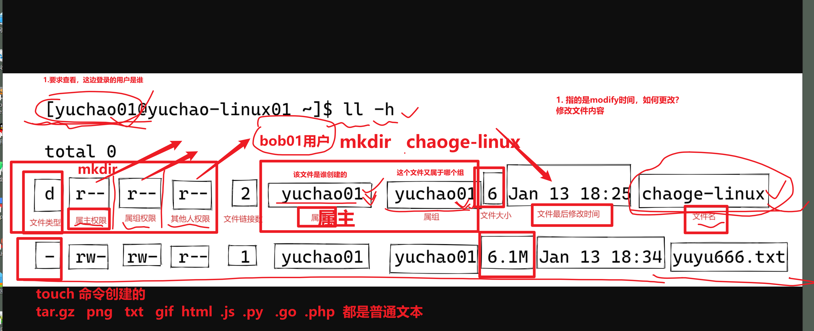
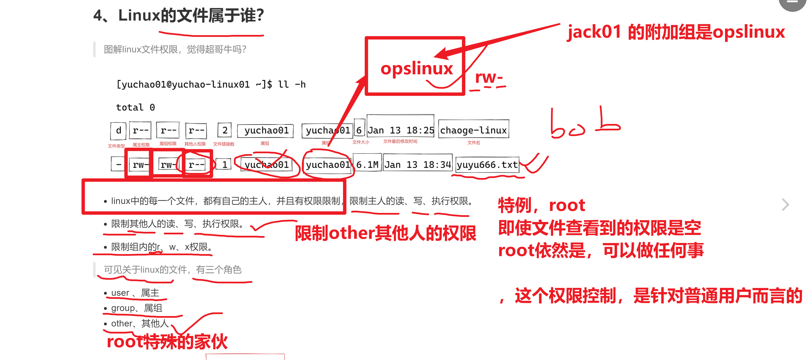
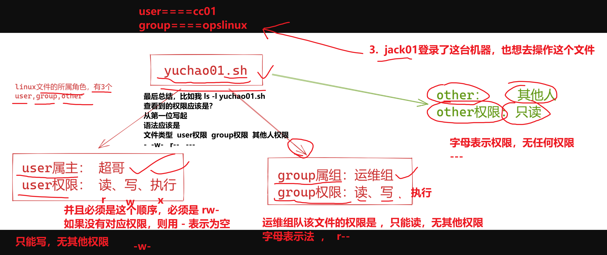
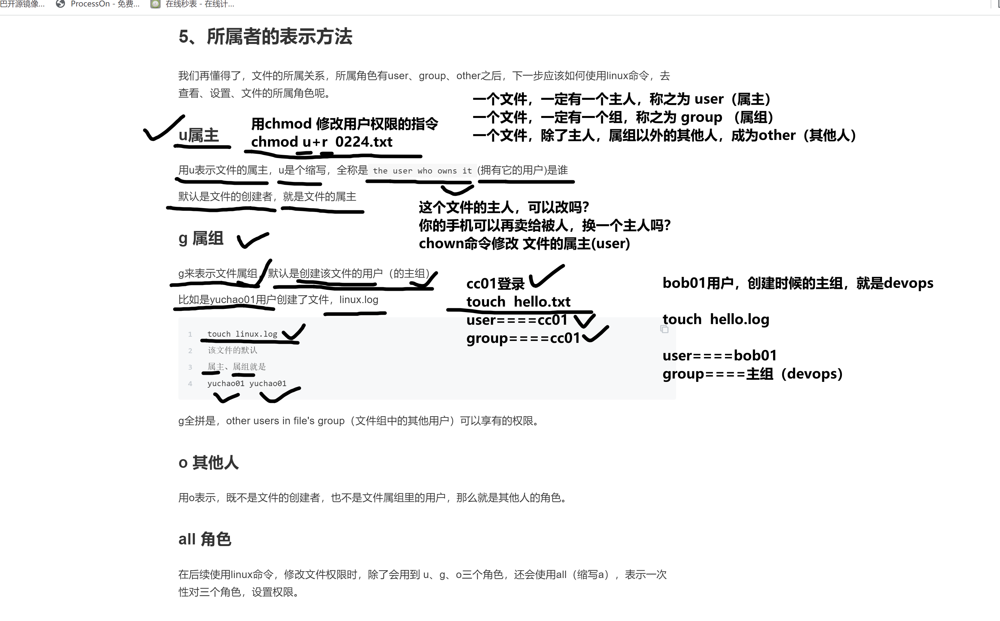
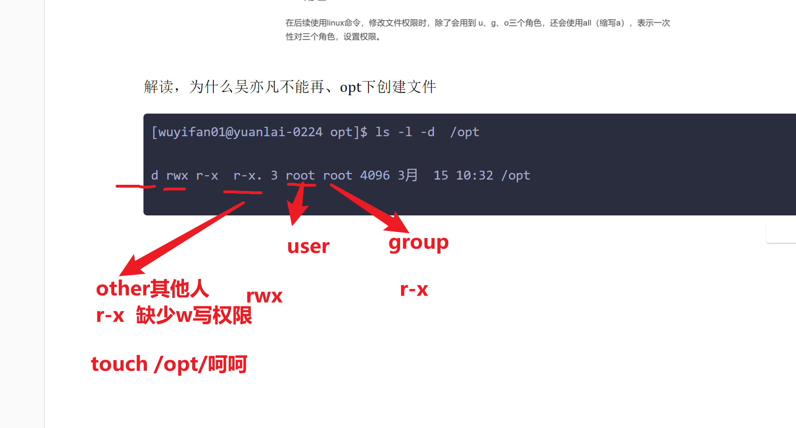
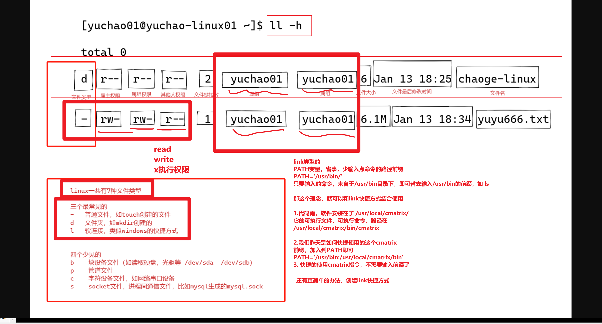
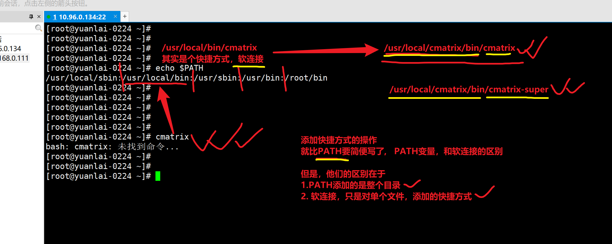
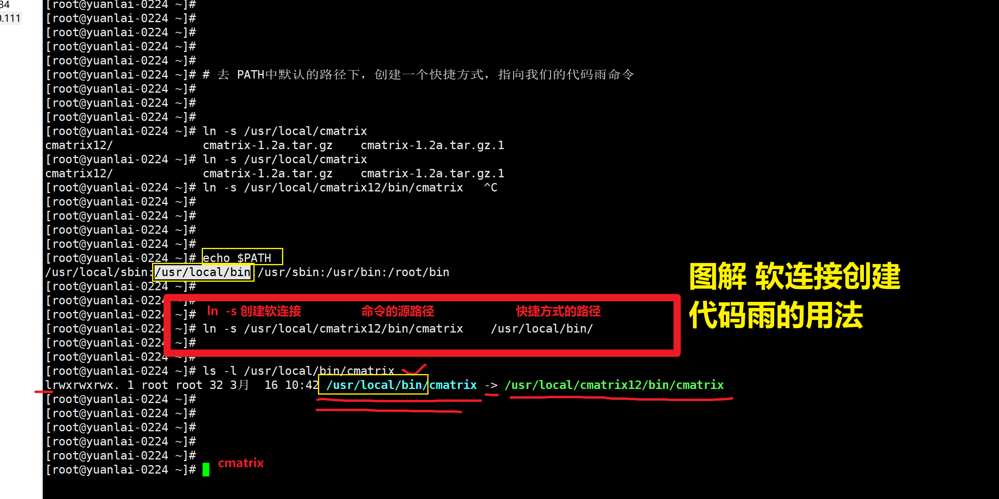
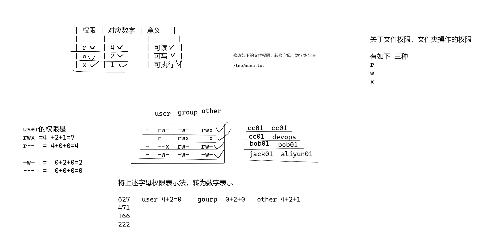

```### 此资源由 58学课资源站 收集整理 ###
	想要获取完整课件资料 请访问：58xueke.com
	百万资源 畅享学习

```
# 文件、用户权限管理

- 普通用户
- 超级用户
- 用户组


不同的用户，以及不同的组，对于linux的文件操作，权限高地，权限不同。

读取 cat，more，tail

写入  echo 追加 ，vim编辑，cat重定向

修改，修改文件属性，mv改名字，修改文件权限

执行， 文件中写的是可执行的语句，如bash语句，python的脚本文件

​		执行一般指的是，文件中写的是编程语言的语句的一个特殊文件

​		可以运行该文件，称之为脚本


## 3、权限分类

|                   | 权限针对文件，file                                   | 权限针对目录，directory                                      |
| ----------------- | ---------------------------------------------------- | ------------------------------------------------------------ |
| 读r，read         | 表示可以查看文件内容；cat                            | 表示可以(ls)查看目录中存在的文件名称                         |
| 写w，write        | 表示可以更改文件的内容；vim 修改，保存退出           | 表示是否可以删除目录中的子文件或者新建子目录(rm/touch/mkdir) |
| 执行x，executable | 表示是否可以执行文件，一般指二进制文件、或者脚本文件 | 表示是否可以进入目录中(cd)                                   |

touch ./my_test.sh

写入脚本内容，执行该脚本，执行方式

bash  my_test.sh

\# 需要给脚本添加执行权限，就可以以如下形式运行

./my_test.sh




---



认识文件权限




关于u，g



解读，为什么吴亦凡不能再、opt下创建文件

```
[wuyifan01@yuanlai-0224 opt]$ ls -l -d  /opt

d rwx r-x  r-x. 3 root root 4096 3月  15 10:32 /opt

```



查看普通用户，创建的文件，对应的，user，group是谁


以及普通用户，在修改了主组之后，再创建文件，对应的user，group是谁

```
关于用户bob01，对文件file.txt是否有读，写，执行的权限，需要关注

1.该文件file.txt的user，group，other的权限是多少，是否有r，w，x的权限

jack01(user) devops(group)  file.txt  
user========  rwx
group======= rw-
other======== ---

你想让bob01对这个文件，可以达到如下权限的情况，怎么思考
（在不修改文件权限的情况下，完成此操作，你要改的是文件的拥有者的类别）
1.可以读写执行
	更改file.txt的主人，改为bob01
	bob01(user) devops(group)  file.txt  
	
	
2.可以读写
	把bob01加入到devops组中，就享有组内的权限了
	jack01(user) devops(group)  file.txt  文件权限不变
	变得是用户bob01的属性
		usermod -G devops bob01
	


2.该文件的file.txt所处的目录，对于bob01是否也同样有相关的r，w，x权限


user 主人
group所属的组
other其他人

all 角色
	每次都要单独的对u，g，o三个角色，添加，删除权限，很麻烦
	只需要对a角色操作，就可以同时给u，g，o三个角色，添加，修改权限
	具体对应到的是linux命令
	chmod a+r  file.txt 
	
	chmod u-r file.txt  # 给file.txt的属主，减去读取的权限
	
```

### all 角色

在后续使用linux命令，修改文件权限时，除了会用到 u、g、o三个角色，还会使用all（缩写a），表示一次性对三个角色，设置权限。

### root 用户

linux中的root用户是特殊用户，是系统的超级管理员，有最大权限，可以任意修改linux文件，因此权利越大、责任越大。

工作里尽量都不用root，以防出故障。

都是使用普通用户，然后运维给配置sudo权限这样去用。

# 学习link添加快捷方式





1.将代码雨，从PATH中移除

2.你要记住的是，linux让你省事，输入命令前缀，前提是，能找打这个命令在哪




## 添加软连接，可以快捷使用代码雨的指令




## 关于python和软连接的关系


```
[root@yuanlai-0224 ~]# # 当你的机器，同时存在多个python版本，如何维护？是否搞得清？
[root@yuanlai-0224 ~]# 
[root@yuanlai-0224 ~]# 
[root@yuanlai-0224 ~]# # 你只需要，搞明白，link软连接，和PATH的配置详细，你以后玩转各种软件的路径配置，不在话下
[root@yuanlai-0224 ~]# 
[root@yuanlai-0224 ~]# 


[root@yuanlai-0224 ~]# ll /usr/bin/python2
lrwxrwxrwx. 1 root root 9 2月  25 15:04 /usr/bin/python2 -> python2.7
[root@yuanlai-0224 ~]# 
[root@yuanlai-0224 ~]# 
[root@yuanlai-0224 ~]# python
python     python2    python2.7  
[root@yuanlai-0224 ~]# python
python     python2    python2.7  
[root@yuanlai-0224 ~]# 
[root@yuanlai-0224 ~]# 
[root@yuanlai-0224 ~]# ll /usr/bin/python2.7
-rwxr-xr-x. 1 root root 7216 4月  11 2018 /usr/bin/python2.7
[root@yuanlai-0224 ~]# 
[root@yuanlai-0224 ~]# 
[root@yuanlai-0224 ~]# vim /usr/bin/python2.7 
[root@yuanlai-0224 ~]# 


```

## 文件权限的数字表示法

### 2.1 文件权限（字母，数字表示）

| 权限 | 对应数字 | 意义   |
| ---- | -------- | :----- |
| r    | 4        | 可读   |
| w    | 2        | 可写   |
| x    | 1        | 可执行 |



11:10 


## chmod命令

练习

- 根据文件的u，g，o，分别修改 rwx权限
- 查看针对文件、文件夹不同的区别

### 文件的操作

```
1.注意，需要以普通用户登录操作，root不受权限控制

2.以chenyufan01登录，演示普通用户，对文件的，r，w，x分别表示什么

[chenyufan01@yuanlai-0224 ~]$ touch 随风奔跑.txt
[chenyufan01@yuanlai-0224 ~]$ 
[chenyufan01@yuanlai-0224 ~]$ 
[chenyufan01@yuanlai-0224 ~]$ 
[chenyufan01@yuanlai-0224 ~]$ ll
总用量 0
-rw-rw-r--. 1 chenyufan01 chenyufan01 0 3月  16 11:17 随风奔跑.txt
[chenyufan01@yuanlai-0224 ~]$ 
[chenyufan01@yuanlai-0224 ~]$ 
[chenyufan01@yuanlai-0224 ~]$ # 给user，权限降到最低
[chenyufan01@yuanlai-0224 ~]$ 
[chenyufan01@yuanlai-0224 ~]$ chmod u-r  随风奔跑.txt 
[chenyufan01@yuanlai-0224 ~]$ chmod u-w  随风奔跑.txt 
[chenyufan01@yuanlai-0224 ~]$ 
[chenyufan01@yuanlai-0224 ~]$ 
[chenyufan01@yuanlai-0224 ~]$ chmod u-x  随风奔跑.txt 
[chenyufan01@yuanlai-0224 ~]$ 
[chenyufan01@yuanlai-0224 ~]$ 
[chenyufan01@yuanlai-0224 ~]$ ll
总用量 0
----rw-r--. 1 chenyufan01 chenyufan01 0 3月  16 11:17 随风奔跑.txt
[chenyufan01@yuanlai-0224 ~]$ 


[chenyufan01@yuanlai-0224 ~]$ # r
[chenyufan01@yuanlai-0224 ~]$ 
[chenyufan01@yuanlai-0224 ~]$ cat 随风奔跑.txt 
cat: 随风奔跑.txt: 权限不够
[chenyufan01@yuanlai-0224 ~]$ 
[chenyufan01@yuanlai-0224 ~]$ more 随风奔跑.txt 
随风奔跑.txt: 权限不够
[chenyufan01@yuanlai-0224 ~]$ 
[chenyufan01@yuanlai-0224 ~]$ 
[chenyufan01@yuanlai-0224 ~]$ tail -5 随风奔跑.txt 
tail: 无法打开"随风奔跑.txt" 读取数据: 权限不够
[chenyufan01@yuanlai-0224 ~]$ 
[chenyufan01@yuanlai-0224 ~]$ 
[chenyufan01@yuanlai-0224 ~]$ # w
[chenyufan01@yuanlai-0224 ~]$ 
[chenyufan01@yuanlai-0224 ~]$ 
[chenyufan01@yuanlai-0224 ~]$ echo "速度，70迈，心情好" >> 随风奔跑.txt 
-bash: 随风奔跑.txt: 权限不够
[chenyufan01@yuanlai-0224 ~]$ 
[chenyufan01@yuanlai-0224 ~]$ 
[chenyufan01@yuanlai-0224 ~]$ # x
[chenyufan01@yuanlai-0224 ~]$ 
[chenyufan01@yuanlai-0224 ~]$ ./随风奔跑.txt
-bash: ./随风奔跑.txt: 权限不够

给文件，的user权限再全部加上
chmod u+r,u+w,u+x 随风奔跑.txt


2. 演示group的 r，w，x
字母权限，的增加，减少，如下

[root@yuanlai-0224 tmp]# chmod g-r,g-w /tmp/随风奔跑.txt 


-rwx---r--.  1 chenyufan01 devops      22 3月  16 11:29 随风奔跑.txt
[wuyifan01@yuanlai-0224 tmp]$ 
[wuyifan01@yuanlai-0224 tmp]$ 
[wuyifan01@yuanlai-0224 tmp]$ 
[wuyifan01@yuanlai-0224 tmp]$ cat 随风奔跑.txt 
cat: 随风奔跑.txt: 权限不够
[wuyifan01@yuanlai-0224 tmp]$ 
[wuyifan01@yuanlai-0224 tmp]$ 
[wuyifan01@yuanlai-0224 tmp]$ echo "我是吴亦凡你好" >> 随风奔跑.txt 
-bash: 随风奔跑.txt: 权限不够


3.其他人的rwx，好演示
-root去创建文件，修改文件的user，group，other的不同的权限

-再创建新用户，去表示和文件不同的角色关系，如user，group，other


4.看看关于文件的r,w,x, 是否有权限
看看x的允许执行，是什么概念
写一个脚本
[luozhixiang01@yuanlai-0224 tmp]$ cat say_hello.sh 
name="吴亦凡"

echo "我是${name}，你是哪位？你也想进来踩缝纫机吗？"

name2='陈羽凡'
echo "你好${name},我是${name2}，大家一起来踩缝纫机！边唱边菜"
[luozhixiang01@yuanlai-0224 tmp]$ 
[luozhixiang01@yuanlai-0224 tmp]$ 
[luozhixiang01@yuanlai-0224 tmp]$ 
[luozhixiang01@yuanlai-0224 tmp]$ ./say_hello.sh 
我是吴亦凡，你是哪位？你也想进来踩缝纫机吗？
你好吴亦凡,我是陈羽凡，大家一起来踩缝纫机！边唱边菜
[luozhixiang01@yuanlai-0224 tmp]$ 


```

关于文件的权限修改，涉及的命令

- chmod

- chgrp 修改文件的属组，group

- ```
  [root@yuanlai-0224 tmp]# # 该文件的组也改为吴亦凡
  [root@yuanlai-0224 tmp]# chgrp wuyifan01  say_hello.sh
  
  ```

- 

- chown 修改文件的属主，user

```
[root@yuanlai-0224 tmp]# # 该文件的属主为wuyifan01
[root@yuanlai-0224 tmp]# 
[root@yuanlai-0224 tmp]# chown wuyifan01  say_hello.sh 


```

## 文件夹的读写执行

## 4、文件、目录的的rwx

1.想要删除文件，要看是否有`该文件所在目录，目录是否有w权限`，才可以删除文件，且还得有x权限，才能进入文件夹。（用普通用户测试）

想在文件中，进行编辑操作，必须得有x权限。

|       | 权限针对文件                                             | 权限针对目录                                                 |
| ----- | -------------------------------------------------------- | ------------------------------------------------------------ |
| 读r   | 表示可以查看文件内容                                     | 表示可以(ls)查看目录中存在的文件名称                         |
| 写w   | 表示可以更改文件的内容                                   | 表示是否可以删除目录中的子文件或者新建子目录(rm/touch/mkdir) |
| 执行x | 表示是否可以开启文件当中记录的程序,一般指二进制文件(.sh) | 表示是否可以进入目录中(cd)                                   |


```
练习的时候，统一到/tmp下先操作

1.创建文件夹，分别查看r w x 的权限

```


## chown、chgrp命令

修改文件的属主，属组，然后分别对应的文件权限。


## 文件权限实战题

xxx


## 文件夹实战题


# 文件权限-课间练习题

1.给/data目录设置，属主全部权限，属组可读可执行，其他用户无权限，请用2种方式写。

2.设置/data/user_info.txt权限，属主读、写，属组读、写，其他人只读。

3.设置/data/password.txt文件，只有属主读写，其他人无权限。

4.综合权限，读、写、执行实战。

```
1.设置文件/test_data/chaoge01.txt ，所有角色无权限，用普通用户yuchao01登录后对该文件进行读、写、执行操作。yuchao01用户可以进行哪些命令操作该文件？


2.设置文件/test_data/chaoge01.txt，权限为-r--r--r--，用普通用户yuchao01登录后对该文件进行读、写、执行操作。yuchao01用户可以进行哪些命令操作该文件？


3.设置文件/test_data/chaoge01.txt，权限为-rw-r--r--，用普通用户yuchao01登录后对该文件进行读、写、执行操作。yuchao01用户可以进行哪些命令操作该文件？


4.设置文件/test_data/chaoge01.txt，权限为-rw-r--rw-，用普通用户yuchao01登录后对该文件进行读、写、执行操作。yuchao01用户可以进行哪些命令操作该文件？


5.设置文件/test_data/chaoge01.txt，权限为-rw-r--rwx，用普通用户yuchao01登录后对该文件进行读、写、执行操作。yuchao01用户可以进行哪些命令操作该文件？


6.设置文件/test_data/chaoge01.txt，权限为--------w-，用普通用户yuchao01登录后对该文件进行读、写、执行操作。yuchao01用户可以进行哪些命令操作该文件？


7.设置文件/test_data/chaoge01.txt，权限为--------wx，用普通用户yuchao01登录后对该文件进行读、写、执行操作。yuchao01用户可以进行哪些命令操作该文件？


```


## 10.2 目录权限实战练习

```
1.分别创建以下权限的文件夹，进行对文件夹的、读、写、执行测试

2.用普通用户登录系统后，创建文件夹测试

r--
rw-
r-x
-w-
--x
rwx


```


