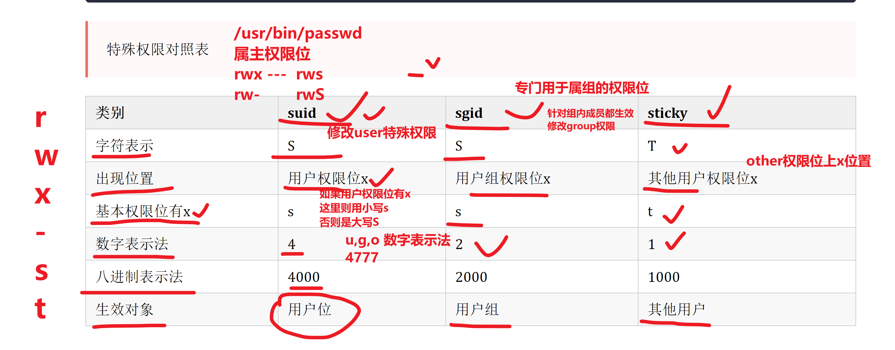
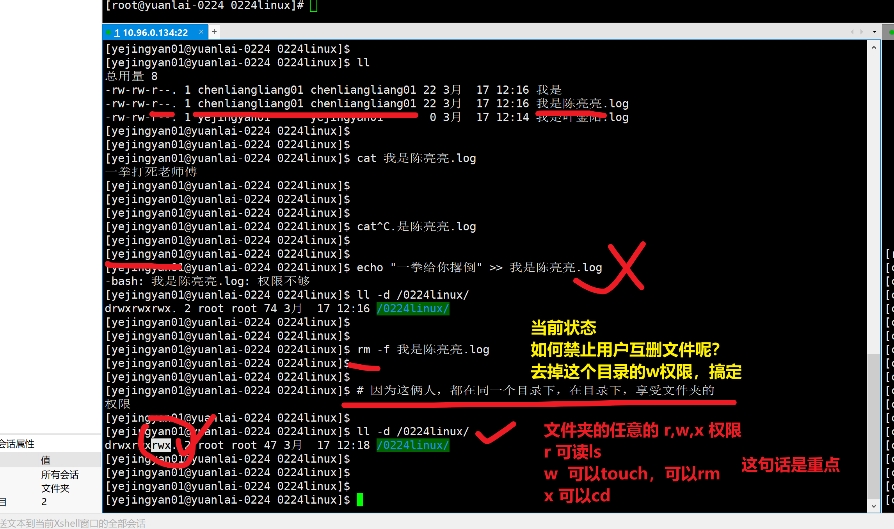

```### 此资源由 58学课资源站 收集整理 ###
	想要获取完整课件资料 请访问：58xueke.com
	百万资源 畅享学习

```
# day13今日安排

0. 默写

1. 昨日作业讲解
2. 文件权限篇综合知识脑图
3. 特殊权限（了解）

```
linux提供的12个特殊权限
默认的9位权限
rwx rwx rwx

还有三个隐藏的特殊权限，如下
suid  比如 /usr/bin/passwd


sgid


sbit 

```

> 特殊权限对照表

| 类别          | suid        | sgid          | sticky          |
| ------------- | ----------- | ------------- | --------------- |
| 字符表示      | S           | S             | T               |
| 出现位置      | 用户权限位x | 用户组权限位x | 其他用户权限位x |
| 基本权限位有x | s           | s             | t               |
| 数字表示法    | 4           | 2             | 1               |
| 八进制表示法  | 4000        | 2000          | 1000            |
| 生效对象      | 用户位      | 用户组        | 其他用户        |



# suid的作用

我们会发现这个passwd命令，有一个奇怪的s权限，这干啥的？

可以看到，原本表示文件所有者权限中的 x 权限位，却出现了 s 权限，此种权限通常称为 SetUID，简称 SUID 特殊权限。

> 看这里，理解suid的作用

- SUID 特殊权限仅适用于可执行文件

  - 二进制命令
  - 比如系统的/usr/bin下提供的命令，如 /usr/bin/ls，如/usr/bin/rm

- 所具有的功能是，**只要用户对设有 SUID 的文件有执行权限，那么当用户执行此文件时，会以文件属主的身份去执行此文件**

  - ```
    先看一个没有suid权限的二进制命令
    [root@yuanlai-0224 tmp]# ll /usr/bin/rm
    - rwx  r-x   r-x. 1 root root 62864 4月  11 2018 /usr/bin/rm  
    
    # 当你给这个rm命令，设置了suid权限，那么普通用户在执行该rm命令时，就以属主的身份去执行（root身份）
    
    
    如果你给rm命令设置了suid权限
    
    这个普通用户执行了如下命令，会如何
    rm -rf /*
    
    cc03用户
    执行
    rm -rf /tmp/*
    
    
    留作业，你们试一试，友好提醒，做好快照
    
    如上，理解suid的作用。
    ```

  - 

- 一旦文件执行结束，身份的切换也随之消失。

> 以这个/usr/bin/passwd可执行命令举例
>
> 就是让普通用户，执行该命令时，临时获得root的权限。

实际用法，suid可以让普通用户，修改自己的密码，是因为

可执行文件/usr/bin/passwd 有了suid权限。

自己去试试给 /usr/bin/rm设置suid，查看普通用户，再使用rm时的权限。

> 找出系统中，所有包含了suid权限的

```
# find提供权限查找的参数 -perm   -ls find提供的格式化打印参数，就好比-exec -ok  -delete 一样

find / -type f -perm -4000  -ls


find / -type f -name '*.log'  -ok rm -f {} \;

```


# sgid的作用

```
1.对于二进制命令来说，sgid的功能和suid基本一样，只不过一个是设置文件属主的权限，一个是设置属组的权限，和9位基本rwx那个理解概念一样。

2. suid是获得文件属主的权限，sgid是获得文件属组的权限

3. sgid主要用于文件夹，为某个目录设置sgid之后，在该目录中的创建的文件，都以（目录的属组）权限为准，而不属于创建该文件的用户权限，这就实现了多个用户，可以共享一个目录的作用。


一般直接和文件夹结合使用，给文件夹设置sgid，等于设置了一个共享文件夹的概念


简单总结
1.一个普通的文件夹，普通用户cc03进入后，创建文件，user，group都属于谁？都属于cc03
baoqiang01  进入后，创建文件 ，都属于谁？ baoqiang01

2.当一个文件夹设置了sgid，普通用户cc03进入后，创建的文件，user属于cc03，group属于了文件夹的属组。
baoqiang01 进入后，创建了文件，user，group属于谁？user属于baoqiang01，group属于文件夹的属组。


```

## 将sgid和红帽认证考题结合练习

```
考生账号是 user01

[user01@yuanlai-0224 ~]$ 

1.创建一个共享目录/home/admins

mkdir /home/admins


2.要求该目录属组是adminuser,adminuser组内成员对该目录的权限是，可读，可写，可执行。
创建组adminuser
groupadd adminuser

修改/home/admins的属组
chgrp  adminuser  /home/admins
修改group角色的权限是 r,w,x
chmod g=rwx /home/admins


3.其他用户均无任何权限（root特例）
chmod o=''  /home/admins

4.这道题，的最后一个难关，是这个》》》》 进入/home/admins创建的文件，自动继承adminuser组的权限。 


(这里用到了sgid的权限吗，你需要给/home/admins设置sgid权限，肯定得是root去设置吧)

用字母表示法，给文件夹设置sgid权限
chmod g+s /home/admins

[root@yuanlai-0224 ~]# ll /home/admins/ -d
drwxrws---. 2 root adminuser 6 3月  17 11:50 /home/admins/


5.此时你在这个目录下，创建的文件，自动继承adminuser的权限（文件的group，默认就是adminuser了）


[root@yuanlai-0224 ~]# 
[root@yuanlai-0224 ~]# touch /home/admins/我是root.log
[root@yuanlai-0224 ~]# 
[root@yuanlai-0224 ~]# 
[root@yuanlai-0224 ~]# mkdir /home/admins/我是root文件夹
[root@yuanlai-0224 ~]# 
[root@yuanlai-0224 ~]# 
[root@yuanlai-0224 ~]# ll /home/admins/
总用量 0
-rw-r--r--. 1 root adminuser 0 3月  17 11:56 我是root.log
drwxr-sr-x. 2 root adminuser 6 3月  17 11:56 我是root文件夹
[root@yuanlai-0224 ~]# 

发现文件夹，也自动有了s权限，还实现了递归继承的效果


```


# sbit的作用

直观的效果查看

```
1.创建一个公共目录，给与777权限

mkdir /0224linux/
chmod 777 /0224linux/


2.分别用2个普通用户，去操作，查看权限是如何


```



## 为什么需要学sbit权限

```
背后的原理是这个：
# 总结，在一个权限是 777的文件夹下，所有用户，可以进行 r，w，x的操作，也就意味着，可以随便，删除其他人的资料！！

linux中的确存在这么一个公共文件夹，名字叫做/tmp 临时文件夹

sbit粘滞位，用的已经很少了，但是对于系统特殊文件夹/tmp来说，是整个系统所有用户的临时文件存放地，谁都有任意的权限，你会发现该目录的权限巨大。

[root@yuchao-tx-server ~]# ll -d /tmp/
drwxrwxrwt. 8 root root 4096 3月  16 18:54 /tmp/

但是看到了一个特殊权限t
一句话总结。
当目录有了粘滞位特殊权限，这个目录除了root用户特殊以外，任何用户都只能删除、移动自己的创建的文件，而不能影响到其他人。

演示
没有设置粘滞位，且目录是777权限时，也就是任意的user、group、other角色在这个目录下，可以进行读、写、执行任意文件。


```

1.移除/tmp的sbit权限，查看该目录下的文件操作

```
[root@yuanlai-0224 0224linux]# chmod o-t /tmp
[root@yuanlai-0224 0224linux]# ll -d /tmp
drwxrwxrwx. 11 root root 260 3月  17 12:26 /tmp

请注意，还给人家加上去

```

2.自己创建一个共享目录，只能创建，不能删除别人的资料

```
[root@yuanlai-0224 0224linux]# chmod o+t /0224linux/
[root@yuanlai-0224 0224linux]# 
[root@yuanlai-0224 0224linux]# 
[root@yuanlai-0224 0224linux]# ll -d /0224linux/
drwxrwxrwt. 2 root root 47 3月  17 12:18 /0224linux/
[root@yuanlai-0224 0224linux]# 


然后再用俩用户，演示文件删除动作

```


# umask的作用（了解，不要改）


