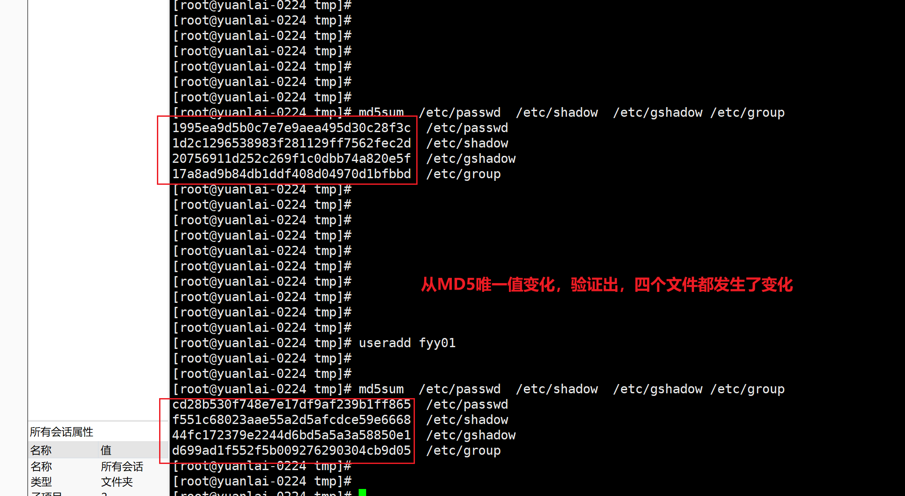
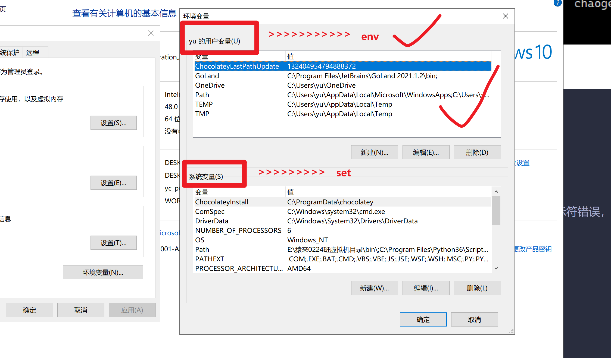
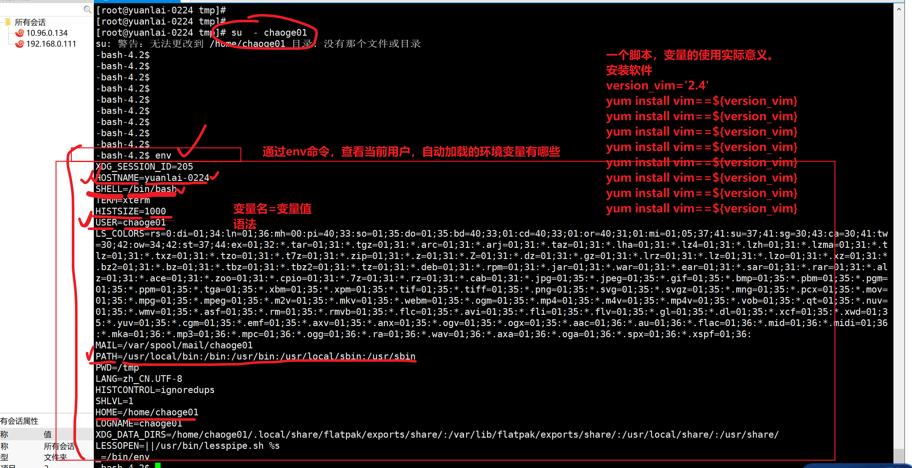
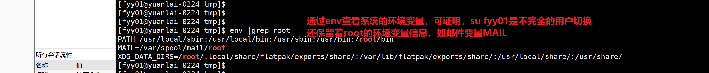
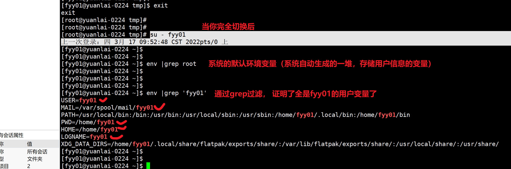
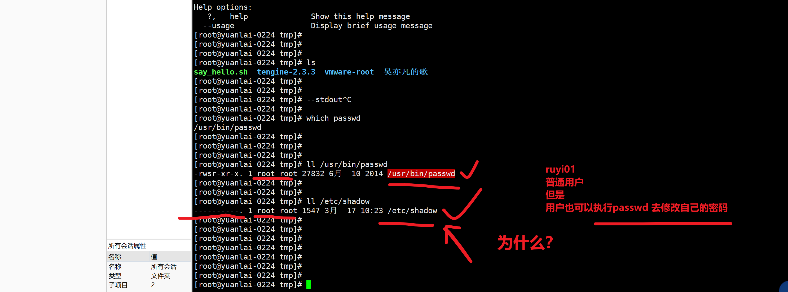
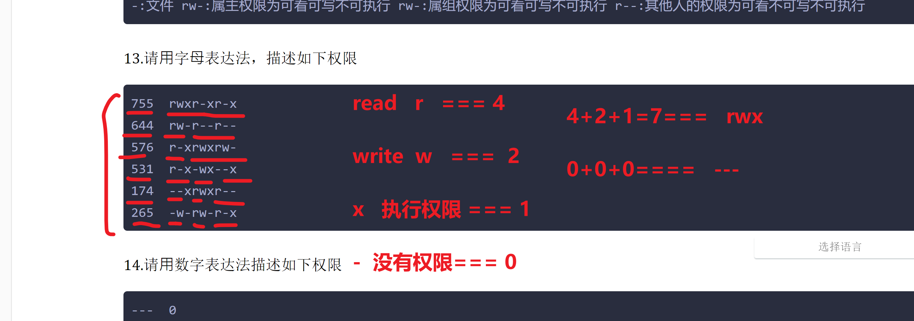

```### 此资源由 58学课资源站 收集整理 ###
	想要获取完整课件资料 请访问：58xueke.com
	百万资源 畅享学习

```
# 3.16作业

## ⽤户权限、⽂件权限综合练习

1.创建⽤户会涉及哪些⽂件的改动？以及如何验证⽂件被修改过了？（该文件的唯一值是否发生了变化）

~~~
/etc/passwd  用户信息   useradd
/etc/shadow  用户密码信息   passwd 修改密码

/etc/gshadow 用户组信息  groupadd
/etc/group   用户组密码信息  gpasswd 


[root@xixi ~]# useradd fyy


（该文件的唯一值是否发生了变化）
用法，对如下四个文件，修改之前，检验md5值，以及修改之后，查看它的值是否变化 
md5sum  /etc/passwd  /etc/shadow  /etc/gshadow /etc/group  


~~~


---




全部涉及

2.创建⽤户(useradd)chaoge01，要求uid为1200(-u参数)，gid为2000()，不允许创建家⽬录(-M)，不允许登录。(-s)

```
这道题的坑，设置gig为2000，意思是，要求得先有这个组，组名字 apple01（gid=2000）
groupadd -g 2000 apple01

查看useradd帮助信息，找到题目中需要的参数
[root@yuanlai-0224 tmp]# useradd --help
用法：useradd [选项] 登录
      useradd -D
      useradd -D [选项]
  -M, --no-create-home		不创建用户的主目录，不会默认去创建 /home/chaoge01


useradd -u 1200 -g 2000 -M -s /sbin/nologin  chaoge01

没有创建
/home/chaoge01
```


3.修改上⼀题创建的⽤户(usermod)，uid改为2000(-u)，且允许登录(-s)。

## 补充，查看系统/用户的环境变量命令




```
usermod -u 2000 -s /bin/bash chaoge01

实现登录（完全进行用户环境变量切换 ）效果，该用户的2个办法

su  - chaoge01

系统想加载用户环境变量，进入家目路，没有/home/chaoge01，导致命令提示符错误，如何修复呢？
# linux中可以查询用户相关的，环境变量，命令是 env
# linux中还有一个查询，全系统的环境变量，命令是set

# PS1变量，就是控制命令提示符的

[fyy01@yuanlai-0224 ~]$ set |grep PS1
PS1='[\u@\h   \W]\$ '
\u 显示用户名
\h 显示主机名
\W 显示用户所处目录的最后一级
\w 显示用户所处的绝对路径，省去你敲pwd
\t 以24小时制，显示时间
\$ 显示用户的身份提示符，自动识别root还是普通用户

最终你可以调整PS1 命令提示符如下格式
PS1='[\u@\h   \w \t]\$ '

该变量，临时敲打，临时生效，重新登录后，系统重新加载用户环境变量，该设置丢失
如何永久生效？把你自定义的变量
- 写入到，系统全局环境变量配置文件中(/etc/profile)
- 那么就有关于用户个人的配置文件，在用户家目录下
~/.bash_profile


对变量，能够修改系统设置，有一定的了解


# 1.命令提示符的，变量
属于我们用户在系统中，自定义的变量，并且！！！变量名和值之间，不得有空格
x=1
y=3
name='大西瓜'

系统中有很多，系统运行，必须的一些变量，比如通过env命令查看


# 2.当命令提示符出现损坏，以及家目录显示不正常的解决办法

比如如下损坏信息时，
[root@yuanlai-0224 tmp]# su - chaoge01
上一次登录：四 3月 17 09:51:51 CST 2022pts/0 上
su: 警告：无法更改到 /home/chaoge01 目录: 没有那个文件或目录
-bash-4.2$ 
-bash-4.2$ 
-bash-4.2$ 
-bash-4.2$ echo $PS1
\s-\v\$
-bash-4.2$ 

修复原理：
1.表示系统读不到用户的个人配置文件，用户在useradd创建时候，系统会去 、/etc/skel 目录下，拷贝所有的用户个人环境变量配置文件，到用户生成的家目录下 /home/chaoge01

2. 用户在登录时，自动加载 /home/chaoge01 下所有的文件内容


3.修复手段，手动的拷贝 前2步操作即可修复
cp -r /etc/skel/  /home/chaoge01 

4.
[root@yuanlai-0224 tmp]# su - chaoge01
上一次登录：四 3月 17 10:08:12 CST 2022pts/0 上
[chaoge01@yuanlai-0224 ~]$ 
[chaoge01@yuanlai-0224 ~]$ 
[chaoge01@yuanlai-0224 ~]$ 
[chaoge01@yuanlai-0224 ~]$ 
[chaoge01@yuanlai-0224 ~]$ 
[chaoge01@yuanlai-0224 ~]$ pwd
/home/chaoge01
[chaoge01@yuanlai-0224 ~]$ 


```

## 补充变量的概念



---

不完全切换的概念



证明用户完全切换




4.查看系统的前5个⽤户，以及后5个⽤户(找出系统最新添加的5个用户)。

```
/etc/passwd

用户添加，不断的递增，写入到文件中

head -5 /etc/passwd

tail -5 /etc/passwd


```


5.请解释useradd命令的参数含义

~~~
-u 指定用户uid，默认uid必须唯一，除非使用了-o选项
-g 指定用户主组，要求组已存在 (gid,组名)
[root@yuanlai-0224 tmp]# useradd kuke01 -g apple01
[root@yuanlai-0224 tmp]# 
[root@yuanlai-0224 tmp]# 
[root@yuanlai-0224 tmp]# id kuke01
uid=2001(kuke01) gid=2000(apple01) 组=2000(apple01)


-s 使用者登入后使用的shell名称。预设为不填写，这样系统会帮你指定预设的登shell，这个登录shell，名字/bin/bash。
-M 不建立使用者目录，即使/etc/login.defs系统档设定要建立使用者目录

~~~

6.创建⼀个组名为yuanlai-linux，组id是1688。


7.再修改组id为2222.

```
修改用户组的信息  groupmod -g 2222  组名

熟练去用linux提供的--help是最精准的命令用法手册。


修改用户的信息 usermod
```


8.修改⽤户密码，写出3种⽅式。


```
echo '密码字符串' |  passwd --stdin    用户名

理解标准输入，标准输出

--stdin 给程序传入的数据
--stdout 程序执行产生的结果

```




```
chpasswd 命令接收 key:value 键值对形式的  账号:密码


```


9.请解释命令区别。

env

set

找出关于用户加载的环境变量

结合su - 去理解


~~~
su - chaoge01
~~~

完全切换用户，加载用户的家目录，和用户的环境变量


~~~
su chaoge01
~~~

非完全切换用户，还在root用户的家目录，环境变量还是root用户的


10.分别⽤字⺟表达、数字表达法两种，描述如下命令创建的权限，并且详细图⽂解释每⼀个属性。

~~~
[root@yuchao-tx-server tmp]# ll -d /test_linux01/
drwxrwxrwx 2 root root 4096 3⽉ 16 15:02 /test_linux01/

 chmod 777 /test_linunx/
 chmod u=rwx,g=rwx,o=rwx /test_linux/
 
[bob01@yuchao-tx-server tmp]$ ll
总⽤量 0
-rw-rw-r-- 1 bob01 bob01 0 3⽉ 16 13:54 我是bob.log
 
 chmod 664 /tmp/我是bob.log
 chmod u=rw,g=rw,o=r /tmp/我是bob.log

[bob01@yuchao-tx-server tmp]$ ll
总⽤量 4
-rw-r--r-- 1 root root 0 3⽉ 16 13:55 stargate.lock
-rw-rw-r-- 1 bob01 bob01 0 3⽉ 16 13:54 我是bob.log
drwxrwxr-x 2 bob01 bob01 4096 3⽉ 16 13:56 我是bob⽂件夹

 chmod 644 /tmp/stargate.lock
 chmod u=rw,g=r,o=r /tmp/stargate.lock
 
 chmod 664 /tmp/我是bob.log
 chmod u=rw,g=rw,o=r /tmp/我是bob.log
 
 chmod 775 /tmp/我是bob文件夹/
 chmod u=rwx,g=rwx,o=rx /tmp/我是bob文件夹
~~~


11.请解释如下数字权限创建的⽂件、⽂件夹分别权限是？

~~~
1.你需要带着一个疑问，为什么文件，不给x权限，一般文件都是，读，写，即可，没有执行  r,w


2. 什么样的文件，会带着x权限？二进制文件，脚本文件，命令/usr/bin/ls  /usr/bin/mkdir 可执行命令吗
[root@yuanlai-0224 tmp]# # 只想要root执行代码雨，其他人不让玩
[root@yuanlai-0224 tmp]# 
[root@yuanlai-0224 tmp]# chmod 754 /usr/local/cmatrix12/bin/cmatrix


ls命令的文件权限是？
755
[root@yuanlai-0224 tmp]# ll /usr/bin/ls
-rwxr-xr-x. 1 root root 117672 4月  11 2018 /usr/bin/ls
[root@yuanlai-0224 tmp]# 
[root@yuanlai-0224 tmp]# ll /usr/bin/mkdir
-rwxr-xr-x. 1 root root 79760 4月  11 2018 /usr/bin/mkdir


⽂件：644 -rw-r--r-- 属主可看可写不可执行，属组可看不可写不可执行，其他人只能看不可写不可执行
rw-   user可以对文件执行【ll , cat,more,less,tail,echo重定向写入,vim,stat, 】命令
r--   group 只读操作，只能cat相关
r--   other 只读操作  cat相关


文件夹，默认属主，是可以，读，写，执行
r   ls,ll
w   touch /opt/file.txt 表示可以在目录中创建新文件；如果想创建目录中的文件，还必须有x权限
x   cd /opt 进入目录，

⽬录：755 drwxr-xr-x 属主可看可写不可执行，属组可看不可写可执行，其他人可看不可写可执行
rwx
r-x
r-x  other ,chaoge01 ，只能ls 看一看目录有啥，给该目录，添加w权限后，表示可以在目录下，创建，删除资料。


~~~

12.解释如下两个⽂件的权限位，表达的含义。

~~~
drwxr--r-x 
d:目录 rwx:属主权限为可看可写可执行 r--:属组权限为可看不可写不可执行 r-x:其他人的权限为可看不可写可执行
-rw-rw-r--
-:文件 rw-:属主权限为可看可写不可执行 rw-:属组权限为可看可写不可执行 r--:其他人的权限为可看不可写不可执行
~~~

13.请⽤字⺟表达法，描述如下权限

~~~
755  rwxr-xr-x
644  rw-r--r--
576  r-xrwxrw-
531  r-x-wx--x
174  --xrwxr--
265  -w-rw-r-x
~~~




14.请⽤数字表达法描述如下权限

~~~
---  0
r--  4
rw-  6
r-x  5
-w-  2
-wx  3
--x  1
rwx  7
~~~

15.请描述rwx分别对⽂件、⽂件夹的作⽤，和区别。

~~~
⽂件：
r 
可看，可用cat，more，less... 去看文件内容
w
可写，可用cat>> <<EOF，vim，echo... 往文件内写东西，可用rm删除文件
x
可执行，直接相对路径，找到该文件执行 如 ./test.sh ，或者绝对路径找到执行，如 /usr/bin/ls 


⽬录：
r
可看目录下的内容，可用ls 
w
可写文件，目录的可写，指的是，可以进入该目录，在其目录下，进行文件创建，文件删除
x
可执行，可用cd


~~~

16.请解释如下命令的含义。

~~~
chmod 755 /data
在根下创建一个目录data，权限为 755 drwxr-xr-x 属主可看可写可执行，属组可看不可写可执行，其他人可看不可写可执行


chmod u+x /data
修改/data目录属主权限，加了可执行，权限为 755 drwxr-xr-x 属主可看可写可执行，属组可看不可写可执行，其他人可看不可写可执行


chmod g-x /data
修改/data目录属组权限，去掉可执行，权限为 745 drwxr--r-x 属主可看可写可执行，属组可看不可写不可执行


chmod o=rwx /data
修改/data目录other权限，加上可看可写可执行，权限为 747 drwxr--rwx 属主可看可写可执行，属组可看不可写不可执行，其他人可看可写可执行


chmod a+x /data
修改/data目录全部（All）权限，加上可执行，权限为 757 drwxr-xrwx  属主可看可写可执行，属组可看不可写可执行，其他人可看可写可执行
~~~


17.请修改/data/下所有⽬录，及其⼦⽬录的⽂件，属主改为chaoge01，属组改为devops。

~~~

chown -R  chaoge01.devops   /data

⽬录结构如下，以及⼦⽬录、⽂件。
[root@yuchao-tx-server ~]# tree -NF /data
/data
└── 抖⾳神曲/
    ├── 靓仔dj/
    │    └── dj版-⻰的传⼈.mp4
    └── 美⼥dj/
         └── dj版-千年等⼀回.mp4
~~~


~~~
[root@xixi data]# chown -R chaoge01.devops /data
~~~

18.根据如下要求，进⾏命令实践。

~~~
1.创建如下⽬录
[root@yuchao-tx-server tmp]# ll -d /test_linux01/
drwxrwxrwx 2 root root 4096 3⽉ 16 15:01 /test_linux01/
~~~


~~~
2.创建如下⽂件
[bob01@yuchao-tx-server test_linux01]$ pwd
/test_linux01
[bob01@yuchao-tx-server test_linux01]$ ll
总⽤量 0
-rw-rw-r-- 1 bob01 bob01 0 3⽉ 16 15:02 我是bob.log
~~~


~~~
3.修改bob.log⽂件权限为如下
[bob01@yuchao-tx-server test_linux01]$ ll
总⽤量 0
-r-xr--r-- 1 bob01 bob01 0 3⽉ 16 15:02 我是bob.log
~~~


~~~
4.创建普通⽤户jerry01
[root@yuchao-tx-server tmp]# id jerry01
uid=1703(jerry01) gid=1703(jerry01) 组=1703(jerry01)
~~~


~~~
5.如何让jerry01可以对如下⽂件，读、写、执⾏，请写下3种办法。

⽂件路径 /test_linux01/我是bob.log
该文件当前的权限
-rw-rw-r-- 1 bob01 bob01 0 3⽉ 16 15:02 我是bob.log


# 思路1
直接该文件权限，改other角色的权限 
chmod 667   /test_linux01/我是bob.log

# 思路2
jerry01加入bob组  
再修改属组的权限为 7

# 思路3
修改文件的属主，为jerry01
修改属主权限为 7

# 思路4
用sudo，以root身份，直接提权操作
前提，要配置jerry01加入到/etc/sudoers文件中

# 思路5，尝试将jerry01加入root组，试试权限如何。


~~~

1.因为jerry对与文件‘我是bob.log’是其他人，权限为可看不可写不可执行

先修改权限


2.修改jerry为文件的主人，可随意修改文件的属性，把属主权限改为rwx


3.用visudo给jerry用户提权，让他拥有和root用户一样的权力，对任何文件都拥有读，写，执行的权限


19.如何快捷的执行`cmatrix`代码雨命令，请分别用两种办法实现

```
1.软连接
```

在PATH变量默认的路径中，创建一个快捷方式，指向代码雨命令cmatrix


~~~
2.PATH变量
~~~


~~~
[root@xixi ~]# vim /etc/profile 写入配置文件中，开机时可自动配置到环境变量中，永久生效
~~~


