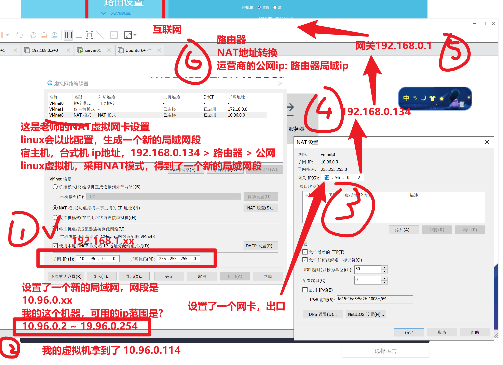

```### 此资源由 58学课资源站 收集整理 ###
	想要获取完整课件资料 请访问：58xueke.com
	百万资源 畅享学习

```
# 今日服务管理学习

先以windows的服务为例，如何找到win的服务管理

```
win键 + r快捷键，打开运行窗口，输入如下指令

services.msc

```


# linux默认提供的服务

## ssh服务

```
1.ssh服务
[root@yuanlai-0224 opt]# netstat -tnlp |grep sshd
tcp        0      0 0.0.0.0:22              0.0.0.0:*               LISTEN      1129/sshd           
tcp        0      0 127.0.0.1:6010          0.0.0.0:*               LISTEN      125786/sshd: root@p 
tcp6       0      0 :::22                   :::*                    LISTEN      1129/sshd           
tcp6       0      0 ::1:6010                :::*                    LISTEN      125786/sshd: root@p 

2. 我可以自由启动，关闭，重启该服务，查看效果

3. 学习centos7，启动的强大，服务管理命令 

systemctl  start/stop/restart/status   服务名称

systemctl stop sshd

systemctl status sshd

systemctl start sshd 启动

4.sshd服务，运行后，即可去访问该服务


```

## network服务

管理linux的网络功能，名字叫network

```
对network服务管理，启停，查看

systemctl stop network 停止

systemctl status network 查看状态

systemctl start network   启动

systemctl restart   重启 
```


## systemctl服务管理命令

在centos6时代，是service管理服务的运行状态

```
service命令用于对系统服务进行管理，比如启动（start）、停止（stop）、重启（restart）、重新加载配置（reload）、查看状态（status）等。

# service mysqld  指令      #打印指定服务mysqld的命令行使用帮助。

# service mysqld start    #启动mysqld

# service mysqld stop    #停止mysqld

# service mysqld restart    #重启mysqld （先停止，再运行 ，进程会断开，id会变化）

# service mysqld reload    # 当你修改了mysqld程序的配置文件，需要重新加载该配置文件，而不重启


```

chkconfig: 指定服务是否开机启动

```
sshd 远程连接服务
network 提供网络的服务

设置开机自启


提供了一个维护/etc/rc[0~6] d 文件夹的命令行工具，它减轻了系统直接管理这些文件夹中的符号连接的负担。chkconfig主要包括5个原始功能：为系统管理增加新的服务、为系统管理移除服务、列出单签服务的启动信息、改变服务的启动信息和检查特殊服务的启动状态。当单独运行chkconfig命令而不加任何参数时，他将显示服务的使用信息。

[root@localhost www]# chkconfig --list    #查看系统程序列表

[root@localhost www]# chkconfig httpd on  #将httpd加入开机启动

[root@localhost www]# chkconfig httpd off  #关闭httpd开机启动


```

> 备注
>
> 在centos7中，service启停服务的命令和 chkconfig命令，都被统一整合为了systemctl
>
> 并且你依然可以使用旧的命令，系统会自动的转变为systemctl去执行。
>
> 做了向下兼容的操作，新命令，兼容旧命令。

## systemctl语法

```
systemctl（英文全拼：system control）用于控制 systemd 系统和管理服务。

语法

systemctl [OPTIONS...] COMMAND [UNIT...]

command 选项字如下：  

unit（单元，服务，指的是如sshd，network，nginx，这样的服务名（unit））

这几个指令，就替代了旧版的service 服务名 start/stop/等等
start：启动指定的 unit。
stop：关闭指定的 unit。
restart：重启指定 unit。
reload：重载指定 unit。
status：查看指定 unit 当前运行状态。
is-enabled ：查看是否设置了开机自启  


替代了旧版的chkconfig 服务名 on/off

enable：系统开机时自动启动指定 unit，前提是配置文件中有相关配置。  设置开机自启
disable：开机时不自动运行指定 unit。  禁用开机自


参数：unit 是要配置的服务名称。


```

具体用法，比如sshd服务，你也可以更换为其他的内置服务名，即可管理.

- 启动sshd，systemctl start sshd
- 关闭，systemctl stop sshd
- 重启，systemctl restart sshd
- 重新加载 systemctl reload sshd
- 开机自启  ，systemctl enable sshd
- 禁止开机自启，systemctl disbale sshd
- 查看，sshd服务，是否开机自启，systemctl is-enabled sshd.service

列出系统中，所有的内置服务，名字，和状态

```
systemctl list-units --type service --all
运行中
挂掉的
全列出来

```


以查看sshd的服务为例

```
  sshd.service                                          loaded    active   running OpenSSH server daemon

当你执行了systemctl start sshd # 也就是在操作上述的服务了，该sshd是来自于openssh软件包的一个进程

```

只列出，active运行中的服务

```
systemctl list-units --type service
```

可以利用该命令，搜索出，系统内置服务名的完整名称，才可以去管理

```
[root@yuanlai-0224 ~]# systemctl list-units --type service --all |grep ssh
  sshd-keygen.service                                   loaded    inactive dead    OpenSSH Server Key Generation
  sshd.service                                          loaded    active   running OpenSSH server daemon


[root@yuanlai-0224 ~]# systemctl is-enabled sshd.service
enabled
```


## 修改网络模式，修改静态ip，动态ip获取方式

system control 系统控制，systemctl 


### 查看当前的上网信息

1.确保你的机器，是连接的网络的，是插上了网线的。（模拟了物理服务器的软件是什么？看你的虚拟的机器（vmware））


2.进入系统，查看软件的网络配置了

```
进入网卡配置文件目录
[root@yuanlai-0224 ~]# cd /etc/sysconfig/network-scripts/
[root@yuanlai-0224 network-scripts]# 
[root@yuanlai-0224 network-scripts]# 
[root@yuanlai-0224 network-scripts]# ll
总用量 248
-rw-r--r--. 1 root root   310 2月  25 15:12 ifcfg-ens33
-rw-r--r--. 1 root root   254 1月   3 2018 ifcfg-lo
lrwxrwxrwx. 1 root root    24 2月  25 15:05 ifdown -> ../../../usr/sbin/ifdown
-rwxr-xr-x. 1 root root   654 1月   3 2018 ifdown-bnep
-rwxr-xr-x. 1 root root  6569 1月   3 2018 ifdown-eth
-rwxr-xr-x. 1 root root  6190 4月  11 2018 ifdown-ib
-rwxr-xr-x. 1 root root   781 1月   3 2018 ifdown-ippp
-rwxr-xr-x. 1 root root  4540 1月   3 2018 ifdown-ipv6
lrwxrwxrwx. 1 root root    11 2月  25 15:05 ifdown-isdn -> ifdown-ippp
-rwxr-xr-x. 1 root root  2102 1月   3 2018 ifdown-post
-rwxr-xr-x. 1 root root  1068 1月   3 2018 ifdown-ppp
-rwxr-xr-x. 1 root root   870 1月   3 2018 ifdown-routes
-rwxr-xr-x. 1 root root  1456 1月   3 2018 ifdown-sit
-rwxr-xr-x. 1 root root  1621 3月  18 2017 ifdown-Team
-rwxr-xr-x. 1 root root  1556 3月  18 2017 ifdown-TeamPort
-rwxr-xr-x. 1 root root  1462 1月   3 2018 ifdown-tunnel
lrwxrwxrwx. 1 root root    22 2月  25 15:05 ifup -> ../../../usr/sbin/ifup
-rwxr-xr-x. 1 root root 12415 1月   3 2018 ifup-aliases
-rwxr-xr-x. 1 root root   910 1月   3 2018 ifup-bnep
-rwxr-xr-x. 1 root root 13442 1月   3 2018 ifup-eth
-rwxr-xr-x. 1 root root 10114 4月  11 2018 ifup-ib
-rwxr-xr-x. 1 root root 12075 1月   3 2018 ifup-ippp
-rwxr-xr-x. 1 root root 11893 1月   3 2018 ifup-ipv6
lrwxrwxrwx. 1 root root     9 2月  25 15:05 ifup-isdn -> ifup-ippp
-rwxr-xr-x. 1 root root   650 1月   3 2018 ifup-plip
-rwxr-xr-x. 1 root root  1064 1月   3 2018 ifup-plusb
-rwxr-xr-x. 1 root root  4981 1月   3 2018 ifup-post
-rwxr-xr-x. 1 root root  4154 1月   3 2018 ifup-ppp
-rwxr-xr-x. 1 root root  2001 1月   3 2018 ifup-routes
-rwxr-xr-x. 1 root root  3303 1月   3 2018 ifup-sit
-rwxr-xr-x. 1 root root  1755 3月  18 2017 ifup-Team
-rwxr-xr-x. 1 root root  1876 3月  18 2017 ifup-TeamPort
-rwxr-xr-x. 1 root root  2711 1月   3 2018 ifup-tunnel
-rwxr-xr-x. 1 root root  1836 1月   3 2018 ifup-wireless
-rwxr-xr-x. 1 root root  5419 1月   3 2018 init.ipv6-global
-rw-r--r--. 1 root root 19948 1月   3 2018 network-functions
-rw-r--r--. 1 root root 31027 1月   3 2018 network-functions-ipv6
[root@yuanlai-0224 network-scripts]# 


```


3.编辑网卡的配置文件

```
编辑网卡配置文件
[root@yuanlai-0224 network-scripts]# ls |grep ens33
ifcfg-ens33


```


4.需要关闭，禁用centos7在图形化下，设置的网络服务，同时管理wifi和有线

```
服务名  NetworkManager

systemctl stop NetworkManager # 关闭
systemctl is-enabled NetworkManager  # 查看是否开机自启

# 禁止开机运行
systemctl disbale NetworkManager
```

5.启动管理网络的服务

```
systemctl start network

systemctl  status network # 查看网络服务状态
```

6.通过ip命令，查看ip地址信息

```
ifconfig
```

### 默认的dhcp动态获取ip

不用操作了，直接启动network服务即可

```
systemctl start netowrk
```

### 理解dhcp的路由器设置信息


### 改为静态ip的步骤

1.查看你的vmware虚拟网卡，网络环境是什么（NAT）

```
桥接
	你的linux采用桥接，等于你去这个路由器分配的局域网中，拿走一个ip，等于教室多了一个学生
	
NAT
	网络地址转换
	ip地址映射表
	vmnet8先找到你的虚拟网卡
	
```

## 虚拟机是如何上网的



给虚拟机配置静态ip，需要根据如上配置来，找到哪些信息

1. 确认你所在的网段环境 （10.96.0.xx）
2. 确认网关
3. 填写dns服务器地址
4. 修改网卡为 static模式

```
[root@yuanlai-0224 network-scripts]# cat ifcfg-ens33 
TYPE="Ethernet"
PROXY_METHOD="none"
BROWSER_ONLY="no"

# 你要根据你的网络环境修改的信息如下这几个
BOOTPROTO="static"
IPADDR="10.96.0.77"
NETMASK="255.255.255.0"
GATEWAY="10.96.0.2"
DNS1='114.114.114.114'
DNS2='115.115.115.115'

DEFROUTE="yes"
IPV4_FAILURE_FATAL="no"
IPV6INIT="yes"
IPV6_AUTOCONF="yes"
IPV6_DEFROUTE="yes"
IPV6_FAILURE_FATAL="no"
IPV6_ADDR_GEN_MODE="stable-privacy"
NAME="ens33"
UUID="c00d6dd2-38dd-4f08-ba63-44333a825502"
DEVICE="ens33"
ONBOOT="yes"

```

5.修改配置文件，一定要重启网络服务

```
systemctl restart network
```

6.重新使用新的ip地址，试试连接

```
[root@yuanlai-0224 ~]# 
[root@yuanlai-0224 ~]# ip addr
1: lo: <LOOPBACK,UP,LOWER_UP> mtu 65536 qdisc noqueue state UNKNOWN group default qlen 1000
    link/loopback 00:00:00:00:00:00 brd 00:00:00:00:00:00
    inet 127.0.0.1/8 scope host lo
       valid_lft forever preferred_lft forever
    inet6 ::1/128 scope host 
       valid_lft forever preferred_lft forever
2: ens33: <BROADCAST,MULTICAST,UP,LOWER_UP> mtu 1500 qdisc pfifo_fast state UP group default qlen 1000
    link/ether 00:0c:29:c2:f1:f1 brd ff:ff:ff:ff:ff:ff
    inet 10.96.0.77/24 brd 10.96.0.255 scope global noprefixroute ens33
       valid_lft forever preferred_lft forever
    inet6 fe80::409b:ebcf:7ff7:7764/64 scope link noprefixroute 
       valid_lft forever preferred_lft forever
3: virbr0: <NO-CARRIER,BROADCAST,MULTICAST,UP> mtu 1500 qdisc noqueue state DOWN group default qlen 1000
    link/ether 52:54:00:2e:55:62 brd ff:ff:ff:ff:ff:ff
    inet 192.168.122.1/24 brd 192.168.122.255 scope global virbr0
       valid_lft forever preferred_lft forever
4: virbr0-nic: <BROADCAST,MULTICAST> mtu 1500 qdisc pfifo_fast master virbr0 state DOWN group default qlen 1000
    link/ether 52:54:00:2e:55:62 brd ff:ff:ff:ff:ff:ff
[root@yuanlai-0224 ~]# 
[root@yuanlai-0224 ~]# 
[root@yuanlai-0224 ~]# ping baidu.com
PING baidu.com (220.181.38.148) 56(84) bytes of data.
64 bytes from 220.181.38.148 (220.181.38.148): icmp_seq=1 ttl=128 time=8.80 ms


64 bytes from 220.181.38.148 (220.181.38.148): icmp_seq=3 ttl=128 time=7.45 ms
64 bytes from 220.181.38.148 (220.181.38.148): icmp_seq=4 ttl=128 time=7.10 ms

```

最后可以访问外网，表示上述讲解的6个步骤是通常的。你的静态ip配置的也是对的


需求，你们的虚拟机，都改为NAT上网

网络环境要求和老师一样即可

10.96.0.xx网段

网关是10.96.0.2

静态ip改为 10.96.0.77


# 王仁刚分享

history命令

```
history -c # 清空历史记录命令，清空当前以登录的这个会话，所敲打的命令

所有的历史记录，想要持久化存储
被写入到文件里 ~/.bash_history


捋一捋
1.你登录了一个机器，你的操作，都会被history记录，临时存储在哎内存中
2.退出登录后，记录被写入到文件，永久存储，下一次登录  ，系统会去加载家目录中的资料，也包括 ~/.bash_hisotry


彻底清空的动作
> .bash_history  


1.你登录了某机器，做了某操作，不想被记录， 直接hisotry -c ，清空你当前登录后，执行的所有操作

2. 把当前的历史记录，写入到文件中，强制写入（退出登录）
history -w # 把当前的历史记录，内存中的数据，写入到文件里 


history -c
history -w 

下次再登录，啥也看不到了


```


# 下午安排

- 购买阿里云，初步接触公有云（早日接触，早点熟悉公有云的各类产品，上班后，也依然是使用这些东西）
- 多动手，反复练习linux，不仅脑力要记、肌肉记忆更重要。
  - linux大量的英文单词、命令、参数、文件路径，都需要去记忆。
- 理解linux系统服务管理

新用户福利   35/一年


