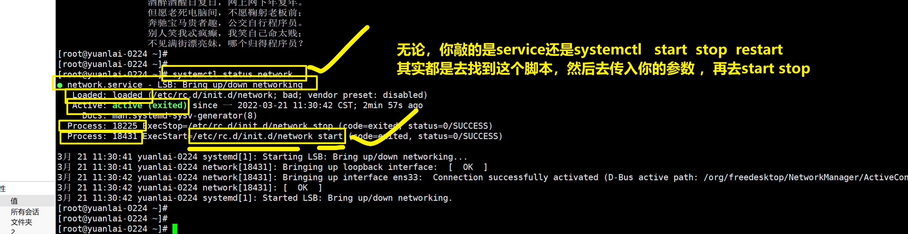
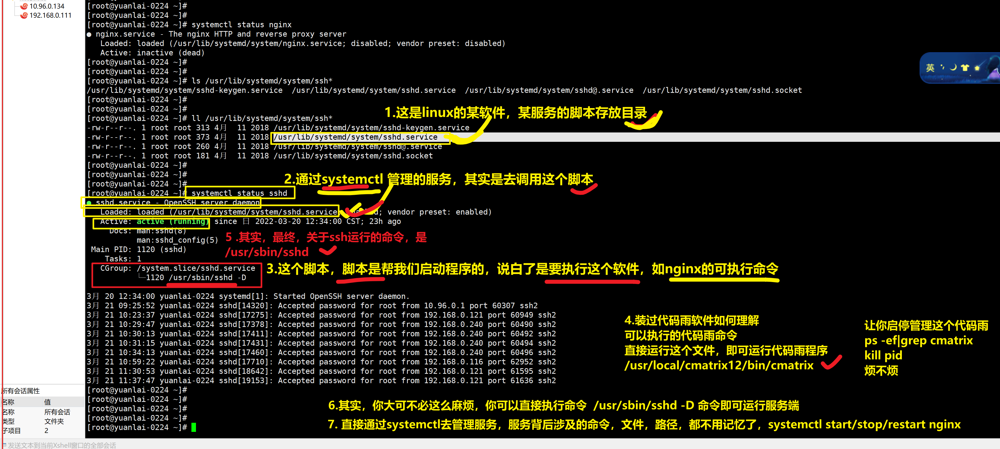
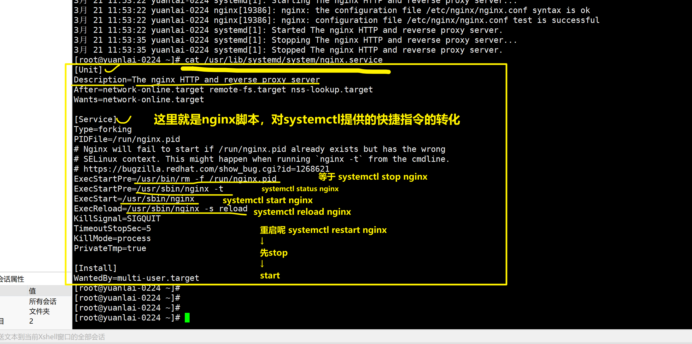

```### 此资源由 58学课资源站 收集整理 ###
	想要获取完整课件资料 请访问：58xueke.com
	百万资源 畅享学习

```
# 今日笔记，服务管理


# 回顾systemctl

- 你的机器，会有默认的软件（服务），network管理网络的软件，sshd提供远程连接的软件

- 对这些服务，进行管理
  - 启动
  - 停止
  - 重启
  - 重新加载
  - 开机自启（持久化）
  - 禁止开机自启
  - 查询是否持久化（是否开机自启）

```
centos7，用这个命令，同时对服务进行启停管理，以及开机自启
systemctl start/stop/restart/reload/enable/disable/is-enabled   服务的名


这个命令属于对centos6提供的2个命令，做了一个整合
service 
	这个命令，linux的命令，大多数都是去机器上找到某个文件，然后读取文件配置，加载功能
	service旧的命令，是默认去 /etc/init.d/目录下寻找（服务管理脚本文件）
	然后根据你的指令 service start/stop  network （/etc/init.d/network）
	
	service 服务名  启停指令
		然后会去读取 /etc/init.d目录下的脚本
	我们在用centos6的时候，自己安装了某软件，比如nginx网站，但是没有方便的启停管理脚本
	自己写nginx启停脚本，然后放到/etc/init.d/nginx
	然后就可以调用
		serivce nginx start 

	
chkconfig
两个命令整合了


现在，都用这个指令了更方便，强大

# 这个命令是去  
systemctl  启停指令  服务名  

查看网络服务状态
systemctl status network

```


# 关于systemctl命令其实是找到脚本



---

service启动网络


等于脚本去启动


也等于systemctl start network

```
刚才关注到 service是去读取 /etc/init.d/目录下的脚本

centos7中的脚本目录不一样
系统默认的所有服务，管理脚本的存放目录，以及你自己安装了某软件，也可以放入到这个目录下，就可以通过systemctl start/stop 去管理了


比如，我安装nginx软件，查看启动命令，以及脚本在哪
yum install nginx -y
[root@yuanlai-0224 ~]# yum install nginx -y
已加载插件：fastestmirror, langpacks
Loading mirror speeds from cached hostfile
 * base: mirrors.aliyun.com
 * extras: mirrors.aliyun.com
 * updates: mirrors.aliyun.com
软件包 1:nginx-1.20.1-9.el7.x86_64 已安装并且是最新版本
无须任何处理


记住一个概念，通过yum安装的程序，会自动生成nginx管理脚本，自动的在systemctl管理脚本目录下，请看
# nginx这个服务名，只是一个缩写，完整的服务名是 nginx.service
    # nginx的运行脚本在/usr/lib/systemd/system/nginx.service
# systemctl统一管理脚本目录在 /usr/lib/systemd/system/
# 比如sshd这个服务，它的脚本，就可以在这目录搜索到
[root@yuanlai-0224 ~]# ll /usr/lib/systemd/system/ssh*
-rw-r--r--. 1 root root 313 4月  11 2018 /usr/lib/systemd/system/sshd-keygen.service
-rw-r--r--. 1 root root 373 4月  11 2018 /usr/lib/systemd/system/sshd.service
-rw-r--r--. 1 root root 260 4月  11 2018 /usr/lib/systemd/system/sshd@.service
-rw-r--r--. 1 root root 181 4月  11 2018 /usr/lib/systemd/system/sshd.socket


[root@yuanlai-0224 ~]# systemctl status nginx
● nginx.service - The nginx HTTP and reverse proxy server
   Loaded: loaded (/usr/lib/systemd/system/nginx.service; disabled; vendor preset: disabled)
   Active: inactive (dead)
[root@yuanlai-0224 ~]# 


```

## 理解systemctl管理脚本的流程





## 实践上述所说

以nginx为例，可以有2个运行方式

- 直接运行指令

```
1.启动nginx，以命令形式运行
[root@yuanlai-0224 ~]# /usr/sbin/nginx 

2.关闭防火墙，查看nginx是否可以看到
已确认，可以看到页面

3. 关闭nginx程序
ps -ef |grep nginx
kill nginx的进程id（包工头进程id）

4.下次在运行nginx，还要吧这个流程走一遍，并且还要重新的去找进程id，判断干掉某个id号


```

以服务管理模式运行 systemctl

```
2条命令完事
systemctl start nginx.serivce
systemctl stop  nginx.service
systemctl status nginx.service
要知道，这个nginx管理脚本在哪，本质上要理解，还是去执行/usr/sbin/nginx


查看nginx的管理脚本，以后我们自己安装软件，也都参照这个写法即可
cat /usr/lib/systemd/system/nginx.service

```




# ntp时间服务部署

- 先理解时间对服务器的重要性
- 全世界的服务器，时间统一标准，可以以这个为准，*cn.ntp.org.cn*
- 学习linux的各种命令，对时间来修改，以及同步

## timedaectl

可以修改linux的日期，时间

```
centos7，cetnso6
	systemctl
		service
		chkconfig
	timedatectl
		date 改时间日期（软件时间，你的系统运行了，程序计算的时间）
		hwclock  改硬件时间（计算的主板上，有一个BISO系统，以及纽扣电池，提供电量）
		

centos6时代，修改系统的时区、时间，需要用到
修改时间、日期、date命令
centos6的修改时区的操作，时区就以亚洲上海为准了
修改时区，cp /usr/share/zoneinfo/Asia/Shanghai /etc/localtime

# 查看系统中有哪些时区文件
ls /usr/share/zoneinfo/
ll /usr/share/zoneinfo/Asia/Shanghai


修改硬件时间、hwclock命令


```

## 查看当前时间

```
[root@yuanlai-0224 ~]# timedatectl 
      Local time: 一 2022-03-21 12:21:42 CST（中国时区）
  Universal time: 一 2022-03-21 04:21:42 UTC
        RTC time: 一 2022-03-21 04:21:38
       Time zone: Asia/Shanghai (CST, +0800)
     NTP enabled: no
NTP synchronized: no
 RTC in local TZ: no
      DST active: n/a
[root@yuanlai-0224 ~]# 
[root@yuanlai-0224 ~]# 

[root@yuanlai-0224 ~]# timedatectl status
      Local time: 一 2022-03-21 12:21:46 CST
  Universal time: 一 2022-03-21 04:21:46 UTC
        RTC time: 一 2022-03-21 04:21:42
       Time zone: Asia/Shanghai (CST, +0800)
     NTP enabled: no
NTP synchronized: no
 RTC in local TZ: no
      DST active: n/a


```


## 修改时间、修改时区

```
[root@yuanlai-0224 ~]# timedatectl --help
timedatectl [OPTIONS...] COMMAND ...

Query or change system time and date settings.

  -h --help                Show this help message
     --version             Show package version
     --no-pager            Do not pipe output into a pager
     --no-ask-password     Do not prompt for password
  -H --host=[USER@]HOST    Operate on remote host
  -M --machine=CONTAINER   Operate on local container
     --adjust-system-clock Adjust system clock when changing local RTC mode

指令
Commands:
  status                   Show current time settings 查看当前状态
  set-time TIME            Set system time  设置当前的时间 
  set-timezone ZONE        Set system time zone 设置当前的时区
  list-timezones           Show known time zones 查看系统支持哪些时区
  
  
  
  set-local-rtc BOOL       Control whether RTC is in local time
  set-ntp BOOL             Control whether NTP is enabled


[root@yuanlai-0224 ~]# timedatectl set-time '10:00'

[root@yuanlai-0224 ~]# timedatectl set-time '2018-11-8 10:00'

查看系统支持多少个时区
[root@yuanlai-0224 ~]# timedatectl list-timezones | wc -l
425

找出关于上海的时区，具体名字
[root@yuanlai-0224 ~]# timedatectl list-timezones | grep  -i   'shanghai'
Asia/Shanghai

[root@yuanlai-0224 ~]# timedatectl set-timezone Asia/Shanghai
[root@yuanlai-0224 ~]# 
[root@yuanlai-0224 ~]# 
[root@yuanlai-0224 ~]# timedatectl status
      Local time: 四 2018-11-08 10:02:39 CST
  Universal time: 四 2018-11-08 02:02:39 UTC
        RTC time: 四 2018-11-08 02:02:40
       Time zone: Asia/Shanghai (CST, +0800)
     NTP enabled: no
NTP synchronized: no
 RTC in local TZ: no
      DST active: n/a
[root@yuanlai-0224 ~]# 


```

## ntp时间同步

- 强制性更新整个系统的时间，ntpdate，不友好的强制同步时间
- 搭建ntp服务，自动的，友好的更新，校准系统时间

## 其强制性ntpdate命令

```
1.找到时间服务器地址，强制更新即可
[root@yuanlai-0224 ~]# ntpdate -u ntp.aliyun.com


[root@yuanlai-0224 ~]# ntpdate -u ntp.aliyun.com
21 Mar 12:31:11 ntpdate[19892]: step time server 203.107.6.88 offset 106194278.720730 sec


[root@yuanlai-0224 ~]# timedatectl status
      Local time: 一 2022-03-21 12:31:32 CST
  Universal time: 一 2022-03-21 04:31:32 UTC
        RTC time: 四 2018-11-08 02:06:54
       Time zone: Asia/Shanghai (CST, +0800)
     NTP enabled: no
NTP synchronized: no
 RTC in local TZ: no
      DST active: n/a


```


## 搭建ntpd服务

所有linux的软件，用法都一样

- 安装
- 改配置
- 启动
- 使用
- 以后，就是继续改配置，重新加载，重启
- 继续使用

```
1.安装ntp软件
yum install  ntp -y

2.查看ntp软件信息
[root@yuanlai-0224 ~]# ls /usr/lib/systemd/system/ |grep ntp
ntpdate.service
ntpd.service


3.找到ntp软件的配置文件
[root@yuanlai-0224 ~]# rpm -ql ntp |grep conf
/etc/ntp.conf
/etc/sysconfig/ntpd
/usr/share/man/man5/ntp.conf.5.gz


4.修改ntp配置文件，
vim /etc/ntp.conf， 做如下修改

driftfile /var/lib/ntp/drift


# 添加ntp的运行日志
logfile /var/log/my_ntp.log

# 记录程序的运行进程号的，可以用于写脚本，读取这个文件，就找到了程序的进程id
pidfile /var/run/ntpd.pid


# Permit time synchronization with our time source, but do not
# permit the source to query or modify the service on this system.
restrict default nomodify notrap nopeer noquery

# Permit all access over the loopback interface.  This could
# be tightened as well, but to do so would effect some of
# the administrative functions.
restrict 127.0.0.1
restrict ::1

# Hosts on local network are less restricted.
#restrict 192.168.1.0 mask 255.255.255.0 nomodify notrap

# Use public servers from the pool.ntp.org project.
# Please consider joining the pool (http://www.pool.ntp.org/join.html).


server ntp.aliyun.com iburst prefer
server cn.pool.ntp.org iburst 


5.修改机器的时间为错误时间
[root@yuanlai-0224 ~]# timedatectl set-time '2018-11-8 10:00'
[root@yuanlai-0224 ~]# 
[root@yuanlai-0224 ~]# 
[root@yuanlai-0224 ~]# 
[root@yuanlai-0224 ~]# timedatectl 
      Local time: 四 2018-11-08 10:00:04 CST
  Universal time: 四 2018-11-08 02:00:04 UTC
        RTC time: 四 2018-11-08 02:00:04
       Time zone: Asia/Shanghai (CST, +0800)
     NTP enabled: no
NTP synchronized: no
 RTC in local TZ: no
      DST active: n/a


6.启动ntpd服务，等待时间是否同步
关于ntpd的服务脚本文件/usr/lib/systemd/system/ntpd.service 

[root@yuanlai-0224 ~]# systemctl start  ntpd
[root@yuanlai-0224 ~]# 
[root@yuanlai-0224 ~]# 
[root@yuanlai-0224 ~]# systemctl status ntpd
● ntpd.service - Network Time Service
   Loaded: loaded (/usr/lib/systemd/system/ntpd.service; disabled; vendor preset: disabled)
   Active: active (running) since 四 2018-11-08 10:01:43 CST; 1s ago
  Process: 20653 ExecStart=/usr/sbin/ntpd -u ntp:ntp $OPTIONS (code=exited, status=0/SUCCESS)
 Main PID: 20654 (ntpd)
    Tasks: 1
   CGroup: /system.slice/ntpd.service
           └─20654 /usr/sbin/ntpd -u ntp:ntp -g

11月 08 10:01:43 yuanlai-0224 systemd[1]: Starting Network Time Service...
11月 08 10:01:43 yuanlai-0224 systemd[1]: Started Network Time Service.
11月 08 10:01:43 yuanlai-0224 ntpd[20654]: proto: precision = 0.026 usec
11月 08 10:01:43 yuanlai-0224 ntpd[20654]: 0.0.0.0 c01d 0d kern kernel time sync enabled
[root@yuanlai-0224 ~]# 
[root@yuanlai-0224 ~]# 
[root@yuanlai-0224 ~]# 


7.查看ntp是否和上游服务器同步
[root@yuanlai-0224 ~]# ntpstat
unsynchronised
   polling server every 64 s


8.查看时间同步的状态
uanlai-0224 ~]# ntpq -p
     remote           refid      st t when poll reach   delay   offset  jitter
==============================================================================
 120.25.115.20   .STEP.          16 u    -   64    0    0.000    0.000   0.000
 203.107.6.88    10.137.38.86     2 u   28   64    1   26.495   -5.532  20.580
 a.chl.la        131.188.3.222    2 u   25   64    1  275.482   52.054  13.988
[root@yuanlai-0224 ~]# 


9. 这台机器，就是一个时间服务器了，可以作为上游机器使用

```

## date命令和hwclock命令

可以直接用timedatectl替代了

timedatectl直接修改硬件+软件时间了。

```
让软件时间和硬件时间同步

hwclock 可以将硬件和软件时间做同步
 -s, --hctosys        从硬件时钟设置系统时间
 -w, --systohc        从当前系统时间设置硬件时钟


```


