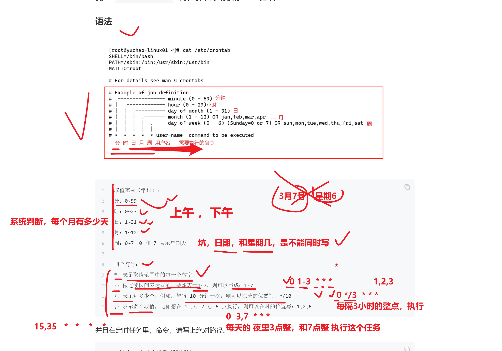

```### 此资源由 58学课资源站 收集整理 ###
	想要获取完整课件资料 请访问：58xueke.com
	百万资源 畅享学习

```
# 基础服务管理

# 防火墙是什么


```
查找防火墙服务名的技巧
[root@yuchao-linux01 ~]# systemctl list-units  | grep fire
firewalld.service                                                                                                loaded active running   firewalld - dynamic firewall daemon

# 这个命令，其实是找到一个服务脚本文件
systemctl status firewalld.service

# 这个firewalld.service文件在哪？
[root@yuchao-linux01 ~]# find  / -type f  -name 'firewalld.service'


/usr/lib/systemd/system/firewalld.service


这个脚本，其实就是执行了运行防火墙命令的一个脚本文件
直接看这个脚本的，第11 12 13行

[root@yuchao-linux01 ~]# cat -n  /usr/lib/systemd/system/firewalld.service
     1	[Unit]
     2	Description=firewalld - dynamic firewall daemon
     3	Before=network-pre.target
     4	Wants=network-pre.target
     5	After=dbus.service
     6	After=polkit.service
     7	Conflicts=iptables.service ip6tables.service ebtables.service ipset.service
     8	Documentation=man:firewalld(1)
     9	
    10	[Service]
    11	EnvironmentFile=-/etc/sysconfig/firewalld
    12	ExecStart=/usr/sbin/firewalld --nofork --nopid $FIREWALLD_ARGS
    13	ExecReload=/bin/kill -HUP $MAINPID
    14	# supress to log debug and error output also to /var/log/messages
    15	StandardOutput=null
    16	StandardError=null
    17	Type=dbus
    18	BusName=org.fedoraproject.FirewallD1
    19	KillMode=mixed
    20	
    
    
    21	[Install]
    22	WantedBy=multi-user.target
    23	Alias=dbus-org.fedoraproject.FirewallD1.service


```

## 解释服务管理脚本的作用

其实就是帮你执行了软件提供的二进制命令

- firewalld如此  /usr/sbin/fireawlld
- nginx也如此  /usr/sbin/nginx
- 其他软件也都是这样  
- 


## firewalld提供的区域的概念


## 使用防火墙命令，查看系统提供了哪些模板

```
1.列出所有的区域模板
列出区域模板，以及具体的信息
[root@yuchao-linux01 ~]# firewall-cmd --list-all-zones

列出所有的区域的名字
[root@yuchao-linux01 ~]# firewall-cmd --get-zones


block dmz drop external home internal public trusted work


2.列出当前使用的区域是
[root@yuchao-linux01 ~]# firewall-cmd --get-default-zone 
public


3.查看当前的public区域，以及其详细信息
[root@yuchao-linux01 ~]# # 列出当前使用的区域，以及详细信息
[root@yuchao-linux01 ~]# 
[root@yuchao-linux01 ~]# firewall-cmd --list-all
public (active)
  target: default
  icmp-block-inversion: no
  interfaces: ens33
  sources: 
  services: ssh dhcpv6-client ntp
  ports: 80/tcp
  protocols: 
  masquerade: no
  forward-ports: 
  source-ports: 
  icmp-blocks: 
  rich rules: 


4.先运行一个80端口的服务
[root@yuchao-linux01 ~]# python -m SimpleHTTPServer 80


5.给当前的防火墙区域，添加一个策略，允许80端口通过
[root@yuchao-linux01 ~]# firewall-cmd --add-port=80/tcp
success


6.再添加一个8000端口的规则，我们接触的绝大多数，都是端口号/tcp 这个即可.
[root@yuchao-linux01 ~]# firewall-cmd --add-port=8000/tcp
success

7.删除，添加的端口规则
[root@yuchao-linux01 ~]# firewall-cmd --remove-port=80/tcp
success
[root@yuchao-linux01 ~]# firewall-cmd --list-all
public (active)
  target: default
  icmp-block-inversion: no
  interfaces: ens33
  sources: 
  services: ssh dhcpv6-client
  ports: 
  protocols: 
  masquerade: no
  forward-ports: 
  source-ports: 
  icmp-blocks: 
  rich rules: 


8. 针对服务名添加，比如ntp服务
[root@yuchao-linux01 ~]# firewall-cmd --add-service=ntp

9. 查看当前public区域，使用了哪些规则
[root@yuchao-linux01 ~]# firewall-cmd --list-all

10. firewalld，作用其实是添加iptables的规则

查看系统上所有iptables的命令

iptables -L

tcp 是一个安全可靠的连接，需要双向确认，客户端，和服务端，都要确认对方以及连接上了


udp 是一个不可靠的额连接协议，客户端可以随便给服务端发，不需要对方确认


比如一个很差的网络环境下，网页无法访问，无法做dns解析（网络服务，网站服务，用的都是tcp协议）
但是qq可以收发消息（qq用的是udp协议，以及ntp用的也是udp协议）


，查看到firewalld命令，添加的防火墙规则如下
[root@yuchao-linux01 ~]# iptables -L |grep ntp
ACCEPT     udp  --  anywhere             anywhere             udp dpt:ntp ctstate NEW


```

## 为什么要添加ntp服务通过


## 给ntpd的服务器，打开防火墙


systemctl stop firewalld

systemctl disable firewalld 


基础服务的概念

firewald命令，可以创建出iptables规则


1.默认导致客户端请求过不来，无法进行时间同步

2. 添加ntp策略后，允许ntp相关的请求通过，可以正常时间同步

```
保留问题

firewalld添加nginx服务，以及ntp服务，允许


```


```
1.准备好ntp时间服务器

2.关闭ntp服务器的防火墙策略，禁止ntp请求通过


3. 再打开ntp机器的防火墙策略，查看客户端，是否可以和他进行时间同步

[root@yuchao-linux01 ~]# firewall-cmd --add-service=ntp
success
[root@yuchao-linux01 ~]# 
[root@yuchao-linux01 ~]# 
[root@yuchao-linux01 ~]# iptables -L |grep ntp
ACCEPT     udp  --  anywhere             anywhere             udp dpt:ntp ctstate NEW
[root@yuchao-linux01 ~]# 

```

## 关于很多程序，配置不会立即生效，需要reload重新读取配置文件方可生效

```
1. 永久性添加 8000/tcp的策略
[root@yuchao-linux01 ~]# firewall-cmd  --permanent --add-port=8000/tcp


2.需要重新加载firewalld服务
[root@yuchao-linux01 ~]# firewall-cmd --reload
success


3.重新加载后，规则自动生成了，生效了
[root@yuchao-linux01 ~]# firewall-cmd --list-all
public (active)
  target: default
  icmp-block-inversion: no
  interfaces: ens33
  sources: 
  services: ssh dhcpv6-client ntp
  ports: 80/tcp 8000/tcp
  protocols: 
  masquerade: no
  forward-ports: 
  source-ports: 
  icmp-blocks: 
  rich rules: 


```

# 遗留问题

1.关于firewalld如何添加nginx网站服务

关于防火墙策略的概念，其实就围绕这个几个点

- 来源ip 客户端
- 目标ip   服务器ip
- 目标端口  服务器上哪个端口的程序  
  - 可以改为服务的名字
  - sshd 服务  22
  - mysql服务  3306
  - 常见网站服务 httpd,nginx,默认端口是80


```
1.查询支持的所有服务名字有哪些（nginx，httpd，统一被他制作为了 http服务，放行80端口）

firewall-cmd --get-services


2. 查询当前区域，所用的服务名有哪些
firewall-cmd --list-services


3. 添加http服务，放行80端口即可
firewall-cmd --add-service=http

4.移除该服务，禁用80端口的请求
firewall-cmd --remove-service=http

5.建议，最好还是直接针对端口号，协议号，添加规则，
firewalld真不好用，不可用

iptables 支持很多复杂的参数，针对协议，来源端口，目标端口，等等
公有云的安全组（阿里云提供的硬件防火墙），也是基于iptables这样的规则添加的


```

2.firewalld允许ntp请求（注意ntpd有同步等待时间）

```
[root@yuchao-linux01 ~]# firewall-cmd --get-services |grep ntp

移除ntp的防火墙则
[root@yuchao-linux01 ~]# firewall-cmd --remove-service=ntp
success
[root@yuchao-linux01 ~]# 
[root@yuchao-linux01 ~]# 

允许客户端，来这台机器，进行ntp时间同步
[root@yuchao-linux01 ~]# firewall-cmd --add-service=ntp
success


```


# 学习定时任务，crontab

```
语法

crontab 
-l 列出当前用户有哪些计划任务
-e  编辑当前用户的计划任务
-r 删除当前用户的计划任务


```


## 定时任务语法学习

```
1.先看系统默认的定时任务配置文件，语法长什么样

```

配置文件语法解释，以及crontab涉及的坑


基本的语法练习



## 定时任务编写流程

```
1. crontab -e 编辑定时任务

[root@yuchao-linux01 ~]# crontab -e
crontab: installing new crontab


2. 写入正确的语法  注意用命令绝对路径

*  *   *  *  *  /usr/bin/echo  'hello,i am your superman' >> /tmp/man.txt


3. 查看定时任务
[root@yuchao-linux01 ~]# crontab -l
*  *   *  *  *  /usr/bin/echo  'hello,i am your superman' >> /tmp/man.txt
[root@yuchao-linux01 ~]# 


4.验证文件是否存在
[root@yuchao-linux01 ~]# tail -f /tmp/man.txt 
hello,i am your superman

5.定时任务写入后，会自动记录到一个文件中，文件路径在如下路径，以用户名区分，不同的定时任务

[root@yuchao-linux01 ~]# ls /var/spool/cron/
jerry01  root
[root@yuchao-linux01 ~]# cat /var/spool/cron/jerry01 
* * * * * /usr/bin/echo 'i am jack' >> /tmp/jack.txt


```

## 学定时任务的最好办法，就是做题

```
学习定时任务，最简单的，就是直接通过案例，掌握其语法
*  *   *   *   * 
分 时   日  月  周  命令的绝对路径

从左 向右，依次去写，不要跳级

问题1：每月1、10、22 日的4:45 重启network 服务

45   4   1,10,22   *  *  /usr/bin/systemctl restart network


问题2：每周六、周日的下午1:10  重启network 服务

10  13  *  *  6,7   /usr/bin/systemctl restart network


问题3：每天18:00 至23:00 之间每隔30 分钟重启network 服务

*/30   18-23    *   *   *   /usr/bin/systemctl restart network


问题4：每隔两天的上午8点到11点的第3和第15分钟执行一次重启

*  *   *   *   * 
分 时   日  月  周  命令的绝对路径

3,15  8-11    */2  *  *  


问题5 ：每天凌晨整点重启nginx服务。


*  *   *   *   * 
分 时   日  月  周  命令的绝对路径

0  0   *   *  *  /usr/bin/systemctl  restart nginx


问题6：每周4的凌晨2点15分执行命令

15  2  *  *  4  


问题7：工作日的工作时间内的每小时整点执行脚本。
工作日  1-5
工时   9-18


*  *   *   *   * 
分 时   日  月  周  命令的绝对路径


0  9-18 *  *  1-5


如果定时任务的时间，没法整除，定时任务就没有意义了，得通过其他手段，自主控制定时任务频率。

crontab提供最小分钟级别的任务，想完成秒级别的任务，得通过编程语言自己写。


问题10：每1分钟向文件里写入一句话"超哥666"，且实时监测文件内容变化。

* * * * * /usr/bin/echo "好快乐啊" >> /tmp/t1.txt


问题11：每天凌晨2点30，执行ntpdate命令同步ntp.aliyun.com，且不输出任何信息，把命令结果，重定向到黑洞文件 
/dev/null

备注：定时任务的命令执行，会产生日志

30   2 *  *  *  /usr/sbin/ntpdate -u ntp.aliyun.com  &> /dev/null 


```

## 禁止哪些用户创建定时任务

该文件在

```
/etc/cron.deny 黑名单文件 （将系统中，所有uid大于1000的用户，全部写入黑名单）


/etc/cron.allow 白名单 ，优先级高于黑名单


```

定时任务，默认存放的路径

```
[root@yuchao-linux01 ~]# ls /var/spool/cron/
jerry01  root

```

定时任务，服务端的运行日志，可以用于给运维，进行故障排查

```
/var/log/cron
```

最后，定时任务，crontab会在系统中，生成大量的邮件日志，会占用磁盘，因此我们都会关闭邮件服务即可

```
[root@yuchao-linux01 ~]# find / -type f  -name 'post*.service'
/usr/lib/systemd/system/postfix.service


systemctl服务管理命令
[root@yuchao-linux01 ~]# systemctl list-units |grep post
postfix.service                                                                                                  loaded active running   Postfix Mail Transport Agent


systemctl status postfix

systemctl stop postfix

禁止开机自启
systemctl disable postfix
```


