```### 此资源由 58学课资源站 收集整理 ###
	想要获取完整课件资料 请访问：58xueke.com
	百万资源 畅享学习

```
# linux资源管理篇

## 昨日内容回顾

```
1.先看状态，再去启动
systemctl status firewalld
systemctl restart firewalld
systemctl list-unit-files |grep firewalld
 
 
 1.先理解服务的意思，服务，就是你安装的软件名字
 2.服务就是一个软件程序，会提供可用的命令，去操控这个软件
 3. firewalld服务，命令就是firewall-cmd
 
 你最近学了那些服务？
 crond.service（crontab）
 ntpd.service (ntpdate)
 firewalld.service(firewall-cmd,iptables)
 httpd(网站服务，阿帕奇软件提供的服务，/usr/sbin/http)
 nginx(网站服务，nginx提供的软件，/usr/sbin/nginx)
 sshd（提供远程连接的方服务，ssh连接命令）
 
 
 
 

 
 单独安装的一个命令，工具，一个小的软件（没有提供服务去帮你管理这个程序）
 仅仅提供了一个二进制命令，如代码雨程序  /usr/local/cmatrix/
 
 
 .查看当前（默认的区域）详细信息
# 写完整的话，是
firewall-cmd --zone=public  --list-all


注意，你要不说明，区域的话，系统默认zone可能以及被改了，你的命令都是错的

firewall-cmd  --zone=public   --add-service=http


还有一种，非立即生效，但是是写入配置文件，永久生效的


9.修改
添加规则，永久生效，但是没有立即生效
firewall-cmd --permanent --add-service=http

firewall-cmd --reload    # 或者 systemctl restart firewald


15.
关闭
systemctl stop firewalld


清空规则
firewall-cmd 是centos7提供的对防火墙策略的管理命令，最终还是生成了iptables规则
↓
查看系统上所有的规则 iptables -L
↓
清空防火墙规则  iptables -F
↓
停止防火墙服务
systemctl stop firewalld
↓
禁止开机自启
systemctl disable firewalld


# 定时任务的作用
在什么时间，做什么事


 
```

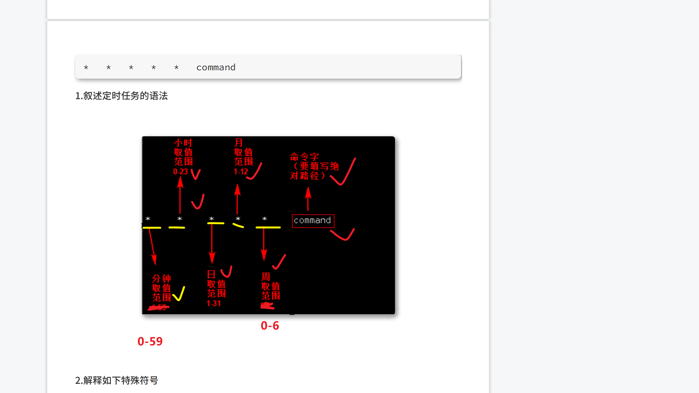

---


```
定时任务
0和7一个作用，都是星期日
```

```

保留任务

每隔2个⽉的周六，夜⾥2点30 去⻅⽹友


```

服务管理是什么概念

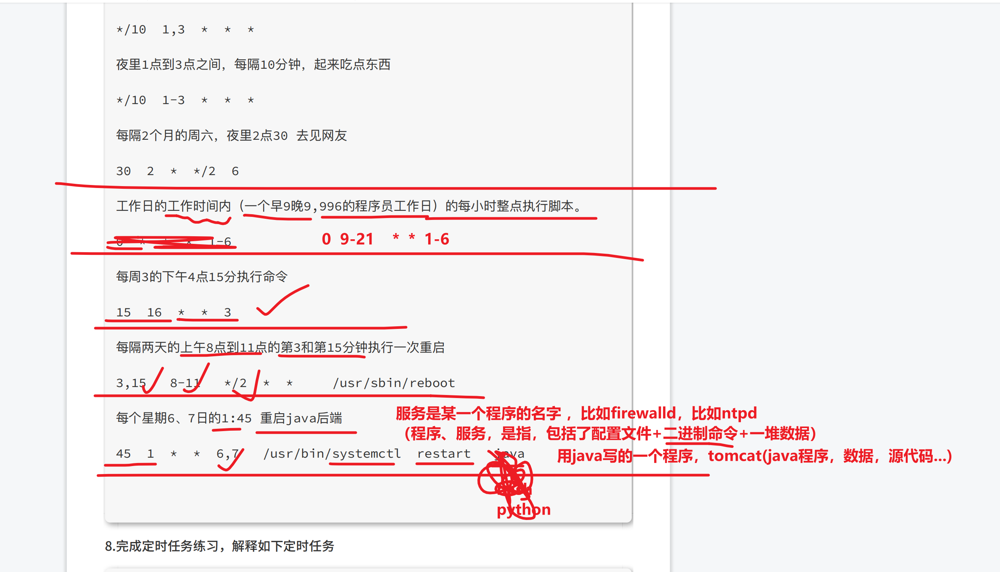


```
30   8-12/2 * * *  /usr/bin/echo '上午的保留问题' >> /tmp/t1.txt

8:30

10:30

12:30

2:30

4:30

保留问题，12:30是否执行（预测，不执行的）


```

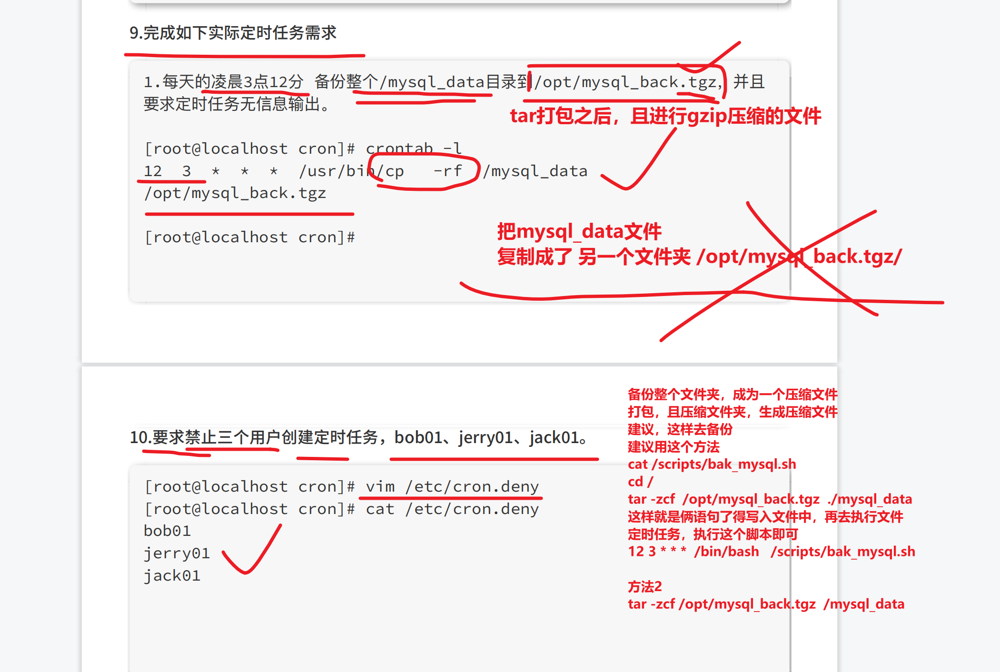

## 关于定时任务的黑白名单坑

```
1. 你想禁止哪些用户创建定时任务
写入 /etc/cron.deny黑名单文件，优先级较低，名字写入这里头，该用户就被禁止了
其他用户默认是全部允许，执行定时任务的


2. 你还可以使用白名单文件， /etc/cron.allow
但是，这个文件，优先级最高，只要这个文件中，没有的名字，都无法创建定时任务！
因此系统默认没有这个文件

3. 看情况用，默认linux是没有白名单文件的。


```


# 今日资源管理

服务器有哪些资源（可用硬件资源）可以让你去管理，从硬件角度，结合软件去考虑

- 磁盘资源（可以存储更多的电影，更多文档）
  - 磁盘容量空间给你用
  - 磁盘的读写性能
    - （比较慢，但是容量大的，机械硬盘，比较便宜，实惠）
    - 速度极快，但是容量较小，价格昂贵的，固态硬盘
- 内存资源（可以让你同时运行更多的程序，比如开50个QQ） 内存较小的，只能运行8个QQ
  - 计算机程序，都会加载到内存中
    - cpu再去内存中取数据
  - 内存容量
    - 总大小
    - 可用剩余大小
- cpu（可以让你同时运行更多的，能够同时处理这个50个QQ）
  - cpu计算资源
    - 你所有的程序，都是cpu去调度，去计算运行的
- 网络资源
  - 网络数据的，吞吐量
    - 吞，接收到多少的数据
    - 吐，发出去多少的数据

学习linux命令去管理这些资源

运维就是围着这些资源在工作的。

# 什么是资源管理器


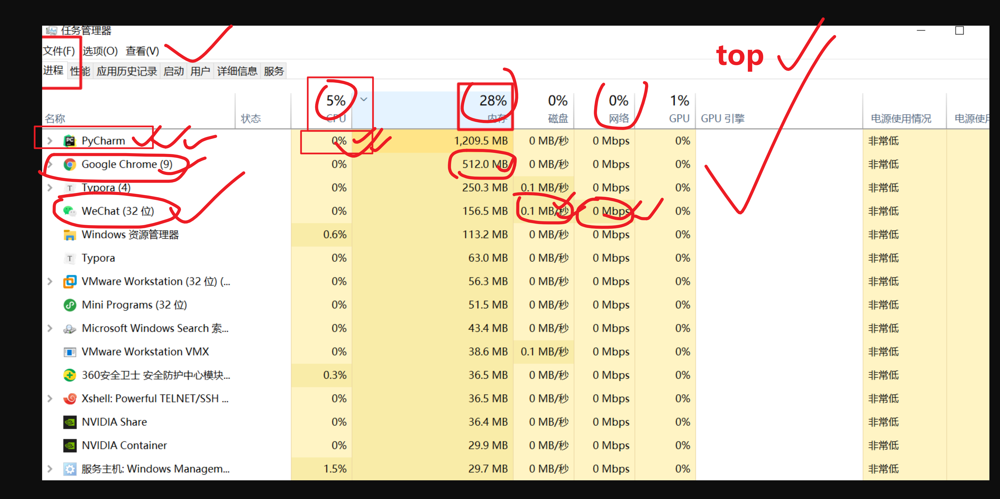


## 什么是进程，线程

进程，是资源单位（包工头）

线程，是工作单位（干活的工人）

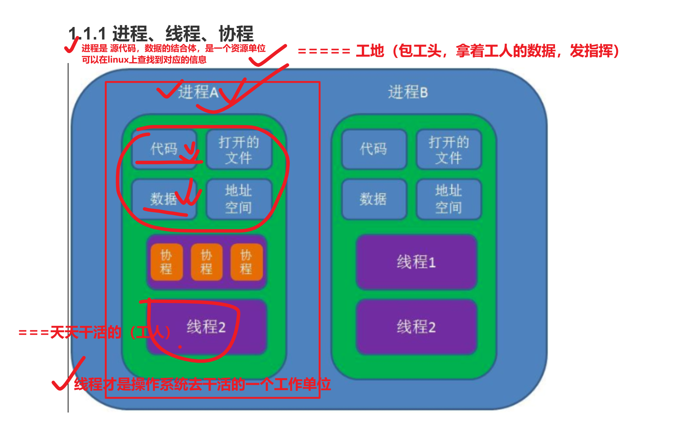


# 什么是父亲进程，儿子进程

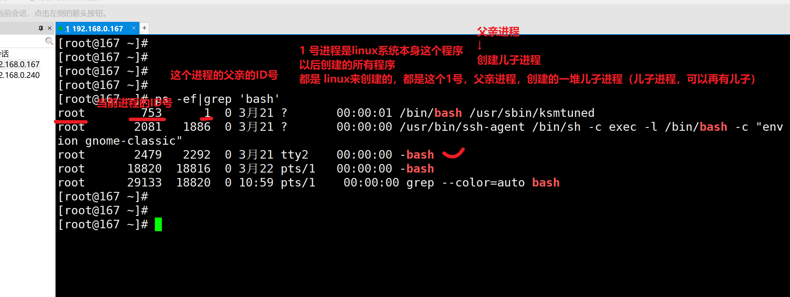


我们登录的xshell终端，是这样的流程

1. 系统上运行了sshd服务
2. 通过ssh客户端命令，都是去连接这个服务，产生的一堆子进程而已。

```
通过命令，查看他们的父子关系
通过他们的进程id号来确认无误


```

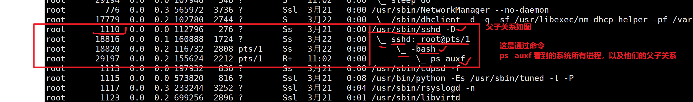

# 理解linux的启动进程关系

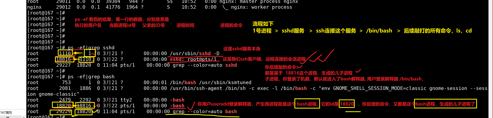

# 关于ps去看进程，区分内核进程和用户进程

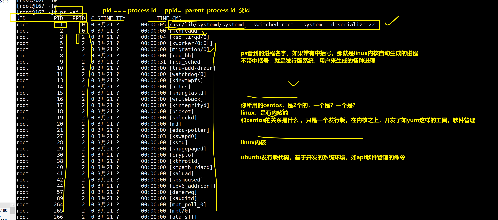


## 理解你是如何登录了linux，以及后续的命令执行，进程关系

```
linux系统启动产生的 1号进程
↓
运行了sshd服务，xxx进程
↓
ssh远程连接，xxx进程
↓
/bin/bash 进程，xxx进程
↓
后续各种命令 ，xxx进程，命令1，命令2，命令3


# 打开3个ssh会话窗口，一个用于查看进程，2个用于 使用vim命令操作，用ps，查看他们的父子关系

```

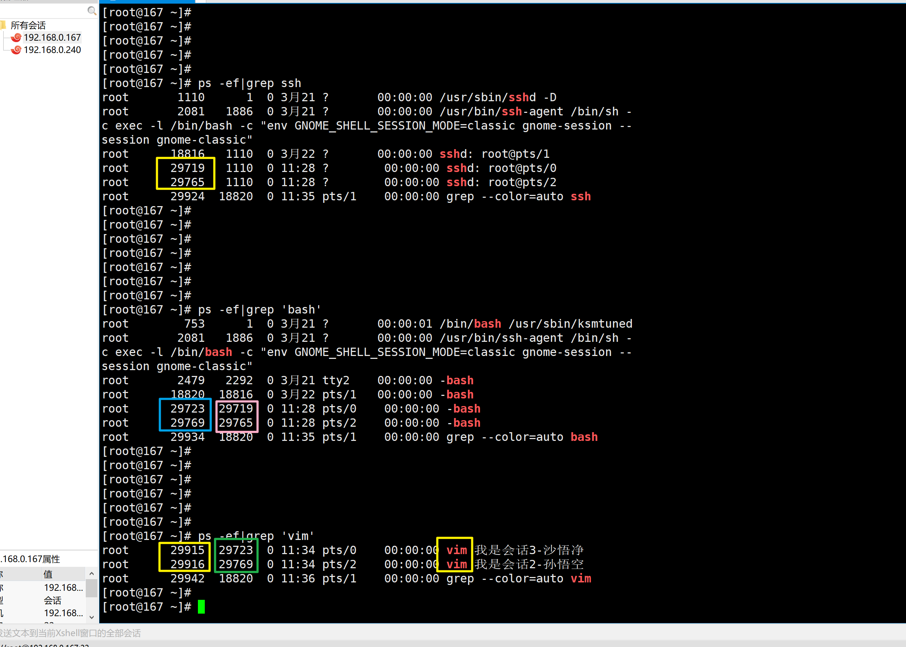


# 孤儿进程，僵尸进程

孤儿进程

- 父进程由于某原因挂了，代码写的不好，导致生成的一堆儿子进程，没有父亲了，成为了孤儿
  - 系统有一个1号进程，等于是一个福利院，去收养这些孤儿进程（1号进程会去接替，管理这些孤儿进程的数据）你就能看到，这些孤儿进程，的ppid，就成了1号进程了。
  - 孤儿进程释放后，释放执行的相关文件，数据，以及释放进程id号（系统id号是有固定的数量）

```
演示孤儿进程，但是需要用代码实现，一般都是代码写的垃圾，才会出现这种情况

# 于超老师教你用python实现，孤儿进程。

# 运行一个python程序，用的是系统自带的python2语法
# 1.touch 创建脚本
# 2.写入代码
# 3. 用python解释器 去读这个程序


[root@yuchao-linux01 ~]# cat guer.py
#coding:utf-8
import os
import sys
import time

pid = os.getpid()
ppid = os.getppid()
print 'im father: ', 'pid: ', pid, 'ppid: ', ppid
son_pid = os.fork()
print('now song_pid is: ',son_pid)
#执行pid=os.fork()则会生成一个子进程
#返回值pid有两种值：
#    如果返回的pid值为0，表示在子进程当中
#    如果返回的pid值>0，表示在父进程当中
if son_pid > 0:
    print 'father going die...'
    # 让老父亲，主动退出，挂掉
    sys.exit(0)

# 保证主线程退出完毕
# 程序延迟了1秒，还在运行中，儿子进程还未挂，成了孤儿
time.sleep(5)

print 'im child: ', os.getpid(),'now my father is: ', os.getppid()
```

## 看到如下进程状态，就是僵尸进程

```
[root@167 ~]# ps -ef|grep 30394
root      30394  30317  0 11:57 pts/1    00:00:00 python jiangshi.py
root      30395  30394  0 11:57 pts/1    00:00:00 [python] <defunct>

还可以用top命令去看，有几个僵尸进程

```


# 管理进程的一堆命令

- ps

- ```
  linux风格的组合参数，一般都是携带短横线
  ps -ef 
  
  
  
  
  
  unix操作系统下，查看进程，用如下不带短横线的参数选项
  ps aux
  
  参数解释
  参数风格，请注意，参数的位置，存在先后关系，位置错误可能导致无法使用。
  
  
  
  # UNIX风格，没有短横线
  a # 显示所有终端、所有用户执行的进程
  u # 以用户显示出进程详细信息
  x # 显示操作系统所有进程信息
  f # 显示进程树形结构
  o # 格式化显示进程信息，指定如pid
  k # 对进程属性排序，如k %mem  ，正序排序   ，k -%mem 逆序
  --sort，再进行排序，如 --sort %mem 根据内存使用率显示
  
  
  linux标准参数用法
  -e # 显示所有进程
  -f # 显示进程详细，pid，udi，进程名
  -p # 指定pid，显示其信息，如 ps -fp 2609
  -C # 指定进程的名字查看，如ps -fC sshd
  -U # 指定用户名，查看用户进程信息 ps -Uf yuchao01
  
  
  ps -ef  
  
  ps -p  10086
  
  
  
  
  
  ```

- 

- top

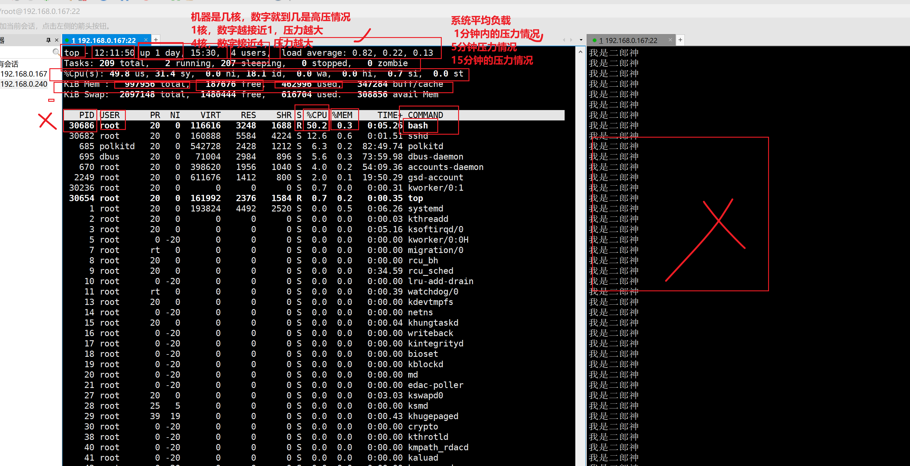


## htop命令

更美观的，一些第三方工具而已

```
yum install htop -y
```


# 总结

- 关于linux的资源管理
  - 进程的难点，孤儿进程，僵尸进程
  - 进程资源查看，ps命令`linux风格参数 -ef`，`unix风格ps aux`
  - linux的统一的，资源管理器
    - top命令
    - htop命令

## 下午补充


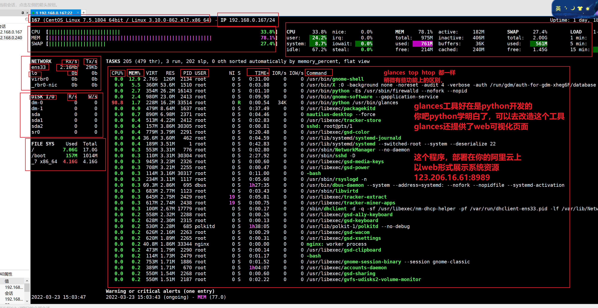


# 今日所有，脑图补充


