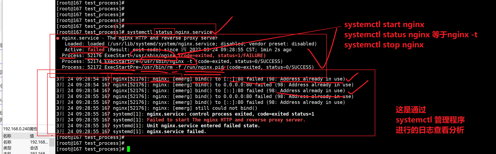
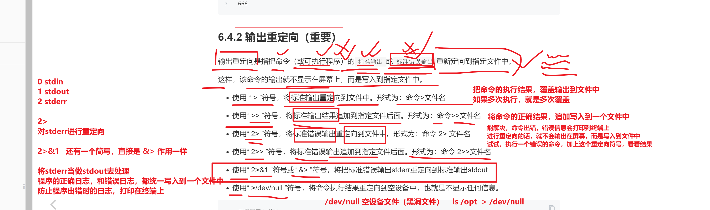
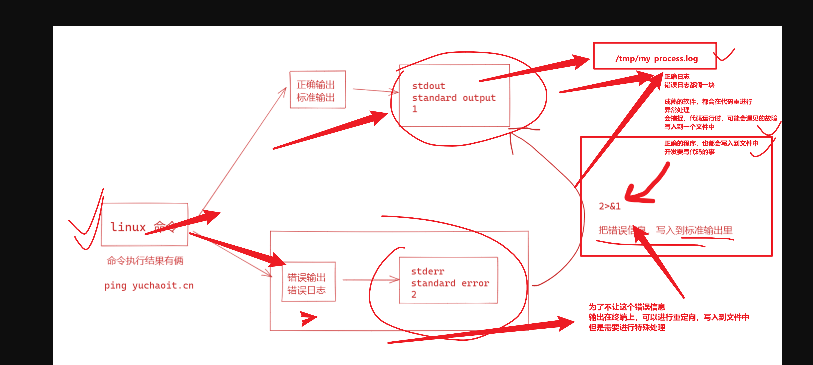
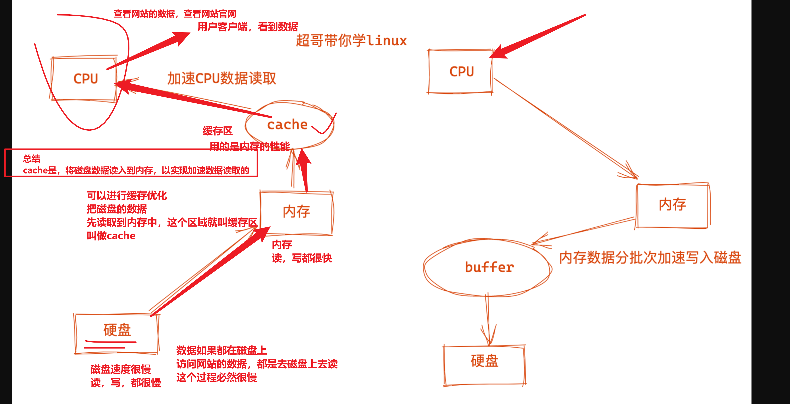
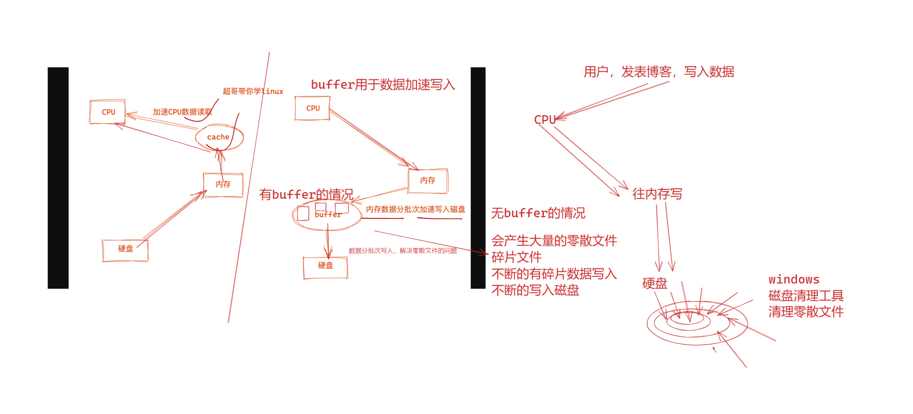
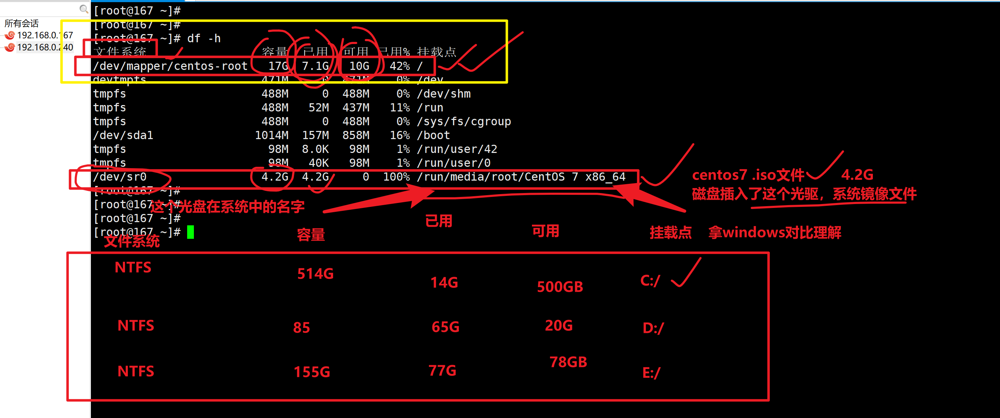
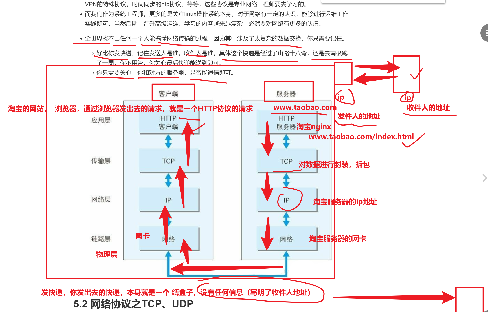

```### 此资源由 58学课资源站 收集整理 ###
	想要获取完整课件资料 请访问：58xueke.com
	百万资源 畅享学习

```
# 今日内容

- 英文单词的认识，需要大家自己逐步锻炼了，以后适当的加在考试题中作为练习
- 关于作业，昨日知识，以后大家就把不会的作业题，发在各自小组，我来课下解决


逢3过游戏，恭喜玩家李文杰，陈亮亮，张少辉，赢得中午分享机会

# linux资源管理篇




# 理解数据流

## 6、理解linux的数据流

执行linux命令时，linux默认为用户进程提供了3种数据流

- stdin
  - 标准输入、0
  - 一般是键盘输入数据
  - 比如cat命令等待用户输入
- stdout
  - 标准输出、1
  - 程序执行结果，输出到终端
- stderr
  - 标准错误输出，代号，2
  - 程序执行结果，输出到终端


# 标准输入重定向

```
[root@167 opt]# cat   <   /etc/passwd   # 输入重定向，原本是来自于终端的键盘输入，改为了，可以是来自于文件的输入

# 比如用在数据库的，数据导入
mysql <  /opt/back.sql 


```


# 详解重定向符号和数据流代号



## 练习数据流

```
练习数据流
[root@167 opt]# 
[root@167 opt]# # stdin  stdout stderr
[root@167 opt]# 
[root@167 opt]# 
[root@167 opt]# 
[root@167 opt]# 
[root@167 opt]# cat  
你好我是米老鼠
你好我是米老鼠
[root@167 opt]# 
[root@167 opt]# 
[root@167 opt]# ls /opt
messages  nohup.out  passwd  t1.log
[root@167 opt]# 
[root@167 opt]# 
[root@167 opt]# lllllllllllllllllllllll  /opt
bash: lllllllllllllllllllllll: 未找到命令...
[root@167 opt]# 


数据流代号，结合重定向
[root@167 opt]# # 数据流代号，结合重定向符号
[root@167 opt]# # stdout，结合 >  >>
[root@167 opt]# 
[root@167 opt]# ls /opt/  > /tmp/opt.log
[root@167 opt]# ls /opt/  > /tmp/opt.log
[root@167 opt]# ls /opt/  > /tmp/opt.log
[root@167 opt]# 
[root@167 opt]# cat -n /tmp/opt.log 
     1	messages
     2	nohup.out
     3	passwd
     4	t1.log
[root@167 opt]# 
[root@167 opt]# ls /opt/  >> /tmp/opt.log
[root@167 opt]# ls /opt/  >> /tmp/opt.log
[root@167 opt]# cat -n /tmp/opt.log 
     1	messages
     2	nohup.out
     3	passwd
     4	t1.log
     5	messages
     6	nohup.out
     7	passwd
     8	t1.log
     9	messages
    10	nohup.out
    11	passwd
    12	t1.log


[root@167 opt]# # stdout进行重定向 ，需要将stderr 改为stdout进行重定向
[root@167 opt]# 
[root@167 opt]# 
[root@167 opt]# ls /oppppppppppppppppppppp   > /tmp/opt.log      2>&1
[root@167 opt]# ls /oppppppppppppppppppppp   > /tmp/opt.log      2>&1
[root@167 opt]# ls /oppppppppppppppppppppp   > /tmp/opt.log      2>&1
[root@167 opt]# 
[root@167 opt]# 
[root@167 opt]# 
[root@167 opt]# 
[root@167 opt]# cat /tmp/opt.log 
ls: 无法访问/oppppppppppppppppppppp: 没有那个文件或目录
[root@167 opt]# ls /oppppppppppppppppppppp   >> /tmp/opt.log      2>&1
[root@167 opt]# ls /oppppppppppppppppppppp   >> /tmp/opt.log      2>&1
[root@167 opt]# ls /oppppppppppppppppppppp   >> /tmp/opt.log      2>&1
[root@167 opt]# 
[root@167 opt]# 
[root@167 opt]# cat /tmp/opt.log 
ls: 无法访问/oppppppppppppppppppppp: 没有那个文件或目录
ls: 无法访问/oppppppppppppppppppppp: 没有那个文件或目录
ls: 无法访问/oppppppppppppppppppppp: 没有那个文件或目录
ls: 无法访问/oppppppppppppppppppppp: 没有那个文件或目录
[root@167 opt]# 
[root@167 opt]# 


[root@167 opt]# 
[root@167 opt]# lsllllllllllllllll  /opt  &>> /tmp/opt.log 
[root@167 opt]# lsllllllllllllllll  /opt  &>> /tmp/opt.log 
[root@167 opt]# lsllllllllllllllll  /opt  &>> /tmp/opt.log 
[root@167 opt]# 
[root@167 opt]# 
[root@167 opt]# 
[root@167 opt]# cat /tmp/opt.log 
bash: lsllllllllllllllll: 未找到命令...
bash: lsllllllllllllllll: 未找到命令...
bash: lsllllllllllllllll: 未找到命令...
bash: lsllllllllllllllll: 未找到命令...


```

对于stderr的处理，建议用`2>&1`，用的人最多.

理解stderr，转为stdout的过程





# linux资源管理


## uptime命令

```
4核，最理想，最大化发挥作用是
4核，每一个核，都在干活中（讲究，高并发编程，说的就是，如何让你的代码，让所有cpu同时起来工作）
4个cpu，你的代码，只让一个cpu在干活


1.最理想化的状态是每个CPU都在运行着进程，充分让cpu工作起来，效率最大化，你得先看看你机器上有几个CPU（几个核，就是有几个cpu可以工作）。

# 发现是4核的
[root@yuchao-linux01 ~]# lscpu |grep -i '^cpu(s)'
CPU(s):                4

# 以及用top命令，按下数字1，查看几核。
top


2. 如何理解uptime看到的负载
分别是1、5、15分钟内的平均负载情况，表示是1~15分钟内CPU的负载变化情况。

1. 三个值如果差不多，表示系统很稳定的运行中，15分钟以内，CPU都没有很忙
2. 如果1分钟内的值，远大于15分钟的值，表示机器在1分钟内压力在直线上升
3. 如果1分钟内的值，小于15分钟的值，表示系统的负载正在下降中
```


查看当前机器是几核的cpu

```
[root@yuchao-linux01 ~]# lscpu |grep -i '^cpu(s)'
CPU(s):                4

```

通过cpu的文件，确定是几颗CPU

```
[root@yuchao-linux01 ~]# cat /proc/cpuinfo |grep 'core id' | sort |uniq|wc -l
2

```

## stress压力测试命令

运行多进程，测试查看cpu压力


```
1.安装stress工具
yum install stress -y

2.使用stress命令，给机器进行压力测试，这个命令会让你的机器，cpu达到100%，以此实现最高压的环境
# --cpu 4 让4个c
stress --cpu 1  --timeout 600
```

## free命令

```
[root@yuchao-linux01 ~]# free 
              total        used        free      shared  buff/cache   available
Mem:        7992344      117852     7528248       32580      346244     7569704
Swap:       2097148       32612     2064536
[root@yuchao-linux01 ~]# free -m
              total        used        free      shared  buff/cache   available
Mem:           7805         115        7351          31         338        7392
Swap:          2047          31        2016
[root@yuchao-linux01 ~]# free -h
              total        used        free      shared  buff/cache   available
Mem:           7.6G        114M        7.2G         31M        338M        7.2G
Swap:          2.0G         31M        2.0G
[root@yuchao-linux01 ~]# 

```


## 解释，cache，缓存的概念




## 解释buffer缓冲区的概念



## 理解cache，缓存


## 理解buffer缓冲

从采草莓，理解碎片化数据写入，buffer缓冲区的概念


年轻时候，看过片吧，葫芦娃

总之，buffer是解决碎片化数据，分批次，写入到磁盘中的，用于加速数据写入的。


# 查看当前机器的，磁盘使用情况




## 监控磁盘io动态

iotop命令


# 网络资源监控


## 网络端口查看

先理解网络是什么，你和对方网站通信

最终要的记住就是

- ip地址，对应了tcp/ip协议的，ip地址号
- 端口号，对应了应用层的  如80（伴随着http协议的服务,如nginx这样的网站服务）端口





## 理解tcp和udp的区别


## netstat命令

network status，网络状态命令

```
命令：netstat

作用：查看网络连接状态

语法：netstat -tnlp


选项：

-t：表示只列出tcp 协议的连接；（你可以看到你的nginx的运行）

-n：表示将地址从字母组合转化成ip 地址，将协议转化成端口号来显示；（netsta默认会看到机器的主机名 -n 直接显示ip）

-l ：表示过滤出"state（状态）"列中其值为LISTEN（监听）的连接；（你的nginx是否监听了0.0.0.0:80）确认端口在运行中，等待客户来访问

-p：表示显示发起连接的进程pid 和进程名称； （显示使用该端口的进程的id号）

-u  ：查看udp连接  （ntpd服务）

netstat -tunlp |grep nginx  

netstat -tunlp | grep ntp


```

## ss命令

```
用法和netstat一模一样

ss -tunlp |grep nginx
```

## 备注

在高并发场景下，也就是机器的链接数特别多的时候，使用ss性能比netstat更高一些。


## iftop

```
yum install iftop -y

用起来和top命令很像，动态的掌握服务器的流量情况

能够看到你机器，有多少流量进来，有多少流量出去


```


