```### 此资源由 58学课资源站 收集整理 ###
	想要获取完整课件资料 请访问：58xueke.com
	百万资源 畅享学习

```
# Linux软件包管理

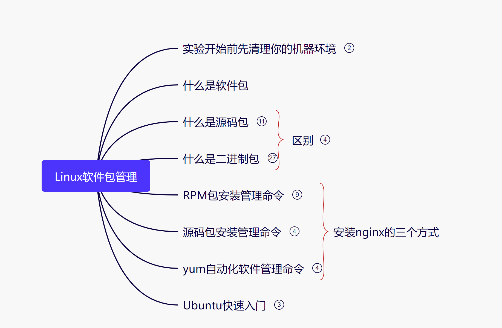

# 什么是软件，代码


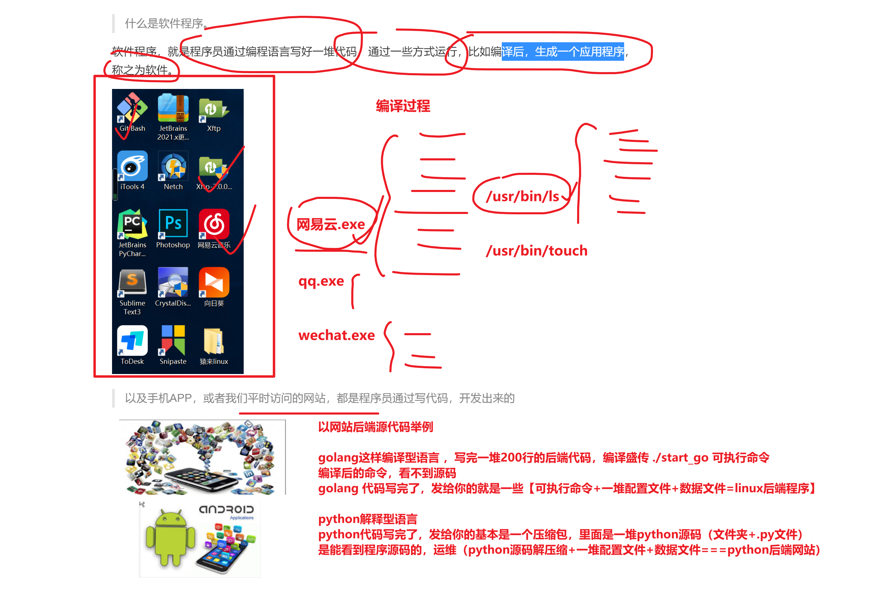

```
软件包顾名思义就是将应用程序、配置文件和数据打包的产物=======nginx_v.10.rpm

yum install nginx -y =============  先下载 nginx.rpm 软件包 ，然后yum自动帮你去安装了这个包


/usr/bin/nginx
/etc/nginx/nginc.conf 配置文件，写了用于控制该软件不同功能的参数


centos,redhat =================  nginx-1.10.rpm
ubutnu ============nginx-1.10.deb


所有的linux发行版都采用了某种形式的软件包系统，这使得linux软件管理和在windows下一样方便，
suse、red hat、fedora,centos等发行版都是用rpm包
Debian和Ubuntu则使用nginx.deb格式的软件包。

mysql-5-3-4.rpm
redis-3-4-3.rpm
nginx2-3-2.rpm


```

## 关于源代码，编译的过程理解

```
1. 程序员写的代码，如 下代码，计算机是不认识的，只认识010101
print('hello world')

2.因此代码都是经过系统的一个编译器，进行，编译成机器语言，计算机才能执行的
比如有哪些编译器
c语言用的gcc编译器
golang语言用的golang编译器
上面这俩特点是，代码写完，需要用户，手动的进行 build ，将源码编译成一个二进制的命令（机器可识别的）
xxxxxxxxxxxxx
xxxxxxxxxxxxx
xxxxxxxxxxxxx
xxxxxxxxxxxxx

编译型语言，是吧上述所有代码，全部检测完毕后，生成另一个正确的二进制命令
代码写完后，编译器，自动可以检测出所有的语法问题，因此编译型语言不易出错

golang ,c c++ ，适用于开发系统级工具，比如 docker  k8s
比如linux操作系统


python 语言解释型语言（python编译器）
python一遍翻译程序员写的代码，一遍编译成机器认识的机器与语言

xxxxxxxxxxxxx ===============
xxxxxxxxxxxxx ===============
xxxxxxxxxxxxx ====代码出错了，程序直接崩溃
xxxxxxxxxxxxx


脚本型语言，如python很容易出错，代码自上而下，一行一行的去翻译
用在快速开发上，比如测试开发，运维开发，自动化开发
比如网站开发


```

# 体验下，编译过程，和解释过程

编译过程，体验hello world

```
1. 下载编译器，入门golang写代码，写golang，先得有编译器
golang.xx.rpm安装包

yum install golang -y 


# 程序源码如下
[root@167 test_go]# cat hello.go 
package main

import "fmt"

func main() {
	fmt.Println("hello world")
}


# 可以用2种方式去运行这个代码
# 如果你不编译，就必须要求机器上，得存在，对应的编译器
go run  hello.go  # 不生成二进制命令，直接底层编译后执行，看到效果


go build hello.go  # 生成二进制命令，源代码以及被写入到这个文件中了.

编译的好处，在于，该二进制命令，现在可以任意的丢到一个linux 统一是64位架构的机器上，可以直接运行
一次编译，到处运行（这也是docker的理念）


```

解释型过程，体验hello world

```
用2个语言
bash语言

python3语言


yum install python3 python3-devel -y


[root@167 test_go]# cat hello.py 
print ("你好 世界")


python想运行程序，必须要解释器存在机器上，然后才能执行


# python3是可以处理中文的
[root@167 test_go]# python3 hello.py
你好 世界


# python2是不能处理中文的
[root@yuchao-linux01 tmp]# python
python     python2    python2.7  
[root@yuchao-linux01 tmp]# python  hello.py
  File "hello.py", line 1
SyntaxError: Non-ASCII character '\xe4' in file hello.py on line 1, but no encoding declared; see http://www.python.org/peps/pep-0263.html for details
[root@yuchao-linux01 tmp]# 


用python的公司，必须要求你，在linux机器上，安装好这个环境，程序员写的python代码，才能运行。


```

# 编译和rpm包的区别

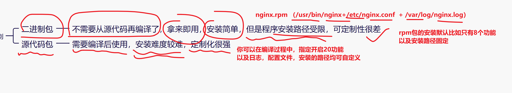

# 如何去下载mysql的rpm包

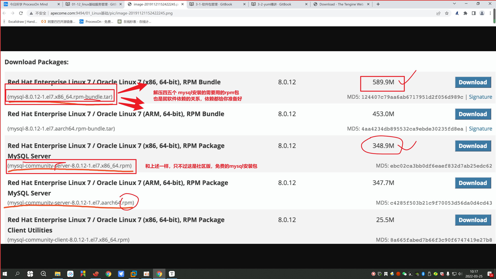


# 用本地光盘的形式，获取rpm包安装nginx

1.插入光驱

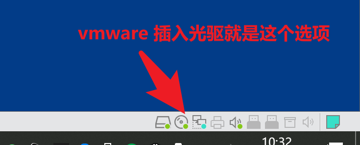

2.确认光驱，选择了本地镜像文件

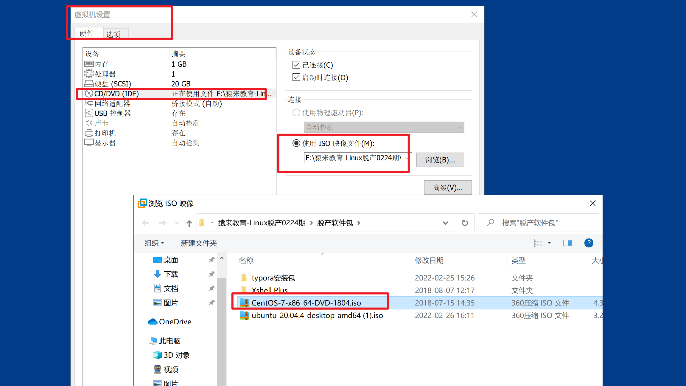


3.在linux中找到该光驱，然后挂载即可

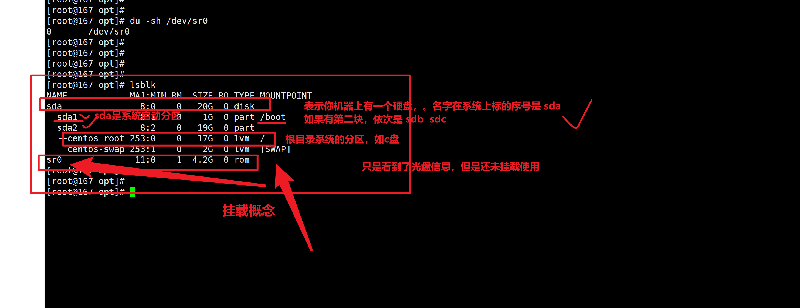


# 尝试解决rpm依赖报错的问题

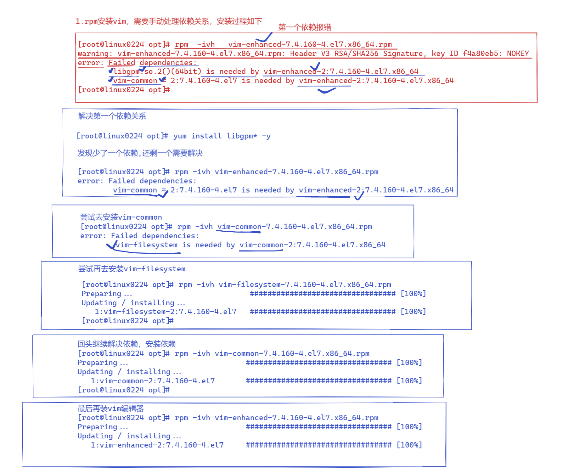

# rpm包升级软件

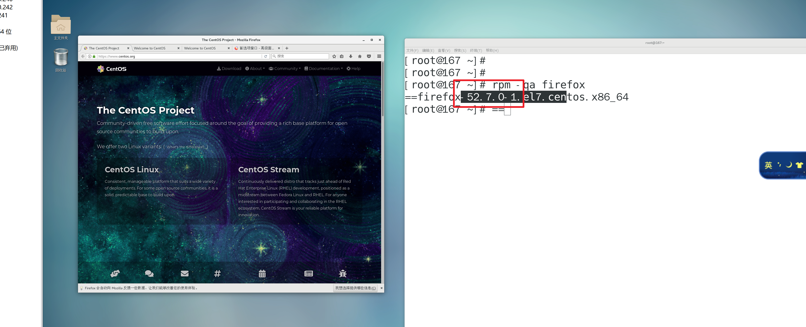


```
1.升级软件，获取新版的软件包
如何找到firewfox的rpm包，官网找，本地光盘找，去搜索引擎找


2.去官网中找新版本
如果软件升级的版本过大，里面会涉及很多的功能更新，说白了就是要再装一堆rpm包，无法手动管理
如果是小版本的升级 52.7  54.8 ，涉及依赖就会少很多
# 4.获取一个新版本，是52.7.3版本，只有一点点的升级，不会牵扯太多依赖关系
下载链接
http://ftp.pbone.net/mirror/ftp.scientificlinux.org/linux/scientific/7.2/x86_64/updates/security/firefox-52.7.3-1.el7_5.x86_64.rpm

# 5.在linux中下载
wget http://ftp.pbone.net/mirror/ftp.scientificlinux.org/linux/scientific/7.2/x86_64/updates/security/firefox-52.7.3-1.el7_5.x86_64.rpm


```


# rpm查询文件的文件信息

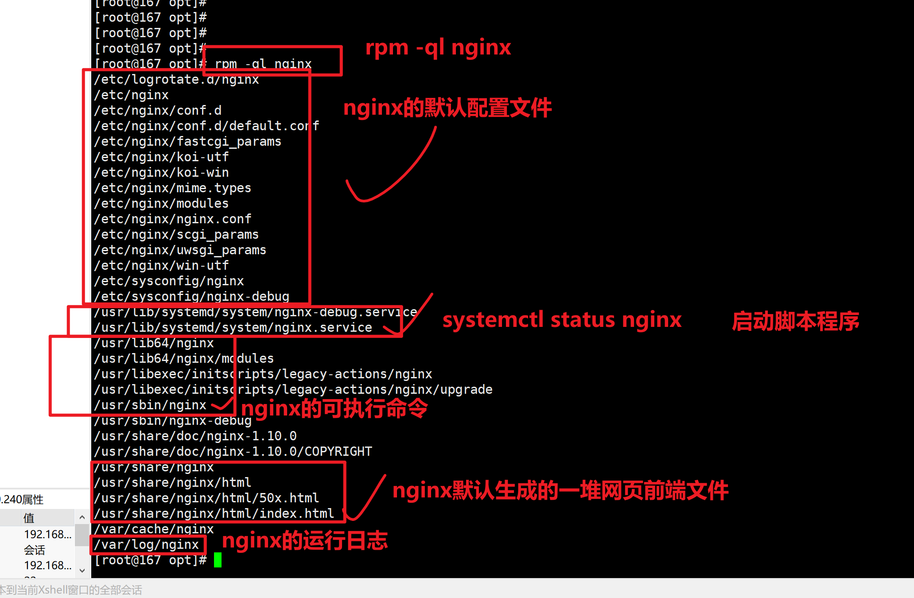


# 源代码编译（编译三部曲）


# yum


# 注意环境冲突

安装软件有3种方式，搞清楚他们

```
./configure  --prefix=/opt/my_nginx0224/  --with-http_ssl_module 

```

# yum命令学习

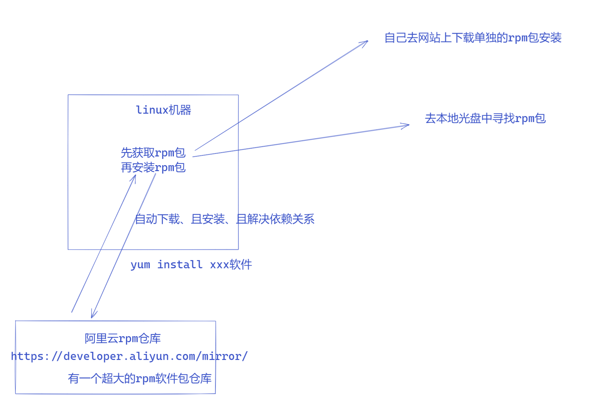


